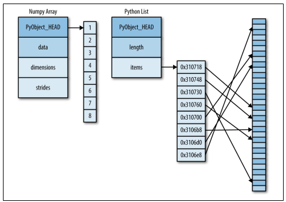
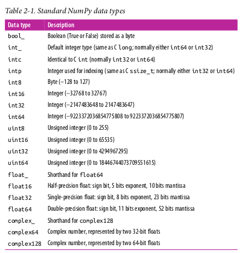

================
by Jawad Haider
# **Chpt 1 - Introduction to Numpy**

# 00 - Understanding Data Types in Python
------------------------------------------------------------------------

- <a href="#understanding-data-types-in-python"
  id="toc-understanding-data-types-in-python">Understanding Data Types in
  Python</a>
  - <a href="#a-python-integer-is-more-than-just-an-integer"
    id="toc-a-python-integer-is-more-than-just-an-integer">A Python Integer
    Is More Than Just an Integer</a>
  - <a href="#a-python-list-is-more-than-just-a-list"
    id="toc-a-python-list-is-more-than-just-a-list">A Python List Is More
    Than Just a List</a>
  - <a href="#fixed-typed-arrays-in-python"
    id="toc-fixed-typed-arrays-in-python">Fixed typed Arrays in Python</a>
  - <a href="#creating-arrays-from-scratch"
    id="toc-creating-arrays-from-scratch">Creating Arrays from Scratch</a>
  - <a href="#numpy-standard-data-types"
    id="toc-numpy-standard-data-types">NumPy Standard Data Types</a>
- <a href="#next-basics-of-numpy-arrays"
  id="toc-next-basics-of-numpy-arrays">Next: Basics of NumPy Arrays</a>

------------------------------------------------------------------------

# Understanding Data Types in Python

Users of Python are often drawn in by its ease of use, one piece of
which is dynamic typing. While a statically typed language like C or
Java requires each variable to be explicitly declared, a dynamically
typed language like Python skips this specification.

## A Python Integer Is More Than Just an Integer

`struct _longobject { long ob_refcnt; PyTypeObject *ob_type; size_t ob_size; long ob_digit[1]; };`

A single integer in Python 3.4 actually contains four pieces:  
• ob_refcnt, a reference count that helps Python silently handle memory
allocation and deallocation  
• ob_type, which encodes the type of the variable  
• ob_size, which specifies the size of the following data members  
• ob_digit, which contains the actual integer value that we expect the
Python variable to represent

## A Python List Is More Than Just a List

``` python
l1= list(range(10))
l1
```

    [0, 1, 2, 3, 4, 5, 6, 7, 8, 9]

``` python
type(l1[0])
```

    int

``` python
l2=list(str(i) for i in range(10))
l2
```

    ['0', '1', '2', '3', '4', '5', '6', '7', '8', '9']

``` python
type(l2[0])
```

    str

``` python
# Becaause of the dynamically typing our list can even be heterogenious
l3=[True, 3.146,7,"Name"]
[type(i) for i in l3]
```

    [bool, float, int, str]

But this flexibility comes at a cost: to allow these flexible types,
each item in the list must contain its own type info, reference count,
and other information—that is, each item is a complete Python object. In
the special case that all variables are of the same type, much of this
information is redundant: it can be much more efficient to store data in
a fixed-type array. The difference between a dynamic-type list and a
fixed-type (NumPy-style) array given below 

At the implementation level, the array essentially contains a single
pointer to one con‐ tiguous block of data. The Python list, on the other
hand, contains a pointer to a block of pointers, each of which in turn
points to a full Python object like the Python integer we saw earlier.
Again, the advantage of the list is flexibility: because each list
element is a full structure containing both data and type information,
the list can be filled with data of any desired type. Fixed-type
NumPy-style arrays lack this flexibil‐ ity, but are much more efficient
for storing and manipulating data

## Fixed typed Arrays in Python

Much more useful, however, is the ndarray object of the NumPy package.
While Python’s array object provides efficient storage of array-based
data, NumPy adds to this efficient operations on that data.

``` python
import array 
l=list(range(10))
a=array.array('i',l) #Here 'i' is a type code indicating the contents are integers
a
```

    array('i', [0, 1, 2, 3, 4, 5, 6, 7, 8, 9])

``` python
type(a)
```

    array.array

We’ll start with the standard NumPy import, under the alias np: \##
Creating Arrays from Python Lists

``` python
import numpy as np
```

``` python
# Integer array
np.array([1,2,3,4,5,6])
```

    array([1, 2, 3, 4, 5, 6])

``` python
np.array([1,2,3,4,5,6],dtype='float32') # Explicitly set the data type of the resulting array
```

    array([1., 2., 3., 4., 5., 6.], dtype=float32)

``` python
# Nested list results in multi-dimensional arrays
check=np.array([[[1,3,5],[2,4,6]],[[3,7,11],[0,0,0]]])
check
```

    array([[[ 1,  3,  5],
            [ 2,  4,  6]],

           [[ 3,  7, 11],
            [ 0,  0,  0]]])

``` python
check.shape
```

    (2, 2, 3)

``` python
np.array([range(i,i+3) for i in [2,4,6]])
```

    array([[2, 3, 4],
           [4, 5, 6],
           [6, 7, 8]])

## Creating Arrays from Scratch

Especially for larger arrays, it is more efficient to create arrays from
scratch using rou‐ tines built into NumPy

``` python
# Create a length-10 integer array filled with zeros
np.zeros(10,dtype=int)
```

    array([0, 0, 0, 0, 0, 0, 0, 0, 0, 0])

``` python
# Create a 2,3 flaot matrix filled with zeros
np.zeros((2,3),dtype=float)
```

    array([[0., 0., 0.],
           [0., 0., 0.]])

``` python
# Create a length-5 array filled with ones
np.ones(5)
```

    array([1., 1., 1., 1., 1.])

``` python
# Create a 4x3 matrix filled with ones
np.ones((4,3),dtype=int)
```

    array([[1, 1, 1],
           [1, 1, 1],
           [1, 1, 1],
           [1, 1, 1]])

``` python
# Create a 4x3 matrix filled with the given number
np.full((3,3),7)
```

    array([[7, 7, 7],
           [7, 7, 7],
           [7, 7, 7]])

``` python
# Create an array filled with a linear sequence
# Starting at 0, ending at 20, stepping by 2
# (this is similar to the built-in range() function)
np.arange(0,20,2)
```

    array([ 0,  2,  4,  6,  8, 10, 12, 14, 16, 18])

``` python
# Create an array of five values evenly spaced between 0 and 1
np.linspace(0,1,5)
```

    array([0.  , 0.25, 0.5 , 0.75, 1.  ])

``` python
# Create a 3x3 array of uniformly distributed
# random values between 0 and 1

np.random.random((3,3))
```

    array([[0.32813402, 0.33063616, 0.13412605],
           [0.41941497, 0.97530927, 0.04965349],
           [0.00563929, 0.26416415, 0.84203272]])

``` python
# Create a 3x3 array of normally distributed random values
# with mean 0 and standard deviation 1
np.random.normal(0,1,(3,3))
```

    array([[ 1.08133877, -1.1355389 ,  1.04280763],
           [ 0.91102377,  0.77094415,  0.14660595],
           [ 2.32307703,  0.69711284,  1.26467304]])

``` python
# Create a 3x3 array of random integers in the interval [0, 10)
np.random.randint(0,10,(3,3))
```

    array([[2, 4, 8],
           [5, 8, 1],
           [5, 8, 3]])

``` python
# Create a 3x3 identity matrix
np.eye(3)
```

    array([[1., 0., 0.],
           [0., 1., 0.],
           [0., 0., 1.]])

``` python
# Create an uninitialized array of three integers
# The values will be whatever happens to already exist at that
# memory location
np.empty(3)
```

    array([1., 1., 1.])

## NumPy Standard Data Types

NumPy arrays contain values of a single type, so it is important to have
detailed knowledge of those types and their limitations. Because NumPy
is built in C, the types will be familiar to users of C, Fortran, and
other related languages.



``` python
np.zeros(5, dtype='int16')
```

    array([0, 0, 0, 0, 0], dtype=int16)

``` python
np.zeros(5,dtype=np.int16)
```

    array([0, 0, 0, 0, 0], dtype=int16)

# Next: Basics of NumPy Arrays

page 42
