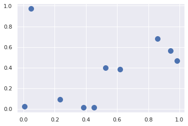
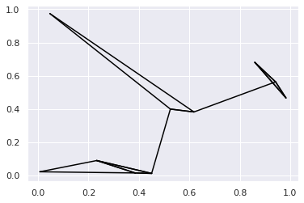

Notes [book] Data Science Handbook
================
by Jawad Haider
# **Chpt 1 - Introduction to Numpy**

# 07 -  Sorting Arrays

------------------------------------------------------------------------

- <a href="#sorting-arrays" id="toc-sorting-arrays">Sorting Arrays</a>
  - <a href="#fast-sorting-in-numpy-np.sort-and-np.argsort"
    id="toc-fast-sorting-in-numpy-np.sort-and-np.argsort">Fast Sorting in
    NumPy: np.sort and np.argsort</a>
    - <a href="#sorting-along-rows-or-columns"
      id="toc-sorting-along-rows-or-columns">Sorting along rows or columns</a>
  - <a href="#partial-sorts-partitioning"
    id="toc-partial-sorts-partitioning">Partial Sorts: Partitioning</a>
  - <a href="#example-k-nearest-neighbors"
    id="toc-example-k-nearest-neighbors">Example: k-Nearest Neighbors</a>

------------------------------------------------------------------------

# Sorting Arrays

Up to this point we have been concerned mainly with tools to access and
operate on array data with NumPy. This section covers algorithms related
to sorting values in NumPy arrays. These algorithms are a favorite topic
in introductory computer sci‐ ence courses: if you’ve ever taken one,
you probably have had dreams (or, depending on your temperament,
nightmares) about insertion sorts, selection sorts, merge sorts, quick
sorts, bubble sorts, and many, many more. All are means of accomplishing
a similar task: sorting the values in a list or array.

``` python
# Selection sort
import numpy as np
def selection_sort(x):
    for i in range(len(x)):
        swap=i+np.argmin(x[i:])
        (x[i], x[swap])=(x[swap],x[i])
    return x


x=np.array([2,1,4,3,5])
selection_sort(x)
```

    array([1, 2, 3, 4, 5])

``` python
def bogosort(x):
    while np.any(x[:-1]>x[1:]):
        np.random.shuffle(x)
    return x


bogosort(x)
```

    array([1, 2, 3, 4, 5])

## Fast Sorting in NumPy: np.sort and np.argsort

Although Python has built-in sort and sorted functions to work with
lists, we won’t discuss them here because NumPy’s np.sort function turns
out to be much more efficient and useful for our purposes. By default
np.sort uses an � N log N , quick‐ sort algorithm, though mergesort and
heapsort are also available. For most applica‐ tions, the default
quicksort is more than sufficient.

``` python
x=np.array([2,1,4,3,5,9,6,7,8])
np.sort(x)
```

    array([1, 2, 3, 4, 5, 6, 7, 8, 9])

``` python
#the sort method of array
x.sort()
x
```

    array([1, 2, 3, 4, 5, 6, 7, 8, 9])

***A related function is argsort, which instead returns the indices of
the sorted elements:***

``` python
x=np.array([2,1,4,3,5,9,6,7,8])
i=np.argsort(x)
i
```

    array([1, 0, 3, 2, 4, 6, 7, 8, 5])

``` python
# Now we can employ the fancy indexing to apply this index to sort the array
x[i]
```

    array([1, 2, 3, 4, 5, 6, 7, 8, 9])

### Sorting along rows or columns

A useful feature of NumPy’s sorting algorithms is the ability to sort
along specific rows or columns of a multidimensional array using the
axis argument.

``` python
rand = np.random.RandomState(42)
X= rand.randint(0,10,(4,6))
X
```

    array([[6, 3, 7, 4, 6, 9],
           [2, 6, 7, 4, 3, 7],
           [7, 2, 5, 4, 1, 7],
           [5, 1, 4, 0, 9, 5]])

``` python
# TO sort each column of X
np.sort(X, axis=0)
```

    array([[2, 1, 4, 0, 1, 5],
           [5, 2, 5, 4, 3, 7],
           [6, 3, 7, 4, 6, 7],
           [7, 6, 7, 4, 9, 9]])

``` python
# TO sort each row of X
np.sort(X, axis=1)
```

    array([[3, 4, 6, 6, 7, 9],
           [2, 3, 4, 6, 7, 7],
           [1, 2, 4, 5, 7, 7],
           [0, 1, 4, 5, 5, 9]])

***Keep in mind that this treats each row or column as an independent
array, and any relationships between the row or column values will be
lost!***

## Partial Sorts: Partitioning

Sometimes we’re not interested in sorting the entire array, but simply
want to find the K smallest values in the array. NumPy provides this in
the np.partition function.

``` python
x=np.array([7,2,3,1,6,5,4])
np.partition(x,3)
```

    array([2, 1, 3, 4, 6, 5, 7])

**Similarly to sorting, we can partition along an arbitrary axis of a
multidimensional array:**

``` python
np.partition(X,2,axis=1)
```

    array([[3, 4, 6, 7, 6, 9],
           [2, 3, 4, 7, 6, 7],
           [1, 2, 4, 5, 7, 7],
           [0, 1, 4, 5, 9, 5]])

``` python
X
```

    array([[6, 3, 7, 4, 6, 9],
           [2, 6, 7, 4, 3, 7],
           [7, 2, 5, 4, 1, 7],
           [5, 1, 4, 0, 9, 5]])

## Example: k-Nearest Neighbors

Let’s quickly see how we might use this argsort function along multiple
axes to find the nearest neighbors of each point in a set.

``` python
X=rand.rand(10,2)
X
```

    array([[0.00706631, 0.02306243],
           [0.52477466, 0.39986097],
           [0.04666566, 0.97375552],
           [0.23277134, 0.09060643],
           [0.61838601, 0.38246199],
           [0.98323089, 0.46676289],
           [0.85994041, 0.68030754],
           [0.45049925, 0.01326496],
           [0.94220176, 0.56328822],
           [0.3854165 , 0.01596625]])

``` python
%matplotlib inline
import matplotlib.pyplot as plt
import seaborn; seaborn.set()
plt.scatter(X[:,0],X[:,1],s=100);
```



``` python
X[:,np.newaxis,:].shape
```

    (10, 1, 2)

``` python
X[np.newaxis,:,:].shape
```

    (1, 10, 2)

``` python
np.sum((X[:,np.newaxis,:] - X[np.newaxis,:,:])**2, axis=1)
```

    array([[3.58879608, 2.10035624],
           [1.11234028, 0.97393943],
           [3.21004462, 4.71429169],
           [1.85007077, 1.68955454],
           [1.2368154 , 0.96342078],
           [3.39460409, 1.07078426],
           [2.36761815, 1.97878248],
           [1.13827476, 2.16752178],
           [3.01908822, 1.36825955],
           [1.25169759, 2.14881166]])

``` python
# Break downing the above code
difference =X[:,np.newaxis,:]- X[np.newaxis,:,:]
difference.shape
```

    (10, 10, 2)

``` python
square= difference**2
square.shape
```

    (10, 10, 2)

``` python
dist_sqr=square.sum(-1)
dist_sqr
```

    array([[0.        , 0.40999909, 0.90538547, 0.05550496, 0.50287983,
            1.14976739, 1.15936537, 0.19672877, 1.16632222, 0.14319923],
           [0.40999909, 0.        , 0.55794316, 0.18090431, 0.00906581,
            0.21465798, 0.19098635, 0.15497331, 0.20095384, 0.16679585],
           [0.90538547, 0.55794316, 0.        , 0.81458763, 0.67649219,
            1.13419594, 0.74752753, 1.08562368, 0.9704683 , 1.03211241],
           [0.05550496, 0.18090431, 0.81458763, 0.        , 0.23387834,
            0.70468321, 0.74108843, 0.05338715, 0.72671958, 0.0288717 ],
           [0.50287983, 0.00906581, 0.67649219, 0.23387834, 0.        ,
            0.14021843, 0.1470605 , 0.16449241, 0.13755476, 0.18859392],
           [1.14976739, 0.21465798, 1.13419594, 0.70468321, 0.14021843,
            0.        , 0.06080186, 0.48946337, 0.01100053, 0.56059965],
           [1.15936537, 0.19098635, 0.74752753, 0.74108843, 0.1470605 ,
            0.06080186, 0.        , 0.61258786, 0.02046045, 0.66652228],
           [0.19672877, 0.15497331, 1.08562368, 0.05338715, 0.16449241,
            0.48946337, 0.61258786, 0.        , 0.54429694, 0.00424306],
           [1.16632222, 0.20095384, 0.9704683 , 0.72671958, 0.13755476,
            0.01100053, 0.02046045, 0.54429694, 0.        , 0.60957115],
           [0.14319923, 0.16679585, 1.03211241, 0.0288717 , 0.18859392,
            0.56059965, 0.66652228, 0.00424306, 0.60957115, 0.        ]])

``` python
dist_sqr.diagonal()
```

    array([0., 0., 0., 0., 0., 0., 0., 0., 0., 0.])

``` python
nearest = np.argsort(dist_sqr, axis=1)
nearest
```

    array([[0, 3, 9, 7, 1, 4, 2, 5, 6, 8],
           [1, 4, 7, 9, 3, 6, 8, 5, 0, 2],
           [2, 1, 4, 6, 3, 0, 8, 9, 7, 5],
           [3, 9, 7, 0, 1, 4, 5, 8, 6, 2],
           [4, 1, 8, 5, 6, 7, 9, 3, 0, 2],
           [5, 8, 6, 4, 1, 7, 9, 3, 2, 0],
           [6, 8, 5, 4, 1, 7, 9, 3, 2, 0],
           [7, 9, 3, 1, 4, 0, 5, 8, 6, 2],
           [8, 5, 6, 4, 1, 7, 9, 3, 2, 0],
           [9, 7, 3, 0, 1, 4, 5, 8, 6, 2]])

By using a full sort here, we’ve actually done more work than we need to
in this case. If we’re simply interested in the nearest k neighbors, all
we need is to partition each row so that the smallest k + 1 squared
distances come first, with larger distances fill‐ ing the remaining
positions of the array. We can do this with the np.argpartition
function:

``` python
k=2
nearest_partition = np.argpartition(dist_sqr, k+1, axis=1)
nearest_partition
```

    array([[3, 0, 9, 7, 1, 4, 2, 5, 8, 6],
           [1, 4, 7, 9, 3, 5, 6, 2, 8, 0],
           [2, 1, 4, 6, 3, 0, 5, 7, 8, 9],
           [3, 9, 7, 0, 1, 5, 6, 2, 8, 4],
           [1, 8, 4, 5, 7, 6, 9, 3, 2, 0],
           [5, 8, 6, 4, 1, 7, 9, 3, 2, 0],
           [6, 8, 5, 4, 1, 7, 9, 3, 2, 0],
           [7, 9, 3, 1, 4, 5, 6, 2, 8, 0],
           [8, 5, 6, 4, 1, 7, 9, 3, 2, 0],
           [3, 9, 7, 0, 1, 5, 6, 2, 8, 4]])

``` python
plt.scatter(X[:,0],X[:,1],s=100)
```

    <matplotlib.collections.PathCollection at 0x7f51448d7e80>


``` python
# Draw the lines from each point to its two nearest neighbors
k=2 
for i in range(X.shape[0]):
    for j in nearest_partition[i,:k+1]:
        plt.plot(*zip(X[j],X[i]), color='black')
```


