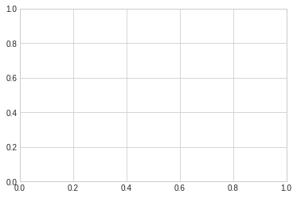
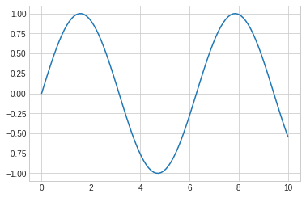
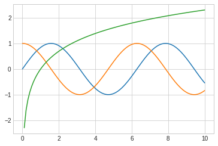
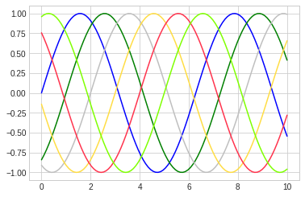
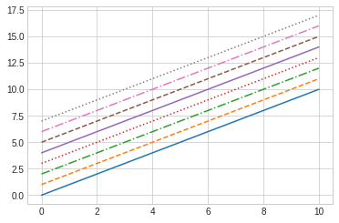
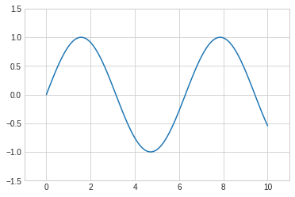
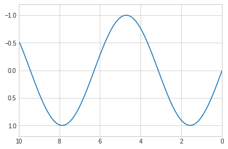
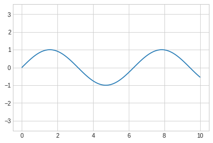
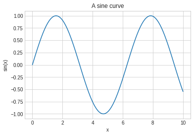
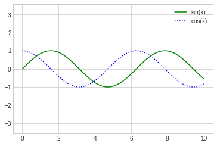

================
by Jawad Haider
# **Chpt 4 - Visualization with Matplotlib**

# 02 -  Simple Line Plots
------------------------------------------------------------------------

- <a href="#simple-line-plots" id="toc-simple-line-plots">Simple Line
  Plots</a>
  - <a href="#adjusting-the-plot-line-colors-and-styles"
    id="toc-adjusting-the-plot-line-colors-and-styles">Adjusting the Plot:
    Line Colors and Styles</a>
  - <a href="#adjusting-the-plot-axes-limits"
    id="toc-adjusting-the-plot-axes-limits">Adjusting the Plot: Axes
    Limits</a>
  - <a href="#labeling-plots" id="toc-labeling-plots">Labeling Plots</a>

------------------------------------------------------------------------
# Simple Line Plots

Perhaps the simplest of all plots is the visualization of a single
function y = f x . Here we will take a first look at creating a simple
plot of this type.

``` python
%matplotlib inline
import matplotlib.pyplot as plt
plt.style.use("seaborn-whitegrid")
import numpy as np
```

``` python
# all Matplotlib plots can be started by creating a figure and an axes
# their simplist form
fig=plt.figure()
ax=plt.axes()
```



**In Matplotlib, the *figure* (an instance of the class plt.Figure) can
be thought of as a single container that contains all the objects
representing axes, graphics, text, and labels. The *axes* (an instance
of the class plt.Axes) is what we see above: a bounding box with ticks
and labels, which will eventually contain the plot elements that make up
our visualization.**

``` python
#Once we have created an axes, we can use the ax.plot function to plot some data.
fig=plt.figure()
ax=plt.axes()
x = np.linspace(0,10,100)
ax.plot(x, np.sin(x))
```



**Alternatively, we can use the pylab interface and let the figure and
axes be created for us in the background**

``` python
fig=plt.figure()
ax=plt.axes()
plt.plot(x,np.sin(x))
```


If we want to create a single figure with multiple lines, we can simply
call the plot function multiple times

``` python
fig=plt.figure()
ax=plt.axes()
plt.plot(x,np.sin(x))
plt.plot(x,np.cos(x))
# plt.plot(x,np.tan(x))
plt.plot(x,np.log(x))
```

    /tmp/ipykernel_58842/3301612854.py:6: RuntimeWarning: divide by zero encountered in log
      plt.plot(x,np.log(x))



## Adjusting the Plot: Line Colors and Styles

The first adjustment you might wish to make to a plot is to control the
line colors and styles. The plt.plot() function takes additional
arguments that can be used to spec‐ ify these. To adjust the color, you
can use the color keyword, which accepts a string argument representing
virtually any imaginable color. The color can be specified in a variety
of ways

``` python
plt.plot(x, np.sin(x - 0), color='blue')
# specify color by name
plt.plot(x, np.sin(x - 1), color='g')
# short color code (rgbcmyk)
plt.plot(x, np.sin(x - 2), color='0.75')
# Grayscale between 0 and 1
plt.plot(x, np.sin(x - 3), color='#FFDD44')
# Hex code (RRGGBB from 00 to FF)
plt.plot(x, np.sin(x - 4), color=(1.0,0.2,0.3)) # RGB tuple, values 0 and 1
plt.plot(x, np.sin(x - 5), color='chartreuse'); # all HTML color names supported
```



\*If no color is specified, Matplotlib will automatically cycle through
a set of default colors for multiple lines.

similarly, you can adjust the line style using linestyle keyword\*

``` python
plt.plot(x, x + 0, linestyle='solid')
plt.plot(x, x + 1, linestyle='dashed')
plt.plot(x, x + 2, linestyle='dashdot')
plt.plot(x, x + 3, linestyle='dotted');
# For short, you can use the following codes:
plt.plot(x, x + 4, linestyle='-') # solid
plt.plot(x, x + 5, linestyle='--') # dashed
plt.plot(x, x + 6, linestyle='-.') # dashdot
plt.plot(x, x + 7, linestyle=':'); # dotted
```



*If you would like to be extremely terse, these linestyle and color
codes can be com‐ bined into a single nonkeyword argument to the
plt.plot() function*

## Adjusting the Plot: Axes Limits

Matplotlib does a decent job of choosing default axes limits for your
plot, but some‐ times it’s nice to have finer control. The most basic
way to adjust axis limits is to use the plt.xlim() and plt.ylim()
methods

``` python
plt.plot(x, np.sin(x))
plt.xlim(-1,11)
plt.ylim(-1.5,1.5)
```

    (-1.5, 1.5)



*if for some reason you’d like either axis to be displayed in reverse,
you can simply reverse the order of the arguments*

``` python
plt.plot(x, np.sin(x))

plt.xlim(10,0)
plt.ylim(1.2,-1.2)
```

    (1.2, -1.2)



*A useful related method is `plt.axis()` (note here the potential
confusion between axes with an e, and axis with an i). The `plt.axis()`
method allows you to set the x and y limits with a single call, by
passing a list that specifies `[xmin, xmax, ymin,ymax]`*

``` python
plt.plot(x, np.sin(x))
plt.axis([-1, 11, -1.5, 1.5]);
```


The plt.axis() method goes even beyond this, allowing you to do things
like auto‐ matically tighten the bounds around the current plot

``` python
plt.plot(x, np.sin(x))
plt.axis('tight');
```


It allows even higher-level specifications, such as ensuring an equal
aspect ratio so that on your screen, one unit in x is equal to one unit
in y

``` python
plt.plot(x, np.sin(x))
plt.axis('equal');
```



## Labeling Plots

As the last piece of this section, we’ll briefly look at the labeling of
plots: titles, axis labels, and simple legends. Titles and axis labels
are the simplest such labels—there are methods that can be used to
quickly set them

``` python
plt.plot(x, np.sin(x))
plt.title('A sine curve')
plt.xlabel('x')
plt.ylabel('sin(x)')
```

    Text(0, 0.5, 'sin(x)')



When multiple lines are being shown within a single axes, it can be
useful to create a plot legend that labels each line type. Again,
Matplotlib has a built-in way of quickly creating such a legend. It is
done via the (you guessed it) plt.legend() method. Though there are
several valid ways of using this, I find it easiest to specify the label
of each line using the label keyword of the plot function

``` python
plt.plot(x, np.sin(x), '-g', label='sin(x)')
plt.plot(x, np.cos(x), ':b', label='cos(x)')
plt.axis('equal')

plt.legend();
```


