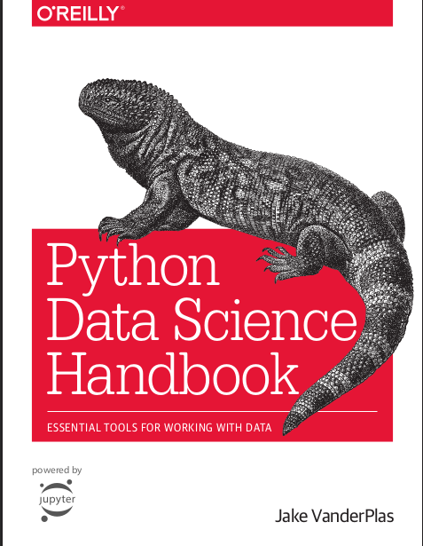

# Data Science Handbook  
 by _Jake VanderPlas_  

This is a great book to refer when using any of the Data Science python libraries and Traditional ML algorithm implementation.

> The book's [website](https://jakevdp.github.io/PythonDataScienceHandbook/) **a great source** and the [github repo](https://github.com/jakevdp/PythonDataScienceHandbook) for **the great notebooks...** go there for more fruits ! :backpack:

## Table of content:
*Jump to any section you want*  

1. [Chapter 1: Introduction to Numpy](https://qalmaqihir.github.io/booksnotes/pythonDataScienceHandBook/chpt2_Introduction_to_NumPy/00_Understanding_Data_Types_in_Python/)

2. [Chapter 2: Data Manipulation with Pandas](https://qalmaqihir.github.io/booksnotes/pythonDataScienceHandBook/chpt3_Data_Manipulation_with_Pandas/01_Introduction%20to%20Pandas%20Objects/)

3. [Chapter 3: Visualization with Matplotlib](https://qalmaqihir.github.io/booksnotes/pythonDataScienceHandBook/chpt4_Visualization%20with%20Matplotlib/01general%20Matplotlib%20tips/)

4. [Chapter 4: Machine Learning](https://qalmaqihir.github.io/booksnotes/pythonDataScienceHandBook/)

