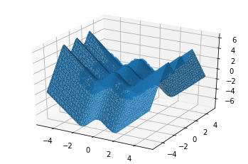

Tensorflow BootCamp - ANN MNIST Regression
================
by Jawad Haider

``` python
# Install TensorFlow
# !pip install -q tensorflow-gpu==2.0.0-beta1

try:
  %tensorflow_version 2.x  # Colab only.
except Exception:
  pass

import tensorflow as tf
print(tf.__version__)
```

    2.0.0-beta1

``` python
# Other imports
import numpy as np
import matplotlib.pyplot as plt
from mpl_toolkits.mplot3d import Axes3D
```

``` python
# Make the dataset
N = 1000
X = np.random.random((N, 2)) * 6 - 3 # uniformly distributed between (-3, +3)
Y = np.cos(2*X[:,0]) + np.cos(3*X[:,1])
```

This implements the function:

$$ y = \cos(2x_1) + cos(3x_2) $$

``` python
# Plot it
fig = plt.figure()
ax = fig.add_subplot(111, projection='3d')
ax.scatter(X[:,0], X[:,1], Y)
# plt.show()
```

    <mpl_toolkits.mplot3d.art3d.Path3DCollection at 0x7f2e953549e8>


``` python
# Build the model
model = tf.keras.models.Sequential([
  tf.keras.layers.Dense(128, input_shape=(2,), activation='relu'),
  tf.keras.layers.Dense(1)
])
```

``` python
# Compile and fit
opt = tf.keras.optimizers.Adam(0.01)
model.compile(optimizer=opt, loss='mse')
r = model.fit(X, Y, epochs=100)
```

    Train on 1000 samples
    Epoch 1/100
    1000/1000 [==============================] - 0s 493us/sample - loss: 0.9276
    Epoch 2/100
    1000/1000 [==============================] - 0s 58us/sample - loss: 0.9060
    Epoch 3/100
    1000/1000 [==============================] - 0s 68us/sample - loss: 0.8808
    Epoch 4/100
    1000/1000 [==============================] - 0s 54us/sample - loss: 0.8457
    Epoch 5/100
    1000/1000 [==============================] - 0s 57us/sample - loss: 0.8115
    Epoch 6/100
    1000/1000 [==============================] - 0s 59us/sample - loss: 0.7682
    Epoch 7/100
    1000/1000 [==============================] - 0s 59us/sample - loss: 0.6904
    Epoch 8/100
    1000/1000 [==============================] - 0s 58us/sample - loss: 0.6319
    Epoch 9/100
    1000/1000 [==============================] - 0s 51us/sample - loss: 0.5543
    Epoch 10/100
    1000/1000 [==============================] - 0s 58us/sample - loss: 0.5207
    Epoch 11/100
    1000/1000 [==============================] - 0s 54us/sample - loss: 0.4973
    Epoch 12/100
    1000/1000 [==============================] - 0s 52us/sample - loss: 0.4889
    Epoch 13/100
    1000/1000 [==============================] - 0s 58us/sample - loss: 0.4715
    Epoch 14/100
    1000/1000 [==============================] - 0s 55us/sample - loss: 0.4714
    Epoch 15/100
    1000/1000 [==============================] - 0s 53us/sample - loss: 0.4387
    Epoch 16/100
    1000/1000 [==============================] - 0s 58us/sample - loss: 0.4519
    Epoch 17/100
    1000/1000 [==============================] - 0s 53us/sample - loss: 0.4498
    Epoch 18/100
    1000/1000 [==============================] - 0s 53us/sample - loss: 0.4180
    Epoch 19/100
    1000/1000 [==============================] - 0s 53us/sample - loss: 0.4163
    Epoch 20/100
    1000/1000 [==============================] - 0s 54us/sample - loss: 0.4128
    Epoch 21/100
    1000/1000 [==============================] - 0s 67us/sample - loss: 0.4110
    Epoch 22/100
    1000/1000 [==============================] - 0s 62us/sample - loss: 0.3984
    Epoch 23/100
    1000/1000 [==============================] - 0s 58us/sample - loss: 0.3825
    Epoch 24/100
    1000/1000 [==============================] - 0s 52us/sample - loss: 0.3734
    Epoch 25/100
    1000/1000 [==============================] - 0s 54us/sample - loss: 0.4398
    Epoch 26/100
    1000/1000 [==============================] - 0s 57us/sample - loss: 0.3796
    Epoch 27/100
    1000/1000 [==============================] - 0s 53us/sample - loss: 0.3603
    Epoch 28/100
    1000/1000 [==============================] - 0s 54us/sample - loss: 0.3120
    Epoch 29/100
    1000/1000 [==============================] - 0s 58us/sample - loss: 0.2797
    Epoch 30/100
    1000/1000 [==============================] - 0s 53us/sample - loss: 0.2815
    Epoch 31/100
    1000/1000 [==============================] - 0s 54us/sample - loss: 0.2600
    Epoch 32/100
    1000/1000 [==============================] - 0s 54us/sample - loss: 0.2221
    Epoch 33/100
    1000/1000 [==============================] - 0s 52us/sample - loss: 0.2036
    Epoch 34/100
    1000/1000 [==============================] - 0s 59us/sample - loss: 0.1905
    Epoch 35/100
    1000/1000 [==============================] - 0s 54us/sample - loss: 0.1502
    Epoch 36/100
    1000/1000 [==============================] - 0s 51us/sample - loss: 0.1368
    Epoch 37/100
    1000/1000 [==============================] - 0s 51us/sample - loss: 0.1300
    Epoch 38/100
    1000/1000 [==============================] - 0s 52us/sample - loss: 0.1043
    Epoch 39/100
    1000/1000 [==============================] - 0s 66us/sample - loss: 0.1022
    Epoch 40/100
    1000/1000 [==============================] - 0s 49us/sample - loss: 0.0823
    Epoch 41/100
    1000/1000 [==============================] - 0s 49us/sample - loss: 0.0787
    Epoch 42/100
    1000/1000 [==============================] - 0s 51us/sample - loss: 0.0593
    Epoch 43/100
    1000/1000 [==============================] - 0s 53us/sample - loss: 0.0528
    Epoch 44/100
    1000/1000 [==============================] - 0s 48us/sample - loss: 0.0616
    Epoch 45/100
    1000/1000 [==============================] - 0s 50us/sample - loss: 0.0351
    Epoch 46/100
    1000/1000 [==============================] - 0s 50us/sample - loss: 0.0273
    Epoch 47/100
    1000/1000 [==============================] - 0s 49us/sample - loss: 0.0288
    Epoch 48/100
    1000/1000 [==============================] - 0s 51us/sample - loss: 0.0281
    Epoch 49/100
    1000/1000 [==============================] - 0s 49us/sample - loss: 0.0362
    Epoch 50/100
    1000/1000 [==============================] - 0s 48us/sample - loss: 0.0585
    Epoch 51/100
    1000/1000 [==============================] - 0s 52us/sample - loss: 0.0842
    Epoch 52/100
    1000/1000 [==============================] - 0s 54us/sample - loss: 0.0780
    Epoch 53/100
    1000/1000 [==============================] - 0s 53us/sample - loss: 0.0700
    Epoch 54/100
    1000/1000 [==============================] - 0s 49us/sample - loss: 0.0232
    Epoch 55/100
    1000/1000 [==============================] - 0s 50us/sample - loss: 0.0149
    Epoch 56/100
    1000/1000 [==============================] - 0s 49us/sample - loss: 0.0159
    Epoch 57/100
    1000/1000 [==============================] - 0s 49us/sample - loss: 0.0140
    Epoch 58/100
    1000/1000 [==============================] - 0s 52us/sample - loss: 0.0108
    Epoch 59/100
    1000/1000 [==============================] - 0s 66us/sample - loss: 0.0088
    Epoch 60/100
    1000/1000 [==============================] - 0s 52us/sample - loss: 0.0077
    Epoch 61/100
    1000/1000 [==============================] - 0s 50us/sample - loss: 0.0132
    Epoch 62/100
    1000/1000 [==============================] - 0s 50us/sample - loss: 0.0108
    Epoch 63/100
    1000/1000 [==============================] - 0s 50us/sample - loss: 0.0105
    Epoch 64/100
    1000/1000 [==============================] - 0s 53us/sample - loss: 0.0077
    Epoch 65/100
    1000/1000 [==============================] - 0s 51us/sample - loss: 0.0084
    Epoch 66/100
    1000/1000 [==============================] - 0s 50us/sample - loss: 0.0101
    Epoch 67/100
    1000/1000 [==============================] - 0s 49us/sample - loss: 0.0093
    Epoch 68/100
    1000/1000 [==============================] - 0s 49us/sample - loss: 0.0082
    Epoch 69/100
    1000/1000 [==============================] - 0s 49us/sample - loss: 0.0076
    Epoch 70/100
    1000/1000 [==============================] - 0s 58us/sample - loss: 0.0145
    Epoch 71/100
    1000/1000 [==============================] - 0s 47us/sample - loss: 0.0127
    Epoch 72/100
    1000/1000 [==============================] - 0s 50us/sample - loss: 0.0101
    Epoch 73/100
    1000/1000 [==============================] - 0s 49us/sample - loss: 0.0058
    Epoch 74/100
    1000/1000 [==============================] - 0s 50us/sample - loss: 0.0051
    Epoch 75/100
    1000/1000 [==============================] - 0s 53us/sample - loss: 0.0053
    Epoch 76/100
    1000/1000 [==============================] - 0s 52us/sample - loss: 0.0073
    Epoch 77/100
    1000/1000 [==============================] - 0s 50us/sample - loss: 0.0065
    Epoch 78/100
    1000/1000 [==============================] - 0s 53us/sample - loss: 0.0066
    Epoch 79/100
    1000/1000 [==============================] - 0s 60us/sample - loss: 0.0202
    Epoch 80/100
    1000/1000 [==============================] - 0s 49us/sample - loss: 0.0130
    Epoch 81/100
    1000/1000 [==============================] - 0s 50us/sample - loss: 0.0093
    Epoch 82/100
    1000/1000 [==============================] - 0s 49us/sample - loss: 0.0149
    Epoch 83/100
    1000/1000 [==============================] - 0s 50us/sample - loss: 0.0147
    Epoch 84/100
    1000/1000 [==============================] - 0s 46us/sample - loss: 0.0085
    Epoch 85/100
    1000/1000 [==============================] - 0s 49us/sample - loss: 0.0048
    Epoch 86/100
    1000/1000 [==============================] - 0s 51us/sample - loss: 0.0041
    Epoch 87/100
    1000/1000 [==============================] - 0s 48us/sample - loss: 0.0041
    Epoch 88/100
    1000/1000 [==============================] - 0s 50us/sample - loss: 0.0106
    Epoch 89/100
    1000/1000 [==============================] - 0s 50us/sample - loss: 0.0112
    Epoch 90/100
    1000/1000 [==============================] - 0s 47us/sample - loss: 0.0051
    Epoch 91/100
    1000/1000 [==============================] - 0s 48us/sample - loss: 0.0121
    Epoch 92/100
    1000/1000 [==============================] - 0s 52us/sample - loss: 0.0384
    Epoch 93/100
    1000/1000 [==============================] - 0s 51us/sample - loss: 0.0463
    Epoch 94/100
    1000/1000 [==============================] - 0s 49us/sample - loss: 0.0190
    Epoch 95/100
    1000/1000 [==============================] - 0s 49us/sample - loss: 0.0340
    Epoch 96/100
    1000/1000 [==============================] - 0s 52us/sample - loss: 0.0133
    Epoch 97/100
    1000/1000 [==============================] - 0s 49us/sample - loss: 0.0062
    Epoch 98/100
    1000/1000 [==============================] - 0s 67us/sample - loss: 0.0043
    Epoch 99/100
    1000/1000 [==============================] - 0s 67us/sample - loss: 0.0050
    Epoch 100/100
    1000/1000 [==============================] - 0s 51us/sample - loss: 0.0045

``` python
# Plot the loss
plt.plot(r.history['loss'], label='loss')
```


``` python
# Plot the prediction surface
fig = plt.figure()
ax = fig.add_subplot(111, projection='3d')
ax.scatter(X[:,0], X[:,1], Y)

# surface plot
line = np.linspace(-3, 3, 50)
xx, yy = np.meshgrid(line, line)
Xgrid = np.vstack((xx.flatten(), yy.flatten())).T
Yhat = model.predict(Xgrid).flatten()
ax.plot_trisurf(Xgrid[:,0], Xgrid[:,1], Yhat, linewidth=0.2, antialiased=True)
plt.show()
```


``` python
# Can it extrapolate?
# Plot the prediction surface
fig = plt.figure()
ax = fig.add_subplot(111, projection='3d')
ax.scatter(X[:,0], X[:,1], Y)

# surface plot
line = np.linspace(-5, 5, 50)
xx, yy = np.meshgrid(line, line)
Xgrid = np.vstack((xx.flatten(), yy.flatten())).T
Yhat = model.predict(Xgrid).flatten()
ax.plot_trisurf(Xgrid[:,0], Xgrid[:,1], Yhat, linewidth=0.2, antialiased=True)
plt.show()
```



<center>

<a href=''>  </a>

</center>
<center>
<em>Copyright Qalmaqihir</em>
</center>
<center>
<em>For more information, visit us at
<a href='http://www.github.com/qalmaqihir/'>www.github.com/qalmaqihir/</a></em>
</center>
