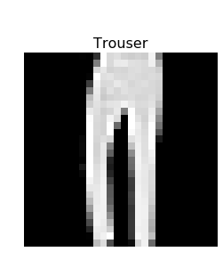
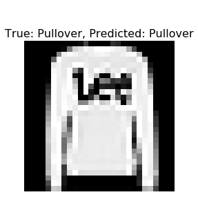
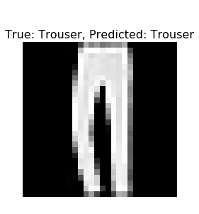

================
by Jawad Haider

- <a href="#serving" id="toc-serving">Serving</a>

## Serving

``` python
# Install TensorFlow
# !pip install -q tensorflow-gpu==2.0.0-beta1

try:
  %tensorflow_version 2.x  # Colab only.
except Exception:
  pass

import tensorflow as tf
print(tf.__version__)
```

    2.0.0-beta1

``` python
# By the way, what is a server / service / API?

# Best way to learn is by example
# Here is a service that simply returns your IP address in a JSON

import requests
r = requests.get('https://api.ipify.org?format=json')
j = r.json()
print(j)

# Our Tensorflow model server is the same, except what it does is much more
# complex - it returns the predictions from a ML model!
```

    {'ip': '35.224.223.54'}

``` python
# More imports
import numpy as np
import matplotlib.pyplot as plt
import os
import subprocess

from tensorflow.keras.layers import Input, Conv2D, Dense, Flatten, Dropout
from tensorflow.keras.models import Model
```

``` python
# Load in the data
fashion_mnist = tf.keras.datasets.fashion_mnist

(x_train, y_train), (x_test, y_test) = fashion_mnist.load_data()
x_train, x_test = x_train / 255.0, x_test / 255.0
print("x_train.shape:", x_train.shape)
print("x_test.shape:", x_test.shape)
```

    Downloading data from https://storage.googleapis.com/tensorflow/tf-keras-datasets/train-labels-idx1-ubyte.gz
    32768/29515 [=================================] - 0s 0us/step
    Downloading data from https://storage.googleapis.com/tensorflow/tf-keras-datasets/train-images-idx3-ubyte.gz
    26427392/26421880 [==============================] - 0s 0us/step
    Downloading data from https://storage.googleapis.com/tensorflow/tf-keras-datasets/t10k-labels-idx1-ubyte.gz
    8192/5148 [===============================================] - 0s 0us/step
    Downloading data from https://storage.googleapis.com/tensorflow/tf-keras-datasets/t10k-images-idx3-ubyte.gz
    4423680/4422102 [==============================] - 0s 0us/step
    x_train.shape: (60000, 28, 28)
    x_test.shape: (10000, 28, 28)

``` python
# the data is only 2D!
# convolution expects height x width x color
x_train = np.expand_dims(x_train, -1)
x_test = np.expand_dims(x_test, -1)
print(x_train.shape)
```

    (60000, 28, 28, 1)

``` python
# number of classes
K = len(set(y_train))
print("number of classes:", K)
```

    number of classes: 10

``` python
# Build the model using the functional API
i = Input(shape=x_train[0].shape)
x = Conv2D(32, (3, 3), strides=2, activation='relu')(i)
x = Conv2D(64, (3, 3), strides=2, activation='relu')(x)
x = Conv2D(128, (3, 3), strides=2, activation='relu')(x)
x = Flatten()(x)
x = Dropout(0.2)(x)
x = Dense(512, activation='relu')(x)
x = Dropout(0.2)(x)
x = Dense(K, activation='softmax')(x)

model = Model(i, x)
model.summary()
```

    Model: "model"
    _________________________________________________________________
    Layer (type)                 Output Shape              Param #   
    =================================================================
    input_1 (InputLayer)         [(None, 28, 28, 1)]       0         
    _________________________________________________________________
    conv2d (Conv2D)              (None, 13, 13, 32)        320       
    _________________________________________________________________
    conv2d_1 (Conv2D)            (None, 6, 6, 64)          18496     
    _________________________________________________________________
    conv2d_2 (Conv2D)            (None, 2, 2, 128)         73856     
    _________________________________________________________________
    flatten (Flatten)            (None, 512)               0         
    _________________________________________________________________
    dropout (Dropout)            (None, 512)               0         
    _________________________________________________________________
    dense (Dense)                (None, 512)               262656    
    _________________________________________________________________
    dropout_1 (Dropout)          (None, 512)               0         
    _________________________________________________________________
    dense_1 (Dense)              (None, 10)                5130      
    =================================================================
    Total params: 360,458
    Trainable params: 360,458
    Non-trainable params: 0
    _________________________________________________________________

``` python
# Compile and fit
# Note: make sure you are using the GPU for this!
model.compile(optimizer='adam',
              loss='sparse_categorical_crossentropy',
              metrics=['accuracy'])
r = model.fit(x_train, y_train, validation_data=(x_test, y_test), epochs=15)
```

    WARNING: Logging before flag parsing goes to stderr.
    W0810 04:12:02.177557 140535052928896 deprecation.py:323] From /usr/local/lib/python3.6/dist-packages/tensorflow/python/ops/math_grad.py:1250: add_dispatch_support.<locals>.wrapper (from tensorflow.python.ops.array_ops) is deprecated and will be removed in a future version.
    Instructions for updating:
    Use tf.where in 2.0, which has the same broadcast rule as np.where

    Train on 60000 samples, validate on 10000 samples
    Epoch 1/15
    60000/60000 [==============================] - 13s 211us/sample - loss: 0.5198 - accuracy: 0.8071 - val_loss: 0.3919 - val_accuracy: 0.8524
    Epoch 2/15
    60000/60000 [==============================] - 9s 153us/sample - loss: 0.3541 - accuracy: 0.8675 - val_loss: 0.3549 - val_accuracy: 0.8657
    Epoch 3/15
    60000/60000 [==============================] - 9s 152us/sample - loss: 0.3042 - accuracy: 0.8855 - val_loss: 0.3162 - val_accuracy: 0.8874
    Epoch 4/15
    60000/60000 [==============================] - 9s 152us/sample - loss: 0.2730 - accuracy: 0.8980 - val_loss: 0.2973 - val_accuracy: 0.8944
    Epoch 5/15
    60000/60000 [==============================] - 9s 153us/sample - loss: 0.2498 - accuracy: 0.9059 - val_loss: 0.3015 - val_accuracy: 0.8904
    Epoch 6/15
    60000/60000 [==============================] - 9s 153us/sample - loss: 0.2255 - accuracy: 0.9146 - val_loss: 0.2890 - val_accuracy: 0.8939
    Epoch 7/15
    60000/60000 [==============================] - 9s 152us/sample - loss: 0.2101 - accuracy: 0.9189 - val_loss: 0.3112 - val_accuracy: 0.8912
    Epoch 8/15
    60000/60000 [==============================] - 9s 155us/sample - loss: 0.1933 - accuracy: 0.9271 - val_loss: 0.2828 - val_accuracy: 0.9031
    Epoch 9/15
    60000/60000 [==============================] - 9s 154us/sample - loss: 0.1812 - accuracy: 0.9319 - val_loss: 0.3133 - val_accuracy: 0.8966
    Epoch 10/15
    60000/60000 [==============================] - 9s 155us/sample - loss: 0.1653 - accuracy: 0.9366 - val_loss: 0.3063 - val_accuracy: 0.9015
    Epoch 11/15
    60000/60000 [==============================] - 10s 158us/sample - loss: 0.1526 - accuracy: 0.9410 - val_loss: 0.3212 - val_accuracy: 0.9046
    Epoch 12/15
    60000/60000 [==============================] - 9s 152us/sample - loss: 0.1460 - accuracy: 0.9452 - val_loss: 0.3190 - val_accuracy: 0.9028
    Epoch 13/15
    60000/60000 [==============================] - 9s 152us/sample - loss: 0.1385 - accuracy: 0.9467 - val_loss: 0.3406 - val_accuracy: 0.9021
    Epoch 14/15
    60000/60000 [==============================] - 9s 153us/sample - loss: 0.1268 - accuracy: 0.9515 - val_loss: 0.3731 - val_accuracy: 0.9014
    Epoch 15/15
    60000/60000 [==============================] - 9s 154us/sample - loss: 0.1242 - accuracy: 0.9527 - val_loss: 0.3547 - val_accuracy: 0.9034

``` python
# Save the model to a temporary directory
import tempfile

MODEL_DIR = tempfile.gettempdir()
version = 1
export_path = os.path.join(MODEL_DIR, str(version))
print('export_path = {}\n'.format(export_path))
if os.path.isdir(export_path):
  print('\nAlready saved a model, cleaning up\n')
  !rm -r {export_path}

tf.saved_model.save(model, export_path)

print('\nSaved model:')
!ls -l {export_path}
```

    export_path = /tmp/1


    Saved model:
    total 144
    drwxr-xr-x 2 root root   4096 Aug 10 04:14 assets
    -rw-r--r-- 1 root root 136883 Aug 10 04:14 saved_model.pb
    drwxr-xr-x 2 root root   4096 Aug 10 04:14 variables

``` python
!saved_model_cli show --dir {export_path} --all
```


    MetaGraphDef with tag-set: 'serve' contains the following SignatureDefs:

    signature_def['__saved_model_init_op']:
      The given SavedModel SignatureDef contains the following input(s):
      The given SavedModel SignatureDef contains the following output(s):
        outputs['__saved_model_init_op'] tensor_info:
            dtype: DT_INVALID
            shape: unknown_rank
            name: NoOp
      Method name is: 

    signature_def['serving_default']:
      The given SavedModel SignatureDef contains the following input(s):
        inputs['input_1'] tensor_info:
            dtype: DT_FLOAT
            shape: (-1, 28, 28, 1)
            name: serving_default_input_1:0
      The given SavedModel SignatureDef contains the following output(s):
        outputs['dense_1'] tensor_info:
            dtype: DT_FLOAT
            shape: (-1, 10)
            name: StatefulPartitionedCall:0
      Method name is: tensorflow/serving/predict

``` python
# This is the same as you would do from your command line, but without the [arch=amd64], and no sudo
# You would instead do:
# echo "deb [arch=amd64] http://storage.googleapis.com/tensorflow-serving-apt stable tensorflow-model-server tensorflow-model-server-universal" | sudo tee /etc/apt/sources.list.d/tensorflow-serving.list && \
# curl https://storage.googleapis.com/tensorflow-serving-apt/tensorflow-serving.release.pub.gpg | sudo apt-key add -

!echo "deb http://storage.googleapis.com/tensorflow-serving-apt stable tensorflow-model-server tensorflow-model-server-universal" | tee /etc/apt/sources.list.d/tensorflow-serving.list && \
curl https://storage.googleapis.com/tensorflow-serving-apt/tensorflow-serving.release.pub.gpg | apt-key add -
!apt update
```

    deb http://storage.googleapis.com/tensorflow-serving-apt stable tensorflow-model-server tensorflow-model-server-universal
      % Total    % Received % Xferd  Average Speed   Time    Time     Time  Current
                                     Dload  Upload   Total   Spent    Left  Speed
    100  2943  100  2943    0     0  10819      0 --:--:-- --:--:-- --:--:-- 10819
    OK
    Get:1 http://storage.googleapis.com/tensorflow-serving-apt stable InRelease [3,012 B]
    Get:2 https://cloud.r-project.org/bin/linux/ubuntu bionic-cran35/ InRelease [3,626 B]
    Get:3 http://security.ubuntu.com/ubuntu bionic-security InRelease [88.7 kB]
    Ign:4 https://developer.download.nvidia.com/compute/cuda/repos/ubuntu1804/x86_64  InRelease
    Ign:5 https://developer.download.nvidia.com/compute/machine-learning/repos/ubuntu1804/x86_64  InRelease
    Get:6 http://ppa.launchpad.net/graphics-drivers/ppa/ubuntu bionic InRelease [21.3 kB]
    Hit:7 https://developer.download.nvidia.com/compute/cuda/repos/ubuntu1804/x86_64  Release
    Get:8 https://developer.download.nvidia.com/compute/machine-learning/repos/ubuntu1804/x86_64  Release [564 B]
    Get:9 https://developer.download.nvidia.com/compute/machine-learning/repos/ubuntu1804/x86_64  Release.gpg [833 B]
    Hit:10 http://archive.ubuntu.com/ubuntu bionic InRelease
    Get:11 http://storage.googleapis.com/tensorflow-serving-apt stable/tensorflow-model-server-universal amd64 Packages [365 B]
    Get:12 http://storage.googleapis.com/tensorflow-serving-apt stable/tensorflow-model-server amd64 Packages [357 B]
    Get:13 http://archive.ubuntu.com/ubuntu bionic-updates InRelease [88.7 kB]
    Get:14 https://cloud.r-project.org/bin/linux/ubuntu bionic-cran35/ Packages [65.9 kB]
    Get:15 http://ppa.launchpad.net/marutter/c2d4u3.5/ubuntu bionic InRelease [15.4 kB]
    Get:16 http://security.ubuntu.com/ubuntu bionic-security/universe amd64 Packages [731 kB]
    Get:17 http://archive.ubuntu.com/ubuntu bionic-backports InRelease [74.6 kB]
    Get:19 http://security.ubuntu.com/ubuntu bionic-security/main amd64 Packages [597 kB]
    Get:20 https://developer.download.nvidia.com/compute/machine-learning/repos/ubuntu1804/x86_64  Packages [12.3 kB]
    Get:21 http://ppa.launchpad.net/graphics-drivers/ppa/ubuntu bionic/main amd64 Packages [29.0 kB]
    Get:22 http://archive.ubuntu.com/ubuntu bionic-updates/main amd64 Packages [906 kB]
    Get:23 http://ppa.launchpad.net/marutter/c2d4u3.5/ubuntu bionic/main Sources [1,677 kB]
    Get:24 http://archive.ubuntu.com/ubuntu bionic-updates/multiverse amd64 Packages [14.2 kB]
    Get:25 http://archive.ubuntu.com/ubuntu bionic-updates/universe amd64 Packages [1,257 kB]
    Get:26 http://archive.ubuntu.com/ubuntu bionic-updates/restricted amd64 Packages [10.8 kB]
    Get:27 http://ppa.launchpad.net/marutter/c2d4u3.5/ubuntu bionic/main amd64 Packages [805 kB]
    Fetched 6,402 kB in 3s (1,939 kB/s)
    Reading package lists... Done
    Building dependency tree       
    Reading state information... Done
    47 packages can be upgraded. Run 'apt list --upgradable' to see them.

``` python
!apt-get install tensorflow-model-server
```

    Reading package lists... Done
    Building dependency tree       
    Reading state information... Done
    The following package was automatically installed and is no longer required:
      libnvidia-common-410
    Use 'apt autoremove' to remove it.
    The following NEW packages will be installed:
      tensorflow-model-server
    0 upgraded, 1 newly installed, 0 to remove and 47 not upgraded.
    Need to get 151 MB of archives.
    After this operation, 0 B of additional disk space will be used.
    Get:1 http://storage.googleapis.com/tensorflow-serving-apt stable/tensorflow-model-server amd64 tensorflow-model-server all 1.14.0 [151 MB]
    Fetched 151 MB in 2s (81.4 MB/s)
    Selecting previously unselected package tensorflow-model-server.
    (Reading database ... 131289 files and directories currently installed.)
    Preparing to unpack .../tensorflow-model-server_1.14.0_all.deb ...
    Unpacking tensorflow-model-server (1.14.0) ...
    Setting up tensorflow-model-server (1.14.0) ...

``` python
os.environ["MODEL_DIR"] = MODEL_DIR
```

``` python
%%bash --bg 
nohup tensorflow_model_server \
  --rest_api_port=8501 \
  --model_name=fashion_model \
  --model_base_path="${MODEL_DIR}" >server.log 2>&1
```

    Starting job # 0 in a separate thread.

``` python
!tail server.log
```

    2019-08-10 04:14:43.484998: I external/org_tensorflow/tensorflow/cc/saved_model/reader.cc:54] Reading meta graph with tags { serve }
    2019-08-10 04:14:43.486899: I external/org_tensorflow/tensorflow/core/platform/cpu_feature_guard.cc:142] Your CPU supports instructions that this TensorFlow binary was not compiled to use: AVX2 FMA
    2019-08-10 04:14:43.502478: I external/org_tensorflow/tensorflow/cc/saved_model/loader.cc:202] Restoring SavedModel bundle.
    2019-08-10 04:14:43.544172: I external/org_tensorflow/tensorflow/cc/saved_model/loader.cc:151] Running initialization op on SavedModel bundle at path: /tmp/1
    2019-08-10 04:14:43.552722: I external/org_tensorflow/tensorflow/cc/saved_model/loader.cc:311] SavedModel load for tags { serve }; Status: success. Took 69454 microseconds.
    2019-08-10 04:14:43.552775: I tensorflow_serving/servables/tensorflow/saved_model_warmup.cc:103] No warmup data file found at /tmp/1/assets.extra/tf_serving_warmup_requests
    2019-08-10 04:14:43.552887: I tensorflow_serving/core/loader_harness.cc:86] Successfully loaded servable version {name: fashion_model version: 1}
    2019-08-10 04:14:43.554155: I tensorflow_serving/model_servers/server.cc:324] Running gRPC ModelServer at 0.0.0.0:8500 ...
    [evhttp_server.cc : 239] RAW: Entering the event loop ...
    2019-08-10 04:14:43.554756: I tensorflow_serving/model_servers/server.cc:344] Exporting HTTP/REST API at:localhost:8501 ...

``` python
# Label mapping
labels = '''T-shirt/top
Trouser
Pullover
Dress
Coat
Sandal
Shirt
Sneaker
Bag
Ankle boot'''.split("\n")
```

``` python
def show(idx, title):
  plt.figure()
  plt.imshow(x_test[idx].reshape(28,28), cmap='gray')
  plt.axis('off')
  plt.title('\n\n{}'.format(title), fontdict={'size': 16})

i = np.random.randint(0, len(x_test))
show(i, labels[y_test[i]])
```



``` python
# Format some data to pass to the server
# {
#   "signature_name": "serving_default",
#   "instances": [ an N x H x W x C list ],
# }

import json
data = json.dumps({"signature_name": "serving_default", "instances": x_test[0:3].tolist()})
print(data)
```

    {"signature_name": "serving_default", "instances": [[[[0.0], [0.0], [0.0], [0.0], [0.0], [0.0], [0.0], [0.0], [0.0], [0.0], [0.0], [0.0], [0.0], [0.0], [0.0], [0.0], [0.0], [0.0], [0.0], [0.0], [0.0], [0.0], [0.0], [0.0], [0.0], [0.0], [0.0], [0.0]], [[0.0], [0.0], [0.0], [0.0], [0.0], [0.0], [0.0], [0.0], [0.0], [0.0], [0.0], [0.0], [0.0], [0.0], [0.0], [0.0], [0.0], [0.0], [0.0], [0.0], [0.0], [0.0], [0.0], [0.0], [0.0], [0.0], [0.0], [0.0]], [[0.0], [0.0], [0.0], [0.0], [0.0], [0.0], [0.0], [0.0], [0.0], [0.0], [0.0], [0.0], [0.0], [0.0], [0.0], [0.0], [0.0], [0.0], [0.0], [0.0], [0.0], [0.0], [0.0], [0.0], [0.0], [0.0], [0.0], [0.0]], [[0.0], [0.0], [0.0], [0.0], [0.0], [0.0], [0.0], [0.0], [0.0], [0.0], [0.0], [0.0], [0.0], [0.0], [0.0], [0.0], [0.0], [0.0], [0.0], [0.0], [0.0], [0.0], [0.0], [0.0], [0.0], [0.0], [0.0], [0.0]], [[0.0], [0.0], [0.0], [0.0], [0.0], [0.0], [0.0], [0.0], [0.0], [0.0], [0.0], [0.0], [0.0], [0.0], [0.0], [0.0], [0.0], [0.0], [0.0], [0.0], [0.0], [0.0], [0.0], [0.0], [0.0], [0.0], [0.0], [0.0]], [[0.0], [0.0], [0.0], [0.0], [0.0], [0.0], [0.0], [0.0], [0.0], [0.0], [0.0], [0.0], [0.0], [0.0], [0.0], [0.0], [0.0], [0.0], [0.0], [0.0], [0.0], [0.0], [0.0], [0.0], [0.0], [0.0], [0.0], [0.0]], [[0.0], [0.0], [0.0], [0.0], [0.0], [0.0], [0.0], [0.0], [0.0], [0.0], [0.0], [0.0], [0.0], [0.0], [0.0], [0.0], [0.0], [0.0], [0.0], [0.0], [0.0], [0.0], [0.0], [0.0], [0.0], [0.0], [0.0], [0.0]], [[0.0], [0.0], [0.0], [0.0], [0.0], [0.0], [0.0], [0.0], [0.0], [0.0], [0.0], [0.0], [0.0], [0.0], [0.0], [0.0], [0.0], [0.0], [0.0], [0.011764705882352941], [0.00392156862745098], [0.0], [0.0], [0.027450980392156862], [0.0], [0.1450980392156863], [0.0], [0.0]], [[0.0], [0.0], [0.0], [0.0], [0.0], [0.0], [0.0], [0.0], [0.0], [0.0], [0.0], [0.0], [0.0], [0.00392156862745098], [0.00784313725490196], [0.0], [0.10588235294117647], [0.32941176470588235], [0.043137254901960784], [0.0], [0.0], [0.0], [0.0], [0.0], [0.0], [0.4666666666666667], [0.0], [0.0]], [[0.0], [0.0], [0.0], [0.0], [0.0], [0.0], [0.0], [0.0], [0.0], [0.0], [0.0], [0.0], [0.0], [0.00392156862745098], [0.0], [0.0], [0.34509803921568627], [0.5607843137254902], [0.43137254901960786], [0.0], [0.0], [0.0], [0.0], [0.08627450980392157], [0.36470588235294116], [0.41568627450980394], [0.0], [0.0]], [[0.0], [0.0], [0.0], [0.0], [0.0], [0.0], [0.0], [0.0], [0.0], [0.0], [0.0], [0.0], [0.0], [0.01568627450980392], [0.0], [0.20784313725490197], [0.5058823529411764], [0.47058823529411764], [0.5764705882352941], [0.6862745098039216], [0.615686274509804], [0.6509803921568628], [0.5294117647058824], [0.6039215686274509], [0.6588235294117647], [0.5490196078431373], [0.0], [0.0]], [[0.0], [0.0], [0.0], [0.0], [0.0], [0.0], [0.0], [0.0], [0.0], [0.0], [0.0], [0.0], [0.00784313725490196], [0.0], [0.043137254901960784], [0.5372549019607843], [0.5098039215686274], [0.5019607843137255], [0.6274509803921569], [0.6901960784313725], [0.6235294117647059], [0.6549019607843137], [0.6980392156862745], [0.5843137254901961], [0.592156862745098], [0.5647058823529412], [0.0], [0.0]], [[0.0], [0.0], [0.0], [0.0], [0.0], [0.0], [0.00392156862745098], [0.0], [0.00784313725490196], [0.00392156862745098], [0.0], [0.011764705882352941], [0.0], [0.0], [0.45098039215686275], [0.4470588235294118], [0.41568627450980394], [0.5372549019607843], [0.6588235294117647], [0.6], [0.611764705882353], [0.6470588235294118], [0.6549019607843137], [0.5607843137254902], [0.615686274509804], [0.6196078431372549], [0.043137254901960784], [0.0]], [[0.0], [0.0], [0.0], [0.0], [0.00392156862745098], [0.0], [0.0], [0.0], [0.0], [0.0], [0.011764705882352941], [0.0], [0.0], [0.34901960784313724], [0.5450980392156862], [0.35294117647058826], [0.3686274509803922], [0.6], [0.5843137254901961], [0.5137254901960784], [0.592156862745098], [0.6627450980392157], [0.6745098039215687], [0.5607843137254902], [0.6235294117647059], [0.6627450980392157], [0.18823529411764706], [0.0]], [[0.0], [0.0], [0.0], [0.0], [0.0], [0.0], [0.00784313725490196], [0.01568627450980392], [0.00392156862745098], [0.0], [0.0], [0.0], [0.3843137254901961], [0.5333333333333333], [0.43137254901960786], [0.42745098039215684], [0.43137254901960786], [0.6352941176470588], [0.5294117647058824], [0.5647058823529412], [0.5843137254901961], [0.6235294117647059], [0.6549019607843137], [0.5647058823529412], [0.6196078431372549], [0.6627450980392157], [0.4666666666666667], [0.0]], [[0.0], [0.0], [0.00784313725490196], [0.00784313725490196], [0.00392156862745098], [0.00784313725490196], [0.0], [0.0], [0.0], [0.0], [0.10196078431372549], [0.4235294117647059], [0.4588235294117647], [0.38823529411764707], [0.43529411764705883], [0.4588235294117647], [0.5333333333333333], [0.611764705882353], [0.5254901960784314], [0.6039215686274509], [0.6039215686274509], [0.611764705882353], [0.6274509803921569], [0.5529411764705883], [0.5764705882352941], [0.611764705882353], [0.6980392156862745], [0.0]], [[0.011764705882352941], [0.0], [0.0], [0.0], [0.0], [0.0], [0.0], [0.08235294117647059], [0.20784313725490197], [0.3607843137254902], [0.4588235294117647], [0.43529411764705883], [0.403921568627451], [0.45098039215686275], [0.5058823529411764], [0.5254901960784314], [0.5607843137254902], [0.6039215686274509], [0.6470588235294118], [0.6666666666666666], [0.6039215686274509], [0.592156862745098], [0.6039215686274509], [0.5607843137254902], [0.5411764705882353], [0.5882352941176471], [0.6470588235294118], [0.16862745098039217]], [[0.0], [0.0], [0.09019607843137255], [0.21176470588235294], [0.2549019607843137], [0.2980392156862745], [0.3333333333333333], [0.4627450980392157], [0.5019607843137255], [0.4823529411764706], [0.43529411764705883], [0.44313725490196076], [0.4627450980392157], [0.4980392156862745], [0.49019607843137253], [0.5450980392156862], [0.5215686274509804], [0.5333333333333333], [0.6274509803921569], [0.5490196078431373], [0.6078431372549019], [0.6313725490196078], [0.5647058823529412], [0.6078431372549019], [0.6745098039215687], [0.6313725490196078], [0.7411764705882353], [0.24313725490196078]], [[0.0], [0.26666666666666666], [0.3686274509803922], [0.35294117647058826], [0.43529411764705883], [0.4470588235294118], [0.43529411764705883], [0.4470588235294118], [0.45098039215686275], [0.4980392156862745], [0.5294117647058824], [0.5333333333333333], [0.5607843137254902], [0.49411764705882355], [0.4980392156862745], [0.592156862745098], [0.6039215686274509], [0.5607843137254902], [0.5803921568627451], [0.49019607843137253], [0.6352941176470588], [0.6352941176470588], [0.5647058823529412], [0.5411764705882353], [0.6], [0.6352941176470588], [0.7686274509803922], [0.22745098039215686]], [[0.27450980392156865], [0.6627450980392157], [0.5058823529411764], [0.40784313725490196], [0.3843137254901961], [0.39215686274509803], [0.3686274509803922], [0.3803921568627451], [0.3843137254901961], [0.4], [0.4235294117647059], [0.41568627450980394], [0.4666666666666667], [0.47058823529411764], [0.5058823529411764], [0.5843137254901961], [0.611764705882353], [0.6549019607843137], [0.7450980392156863], [0.7450980392156863], [0.7686274509803922], [0.7764705882352941], [0.7764705882352941], [0.7333333333333333], [0.7725490196078432], [0.7411764705882353], [0.7215686274509804], [0.1411764705882353]], [[0.06274509803921569], [0.49411764705882355], [0.6705882352941176], [0.7372549019607844], [0.7372549019607844], [0.7215686274509804], [0.6705882352941176], [0.6], [0.5294117647058824], [0.47058823529411764], [0.49411764705882355], [0.4980392156862745], [0.5725490196078431], [0.7254901960784313], [0.7647058823529411], [0.8196078431372549], [0.8156862745098039], [1.0], [0.8196078431372549], [0.6941176470588235], [0.9607843137254902], [0.9882352941176471], [0.984313725490196], [0.984313725490196], [0.9686274509803922], [0.8627450980392157], [0.807843137254902], [0.19215686274509805]], [[0.0], [0.0], [0.0], [0.047058823529411764], [0.2627450980392157], [0.41568627450980394], [0.6431372549019608], [0.7254901960784313], [0.7803921568627451], [0.8235294117647058], [0.8274509803921568], [0.8235294117647058], [0.8156862745098039], [0.7450980392156863], [0.5882352941176471], [0.3215686274509804], [0.03137254901960784], [0.0], [0.0], [0.0], [0.6980392156862745], [0.8156862745098039], [0.7372549019607844], [0.6862745098039216], [0.6352941176470588], [0.6196078431372549], [0.592156862745098], [0.043137254901960784]], [[0.0], [0.0], [0.0], [0.0], [0.0], [0.0], [0.0], [0.0], [0.0], [0.0], [0.0], [0.0], [0.0], [0.0], [0.0], [0.0], [0.0], [0.0], [0.0], [0.0], [0.0], [0.0], [0.0], [0.0], [0.0], [0.0], [0.0], [0.0]], [[0.0], [0.0], [0.0], [0.0], [0.0], [0.0], [0.0], [0.0], [0.0], [0.0], [0.0], [0.0], [0.0], [0.0], [0.0], [0.0], [0.0], [0.0], [0.0], [0.0], [0.0], [0.0], [0.0], [0.0], [0.0], [0.0], [0.0], [0.0]], [[0.0], [0.0], [0.0], [0.0], [0.0], [0.0], [0.0], [0.0], [0.0], [0.0], [0.0], [0.0], [0.0], [0.0], [0.0], [0.0], [0.0], [0.0], [0.0], [0.0], [0.0], [0.0], [0.0], [0.0], [0.0], [0.0], [0.0], [0.0]], [[0.0], [0.0], [0.0], [0.0], [0.0], [0.0], [0.0], [0.0], [0.0], [0.0], [0.0], [0.0], [0.0], [0.0], [0.0], [0.0], [0.0], [0.0], [0.0], [0.0], [0.0], [0.0], [0.0], [0.0], [0.0], [0.0], [0.0], [0.0]], [[0.0], [0.0], [0.0], [0.0], [0.0], [0.0], [0.0], [0.0], [0.0], [0.0], [0.0], [0.0], [0.0], [0.0], [0.0], [0.0], [0.0], [0.0], [0.0], [0.0], [0.0], [0.0], [0.0], [0.0], [0.0], [0.0], [0.0], [0.0]], [[0.0], [0.0], [0.0], [0.0], [0.0], [0.0], [0.0], [0.0], [0.0], [0.0], [0.0], [0.0], [0.0], [0.0], [0.0], [0.0], [0.0], [0.0], [0.0], [0.0], [0.0], [0.0], [0.0], [0.0], [0.0], [0.0], [0.0], [0.0]]], [[[0.0], [0.0], [0.0], [0.0], [0.0], [0.0], [0.0], [0.0], [0.0], [0.0], [0.050980392156862744], [0.2627450980392157], [0.0], [0.0], [0.0], [0.0], [0.19607843137254902], [0.14901960784313725], [0.0], [0.0], [0.0], [0.0], [0.0], [0.0], [0.0], [0.0], [0.0], [0.0]], [[0.0], [0.0], [0.0], [0.0], [0.0], [0.0], [0.0], [0.03137254901960784], [0.47058823529411764], [0.8196078431372549], [0.8862745098039215], [0.9686274509803922], [0.9294117647058824], [1.0], [1.0], [1.0], [0.9686274509803922], [0.9333333333333333], [0.9215686274509803], [0.6745098039215687], [0.2823529411764706], [0.0], [0.0], [0.0], [0.0], [0.0], [0.0], [0.0]], [[0.0], [0.0], [0.0], [0.0], [0.0], [0.0], [0.5372549019607843], [0.9372549019607843], [0.9882352941176471], [0.9529411764705882], [0.9176470588235294], [0.8980392156862745], [0.9333333333333333], [0.9568627450980393], [0.9647058823529412], [0.9411764705882353], [0.9019607843137255], [0.9098039215686274], [0.9372549019607843], [0.9725490196078431], [0.984313725490196], [0.7607843137254902], [0.0], [0.0], [0.0], [0.0], [0.0], [0.0]], [[0.0], [0.0], [0.0], [0.0], [0.0], [0.4], [1.0], [0.9058823529411765], [0.8941176470588236], [0.8901960784313725], [0.8941176470588236], [0.9137254901960784], [0.9019607843137255], [0.9019607843137255], [0.8980392156862745], [0.8941176470588236], [0.9098039215686274], [0.9098039215686274], [0.9058823529411765], [0.8901960784313725], [0.8784313725490196], [0.9882352941176471], [0.7019607843137254], [0.0], [0.0], [0.0], [0.0], [0.0]], [[0.0], [0.0], [0.0], [0.0], [0.0], [0.9137254901960784], [0.9450980392156862], [0.8980392156862745], [0.9058823529411765], [1.0], [1.0], [0.9333333333333333], [0.9058823529411765], [0.8901960784313725], [0.9333333333333333], [0.9647058823529412], [0.8941176470588236], [0.9019607843137255], [0.8901960784313725], [0.9176470588235294], [0.9215686274509803], [0.8980392156862745], [0.9450980392156862], [0.0784313725490196], [0.0], [0.0], [0.0], [0.0]], [[0.0], [0.0], [0.0], [0.0], [0.0], [0.9725490196078431], [0.9450980392156862], [0.9058823529411765], [1.0], [0.5843137254901961], [0.1843137254901961], [0.9882352941176471], [0.8941176470588236], [1.0], [0.9490196078431372], [0.8470588235294118], [0.9333333333333333], [0.9098039215686274], [1.0], [0.8941176470588236], [0.8627450980392157], [0.9176470588235294], [0.9803921568627451], [0.21176470588235294], [0.0], [0.0], [0.0], [0.0]], [[0.0], [0.0], [0.0], [0.0], [0.0], [1.0], [0.9411764705882353], [0.9098039215686274], [1.0], [0.058823529411764705], [0.0], [1.0], [0.9294117647058824], [0.7490196078431373], [0.0], [0.0], [0.8392156862745098], [1.0], [0.050980392156862744], [0.4823529411764706], [1.0], [0.9176470588235294], [0.9882352941176471], [0.4470588235294118], [0.0], [0.0], [0.0], [0.0]], [[0.0], [0.0], [0.0], [0.0], [0.023529411764705882], [1.0], [0.9333333333333333], [0.9372549019607843], [1.0], [0.6941176470588235], [0.0], [1.0], [1.0], [0.0], [0.5098039215686274], [0.4549019607843137], [0.1843137254901961], [0.2549019607843137], [0.16862745098039217], [0.1450980392156863], [1.0], [0.9254901960784314], [0.9764705882352941], [0.6352941176470588], [0.0], [0.0], [0.0], [0.0]], [[0.0], [0.0], [0.0], [0.0], [0.12549019607843137], [1.0], [0.9254901960784314], [0.9607843137254902], [1.0], [0.8], [0.0], [1.0], [0.32941176470588235], [0.0], [0.1450980392156863], [0.10980392156862745], [0.12156862745098039], [0.0], [0.09803921568627451], [0.050980392156862744], [1.0], [0.9254901960784314], [0.9764705882352941], [0.7803921568627451], [0.0], [0.0], [0.0], [0.0]], [[0.0], [0.0], [0.0], [0.0], [0.20784313725490197], [1.0], [0.9254901960784314], [0.9803921568627451], [0.9803921568627451], [0.9058823529411765], [0.00784313725490196], [1.0], [0.08235294117647059], [0.0], [0.8666666666666667], [1.0], [0.9254901960784314], [0.21176470588235294], [0.9607843137254902], [0.7764705882352941], [0.9529411764705882], [0.9333333333333333], [0.9607843137254902], [0.8745098039215686], [0.0], [0.0], [0.0], [0.0]], [[0.0], [0.0], [0.0], [0.0], [0.3137254901960784], [1.0], [0.9294117647058824], [0.9803921568627451], [0.9411764705882353], [1.0], [0.0], [0.0], [0.15294117647058825], [0.615686274509804], [0.0], [0.0], [0.8431372549019608], [0.3686274509803922], [0.0784313725490196], [0.49411764705882355], [1.0], [0.9294117647058824], [0.9372549019607843], [0.9803921568627451], [0.0], [0.0], [0.0], [0.0]], [[0.0], [0.0], [0.0], [0.0], [0.396078431372549], [1.0], [0.9215686274509803], [0.9921568627450981], [0.9568627450980393], [0.9529411764705882], [0.5215686274509804], [0.5411764705882353], [0.8156862745098039], [1.0], [0.788235294117647], [0.8392156862745098], [1.0], [0.9019607843137255], [0.027450980392156862], [0.6823529411764706], [1.0], [0.9411764705882353], [0.9333333333333333], [1.0], [0.0], [0.0], [0.0], [0.0]], [[0.0], [0.0], [0.0], [0.0], [0.49411764705882355], [1.0], [0.9137254901960784], [1.0], [0.9725490196078431], [0.9137254901960784], [1.0], [1.0], [0.9411764705882353], [0.9098039215686274], [0.9529411764705882], [0.9529411764705882], [0.9058823529411765], [0.984313725490196], [1.0], [1.0], [0.996078431372549], [0.9529411764705882], [0.9333333333333333], [1.0], [0.011764705882352941], [0.0], [0.0], [0.0]], [[0.0], [0.0], [0.0], [0.0], [0.5764705882352941], [1.0], [0.9137254901960784], [0.9764705882352941], [0.7098039215686275], [0.9529411764705882], [0.8901960784313725], [0.8784313725490196], [0.9019607843137255], [0.9176470588235294], [0.9019607843137255], [0.9019607843137255], [0.9215686274509803], [0.8941176470588236], [0.9215686274509803], [0.8705882352941177], [0.8117647058823529], [1.0], [0.9254901960784314], [1.0], [0.13725490196078433], [0.0], [0.0], [0.0]], [[0.0], [0.0], [0.0], [0.0], [0.6392156862745098], [1.0], [0.9607843137254902], [0.8666666666666667], [0.33725490196078434], [1.0], [0.9137254901960784], [0.9137254901960784], [0.9215686274509803], [0.9254901960784314], [0.9176470588235294], [0.9176470588235294], [0.9176470588235294], [0.9098039215686274], [0.9490196078431372], [0.9058823529411765], [0.49019607843137253], [1.0], [0.9254901960784314], [1.0], [0.21568627450980393], [0.0], [0.0], [0.0]], [[0.0], [0.0], [0.0], [0.0], [0.7098039215686275], [0.996078431372549], [1.0], [0.7843137254901961], [0.27058823529411763], [1.0], [0.8941176470588236], [0.9098039215686274], [0.9176470588235294], [0.9215686274509803], [0.9176470588235294], [0.9176470588235294], [0.9137254901960784], [0.9215686274509803], [0.9450980392156862], [0.9294117647058824], [0.27450980392156865], [1.0], [0.9215686274509803], [0.9647058823529412], [0.2235294117647059], [0.0], [0.0], [0.0]], [[0.0], [0.0], [0.0], [0.0], [0.7725490196078432], [0.9686274509803922], [1.0], [0.7372549019607844], [0.43137254901960786], [1.0], [0.8784313725490196], [0.9137254901960784], [0.9176470588235294], [0.9176470588235294], [0.9176470588235294], [0.9176470588235294], [0.9176470588235294], [0.9176470588235294], [0.9411764705882353], [0.9921568627450981], [0.27058823529411763], [1.0], [0.9254901960784314], [0.9725490196078431], [0.30196078431372547], [0.0], [0.0], [0.0]], [[0.0], [0.0], [0.0], [0.0], [0.7843137254901961], [0.9647058823529412], [1.0], [0.5843137254901961], [0.5686274509803921], [1.0], [0.8745098039215686], [0.9215686274509803], [0.9176470588235294], [0.9215686274509803], [0.9215686274509803], [0.9215686274509803], [0.9176470588235294], [0.9294117647058824], [0.9137254901960784], [1.0], [0.1843137254901961], [1.0], [0.9372549019607843], [0.9764705882352941], [0.3843137254901961], [0.0], [0.0], [0.0]], [[0.0], [0.0], [0.0], [0.0], [0.8], [0.9529411764705882], [1.0], [0.43529411764705883], [0.6784313725490196], [1.0], [0.8901960784313725], [0.9215686274509803], [0.9215686274509803], [0.9254901960784314], [0.9215686274509803], [0.9215686274509803], [0.9215686274509803], [0.9372549019607843], [0.8980392156862745], [1.0], [0.07450980392156863], [0.8901960784313725], [0.9647058823529412], [0.9764705882352941], [0.43137254901960786], [0.0], [0.0], [0.0]], [[0.0], [0.0], [0.0], [0.0], [0.7686274509803922], [0.9411764705882353], [1.0], [0.42745098039215684], [0.8352941176470589], [0.9803921568627451], [0.8980392156862745], [0.9215686274509803], [0.9215686274509803], [0.9254901960784314], [0.9215686274509803], [0.9294117647058824], [0.9254901960784314], [0.9294117647058824], [0.8862745098039215], [1.0], [0.21568627450980393], [0.796078431372549], [0.984313725490196], [0.9607843137254902], [0.47058823529411764], [0.0], [0.0], [0.0]], [[0.0], [0.0], [0.0], [0.0], [0.7529411764705882], [0.9529411764705882], [1.0], [0.4470588235294118], [0.9098039215686274], [0.9411764705882353], [0.9098039215686274], [0.9215686274509803], [0.9215686274509803], [0.9254901960784314], [0.9176470588235294], [0.9294117647058824], [0.9254901960784314], [0.9215686274509803], [0.8980392156862745], [1.0], [0.5254901960784314], [0.6705882352941176], [0.9882352941176471], [0.9568627450980393], [0.5372549019607843], [0.0], [0.0], [0.0]], [[0.0], [0.0], [0.0], [0.0], [0.7411764705882353], [0.984313725490196], [1.0], [0.6039215686274509], [0.9333333333333333], [0.9137254901960784], [0.9254901960784314], [0.9176470588235294], [0.9215686274509803], [0.9254901960784314], [0.9215686274509803], [0.9333333333333333], [0.9254901960784314], [0.9215686274509803], [0.9098039215686274], [1.0], [0.6509803921568628], [0.49019607843137253], [1.0], [0.9529411764705882], [0.5568627450980392], [0.0], [0.0], [0.0]], [[0.0], [0.0], [0.0], [0.0], [0.7176470588235294], [0.9882352941176471], [1.0], [0.6705882352941176], [0.9686274509803922], [0.9098039215686274], [0.9176470588235294], [0.9176470588235294], [0.9137254901960784], [0.9137254901960784], [0.9098039215686274], [0.9176470588235294], [0.9137254901960784], [0.9176470588235294], [0.9137254901960784], [0.9411764705882353], [0.8745098039215686], [0.5019607843137255], [1.0], [0.9490196078431372], [0.592156862745098], [0.0], [0.0], [0.0]], [[0.0], [0.0], [0.0], [0.0], [0.6980392156862745], [0.9529411764705882], [1.0], [0.2235294117647059], [0.9333333333333333], [0.9450980392156862], [0.9333333333333333], [0.9333333333333333], [0.9333333333333333], [0.9294117647058824], [0.9254901960784314], [0.9294117647058824], [0.9294117647058824], [0.9411764705882353], [0.9294117647058824], [0.996078431372549], [0.6901960784313725], [0.20392156862745098], [1.0], [0.9372549019607843], [0.615686274509804], [0.0], [0.0], [0.0]], [[0.0], [0.0], [0.0], [0.0], [0.7372549019607844], [0.9411764705882353], [0.9803921568627451], [0.24313725490196078], [0.8549019607843137], [1.0], [0.8627450980392157], [0.8705882352941177], [0.8705882352941177], [0.8705882352941177], [0.8745098039215686], [0.8745098039215686], [0.8784313725490196], [0.8705882352941177], [0.8549019607843137], [1.0], [0.6039215686274509], [0.12549019607843137], [1.0], [0.9254901960784314], [0.7372549019607844], [0.0], [0.0], [0.0]], [[0.0], [0.0], [0.0], [0.0], [0.5098039215686274], [0.9607843137254902], [0.9490196078431372], [0.09411764705882353], [0.0], [0.0], [0.0], [0.0], [0.0], [0.0], [0.0], [0.0], [0.0], [0.0], [0.0], [0.0], [0.0], [0.13333333333333333], [0.9490196078431372], [0.9568627450980393], [0.5294117647058824], [0.0], [0.0], [0.0]], [[0.0], [0.0], [0.0], [0.0], [0.2980392156862745], [1.0], [0.9764705882352941], [0.08627450980392157], [0.0], [0.0], [0.0], [0.0], [0.0], [0.0], [0.0], [0.0], [0.0], [0.0], [0.0], [0.0], [0.0], [0.15294117647058825], [0.9764705882352941], [1.0], [0.4823529411764706], [0.0], [0.0], [0.0]], [[0.0], [0.0], [0.0], [0.0], [0.19215686274509805], [0.803921568627451], [0.7725490196078432], [0.043137254901960784], [0.0], [0.01568627450980392], [0.00392156862745098], [0.00784313725490196], [0.00784313725490196], [0.00784313725490196], [0.00784313725490196], [0.00784313725490196], [0.00784313725490196], [0.00784313725490196], [0.00784313725490196], [0.011764705882352941], [0.0], [0.011764705882352941], [0.6823529411764706], [0.7411764705882353], [0.2627450980392157], [0.0], [0.0], [0.0]]], [[[0.0], [0.0], [0.0], [0.0], [0.0], [0.0], [0.0], [0.0], [0.00392156862745098], [0.0], [0.2627450980392157], [0.6941176470588235], [0.5058823529411764], [0.6], [0.4588235294117647], [0.5058823529411764], [0.5725490196078431], [0.5529411764705883], [0.6862745098039216], [0.0], [0.0], [0.0], [0.0], [0.0], [0.0], [0.0], [0.0], [0.0]], [[0.0], [0.0], [0.0], [0.0], [0.0], [0.0], [0.0], [0.0], [0.00784313725490196], [0.0], [0.7686274509803922], [1.0], [1.0], [1.0], [0.9450980392156862], [0.984313725490196], [1.0], [0.9607843137254902], [1.0], [0.2980392156862745], [0.0], [0.0], [0.0], [0.0], [0.0], [0.0], [0.0], [0.0]], [[0.0], [0.0], [0.0], [0.0], [0.0], [0.0], [0.0], [0.0], [0.0], [0.0], [0.9529411764705882], [0.9294117647058824], [0.8509803921568627], [0.8941176470588236], [0.9058823529411765], [0.8705882352941177], [0.8549019607843137], [0.8588235294117647], [1.0], [0.4549019607843137], [0.0], [0.0], [0.0], [0.0], [0.0], [0.0], [0.0], [0.0]], [[0.0], [0.0], [0.0], [0.0], [0.0], [0.0], [0.0], [0.0], [0.0], [0.0], [1.0], [0.9215686274509803], [0.9058823529411765], [0.9137254901960784], [0.8862745098039215], [0.8823529411764706], [0.8980392156862745], [0.8705882352941177], [1.0], [0.5686274509803921], [0.0], [0.0], [0.0], [0.0], [0.0], [0.0], [0.0], [0.0]], [[0.0], [0.0], [0.0], [0.0], [0.0], [0.0], [0.0], [0.0], [0.0], [0.09019607843137255], [1.0], [0.9019607843137255], [0.8980392156862745], [0.9137254901960784], [0.8980392156862745], [0.8823529411764706], [0.8901960784313725], [0.8666666666666667], [0.9450980392156862], [0.6549019607843137], [0.0], [0.0], [0.0], [0.0], [0.0], [0.0], [0.0], [0.0]], [[0.0], [0.0], [0.0], [0.0], [0.0], [0.0], [0.0], [0.0], [0.0], [0.2627450980392157], [1.0], [0.8823529411764706], [0.9176470588235294], [0.9058823529411765], [0.8862745098039215], [0.8901960784313725], [0.8941176470588236], [0.8784313725490196], [0.9176470588235294], [0.7333333333333333], [0.0], [0.0], [0.0], [0.0], [0.0], [0.0], [0.0], [0.0]], [[0.0], [0.0], [0.0], [0.0], [0.0], [0.0], [0.0], [0.0], [0.0], [0.4470588235294118], [0.9764705882352941], [0.8509803921568627], [0.9215686274509803], [0.9333333333333333], [0.9607843137254902], [0.8901960784313725], [0.8901960784313725], [0.8823529411764706], [0.9450980392156862], [0.6901960784313725], [0.0], [0.0], [0.0], [0.0], [0.0], [0.0], [0.0], [0.0]], [[0.0], [0.0], [0.0], [0.0], [0.0], [0.0], [0.0], [0.0], [0.0], [0.6549019607843137], [0.9686274509803922], [0.8901960784313725], [0.9058823529411765], [0.9803921568627451], [0.7843137254901961], [0.9725490196078431], [0.9058823529411765], [0.8784313725490196], [0.984313725490196], [0.5764705882352941], [0.0], [0.0], [0.0], [0.0], [0.0], [0.0], [0.0], [0.0]], [[0.0], [0.0], [0.0], [0.0], [0.0], [0.0], [0.0], [0.0], [0.0], [0.8156862745098039], [0.9490196078431372], [0.8823529411764706], [0.9529411764705882], [0.8823529411764706], [0.0], [1.0], [0.9137254901960784], [0.8862745098039215], [1.0], [0.5058823529411764], [0.0], [0.0], [0.0], [0.0], [0.0], [0.0], [0.0], [0.0]], [[0.0], [0.0], [0.0], [0.0], [0.0], [0.0], [0.0], [0.0], [0.0], [0.8745098039215686], [0.9333333333333333], [0.8745098039215686], [1.0], [0.6313725490196078], [0.0], [1.0], [0.9254901960784314], [0.8745098039215686], [1.0], [0.5294117647058824], [0.0], [0.0], [0.0], [0.0], [0.0], [0.0], [0.0], [0.0]], [[0.0], [0.0], [0.0], [0.0], [0.0], [0.0], [0.0], [0.0], [0.0], [0.9607843137254902], [0.9215686274509803], [0.8705882352941177], [1.0], [0.2823529411764706], [0.0], [0.9725490196078431], [0.996078431372549], [0.8509803921568627], [1.0], [0.5686274509803921], [0.0], [0.0], [0.0], [0.0], [0.0], [0.0], [0.0], [0.0]], [[0.0], [0.0], [0.0], [0.0], [0.0], [0.0], [0.0], [0.0], [0.0], [1.0], [0.9137254901960784], [0.8862745098039215], [1.0], [0.027450980392156862], [0.0], [0.7490196078431373], [0.9725490196078431], [0.8627450980392157], [1.0], [0.49411764705882355], [0.0], [0.0], [0.0], [0.0], [0.0], [0.0], [0.0], [0.0]], [[0.0], [0.0], [0.0], [0.0], [0.0], [0.0], [0.0], [0.0], [0.0], [1.0], [0.9137254901960784], [0.9058823529411765], [0.984313725490196], [0.0], [0.0], [0.6235294117647059], [0.984313725490196], [0.8666666666666667], [1.0], [0.43529411764705883], [0.0], [0.0], [0.0], [0.0], [0.0], [0.0], [0.0], [0.0]], [[0.0], [0.0], [0.0], [0.0], [0.0], [0.0], [0.0], [0.0], [0.0], [1.0], [0.9098039215686274], [0.9254901960784314], [0.8470588235294118], [0.0], [0.0], [0.5137254901960784], [0.9921568627450981], [0.8627450980392157], [1.0], [0.43529411764705883], [0.0], [0.0], [0.0], [0.0], [0.0], [0.0], [0.0], [0.0]], [[0.0], [0.0], [0.0], [0.0], [0.0], [0.0], [0.0], [0.0], [0.0], [1.0], [0.8941176470588236], [0.9529411764705882], [0.6745098039215687], [0.0], [0.0], [0.2235294117647059], [0.9764705882352941], [0.8705882352941177], [1.0], [0.43529411764705883], [0.0], [0.0], [0.0], [0.0], [0.0], [0.0], [0.0], [0.0]], [[0.0], [0.0], [0.0], [0.0], [0.0], [0.0], [0.0], [0.0], [0.0], [1.0], [0.9019607843137255], [0.9568627450980393], [0.5450980392156862], [0.0], [0.0], [0.0392156862745098], [1.0], [0.8901960784313725], [1.0], [0.39215686274509803], [0.0], [0.0], [0.0], [0.0], [0.0], [0.0], [0.0], [0.0]], [[0.0], [0.0], [0.0], [0.0], [0.0], [0.0], [0.0], [0.0], [0.0], [0.8901960784313725], [0.9294117647058824], [0.9490196078431372], [0.44313725490196076], [0.0], [0.0], [0.023529411764705882], [1.0], [0.9019607843137255], [1.0], [0.34901960784313724], [0.0], [0.0], [0.0], [0.0], [0.0], [0.0], [0.0], [0.0]], [[0.0], [0.0], [0.0], [0.0], [0.0], [0.0], [0.0], [0.0], [0.0], [0.8], [0.9372549019607843], [0.9607843137254902], [0.592156862745098], [0.0], [0.0], [0.0], [1.0], [0.8901960784313725], [1.0], [0.38823529411764707], [0.0], [0.0], [0.0], [0.0], [0.0], [0.0], [0.0], [0.0]], [[0.0], [0.0], [0.0], [0.0], [0.0], [0.0], [0.0], [0.0], [0.0], [0.592156862745098], [0.9607843137254902], [0.9333333333333333], [0.7764705882352941], [0.0], [0.0], [0.0], [1.0], [0.9176470588235294], [1.0], [0.3607843137254902], [0.0], [0.0], [0.0], [0.0], [0.0], [0.0], [0.0], [0.0]], [[0.0], [0.0], [0.0], [0.0], [0.0], [0.0], [0.0], [0.0], [0.0], [0.34901960784313724], [0.9725490196078431], [0.9137254901960784], [0.9725490196078431], [0.0], [0.0], [0.0], [0.9882352941176471], [0.9294117647058824], [1.0], [0.35294117647058826], [0.0], [0.0], [0.0], [0.0], [0.0], [0.0], [0.0], [0.0]], [[0.0], [0.0], [0.0], [0.0], [0.0], [0.0], [0.0], [0.0], [0.0], [0.12156862745098039], [0.9411764705882353], [0.8980392156862745], [0.8862745098039215], [0.0], [0.0], [0.0], [0.9372549019607843], [0.9333333333333333], [1.0], [0.3607843137254902], [0.0], [0.0], [0.0], [0.0], [0.0], [0.0], [0.0], [0.0]], [[0.0], [0.0], [0.0], [0.0], [0.0], [0.0], [0.0], [0.0], [0.0], [0.0], [0.8862745098039215], [0.9137254901960784], [0.9294117647058824], [0.13333333333333333], [0.0], [0.0], [0.9176470588235294], [0.9333333333333333], [1.0], [0.37254901960784315], [0.0], [0.0], [0.0], [0.0], [0.0], [0.0], [0.0], [0.0]], [[0.0], [0.0], [0.0], [0.0], [0.0], [0.0], [0.0], [0.0], [0.0], [0.0], [0.9137254901960784], [0.9254901960784314], [0.9568627450980393], [0.26666666666666666], [0.0], [0.0], [0.8196078431372549], [0.9450980392156862], [0.9294117647058824], [0.3843137254901961], [0.0], [0.0], [0.0], [0.0], [0.0], [0.0], [0.0], [0.0]], [[0.0], [0.0], [0.0], [0.0], [0.0], [0.0], [0.0], [0.0], [0.00392156862745098], [0.0], [0.596078431372549], [0.9490196078431372], [0.9607843137254902], [0.5019607843137255], [0.0], [0.0], [0.7764705882352941], [0.9450980392156862], [0.9333333333333333], [0.3176470588235294], [0.0], [0.0], [0.0], [0.0], [0.0], [0.0], [0.0], [0.0]], [[0.0], [0.0], [0.0], [0.0], [0.0], [0.0], [0.0], [0.0], [0.00784313725490196], [0.0], [0.28627450980392155], [0.9647058823529412], [0.9450980392156862], [0.8274509803921568], [0.0], [0.0], [0.792156862745098], [0.9411764705882353], [0.9294117647058824], [0.2901960784313726], [0.0], [0.0], [0.0], [0.0], [0.0], [0.0], [0.0], [0.0]], [[0.0], [0.0], [0.0], [0.0], [0.0], [0.0], [0.0], [0.0], [0.01568627450980392], [0.0], [0.0], [0.8980392156862745], [0.9254901960784314], [0.8196078431372549], [0.0], [0.0], [0.6196078431372549], [0.9686274509803922], [0.9333333333333333], [0.38823529411764707], [0.0], [0.0], [0.0], [0.0], [0.0], [0.0], [0.0], [0.0]], [[0.0], [0.0], [0.0], [0.0], [0.0], [0.0], [0.0], [0.0], [0.00392156862745098], [0.0], [0.0], [0.7803921568627451], [1.0], [0.9686274509803922], [0.22745098039215686], [0.0], [0.6313725490196078], [1.0], [0.9882352941176471], [0.4666666666666667], [0.0], [0.0], [0.0], [0.0], [0.0], [0.0], [0.0], [0.0]], [[0.0], [0.0], [0.0], [0.0], [0.0], [0.0], [0.0], [0.0], [0.0], [0.0], [0.0], [0.3843137254901961], [0.6235294117647059], [0.2784313725490196], [0.0], [0.0], [0.26666666666666666], [0.6901960784313725], [0.6431372549019608], [0.22745098039215686], [0.0], [0.0], [0.0], [0.0], [0.0], [0.0], [0.0], [0.0]]]]}

``` python
headers = {"content-type": "application/json"}
r = requests.post('http://localhost:8501/v1/models/fashion_model:predict', data=data, headers=headers)
j = r.json()
print(j.keys())
print(j)
```

    dict_keys(['predictions'])
    {'predictions': [[8.25938809e-16, 2.94385077e-17, 9.78797075e-16, 2.2219498e-16, 2.59219783e-13, 1.91701793e-10, 1.40012654e-16, 6.76713e-11, 7.24115397e-18, 1.0], [1.04329297e-06, 1.63656903e-12, 0.999997139, 7.85040505e-11, 1.13352101e-08, 2.28772096e-14, 1.75158141e-06, 4.41351522e-19, 1.66081106e-15, 2.36975185e-17], [2.25010535e-13, 1.0, 4.64146882e-14, 5.00870963e-17, 6.15678637e-14, 4.10723891e-21, 2.84594985e-18, 1.07107688e-30, 1.73393987e-22, 6.02925506e-22]]}

``` python
# It looks like a 2-D array, let's check its shape
pred = np.array(j['predictions'])
print(pred.shape)

# This is the N x K output array from the model
# pred[n,k] is the probability that we believe the nth sample belongs to the kth class
```

    (3, 10)

``` python
# Get the predicted classes
pred = pred.argmax(axis=1)
```

``` python
# Map them back to strings
pred = [labels[i] for i in pred]
print(pred)
```

    ['Ankle boot', 'Pullover', 'Trouser']

``` python
# Get the true labels
actual = [labels[i] for i in y_test[:3]]
print(actual)
```

    ['Ankle boot', 'Pullover', 'Trouser']

``` python
for i in range(0,3):
  show(i, f"True: {actual[i]}, Predicted: {pred[i]}")
```





``` python
# Allows you to select a model by version

headers = {"content-type": "application/json"}
r = requests.post('http://localhost:8501/v1/models/fashion_model/versions/1:predict', data=data, headers=headers)
j = r.json()
pred = np.array(j['predictions'])
pred = pred.argmax(axis=1)
pred = [labels[i] for i in pred]
for i in range(0,3):
  show(i, f"True: {actual[i]}, Predicted: {pred[i]}")
```


``` python
# Let's make a new model version
# Build the model using the functional API
i = Input(shape=x_train[0].shape)
x = Conv2D(32, (3, 3), strides=2, activation='relu')(i)
x = Flatten()(x)
x = Dense(K, activation='softmax')(x)

model2 = Model(i, x)
model2.summary()
```

    Model: "model_1"
    _________________________________________________________________
    Layer (type)                 Output Shape              Param #   
    =================================================================
    input_2 (InputLayer)         [(None, 28, 28, 1)]       0         
    _________________________________________________________________
    conv2d_3 (Conv2D)            (None, 13, 13, 32)        320       
    _________________________________________________________________
    flatten_1 (Flatten)          (None, 5408)              0         
    _________________________________________________________________
    dense_2 (Dense)              (None, 10)                54090     
    =================================================================
    Total params: 54,410
    Trainable params: 54,410
    Non-trainable params: 0
    _________________________________________________________________

``` python
# Compile and fit
# Note: make sure you are using the GPU for this!
model2.compile(optimizer='adam',
              loss='sparse_categorical_crossentropy',
              metrics=['accuracy'])
r = model2.fit(x_train, y_train, validation_data=(x_test, y_test), epochs=15)
```

    Train on 60000 samples, validate on 10000 samples
    Epoch 1/15
    60000/60000 [==============================] - 5s 86us/sample - loss: 0.4692 - accuracy: 0.8346 - val_loss: 0.3850 - val_accuracy: 0.8629
    Epoch 2/15
    60000/60000 [==============================] - 5s 80us/sample - loss: 0.3368 - accuracy: 0.8807 - val_loss: 0.3679 - val_accuracy: 0.8678
    Epoch 3/15
    60000/60000 [==============================] - 5s 80us/sample - loss: 0.3004 - accuracy: 0.8919 - val_loss: 0.3298 - val_accuracy: 0.8799
    Epoch 4/15
    60000/60000 [==============================] - 5s 80us/sample - loss: 0.2762 - accuracy: 0.9006 - val_loss: 0.3151 - val_accuracy: 0.8866
    Epoch 5/15
    60000/60000 [==============================] - 5s 82us/sample - loss: 0.2587 - accuracy: 0.9067 - val_loss: 0.3167 - val_accuracy: 0.8877
    Epoch 6/15
    60000/60000 [==============================] - 5s 80us/sample - loss: 0.2443 - accuracy: 0.9115 - val_loss: 0.3120 - val_accuracy: 0.8881
    Epoch 7/15
    60000/60000 [==============================] - 5s 80us/sample - loss: 0.2325 - accuracy: 0.9155 - val_loss: 0.3009 - val_accuracy: 0.8935
    Epoch 8/15
    60000/60000 [==============================] - 5s 80us/sample - loss: 0.2212 - accuracy: 0.9199 - val_loss: 0.3009 - val_accuracy: 0.8941
    Epoch 9/15
    60000/60000 [==============================] - 5s 80us/sample - loss: 0.2115 - accuracy: 0.9243 - val_loss: 0.2936 - val_accuracy: 0.8963
    Epoch 10/15
    60000/60000 [==============================] - 5s 79us/sample - loss: 0.2015 - accuracy: 0.9280 - val_loss: 0.2981 - val_accuracy: 0.8966
    Epoch 11/15
    60000/60000 [==============================] - 5s 80us/sample - loss: 0.1926 - accuracy: 0.9312 - val_loss: 0.2968 - val_accuracy: 0.8987
    Epoch 12/15
    60000/60000 [==============================] - 5s 81us/sample - loss: 0.1855 - accuracy: 0.9340 - val_loss: 0.3009 - val_accuracy: 0.8970
    Epoch 13/15
    60000/60000 [==============================] - 5s 81us/sample - loss: 0.1785 - accuracy: 0.9361 - val_loss: 0.3001 - val_accuracy: 0.8985
    Epoch 14/15
    60000/60000 [==============================] - 5s 83us/sample - loss: 0.1718 - accuracy: 0.9385 - val_loss: 0.3085 - val_accuracy: 0.8981
    Epoch 15/15
    60000/60000 [==============================] - 5s 80us/sample - loss: 0.1654 - accuracy: 0.9404 - val_loss: 0.3049 - val_accuracy: 0.9005

``` python
# Save version 2 of the model

version = 2
export_path = os.path.join(MODEL_DIR, str(version))
print('export_path = {}\n'.format(export_path))
if os.path.isdir(export_path):
  print('\nAlready saved a model, cleaning up\n')
  !rm -r {export_path}

tf.saved_model.save(model2, export_path)

print('\nSaved model:')
!ls -l {export_path}
```

    export_path = /tmp/2


    Saved model:
    total 76
    drwxr-xr-x 2 root root  4096 Aug 10 04:34 assets
    -rw-r--r-- 1 root root 66590 Aug 10 04:34 saved_model.pb
    drwxr-xr-x 2 root root  4096 Aug 10 04:34 variables

``` python
# Will Tensorflow serving know about the new model without restarting?

headers = {"content-type": "application/json"}
r = requests.post('http://localhost:8501/v1/models/fashion_model/versions/2:predict', data=data, headers=headers)
j = r.json()
pred = np.array(j['predictions'])
pred = pred.argmax(axis=1)
pred = [labels[i] for i in pred]
for i in range(0,3):
  show(i, f"True: {actual[i]}, Predicted: {pred[i]}")
```




``` python
# What if we use a version number that does not exist?
headers = {"content-type": "application/json"}
r = requests.post('http://localhost:8501/v1/models/fashion_model/versions/3:predict', data=data, headers=headers)
j = r.json()
print(j)
```

    {'error': 'Servable not found for request: Specific(fashion_model, 3)'}

<center>

<a href=''>  </a>

</center>
<center>
<em>Copyright Qalmaqihir</em>
</center>
<center>
<em>For more information, visit us at
<a href='http://www.github.com/qalmaqihir/'>www.github.com/qalmaqihir/</a></em>
</center>
