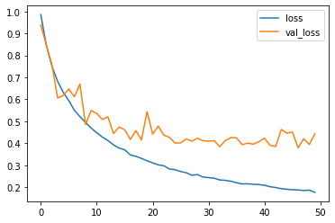
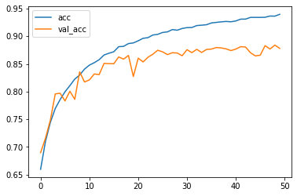
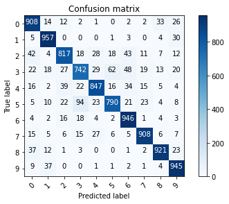
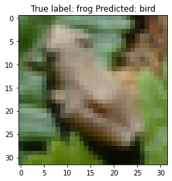

================
by Jawad Haider

``` python
# Install TensorFlow
# !pip install -q tensorflow-gpu==2.0.0-beta1

try:
  %tensorflow_version 2.x  # Colab only.
except Exception:
  pass

import tensorflow as tf
print(tf.__version__)
```

    `%tensorflow_version` only switches the major version: 1.x or 2.x.
    You set: `2.x  # Colab only.`. This will be interpreted as: `2.x`.


    TensorFlow 2.x selected.
    2.2.0-rc2

``` python
# additional imports

import numpy as np
import matplotlib.pyplot as plt
from tensorflow.keras.layers import Input, Conv2D, Dense, Flatten, Dropout, GlobalMaxPooling2D, MaxPooling2D, BatchNormalization
from tensorflow.keras.models import Model
```

``` python
# Load in the data
cifar10 = tf.keras.datasets.cifar10

(x_train, y_train), (x_test, y_test) = cifar10.load_data()
x_train, x_test = x_train / 255.0, x_test / 255.0
y_train, y_test = y_train.flatten(), y_test.flatten()
print("x_train.shape:", x_train.shape)
print("y_train.shape", y_train.shape)
```

    Downloading data from https://www.cs.toronto.edu/~kriz/cifar-10-python.tar.gz
    170500096/170498071 [==============================] - 13s 0us/step
    x_train.shape: (50000, 32, 32, 3)
    y_train.shape (50000,)

``` python
# number of classes
K = len(set(y_train))
print("number of classes:", K)
```

    number of classes: 10

``` python
# Build the model using the functional API
i = Input(shape=x_train[0].shape)
# x = Conv2D(32, (3, 3), strides=2, activation='relu')(i)
# x = Conv2D(64, (3, 3), strides=2, activation='relu')(x)
# x = Conv2D(128, (3, 3), strides=2, activation='relu')(x)

x = Conv2D(32, (3, 3), activation='relu', padding='same')(i)
x = BatchNormalization()(x)
x = Conv2D(32, (3, 3), activation='relu', padding='same')(x)
x = BatchNormalization()(x)
x = MaxPooling2D((2, 2))(x)
# x = Dropout(0.2)(x)
x = Conv2D(64, (3, 3), activation='relu', padding='same')(x)
x = BatchNormalization()(x)
x = Conv2D(64, (3, 3), activation='relu', padding='same')(x)
x = BatchNormalization()(x)
x = MaxPooling2D((2, 2))(x)
# x = Dropout(0.2)(x)
x = Conv2D(128, (3, 3), activation='relu', padding='same')(x)
x = BatchNormalization()(x)
x = Conv2D(128, (3, 3), activation='relu', padding='same')(x)
x = BatchNormalization()(x)
x = MaxPooling2D((2, 2))(x)
# x = Dropout(0.2)(x)

# x = GlobalMaxPooling2D()(x)
x = Flatten()(x)
x = Dropout(0.2)(x)
x = Dense(1024, activation='relu')(x)
x = Dropout(0.2)(x)
x = Dense(K, activation='softmax')(x)

model = Model(i, x)
```

``` python
# Compile
# Note: make sure you are using the GPU for this!
model.compile(optimizer='adam',
              loss='sparse_categorical_crossentropy',
              metrics=['accuracy'])
```

``` python
# Fit
r = model.fit(x_train, y_train, validation_data=(x_test, y_test), epochs=50)
```

    Epoch 1/50
    1465/1563 [===========================>..] - ETA: 0s - loss: 1.2974 - accuracy: 0.5487

    KeyboardInterrupt: ignored

``` python
# Fit with data augmentation
# Note: if you run this AFTER calling the previous model.fit(), it will CONTINUE training where it left off
batch_size = 32
data_generator = tf.keras.preprocessing.image.ImageDataGenerator(width_shift_range=0.1, height_shift_range=0.1, horizontal_flip=True)
train_generator = data_generator.flow(x_train, y_train, batch_size)
steps_per_epoch = x_train.shape[0] // batch_size
r = model.fit(train_generator, validation_data=(x_test, y_test), steps_per_epoch=steps_per_epoch, epochs=50)
```

    Epoch 1/50
    1562/1562 [==============================] - 27s 17ms/step - loss: 0.9854 - accuracy: 0.6597 - val_loss: 0.9380 - val_accuracy: 0.6898
    Epoch 2/50
    1562/1562 [==============================] - 26s 17ms/step - loss: 0.8444 - accuracy: 0.7101 - val_loss: 0.8461 - val_accuracy: 0.7158
    Epoch 3/50
    1562/1562 [==============================] - 26s 17ms/step - loss: 0.7506 - accuracy: 0.7444 - val_loss: 0.7562 - val_accuracy: 0.7485
    Epoch 4/50
    1562/1562 [==============================] - 26s 17ms/step - loss: 0.6825 - accuracy: 0.7695 - val_loss: 0.6062 - val_accuracy: 0.7959
    Epoch 5/50
    1562/1562 [==============================] - 26s 17ms/step - loss: 0.6324 - accuracy: 0.7856 - val_loss: 0.6161 - val_accuracy: 0.7971
    Epoch 6/50
    1562/1562 [==============================] - 26s 17ms/step - loss: 0.5944 - accuracy: 0.7997 - val_loss: 0.6473 - val_accuracy: 0.7832
    Epoch 7/50
    1562/1562 [==============================] - 26s 17ms/step - loss: 0.5502 - accuracy: 0.8109 - val_loss: 0.6116 - val_accuracy: 0.8007
    Epoch 8/50
    1562/1562 [==============================] - 26s 17ms/step - loss: 0.5210 - accuracy: 0.8227 - val_loss: 0.6694 - val_accuracy: 0.7861
    Epoch 9/50
    1562/1562 [==============================] - 26s 17ms/step - loss: 0.4947 - accuracy: 0.8300 - val_loss: 0.4850 - val_accuracy: 0.8358
    Epoch 10/50
    1562/1562 [==============================] - 26s 17ms/step - loss: 0.4690 - accuracy: 0.8407 - val_loss: 0.5492 - val_accuracy: 0.8174
    Epoch 11/50
    1562/1562 [==============================] - 26s 17ms/step - loss: 0.4480 - accuracy: 0.8479 - val_loss: 0.5357 - val_accuracy: 0.8212
    Epoch 12/50
    1562/1562 [==============================] - 26s 17ms/step - loss: 0.4283 - accuracy: 0.8523 - val_loss: 0.5085 - val_accuracy: 0.8319
    Epoch 13/50
    1562/1562 [==============================] - 26s 17ms/step - loss: 0.4125 - accuracy: 0.8577 - val_loss: 0.5201 - val_accuracy: 0.8308
    Epoch 14/50
    1562/1562 [==============================] - 26s 16ms/step - loss: 0.3929 - accuracy: 0.8662 - val_loss: 0.4446 - val_accuracy: 0.8510
    Epoch 15/50
    1562/1562 [==============================] - 26s 17ms/step - loss: 0.3779 - accuracy: 0.8694 - val_loss: 0.4738 - val_accuracy: 0.8506
    Epoch 16/50
    1562/1562 [==============================] - 26s 17ms/step - loss: 0.3706 - accuracy: 0.8721 - val_loss: 0.4617 - val_accuracy: 0.8504
    Epoch 17/50
    1562/1562 [==============================] - 26s 17ms/step - loss: 0.3470 - accuracy: 0.8812 - val_loss: 0.4172 - val_accuracy: 0.8627
    Epoch 18/50
    1562/1562 [==============================] - 26s 17ms/step - loss: 0.3405 - accuracy: 0.8818 - val_loss: 0.4572 - val_accuracy: 0.8587
    Epoch 19/50
    1562/1562 [==============================] - 26s 17ms/step - loss: 0.3312 - accuracy: 0.8868 - val_loss: 0.4150 - val_accuracy: 0.8654
    Epoch 20/50
    1562/1562 [==============================] - 26s 17ms/step - loss: 0.3203 - accuracy: 0.8880 - val_loss: 0.5443 - val_accuracy: 0.8273
    Epoch 21/50
    1562/1562 [==============================] - 26s 17ms/step - loss: 0.3108 - accuracy: 0.8919 - val_loss: 0.4421 - val_accuracy: 0.8605
    Epoch 22/50
    1562/1562 [==============================] - 26s 17ms/step - loss: 0.3017 - accuracy: 0.8964 - val_loss: 0.4778 - val_accuracy: 0.8537
    Epoch 23/50
    1562/1562 [==============================] - 26s 17ms/step - loss: 0.2978 - accuracy: 0.8975 - val_loss: 0.4370 - val_accuracy: 0.8621
    Epoch 24/50
    1562/1562 [==============================] - 26s 17ms/step - loss: 0.2830 - accuracy: 0.9023 - val_loss: 0.4270 - val_accuracy: 0.8676
    Epoch 25/50
    1562/1562 [==============================] - 26s 17ms/step - loss: 0.2796 - accuracy: 0.9035 - val_loss: 0.4009 - val_accuracy: 0.8748
    Epoch 26/50
    1562/1562 [==============================] - 26s 17ms/step - loss: 0.2714 - accuracy: 0.9069 - val_loss: 0.4017 - val_accuracy: 0.8719
    Epoch 27/50
    1562/1562 [==============================] - 26s 17ms/step - loss: 0.2663 - accuracy: 0.9080 - val_loss: 0.4199 - val_accuracy: 0.8669
    Epoch 28/50
    1562/1562 [==============================] - 26s 17ms/step - loss: 0.2547 - accuracy: 0.9121 - val_loss: 0.4094 - val_accuracy: 0.8703
    Epoch 29/50
    1562/1562 [==============================] - 26s 17ms/step - loss: 0.2574 - accuracy: 0.9110 - val_loss: 0.4227 - val_accuracy: 0.8698
    Epoch 30/50
    1562/1562 [==============================] - 26s 17ms/step - loss: 0.2464 - accuracy: 0.9141 - val_loss: 0.4117 - val_accuracy: 0.8649
    Epoch 31/50
    1562/1562 [==============================] - 26s 17ms/step - loss: 0.2439 - accuracy: 0.9157 - val_loss: 0.4096 - val_accuracy: 0.8758
    Epoch 32/50
    1562/1562 [==============================] - 26s 17ms/step - loss: 0.2411 - accuracy: 0.9159 - val_loss: 0.4118 - val_accuracy: 0.8705
    Epoch 33/50
    1562/1562 [==============================] - 26s 17ms/step - loss: 0.2330 - accuracy: 0.9194 - val_loss: 0.3841 - val_accuracy: 0.8764
    Epoch 34/50
    1562/1562 [==============================] - 26s 17ms/step - loss: 0.2312 - accuracy: 0.9201 - val_loss: 0.4127 - val_accuracy: 0.8708
    Epoch 35/50
    1562/1562 [==============================] - 26s 17ms/step - loss: 0.2272 - accuracy: 0.9209 - val_loss: 0.4259 - val_accuracy: 0.8762
    Epoch 36/50
    1562/1562 [==============================] - 26s 17ms/step - loss: 0.2204 - accuracy: 0.9241 - val_loss: 0.4246 - val_accuracy: 0.8769
    Epoch 37/50
    1562/1562 [==============================] - 26s 17ms/step - loss: 0.2150 - accuracy: 0.9251 - val_loss: 0.3939 - val_accuracy: 0.8797
    Epoch 38/50
    1562/1562 [==============================] - 26s 17ms/step - loss: 0.2156 - accuracy: 0.9261 - val_loss: 0.4005 - val_accuracy: 0.8790
    Epoch 39/50
    1562/1562 [==============================] - 26s 17ms/step - loss: 0.2135 - accuracy: 0.9268 - val_loss: 0.3959 - val_accuracy: 0.8773
    Epoch 40/50
    1562/1562 [==============================] - 26s 17ms/step - loss: 0.2121 - accuracy: 0.9263 - val_loss: 0.4072 - val_accuracy: 0.8742
    Epoch 41/50
    1562/1562 [==============================] - 26s 17ms/step - loss: 0.2087 - accuracy: 0.9277 - val_loss: 0.4234 - val_accuracy: 0.8769
    Epoch 42/50
    1562/1562 [==============================] - 26s 17ms/step - loss: 0.2023 - accuracy: 0.9310 - val_loss: 0.3904 - val_accuracy: 0.8812
    Epoch 43/50
    1562/1562 [==============================] - 26s 16ms/step - loss: 0.1986 - accuracy: 0.9311 - val_loss: 0.3859 - val_accuracy: 0.8806
    Epoch 44/50
    1562/1562 [==============================] - 26s 17ms/step - loss: 0.1936 - accuracy: 0.9341 - val_loss: 0.4627 - val_accuracy: 0.8703
    Epoch 45/50
    1562/1562 [==============================] - 26s 17ms/step - loss: 0.1907 - accuracy: 0.9342 - val_loss: 0.4460 - val_accuracy: 0.8646
    Epoch 46/50
    1562/1562 [==============================] - 26s 17ms/step - loss: 0.1884 - accuracy: 0.9341 - val_loss: 0.4511 - val_accuracy: 0.8658
    Epoch 47/50
    1562/1562 [==============================] - 26s 17ms/step - loss: 0.1877 - accuracy: 0.9344 - val_loss: 0.3790 - val_accuracy: 0.8831
    Epoch 48/50
    1562/1562 [==============================] - 26s 16ms/step - loss: 0.1851 - accuracy: 0.9366 - val_loss: 0.4208 - val_accuracy: 0.8770
    Epoch 49/50
    1562/1562 [==============================] - 26s 16ms/step - loss: 0.1869 - accuracy: 0.9364 - val_loss: 0.3946 - val_accuracy: 0.8841
    Epoch 50/50
    1562/1562 [==============================] - 26s 16ms/step - loss: 0.1767 - accuracy: 0.9397 - val_loss: 0.4432 - val_accuracy: 0.8781

``` python
# Plot loss per iteration
import matplotlib.pyplot as plt
plt.plot(r.history['loss'], label='loss')
plt.plot(r.history['val_loss'], label='val_loss')
plt.legend()
```

    <matplotlib.legend.Legend at 0x7f1d5a2856d8>



``` python
# Plot accuracy per iteration
plt.plot(r.history['accuracy'], label='acc')
plt.plot(r.history['val_accuracy'], label='val_acc')
plt.legend()
```

    <matplotlib.legend.Legend at 0x7f1d5a26ada0>



``` python
# Plot confusion matrix
from sklearn.metrics import confusion_matrix
import itertools

def plot_confusion_matrix(cm, classes,
                          normalize=False,
                          title='Confusion matrix',
                          cmap=plt.cm.Blues):
  """
  This function prints and plots the confusion matrix.
  Normalization can be applied by setting `normalize=True`.
  """
  if normalize:
      cm = cm.astype('float') / cm.sum(axis=1)[:, np.newaxis]
      print("Normalized confusion matrix")
  else:
      print('Confusion matrix, without normalization')

  print(cm)

  plt.imshow(cm, interpolation='nearest', cmap=cmap)
  plt.title(title)
  plt.colorbar()
  tick_marks = np.arange(len(classes))
  plt.xticks(tick_marks, classes, rotation=45)
  plt.yticks(tick_marks, classes)

  fmt = '.2f' if normalize else 'd'
  thresh = cm.max() / 2.
  for i, j in itertools.product(range(cm.shape[0]), range(cm.shape[1])):
      plt.text(j, i, format(cm[i, j], fmt),
               horizontalalignment="center",
               color="white" if cm[i, j] > thresh else "black")

  plt.tight_layout()
  plt.ylabel('True label')
  plt.xlabel('Predicted label')
  plt.show()


p_test = model.predict(x_test).argmax(axis=1)
cm = confusion_matrix(y_test, p_test)
plot_confusion_matrix(cm, list(range(10)))

```

    Confusion matrix, without normalization
    [[908  14  12   2   1   0   2   2  33  26]
     [  5 957   0   0   0   1   3   0   4  30]
     [ 42   4 817  18  28  18  43  11   7  12]
     [ 22  18  27 742  29  62  48  19  13  20]
     [ 16   2  39  22 847  16  34  15   5   4]
     [  5  10  22  94  23 790  21  23   4   8]
     [  4   2  16  18   4   2 946   1   4   3]
     [ 15   5   6  15  27   6   5 908   6   7]
     [ 37  12   1   3   0   0   1   2 921  23]
     [  9  37   0   0   1   1   2   1   4 945]]



``` python
# label mapping
labels = '''airplane
automobile
bird
cat
deer
dog
frog
horse
ship
truck'''.split()
```

``` python
# Show some misclassified examples
misclassified_idx = np.where(p_test != y_test)[0]
i = np.random.choice(misclassified_idx)
plt.imshow(x_test[i], cmap='gray')
plt.title("True label: %s Predicted: %s" % (labels[y_test[i]], labels[p_test[i]]));
```



``` python
# Now that the model is so large, it's useful to summarize it
model.summary()
```

    Model: "model"
    _________________________________________________________________
    Layer (type)                 Output Shape              Param #   
    =================================================================
    input_1 (InputLayer)         [(None, 32, 32, 3)]       0         
    _________________________________________________________________
    conv2d (Conv2D)              (None, 32, 32, 32)        896       
    _________________________________________________________________
    batch_normalization (BatchNo (None, 32, 32, 32)        128       
    _________________________________________________________________
    conv2d_1 (Conv2D)            (None, 32, 32, 32)        9248      
    _________________________________________________________________
    batch_normalization_1 (Batch (None, 32, 32, 32)        128       
    _________________________________________________________________
    max_pooling2d (MaxPooling2D) (None, 16, 16, 32)        0         
    _________________________________________________________________
    conv2d_2 (Conv2D)            (None, 16, 16, 64)        18496     
    _________________________________________________________________
    batch_normalization_2 (Batch (None, 16, 16, 64)        256       
    _________________________________________________________________
    conv2d_3 (Conv2D)            (None, 16, 16, 64)        36928     
    _________________________________________________________________
    batch_normalization_3 (Batch (None, 16, 16, 64)        256       
    _________________________________________________________________
    max_pooling2d_1 (MaxPooling2 (None, 8, 8, 64)          0         
    _________________________________________________________________
    conv2d_4 (Conv2D)            (None, 8, 8, 128)         73856     
    _________________________________________________________________
    batch_normalization_4 (Batch (None, 8, 8, 128)         512       
    _________________________________________________________________
    conv2d_5 (Conv2D)            (None, 8, 8, 128)         147584    
    _________________________________________________________________
    batch_normalization_5 (Batch (None, 8, 8, 128)         512       
    _________________________________________________________________
    max_pooling2d_2 (MaxPooling2 (None, 4, 4, 128)         0         
    _________________________________________________________________
    flatten (Flatten)            (None, 2048)              0         
    _________________________________________________________________
    dropout (Dropout)            (None, 2048)              0         
    _________________________________________________________________
    dense (Dense)                (None, 1024)              2098176   
    _________________________________________________________________
    dropout_1 (Dropout)          (None, 1024)              0         
    _________________________________________________________________
    dense_1 (Dense)              (None, 10)                10250     
    =================================================================
    Total params: 2,397,226
    Trainable params: 2,396,330
    Non-trainable params: 896
    _________________________________________________________________

<center>

<a href=''>  </a>

</center>
<center>
<em>Copyright Qalmaqihir</em>
</center>
<center>
<em>For more information, visit us at
<a href='http://www.github.com/qalmaqihir/'>www.github.com/qalmaqihir/</a></em>
</center>
