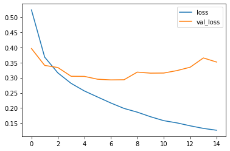
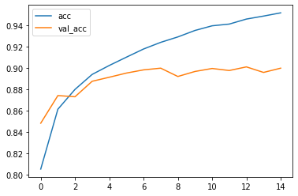
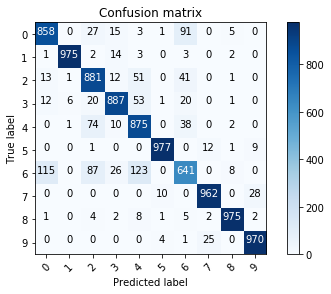
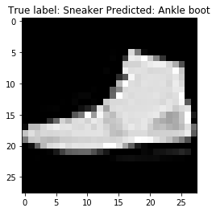

================
by Jawad Haider

``` python
# Install TensorFlow
# !pip install -q tensorflow-gpu==2.0.0-beta1

try:
  %tensorflow_version 2.x  # Colab only.
except Exception:
  pass

import tensorflow as tf
print(tf.__version__)
```

    `%tensorflow_version` only switches the major version: `1.x` or `2.x`.
    You set: `2.x  # Colab only.`. This will be interpreted as: `2.x`.


    TensorFlow 2.x selected.
    2.1.0-rc1

``` python
# additional imports

import numpy as np
import matplotlib.pyplot as plt
from tensorflow.keras.layers import Input, Conv2D, Dense, Flatten, Dropout
from tensorflow.keras.models import Model
```

``` python
# Load in the data
fashion_mnist = tf.keras.datasets.fashion_mnist

(x_train, y_train), (x_test, y_test) = fashion_mnist.load_data()
x_train, x_test = x_train / 255.0, x_test / 255.0
print("x_train.shape:", x_train.shape)
```

    Downloading data from https://storage.googleapis.com/tensorflow/tf-keras-datasets/train-labels-idx1-ubyte.gz
    32768/29515 [=================================] - 0s 0us/step
    Downloading data from https://storage.googleapis.com/tensorflow/tf-keras-datasets/train-images-idx3-ubyte.gz
    26427392/26421880 [==============================] - 0s 0us/step
    Downloading data from https://storage.googleapis.com/tensorflow/tf-keras-datasets/t10k-labels-idx1-ubyte.gz
    8192/5148 [===============================================] - 0s 0us/step
    Downloading data from https://storage.googleapis.com/tensorflow/tf-keras-datasets/t10k-images-idx3-ubyte.gz
    4423680/4422102 [==============================] - 0s 0us/step
    x_train.shape: (60000, 28, 28)

``` python
# the data is only 2D!
# convolution expects height x width x color
x_train = np.expand_dims(x_train, -1)
x_test = np.expand_dims(x_test, -1)
print(x_train.shape)
```

    (60000, 28, 28, 1)

``` python
# number of classes
K = len(set(y_train))
print("number of classes:", K)
```

    number of classes: 10

``` python
# Build the model using the functional API
i = Input(shape=x_train[0].shape)
x = Conv2D(32, (3, 3), strides=2, activation='relu')(i)
x = Conv2D(64, (3, 3), strides=2, activation='relu')(x)
x = Conv2D(128, (3, 3), strides=2, activation='relu')(x)
x = Flatten()(x)
x = Dropout(0.2)(x)
x = Dense(512, activation='relu')(x)
x = Dropout(0.2)(x)
x = Dense(K, activation='softmax')(x)

model = Model(i, x)
```

``` python
# Compile and fit
# Note: make sure you are using the GPU for this!
model.compile(optimizer='adam',
              loss='sparse_categorical_crossentropy',
              metrics=['accuracy'])
r = model.fit(x_train, y_train, validation_data=(x_test, y_test), epochs=15)
```

    Train on 60000 samples, validate on 10000 samples
    Epoch 1/15
    60000/60000 [==============================] - 11s 175us/sample - loss: 0.5238 - accuracy: 0.8055 - val_loss: 0.3963 - val_accuracy: 0.8485
    Epoch 2/15
    60000/60000 [==============================] - 6s 107us/sample - loss: 0.3679 - accuracy: 0.8616 - val_loss: 0.3406 - val_accuracy: 0.8744
    Epoch 3/15
    60000/60000 [==============================] - 6s 107us/sample - loss: 0.3158 - accuracy: 0.8802 - val_loss: 0.3336 - val_accuracy: 0.8733
    Epoch 4/15
    60000/60000 [==============================] - 6s 107us/sample - loss: 0.2813 - accuracy: 0.8942 - val_loss: 0.3047 - val_accuracy: 0.8878
    Epoch 5/15
    60000/60000 [==============================] - 7s 109us/sample - loss: 0.2563 - accuracy: 0.9026 - val_loss: 0.3044 - val_accuracy: 0.8916
    Epoch 6/15
    60000/60000 [==============================] - 7s 110us/sample - loss: 0.2363 - accuracy: 0.9104 - val_loss: 0.2950 - val_accuracy: 0.8955
    Epoch 7/15
    60000/60000 [==============================] - 7s 108us/sample - loss: 0.2166 - accuracy: 0.9181 - val_loss: 0.2928 - val_accuracy: 0.8985
    Epoch 8/15
    60000/60000 [==============================] - 7s 111us/sample - loss: 0.1986 - accuracy: 0.9243 - val_loss: 0.2932 - val_accuracy: 0.9001
    Epoch 9/15
    60000/60000 [==============================] - 7s 112us/sample - loss: 0.1863 - accuracy: 0.9294 - val_loss: 0.3185 - val_accuracy: 0.8923
    Epoch 10/15
    60000/60000 [==============================] - 7s 109us/sample - loss: 0.1712 - accuracy: 0.9355 - val_loss: 0.3151 - val_accuracy: 0.8970
    Epoch 11/15
    60000/60000 [==============================] - 6s 107us/sample - loss: 0.1582 - accuracy: 0.9398 - val_loss: 0.3154 - val_accuracy: 0.8998
    Epoch 12/15
    60000/60000 [==============================] - 6s 108us/sample - loss: 0.1509 - accuracy: 0.9414 - val_loss: 0.3235 - val_accuracy: 0.8979
    Epoch 13/15
    60000/60000 [==============================] - 6s 107us/sample - loss: 0.1412 - accuracy: 0.9461 - val_loss: 0.3347 - val_accuracy: 0.9013
    Epoch 14/15
    60000/60000 [==============================] - 6s 107us/sample - loss: 0.1326 - accuracy: 0.9489 - val_loss: 0.3652 - val_accuracy: 0.8961
    Epoch 15/15
    60000/60000 [==============================] - 6s 107us/sample - loss: 0.1266 - accuracy: 0.9520 - val_loss: 0.3516 - val_accuracy: 0.9001

``` python
# Plot loss per iteration
import matplotlib.pyplot as plt
plt.plot(r.history['loss'], label='loss')
plt.plot(r.history['val_loss'], label='val_loss')
plt.legend()
```

    <matplotlib.legend.Legend at 0x7f23402c8860>



``` python
# Plot accuracy per iteration
plt.plot(r.history['accuracy'], label='acc')
plt.plot(r.history['val_accuracy'], label='val_acc')
plt.legend()
```

    <matplotlib.legend.Legend at 0x7f23243183c8>



``` python
# Plot confusion matrix
from sklearn.metrics import confusion_matrix
import itertools

def plot_confusion_matrix(cm, classes,
                          normalize=False,
                          title='Confusion matrix',
                          cmap=plt.cm.Blues):
  """
  This function prints and plots the confusion matrix.
  Normalization can be applied by setting `normalize=True`.
  """
  if normalize:
      cm = cm.astype('float') / cm.sum(axis=1)[:, np.newaxis]
      print("Normalized confusion matrix")
  else:
      print('Confusion matrix, without normalization')

  print(cm)

  plt.imshow(cm, interpolation='nearest', cmap=cmap)
  plt.title(title)
  plt.colorbar()
  tick_marks = np.arange(len(classes))
  plt.xticks(tick_marks, classes, rotation=45)
  plt.yticks(tick_marks, classes)

  fmt = '.2f' if normalize else 'd'
  thresh = cm.max() / 2.
  for i, j in itertools.product(range(cm.shape[0]), range(cm.shape[1])):
      plt.text(j, i, format(cm[i, j], fmt),
               horizontalalignment="center",
               color="white" if cm[i, j] > thresh else "black")

  plt.tight_layout()
  plt.ylabel('True label')
  plt.xlabel('Predicted label')
  plt.show()


p_test = model.predict(x_test).argmax(axis=1)
cm = confusion_matrix(y_test, p_test)
plot_confusion_matrix(cm, list(range(10)))

```

    Confusion matrix, without normalization
    [[858   0  27  15   3   1  91   0   5   0]
     [  1 975   2  14   3   0   3   0   2   0]
     [ 13   1 881  12  51   0  41   0   1   0]
     [ 12   6  20 887  53   1  20   0   1   0]
     [  0   1  74  10 875   0  38   0   2   0]
     [  0   0   1   0   0 977   0  12   1   9]
     [115   0  87  26 123   0 641   0   8   0]
     [  0   0   0   0   0  10   0 962   0  28]
     [  1   0   4   2   8   1   5   2 975   2]
     [  0   0   0   0   0   4   1  25   0 970]]



``` python
# Label mapping
labels = '''T-shirt/top
Trouser
Pullover
Dress
Coat
Sandal
Shirt
Sneaker
Bag
Ankle boot'''.split("\n")
```

``` python
# Show some misclassified examples
misclassified_idx = np.where(p_test != y_test)[0]
i = np.random.choice(misclassified_idx)
plt.imshow(x_test[i].reshape(28,28), cmap='gray')
plt.title("True label: %s Predicted: %s" % (labels[y_test[i]], labels[p_test[i]]));
```



<center>

<a href=''>  </a>

</center>
<center>
<em>Copyright Qalmaqihir</em>
</center>
<center>
<em>For more information, visit us at
<a href='http://www.github.com/qalmaqihir/'>www.github.com/qalmaqihir/</a></em>
</center>
