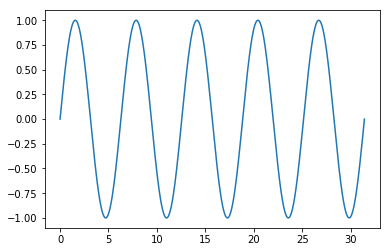

Tensorflow BootCamp - Colab Basics
================
by Jawad Haider

- <a href="#this-is-my-title" id="toc-this-is-my-title">This is my
  title</a>

``` python
import numpy as np
import matplotlib.pyplot as plt
```

``` python
x = np.linspace(0, 10*np.pi, 1000)
y = np.sin(x)
```

``` python
plt.plot(x,y)
```



# This is my title

Here is some regular text.

    import numpy as np

``` python
import sklearn
print(sklearn.__version__)
import numpy
print(numpy.__version__)
import scipy
print(scipy.__version__)
import matplotlib
print(matplotlib.__version__)
import pandas
print(pandas.__version__)
import torch
print(torch.__version__)
import seaborn
print(seaborn.__version__)
import wordcloud
print(wordcloud.__version__)
import bs4
print(bs4.__version__)
import requests
print(requests.__version__)
import theano
print(theano.__version__)
import networkx
print(networkx.__version__)
import cv2
print(cv2.__version__)
import gym
print(gym.__version__)
```

    0.21.2
    1.16.4
    1.3.0
    3.0.3
    0.24.2
    1.1.0
    0.9.0
    1.5.0
    4.6.3
    2.21.0
    1.0.4
    2.3
    3.4.3
    0.10.11

``` python
!ls
```

    sample_data

``` python
!ls sample_data
```

    anscombe.json             mnist_test.csv
    california_housing_test.csv   mnist_train_small.csv
    california_housing_train.csv  README.md

``` python
import json
json.loads(open('sample_data/anscombe.json').read())
```

    [{'Series': 'I', 'X': 10.0, 'Y': 8.04},
     {'Series': 'I', 'X': 8.0, 'Y': 6.95},
     {'Series': 'I', 'X': 13.0, 'Y': 7.58},
     {'Series': 'I', 'X': 9.0, 'Y': 8.81},
     {'Series': 'I', 'X': 11.0, 'Y': 8.33},
     {'Series': 'I', 'X': 14.0, 'Y': 9.96},
     {'Series': 'I', 'X': 6.0, 'Y': 7.24},
     {'Series': 'I', 'X': 4.0, 'Y': 4.26},
     {'Series': 'I', 'X': 12.0, 'Y': 10.84},
     {'Series': 'I', 'X': 7.0, 'Y': 4.81},
     {'Series': 'I', 'X': 5.0, 'Y': 5.68},
     {'Series': 'II', 'X': 10.0, 'Y': 9.14},
     {'Series': 'II', 'X': 8.0, 'Y': 8.14},
     {'Series': 'II', 'X': 13.0, 'Y': 8.74},
     {'Series': 'II', 'X': 9.0, 'Y': 8.77},
     {'Series': 'II', 'X': 11.0, 'Y': 9.26},
     {'Series': 'II', 'X': 14.0, 'Y': 8.1},
     {'Series': 'II', 'X': 6.0, 'Y': 6.13},
     {'Series': 'II', 'X': 4.0, 'Y': 3.1},
     {'Series': 'II', 'X': 12.0, 'Y': 9.13},
     {'Series': 'II', 'X': 7.0, 'Y': 7.26},
     {'Series': 'II', 'X': 5.0, 'Y': 4.74},
     {'Series': 'III', 'X': 10.0, 'Y': 7.46},
     {'Series': 'III', 'X': 8.0, 'Y': 6.77},
     {'Series': 'III', 'X': 13.0, 'Y': 12.74},
     {'Series': 'III', 'X': 9.0, 'Y': 7.11},
     {'Series': 'III', 'X': 11.0, 'Y': 7.81},
     {'Series': 'III', 'X': 14.0, 'Y': 8.84},
     {'Series': 'III', 'X': 6.0, 'Y': 6.08},
     {'Series': 'III', 'X': 4.0, 'Y': 5.39},
     {'Series': 'III', 'X': 12.0, 'Y': 8.15},
     {'Series': 'III', 'X': 7.0, 'Y': 6.42},
     {'Series': 'III', 'X': 5.0, 'Y': 5.73},
     {'Series': 'IV', 'X': 8.0, 'Y': 6.58},
     {'Series': 'IV', 'X': 8.0, 'Y': 5.76},
     {'Series': 'IV', 'X': 8.0, 'Y': 7.71},
     {'Series': 'IV', 'X': 8.0, 'Y': 8.84},
     {'Series': 'IV', 'X': 8.0, 'Y': 8.47},
     {'Series': 'IV', 'X': 8.0, 'Y': 7.04},
     {'Series': 'IV', 'X': 8.0, 'Y': 5.25},
     {'Series': 'IV', 'X': 19.0, 'Y': 12.5},
     {'Series': 'IV', 'X': 8.0, 'Y': 5.56},
     {'Series': 'IV', 'X': 8.0, 'Y': 7.91},
     {'Series': 'IV', 'X': 8.0, 'Y': 6.89}]

``` python
a = 5
```

``` python
print(a)
```

    NameError: ignored

<center>

<a href=''>  </a>

</center>
<center>
<em>Copyright Qalmaqihir</em>
</center>
<center>
<em>For more information, visit us at
<a href='http://www.github.com/qalmaqihir/'>www.github.com/qalmaqihir/</a></em>
</center>
