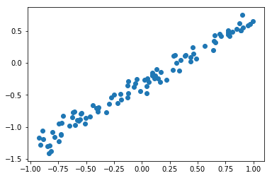
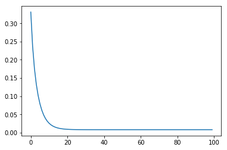

================
by Jawad Haider

- <a href="#build-your-own-model-in-tensorflow-2.0"
  id="toc-build-your-own-model-in-tensorflow-2.0">Build your own model in
  Tensorflow 2.0</a>

# Build your own model in Tensorflow 2.0

This notebook will teach you how to build your own custom model, where
you define your own variables and how to compute predictions.

``` python
# Install TensorFlow
# !pip install -q tensorflow-gpu==2.0.0-beta1

try:
  %tensorflow_version 2.x  # Colab only.
except Exception:
  pass

import tensorflow as tf
print(tf.__version__)
```

    `%tensorflow_version` only switches the major version: `1.x` or `2.x`.
    You set: `2.x  # Colab only.`. This will be interpreted as: `2.x`.


    TensorFlow 2.x selected.
    2.0.0-beta1

``` python
# Other imports
import numpy as np
import matplotlib.pyplot as plt
```

``` python
# Define linear regression model

class LinearRegression(tf.keras.Model):
  def __init__(self, num_inputs, num_outputs):
    super(LinearRegression, self).__init__()
    self.W = tf.Variable(
        tf.random_normal_initializer()((num_inputs, num_outputs)))
    self.b = tf.Variable(tf.zeros(num_outputs))
    self.params = [self.W, self.b]

  def call(self, inputs):
    return tf.matmul(inputs, self.W) + self.b
```

``` python
# Create a dataset
N = 100
D = 1
K = 1
X = np.random.random((N, D)) * 2 - 1
w = np.random.randn(D, K)
b = np.random.randn()
Y = X.dot(w) + b + np.random.randn(N, 1) * 0.1
```

``` python
plt.scatter(X, Y)
```

    <matplotlib.collections.PathCollection at 0x7fc430437e48>



``` python
# Cast type, otherwise Tensorflow will complain

X = X.astype(np.float32)
Y = Y.astype(np.float32)
```

``` python
# Define the loss

def get_loss(model, inputs, targets):
  predictions = model(inputs)
  error = targets - predictions
  return tf.reduce_mean(tf.square(error))
```

``` python
# Gradient function
def get_grad(model, inputs, targets):
  with tf.GradientTape() as tape:
    # calculate the loss
    loss_value = get_loss(model, inputs, targets)
  
  # return gradient
  return tape.gradient(loss_value, model.params)
  
```

``` python
# Create and train the model
model = LinearRegression(D, K)

# Print the params before training
print("Initial params:")
print(model.W)
print(model.b)
```

    Initial params:
    <tf.Variable 'Variable:0' shape=(1, 1) dtype=float32, numpy=array([[-0.07139343]], dtype=float32)>
    <tf.Variable 'Variable:0' shape=(1,) dtype=float32, numpy=array([0.], dtype=float32)>

``` python
# Store the losses here
losses = []

# Create an optimizer
optimizer = tf.keras.optimizers.SGD(learning_rate=0.2)

# Run the training loop
for i in range(100):
  # Get gradients
  grads = get_grad(model, X, Y)
  
  # Do one step of gradient descent: param <- param - learning_rate * grad
  optimizer.apply_gradients(zip(grads, model.params))
  
  # Store the loss
  loss = get_loss(model, X, Y)
  losses.append(loss)
```

``` python
plt.plot(losses)
```



``` python
x_axis = np.linspace(X.min(), X.max(), 100)
y_axis = model.predict(x_axis.reshape(-1, 1)).flatten()

plt.scatter(X, Y)
plt.plot(x_axis, y_axis)

```


``` python
print("Predicted params:")
print(model.W)
print(model.b)
```

    Predicted params:
    <tf.Variable 'Variable:0' shape=(1, 1) dtype=float32, numpy=array([[1.0059998]], dtype=float32)>
    <tf.Variable 'Variable:0' shape=(1,) dtype=float32, numpy=array([-0.3224416], dtype=float32)>

``` python
print("True params:")
w, b
```

    True params:

    (array([[1.01350001]]), -0.3286531216778375)

<center>

<a href=''>  </a>

</center>
<center>
<em>Copyright Qalmaqihir</em>
</center>
<center>
<em>For more information, visit us at
<a href='http://www.github.com/qalmaqihir/'>www.github.com/qalmaqihir/</a></em>
</center>
