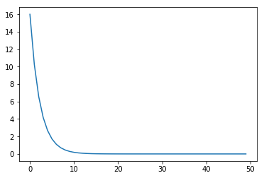
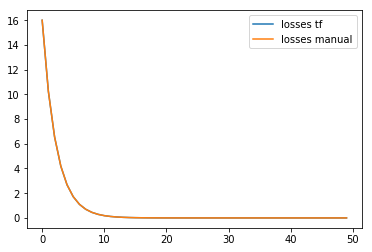

================
by Jawad Haider

- <a href="#variables-and-gradient-tape"
  id="toc-variables-and-gradient-tape">Variables and Gradient Tape</a>
- <a href="#tensorflow-2.0-variables"
  id="toc-tensorflow-2.0-variables">Tensorflow 2.0 Variables</a>

## Variables and Gradient Tape

# Tensorflow 2.0 Variables

This notebook will teach you about variables and how to build a basic
computation graph.

We will perform gradient descent manually to optimize a simple function.

If you’re familiar with Tensorflow 1.x, you will find this useful as an
example to demonstrate how we can do the same operations, but without
sessions, initializers, etc.

``` python
# Install TensorFlow
# !pip install -q tensorflow-gpu==2.0.0-beta1

try:
  %tensorflow_version 2.x  # Colab only.
except Exception:
  pass

import tensorflow as tf
print(tf.__version__)
```

    `%tensorflow_version` only switches the major version: `1.x` or `2.x`.
    You set: `2.x  # Colab only.`. This will be interpreted as: `2.x`.


    TensorFlow 2.x selected.
    2.0.0-beta1

``` python
# First, what is the difference between mutable and immutable?

# A tuple is immutable
# This should result in an error
a = (1,2,3)
a[0] = 5
```

    TypeError: ignored

``` python
# A list is mutable
a = [1,2,3]
a[0] = 5
print(a)
```

    [5, 2, 3]

``` python
# Now Tensorflow variables
a = tf.Variable(5.)
b = tf.Variable(3.)
print(a * b)

# Eager execution! No need for session.run() or variable initializer
```

    tf.Tensor(15.0, shape=(), dtype=float32)

``` python
# Because it's a variable, it can be updated
a = a + 1
print(a)
```

    tf.Tensor(6.0, shape=(), dtype=float32)

``` python
# Variables and constants
c = tf.constant(4.)
print(a * b + c)
```

    tf.Tensor(22.0, shape=(), dtype=float32)

``` python
# Let's demonstrate a simple optimization problem
# L(w) = w**2

w = tf.Variable(5.)

# Now, let us define a loss function
def get_loss(w):
  return w ** 2

# Use "gradient tape" to record the gradients
def get_grad(w):
  with tf.GradientTape() as tape:
    L = get_loss(w)

  # Get the gradient
  g = tape.gradient(L, w)
  return g
  

# Define an optimizer
optimizer = tf.keras.optimizers.SGD(learning_rate=0.1)


# Store the losses
losses = []

# Perform gradient descent
for i in range(50):
  g = get_grad(w)
  optimizer.apply_gradients(zip([g], [w]))
  losses.append(get_loss(w))
```

    WARNING: Logging before flag parsing goes to stderr.
    W0812 20:20:03.417810 140436135712640 deprecation.py:323] From /tensorflow-2.0.0b1/python3.6/tensorflow/python/ops/math_grad.py:1205: add_dispatch_support.<locals>.wrapper (from tensorflow.python.ops.array_ops) is deprecated and will be removed in a future version.
    Instructions for updating:
    Use tf.where in 2.0, which has the same broadcast rule as np.where

``` python
import matplotlib.pyplot as plt
plt.plot(losses)
print(f"Final loss: {get_loss(w)}")
```

    Final loss: 5.0925916816879635e-09



``` python
# Let's do the same thing again, but manually

w = tf.Variable(5.)

# Store the losses
losses2 = []

# Perform gradient descent
for i in range(50):
  # This is doing: w = w - 0.1 * 2 * w
  # But we don't want to create a new Tensor
  w.assign(w - 0.1 * 2 * w)
  losses2.append(w ** 2)
```

``` python
plt.plot(losses, label="losses tf")
plt.plot(losses2, label="losses manual")
plt.legend()
```

    <matplotlib.legend.Legend at 0x7fb994fd99e8>



<center>

<a href=''>  </a>

</center>
<center>
<em>Copyright Qalmaqihir</em>
</center>
<center>
<em>For more information, visit us at
<a href='http://www.github.com/qalmaqihir/'>www.github.com/qalmaqihir/</a></em>
</center>
