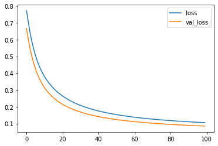
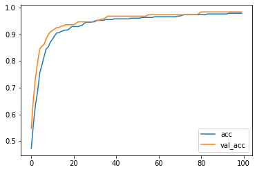

================
by Jawad Haider

- <a href="#linear-classification" id="toc-linear-classification">Linear
  Classification</a>
- <a href="#part-2-making-predictions"
  id="toc-part-2-making-predictions">Part 2: Making Predictions</a>
- <a href="#part-3-saving-and-loading-a-model"
  id="toc-part-3-saving-and-loading-a-model">Part 3: Saving and Loading a
  Model</a>

## Linear Classification

``` python
# Install TensorFlow
# !pip install -q tensorflow-gpu==2.0.0-beta1

try:
  %tensorflow_version 2.x  # Colab only.
except Exception:
  pass

import tensorflow as tf
print(tf.__version__)
```

    `%tensorflow_version` only switches the major version: 1.x or 2.x.
    You set: `2.x  # Colab only.`. This will be interpreted as: `2.x`.


    TensorFlow 2.x selected.
    2.5.0

``` python
# Load in the data
from sklearn.datasets import load_breast_cancer
```

``` python
# load the data
data = load_breast_cancer()
```

``` python
# check the type of 'data'
type(data)
```

    sklearn.utils.Bunch

``` python
# note: it is a Bunch object
# this basically acts like a dictionary where you can treat the keys like attributes
data.keys()
```

    dict_keys(['data', 'target', 'target_names', 'DESCR', 'feature_names', 'filename'])

``` python
# 'data' (the attribute) means the input data
data.data.shape
# it has 569 samples, 30 features
```

    (569, 30)

``` python
# 'targets'
data.target
# note how the targets are just 0s and 1s
# normally, when you have K targets, they are labeled 0..K-1
```

    array([0, 0, 0, 0, 0, 0, 0, 0, 0, 0, 0, 0, 0, 0, 0, 0, 0, 0, 0, 1, 1, 1,
           0, 0, 0, 0, 0, 0, 0, 0, 0, 0, 0, 0, 0, 0, 0, 1, 0, 0, 0, 0, 0, 0,
           0, 0, 1, 0, 1, 1, 1, 1, 1, 0, 0, 1, 0, 0, 1, 1, 1, 1, 0, 1, 0, 0,
           1, 1, 1, 1, 0, 1, 0, 0, 1, 0, 1, 0, 0, 1, 1, 1, 0, 0, 1, 0, 0, 0,
           1, 1, 1, 0, 1, 1, 0, 0, 1, 1, 1, 0, 0, 1, 1, 1, 1, 0, 1, 1, 0, 1,
           1, 1, 1, 1, 1, 1, 1, 0, 0, 0, 1, 0, 0, 1, 1, 1, 0, 0, 1, 0, 1, 0,
           0, 1, 0, 0, 1, 1, 0, 1, 1, 0, 1, 1, 1, 1, 0, 1, 1, 1, 1, 1, 1, 1,
           1, 1, 0, 1, 1, 1, 1, 0, 0, 1, 0, 1, 1, 0, 0, 1, 1, 0, 0, 1, 1, 1,
           1, 0, 1, 1, 0, 0, 0, 1, 0, 1, 0, 1, 1, 1, 0, 1, 1, 0, 0, 1, 0, 0,
           0, 0, 1, 0, 0, 0, 1, 0, 1, 0, 1, 1, 0, 1, 0, 0, 0, 0, 1, 1, 0, 0,
           1, 1, 1, 0, 1, 1, 1, 1, 1, 0, 0, 1, 1, 0, 1, 1, 0, 0, 1, 0, 1, 1,
           1, 1, 0, 1, 1, 1, 1, 1, 0, 1, 0, 0, 0, 0, 0, 0, 0, 0, 0, 0, 0, 0,
           0, 0, 1, 1, 1, 1, 1, 1, 0, 1, 0, 1, 1, 0, 1, 1, 0, 1, 0, 0, 1, 1,
           1, 1, 1, 1, 1, 1, 1, 1, 1, 1, 1, 0, 1, 1, 0, 1, 0, 1, 1, 1, 1, 1,
           1, 1, 1, 1, 1, 1, 1, 1, 1, 0, 1, 1, 1, 0, 1, 0, 1, 1, 1, 1, 0, 0,
           0, 1, 1, 1, 1, 0, 1, 0, 1, 0, 1, 1, 1, 0, 1, 1, 1, 1, 1, 1, 1, 0,
           0, 0, 1, 1, 1, 1, 1, 1, 1, 1, 1, 1, 1, 0, 0, 1, 0, 0, 0, 1, 0, 0,
           1, 1, 1, 1, 1, 0, 1, 1, 1, 1, 1, 0, 1, 1, 1, 0, 1, 1, 0, 0, 1, 1,
           1, 1, 1, 1, 0, 1, 1, 1, 1, 1, 1, 1, 0, 1, 1, 1, 1, 1, 0, 1, 1, 0,
           1, 1, 1, 1, 1, 1, 1, 1, 1, 1, 1, 1, 0, 1, 0, 0, 1, 0, 1, 1, 1, 1,
           1, 0, 1, 1, 0, 1, 0, 1, 1, 0, 1, 0, 1, 1, 1, 1, 1, 1, 1, 1, 0, 0,
           1, 1, 1, 1, 1, 1, 0, 1, 1, 1, 1, 1, 1, 1, 1, 1, 1, 0, 1, 1, 1, 1,
           1, 1, 1, 0, 1, 0, 1, 1, 0, 1, 1, 1, 1, 1, 0, 0, 1, 0, 1, 0, 1, 1,
           1, 1, 1, 0, 1, 1, 0, 1, 0, 1, 0, 0, 1, 1, 1, 0, 1, 1, 1, 1, 1, 1,
           1, 1, 1, 1, 1, 0, 1, 0, 0, 1, 1, 1, 1, 1, 1, 1, 1, 1, 1, 1, 1, 1,
           1, 1, 1, 1, 1, 1, 1, 1, 1, 1, 1, 1, 0, 0, 0, 0, 0, 0, 1])

``` python
# their meaning is not lost
data.target_names
```

    array(['malignant', 'benign'], dtype='<U9')

``` python
# there are also 569 corresponding targets
data.target.shape
```

    (569,)

``` python
# you can also determine the meaning of each feature
data.feature_names
```

    array(['mean radius', 'mean texture', 'mean perimeter', 'mean area',
           'mean smoothness', 'mean compactness', 'mean concavity',
           'mean concave points', 'mean symmetry', 'mean fractal dimension',
           'radius error', 'texture error', 'perimeter error', 'area error',
           'smoothness error', 'compactness error', 'concavity error',
           'concave points error', 'symmetry error',
           'fractal dimension error', 'worst radius', 'worst texture',
           'worst perimeter', 'worst area', 'worst smoothness',
           'worst compactness', 'worst concavity', 'worst concave points',
           'worst symmetry', 'worst fractal dimension'], dtype='<U23')

``` python
# normally we would put all of our imports at the top
# but this lets us tell a story
from sklearn.model_selection import train_test_split


# split the data into train and test sets
# this lets us simulate how our model will perform in the future
X_train, X_test, y_train, y_test = train_test_split(data.data, data.target, test_size=0.33)
N, D = X_train.shape
```

``` python
# Scale the data
# you'll learn why scaling is needed in a later course
from sklearn.preprocessing import StandardScaler

scaler = StandardScaler()
X_train = scaler.fit_transform(X_train)
X_test = scaler.transform(X_test)
```

``` python
# Now all the fun Tensorflow stuff
# Build the model

model = tf.keras.models.Sequential([
  tf.keras.layers.Input(shape=(D,)),
  tf.keras.layers.Dense(1, activation='sigmoid')
])

# Alternatively, you can do:
# model = tf.keras.models.Sequential()
# model.add(tf.keras.layers.Dense(1, input_shape=(D,), activation='sigmoid'))

model.compile(optimizer='adam',
              loss='binary_crossentropy',
              metrics=['accuracy'])


# Train the model
r = model.fit(X_train, y_train, validation_data=(X_test, y_test), epochs=100)


# Evaluate the model - evaluate() returns loss and accuracy
print("Train score:", model.evaluate(X_train, y_train))
print("Test score:", model.evaluate(X_test, y_test))
```

    WARNING:tensorflow:Please add `keras.layers.InputLayer` instead of `keras.Input` to Sequential model. `keras.Input` is intended to be used by Functional model.
    Epoch 1/100
    12/12 [==============================] - 3s 17ms/step - loss: 0.7727 - accuracy: 0.4724 - val_loss: 0.6664 - val_accuracy: 0.5479
    Epoch 2/100
    12/12 [==============================] - 0s 5ms/step - loss: 0.7026 - accuracy: 0.5643 - val_loss: 0.6001 - val_accuracy: 0.6596
    Epoch 3/100
    12/12 [==============================] - 0s 4ms/step - loss: 0.6389 - accuracy: 0.6378 - val_loss: 0.5451 - val_accuracy: 0.7394
    Epoch 4/100
    12/12 [==============================] - 0s 5ms/step - loss: 0.5867 - accuracy: 0.6877 - val_loss: 0.4977 - val_accuracy: 0.7979
    Epoch 5/100
    12/12 [==============================] - 0s 4ms/step - loss: 0.5422 - accuracy: 0.7559 - val_loss: 0.4578 - val_accuracy: 0.8457
    Epoch 6/100
    12/12 [==============================] - 0s 6ms/step - loss: 0.5047 - accuracy: 0.7848 - val_loss: 0.4241 - val_accuracy: 0.8564
    Epoch 7/100
    12/12 [==============================] - 0s 5ms/step - loss: 0.4718 - accuracy: 0.8163 - val_loss: 0.3957 - val_accuracy: 0.8617
    Epoch 8/100
    12/12 [==============================] - 0s 4ms/step - loss: 0.4442 - accuracy: 0.8451 - val_loss: 0.3710 - val_accuracy: 0.8830
    Epoch 9/100
    12/12 [==============================] - 0s 6ms/step - loss: 0.4201 - accuracy: 0.8530 - val_loss: 0.3494 - val_accuracy: 0.8989
    Epoch 10/100
    12/12 [==============================] - 0s 6ms/step - loss: 0.3989 - accuracy: 0.8714 - val_loss: 0.3305 - val_accuracy: 0.9096
    Epoch 11/100
    12/12 [==============================] - 0s 4ms/step - loss: 0.3797 - accuracy: 0.8819 - val_loss: 0.3139 - val_accuracy: 0.9149
    Epoch 12/100
    12/12 [==============================] - 0s 4ms/step - loss: 0.3626 - accuracy: 0.8950 - val_loss: 0.2993 - val_accuracy: 0.9202
    Epoch 13/100
    12/12 [==============================] - 0s 5ms/step - loss: 0.3477 - accuracy: 0.9055 - val_loss: 0.2859 - val_accuracy: 0.9255
    Epoch 14/100
    12/12 [==============================] - 0s 4ms/step - loss: 0.3341 - accuracy: 0.9055 - val_loss: 0.2739 - val_accuracy: 0.9255
    Epoch 15/100
    12/12 [==============================] - 0s 4ms/step - loss: 0.3213 - accuracy: 0.9108 - val_loss: 0.2632 - val_accuracy: 0.9309
    Epoch 16/100
    12/12 [==============================] - 0s 5ms/step - loss: 0.3099 - accuracy: 0.9134 - val_loss: 0.2534 - val_accuracy: 0.9309
    Epoch 17/100
    12/12 [==============================] - 0s 4ms/step - loss: 0.2992 - accuracy: 0.9160 - val_loss: 0.2446 - val_accuracy: 0.9362
    Epoch 18/100
    12/12 [==============================] - 0s 4ms/step - loss: 0.2896 - accuracy: 0.9160 - val_loss: 0.2363 - val_accuracy: 0.9362
    Epoch 19/100
    12/12 [==============================] - 0s 5ms/step - loss: 0.2806 - accuracy: 0.9213 - val_loss: 0.2287 - val_accuracy: 0.9362
    Epoch 20/100
    12/12 [==============================] - 0s 5ms/step - loss: 0.2723 - accuracy: 0.9291 - val_loss: 0.2217 - val_accuracy: 0.9362
    Epoch 21/100
    12/12 [==============================] - 0s 4ms/step - loss: 0.2645 - accuracy: 0.9291 - val_loss: 0.2151 - val_accuracy: 0.9362
    Epoch 22/100
    12/12 [==============================] - 0s 4ms/step - loss: 0.2571 - accuracy: 0.9291 - val_loss: 0.2091 - val_accuracy: 0.9415
    Epoch 23/100
    12/12 [==============================] - 0s 4ms/step - loss: 0.2505 - accuracy: 0.9291 - val_loss: 0.2033 - val_accuracy: 0.9468
    Epoch 24/100
    12/12 [==============================] - 0s 4ms/step - loss: 0.2440 - accuracy: 0.9318 - val_loss: 0.1980 - val_accuracy: 0.9468
    Epoch 25/100
    12/12 [==============================] - 0s 4ms/step - loss: 0.2380 - accuracy: 0.9344 - val_loss: 0.1931 - val_accuracy: 0.9468
    Epoch 26/100
    12/12 [==============================] - 0s 5ms/step - loss: 0.2323 - accuracy: 0.9423 - val_loss: 0.1884 - val_accuracy: 0.9468
    Epoch 27/100
    12/12 [==============================] - 0s 4ms/step - loss: 0.2270 - accuracy: 0.9449 - val_loss: 0.1841 - val_accuracy: 0.9468
    Epoch 28/100
    12/12 [==============================] - 0s 6ms/step - loss: 0.2221 - accuracy: 0.9449 - val_loss: 0.1799 - val_accuracy: 0.9468
    Epoch 29/100
    12/12 [==============================] - 0s 6ms/step - loss: 0.2173 - accuracy: 0.9449 - val_loss: 0.1759 - val_accuracy: 0.9468
    Epoch 30/100
    12/12 [==============================] - 0s 4ms/step - loss: 0.2127 - accuracy: 0.9475 - val_loss: 0.1722 - val_accuracy: 0.9468
    Epoch 31/100
    12/12 [==============================] - 0s 5ms/step - loss: 0.2083 - accuracy: 0.9501 - val_loss: 0.1688 - val_accuracy: 0.9468
    Epoch 32/100
    12/12 [==============================] - 0s 4ms/step - loss: 0.2043 - accuracy: 0.9528 - val_loss: 0.1655 - val_accuracy: 0.9521
    Epoch 33/100
    12/12 [==============================] - 0s 4ms/step - loss: 0.2006 - accuracy: 0.9528 - val_loss: 0.1622 - val_accuracy: 0.9521
    Epoch 34/100
    12/12 [==============================] - 0s 6ms/step - loss: 0.1968 - accuracy: 0.9528 - val_loss: 0.1592 - val_accuracy: 0.9574
    Epoch 35/100
    12/12 [==============================] - 0s 4ms/step - loss: 0.1932 - accuracy: 0.9528 - val_loss: 0.1564 - val_accuracy: 0.9574
    Epoch 36/100
    12/12 [==============================] - 0s 6ms/step - loss: 0.1900 - accuracy: 0.9554 - val_loss: 0.1536 - val_accuracy: 0.9628
    Epoch 37/100
    12/12 [==============================] - 0s 5ms/step - loss: 0.1867 - accuracy: 0.9554 - val_loss: 0.1510 - val_accuracy: 0.9681
    Epoch 38/100
    12/12 [==============================] - 0s 4ms/step - loss: 0.1837 - accuracy: 0.9554 - val_loss: 0.1486 - val_accuracy: 0.9681
    Epoch 39/100
    12/12 [==============================] - 0s 6ms/step - loss: 0.1807 - accuracy: 0.9554 - val_loss: 0.1462 - val_accuracy: 0.9681
    Epoch 40/100
    12/12 [==============================] - 0s 5ms/step - loss: 0.1779 - accuracy: 0.9580 - val_loss: 0.1439 - val_accuracy: 0.9681
    Epoch 41/100
    12/12 [==============================] - 0s 5ms/step - loss: 0.1752 - accuracy: 0.9580 - val_loss: 0.1418 - val_accuracy: 0.9681
    Epoch 42/100
    12/12 [==============================] - 0s 5ms/step - loss: 0.1727 - accuracy: 0.9580 - val_loss: 0.1396 - val_accuracy: 0.9681
    Epoch 43/100
    12/12 [==============================] - 0s 6ms/step - loss: 0.1702 - accuracy: 0.9580 - val_loss: 0.1376 - val_accuracy: 0.9681
    Epoch 44/100
    12/12 [==============================] - 0s 5ms/step - loss: 0.1678 - accuracy: 0.9580 - val_loss: 0.1357 - val_accuracy: 0.9681
    Epoch 45/100
    12/12 [==============================] - 0s 4ms/step - loss: 0.1655 - accuracy: 0.9580 - val_loss: 0.1338 - val_accuracy: 0.9681
    Epoch 46/100
    12/12 [==============================] - 0s 4ms/step - loss: 0.1633 - accuracy: 0.9580 - val_loss: 0.1321 - val_accuracy: 0.9681
    Epoch 47/100
    12/12 [==============================] - 0s 4ms/step - loss: 0.1613 - accuracy: 0.9580 - val_loss: 0.1304 - val_accuracy: 0.9681
    Epoch 48/100
    12/12 [==============================] - 0s 5ms/step - loss: 0.1592 - accuracy: 0.9606 - val_loss: 0.1287 - val_accuracy: 0.9681
    Epoch 49/100
    12/12 [==============================] - 0s 4ms/step - loss: 0.1571 - accuracy: 0.9606 - val_loss: 0.1272 - val_accuracy: 0.9681
    Epoch 50/100
    12/12 [==============================] - 0s 4ms/step - loss: 0.1553 - accuracy: 0.9606 - val_loss: 0.1256 - val_accuracy: 0.9681
    Epoch 51/100
    12/12 [==============================] - 0s 5ms/step - loss: 0.1535 - accuracy: 0.9606 - val_loss: 0.1242 - val_accuracy: 0.9681
    Epoch 52/100
    12/12 [==============================] - 0s 4ms/step - loss: 0.1517 - accuracy: 0.9606 - val_loss: 0.1227 - val_accuracy: 0.9681
    Epoch 53/100
    12/12 [==============================] - 0s 5ms/step - loss: 0.1500 - accuracy: 0.9633 - val_loss: 0.1213 - val_accuracy: 0.9681
    Epoch 54/100
    12/12 [==============================] - 0s 5ms/step - loss: 0.1484 - accuracy: 0.9633 - val_loss: 0.1199 - val_accuracy: 0.9681
    Epoch 55/100
    12/12 [==============================] - 0s 5ms/step - loss: 0.1467 - accuracy: 0.9633 - val_loss: 0.1186 - val_accuracy: 0.9681
    Epoch 56/100
    12/12 [==============================] - 0s 6ms/step - loss: 0.1453 - accuracy: 0.9633 - val_loss: 0.1174 - val_accuracy: 0.9734
    Epoch 57/100
    12/12 [==============================] - 0s 4ms/step - loss: 0.1436 - accuracy: 0.9633 - val_loss: 0.1162 - val_accuracy: 0.9734
    Epoch 58/100
    12/12 [==============================] - 0s 4ms/step - loss: 0.1423 - accuracy: 0.9633 - val_loss: 0.1150 - val_accuracy: 0.9734
    Epoch 59/100
    12/12 [==============================] - 0s 4ms/step - loss: 0.1408 - accuracy: 0.9659 - val_loss: 0.1139 - val_accuracy: 0.9734
    Epoch 60/100
    12/12 [==============================] - 0s 4ms/step - loss: 0.1395 - accuracy: 0.9659 - val_loss: 0.1127 - val_accuracy: 0.9734
    Epoch 61/100
    12/12 [==============================] - 0s 4ms/step - loss: 0.1381 - accuracy: 0.9659 - val_loss: 0.1117 - val_accuracy: 0.9734
    Epoch 62/100
    12/12 [==============================] - 0s 5ms/step - loss: 0.1368 - accuracy: 0.9659 - val_loss: 0.1107 - val_accuracy: 0.9734
    Epoch 63/100
    12/12 [==============================] - 0s 4ms/step - loss: 0.1356 - accuracy: 0.9659 - val_loss: 0.1096 - val_accuracy: 0.9734
    Epoch 64/100
    12/12 [==============================] - 0s 4ms/step - loss: 0.1344 - accuracy: 0.9659 - val_loss: 0.1086 - val_accuracy: 0.9734
    Epoch 65/100
    12/12 [==============================] - 0s 4ms/step - loss: 0.1332 - accuracy: 0.9659 - val_loss: 0.1077 - val_accuracy: 0.9734
    Epoch 66/100
    12/12 [==============================] - 0s 5ms/step - loss: 0.1320 - accuracy: 0.9659 - val_loss: 0.1067 - val_accuracy: 0.9734
    Epoch 67/100
    12/12 [==============================] - 0s 5ms/step - loss: 0.1309 - accuracy: 0.9659 - val_loss: 0.1059 - val_accuracy: 0.9734
    Epoch 68/100
    12/12 [==============================] - 0s 5ms/step - loss: 0.1299 - accuracy: 0.9659 - val_loss: 0.1050 - val_accuracy: 0.9734
    Epoch 69/100
    12/12 [==============================] - 0s 4ms/step - loss: 0.1288 - accuracy: 0.9659 - val_loss: 0.1041 - val_accuracy: 0.9734
    Epoch 70/100
    12/12 [==============================] - 0s 5ms/step - loss: 0.1277 - accuracy: 0.9685 - val_loss: 0.1033 - val_accuracy: 0.9734
    Epoch 71/100
    12/12 [==============================] - 0s 4ms/step - loss: 0.1267 - accuracy: 0.9685 - val_loss: 0.1024 - val_accuracy: 0.9734
    Epoch 72/100
    12/12 [==============================] - 0s 4ms/step - loss: 0.1258 - accuracy: 0.9711 - val_loss: 0.1016 - val_accuracy: 0.9734
    Epoch 73/100
    12/12 [==============================] - 0s 5ms/step - loss: 0.1248 - accuracy: 0.9738 - val_loss: 0.1008 - val_accuracy: 0.9734
    Epoch 74/100
    12/12 [==============================] - 0s 4ms/step - loss: 0.1239 - accuracy: 0.9738 - val_loss: 0.1001 - val_accuracy: 0.9734
    Epoch 75/100
    12/12 [==============================] - 0s 5ms/step - loss: 0.1230 - accuracy: 0.9738 - val_loss: 0.0994 - val_accuracy: 0.9734
    Epoch 76/100
    12/12 [==============================] - 0s 5ms/step - loss: 0.1221 - accuracy: 0.9738 - val_loss: 0.0987 - val_accuracy: 0.9734
    Epoch 77/100
    12/12 [==============================] - 0s 4ms/step - loss: 0.1213 - accuracy: 0.9738 - val_loss: 0.0979 - val_accuracy: 0.9734
    Epoch 78/100
    12/12 [==============================] - 0s 5ms/step - loss: 0.1204 - accuracy: 0.9738 - val_loss: 0.0972 - val_accuracy: 0.9734
    Epoch 79/100
    12/12 [==============================] - 0s 4ms/step - loss: 0.1196 - accuracy: 0.9738 - val_loss: 0.0966 - val_accuracy: 0.9734
    Epoch 80/100
    12/12 [==============================] - 0s 4ms/step - loss: 0.1188 - accuracy: 0.9738 - val_loss: 0.0959 - val_accuracy: 0.9787
    Epoch 81/100
    12/12 [==============================] - 0s 5ms/step - loss: 0.1180 - accuracy: 0.9738 - val_loss: 0.0953 - val_accuracy: 0.9840
    Epoch 82/100
    12/12 [==============================] - 0s 5ms/step - loss: 0.1173 - accuracy: 0.9738 - val_loss: 0.0947 - val_accuracy: 0.9840
    Epoch 83/100
    12/12 [==============================] - 0s 5ms/step - loss: 0.1165 - accuracy: 0.9738 - val_loss: 0.0940 - val_accuracy: 0.9840
    Epoch 84/100
    12/12 [==============================] - 0s 5ms/step - loss: 0.1158 - accuracy: 0.9764 - val_loss: 0.0934 - val_accuracy: 0.9840
    Epoch 85/100
    12/12 [==============================] - 0s 5ms/step - loss: 0.1150 - accuracy: 0.9764 - val_loss: 0.0928 - val_accuracy: 0.9840
    Epoch 86/100
    12/12 [==============================] - 0s 5ms/step - loss: 0.1143 - accuracy: 0.9764 - val_loss: 0.0923 - val_accuracy: 0.9840
    Epoch 87/100
    12/12 [==============================] - 0s 5ms/step - loss: 0.1137 - accuracy: 0.9764 - val_loss: 0.0917 - val_accuracy: 0.9840
    Epoch 88/100
    12/12 [==============================] - 0s 5ms/step - loss: 0.1130 - accuracy: 0.9764 - val_loss: 0.0912 - val_accuracy: 0.9840
    Epoch 89/100
    12/12 [==============================] - 0s 5ms/step - loss: 0.1123 - accuracy: 0.9764 - val_loss: 0.0906 - val_accuracy: 0.9840
    Epoch 90/100
    12/12 [==============================] - 0s 4ms/step - loss: 0.1117 - accuracy: 0.9764 - val_loss: 0.0900 - val_accuracy: 0.9840
    Epoch 91/100
    12/12 [==============================] - 0s 5ms/step - loss: 0.1111 - accuracy: 0.9764 - val_loss: 0.0895 - val_accuracy: 0.9840
    Epoch 92/100
    12/12 [==============================] - 0s 5ms/step - loss: 0.1104 - accuracy: 0.9764 - val_loss: 0.0890 - val_accuracy: 0.9840
    Epoch 93/100
    12/12 [==============================] - 0s 4ms/step - loss: 0.1098 - accuracy: 0.9764 - val_loss: 0.0886 - val_accuracy: 0.9840
    Epoch 94/100
    12/12 [==============================] - 0s 6ms/step - loss: 0.1093 - accuracy: 0.9790 - val_loss: 0.0881 - val_accuracy: 0.9840
    Epoch 95/100
    12/12 [==============================] - 0s 5ms/step - loss: 0.1087 - accuracy: 0.9790 - val_loss: 0.0876 - val_accuracy: 0.9840
    Epoch 96/100
    12/12 [==============================] - 0s 4ms/step - loss: 0.1081 - accuracy: 0.9790 - val_loss: 0.0871 - val_accuracy: 0.9840
    Epoch 97/100
    12/12 [==============================] - 0s 5ms/step - loss: 0.1075 - accuracy: 0.9790 - val_loss: 0.0866 - val_accuracy: 0.9840
    Epoch 98/100
    12/12 [==============================] - 0s 5ms/step - loss: 0.1070 - accuracy: 0.9790 - val_loss: 0.0862 - val_accuracy: 0.9840
    Epoch 99/100
    12/12 [==============================] - 0s 6ms/step - loss: 0.1065 - accuracy: 0.9790 - val_loss: 0.0858 - val_accuracy: 0.9840
    Epoch 100/100
    12/12 [==============================] - 0s 4ms/step - loss: 0.1059 - accuracy: 0.9790 - val_loss: 0.0853 - val_accuracy: 0.9840
    12/12 [==============================] - 0s 2ms/step - loss: 0.1056 - accuracy: 0.9790
    Train score: [0.10559554398059845, 0.9790025949478149]
    6/6 [==============================] - 0s 2ms/step - loss: 0.0853 - accuracy: 0.9840
    Test score: [0.08529960364103317, 0.9840425252914429]

``` python
# Plot what's returned by model.fit()
import matplotlib.pyplot as plt
plt.plot(r.history['loss'], label='loss')
plt.plot(r.history['val_loss'], label='val_loss')
plt.legend()
```

    <matplotlib.legend.Legend at 0x7f75702b9790>



``` python
# Plot the accuracy too
plt.plot(r.history['accuracy'], label='acc')
plt.plot(r.history['val_accuracy'], label='val_acc')
plt.legend()
```

    <matplotlib.legend.Legend at 0x7f75701ec310>



# Part 2: Making Predictions

This goes with the lecture “Making Predictions”

``` python
# Make predictions
P = model.predict(X_test)
print(P) # they are outputs of the sigmoid, interpreted as probabilities p(y = 1 | x)
```

    [[9.35080469e-01]
     [9.99298692e-01]
     [9.98439729e-01]
     [9.77653563e-01]
     [5.64797297e-02]
     [1.55710494e-02]
     [6.10508978e-01]
     [8.52784812e-01]
     [9.31189537e-01]
     [9.98825729e-01]
     [8.09484124e-01]
     [9.13891383e-03]
     [9.96914744e-01]
     [9.93904889e-01]
     [9.81451333e-01]
     [9.55752373e-01]
     [2.45447876e-03]
     [4.61153733e-03]
     [5.73845464e-04]
     [2.48237103e-02]
     [9.90265667e-01]
     [3.78944203e-02]
     [9.94276583e-01]
     [9.98708129e-01]
     [9.61843669e-01]
     [9.87939239e-01]
     [9.99808848e-01]
     [9.96969759e-01]
     [2.85914261e-02]
     [9.56589937e-01]
     [9.60226953e-01]
     [2.69837608e-03]
     [9.96669829e-01]
     [9.84309673e-01]
     [3.50100487e-01]
     [8.31614912e-01]
     [9.95373189e-01]
     [2.96407286e-03]
     [9.67374027e-01]
     [9.73011911e-01]
     [9.94610310e-01]
     [4.85418539e-04]
     [8.88491213e-01]
     [9.84727025e-01]
     [8.90673800e-06]
     [9.98509824e-01]
     [4.42464858e-01]
     [1.32060540e-03]
     [1.17375106e-01]
     [8.27795267e-01]
     [3.74988168e-01]
     [1.91124864e-02]
     [9.95917022e-01]
     [9.98196542e-01]
     [4.74949419e-01]
     [8.22081923e-01]
     [8.90725613e-01]
     [9.98178959e-01]
     [1.02176724e-04]
     [1.82664804e-02]
     [9.50180948e-01]
     [1.43383248e-02]
     [9.42624748e-01]
     [5.96681166e-05]
     [9.99727428e-01]
     [9.69099402e-01]
     [2.24412568e-02]
     [3.96199212e-05]
     [3.38991098e-02]
     [9.91276979e-01]
     [9.91171777e-01]
     [9.82203007e-01]
     [6.71500042e-02]
     [9.87396777e-01]
     [5.30279765e-04]
     [9.57228303e-01]
     [9.98355210e-01]
     [9.14368153e-01]
     [9.52866495e-01]
     [9.97870207e-01]
     [1.34615432e-02]
     [2.44203299e-01]
     [8.79299402e-01]
     [9.77223754e-01]
     [9.28715587e-01]
     [2.52999127e-01]
     [2.69606203e-01]
     [9.99876618e-01]
     [1.51222537e-03]
     [9.53690171e-01]
     [4.03010815e-01]
     [9.98407781e-01]
     [6.50674924e-02]
     [9.99741018e-01]
     [1.14408717e-01]
     [8.39701653e-01]
     [9.96540427e-01]
     [8.24299932e-01]
     [1.20999947e-01]
     [9.98341918e-01]
     [9.98978138e-01]
     [9.87704277e-01]
     [9.43565965e-01]
     [9.89912093e-01]
     [9.82849538e-01]
     [1.31196016e-03]
     [4.07409249e-03]
     [6.24320284e-03]
     [7.39843130e-01]
     [9.90274429e-01]
     [9.96425331e-01]
     [4.27843165e-03]
     [9.28301930e-01]
     [9.49783742e-01]
     [9.80192959e-01]
     [8.80274863e-04]
     [9.91823375e-01]
     [9.76207674e-01]
     [9.17195439e-01]
     [9.98508751e-01]
     [9.27063286e-01]
     [6.56274676e-01]
     [9.99204099e-01]
     [9.82241213e-01]
     [9.71006870e-01]
     [9.63477552e-01]
     [9.98024106e-01]
     [9.99295473e-01]
     [9.87832904e-01]
     [3.22171450e-02]
     [8.78069401e-01]
     [4.87438217e-02]
     [9.59760249e-01]
     [1.59445778e-01]
     [4.66189593e-01]
     [9.82630789e-01]
     [9.93440092e-01]
     [2.06552606e-04]
     [9.97168481e-01]
     [9.90759015e-01]
     [9.95073020e-01]
     [9.30102646e-01]
     [2.89134146e-03]
     [9.88580644e-01]
     [9.95565474e-01]
     [9.84212875e-01]
     [2.23457310e-02]
     [9.83895898e-01]
     [6.18342310e-04]
     [9.98992264e-01]
     [9.94715989e-01]
     [3.41228060e-02]
     [2.80370237e-04]
     [4.87311219e-04]
     [9.97160077e-01]
     [8.87251318e-01]
     [9.65952098e-01]
     [9.75660741e-01]
     [9.93650138e-01]
     [4.88551438e-01]
     [2.07821256e-03]
     [7.25426733e-01]
     [6.17845356e-03]
     [4.90195416e-05]
     [8.92993286e-02]
     [8.22957635e-01]
     [9.97866690e-01]
     [2.30895057e-02]
     [9.76001143e-01]
     [6.94513857e-01]
     [6.79192960e-01]
     [9.77537930e-01]
     [9.90081012e-01]
     [9.98470843e-01]
     [9.93132412e-01]
     [2.66570807e-03]
     [9.49018478e-01]
     [9.90014315e-01]
     [2.29099810e-01]
     [9.10406351e-01]
     [9.98505592e-01]
     [9.42158282e-01]
     [9.24770832e-01]
     [9.11253691e-01]
     [9.84513938e-01]
     [9.97072697e-01]
     [7.51034081e-01]
     [9.97907519e-01]]

``` python
# Round to get the actual predictions
# Note: has to be flattened since the targets are size (N,) while the predictions are size (N,1)
import numpy as np
P = np.round(P).flatten()
print(P)
```

    [1. 1. 1. 1. 0. 0. 1. 1. 1. 1. 1. 0. 1. 1. 1. 1. 0. 0. 0. 0. 1. 0. 1. 1.
     1. 1. 1. 1. 0. 1. 1. 0. 1. 1. 0. 1. 1. 0. 1. 1. 1. 0. 1. 1. 0. 1. 0. 0.
     0. 1. 0. 0. 1. 1. 0. 1. 1. 1. 0. 0. 1. 0. 1. 0. 1. 1. 0. 0. 0. 1. 1. 1.
     0. 1. 0. 1. 1. 1. 1. 1. 0. 0. 1. 1. 1. 0. 0. 1. 0. 1. 0. 1. 0. 1. 0. 1.
     1. 1. 0. 1. 1. 1. 1. 1. 1. 0. 0. 0. 1. 1. 1. 0. 1. 1. 1. 0. 1. 1. 1. 1.
     1. 1. 1. 1. 1. 1. 1. 1. 1. 0. 1. 0. 1. 0. 0. 1. 1. 0. 1. 1. 1. 1. 0. 1.
     1. 1. 0. 1. 0. 1. 1. 0. 0. 0. 1. 1. 1. 1. 1. 0. 0. 1. 0. 0. 0. 1. 1. 0.
     1. 1. 1. 1. 1. 1. 1. 0. 1. 1. 0. 1. 1. 1. 1. 1. 1. 1. 1. 1.]

``` python
# Calculate the accuracy, compare it to evaluate() output
print("Manually calculated accuracy:", np.mean(P == y_test))
print("Evaluate output:", model.evaluate(X_test, y_test))
```

    Manually calculated accuracy: 0.9840425531914894
    6/6 [==============================] - 0s 2ms/step - loss: 0.0853 - accuracy: 0.9840
    Evaluate output: [0.08529960364103317, 0.9840425252914429]

# Part 3: Saving and Loading a Model

This goes with the lecture “Saving and Loading a Model”

``` python
# Let's now save our model to a file
model.save('linearclassifier.h5')
```

``` python
# Check that the model file exists
!ls -lh 
```

    total 24K
    -rw-r--r-- 1 root root  19K Jul 18 20:05 linearclassifier.h5
    drwxr-xr-x 1 root root 4.0K Jul 15 13:38 sample_data

``` python
# Let's load the model and confirm that it still works
# Note: there is a bug in Keras where load/save only works if you DON'T use the Input() layer explicitly
# So, make sure you define the model with ONLY Dense(1, input_shape=(D,))
# At least, until the bug is fixed
# https://github.com/keras-team/keras/issues/10417
model = tf.keras.models.load_model('linearclassifier.h5')
print(model.layers)
model.evaluate(X_test, y_test)
```

    [<tensorflow.python.keras.layers.core.Dense object at 0x7f7570102f50>]
    6/6 [==============================] - 0s 2ms/step - loss: 0.0853 - accuracy: 0.9840

    [0.08529960364103317, 0.9840425252914429]

``` python

# Download the file - requires Chrome (at this point)
from google.colab import files
files.download('linearclassifier.h5')
```

    <IPython.core.display.Javascript object>

    <IPython.core.display.Javascript object>

<center>

<a href=''>  </a>

</center>
<center>
<em>Copyright Qalmaqihir</em>
</center>
<center>
<em>For more information, visit us at
<a href='http://www.github.com/qalmaqihir/'>www.github.com/qalmaqihir/</a></em>
</center>

``` python
s
```
