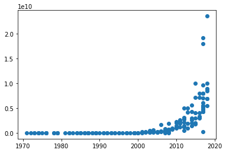
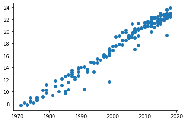
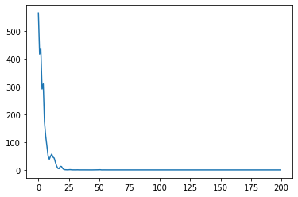
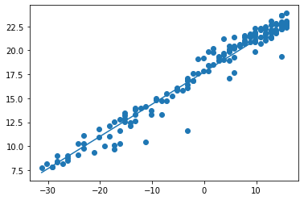

================
by Jawad Haider

- <a href="#linear-regression" id="toc-linear-regression">Linear
  Regression</a>
- <a href="#part-2-making-predictions"
  id="toc-part-2-making-predictions">Part 2: Making Predictions</a>

## Linear Regression

``` python
# Install TensorFlow
# !pip install -q tensorflow-gpu==2.0.0-beta1

try:
  %tensorflow_version 2.x  # Colab only.
except Exception:
  pass

import tensorflow as tf
print(tf.__version__)
```

    `%tensorflow_version` only switches the major version: 1.x or 2.x.
    You set: `2.x  # Colab only.`. This will be interpreted as: `2.x`.


    TensorFlow 2.x selected.
    2.2.0

``` python
# Other imports
import pandas as pd
import numpy as np
import matplotlib.pyplot as plt
```

``` python
# Get the data
!wget https://raw.githubusercontent.com/lazyprogrammer/machine_learning_examples/master/tf2.0/moore.csv
```

    --2020-06-18 16:14:29--  https://raw.githubusercontent.com/lazyprogrammer/machine_learning_examples/master/tf2.0/moore.csv
    Resolving raw.githubusercontent.com (raw.githubusercontent.com)... 151.101.0.133, 151.101.64.133, 151.101.128.133, ...
    Connecting to raw.githubusercontent.com (raw.githubusercontent.com)|151.101.0.133|:443... connected.
    HTTP request sent, awaiting response... 200 OK
    Length: 2302 (2.2K) [text/plain]
    Saving to: ‘moore.csv’

    moore.csv             0%[                    ]       0  --.-KB/s               moore.csv           100%[===================>]   2.25K  --.-KB/s    in 0s      

    2020-06-18 16:14:29 (37.1 MB/s) - ‘moore.csv’ saved [2302/2302]

``` python
# Load in the data
data = pd.read_csv('moore.csv', header=None).values
X = data[:,0].reshape(-1, 1) # make it a 2-D array of size N x D where D = 1
Y = data[:,1]
```

``` python
# Plot the data - it is exponential!
plt.scatter(X, Y)
```

    <matplotlib.collections.PathCollection at 0x7f0b9e493ac8>



``` python
# Since we want a linear model, let's take the log
Y = np.log(Y)
plt.scatter(X, Y)
# that's better
```

    <matplotlib.collections.PathCollection at 0x7f0b9b7eac18>



``` python
# Let's also center the X data so the values are not too large
# We could scale it too but then we'd have to reverse the transformation later
X = X - X.mean()
```

``` python
# Now create our Tensorflow model
model = tf.keras.models.Sequential([
  tf.keras.layers.Input(shape=(1,)),
  tf.keras.layers.Dense(1)
])

model.compile(optimizer=tf.keras.optimizers.SGD(0.001, 0.9), loss='mse')
# model.compile(optimizer='adam', loss='mse')


# learning rate scheduler
def schedule(epoch, lr):
  if epoch >= 50:
    return 0.0001
  return 0.001
 

scheduler = tf.keras.callbacks.LearningRateScheduler(schedule)


# Train the model
r = model.fit(X, Y, epochs=200, callbacks=[scheduler])
```

    Epoch 1/200
    6/6 [==============================] - 0s 2ms/step - loss: 564.7578 - lr: 0.0010
    Epoch 2/200
    6/6 [==============================] - 0s 1ms/step - loss: 416.5006 - lr: 0.0010
    Epoch 3/200
    6/6 [==============================] - 0s 1ms/step - loss: 435.8105 - lr: 0.0010
    Epoch 4/200
    6/6 [==============================] - 0s 1ms/step - loss: 291.5248 - lr: 0.0010
    Epoch 5/200
    6/6 [==============================] - 0s 1ms/step - loss: 309.7632 - lr: 0.0010
    Epoch 6/200
    6/6 [==============================] - 0s 1ms/step - loss: 173.2291 - lr: 0.0010
    Epoch 7/200
    6/6 [==============================] - 0s 1ms/step - loss: 122.9670 - lr: 0.0010
    Epoch 8/200
    6/6 [==============================] - 0s 1ms/step - loss: 88.1215 - lr: 0.0010
    Epoch 9/200
    6/6 [==============================] - 0s 1ms/step - loss: 51.1509 - lr: 0.0010
    Epoch 10/200
    6/6 [==============================] - 0s 1ms/step - loss: 39.1848 - lr: 0.0010
    Epoch 11/200
    6/6 [==============================] - 0s 1ms/step - loss: 50.0891 - lr: 0.0010
    Epoch 12/200
    6/6 [==============================] - 0s 1ms/step - loss: 57.7818 - lr: 0.0010
    Epoch 13/200
    6/6 [==============================] - 0s 1ms/step - loss: 46.9341 - lr: 0.0010
    Epoch 14/200
    6/6 [==============================] - 0s 1ms/step - loss: 43.3448 - lr: 0.0010
    Epoch 15/200
    6/6 [==============================] - 0s 1ms/step - loss: 28.4526 - lr: 0.0010
    Epoch 16/200
    6/6 [==============================] - 0s 1ms/step - loss: 15.1617 - lr: 0.0010
    Epoch 17/200
    6/6 [==============================] - 0s 2ms/step - loss: 6.5347 - lr: 0.0010
    Epoch 18/200
    6/6 [==============================] - 0s 2ms/step - loss: 5.3453 - lr: 0.0010
    Epoch 19/200
    6/6 [==============================] - 0s 2ms/step - loss: 13.6583 - lr: 0.0010
    Epoch 20/200
    6/6 [==============================] - 0s 1ms/step - loss: 13.0628 - lr: 0.0010
    Epoch 21/200
    6/6 [==============================] - 0s 2ms/step - loss: 6.2095 - lr: 0.0010
    Epoch 22/200
    6/6 [==============================] - 0s 1ms/step - loss: 2.2462 - lr: 0.0010
    Epoch 23/200
    6/6 [==============================] - 0s 1ms/step - loss: 1.5828 - lr: 0.0010
    Epoch 24/200
    6/6 [==============================] - 0s 1ms/step - loss: 1.2626 - lr: 0.0010
    Epoch 25/200
    6/6 [==============================] - 0s 1ms/step - loss: 1.1254 - lr: 0.0010
    Epoch 26/200
    6/6 [==============================] - 0s 2ms/step - loss: 1.4200 - lr: 0.0010
    Epoch 27/200
    6/6 [==============================] - 0s 1ms/step - loss: 1.8661 - lr: 0.0010
    Epoch 28/200
    6/6 [==============================] - 0s 2ms/step - loss: 1.3886 - lr: 0.0010
    Epoch 29/200
    6/6 [==============================] - 0s 2ms/step - loss: 1.0745 - lr: 0.0010
    Epoch 30/200
    6/6 [==============================] - 0s 2ms/step - loss: 1.0018 - lr: 0.0010
    Epoch 31/200
    6/6 [==============================] - 0s 1ms/step - loss: 0.9356 - lr: 0.0010
    Epoch 32/200
    6/6 [==============================] - 0s 1ms/step - loss: 1.0224 - lr: 0.0010
    Epoch 33/200
    6/6 [==============================] - 0s 1ms/step - loss: 1.1923 - lr: 0.0010
    Epoch 34/200
    6/6 [==============================] - 0s 2ms/step - loss: 0.9860 - lr: 0.0010
    Epoch 35/200
    6/6 [==============================] - 0s 2ms/step - loss: 0.9608 - lr: 0.0010
    Epoch 36/200
    6/6 [==============================] - 0s 1ms/step - loss: 1.0304 - lr: 0.0010
    Epoch 37/200
    6/6 [==============================] - 0s 2ms/step - loss: 1.2601 - lr: 0.0010
    Epoch 38/200
    6/6 [==============================] - 0s 1ms/step - loss: 0.9664 - lr: 0.0010
    Epoch 39/200
    6/6 [==============================] - 0s 2ms/step - loss: 0.9088 - lr: 0.0010
    Epoch 40/200
    6/6 [==============================] - 0s 2ms/step - loss: 0.9199 - lr: 0.0010
    Epoch 41/200
    6/6 [==============================] - 0s 2ms/step - loss: 1.0986 - lr: 0.0010
    Epoch 42/200
    6/6 [==============================] - 0s 1ms/step - loss: 0.9465 - lr: 0.0010
    Epoch 43/200
    6/6 [==============================] - 0s 1ms/step - loss: 0.9290 - lr: 0.0010
    Epoch 44/200
    6/6 [==============================] - 0s 1ms/step - loss: 0.9168 - lr: 0.0010
    Epoch 45/200
    6/6 [==============================] - 0s 1ms/step - loss: 0.8770 - lr: 0.0010
    Epoch 46/200
    6/6 [==============================] - 0s 2ms/step - loss: 0.9378 - lr: 0.0010
    Epoch 47/200
    6/6 [==============================] - 0s 1ms/step - loss: 0.9742 - lr: 0.0010
    Epoch 48/200
    6/6 [==============================] - 0s 1ms/step - loss: 1.0062 - lr: 0.0010
    Epoch 49/200
    6/6 [==============================] - 0s 2ms/step - loss: 1.0642 - lr: 0.0010
    Epoch 50/200
    6/6 [==============================] - 0s 1ms/step - loss: 1.2359 - lr: 0.0010
    Epoch 51/200
    6/6 [==============================] - 0s 1ms/step - loss: 1.5608 - lr: 1.0000e-04
    Epoch 52/200
    6/6 [==============================] - 0s 1ms/step - loss: 1.4480 - lr: 1.0000e-04
    Epoch 53/200
    6/6 [==============================] - 0s 1ms/step - loss: 0.9116 - lr: 1.0000e-04
    Epoch 54/200
    6/6 [==============================] - 0s 1ms/step - loss: 1.0805 - lr: 1.0000e-04
    Epoch 55/200
    6/6 [==============================] - 0s 2ms/step - loss: 0.9856 - lr: 1.0000e-04
    Epoch 56/200
    6/6 [==============================] - 0s 2ms/step - loss: 0.8962 - lr: 1.0000e-04
    Epoch 57/200
    6/6 [==============================] - 0s 3ms/step - loss: 0.8972 - lr: 1.0000e-04
    Epoch 58/200
    6/6 [==============================] - 0s 2ms/step - loss: 0.8909 - lr: 1.0000e-04
    Epoch 59/200
    6/6 [==============================] - 0s 1ms/step - loss: 0.9246 - lr: 1.0000e-04
    Epoch 60/200
    6/6 [==============================] - 0s 1ms/step - loss: 0.9195 - lr: 1.0000e-04
    Epoch 61/200
    6/6 [==============================] - 0s 1ms/step - loss: 0.8844 - lr: 1.0000e-04
    Epoch 62/200
    6/6 [==============================] - 0s 1ms/step - loss: 0.8750 - lr: 1.0000e-04
    Epoch 63/200
    6/6 [==============================] - 0s 2ms/step - loss: 0.8757 - lr: 1.0000e-04
    Epoch 64/200
    6/6 [==============================] - 0s 1ms/step - loss: 0.8778 - lr: 1.0000e-04
    Epoch 65/200
    6/6 [==============================] - 0s 1ms/step - loss: 0.8765 - lr: 1.0000e-04
    Epoch 66/200
    6/6 [==============================] - 0s 1ms/step - loss: 0.8757 - lr: 1.0000e-04
    Epoch 67/200
    6/6 [==============================] - 0s 1ms/step - loss: 0.8775 - lr: 1.0000e-04
    Epoch 68/200
    6/6 [==============================] - 0s 1ms/step - loss: 0.8722 - lr: 1.0000e-04
    Epoch 69/200
    6/6 [==============================] - 0s 1ms/step - loss: 0.8820 - lr: 1.0000e-04
    Epoch 70/200
    6/6 [==============================] - 0s 1ms/step - loss: 0.8755 - lr: 1.0000e-04
    Epoch 71/200
    6/6 [==============================] - 0s 3ms/step - loss: 0.8759 - lr: 1.0000e-04
    Epoch 72/200
    6/6 [==============================] - 0s 1ms/step - loss: 0.8742 - lr: 1.0000e-04
    Epoch 73/200
    6/6 [==============================] - 0s 2ms/step - loss: 0.8739 - lr: 1.0000e-04
    Epoch 74/200
    6/6 [==============================] - 0s 2ms/step - loss: 0.8822 - lr: 1.0000e-04
    Epoch 75/200
    6/6 [==============================] - 0s 1ms/step - loss: 0.8789 - lr: 1.0000e-04
    Epoch 76/200
    6/6 [==============================] - 0s 2ms/step - loss: 0.8737 - lr: 1.0000e-04
    Epoch 77/200
    6/6 [==============================] - 0s 1ms/step - loss: 0.8740 - lr: 1.0000e-04
    Epoch 78/200
    6/6 [==============================] - 0s 1ms/step - loss: 0.8715 - lr: 1.0000e-04
    Epoch 79/200
    6/6 [==============================] - 0s 2ms/step - loss: 0.8746 - lr: 1.0000e-04
    Epoch 80/200
    6/6 [==============================] - 0s 1ms/step - loss: 0.8734 - lr: 1.0000e-04
    Epoch 81/200
    6/6 [==============================] - 0s 1ms/step - loss: 0.8754 - lr: 1.0000e-04
    Epoch 82/200
    6/6 [==============================] - 0s 1ms/step - loss: 0.9202 - lr: 1.0000e-04
    Epoch 83/200
    6/6 [==============================] - 0s 2ms/step - loss: 0.9127 - lr: 1.0000e-04
    Epoch 84/200
    6/6 [==============================] - 0s 2ms/step - loss: 0.8801 - lr: 1.0000e-04
    Epoch 85/200
    6/6 [==============================] - 0s 2ms/step - loss: 0.9101 - lr: 1.0000e-04
    Epoch 86/200
    6/6 [==============================] - 0s 2ms/step - loss: 0.8975 - lr: 1.0000e-04
    Epoch 87/200
    6/6 [==============================] - 0s 2ms/step - loss: 0.8751 - lr: 1.0000e-04
    Epoch 88/200
    6/6 [==============================] - 0s 2ms/step - loss: 0.9003 - lr: 1.0000e-04
    Epoch 89/200
    6/6 [==============================] - 0s 2ms/step - loss: 0.8835 - lr: 1.0000e-04
    Epoch 90/200
    6/6 [==============================] - 0s 2ms/step - loss: 0.8847 - lr: 1.0000e-04
    Epoch 91/200
    6/6 [==============================] - 0s 2ms/step - loss: 0.8835 - lr: 1.0000e-04
    Epoch 92/200
    6/6 [==============================] - 0s 2ms/step - loss: 0.8738 - lr: 1.0000e-04
    Epoch 93/200
    6/6 [==============================] - 0s 2ms/step - loss: 0.8766 - lr: 1.0000e-04
    Epoch 94/200
    6/6 [==============================] - 0s 2ms/step - loss: 0.8879 - lr: 1.0000e-04
    Epoch 95/200
    6/6 [==============================] - 0s 2ms/step - loss: 0.8782 - lr: 1.0000e-04
    Epoch 96/200
    6/6 [==============================] - 0s 1ms/step - loss: 0.8820 - lr: 1.0000e-04
    Epoch 97/200
    6/6 [==============================] - 0s 1ms/step - loss: 0.8783 - lr: 1.0000e-04
    Epoch 98/200
    6/6 [==============================] - 0s 2ms/step - loss: 0.8732 - lr: 1.0000e-04
    Epoch 99/200
    6/6 [==============================] - 0s 1ms/step - loss: 0.8792 - lr: 1.0000e-04
    Epoch 100/200
    6/6 [==============================] - 0s 1ms/step - loss: 0.8876 - lr: 1.0000e-04
    Epoch 101/200
    6/6 [==============================] - 0s 1ms/step - loss: 0.8766 - lr: 1.0000e-04
    Epoch 102/200
    6/6 [==============================] - 0s 2ms/step - loss: 0.8823 - lr: 1.0000e-04
    Epoch 103/200
    6/6 [==============================] - 0s 2ms/step - loss: 0.8881 - lr: 1.0000e-04
    Epoch 104/200
    6/6 [==============================] - 0s 2ms/step - loss: 0.8811 - lr: 1.0000e-04
    Epoch 105/200
    6/6 [==============================] - 0s 1ms/step - loss: 0.8718 - lr: 1.0000e-04
    Epoch 106/200
    6/6 [==============================] - 0s 1ms/step - loss: 0.8732 - lr: 1.0000e-04
    Epoch 107/200
    6/6 [==============================] - 0s 2ms/step - loss: 0.8719 - lr: 1.0000e-04
    Epoch 108/200
    6/6 [==============================] - 0s 2ms/step - loss: 0.8730 - lr: 1.0000e-04
    Epoch 109/200
    6/6 [==============================] - 0s 2ms/step - loss: 0.8898 - lr: 1.0000e-04
    Epoch 110/200
    6/6 [==============================] - 0s 2ms/step - loss: 0.8772 - lr: 1.0000e-04
    Epoch 111/200
    6/6 [==============================] - 0s 2ms/step - loss: 0.8751 - lr: 1.0000e-04
    Epoch 112/200
    6/6 [==============================] - 0s 1ms/step - loss: 0.8814 - lr: 1.0000e-04
    Epoch 113/200
    6/6 [==============================] - 0s 1ms/step - loss: 0.8745 - lr: 1.0000e-04
    Epoch 114/200
    6/6 [==============================] - 0s 1ms/step - loss: 0.8742 - lr: 1.0000e-04
    Epoch 115/200
    6/6 [==============================] - 0s 2ms/step - loss: 0.8779 - lr: 1.0000e-04
    Epoch 116/200
    6/6 [==============================] - 0s 2ms/step - loss: 0.8807 - lr: 1.0000e-04
    Epoch 117/200
    6/6 [==============================] - 0s 2ms/step - loss: 0.8740 - lr: 1.0000e-04
    Epoch 118/200
    6/6 [==============================] - 0s 1ms/step - loss: 0.8724 - lr: 1.0000e-04
    Epoch 119/200
    6/6 [==============================] - 0s 2ms/step - loss: 0.8773 - lr: 1.0000e-04
    Epoch 120/200
    6/6 [==============================] - 0s 2ms/step - loss: 0.8761 - lr: 1.0000e-04
    Epoch 121/200
    6/6 [==============================] - 0s 2ms/step - loss: 0.8736 - lr: 1.0000e-04
    Epoch 122/200
    6/6 [==============================] - 0s 1ms/step - loss: 0.8712 - lr: 1.0000e-04
    Epoch 123/200
    6/6 [==============================] - 0s 2ms/step - loss: 0.8758 - lr: 1.0000e-04
    Epoch 124/200
    6/6 [==============================] - 0s 2ms/step - loss: 0.8742 - lr: 1.0000e-04
    Epoch 125/200
    6/6 [==============================] - 0s 1ms/step - loss: 0.8714 - lr: 1.0000e-04
    Epoch 126/200
    6/6 [==============================] - 0s 1ms/step - loss: 0.8715 - lr: 1.0000e-04
    Epoch 127/200
    6/6 [==============================] - 0s 1ms/step - loss: 0.8725 - lr: 1.0000e-04
    Epoch 128/200
    6/6 [==============================] - 0s 1ms/step - loss: 0.8748 - lr: 1.0000e-04
    Epoch 129/200
    6/6 [==============================] - 0s 1ms/step - loss: 0.8769 - lr: 1.0000e-04
    Epoch 130/200
    6/6 [==============================] - 0s 1ms/step - loss: 0.8706 - lr: 1.0000e-04
    Epoch 131/200
    6/6 [==============================] - 0s 1ms/step - loss: 0.8716 - lr: 1.0000e-04
    Epoch 132/200
    6/6 [==============================] - 0s 1ms/step - loss: 0.8730 - lr: 1.0000e-04
    Epoch 133/200
    6/6 [==============================] - 0s 1ms/step - loss: 0.8739 - lr: 1.0000e-04
    Epoch 134/200
    6/6 [==============================] - 0s 1ms/step - loss: 0.8878 - lr: 1.0000e-04
    Epoch 135/200
    6/6 [==============================] - 0s 1ms/step - loss: 0.8825 - lr: 1.0000e-04
    Epoch 136/200
    6/6 [==============================] - 0s 1ms/step - loss: 0.8833 - lr: 1.0000e-04
    Epoch 137/200
    6/6 [==============================] - 0s 2ms/step - loss: 0.9046 - lr: 1.0000e-04
    Epoch 138/200
    6/6 [==============================] - 0s 2ms/step - loss: 0.8770 - lr: 1.0000e-04
    Epoch 139/200
    6/6 [==============================] - 0s 2ms/step - loss: 0.8811 - lr: 1.0000e-04
    Epoch 140/200
    6/6 [==============================] - 0s 1ms/step - loss: 0.8759 - lr: 1.0000e-04
    Epoch 141/200
    6/6 [==============================] - 0s 2ms/step - loss: 0.8711 - lr: 1.0000e-04
    Epoch 142/200
    6/6 [==============================] - 0s 1ms/step - loss: 0.8715 - lr: 1.0000e-04
    Epoch 143/200
    6/6 [==============================] - 0s 1ms/step - loss: 0.8749 - lr: 1.0000e-04
    Epoch 144/200
    6/6 [==============================] - 0s 2ms/step - loss: 0.8770 - lr: 1.0000e-04
    Epoch 145/200
    6/6 [==============================] - 0s 1ms/step - loss: 0.8843 - lr: 1.0000e-04
    Epoch 146/200
    6/6 [==============================] - 0s 2ms/step - loss: 0.8729 - lr: 1.0000e-04
    Epoch 147/200
    6/6 [==============================] - 0s 2ms/step - loss: 0.8829 - lr: 1.0000e-04
    Epoch 148/200
    6/6 [==============================] - 0s 2ms/step - loss: 0.8759 - lr: 1.0000e-04
    Epoch 149/200
    6/6 [==============================] - 0s 1ms/step - loss: 0.8953 - lr: 1.0000e-04
    Epoch 150/200
    6/6 [==============================] - 0s 2ms/step - loss: 0.9202 - lr: 1.0000e-04
    Epoch 151/200
    6/6 [==============================] - 0s 2ms/step - loss: 0.8893 - lr: 1.0000e-04
    Epoch 152/200
    6/6 [==============================] - 0s 3ms/step - loss: 0.8754 - lr: 1.0000e-04
    Epoch 153/200
    6/6 [==============================] - 0s 1ms/step - loss: 0.8883 - lr: 1.0000e-04
    Epoch 154/200
    6/6 [==============================] - 0s 1ms/step - loss: 0.8810 - lr: 1.0000e-04
    Epoch 155/200
    6/6 [==============================] - 0s 1ms/step - loss: 0.9087 - lr: 1.0000e-04
    Epoch 156/200
    6/6 [==============================] - 0s 1ms/step - loss: 0.8908 - lr: 1.0000e-04
    Epoch 157/200
    6/6 [==============================] - 0s 1ms/step - loss: 0.8742 - lr: 1.0000e-04
    Epoch 158/200
    6/6 [==============================] - 0s 1ms/step - loss: 0.8722 - lr: 1.0000e-04
    Epoch 159/200
    6/6 [==============================] - 0s 2ms/step - loss: 0.8697 - lr: 1.0000e-04
    Epoch 160/200
    6/6 [==============================] - 0s 1ms/step - loss: 0.8768 - lr: 1.0000e-04
    Epoch 161/200
    6/6 [==============================] - 0s 2ms/step - loss: 0.8773 - lr: 1.0000e-04
    Epoch 162/200
    6/6 [==============================] - 0s 1ms/step - loss: 0.8770 - lr: 1.0000e-04
    Epoch 163/200
    6/6 [==============================] - 0s 2ms/step - loss: 0.9014 - lr: 1.0000e-04
    Epoch 164/200
    6/6 [==============================] - 0s 1ms/step - loss: 0.9614 - lr: 1.0000e-04
    Epoch 165/200
    6/6 [==============================] - 0s 2ms/step - loss: 0.8981 - lr: 1.0000e-04
    Epoch 166/200
    6/6 [==============================] - 0s 2ms/step - loss: 0.8774 - lr: 1.0000e-04
    Epoch 167/200
    6/6 [==============================] - 0s 1ms/step - loss: 0.8831 - lr: 1.0000e-04
    Epoch 168/200
    6/6 [==============================] - 0s 1ms/step - loss: 0.8719 - lr: 1.0000e-04
    Epoch 169/200
    6/6 [==============================] - 0s 2ms/step - loss: 0.8717 - lr: 1.0000e-04
    Epoch 170/200
    6/6 [==============================] - 0s 2ms/step - loss: 0.8751 - lr: 1.0000e-04
    Epoch 171/200
    6/6 [==============================] - 0s 2ms/step - loss: 0.8804 - lr: 1.0000e-04
    Epoch 172/200
    6/6 [==============================] - 0s 2ms/step - loss: 0.8728 - lr: 1.0000e-04
    Epoch 173/200
    6/6 [==============================] - 0s 2ms/step - loss: 0.8745 - lr: 1.0000e-04
    Epoch 174/200
    6/6 [==============================] - 0s 1ms/step - loss: 0.8770 - lr: 1.0000e-04
    Epoch 175/200
    6/6 [==============================] - 0s 2ms/step - loss: 0.8736 - lr: 1.0000e-04
    Epoch 176/200
    6/6 [==============================] - 0s 1ms/step - loss: 0.8843 - lr: 1.0000e-04
    Epoch 177/200
    6/6 [==============================] - 0s 1ms/step - loss: 0.8807 - lr: 1.0000e-04
    Epoch 178/200
    6/6 [==============================] - 0s 1ms/step - loss: 0.8691 - lr: 1.0000e-04
    Epoch 179/200
    6/6 [==============================] - 0s 1ms/step - loss: 0.9173 - lr: 1.0000e-04
    Epoch 180/200
    6/6 [==============================] - 0s 2ms/step - loss: 0.9064 - lr: 1.0000e-04
    Epoch 181/200
    6/6 [==============================] - 0s 1ms/step - loss: 0.8801 - lr: 1.0000e-04
    Epoch 182/200
    6/6 [==============================] - 0s 1ms/step - loss: 0.8868 - lr: 1.0000e-04
    Epoch 183/200
    6/6 [==============================] - 0s 2ms/step - loss: 0.8794 - lr: 1.0000e-04
    Epoch 184/200
    6/6 [==============================] - 0s 2ms/step - loss: 0.8743 - lr: 1.0000e-04
    Epoch 185/200
    6/6 [==============================] - 0s 2ms/step - loss: 0.8744 - lr: 1.0000e-04
    Epoch 186/200
    6/6 [==============================] - 0s 2ms/step - loss: 0.8731 - lr: 1.0000e-04
    Epoch 187/200
    6/6 [==============================] - 0s 1ms/step - loss: 0.8709 - lr: 1.0000e-04
    Epoch 188/200
    6/6 [==============================] - 0s 1ms/step - loss: 0.8752 - lr: 1.0000e-04
    Epoch 189/200
    6/6 [==============================] - 0s 3ms/step - loss: 0.8969 - lr: 1.0000e-04
    Epoch 190/200
    6/6 [==============================] - 0s 1ms/step - loss: 0.8766 - lr: 1.0000e-04
    Epoch 191/200
    6/6 [==============================] - 0s 2ms/step - loss: 0.8744 - lr: 1.0000e-04
    Epoch 192/200
    6/6 [==============================] - 0s 2ms/step - loss: 0.8772 - lr: 1.0000e-04
    Epoch 193/200
    6/6 [==============================] - 0s 1ms/step - loss: 0.9139 - lr: 1.0000e-04
    Epoch 194/200
    6/6 [==============================] - 0s 1ms/step - loss: 0.9380 - lr: 1.0000e-04
    Epoch 195/200
    6/6 [==============================] - 0s 1ms/step - loss: 0.8694 - lr: 1.0000e-04
    Epoch 196/200
    6/6 [==============================] - 0s 2ms/step - loss: 0.8820 - lr: 1.0000e-04
    Epoch 197/200
    6/6 [==============================] - 0s 1ms/step - loss: 0.8696 - lr: 1.0000e-04
    Epoch 198/200
    6/6 [==============================] - 0s 2ms/step - loss: 0.8744 - lr: 1.0000e-04
    Epoch 199/200
    6/6 [==============================] - 0s 1ms/step - loss: 0.9066 - lr: 1.0000e-04
    Epoch 200/200
    6/6 [==============================] - 0s 3ms/step - loss: 0.8892 - lr: 1.0000e-04

``` python
# Plot the loss
plt.plot(r.history['loss'], label='loss')
```



``` python
# Get the slope of the line
# The slope of the line is related to the doubling rate of transistor count
print(model.layers) # Note: there is only 1 layer, the "Input" layer doesn't count
print(model.layers[0].get_weights())
```

    [<tensorflow.python.keras.layers.core.Dense object at 0x7f0b9e97eda0>]
    [array([[0.3362535]], dtype=float32), array([17.74322], dtype=float32)]

``` python
# The slope of the line is:
a = model.layers[0].get_weights()[0][0,0]
```

Our original model for exponential growth is:

$$ C = A_0 r^t $$

Where \$ C \$ is transistor the count and \$ t \$ is the year.

\$ r \$ is the rate of growth. For example, when \$ t \$ goes from 1 to
2, \$ C \$ increases by a factor of \$ r \$. When \$ t \$ goes from 2 to
3, \$ C \$ increases by a factor of \$ r \$ again.

When we take the log of both sides, we get:

$$ \log C = \log r * t + \log A_0 $$

This is our linear equation:

$$ \hat{y} = ax + b $$

Where:

$$ \hat{y} = \log C $$ $$ a = \log r $$ $$ x = t $$ $$ b = \log A_0 $$

We are interested in \$ r \$, because that’s the rate of growth. Given
our regression weights, we know that:

$$ a = 0.34188038 $$

so that:

$$ r = e^{0.34188038} = 1.4076 $$

To find the time it takes for transistor count to double, we simply need
to find the amount of time it takes for \$ C \$ to increase to \$ 2C \$.

Let’s call the original starting time \$ t \$, to correspond with the
initial transistor count \$ C \$.

Let’s call the end time \$ t’ \$, to correspond with the final
transistor count \$ 2C \$.

Then we also have:

$$ 2C = A_0 r ^ {t'} $$

Combine this with our original equation:

$$ C = A_0 r^t $$

We get (by dividing the 2 equations):

$$ 2C/C = (A_0 r ^ {t'}) / A_0 r^t $$

Which simplifies to:

$$ 2 = r^{(t' - t)} $$

Solve for \$ t’ - t \$:

$$ t' - t = \frac{\log 2}{\log r} = \frac{\log2}{a}$$

Important note! We haven’t specified what the starting time \$ t \$
actually is, and we don’t have to since we just proved that this holds
for any \$ t \$.

``` python
print("Time to double:", np.log(2) / a)
```

    Time to double: 2.0613828343145832

``` python
# If you know the analytical solution
X = np.array(X).flatten()
Y = np.array(Y)
denominator = X.dot(X) - X.mean() * X.sum()
a = ( X.dot(Y) - Y.mean()*X.sum() ) / denominator
b = ( Y.mean() * X.dot(X) - X.mean() * X.dot(Y) ) / denominator
print(a, b)
print("Time to double:", np.log(2) / a)
```

    0.341682487387313 17.764939393631764
    Time to double: 2.0286295205239204

# Part 2: Making Predictions

This goes with the lecture “Making Predictions”

``` python
# Make sure the line fits our data
Yhat = model.predict(X).flatten()
plt.scatter(X, Y)
plt.plot(X, Yhat)
```



``` python
# Manual calculation

# Get the weights
w, b = model.layers[0].get_weights()

# Reshape X because we flattened it again earlier
X = X.reshape(-1, 1)

# (N x 1) x (1 x 1) + (1) --> (N x 1)
Yhat2 = (X.dot(w) + b).flatten()

# Don't use == for floating points
np.allclose(Yhat, Yhat2)
```

    True

<center>

<a href=''>  </a>

</center>
<center>
<em>Copyright Qalmaqihir</em>
</center>
<center>
<em>For more information, visit us at
<a href='http://www.github.com/qalmaqihir/'>www.github.com/qalmaqihir/</a></em>
</center>
