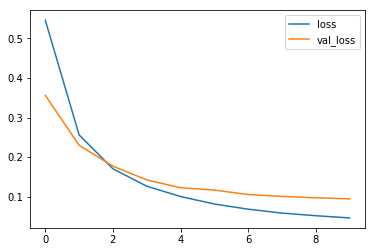
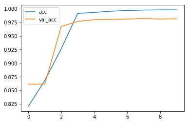

Tensorflow BootCamp - Natural Language Processing
================
by Jawad Haider

- <a href="#spam-detection-rnn" id="toc-spam-detection-rnn">Spam Detection
  RNN</a>

## Spam Detection RNN

``` python
# Install TensorFlow
# !pip install -q tensorflow-gpu==2.0.0-beta1

try:
  %tensorflow_version 2.x  # Colab only.
except Exception:
  pass

import tensorflow as tf
print(tf.__version__)
```

    `%tensorflow_version` only switches the major version: `1.x` or `2.x`.
    You set: `2.x  # Colab only.`. This will be interpreted as: `2.x`.


    TensorFlow 2.x selected.
    2.0.0-beta1

``` python
import numpy as np
import pandas as pd
import matplotlib.pyplot as plt
from sklearn.model_selection import train_test_split

from tensorflow.keras.preprocessing.text import Tokenizer
from tensorflow.keras.preprocessing.sequence import pad_sequences
from tensorflow.keras.layers import Dense, Input, GlobalMaxPooling1D
from tensorflow.keras.layers import LSTM, Embedding
from tensorflow.keras.models import Model
```

``` python
# Unfortunately this URL doesn't work directly with pd.read_csv
!wget -nc https://lazyprogrammer.me/course_files/spam.csv
```

    --2019-08-02 21:15:36--  https://lazyprogrammer.me/course_files/spam.csv
    Resolving lazyprogrammer.me (lazyprogrammer.me)... 104.31.81.48, 104.31.80.48, 2606:4700:30::681f:5130, ...
    Connecting to lazyprogrammer.me (lazyprogrammer.me)|104.31.81.48|:443... connected.
    HTTP request sent, awaiting response... 200 OK
    Length: 503663 (492K) [text/csv]
    Saving to: ‘spam.csv.3’

    spam.csv.3            0%[                    ]       0  --.-KB/s               spam.csv.3          100%[===================>] 491.86K  --.-KB/s    in 0.02s   

    2019-08-02 21:15:36 (23.7 MB/s) - ‘spam.csv.3’ saved [503663/503663]

``` python
!head spam.csv
```

    UnicodeDecodeError: ignored

``` python
df = pd.read_csv('spam.csv', encoding='ISO-8859-1')
```

``` python
df.head()
```

<div>
<style scoped>
    .dataframe tbody tr th:only-of-type {
        vertical-align: middle;
    }

    .dataframe tbody tr th {
        vertical-align: top;
    }

    .dataframe thead th {
        text-align: right;
    }
</style>
<table border="1" class="dataframe">
  <thead>
    <tr style="text-align: right;">
      <th></th>
      <th>v1</th>
      <th>v2</th>
      <th>Unnamed: 2</th>
      <th>Unnamed: 3</th>
      <th>Unnamed: 4</th>
    </tr>
  </thead>
  <tbody>
    <tr>
      <th>0</th>
      <td>ham</td>
      <td>Go until jurong point, crazy.. Available only ...</td>
      <td>NaN</td>
      <td>NaN</td>
      <td>NaN</td>
    </tr>
    <tr>
      <th>1</th>
      <td>ham</td>
      <td>Ok lar... Joking wif u oni...</td>
      <td>NaN</td>
      <td>NaN</td>
      <td>NaN</td>
    </tr>
    <tr>
      <th>2</th>
      <td>spam</td>
      <td>Free entry in 2 a wkly comp to win FA Cup fina...</td>
      <td>NaN</td>
      <td>NaN</td>
      <td>NaN</td>
    </tr>
    <tr>
      <th>3</th>
      <td>ham</td>
      <td>U dun say so early hor... U c already then say...</td>
      <td>NaN</td>
      <td>NaN</td>
      <td>NaN</td>
    </tr>
    <tr>
      <th>4</th>
      <td>ham</td>
      <td>Nah I don't think he goes to usf, he lives aro...</td>
      <td>NaN</td>
      <td>NaN</td>
      <td>NaN</td>
    </tr>
  </tbody>
</table>
</div>

``` python
# drop unnecessary columns
df = df.drop(["Unnamed: 2", "Unnamed: 3", "Unnamed: 4"], axis=1)
```

``` python
df.head()
```

<div>
<style scoped>
    .dataframe tbody tr th:only-of-type {
        vertical-align: middle;
    }

    .dataframe tbody tr th {
        vertical-align: top;
    }

    .dataframe thead th {
        text-align: right;
    }
</style>
<table border="1" class="dataframe">
  <thead>
    <tr style="text-align: right;">
      <th></th>
      <th>v1</th>
      <th>v2</th>
    </tr>
  </thead>
  <tbody>
    <tr>
      <th>0</th>
      <td>ham</td>
      <td>Go until jurong point, crazy.. Available only ...</td>
    </tr>
    <tr>
      <th>1</th>
      <td>ham</td>
      <td>Ok lar... Joking wif u oni...</td>
    </tr>
    <tr>
      <th>2</th>
      <td>spam</td>
      <td>Free entry in 2 a wkly comp to win FA Cup fina...</td>
    </tr>
    <tr>
      <th>3</th>
      <td>ham</td>
      <td>U dun say so early hor... U c already then say...</td>
    </tr>
    <tr>
      <th>4</th>
      <td>ham</td>
      <td>Nah I don't think he goes to usf, he lives aro...</td>
    </tr>
  </tbody>
</table>
</div>

``` python
# rename columns to something better
df.columns = ['labels', 'data']
```

``` python
df.head()
```

<div>
<style scoped>
    .dataframe tbody tr th:only-of-type {
        vertical-align: middle;
    }

    .dataframe tbody tr th {
        vertical-align: top;
    }

    .dataframe thead th {
        text-align: right;
    }
</style>
<table border="1" class="dataframe">
  <thead>
    <tr style="text-align: right;">
      <th></th>
      <th>labels</th>
      <th>data</th>
    </tr>
  </thead>
  <tbody>
    <tr>
      <th>0</th>
      <td>ham</td>
      <td>Go until jurong point, crazy.. Available only ...</td>
    </tr>
    <tr>
      <th>1</th>
      <td>ham</td>
      <td>Ok lar... Joking wif u oni...</td>
    </tr>
    <tr>
      <th>2</th>
      <td>spam</td>
      <td>Free entry in 2 a wkly comp to win FA Cup fina...</td>
    </tr>
    <tr>
      <th>3</th>
      <td>ham</td>
      <td>U dun say so early hor... U c already then say...</td>
    </tr>
    <tr>
      <th>4</th>
      <td>ham</td>
      <td>Nah I don't think he goes to usf, he lives aro...</td>
    </tr>
  </tbody>
</table>
</div>

``` python
# create binary labels
df['b_labels'] = df['labels'].map({'ham': 0, 'spam': 1})
Y = df['b_labels'].values
```

``` python
# split up the data
df_train, df_test, Ytrain, Ytest = train_test_split(df['data'], Y, test_size=0.33)
```

``` python
# Convert sentences to sequences
MAX_VOCAB_SIZE = 20000
tokenizer = Tokenizer(num_words=MAX_VOCAB_SIZE)
tokenizer.fit_on_texts(df_train)
sequences_train = tokenizer.texts_to_sequences(df_train)
sequences_test = tokenizer.texts_to_sequences(df_test)
```

``` python
# get word -> integer mapping
word2idx = tokenizer.word_index
V = len(word2idx)
print('Found %s unique tokens.' % V)
```

    Found 7309 unique tokens.

``` python
# pad sequences so that we get a N x T matrix
data_train = pad_sequences(sequences_train)
print('Shape of data train tensor:', data_train.shape)

# get sequence length
T = data_train.shape[1]
```

    Shape of data train tensor: (3733, 189)

``` python
data_test = pad_sequences(sequences_test, maxlen=T)
print('Shape of data test tensor:', data_test.shape)
```

    Shape of data test tensor: (1839, 189)

``` python
# Create the model

# We get to choose embedding dimensionality
D = 20

# Hidden state dimensionality
M = 15

# Note: we actually want to the size of the embedding to (V + 1) x D,
# because the first index starts from 1 and not 0.
# Thus, if the final index of the embedding matrix is V,
# then it actually must have size V + 1.

i = Input(shape=(T,))
x = Embedding(V + 1, D)(i)
x = LSTM(M, return_sequences=True)(x)
x = GlobalMaxPooling1D()(x)
x = Dense(1, activation='sigmoid')(x)

model = Model(i, x)
```

``` python
# Compile and fit
model.compile(
  loss='binary_crossentropy',
  optimizer='adam',
  metrics=['accuracy']
)


print('Training model...')
r = model.fit(
  data_train,
  Ytrain,
  epochs=10,
  validation_data=(data_test, Ytest)
)
```

    Training model...
    Train on 3733 samples, validate on 1839 samples
    Epoch 1/10
    3733/3733 [==============================] - 6s 1ms/sample - loss: 0.5457 - accuracy: 0.8205 - val_loss: 0.3560 - val_accuracy: 0.8613
    Epoch 2/10
    3733/3733 [==============================] - 4s 1ms/sample - loss: 0.2561 - accuracy: 0.8679 - val_loss: 0.2299 - val_accuracy: 0.8613
    Epoch 3/10
    3733/3733 [==============================] - 4s 1ms/sample - loss: 0.1705 - accuracy: 0.9263 - val_loss: 0.1772 - val_accuracy: 0.9674
    Epoch 4/10
    3733/3733 [==============================] - 4s 1ms/sample - loss: 0.1265 - accuracy: 0.9914 - val_loss: 0.1424 - val_accuracy: 0.9766
    Epoch 5/10
    3733/3733 [==============================] - 4s 1ms/sample - loss: 0.1004 - accuracy: 0.9933 - val_loss: 0.1227 - val_accuracy: 0.9799
    Epoch 6/10
    3733/3733 [==============================] - 4s 1ms/sample - loss: 0.0815 - accuracy: 0.9954 - val_loss: 0.1168 - val_accuracy: 0.9804
    Epoch 7/10
    3733/3733 [==============================] - 4s 1ms/sample - loss: 0.0685 - accuracy: 0.9968 - val_loss: 0.1055 - val_accuracy: 0.9810
    Epoch 8/10
    3733/3733 [==============================] - 4s 1ms/sample - loss: 0.0586 - accuracy: 0.9976 - val_loss: 0.1006 - val_accuracy: 0.9821
    Epoch 9/10
    3733/3733 [==============================] - 4s 1ms/sample - loss: 0.0520 - accuracy: 0.9979 - val_loss: 0.0972 - val_accuracy: 0.9810
    Epoch 10/10
    3733/3733 [==============================] - 4s 1ms/sample - loss: 0.0464 - accuracy: 0.9979 - val_loss: 0.0945 - val_accuracy: 0.9815

``` python
# Plot loss per iteration
import matplotlib.pyplot as plt
plt.plot(r.history['loss'], label='loss')
plt.plot(r.history['val_loss'], label='val_loss')
plt.legend()
```

    <matplotlib.legend.Legend at 0x7f0cb026bef0>



``` python
# Plot accuracy per iteration
plt.plot(r.history['accuracy'], label='acc')
plt.plot(r.history['val_accuracy'], label='val_acc')
plt.legend()
```

    <matplotlib.legend.Legend at 0x7f0cb0250128>



<center>

<a href=''>  </a>

</center>
<center>
<em>Copyright Qalmaqihir</em>
</center>
<center>
<em>For more information, visit us at
<a href='http://www.github.com/qalmaqihir/'>www.github.com/qalmaqihir/</a></em>
</center>
