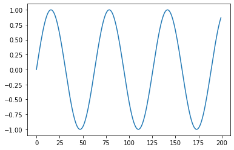
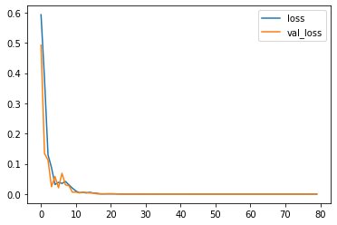
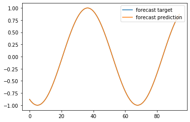

================
by Jawad Haider

- <a href="#autoregressive-model"
  id="toc-autoregressive-model">Autoregressive Model</a>

## Autoregressive Model

``` python
# Install TensorFlow
# !pip install -q tensorflow-gpu==2.0.0-beta1

try:
  %tensorflow_version 2.x  # Colab only.
except Exception:
  pass

import tensorflow as tf
print(tf.__version__)
```

    `%tensorflow_version` only switches the major version: `1.x` or `2.x`.
    You set: `2.x  # Colab only.`. This will be interpreted as: `2.x`.


    TensorFlow 2.x selected.
    2.1.0-rc1

``` python
from tensorflow.keras.layers import Input, Dense
from tensorflow.keras.models import Model
from tensorflow.keras.optimizers import SGD, Adam

import numpy as np
import pandas as pd
import matplotlib.pyplot as plt
```

``` python
# make the original data
series = np.sin(0.1*np.arange(200)) #+ np.random.randn(200)*0.1

# plot it
plt.plot(series)
plt.show()
```



``` python
### build the dataset
# let's see if we can use T past values to predict the next value
T = 10
X = []
Y = []
for t in range(len(series) - T):
  x = series[t:t+T]
  X.append(x)
  y = series[t+T]
  Y.append(y)

X = np.array(X).reshape(-1, T)
Y = np.array(Y)
N = len(X)
print("X.shape", X.shape, "Y.shape", Y.shape)
```

    X.shape (190, 10) Y.shape (190,)

``` python
### try autoregressive linear model
i = Input(shape=(T,))
x = Dense(1)(i)
model = Model(i, x)
model.compile(
  loss='mse',
  optimizer=Adam(lr=0.1),
)

# train the RNN
r = model.fit(
  X[:-N//2], Y[:-N//2],
  epochs=80,
  validation_data=(X[-N//2:], Y[-N//2:]),
)
```

    Train on 95 samples, validate on 95 samples
    Epoch 1/80
    95/95 [==============================] - 1s 6ms/sample - loss: 0.5928 - val_loss: 0.4919
    Epoch 2/80
    95/95 [==============================] - 0s 164us/sample - loss: 0.3797 - val_loss: 0.1337
    Epoch 3/80
    95/95 [==============================] - 0s 266us/sample - loss: 0.1297 - val_loss: 0.1125
    Epoch 4/80
    95/95 [==============================] - 0s 186us/sample - loss: 0.0874 - val_loss: 0.0243
    Epoch 5/80
    95/95 [==============================] - 0s 180us/sample - loss: 0.0316 - val_loss: 0.0582
    Epoch 6/80
    95/95 [==============================] - 0s 205us/sample - loss: 0.0388 - val_loss: 0.0208
    Epoch 7/80
    95/95 [==============================] - 0s 173us/sample - loss: 0.0353 - val_loss: 0.0687
    Epoch 8/80
    95/95 [==============================] - 0s 186us/sample - loss: 0.0416 - val_loss: 0.0304
    Epoch 9/80
    95/95 [==============================] - 0s 170us/sample - loss: 0.0305 - val_loss: 0.0277
    Epoch 10/80
    95/95 [==============================] - 0s 219us/sample - loss: 0.0195 - val_loss: 0.0061
    Epoch 11/80
    95/95 [==============================] - 0s 187us/sample - loss: 0.0101 - val_loss: 0.0063
    Epoch 12/80
    95/95 [==============================] - 0s 184us/sample - loss: 0.0045 - val_loss: 0.0042
    Epoch 13/80
    95/95 [==============================] - 0s 171us/sample - loss: 0.0056 - val_loss: 0.0061
    Epoch 14/80
    95/95 [==============================] - 0s 180us/sample - loss: 0.0038 - val_loss: 0.0053
    Epoch 15/80
    95/95 [==============================] - 0s 180us/sample - loss: 0.0058 - val_loss: 0.0037
    Epoch 16/80
    95/95 [==============================] - 0s 207us/sample - loss: 0.0033 - val_loss: 0.0032
    Epoch 17/80
    95/95 [==============================] - 0s 182us/sample - loss: 0.0026 - val_loss: 4.2511e-04
    Epoch 18/80
    95/95 [==============================] - 0s 179us/sample - loss: 7.7209e-04 - val_loss: 7.0560e-04
    Epoch 19/80
    95/95 [==============================] - 0s 204us/sample - loss: 5.4705e-04 - val_loss: 6.5394e-04
    Epoch 20/80
    95/95 [==============================] - 0s 181us/sample - loss: 9.3594e-04 - val_loss: 6.7224e-04
    Epoch 21/80
    95/95 [==============================] - 0s 169us/sample - loss: 5.9015e-04 - val_loss: 0.0013
    Epoch 22/80
    95/95 [==============================] - 0s 205us/sample - loss: 8.0676e-04 - val_loss: 5.2523e-04
    Epoch 23/80
    95/95 [==============================] - 0s 224us/sample - loss: 3.5637e-04 - val_loss: 2.0870e-04
    Epoch 24/80
    95/95 [==============================] - 0s 235us/sample - loss: 1.0215e-04 - val_loss: 5.3742e-05
    Epoch 25/80
    95/95 [==============================] - 0s 214us/sample - loss: 1.1322e-04 - val_loss: 8.9134e-05
    Epoch 26/80
    95/95 [==============================] - 0s 174us/sample - loss: 1.1851e-04 - val_loss: 2.4181e-04
    Epoch 27/80
    95/95 [==============================] - 0s 169us/sample - loss: 1.2587e-04 - val_loss: 9.3724e-05
    Epoch 28/80
    95/95 [==============================] - 0s 146us/sample - loss: 9.6006e-05 - val_loss: 4.7208e-05
    Epoch 29/80
    95/95 [==============================] - 0s 186us/sample - loss: 3.7994e-05 - val_loss: 2.2043e-05
    Epoch 30/80
    95/95 [==============================] - 0s 171us/sample - loss: 1.7351e-05 - val_loss: 8.1480e-06
    Epoch 31/80
    95/95 [==============================] - 0s 198us/sample - loss: 1.8036e-05 - val_loss: 1.2440e-05
    Epoch 32/80
    95/95 [==============================] - 0s 180us/sample - loss: 1.9975e-05 - val_loss: 2.8459e-05
    Epoch 33/80
    95/95 [==============================] - 0s 242us/sample - loss: 1.9230e-05 - val_loss: 1.5293e-05
    Epoch 34/80
    95/95 [==============================] - 0s 172us/sample - loss: 1.2585e-05 - val_loss: 6.7560e-06
    Epoch 35/80
    95/95 [==============================] - 0s 219us/sample - loss: 4.1914e-06 - val_loss: 3.5701e-06
    Epoch 36/80
    95/95 [==============================] - 0s 171us/sample - loss: 3.0705e-06 - val_loss: 3.9625e-06
    Epoch 37/80
    95/95 [==============================] - 0s 176us/sample - loss: 4.9658e-06 - val_loss: 4.9225e-06
    Epoch 38/80
    95/95 [==============================] - 0s 194us/sample - loss: 4.6270e-06 - val_loss: 3.9518e-06
    Epoch 39/80
    95/95 [==============================] - 0s 180us/sample - loss: 2.0241e-06 - val_loss: 1.9492e-06
    Epoch 40/80
    95/95 [==============================] - 0s 228us/sample - loss: 1.1528e-06 - val_loss: 7.1516e-07
    Epoch 41/80
    95/95 [==============================] - 0s 195us/sample - loss: 1.2629e-06 - val_loss: 7.8588e-07
    Epoch 42/80
    95/95 [==============================] - 0s 217us/sample - loss: 1.2023e-06 - val_loss: 8.7311e-07
    Epoch 43/80
    95/95 [==============================] - 0s 159us/sample - loss: 8.9838e-07 - val_loss: 1.4360e-06
    Epoch 44/80
    95/95 [==============================] - 0s 191us/sample - loss: 7.9823e-07 - val_loss: 4.8116e-07
    Epoch 45/80
    95/95 [==============================] - 0s 176us/sample - loss: 4.4251e-07 - val_loss: 4.6078e-08
    Epoch 46/80
    95/95 [==============================] - 0s 191us/sample - loss: 2.9620e-07 - val_loss: 1.3887e-07
    Epoch 47/80
    95/95 [==============================] - 0s 227us/sample - loss: 2.5926e-07 - val_loss: 2.5561e-07
    Epoch 48/80
    95/95 [==============================] - 0s 159us/sample - loss: 2.0303e-07 - val_loss: 3.1984e-07
    Epoch 49/80
    95/95 [==============================] - 0s 223us/sample - loss: 1.3438e-07 - val_loss: 2.8710e-08
    Epoch 50/80
    95/95 [==============================] - 0s 180us/sample - loss: 6.0148e-08 - val_loss: 2.4986e-08
    Epoch 51/80
    95/95 [==============================] - 0s 186us/sample - loss: 6.0143e-08 - val_loss: 4.7983e-08
    Epoch 52/80
    95/95 [==============================] - 0s 209us/sample - loss: 5.0851e-08 - val_loss: 5.6664e-08
    Epoch 53/80
    95/95 [==============================] - 0s 208us/sample - loss: 3.9499e-08 - val_loss: 5.2733e-08
    Epoch 54/80
    95/95 [==============================] - 0s 167us/sample - loss: 2.6937e-08 - val_loss: 8.6147e-09
    Epoch 55/80
    95/95 [==============================] - 0s 197us/sample - loss: 1.8057e-08 - val_loss: 3.7212e-09
    Epoch 56/80
    95/95 [==============================] - 0s 196us/sample - loss: 1.7351e-08 - val_loss: 9.4838e-09
    Epoch 57/80
    95/95 [==============================] - 0s 188us/sample - loss: 1.4201e-08 - val_loss: 1.2931e-08
    Epoch 58/80
    95/95 [==============================] - 0s 284us/sample - loss: 7.6740e-09 - val_loss: 1.9589e-08
    Epoch 59/80
    95/95 [==============================] - 0s 215us/sample - loss: 8.0834e-09 - val_loss: 3.3542e-09
    Epoch 60/80
    95/95 [==============================] - 0s 162us/sample - loss: 4.9637e-09 - val_loss: 2.0916e-09
    Epoch 61/80
    95/95 [==============================] - 0s 247us/sample - loss: 4.2822e-09 - val_loss: 2.6194e-09
    Epoch 62/80
    95/95 [==============================] - 0s 216us/sample - loss: 3.0952e-09 - val_loss: 2.4419e-09
    Epoch 63/80
    95/95 [==============================] - 0s 209us/sample - loss: 1.4149e-09 - val_loss: 3.5520e-09
    Epoch 64/80
    95/95 [==============================] - 0s 179us/sample - loss: 1.5010e-09 - val_loss: 1.6126e-09
    Epoch 65/80
    95/95 [==============================] - 0s 182us/sample - loss: 1.5736e-09 - val_loss: 1.0080e-09
    Epoch 66/80
    95/95 [==============================] - 0s 172us/sample - loss: 1.6310e-09 - val_loss: 5.8007e-10
    Epoch 67/80
    95/95 [==============================] - 0s 266us/sample - loss: 1.0262e-09 - val_loss: 7.7888e-11
    Epoch 68/80
    95/95 [==============================] - 0s 203us/sample - loss: 5.2353e-10 - val_loss: 2.4929e-10
    Epoch 69/80
    95/95 [==============================] - 0s 191us/sample - loss: 2.6591e-10 - val_loss: 3.0532e-10
    Epoch 70/80
    95/95 [==============================] - 0s 202us/sample - loss: 2.9230e-10 - val_loss: 3.4441e-10
    Epoch 71/80
    95/95 [==============================] - 0s 171us/sample - loss: 2.6945e-10 - val_loss: 3.9480e-10
    Epoch 72/80
    95/95 [==============================] - 0s 176us/sample - loss: 1.6047e-10 - val_loss: 2.6156e-10
    Epoch 73/80
    95/95 [==============================] - 0s 162us/sample - loss: 1.3762e-10 - val_loss: 7.6606e-11
    Epoch 74/80
    95/95 [==============================] - 0s 189us/sample - loss: 1.1569e-10 - val_loss: 3.6307e-11
    Epoch 75/80
    95/95 [==============================] - 0s 183us/sample - loss: 8.6744e-11 - val_loss: 2.3215e-11
    Epoch 76/80
    95/95 [==============================] - 0s 179us/sample - loss: 5.2023e-11 - val_loss: 1.7341e-11
    Epoch 77/80
    95/95 [==============================] - 0s 196us/sample - loss: 2.9296e-11 - val_loss: 4.5361e-11
    Epoch 78/80
    95/95 [==============================] - 0s 216us/sample - loss: 2.8942e-11 - val_loss: 3.2065e-11
    Epoch 79/80
    95/95 [==============================] - 0s 188us/sample - loss: 2.5990e-11 - val_loss: 2.9623e-11
    Epoch 80/80
    95/95 [==============================] - 0s 213us/sample - loss: 1.8977e-11 - val_loss: 3.0598e-11

``` python
# Plot loss per iteration
import matplotlib.pyplot as plt
plt.plot(r.history['loss'], label='loss')
plt.plot(r.history['val_loss'], label='val_loss')
plt.legend()
```

    <matplotlib.legend.Legend at 0x7f64d4fa0278>



``` python
# "Wrong" forecast using true targets

validation_target = Y[-N//2:]
validation_predictions = []

# index of first validation input
i = -N//2

while len(validation_predictions) < len(validation_target):
  p = model.predict(X[i].reshape(1, -1))[0,0] # 1x1 array -> scalar
  i += 1
  
  # update the predictions list
  validation_predictions.append(p)
```

``` python
plt.plot(validation_target, label='forecast target')
plt.plot(validation_predictions, label='forecast prediction')
plt.legend()
```

    <matplotlib.legend.Legend at 0x7f64d79f8f98>


``` python
# Forecast future values (use only self-predictions for making future predictions)

validation_target = Y[-N//2:]
validation_predictions = []

# first validation input
last_x = X[-N//2] # 1-D array of length T

while len(validation_predictions) < len(validation_target):
  p = model.predict(last_x.reshape(1, -1))[0,0] # 1x1 array -> scalar
  
  # update the predictions list
  validation_predictions.append(p)
  
  # make the new input
  last_x = np.roll(last_x, -1)
  last_x[-1] = p
```

``` python
plt.plot(validation_target, label='forecast target')
plt.plot(validation_predictions, label='forecast prediction')
plt.legend()
```

    <matplotlib.legend.Legend at 0x7f64d7c15cf8>



<center>

<a href=''>  </a>

</center>
<center>
<em>Copyright Qalmaqihir</em>
</center>
<center>
<em>For more information, visit us at
<a href='http://www.github.com/qalmaqihir/'>www.github.com/qalmaqihir/</a></em>
</center>
