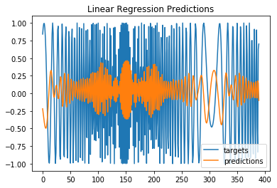

Tensorflow BootCamp - RNN
================
by Jawad Haider

- <a href="#lstm-nonlinear" id="toc-lstm-nonlinear">LSTM Nonlinear</a>

## LSTM Nonlinear

``` python
# Install TensorFlow
# !pip install -q tensorflow-gpu==2.0.0-beta1

try:
  %tensorflow_version 2.x  # Colab only.
except Exception:
  pass

import tensorflow as tf
print(tf.__version__)
```

         |████████████████████████████████| 348.9MB 56kB/s 
         |████████████████████████████████| 501kB 40.2MB/s 
         |████████████████████████████████| 3.1MB 30.3MB/s 
    2.0.0-beta1

``` python
from tensorflow.keras.layers import Input, SimpleRNN, GRU, LSTM, Dense, Flatten
from tensorflow.keras.models import Model
from tensorflow.keras.optimizers import SGD, Adam

import numpy as np
import pandas as pd
import matplotlib.pyplot as plt
```

``` python
# make the original data
series = np.sin((0.1*np.arange(400))**2)
```

This is a time series of the form:

$$ x(t) = \sin(\omega t^2) $$

``` python
# plot it
plt.plot(series)
plt.show()
```


``` python
### build the dataset
# let's see if we can use T past values to predict the next value
T = 10
D = 1
X = []
Y = []
for t in range(len(series) - T):
  x = series[t:t+T]
  X.append(x)
  y = series[t+T]
  Y.append(y)

X = np.array(X).reshape(-1, T) # make it N x T
Y = np.array(Y)
N = len(X)
print("X.shape", X.shape, "Y.shape", Y.shape)
```

    X.shape (390, 10) Y.shape (390,)

``` python
### try autoregressive linear model
i = Input(shape=(T,))
x = Dense(1)(i)
model = Model(i, x)
model.compile(
  loss='mse',
  optimizer=Adam(lr=0.01),
)

# train the RNN
r = model.fit(
  X[:-N//2], Y[:-N//2],
  epochs=80,
  validation_data=(X[-N//2:], Y[-N//2:]),
)
```

    Train on 195 samples, validate on 195 samples
    Epoch 1/80
    195/195 [==============================] - 1s 4ms/sample - loss: 1.4840 - val_loss: 1.7948
    Epoch 2/80
    195/195 [==============================] - 0s 163us/sample - loss: 1.2677 - val_loss: 1.6177
    Epoch 3/80
    195/195 [==============================] - 0s 133us/sample - loss: 1.1125 - val_loss: 1.4296
    Epoch 4/80
    195/195 [==============================] - 0s 136us/sample - loss: 0.9785 - val_loss: 1.2705
    Epoch 5/80
    195/195 [==============================] - 0s 141us/sample - loss: 0.8676 - val_loss: 1.1453
    Epoch 6/80
    195/195 [==============================] - 0s 148us/sample - loss: 0.7908 - val_loss: 1.0479
    Epoch 7/80
    195/195 [==============================] - 0s 171us/sample - loss: 0.7244 - val_loss: 0.9804
    Epoch 8/80
    195/195 [==============================] - 0s 143us/sample - loss: 0.6734 - val_loss: 0.9236
    Epoch 9/80
    195/195 [==============================] - 0s 138us/sample - loss: 0.6292 - val_loss: 0.8579
    Epoch 10/80
    195/195 [==============================] - 0s 136us/sample - loss: 0.5930 - val_loss: 0.8104
    Epoch 11/80
    195/195 [==============================] - 0s 141us/sample - loss: 0.5689 - val_loss: 0.7731
    Epoch 12/80
    195/195 [==============================] - 0s 134us/sample - loss: 0.5469 - val_loss: 0.7495
    Epoch 13/80
    195/195 [==============================] - 0s 145us/sample - loss: 0.5344 - val_loss: 0.7297
    Epoch 14/80
    195/195 [==============================] - 0s 134us/sample - loss: 0.5224 - val_loss: 0.7084
    Epoch 15/80
    195/195 [==============================] - 0s 133us/sample - loss: 0.5142 - val_loss: 0.6959
    Epoch 16/80
    195/195 [==============================] - 0s 153us/sample - loss: 0.5071 - val_loss: 0.6815
    Epoch 17/80
    195/195 [==============================] - 0s 144us/sample - loss: 0.5022 - val_loss: 0.6578
    Epoch 18/80
    195/195 [==============================] - 0s 132us/sample - loss: 0.4998 - val_loss: 0.6325
    Epoch 19/80
    195/195 [==============================] - 0s 136us/sample - loss: 0.4957 - val_loss: 0.6174
    Epoch 20/80
    195/195 [==============================] - 0s 136us/sample - loss: 0.4933 - val_loss: 0.6121
    Epoch 21/80
    195/195 [==============================] - 0s 137us/sample - loss: 0.4913 - val_loss: 0.6212
    Epoch 22/80
    195/195 [==============================] - 0s 135us/sample - loss: 0.4910 - val_loss: 0.6309
    Epoch 23/80
    195/195 [==============================] - 0s 137us/sample - loss: 0.4895 - val_loss: 0.6345
    Epoch 24/80
    195/195 [==============================] - 0s 135us/sample - loss: 0.4884 - val_loss: 0.6274
    Epoch 25/80
    195/195 [==============================] - 0s 139us/sample - loss: 0.4869 - val_loss: 0.6192
    Epoch 26/80
    195/195 [==============================] - 0s 142us/sample - loss: 0.4858 - val_loss: 0.6032
    Epoch 27/80
    195/195 [==============================] - 0s 170us/sample - loss: 0.4875 - val_loss: 0.5860
    Epoch 28/80
    195/195 [==============================] - 0s 154us/sample - loss: 0.4873 - val_loss: 0.5760
    Epoch 29/80
    195/195 [==============================] - 0s 155us/sample - loss: 0.4850 - val_loss: 0.5833
    Epoch 30/80
    195/195 [==============================] - 0s 146us/sample - loss: 0.4867 - val_loss: 0.5925
    Epoch 31/80
    195/195 [==============================] - 0s 150us/sample - loss: 0.4855 - val_loss: 0.5933
    Epoch 32/80
    195/195 [==============================] - 0s 168us/sample - loss: 0.4856 - val_loss: 0.5947
    Epoch 33/80
    195/195 [==============================] - 0s 170us/sample - loss: 0.4876 - val_loss: 0.5957
    Epoch 34/80
    195/195 [==============================] - 0s 161us/sample - loss: 0.4874 - val_loss: 0.6007
    Epoch 35/80
    195/195 [==============================] - 0s 152us/sample - loss: 0.4875 - val_loss: 0.6079
    Epoch 36/80
    195/195 [==============================] - 0s 162us/sample - loss: 0.4872 - val_loss: 0.6131
    Epoch 37/80
    195/195 [==============================] - 0s 161us/sample - loss: 0.4878 - val_loss: 0.6098
    Epoch 38/80
    195/195 [==============================] - 0s 169us/sample - loss: 0.4869 - val_loss: 0.5985
    Epoch 39/80
    195/195 [==============================] - 0s 177us/sample - loss: 0.4866 - val_loss: 0.5879
    Epoch 40/80
    195/195 [==============================] - 0s 214us/sample - loss: 0.4858 - val_loss: 0.5799
    Epoch 41/80
    195/195 [==============================] - 0s 171us/sample - loss: 0.4859 - val_loss: 0.5793
    Epoch 42/80
    195/195 [==============================] - 0s 137us/sample - loss: 0.4868 - val_loss: 0.5852
    Epoch 43/80
    195/195 [==============================] - 0s 137us/sample - loss: 0.4843 - val_loss: 0.5864
    Epoch 44/80
    195/195 [==============================] - 0s 148us/sample - loss: 0.4857 - val_loss: 0.5939
    Epoch 45/80
    195/195 [==============================] - 0s 150us/sample - loss: 0.4862 - val_loss: 0.6014
    Epoch 46/80
    195/195 [==============================] - 0s 151us/sample - loss: 0.4865 - val_loss: 0.5984
    Epoch 47/80
    195/195 [==============================] - 0s 158us/sample - loss: 0.4870 - val_loss: 0.6047
    Epoch 48/80
    195/195 [==============================] - 0s 153us/sample - loss: 0.4881 - val_loss: 0.6061
    Epoch 49/80
    195/195 [==============================] - 0s 140us/sample - loss: 0.4895 - val_loss: 0.6022
    Epoch 50/80
    195/195 [==============================] - 0s 151us/sample - loss: 0.4887 - val_loss: 0.5952
    Epoch 51/80
    195/195 [==============================] - 0s 150us/sample - loss: 0.4869 - val_loss: 0.5878
    Epoch 52/80
    195/195 [==============================] - 0s 147us/sample - loss: 0.4877 - val_loss: 0.5812
    Epoch 53/80
    195/195 [==============================] - 0s 152us/sample - loss: 0.4893 - val_loss: 0.5791
    Epoch 54/80
    195/195 [==============================] - 0s 142us/sample - loss: 0.4906 - val_loss: 0.5832
    Epoch 55/80
    195/195 [==============================] - 0s 135us/sample - loss: 0.4912 - val_loss: 0.5884
    Epoch 56/80
    195/195 [==============================] - 0s 150us/sample - loss: 0.4915 - val_loss: 0.5919
    Epoch 57/80
    195/195 [==============================] - 0s 155us/sample - loss: 0.4920 - val_loss: 0.6021
    Epoch 58/80
    195/195 [==============================] - 0s 151us/sample - loss: 0.4902 - val_loss: 0.6089
    Epoch 59/80
    195/195 [==============================] - 0s 150us/sample - loss: 0.4877 - val_loss: 0.6124
    Epoch 60/80
    195/195 [==============================] - 0s 165us/sample - loss: 0.4884 - val_loss: 0.6090
    Epoch 61/80
    195/195 [==============================] - 0s 146us/sample - loss: 0.4873 - val_loss: 0.6023
    Epoch 62/80
    195/195 [==============================] - 0s 145us/sample - loss: 0.4865 - val_loss: 0.5946
    Epoch 63/80
    195/195 [==============================] - 0s 166us/sample - loss: 0.4863 - val_loss: 0.5984
    Epoch 64/80
    195/195 [==============================] - 0s 153us/sample - loss: 0.4855 - val_loss: 0.5958
    Epoch 65/80
    195/195 [==============================] - 0s 236us/sample - loss: 0.4863 - val_loss: 0.5991
    Epoch 66/80
    195/195 [==============================] - 0s 205us/sample - loss: 0.4875 - val_loss: 0.6030
    Epoch 67/80
    195/195 [==============================] - 0s 140us/sample - loss: 0.4869 - val_loss: 0.6059
    Epoch 68/80
    195/195 [==============================] - 0s 154us/sample - loss: 0.4885 - val_loss: 0.6003
    Epoch 69/80
    195/195 [==============================] - 0s 148us/sample - loss: 0.4880 - val_loss: 0.5904
    Epoch 70/80
    195/195 [==============================] - 0s 149us/sample - loss: 0.4882 - val_loss: 0.5855
    Epoch 71/80
    195/195 [==============================] - 0s 191us/sample - loss: 0.4881 - val_loss: 0.5788
    Epoch 72/80
    195/195 [==============================] - 0s 140us/sample - loss: 0.4874 - val_loss: 0.5805
    Epoch 73/80
    195/195 [==============================] - 0s 167us/sample - loss: 0.4872 - val_loss: 0.5830
    Epoch 74/80
    195/195 [==============================] - 0s 175us/sample - loss: 0.4878 - val_loss: 0.5786
    Epoch 75/80
    195/195 [==============================] - 0s 157us/sample - loss: 0.4862 - val_loss: 0.5886
    Epoch 76/80
    195/195 [==============================] - 0s 152us/sample - loss: 0.4882 - val_loss: 0.5914
    Epoch 77/80
    195/195 [==============================] - 0s 146us/sample - loss: 0.4871 - val_loss: 0.5927
    Epoch 78/80
    195/195 [==============================] - 0s 164us/sample - loss: 0.4863 - val_loss: 0.5945
    Epoch 79/80
    195/195 [==============================] - 0s 170us/sample - loss: 0.4868 - val_loss: 0.5849
    Epoch 80/80
    195/195 [==============================] - 0s 180us/sample - loss: 0.4865 - val_loss: 0.5714

``` python
# Plot loss per iteration
import matplotlib.pyplot as plt
plt.plot(r.history['loss'], label='loss')
plt.plot(r.history['val_loss'], label='val_loss')
plt.legend()
```

    <matplotlib.legend.Legend at 0x7f6da02ef048>


``` python
# One-step forecast using true targets
# Note: even the one-step forecast fails badly
outputs = model.predict(X)
print(outputs.shape)
predictions = outputs[:,0]

plt.plot(Y, label='targets')
plt.plot(predictions, label='predictions')
plt.title("Linear Regression Predictions")
plt.legend()
plt.show()
```

    (390, 1)



``` python
# This is the code we had before - it does the same thing

# One-step forecast using true targets

validation_target = Y[-N//2:]
validation_predictions = []

# index of first validation input
i = -N//2

while len(validation_predictions) < len(validation_target):
  p = model.predict(X[i].reshape(1, -1))[0,0] # 1x1 array -> scalar
  i += 1
  
  # update the predictions list
  validation_predictions.append(p)

plt.plot(validation_target, label='forecast target')
plt.plot(validation_predictions, label='forecast prediction')
plt.legend()
```

    <matplotlib.legend.Legend at 0x7f6da028afd0>


``` python
# Multi-step forecast
validation_target = Y[-N//2:]
validation_predictions = []

# first validation input
last_x = X[-N//2] # 1-D array of length T

while len(validation_predictions) < len(validation_target):
  p = model.predict(last_x.reshape(1, -1))[0,0] # 1x1 array -> scalar
  
  # update the predictions list
  validation_predictions.append(p)
  
  # make the new input
  last_x = np.roll(last_x, -1)
  last_x[-1] = p

plt.plot(validation_target, label='forecast target')
plt.plot(validation_predictions, label='forecast prediction')
plt.legend()
```

    <matplotlib.legend.Legend at 0x7f6da0203e48>


``` python
### Now try RNN/LSTM model
X = X.reshape(-1, T, 1) # make it N x T x D

# make the RNN
i = Input(shape=(T, D))
x = LSTM(10)(i)
x = Dense(1)(x)
model = Model(i, x)
model.compile(
  loss='mse',
  optimizer=Adam(lr=0.05),
)

# train the RNN
r = model.fit(
  X[:-N//2], Y[:-N//2],
  batch_size=32,
  epochs=200,
  validation_data=(X[-N//2:], Y[-N//2:]),
)
```

    Train on 195 samples, validate on 195 samples
    Epoch 1/200
    195/195 [==============================] - 3s 15ms/sample - loss: 0.5466 - val_loss: 0.5635
    Epoch 2/200
    195/195 [==============================] - 0s 287us/sample - loss: 0.5213 - val_loss: 0.5932
    Epoch 3/200
    195/195 [==============================] - 0s 258us/sample - loss: 0.5075 - val_loss: 0.6299
    Epoch 4/200
    195/195 [==============================] - 0s 251us/sample - loss: 0.4792 - val_loss: 0.5864
    Epoch 5/200
    195/195 [==============================] - 0s 263us/sample - loss: 0.4202 - val_loss: 0.5122
    Epoch 6/200
    195/195 [==============================] - 0s 308us/sample - loss: 0.3570 - val_loss: 0.5067
    Epoch 7/200
    195/195 [==============================] - 0s 264us/sample - loss: 0.2767 - val_loss: 0.4933
    Epoch 8/200
    195/195 [==============================] - 0s 259us/sample - loss: 0.1817 - val_loss: 0.1868
    Epoch 9/200
    195/195 [==============================] - 0s 262us/sample - loss: 0.1132 - val_loss: 0.1706
    Epoch 10/200
    195/195 [==============================] - 0s 254us/sample - loss: 0.0677 - val_loss: 0.0982
    Epoch 11/200
    195/195 [==============================] - 0s 286us/sample - loss: 0.0450 - val_loss: 0.0890
    Epoch 12/200
    195/195 [==============================] - 0s 245us/sample - loss: 0.0354 - val_loss: 0.0755
    Epoch 13/200
    195/195 [==============================] - 0s 262us/sample - loss: 0.0266 - val_loss: 0.0730
    Epoch 14/200
    195/195 [==============================] - 0s 259us/sample - loss: 0.0291 - val_loss: 0.0492
    Epoch 15/200
    195/195 [==============================] - 0s 269us/sample - loss: 0.0190 - val_loss: 0.0670
    Epoch 16/200
    195/195 [==============================] - 0s 285us/sample - loss: 0.0132 - val_loss: 0.0457
    Epoch 17/200
    195/195 [==============================] - 0s 273us/sample - loss: 0.0115 - val_loss: 0.0590
    Epoch 18/200
    195/195 [==============================] - 0s 272us/sample - loss: 0.0093 - val_loss: 0.0442
    Epoch 19/200
    195/195 [==============================] - 0s 254us/sample - loss: 0.0077 - val_loss: 0.0493
    Epoch 20/200
    195/195 [==============================] - 0s 277us/sample - loss: 0.0065 - val_loss: 0.0445
    Epoch 21/200
    195/195 [==============================] - 0s 276us/sample - loss: 0.0069 - val_loss: 0.0404
    Epoch 22/200
    195/195 [==============================] - 0s 273us/sample - loss: 0.0070 - val_loss: 0.0399
    Epoch 23/200
    195/195 [==============================] - 0s 258us/sample - loss: 0.0069 - val_loss: 0.0405
    Epoch 24/200
    195/195 [==============================] - 0s 252us/sample - loss: 0.0109 - val_loss: 0.0425
    Epoch 25/200
    195/195 [==============================] - 0s 294us/sample - loss: 0.0105 - val_loss: 0.0475
    Epoch 26/200
    195/195 [==============================] - 0s 258us/sample - loss: 0.0104 - val_loss: 0.0351
    Epoch 27/200
    195/195 [==============================] - 0s 250us/sample - loss: 0.0079 - val_loss: 0.0397
    Epoch 28/200
    195/195 [==============================] - 0s 264us/sample - loss: 0.0059 - val_loss: 0.0375
    Epoch 29/200
    195/195 [==============================] - 0s 280us/sample - loss: 0.0057 - val_loss: 0.0364
    Epoch 30/200
    195/195 [==============================] - 0s 344us/sample - loss: 0.0066 - val_loss: 0.0338
    Epoch 31/200
    195/195 [==============================] - 0s 269us/sample - loss: 0.0060 - val_loss: 0.0394
    Epoch 32/200
    195/195 [==============================] - 0s 257us/sample - loss: 0.0079 - val_loss: 0.0314
    Epoch 33/200
    195/195 [==============================] - 0s 253us/sample - loss: 0.0100 - val_loss: 0.0491
    Epoch 34/200
    195/195 [==============================] - 0s 277us/sample - loss: 0.0064 - val_loss: 0.0307
    Epoch 35/200
    195/195 [==============================] - 0s 259us/sample - loss: 0.0055 - val_loss: 0.0326
    Epoch 36/200
    195/195 [==============================] - 0s 260us/sample - loss: 0.0053 - val_loss: 0.0374
    Epoch 37/200
    195/195 [==============================] - 0s 267us/sample - loss: 0.0063 - val_loss: 0.0298
    Epoch 38/200
    195/195 [==============================] - 0s 253us/sample - loss: 0.0048 - val_loss: 0.0350
    Epoch 39/200
    195/195 [==============================] - 0s 264us/sample - loss: 0.0049 - val_loss: 0.0235
    Epoch 40/200
    195/195 [==============================] - 0s 289us/sample - loss: 0.0037 - val_loss: 0.0342
    Epoch 41/200
    195/195 [==============================] - 0s 247us/sample - loss: 0.0035 - val_loss: 0.0233
    Epoch 42/200
    195/195 [==============================] - 0s 262us/sample - loss: 0.0025 - val_loss: 0.0334
    Epoch 43/200
    195/195 [==============================] - 0s 244us/sample - loss: 0.0029 - val_loss: 0.0261
    Epoch 44/200
    195/195 [==============================] - 0s 297us/sample - loss: 0.0036 - val_loss: 0.0232
    Epoch 45/200
    195/195 [==============================] - 0s 250us/sample - loss: 0.0093 - val_loss: 0.0380
    Epoch 46/200
    195/195 [==============================] - 0s 262us/sample - loss: 0.0120 - val_loss: 0.0282
    Epoch 47/200
    195/195 [==============================] - 0s 272us/sample - loss: 0.0104 - val_loss: 0.0223
    Epoch 48/200
    195/195 [==============================] - 0s 272us/sample - loss: 0.0085 - val_loss: 0.0288
    Epoch 49/200
    195/195 [==============================] - 0s 250us/sample - loss: 0.0032 - val_loss: 0.0350
    Epoch 50/200
    195/195 [==============================] - 0s 248us/sample - loss: 0.0046 - val_loss: 0.0255
    Epoch 51/200
    195/195 [==============================] - 0s 264us/sample - loss: 0.0033 - val_loss: 0.0297
    Epoch 52/200
    195/195 [==============================] - 0s 268us/sample - loss: 0.0026 - val_loss: 0.0239
    Epoch 53/200
    195/195 [==============================] - 0s 262us/sample - loss: 0.0022 - val_loss: 0.0219
    Epoch 54/200
    195/195 [==============================] - 0s 256us/sample - loss: 0.0031 - val_loss: 0.0269
    Epoch 55/200
    195/195 [==============================] - 0s 285us/sample - loss: 0.0023 - val_loss: 0.0234
    Epoch 56/200
    195/195 [==============================] - 0s 256us/sample - loss: 0.0024 - val_loss: 0.0240
    Epoch 57/200
    195/195 [==============================] - 0s 266us/sample - loss: 0.0027 - val_loss: 0.0305
    Epoch 58/200
    195/195 [==============================] - 0s 276us/sample - loss: 0.0045 - val_loss: 0.0202
    Epoch 59/200
    195/195 [==============================] - 0s 261us/sample - loss: 0.0038 - val_loss: 0.0333
    Epoch 60/200
    195/195 [==============================] - 0s 285us/sample - loss: 0.0041 - val_loss: 0.0185
    Epoch 61/200
    195/195 [==============================] - 0s 275us/sample - loss: 0.0037 - val_loss: 0.0325
    Epoch 62/200
    195/195 [==============================] - 0s 243us/sample - loss: 0.0031 - val_loss: 0.0204
    Epoch 63/200
    195/195 [==============================] - 0s 297us/sample - loss: 0.0027 - val_loss: 0.0254
    Epoch 64/200
    195/195 [==============================] - 0s 272us/sample - loss: 0.0022 - val_loss: 0.0251
    Epoch 65/200
    195/195 [==============================] - 0s 260us/sample - loss: 0.0018 - val_loss: 0.0201
    Epoch 66/200
    195/195 [==============================] - 0s 262us/sample - loss: 0.0021 - val_loss: 0.0301
    Epoch 67/200
    195/195 [==============================] - 0s 252us/sample - loss: 0.0053 - val_loss: 0.0257
    Epoch 68/200
    195/195 [==============================] - 0s 249us/sample - loss: 0.0025 - val_loss: 0.0240
    Epoch 69/200
    195/195 [==============================] - 0s 253us/sample - loss: 0.0022 - val_loss: 0.0246
    Epoch 70/200
    195/195 [==============================] - 0s 250us/sample - loss: 0.0019 - val_loss: 0.0241
    Epoch 71/200
    195/195 [==============================] - 0s 267us/sample - loss: 0.0020 - val_loss: 0.0226
    Epoch 72/200
    195/195 [==============================] - 0s 276us/sample - loss: 0.0017 - val_loss: 0.0208
    Epoch 73/200
    195/195 [==============================] - 0s 271us/sample - loss: 0.0035 - val_loss: 0.0240
    Epoch 74/200
    195/195 [==============================] - 0s 260us/sample - loss: 0.0033 - val_loss: 0.0190
    Epoch 75/200
    195/195 [==============================] - 0s 244us/sample - loss: 0.0028 - val_loss: 0.0230
    Epoch 76/200
    195/195 [==============================] - 0s 253us/sample - loss: 0.0020 - val_loss: 0.0200
    Epoch 77/200
    195/195 [==============================] - 0s 254us/sample - loss: 0.0016 - val_loss: 0.0191
    Epoch 78/200
    195/195 [==============================] - 0s 257us/sample - loss: 0.0017 - val_loss: 0.0220
    Epoch 79/200
    195/195 [==============================] - 0s 302us/sample - loss: 0.0019 - val_loss: 0.0230
    Epoch 80/200
    195/195 [==============================] - 0s 261us/sample - loss: 0.0016 - val_loss: 0.0190
    Epoch 81/200
    195/195 [==============================] - 0s 252us/sample - loss: 0.0023 - val_loss: 0.0172
    Epoch 82/200
    195/195 [==============================] - 0s 299us/sample - loss: 0.0026 - val_loss: 0.0209
    Epoch 83/200
    195/195 [==============================] - 0s 261us/sample - loss: 0.0019 - val_loss: 0.0139
    Epoch 84/200
    195/195 [==============================] - 0s 261us/sample - loss: 0.0025 - val_loss: 0.0149
    Epoch 85/200
    195/195 [==============================] - 0s 259us/sample - loss: 0.0059 - val_loss: 0.0308
    Epoch 86/200
    195/195 [==============================] - 0s 248us/sample - loss: 0.0108 - val_loss: 0.0183
    Epoch 87/200
    195/195 [==============================] - 0s 251us/sample - loss: 0.0058 - val_loss: 0.0196
    Epoch 88/200
    195/195 [==============================] - 0s 256us/sample - loss: 0.0057 - val_loss: 0.0177
    Epoch 89/200
    195/195 [==============================] - 0s 264us/sample - loss: 0.0046 - val_loss: 0.0221
    Epoch 90/200
    195/195 [==============================] - 0s 253us/sample - loss: 0.0085 - val_loss: 0.0187
    Epoch 91/200
    195/195 [==============================] - 0s 267us/sample - loss: 0.0149 - val_loss: 0.0262
    Epoch 92/200
    195/195 [==============================] - 0s 257us/sample - loss: 0.0137 - val_loss: 0.0250
    Epoch 93/200
    195/195 [==============================] - 0s 261us/sample - loss: 0.1677 - val_loss: 0.2507
    Epoch 94/200
    195/195 [==============================] - 0s 243us/sample - loss: 0.1237 - val_loss: 0.0823
    Epoch 95/200
    195/195 [==============================] - 0s 260us/sample - loss: 0.0684 - val_loss: 0.0629
    Epoch 96/200
    195/195 [==============================] - 0s 237us/sample - loss: 0.0475 - val_loss: 0.0795
    Epoch 97/200
    195/195 [==============================] - 0s 260us/sample - loss: 0.0396 - val_loss: 0.0473
    Epoch 98/200
    195/195 [==============================] - 0s 254us/sample - loss: 0.0433 - val_loss: 0.0502
    Epoch 99/200
    195/195 [==============================] - 0s 257us/sample - loss: 0.0344 - val_loss: 0.0381
    Epoch 100/200
    195/195 [==============================] - 0s 255us/sample - loss: 0.0220 - val_loss: 0.0319
    Epoch 101/200
    195/195 [==============================] - 0s 255us/sample - loss: 0.0171 - val_loss: 0.0457
    Epoch 102/200
    195/195 [==============================] - 0s 300us/sample - loss: 0.0191 - val_loss: 0.0282
    Epoch 103/200
    195/195 [==============================] - 0s 258us/sample - loss: 0.0106 - val_loss: 0.0277
    Epoch 104/200
    195/195 [==============================] - 0s 258us/sample - loss: 0.0098 - val_loss: 0.0221
    Epoch 105/200
    195/195 [==============================] - 0s 253us/sample - loss: 0.0093 - val_loss: 0.0189
    Epoch 106/200
    195/195 [==============================] - 0s 253us/sample - loss: 0.0079 - val_loss: 0.0203
    Epoch 107/200
    195/195 [==============================] - 0s 254us/sample - loss: 0.0064 - val_loss: 0.0201
    Epoch 108/200
    195/195 [==============================] - 0s 258us/sample - loss: 0.0044 - val_loss: 0.0166
    Epoch 109/200
    195/195 [==============================] - 0s 257us/sample - loss: 0.0045 - val_loss: 0.0178
    Epoch 110/200
    195/195 [==============================] - 0s 263us/sample - loss: 0.0040 - val_loss: 0.0184
    Epoch 111/200
    195/195 [==============================] - 0s 259us/sample - loss: 0.0036 - val_loss: 0.0145
    Epoch 112/200
    195/195 [==============================] - 0s 275us/sample - loss: 0.0031 - val_loss: 0.0167
    Epoch 113/200
    195/195 [==============================] - 0s 246us/sample - loss: 0.0037 - val_loss: 0.0166
    Epoch 114/200
    195/195 [==============================] - 0s 270us/sample - loss: 0.0044 - val_loss: 0.0155
    Epoch 115/200
    195/195 [==============================] - 0s 257us/sample - loss: 0.0051 - val_loss: 0.0175
    Epoch 116/200
    195/195 [==============================] - 0s 254us/sample - loss: 0.0056 - val_loss: 0.0161
    Epoch 117/200
    195/195 [==============================] - 0s 271us/sample - loss: 0.0037 - val_loss: 0.0161
    Epoch 118/200
    195/195 [==============================] - 0s 267us/sample - loss: 0.0046 - val_loss: 0.0135
    Epoch 119/200
    195/195 [==============================] - 0s 265us/sample - loss: 0.0032 - val_loss: 0.0146
    Epoch 120/200
    195/195 [==============================] - 0s 251us/sample - loss: 0.0028 - val_loss: 0.0155
    Epoch 121/200
    195/195 [==============================] - 0s 286us/sample - loss: 0.0026 - val_loss: 0.0175
    Epoch 122/200
    195/195 [==============================] - 0s 258us/sample - loss: 0.0023 - val_loss: 0.0135
    Epoch 123/200
    195/195 [==============================] - 0s 255us/sample - loss: 0.0017 - val_loss: 0.0138
    Epoch 124/200
    195/195 [==============================] - 0s 263us/sample - loss: 0.0023 - val_loss: 0.0138
    Epoch 125/200
    195/195 [==============================] - 0s 272us/sample - loss: 0.0034 - val_loss: 0.0162
    Epoch 126/200
    195/195 [==============================] - 0s 244us/sample - loss: 0.0059 - val_loss: 0.0118
    Epoch 127/200
    195/195 [==============================] - 0s 261us/sample - loss: 0.0057 - val_loss: 0.0203
    Epoch 128/200
    195/195 [==============================] - 0s 250us/sample - loss: 0.0070 - val_loss: 0.0203
    Epoch 129/200
    195/195 [==============================] - 0s 302us/sample - loss: 0.0115 - val_loss: 0.0151
    Epoch 130/200
    195/195 [==============================] - 0s 260us/sample - loss: 0.0090 - val_loss: 0.0158
    Epoch 131/200
    195/195 [==============================] - 0s 259us/sample - loss: 0.0062 - val_loss: 0.0183
    Epoch 132/200
    195/195 [==============================] - 0s 258us/sample - loss: 0.0047 - val_loss: 0.0147
    Epoch 133/200
    195/195 [==============================] - 0s 273us/sample - loss: 0.0066 - val_loss: 0.0185
    Epoch 134/200
    195/195 [==============================] - 0s 252us/sample - loss: 0.0065 - val_loss: 0.0164
    Epoch 135/200
    195/195 [==============================] - 0s 266us/sample - loss: 0.0058 - val_loss: 0.0187
    Epoch 136/200
    195/195 [==============================] - 0s 250us/sample - loss: 0.0047 - val_loss: 0.0159
    Epoch 137/200
    195/195 [==============================] - 0s 254us/sample - loss: 0.0051 - val_loss: 0.0194
    Epoch 138/200
    195/195 [==============================] - 0s 277us/sample - loss: 0.0029 - val_loss: 0.0148
    Epoch 139/200
    195/195 [==============================] - 0s 253us/sample - loss: 0.0051 - val_loss: 0.0174
    Epoch 140/200
    195/195 [==============================] - 0s 290us/sample - loss: 0.0041 - val_loss: 0.0140
    Epoch 141/200
    195/195 [==============================] - 0s 241us/sample - loss: 0.0030 - val_loss: 0.0176
    Epoch 142/200
    195/195 [==============================] - 0s 253us/sample - loss: 0.0032 - val_loss: 0.0140
    Epoch 143/200
    195/195 [==============================] - 0s 269us/sample - loss: 0.0054 - val_loss: 0.0159
    Epoch 144/200
    195/195 [==============================] - 0s 274us/sample - loss: 0.0031 - val_loss: 0.0171
    Epoch 145/200
    195/195 [==============================] - 0s 256us/sample - loss: 0.0032 - val_loss: 0.0137
    Epoch 146/200
    195/195 [==============================] - 0s 257us/sample - loss: 0.0024 - val_loss: 0.0170
    Epoch 147/200
    195/195 [==============================] - 0s 255us/sample - loss: 0.0020 - val_loss: 0.0172
    Epoch 148/200
    195/195 [==============================] - 0s 253us/sample - loss: 0.0015 - val_loss: 0.0136
    Epoch 149/200
    195/195 [==============================] - 0s 255us/sample - loss: 0.0018 - val_loss: 0.0139
    Epoch 150/200
    195/195 [==============================] - 0s 254us/sample - loss: 0.0019 - val_loss: 0.0147
    Epoch 151/200
    195/195 [==============================] - 0s 259us/sample - loss: 0.0015 - val_loss: 0.0135
    Epoch 152/200
    195/195 [==============================] - 0s 263us/sample - loss: 0.0013 - val_loss: 0.0154
    Epoch 153/200
    195/195 [==============================] - 0s 276us/sample - loss: 0.0014 - val_loss: 0.0140
    Epoch 154/200
    195/195 [==============================] - 0s 260us/sample - loss: 0.0013 - val_loss: 0.0135
    Epoch 155/200
    195/195 [==============================] - 0s 258us/sample - loss: 0.0016 - val_loss: 0.0140
    Epoch 156/200
    195/195 [==============================] - 0s 269us/sample - loss: 0.0017 - val_loss: 0.0133
    Epoch 157/200
    195/195 [==============================] - 0s 275us/sample - loss: 0.0016 - val_loss: 0.0167
    Epoch 158/200
    195/195 [==============================] - 0s 241us/sample - loss: 0.0019 - val_loss: 0.0116
    Epoch 159/200
    195/195 [==============================] - 0s 262us/sample - loss: 0.0026 - val_loss: 0.0164
    Epoch 160/200
    195/195 [==============================] - 0s 296us/sample - loss: 0.0023 - val_loss: 0.0129
    Epoch 161/200
    195/195 [==============================] - 0s 258us/sample - loss: 0.0019 - val_loss: 0.0168
    Epoch 162/200
    195/195 [==============================] - 0s 260us/sample - loss: 0.0016 - val_loss: 0.0135
    Epoch 163/200
    195/195 [==============================] - 0s 266us/sample - loss: 0.0012 - val_loss: 0.0141
    Epoch 164/200
    195/195 [==============================] - 0s 252us/sample - loss: 0.0013 - val_loss: 0.0146
    Epoch 165/200
    195/195 [==============================] - 0s 257us/sample - loss: 0.0019 - val_loss: 0.0119
    Epoch 166/200
    195/195 [==============================] - 0s 263us/sample - loss: 0.0030 - val_loss: 0.0168
    Epoch 167/200
    195/195 [==============================] - 0s 251us/sample - loss: 0.0028 - val_loss: 0.0150
    Epoch 168/200
    195/195 [==============================] - 0s 291us/sample - loss: 0.0027 - val_loss: 0.0142
    Epoch 169/200
    195/195 [==============================] - 0s 261us/sample - loss: 0.0020 - val_loss: 0.0154
    Epoch 170/200
    195/195 [==============================] - 0s 254us/sample - loss: 0.0016 - val_loss: 0.0160
    Epoch 171/200
    195/195 [==============================] - 0s 268us/sample - loss: 0.0013 - val_loss: 0.0143
    Epoch 172/200
    195/195 [==============================] - 0s 257us/sample - loss: 0.0011 - val_loss: 0.0150
    Epoch 173/200
    195/195 [==============================] - 0s 263us/sample - loss: 0.0010 - val_loss: 0.0151
    Epoch 174/200
    195/195 [==============================] - 0s 270us/sample - loss: 0.0011 - val_loss: 0.0157
    Epoch 175/200
    195/195 [==============================] - 0s 254us/sample - loss: 0.0014 - val_loss: 0.0144
    Epoch 176/200
    195/195 [==============================] - 0s 258us/sample - loss: 7.5557e-04 - val_loss: 0.0141
    Epoch 177/200
    195/195 [==============================] - 0s 257us/sample - loss: 0.0010 - val_loss: 0.0142
    Epoch 178/200
    195/195 [==============================] - 0s 253us/sample - loss: 8.8674e-04 - val_loss: 0.0148
    Epoch 179/200
    195/195 [==============================] - 0s 305us/sample - loss: 0.0014 - val_loss: 0.0145
    Epoch 180/200
    195/195 [==============================] - 0s 273us/sample - loss: 0.0017 - val_loss: 0.0150
    Epoch 181/200
    195/195 [==============================] - 0s 260us/sample - loss: 0.0018 - val_loss: 0.0142
    Epoch 182/200
    195/195 [==============================] - 0s 263us/sample - loss: 0.0012 - val_loss: 0.0142
    Epoch 183/200
    195/195 [==============================] - 0s 258us/sample - loss: 0.0022 - val_loss: 0.0156
    Epoch 184/200
    195/195 [==============================] - 0s 253us/sample - loss: 0.0023 - val_loss: 0.0134
    Epoch 185/200
    195/195 [==============================] - 0s 258us/sample - loss: 0.0015 - val_loss: 0.0146
    Epoch 186/200
    195/195 [==============================] - 0s 254us/sample - loss: 0.0016 - val_loss: 0.0133
    Epoch 187/200
    195/195 [==============================] - 0s 282us/sample - loss: 0.0032 - val_loss: 0.0164
    Epoch 188/200
    195/195 [==============================] - 0s 244us/sample - loss: 0.0021 - val_loss: 0.0127
    Epoch 189/200
    195/195 [==============================] - 0s 251us/sample - loss: 0.0019 - val_loss: 0.0127
    Epoch 190/200
    195/195 [==============================] - 0s 263us/sample - loss: 0.0025 - val_loss: 0.0199
    Epoch 191/200
    195/195 [==============================] - 0s 249us/sample - loss: 0.0059 - val_loss: 0.0152
    Epoch 192/200
    195/195 [==============================] - 0s 261us/sample - loss: 0.0067 - val_loss: 0.0126
    Epoch 193/200
    195/195 [==============================] - 0s 263us/sample - loss: 0.0145 - val_loss: 0.0203
    Epoch 194/200
    195/195 [==============================] - 0s 260us/sample - loss: 0.0101 - val_loss: 0.0149
    Epoch 195/200
    195/195 [==============================] - 0s 259us/sample - loss: 0.0060 - val_loss: 0.0205
    Epoch 196/200
    195/195 [==============================] - 0s 280us/sample - loss: 0.0060 - val_loss: 0.0129
    Epoch 197/200
    195/195 [==============================] - 0s 255us/sample - loss: 0.0048 - val_loss: 0.0243
    Epoch 198/200
    195/195 [==============================] - 0s 281us/sample - loss: 0.0042 - val_loss: 0.0199
    Epoch 199/200
    195/195 [==============================] - 0s 289us/sample - loss: 0.0044 - val_loss: 0.0192
    Epoch 200/200
    195/195 [==============================] - 0s 273us/sample - loss: 0.0041 - val_loss: 0.0202

``` python
# plot some data
plt.plot(r.history['loss'], label='loss')
plt.plot(r.history['val_loss'], label='val_loss')
plt.legend()
plt.show()
```


``` python
# One-step forecast using true targets
outputs = model.predict(X)
print(outputs.shape)
predictions = outputs[:,0]

plt.plot(Y, label='targets')
plt.plot(predictions, label='predictions')
plt.title("many-to-one RNN")
plt.legend()
plt.show()
```

    (390, 1)


``` python
# Multi-step forecast
forecast = []
input_ = X[-N//2]
while len(forecast) < len(Y[-N//2:]):
  # Reshape the input_ to N x T x D
  f = model.predict(input_.reshape(1, T, 1))[0,0]
  forecast.append(f)

  # make a new input with the latest forecast
  input_ = np.roll(input_, -1)
  input_[-1] = f

plt.plot(Y[-N//2:], label='targets')
plt.plot(forecast, label='forecast')
plt.title("RNN Forecast")
plt.legend()
plt.show()
```


<center>

<a href=''>  </a>

</center>
<center>
<em>Copyright Qalmaqihir</em>
</center>
<center>
<em>For more information, visit us at
<a href='http://www.github.com/qalmaqihir/'>www.github.com/qalmaqihir/</a></em>
</center>
