Tensorflow BootCamp - RNN
================
by Jawad Haider

- <a href="#long-distance" id="toc-long-distance">Long Distance</a>

## Long Distance

``` python
# Install TensorFlow
# !pip install -q tensorflow-gpu==2.0.0-beta1

try:
  %tensorflow_version 2.x  # Colab only.
except Exception:
  pass

import tensorflow as tf
print(tf.__version__)
```

    `%tensorflow_version` only switches the major version: 1.x or 2.x.
    You set: `2.x  # Colab only.`. This will be interpreted as: `2.x`.


    TensorFlow 2.x selected.
    2.2.0-rc2

``` python
# More imports
from tensorflow.keras.layers import Input, SimpleRNN, GRU, LSTM, Dense, Flatten, GlobalMaxPool1D
from tensorflow.keras.models import Model
from tensorflow.keras.optimizers import SGD, Adam

import numpy as np
import pandas as pd
import matplotlib.pyplot as plt
```

``` python
### build the dataset
# This is a nonlinear AND long-distance dataset
# (Actually, we will test long-distance vs. short-distance patterns)

# Start with a small T and increase it later
T = 10
D = 1
X = []
Y = []

def get_label(x, i1, i2, i3):
  # x = sequence
  if x[i1] < 0 and x[i2] < 0 and x[i3] < 0:
    return 1
  if x[i1] < 0 and x[i2] > 0 and x[i3] > 0:
    return 1
  if x[i1] > 0 and x[i2] < 0 and x[i3] > 0:
    return 1
  if x[i1] > 0 and x[i2] > 0 and x[i3] < 0:
    return 1
  return 0

for t in range(5000):
  x = np.random.randn(T)
  X.append(x)
  y = get_label(x, -1, -2, -3) # short distance
#   y = get_label(x, 0, 1, 2) # long distance
  Y.append(y)

X = np.array(X)
Y = np.array(Y)
N = len(X)
```

``` python
# Try a linear model first - note: it is classification now!
i = Input(shape=(T,))
x = Dense(1, activation='sigmoid')(i)
model = Model(i, x)
model.compile(
  loss='binary_crossentropy',
  optimizer=Adam(lr=0.01),
  metrics=['accuracy'],
)

# train the network
r = model.fit(
  X, Y,
  epochs=100,
  validation_split=0.5,
)
```

    Epoch 1/100
    79/79 [==============================] - 0s 5ms/step - loss: 0.7831 - accuracy: 0.5064 - val_loss: 0.7084 - val_accuracy: 0.4972
    Epoch 2/100
    79/79 [==============================] - 0s 4ms/step - loss: 0.6966 - accuracy: 0.5164 - val_loss: 0.6992 - val_accuracy: 0.4860
    Epoch 3/100
    79/79 [==============================] - 0s 4ms/step - loss: 0.6929 - accuracy: 0.5176 - val_loss: 0.7003 - val_accuracy: 0.4976
    Epoch 4/100
    79/79 [==============================] - 0s 4ms/step - loss: 0.6929 - accuracy: 0.5172 - val_loss: 0.6995 - val_accuracy: 0.4948
    Epoch 5/100
    79/79 [==============================] - 0s 4ms/step - loss: 0.6930 - accuracy: 0.5176 - val_loss: 0.6989 - val_accuracy: 0.4968
    Epoch 6/100
    79/79 [==============================] - 0s 4ms/step - loss: 0.6919 - accuracy: 0.5204 - val_loss: 0.7013 - val_accuracy: 0.4920
    Epoch 7/100
    79/79 [==============================] - 0s 4ms/step - loss: 0.6939 - accuracy: 0.5172 - val_loss: 0.7019 - val_accuracy: 0.5088
    Epoch 8/100
    79/79 [==============================] - 0s 4ms/step - loss: 0.6951 - accuracy: 0.5204 - val_loss: 0.7011 - val_accuracy: 0.4964
    Epoch 9/100
    79/79 [==============================] - 0s 4ms/step - loss: 0.6927 - accuracy: 0.5124 - val_loss: 0.7002 - val_accuracy: 0.4916
    Epoch 10/100
    79/79 [==============================] - 0s 4ms/step - loss: 0.6933 - accuracy: 0.5136 - val_loss: 0.7031 - val_accuracy: 0.4936
    Epoch 11/100
    79/79 [==============================] - 0s 4ms/step - loss: 0.6936 - accuracy: 0.5132 - val_loss: 0.7009 - val_accuracy: 0.4944
    Epoch 12/100
    79/79 [==============================] - 0s 4ms/step - loss: 0.6927 - accuracy: 0.5256 - val_loss: 0.7014 - val_accuracy: 0.4968
    Epoch 13/100
    79/79 [==============================] - 0s 4ms/step - loss: 0.6927 - accuracy: 0.5232 - val_loss: 0.6995 - val_accuracy: 0.4952
    Epoch 14/100
    79/79 [==============================] - 0s 4ms/step - loss: 0.6932 - accuracy: 0.5268 - val_loss: 0.7004 - val_accuracy: 0.4848
    Epoch 15/100
    79/79 [==============================] - 0s 4ms/step - loss: 0.6934 - accuracy: 0.5276 - val_loss: 0.6979 - val_accuracy: 0.5020
    Epoch 16/100
    79/79 [==============================] - 0s 4ms/step - loss: 0.6946 - accuracy: 0.5176 - val_loss: 0.6960 - val_accuracy: 0.5000
    Epoch 17/100
    79/79 [==============================] - 0s 4ms/step - loss: 0.6938 - accuracy: 0.5184 - val_loss: 0.6990 - val_accuracy: 0.4872
    Epoch 18/100
    79/79 [==============================] - 0s 4ms/step - loss: 0.6933 - accuracy: 0.5188 - val_loss: 0.6988 - val_accuracy: 0.4976
    Epoch 19/100
    79/79 [==============================] - 0s 4ms/step - loss: 0.6932 - accuracy: 0.5132 - val_loss: 0.7003 - val_accuracy: 0.5016
    Epoch 20/100
    79/79 [==============================] - 0s 4ms/step - loss: 0.6930 - accuracy: 0.5252 - val_loss: 0.7000 - val_accuracy: 0.4964
    Epoch 21/100
    79/79 [==============================] - 0s 4ms/step - loss: 0.6923 - accuracy: 0.5216 - val_loss: 0.7006 - val_accuracy: 0.4952
    Epoch 22/100
    79/79 [==============================] - 0s 4ms/step - loss: 0.6931 - accuracy: 0.5116 - val_loss: 0.7036 - val_accuracy: 0.4908
    Epoch 23/100
    79/79 [==============================] - 0s 4ms/step - loss: 0.6933 - accuracy: 0.5136 - val_loss: 0.7015 - val_accuracy: 0.4984
    Epoch 24/100
    79/79 [==============================] - 0s 4ms/step - loss: 0.6922 - accuracy: 0.5348 - val_loss: 0.7017 - val_accuracy: 0.4928
    Epoch 25/100
    79/79 [==============================] - 0s 4ms/step - loss: 0.6931 - accuracy: 0.5080 - val_loss: 0.7023 - val_accuracy: 0.4968
    Epoch 26/100
    79/79 [==============================] - 0s 4ms/step - loss: 0.6933 - accuracy: 0.5120 - val_loss: 0.7033 - val_accuracy: 0.4876
    Epoch 27/100
    79/79 [==============================] - 0s 4ms/step - loss: 0.6920 - accuracy: 0.5308 - val_loss: 0.6994 - val_accuracy: 0.4924
    Epoch 28/100
    79/79 [==============================] - 0s 4ms/step - loss: 0.6933 - accuracy: 0.5260 - val_loss: 0.7000 - val_accuracy: 0.4896
    Epoch 29/100
    79/79 [==============================] - 0s 4ms/step - loss: 0.6921 - accuracy: 0.5240 - val_loss: 0.7005 - val_accuracy: 0.4980
    Epoch 30/100
    79/79 [==============================] - 0s 4ms/step - loss: 0.6927 - accuracy: 0.5204 - val_loss: 0.6998 - val_accuracy: 0.4880
    Epoch 31/100
    79/79 [==============================] - 0s 4ms/step - loss: 0.6930 - accuracy: 0.5216 - val_loss: 0.7035 - val_accuracy: 0.4940
    Epoch 32/100
    79/79 [==============================] - 0s 4ms/step - loss: 0.6933 - accuracy: 0.5168 - val_loss: 0.7004 - val_accuracy: 0.5016
    Epoch 33/100
    79/79 [==============================] - 0s 4ms/step - loss: 0.6932 - accuracy: 0.5228 - val_loss: 0.6990 - val_accuracy: 0.4928
    Epoch 34/100
    79/79 [==============================] - 0s 4ms/step - loss: 0.6934 - accuracy: 0.5128 - val_loss: 0.6978 - val_accuracy: 0.4964
    Epoch 35/100
    79/79 [==============================] - 0s 4ms/step - loss: 0.6930 - accuracy: 0.5136 - val_loss: 0.6975 - val_accuracy: 0.4908
    Epoch 36/100
    79/79 [==============================] - 0s 4ms/step - loss: 0.6931 - accuracy: 0.5208 - val_loss: 0.6988 - val_accuracy: 0.4892
    Epoch 37/100
    79/79 [==============================] - 0s 4ms/step - loss: 0.6923 - accuracy: 0.5240 - val_loss: 0.7005 - val_accuracy: 0.5012
    Epoch 38/100
    79/79 [==============================] - 0s 4ms/step - loss: 0.6949 - accuracy: 0.5268 - val_loss: 0.7008 - val_accuracy: 0.4780
    Epoch 39/100
    79/79 [==============================] - 0s 4ms/step - loss: 0.6938 - accuracy: 0.5104 - val_loss: 0.6999 - val_accuracy: 0.4956
    Epoch 40/100
    79/79 [==============================] - 0s 4ms/step - loss: 0.6932 - accuracy: 0.5160 - val_loss: 0.7001 - val_accuracy: 0.4920
    Epoch 41/100
    79/79 [==============================] - 0s 4ms/step - loss: 0.6930 - accuracy: 0.5220 - val_loss: 0.7002 - val_accuracy: 0.4952
    Epoch 42/100
    79/79 [==============================] - 0s 4ms/step - loss: 0.6928 - accuracy: 0.5180 - val_loss: 0.6994 - val_accuracy: 0.5044
    Epoch 43/100
    79/79 [==============================] - 0s 4ms/step - loss: 0.6938 - accuracy: 0.5176 - val_loss: 0.6996 - val_accuracy: 0.4912
    Epoch 44/100
    79/79 [==============================] - 0s 4ms/step - loss: 0.6932 - accuracy: 0.5172 - val_loss: 0.7004 - val_accuracy: 0.4884
    Epoch 45/100
    79/79 [==============================] - 0s 4ms/step - loss: 0.6938 - accuracy: 0.5232 - val_loss: 0.6996 - val_accuracy: 0.4980
    Epoch 46/100
    79/79 [==============================] - 0s 4ms/step - loss: 0.6937 - accuracy: 0.5224 - val_loss: 0.7002 - val_accuracy: 0.4916
    Epoch 47/100
    79/79 [==============================] - 0s 4ms/step - loss: 0.6931 - accuracy: 0.5192 - val_loss: 0.6982 - val_accuracy: 0.4948
    Epoch 48/100
    79/79 [==============================] - 0s 4ms/step - loss: 0.6934 - accuracy: 0.5124 - val_loss: 0.7022 - val_accuracy: 0.4932
    Epoch 49/100
    79/79 [==============================] - 0s 4ms/step - loss: 0.6934 - accuracy: 0.5172 - val_loss: 0.6997 - val_accuracy: 0.5000
    Epoch 50/100
    79/79 [==============================] - 0s 4ms/step - loss: 0.6933 - accuracy: 0.5204 - val_loss: 0.6997 - val_accuracy: 0.4904
    Epoch 51/100
    79/79 [==============================] - 0s 4ms/step - loss: 0.6921 - accuracy: 0.5316 - val_loss: 0.6997 - val_accuracy: 0.4896
    Epoch 52/100
    79/79 [==============================] - 0s 4ms/step - loss: 0.6931 - accuracy: 0.5196 - val_loss: 0.6992 - val_accuracy: 0.5024
    Epoch 53/100
    79/79 [==============================] - 0s 4ms/step - loss: 0.6928 - accuracy: 0.5188 - val_loss: 0.6993 - val_accuracy: 0.4888
    Epoch 54/100
    79/79 [==============================] - 0s 4ms/step - loss: 0.6929 - accuracy: 0.5160 - val_loss: 0.7029 - val_accuracy: 0.4912
    Epoch 55/100
    79/79 [==============================] - 0s 4ms/step - loss: 0.6934 - accuracy: 0.5208 - val_loss: 0.7008 - val_accuracy: 0.4940
    Epoch 56/100
    79/79 [==============================] - 0s 4ms/step - loss: 0.6917 - accuracy: 0.5292 - val_loss: 0.7020 - val_accuracy: 0.4988
    Epoch 57/100
    79/79 [==============================] - 0s 4ms/step - loss: 0.6941 - accuracy: 0.5220 - val_loss: 0.7004 - val_accuracy: 0.4916
    Epoch 58/100
    79/79 [==============================] - 0s 4ms/step - loss: 0.6919 - accuracy: 0.5192 - val_loss: 0.6998 - val_accuracy: 0.4932
    Epoch 59/100
    79/79 [==============================] - 0s 4ms/step - loss: 0.6927 - accuracy: 0.5184 - val_loss: 0.6988 - val_accuracy: 0.4956
    Epoch 60/100
    79/79 [==============================] - 0s 4ms/step - loss: 0.6928 - accuracy: 0.5176 - val_loss: 0.6993 - val_accuracy: 0.4988
    Epoch 61/100
    79/79 [==============================] - 0s 4ms/step - loss: 0.6923 - accuracy: 0.5308 - val_loss: 0.6986 - val_accuracy: 0.4944
    Epoch 62/100
    79/79 [==============================] - 0s 4ms/step - loss: 0.6936 - accuracy: 0.5248 - val_loss: 0.6982 - val_accuracy: 0.4892
    Epoch 63/100
    79/79 [==============================] - 0s 4ms/step - loss: 0.6935 - accuracy: 0.5100 - val_loss: 0.7012 - val_accuracy: 0.4868
    Epoch 64/100
    79/79 [==============================] - 0s 4ms/step - loss: 0.6931 - accuracy: 0.5208 - val_loss: 0.7002 - val_accuracy: 0.4976
    Epoch 65/100
    79/79 [==============================] - 0s 4ms/step - loss: 0.6933 - accuracy: 0.5244 - val_loss: 0.6988 - val_accuracy: 0.4948
    Epoch 66/100
    79/79 [==============================] - 0s 4ms/step - loss: 0.6940 - accuracy: 0.5108 - val_loss: 0.6994 - val_accuracy: 0.4960
    Epoch 67/100
    79/79 [==============================] - 0s 4ms/step - loss: 0.6930 - accuracy: 0.5136 - val_loss: 0.7010 - val_accuracy: 0.4820
    Epoch 68/100
    79/79 [==============================] - 0s 4ms/step - loss: 0.6934 - accuracy: 0.5252 - val_loss: 0.7020 - val_accuracy: 0.4888
    Epoch 69/100
    79/79 [==============================] - 0s 4ms/step - loss: 0.6925 - accuracy: 0.5240 - val_loss: 0.6987 - val_accuracy: 0.4892
    Epoch 70/100
    79/79 [==============================] - 0s 4ms/step - loss: 0.6927 - accuracy: 0.5232 - val_loss: 0.6988 - val_accuracy: 0.4980
    Epoch 71/100
    79/79 [==============================] - 0s 4ms/step - loss: 0.6936 - accuracy: 0.5124 - val_loss: 0.7007 - val_accuracy: 0.4984
    Epoch 72/100
    79/79 [==============================] - 0s 4ms/step - loss: 0.6943 - accuracy: 0.5252 - val_loss: 0.7007 - val_accuracy: 0.4888
    Epoch 73/100
    79/79 [==============================] - 0s 4ms/step - loss: 0.6923 - accuracy: 0.5180 - val_loss: 0.6979 - val_accuracy: 0.4968
    Epoch 74/100
    79/79 [==============================] - 0s 4ms/step - loss: 0.6923 - accuracy: 0.5124 - val_loss: 0.6989 - val_accuracy: 0.4928
    Epoch 75/100
    79/79 [==============================] - 0s 4ms/step - loss: 0.6942 - accuracy: 0.5176 - val_loss: 0.6995 - val_accuracy: 0.4864
    Epoch 76/100
    79/79 [==============================] - 0s 4ms/step - loss: 0.6925 - accuracy: 0.5344 - val_loss: 0.7003 - val_accuracy: 0.4940
    Epoch 77/100
    79/79 [==============================] - 0s 4ms/step - loss: 0.6928 - accuracy: 0.5212 - val_loss: 0.6983 - val_accuracy: 0.4912
    Epoch 78/100
    79/79 [==============================] - 0s 4ms/step - loss: 0.6933 - accuracy: 0.5256 - val_loss: 0.7017 - val_accuracy: 0.4972
    Epoch 79/100
    79/79 [==============================] - 0s 4ms/step - loss: 0.6935 - accuracy: 0.5220 - val_loss: 0.7010 - val_accuracy: 0.4900
    Epoch 80/100
    79/79 [==============================] - 0s 4ms/step - loss: 0.6932 - accuracy: 0.5256 - val_loss: 0.7012 - val_accuracy: 0.4932
    Epoch 81/100
    79/79 [==============================] - 0s 4ms/step - loss: 0.6926 - accuracy: 0.5332 - val_loss: 0.7000 - val_accuracy: 0.4980
    Epoch 82/100
    79/79 [==============================] - 0s 4ms/step - loss: 0.6941 - accuracy: 0.5216 - val_loss: 0.6996 - val_accuracy: 0.5052
    Epoch 83/100
    79/79 [==============================] - 0s 4ms/step - loss: 0.6939 - accuracy: 0.5156 - val_loss: 0.7002 - val_accuracy: 0.5020
    Epoch 84/100
    79/79 [==============================] - 0s 4ms/step - loss: 0.6920 - accuracy: 0.5164 - val_loss: 0.6986 - val_accuracy: 0.4940
    Epoch 85/100
    79/79 [==============================] - 0s 4ms/step - loss: 0.6941 - accuracy: 0.5152 - val_loss: 0.7002 - val_accuracy: 0.5008
    Epoch 86/100
    79/79 [==============================] - 0s 4ms/step - loss: 0.6926 - accuracy: 0.5124 - val_loss: 0.6978 - val_accuracy: 0.4996
    Epoch 87/100
    79/79 [==============================] - 0s 4ms/step - loss: 0.6930 - accuracy: 0.5268 - val_loss: 0.7010 - val_accuracy: 0.4960
    Epoch 88/100
    79/79 [==============================] - 0s 4ms/step - loss: 0.6925 - accuracy: 0.5096 - val_loss: 0.7032 - val_accuracy: 0.4924
    Epoch 89/100
    79/79 [==============================] - 0s 4ms/step - loss: 0.6938 - accuracy: 0.5140 - val_loss: 0.6984 - val_accuracy: 0.4972
    Epoch 90/100
    79/79 [==============================] - 0s 4ms/step - loss: 0.6930 - accuracy: 0.5220 - val_loss: 0.7006 - val_accuracy: 0.4844
    Epoch 91/100
    79/79 [==============================] - 0s 4ms/step - loss: 0.6931 - accuracy: 0.5252 - val_loss: 0.7019 - val_accuracy: 0.4912
    Epoch 92/100
    79/79 [==============================] - 0s 4ms/step - loss: 0.6921 - accuracy: 0.5192 - val_loss: 0.6996 - val_accuracy: 0.4928
    Epoch 93/100
    79/79 [==============================] - 0s 4ms/step - loss: 0.6941 - accuracy: 0.5052 - val_loss: 0.6996 - val_accuracy: 0.4900
    Epoch 94/100
    79/79 [==============================] - 0s 4ms/step - loss: 0.6923 - accuracy: 0.5180 - val_loss: 0.7006 - val_accuracy: 0.4960
    Epoch 95/100
    79/79 [==============================] - 0s 4ms/step - loss: 0.6928 - accuracy: 0.5216 - val_loss: 0.6973 - val_accuracy: 0.4960
    Epoch 96/100
    79/79 [==============================] - 0s 4ms/step - loss: 0.6940 - accuracy: 0.5172 - val_loss: 0.7002 - val_accuracy: 0.4872
    Epoch 97/100
    79/79 [==============================] - 0s 4ms/step - loss: 0.6913 - accuracy: 0.5200 - val_loss: 0.7001 - val_accuracy: 0.4948
    Epoch 98/100
    79/79 [==============================] - 0s 4ms/step - loss: 0.6921 - accuracy: 0.5272 - val_loss: 0.7023 - val_accuracy: 0.4972
    Epoch 99/100
    79/79 [==============================] - 0s 4ms/step - loss: 0.6930 - accuracy: 0.5164 - val_loss: 0.7003 - val_accuracy: 0.4908
    Epoch 100/100
    79/79 [==============================] - 0s 4ms/step - loss: 0.6919 - accuracy: 0.5124 - val_loss: 0.6988 - val_accuracy: 0.5004

``` python
# Plot the loss
plt.plot(r.history['loss'], label='loss')
plt.plot(r.history['val_loss'], label='val_loss')
plt.legend()
```

    <matplotlib.legend.Legend at 0x7fec38271438>

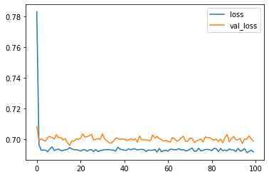

``` python
# Plot the accuracy too - should be around 50%
plt.plot(r.history['accuracy'], label='acc')
plt.plot(r.history['val_accuracy'], label='val_acc')
plt.legend()
```

    <matplotlib.legend.Legend at 0x7fec382777b8>

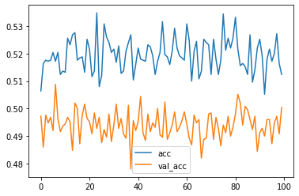

``` python
# Now try a simple RNN
inputs = np.expand_dims(X, -1)

# make the RNN
i = Input(shape=(T, D))

# method 1
# x = LSTM(5)(i)
x = SimpleRNN(5)(i)
# x = GRU(5)(i)

# method 2
# x = LSTM(5, return_sequences=True)(i)
# x = GlobalMaxPool1D()(x)

x = Dense(1, activation='sigmoid')(x)
model = Model(i, x)
model.compile(
  loss='binary_crossentropy',
  # optimizer='rmsprop',
#   optimizer='adam',
  optimizer=Adam(lr=0.01),
  # optimizer=SGD(lr=0.1, momentum=0.9),
  metrics=['accuracy'],
)
```

``` python
# train the RNN
r = model.fit(
  inputs, Y,
  epochs=200,
  validation_split=0.5,
)
```

    Epoch 1/200
    79/79 [==============================] - 1s 12ms/step - loss: 0.6980 - accuracy: 0.5232 - val_loss: 0.6856 - val_accuracy: 0.5432
    Epoch 2/200
    79/79 [==============================] - 1s 10ms/step - loss: 0.6726 - accuracy: 0.5752 - val_loss: 0.6726 - val_accuracy: 0.5756
    Epoch 3/200
    79/79 [==============================] - 1s 11ms/step - loss: 0.6472 - accuracy: 0.6276 - val_loss: 0.6279 - val_accuracy: 0.6808
    Epoch 4/200
    79/79 [==============================] - 1s 10ms/step - loss: 0.5874 - accuracy: 0.7200 - val_loss: 0.5298 - val_accuracy: 0.7960
    Epoch 5/200
    79/79 [==============================] - 1s 10ms/step - loss: 0.4572 - accuracy: 0.8532 - val_loss: 0.3922 - val_accuracy: 0.8800
    Epoch 6/200
    79/79 [==============================] - 1s 10ms/step - loss: 0.3494 - accuracy: 0.9056 - val_loss: 0.3111 - val_accuracy: 0.9036
    Epoch 7/200
    79/79 [==============================] - 1s 10ms/step - loss: 0.2770 - accuracy: 0.9252 - val_loss: 0.2596 - val_accuracy: 0.9248
    Epoch 8/200
    79/79 [==============================] - 1s 11ms/step - loss: 0.2400 - accuracy: 0.9316 - val_loss: 0.2448 - val_accuracy: 0.9172
    Epoch 9/200
    79/79 [==============================] - 1s 10ms/step - loss: 0.2085 - accuracy: 0.9356 - val_loss: 0.2131 - val_accuracy: 0.9280
    Epoch 10/200
    79/79 [==============================] - 1s 11ms/step - loss: 0.1890 - accuracy: 0.9444 - val_loss: 0.1918 - val_accuracy: 0.9376
    Epoch 11/200
    79/79 [==============================] - 1s 10ms/step - loss: 0.1724 - accuracy: 0.9464 - val_loss: 0.1774 - val_accuracy: 0.9452
    Epoch 12/200
    79/79 [==============================] - 1s 11ms/step - loss: 0.1559 - accuracy: 0.9528 - val_loss: 0.1733 - val_accuracy: 0.9432
    Epoch 13/200
    79/79 [==============================] - 1s 10ms/step - loss: 0.1501 - accuracy: 0.9556 - val_loss: 0.1589 - val_accuracy: 0.9476
    Epoch 14/200
    79/79 [==============================] - 1s 10ms/step - loss: 0.1448 - accuracy: 0.9572 - val_loss: 0.1582 - val_accuracy: 0.9480
    Epoch 15/200
    79/79 [==============================] - 1s 11ms/step - loss: 0.1415 - accuracy: 0.9544 - val_loss: 0.1503 - val_accuracy: 0.9520
    Epoch 16/200
    79/79 [==============================] - 1s 11ms/step - loss: 0.1274 - accuracy: 0.9612 - val_loss: 0.1420 - val_accuracy: 0.9484
    Epoch 17/200
    79/79 [==============================] - 1s 10ms/step - loss: 0.1220 - accuracy: 0.9620 - val_loss: 0.1324 - val_accuracy: 0.9552
    Epoch 18/200
    79/79 [==============================] - 1s 11ms/step - loss: 0.1146 - accuracy: 0.9632 - val_loss: 0.1278 - val_accuracy: 0.9612
    Epoch 19/200
    79/79 [==============================] - 1s 10ms/step - loss: 0.1102 - accuracy: 0.9708 - val_loss: 0.1237 - val_accuracy: 0.9644
    Epoch 20/200
    79/79 [==============================] - 1s 10ms/step - loss: 0.1083 - accuracy: 0.9620 - val_loss: 0.1209 - val_accuracy: 0.9552
    Epoch 21/200
    79/79 [==============================] - 1s 11ms/step - loss: 0.1070 - accuracy: 0.9664 - val_loss: 0.1181 - val_accuracy: 0.9608
    Epoch 22/200
    79/79 [==============================] - 1s 11ms/step - loss: 0.1024 - accuracy: 0.9688 - val_loss: 0.1194 - val_accuracy: 0.9644
    Epoch 23/200
    79/79 [==============================] - 1s 10ms/step - loss: 0.0990 - accuracy: 0.9716 - val_loss: 0.1166 - val_accuracy: 0.9628
    Epoch 24/200
    79/79 [==============================] - 1s 11ms/step - loss: 0.0969 - accuracy: 0.9696 - val_loss: 0.1108 - val_accuracy: 0.9584
    Epoch 25/200
    79/79 [==============================] - 1s 11ms/step - loss: 0.0918 - accuracy: 0.9700 - val_loss: 0.1077 - val_accuracy: 0.9652
    Epoch 26/200
    79/79 [==============================] - 1s 12ms/step - loss: 0.0926 - accuracy: 0.9732 - val_loss: 0.1160 - val_accuracy: 0.9560
    Epoch 27/200
    79/79 [==============================] - 1s 11ms/step - loss: 0.0943 - accuracy: 0.9712 - val_loss: 0.1010 - val_accuracy: 0.9676
    Epoch 28/200
    79/79 [==============================] - 1s 11ms/step - loss: 0.0866 - accuracy: 0.9736 - val_loss: 0.1106 - val_accuracy: 0.9672
    Epoch 29/200
    79/79 [==============================] - 1s 11ms/step - loss: 0.0881 - accuracy: 0.9768 - val_loss: 0.1083 - val_accuracy: 0.9664
    Epoch 30/200
    79/79 [==============================] - 1s 11ms/step - loss: 0.0850 - accuracy: 0.9728 - val_loss: 0.1055 - val_accuracy: 0.9656
    Epoch 31/200
    79/79 [==============================] - 1s 11ms/step - loss: 0.0824 - accuracy: 0.9736 - val_loss: 0.1030 - val_accuracy: 0.9648
    Epoch 32/200
    79/79 [==============================] - 1s 10ms/step - loss: 0.0801 - accuracy: 0.9772 - val_loss: 0.1006 - val_accuracy: 0.9660
    Epoch 33/200
    79/79 [==============================] - 1s 11ms/step - loss: 0.0801 - accuracy: 0.9740 - val_loss: 0.0912 - val_accuracy: 0.9712
    Epoch 34/200
    79/79 [==============================] - 1s 10ms/step - loss: 0.0767 - accuracy: 0.9768 - val_loss: 0.0899 - val_accuracy: 0.9688
    Epoch 35/200
    79/79 [==============================] - 1s 11ms/step - loss: 0.0783 - accuracy: 0.9780 - val_loss: 0.0996 - val_accuracy: 0.9656
    Epoch 36/200
    79/79 [==============================] - 1s 11ms/step - loss: 0.0740 - accuracy: 0.9776 - val_loss: 0.0913 - val_accuracy: 0.9704
    Epoch 37/200
    79/79 [==============================] - 1s 10ms/step - loss: 0.0731 - accuracy: 0.9796 - val_loss: 0.0913 - val_accuracy: 0.9712
    Epoch 38/200
    79/79 [==============================] - 1s 10ms/step - loss: 0.0728 - accuracy: 0.9776 - val_loss: 0.0913 - val_accuracy: 0.9684
    Epoch 39/200
    79/79 [==============================] - 1s 10ms/step - loss: 0.0749 - accuracy: 0.9776 - val_loss: 0.0900 - val_accuracy: 0.9724
    Epoch 40/200
    79/79 [==============================] - 1s 11ms/step - loss: 0.0743 - accuracy: 0.9780 - val_loss: 0.0903 - val_accuracy: 0.9704
    Epoch 41/200
    79/79 [==============================] - 1s 10ms/step - loss: 0.0738 - accuracy: 0.9756 - val_loss: 0.0965 - val_accuracy: 0.9696
    Epoch 42/200
    79/79 [==============================] - 1s 10ms/step - loss: 0.0735 - accuracy: 0.9780 - val_loss: 0.0941 - val_accuracy: 0.9696
    Epoch 43/200
    79/79 [==============================] - 1s 10ms/step - loss: 0.0684 - accuracy: 0.9768 - val_loss: 0.0841 - val_accuracy: 0.9696
    Epoch 44/200
    79/79 [==============================] - 1s 11ms/step - loss: 0.0729 - accuracy: 0.9752 - val_loss: 0.0926 - val_accuracy: 0.9696
    Epoch 45/200
    79/79 [==============================] - 1s 11ms/step - loss: 0.0690 - accuracy: 0.9776 - val_loss: 0.0843 - val_accuracy: 0.9772
    Epoch 46/200
    79/79 [==============================] - 1s 10ms/step - loss: 0.0671 - accuracy: 0.9800 - val_loss: 0.0897 - val_accuracy: 0.9712
    Epoch 47/200
    79/79 [==============================] - 1s 10ms/step - loss: 0.0622 - accuracy: 0.9836 - val_loss: 0.0944 - val_accuracy: 0.9680
    Epoch 48/200
    79/79 [==============================] - 1s 10ms/step - loss: 0.0703 - accuracy: 0.9792 - val_loss: 0.0870 - val_accuracy: 0.9724
    Epoch 49/200
    79/79 [==============================] - 1s 11ms/step - loss: 0.0728 - accuracy: 0.9796 - val_loss: 0.0820 - val_accuracy: 0.9792
    Epoch 50/200
    79/79 [==============================] - 1s 10ms/step - loss: 0.0679 - accuracy: 0.9800 - val_loss: 0.0891 - val_accuracy: 0.9752
    Epoch 51/200
    79/79 [==============================] - 1s 10ms/step - loss: 0.0661 - accuracy: 0.9788 - val_loss: 0.0897 - val_accuracy: 0.9708
    Epoch 52/200
    79/79 [==============================] - 1s 11ms/step - loss: 0.0649 - accuracy: 0.9792 - val_loss: 0.0850 - val_accuracy: 0.9732
    Epoch 53/200
    79/79 [==============================] - 1s 11ms/step - loss: 0.0655 - accuracy: 0.9832 - val_loss: 0.0773 - val_accuracy: 0.9740
    Epoch 54/200
    79/79 [==============================] - 1s 10ms/step - loss: 0.0626 - accuracy: 0.9808 - val_loss: 0.0780 - val_accuracy: 0.9732
    Epoch 55/200
    79/79 [==============================] - 1s 11ms/step - loss: 0.0593 - accuracy: 0.9832 - val_loss: 0.0804 - val_accuracy: 0.9756
    Epoch 56/200
    79/79 [==============================] - 1s 10ms/step - loss: 0.0672 - accuracy: 0.9764 - val_loss: 0.0800 - val_accuracy: 0.9728
    Epoch 57/200
    79/79 [==============================] - 1s 10ms/step - loss: 0.0639 - accuracy: 0.9816 - val_loss: 0.0769 - val_accuracy: 0.9748
    Epoch 58/200
    79/79 [==============================] - 1s 11ms/step - loss: 0.0602 - accuracy: 0.9844 - val_loss: 0.0737 - val_accuracy: 0.9728
    Epoch 59/200
    79/79 [==============================] - 1s 11ms/step - loss: 0.0614 - accuracy: 0.9816 - val_loss: 0.0773 - val_accuracy: 0.9768
    Epoch 60/200
    79/79 [==============================] - 1s 10ms/step - loss: 0.0595 - accuracy: 0.9836 - val_loss: 0.0908 - val_accuracy: 0.9756
    Epoch 61/200
    79/79 [==============================] - 1s 11ms/step - loss: 0.0625 - accuracy: 0.9832 - val_loss: 0.0692 - val_accuracy: 0.9796
    Epoch 62/200
    79/79 [==============================] - 1s 10ms/step - loss: 0.0569 - accuracy: 0.9840 - val_loss: 0.0730 - val_accuracy: 0.9768
    Epoch 63/200
    79/79 [==============================] - 1s 10ms/step - loss: 0.0552 - accuracy: 0.9832 - val_loss: 0.0710 - val_accuracy: 0.9772
    Epoch 64/200
    79/79 [==============================] - 1s 11ms/step - loss: 0.0561 - accuracy: 0.9836 - val_loss: 0.0686 - val_accuracy: 0.9784
    Epoch 65/200
    79/79 [==============================] - 1s 11ms/step - loss: 0.0547 - accuracy: 0.9848 - val_loss: 0.0705 - val_accuracy: 0.9800
    Epoch 66/200
    79/79 [==============================] - 1s 10ms/step - loss: 0.0524 - accuracy: 0.9852 - val_loss: 0.0934 - val_accuracy: 0.9736
    Epoch 67/200
    79/79 [==============================] - 1s 10ms/step - loss: 0.0548 - accuracy: 0.9840 - val_loss: 0.0762 - val_accuracy: 0.9796
    Epoch 68/200
    79/79 [==============================] - 1s 10ms/step - loss: 0.0528 - accuracy: 0.9836 - val_loss: 0.0666 - val_accuracy: 0.9816
    Epoch 69/200
    79/79 [==============================] - 1s 11ms/step - loss: 0.0510 - accuracy: 0.9876 - val_loss: 0.0894 - val_accuracy: 0.9756
    Epoch 70/200
    79/79 [==============================] - 1s 11ms/step - loss: 0.0501 - accuracy: 0.9856 - val_loss: 0.0691 - val_accuracy: 0.9796
    Epoch 71/200
    79/79 [==============================] - 1s 10ms/step - loss: 0.0511 - accuracy: 0.9868 - val_loss: 0.0680 - val_accuracy: 0.9792
    Epoch 72/200
    79/79 [==============================] - 1s 10ms/step - loss: 0.0536 - accuracy: 0.9836 - val_loss: 0.0819 - val_accuracy: 0.9768
    Epoch 73/200
    79/79 [==============================] - 1s 10ms/step - loss: 0.0553 - accuracy: 0.9816 - val_loss: 0.0653 - val_accuracy: 0.9800
    Epoch 74/200
    79/79 [==============================] - 1s 10ms/step - loss: 0.0554 - accuracy: 0.9852 - val_loss: 0.0711 - val_accuracy: 0.9812
    Epoch 75/200
    79/79 [==============================] - 1s 10ms/step - loss: 0.0483 - accuracy: 0.9880 - val_loss: 0.0823 - val_accuracy: 0.9732
    Epoch 76/200
    79/79 [==============================] - 1s 11ms/step - loss: 0.0512 - accuracy: 0.9852 - val_loss: 0.0901 - val_accuracy: 0.9808
    Epoch 77/200
    79/79 [==============================] - 1s 11ms/step - loss: 0.0539 - accuracy: 0.9844 - val_loss: 0.0752 - val_accuracy: 0.9792
    Epoch 78/200
    79/79 [==============================] - 1s 11ms/step - loss: 0.0491 - accuracy: 0.9872 - val_loss: 0.0671 - val_accuracy: 0.9816
    Epoch 79/200
    79/79 [==============================] - 1s 10ms/step - loss: 0.0471 - accuracy: 0.9876 - val_loss: 0.0702 - val_accuracy: 0.9820
    Epoch 80/200
    79/79 [==============================] - 1s 11ms/step - loss: 0.0547 - accuracy: 0.9828 - val_loss: 0.0739 - val_accuracy: 0.9812
    Epoch 81/200
    79/79 [==============================] - 1s 10ms/step - loss: 0.0561 - accuracy: 0.9816 - val_loss: 0.0658 - val_accuracy: 0.9808
    Epoch 82/200
    79/79 [==============================] - 1s 11ms/step - loss: 0.0646 - accuracy: 0.9856 - val_loss: 0.0728 - val_accuracy: 0.9788
    Epoch 83/200
    79/79 [==============================] - 1s 10ms/step - loss: 0.0576 - accuracy: 0.9824 - val_loss: 0.0738 - val_accuracy: 0.9772
    Epoch 84/200
    79/79 [==============================] - 1s 10ms/step - loss: 0.0573 - accuracy: 0.9824 - val_loss: 0.0668 - val_accuracy: 0.9824
    Epoch 85/200
    79/79 [==============================] - 1s 10ms/step - loss: 0.0428 - accuracy: 0.9896 - val_loss: 0.0827 - val_accuracy: 0.9804
    Epoch 86/200
    79/79 [==============================] - 1s 10ms/step - loss: 0.0480 - accuracy: 0.9888 - val_loss: 0.0679 - val_accuracy: 0.9804
    Epoch 87/200
    79/79 [==============================] - 1s 10ms/step - loss: 0.0436 - accuracy: 0.9888 - val_loss: 0.0677 - val_accuracy: 0.9848
    Epoch 88/200
    79/79 [==============================] - 1s 11ms/step - loss: 0.0465 - accuracy: 0.9884 - val_loss: 0.0693 - val_accuracy: 0.9804
    Epoch 89/200
    79/79 [==============================] - 1s 10ms/step - loss: 0.0417 - accuracy: 0.9896 - val_loss: 0.0731 - val_accuracy: 0.9784
    Epoch 90/200
    79/79 [==============================] - 1s 10ms/step - loss: 0.0465 - accuracy: 0.9868 - val_loss: 0.0693 - val_accuracy: 0.9840
    Epoch 91/200
    79/79 [==============================] - 1s 10ms/step - loss: 0.0423 - accuracy: 0.9904 - val_loss: 0.0667 - val_accuracy: 0.9840
    Epoch 92/200
    79/79 [==============================] - 1s 11ms/step - loss: 0.0436 - accuracy: 0.9892 - val_loss: 0.0683 - val_accuracy: 0.9824
    Epoch 93/200
    79/79 [==============================] - 1s 10ms/step - loss: 0.0470 - accuracy: 0.9864 - val_loss: 0.0644 - val_accuracy: 0.9824
    Epoch 94/200
    79/79 [==============================] - 1s 10ms/step - loss: 0.0460 - accuracy: 0.9868 - val_loss: 0.0711 - val_accuracy: 0.9788
    Epoch 95/200
    79/79 [==============================] - 1s 11ms/step - loss: 0.0398 - accuracy: 0.9896 - val_loss: 0.0688 - val_accuracy: 0.9784
    Epoch 96/200
    79/79 [==============================] - 1s 10ms/step - loss: 0.0410 - accuracy: 0.9868 - val_loss: 0.0733 - val_accuracy: 0.9836
    Epoch 97/200
    79/79 [==============================] - 1s 11ms/step - loss: 0.0455 - accuracy: 0.9860 - val_loss: 0.0647 - val_accuracy: 0.9848
    Epoch 98/200
    79/79 [==============================] - 1s 11ms/step - loss: 0.0390 - accuracy: 0.9888 - val_loss: 0.0671 - val_accuracy: 0.9804
    Epoch 99/200
    79/79 [==============================] - 1s 11ms/step - loss: 0.0387 - accuracy: 0.9884 - val_loss: 0.0686 - val_accuracy: 0.9812
    Epoch 100/200
    79/79 [==============================] - 1s 10ms/step - loss: 0.0396 - accuracy: 0.9888 - val_loss: 0.0648 - val_accuracy: 0.9800
    Epoch 101/200
    79/79 [==============================] - 1s 11ms/step - loss: 0.0384 - accuracy: 0.9908 - val_loss: 0.0626 - val_accuracy: 0.9832
    Epoch 102/200
    79/79 [==============================] - 1s 10ms/step - loss: 0.0415 - accuracy: 0.9884 - val_loss: 0.0720 - val_accuracy: 0.9792
    Epoch 103/200
    79/79 [==============================] - 1s 11ms/step - loss: 0.0401 - accuracy: 0.9852 - val_loss: 0.0676 - val_accuracy: 0.9820
    Epoch 104/200
    79/79 [==============================] - 1s 10ms/step - loss: 0.0396 - accuracy: 0.9900 - val_loss: 0.0642 - val_accuracy: 0.9832
    Epoch 105/200
    79/79 [==============================] - 1s 10ms/step - loss: 0.0422 - accuracy: 0.9872 - val_loss: 0.0724 - val_accuracy: 0.9856
    Epoch 106/200
    79/79 [==============================] - 1s 10ms/step - loss: 0.0429 - accuracy: 0.9884 - val_loss: 0.0810 - val_accuracy: 0.9828
    Epoch 107/200
    79/79 [==============================] - 1s 11ms/step - loss: 0.0385 - accuracy: 0.9888 - val_loss: 0.0699 - val_accuracy: 0.9812
    Epoch 108/200
    79/79 [==============================] - 1s 10ms/step - loss: 0.0494 - accuracy: 0.9868 - val_loss: 0.0689 - val_accuracy: 0.9832
    Epoch 109/200
    79/79 [==============================] - 1s 10ms/step - loss: 0.0383 - accuracy: 0.9872 - val_loss: 0.0628 - val_accuracy: 0.9820
    Epoch 110/200
    79/79 [==============================] - 1s 10ms/step - loss: 0.0373 - accuracy: 0.9896 - val_loss: 0.0707 - val_accuracy: 0.9768
    Epoch 111/200
    79/79 [==============================] - 1s 10ms/step - loss: 0.0348 - accuracy: 0.9892 - val_loss: 0.0613 - val_accuracy: 0.9852
    Epoch 112/200
    79/79 [==============================] - 1s 10ms/step - loss: 0.0375 - accuracy: 0.9872 - val_loss: 0.0828 - val_accuracy: 0.9820
    Epoch 113/200
    79/79 [==============================] - 1s 11ms/step - loss: 0.0419 - accuracy: 0.9904 - val_loss: 0.0732 - val_accuracy: 0.9828
    Epoch 114/200
    79/79 [==============================] - 1s 10ms/step - loss: 0.0386 - accuracy: 0.9868 - val_loss: 0.0676 - val_accuracy: 0.9816
    Epoch 115/200
    79/79 [==============================] - 1s 10ms/step - loss: 0.0357 - accuracy: 0.9904 - val_loss: 0.0647 - val_accuracy: 0.9828
    Epoch 116/200
    79/79 [==============================] - 1s 11ms/step - loss: 0.0346 - accuracy: 0.9912 - val_loss: 0.0648 - val_accuracy: 0.9816
    Epoch 117/200
    79/79 [==============================] - 1s 10ms/step - loss: 0.0339 - accuracy: 0.9892 - val_loss: 0.0679 - val_accuracy: 0.9816
    Epoch 118/200
    79/79 [==============================] - 1s 11ms/step - loss: 0.0320 - accuracy: 0.9920 - val_loss: 0.0682 - val_accuracy: 0.9828
    Epoch 119/200
    79/79 [==============================] - 1s 11ms/step - loss: 0.0329 - accuracy: 0.9916 - val_loss: 0.0638 - val_accuracy: 0.9840
    Epoch 120/200
    79/79 [==============================] - 1s 11ms/step - loss: 0.0324 - accuracy: 0.9904 - val_loss: 0.0648 - val_accuracy: 0.9844
    Epoch 121/200
    79/79 [==============================] - 1s 10ms/step - loss: 0.0312 - accuracy: 0.9924 - val_loss: 0.0639 - val_accuracy: 0.9824
    Epoch 122/200
    79/79 [==============================] - 1s 10ms/step - loss: 0.0328 - accuracy: 0.9884 - val_loss: 0.0642 - val_accuracy: 0.9836
    Epoch 123/200
    79/79 [==============================] - 1s 10ms/step - loss: 0.0380 - accuracy: 0.9888 - val_loss: 0.0727 - val_accuracy: 0.9840
    Epoch 124/200
    79/79 [==============================] - 1s 11ms/step - loss: 0.0513 - accuracy: 0.9864 - val_loss: 0.0668 - val_accuracy: 0.9844
    Epoch 125/200
    79/79 [==============================] - 1s 10ms/step - loss: 0.0475 - accuracy: 0.9884 - val_loss: 0.0730 - val_accuracy: 0.9808
    Epoch 126/200
    79/79 [==============================] - 1s 11ms/step - loss: 0.0350 - accuracy: 0.9884 - val_loss: 0.0622 - val_accuracy: 0.9848
    Epoch 127/200
    79/79 [==============================] - 1s 10ms/step - loss: 0.0326 - accuracy: 0.9896 - val_loss: 0.0797 - val_accuracy: 0.9800
    Epoch 128/200
    79/79 [==============================] - 1s 11ms/step - loss: 0.0371 - accuracy: 0.9908 - val_loss: 0.0654 - val_accuracy: 0.9812
    Epoch 129/200
    79/79 [==============================] - 1s 11ms/step - loss: 0.0304 - accuracy: 0.9916 - val_loss: 0.0640 - val_accuracy: 0.9844
    Epoch 130/200
    79/79 [==============================] - 1s 10ms/step - loss: 0.0319 - accuracy: 0.9908 - val_loss: 0.0760 - val_accuracy: 0.9820
    Epoch 131/200
    79/79 [==============================] - 1s 10ms/step - loss: 0.0325 - accuracy: 0.9904 - val_loss: 0.0625 - val_accuracy: 0.9840
    Epoch 132/200
    79/79 [==============================] - 1s 10ms/step - loss: 0.0307 - accuracy: 0.9920 - val_loss: 0.0597 - val_accuracy: 0.9848
    Epoch 133/200
    79/79 [==============================] - 1s 10ms/step - loss: 0.0355 - accuracy: 0.9904 - val_loss: 0.0628 - val_accuracy: 0.9796
    Epoch 134/200
    79/79 [==============================] - 1s 10ms/step - loss: 0.0347 - accuracy: 0.9884 - val_loss: 0.0627 - val_accuracy: 0.9848
    Epoch 135/200
    79/79 [==============================] - 1s 10ms/step - loss: 0.0478 - accuracy: 0.9848 - val_loss: 0.0708 - val_accuracy: 0.9832
    Epoch 136/200
    79/79 [==============================] - 1s 11ms/step - loss: 0.0347 - accuracy: 0.9880 - val_loss: 0.0623 - val_accuracy: 0.9844
    Epoch 137/200
    79/79 [==============================] - 1s 11ms/step - loss: 0.0284 - accuracy: 0.9928 - val_loss: 0.0598 - val_accuracy: 0.9852
    Epoch 138/200
    79/79 [==============================] - 1s 10ms/step - loss: 0.0464 - accuracy: 0.9920 - val_loss: 0.0620 - val_accuracy: 0.9824
    Epoch 139/200
    79/79 [==============================] - 1s 11ms/step - loss: 0.0402 - accuracy: 0.9852 - val_loss: 0.0611 - val_accuracy: 0.9852
    Epoch 140/200
    79/79 [==============================] - 1s 10ms/step - loss: 0.0291 - accuracy: 0.9912 - val_loss: 0.0594 - val_accuracy: 0.9836
    Epoch 141/200
    79/79 [==============================] - 1s 10ms/step - loss: 0.0353 - accuracy: 0.9892 - val_loss: 0.0697 - val_accuracy: 0.9828
    Epoch 142/200
    79/79 [==============================] - 1s 11ms/step - loss: 0.0354 - accuracy: 0.9912 - val_loss: 0.0577 - val_accuracy: 0.9844
    Epoch 143/200
    79/79 [==============================] - 1s 10ms/step - loss: 0.0330 - accuracy: 0.9908 - val_loss: 0.0756 - val_accuracy: 0.9800
    Epoch 144/200
    79/79 [==============================] - 1s 11ms/step - loss: 0.0322 - accuracy: 0.9936 - val_loss: 0.0530 - val_accuracy: 0.9848
    Epoch 145/200
    79/79 [==============================] - 1s 11ms/step - loss: 0.0274 - accuracy: 0.9924 - val_loss: 0.0588 - val_accuracy: 0.9872
    Epoch 146/200
    79/79 [==============================] - 1s 10ms/step - loss: 0.0265 - accuracy: 0.9924 - val_loss: 0.0548 - val_accuracy: 0.9848
    Epoch 147/200
    79/79 [==============================] - 1s 10ms/step - loss: 0.0268 - accuracy: 0.9924 - val_loss: 0.0554 - val_accuracy: 0.9840
    Epoch 148/200
    79/79 [==============================] - 1s 10ms/step - loss: 0.0255 - accuracy: 0.9936 - val_loss: 0.0527 - val_accuracy: 0.9868
    Epoch 149/200
    79/79 [==============================] - 1s 10ms/step - loss: 0.0324 - accuracy: 0.9920 - val_loss: 0.0594 - val_accuracy: 0.9856
    Epoch 150/200
    79/79 [==============================] - 1s 11ms/step - loss: 0.0282 - accuracy: 0.9916 - val_loss: 0.0602 - val_accuracy: 0.9844
    Epoch 151/200
    79/79 [==============================] - 1s 10ms/step - loss: 0.0265 - accuracy: 0.9924 - val_loss: 0.0558 - val_accuracy: 0.9864
    Epoch 152/200
    79/79 [==============================] - 1s 10ms/step - loss: 0.0275 - accuracy: 0.9916 - val_loss: 0.0588 - val_accuracy: 0.9860
    Epoch 153/200
    79/79 [==============================] - 1s 11ms/step - loss: 0.0275 - accuracy: 0.9928 - val_loss: 0.0579 - val_accuracy: 0.9864
    Epoch 154/200
    79/79 [==============================] - 1s 10ms/step - loss: 0.0264 - accuracy: 0.9904 - val_loss: 0.0617 - val_accuracy: 0.9860
    Epoch 155/200
    79/79 [==============================] - 1s 10ms/step - loss: 0.0290 - accuracy: 0.9904 - val_loss: 0.0514 - val_accuracy: 0.9864
    Epoch 156/200
    79/79 [==============================] - 1s 10ms/step - loss: 0.0293 - accuracy: 0.9920 - val_loss: 0.0588 - val_accuracy: 0.9840
    Epoch 157/200
    79/79 [==============================] - 1s 10ms/step - loss: 0.0265 - accuracy: 0.9940 - val_loss: 0.0579 - val_accuracy: 0.9880
    Epoch 158/200
    79/79 [==============================] - 1s 10ms/step - loss: 0.0252 - accuracy: 0.9928 - val_loss: 0.0725 - val_accuracy: 0.9812
    Epoch 159/200
    79/79 [==============================] - 1s 10ms/step - loss: 0.0300 - accuracy: 0.9888 - val_loss: 0.0600 - val_accuracy: 0.9844
    Epoch 160/200
    79/79 [==============================] - 1s 10ms/step - loss: 0.0244 - accuracy: 0.9920 - val_loss: 0.0549 - val_accuracy: 0.9840
    Epoch 161/200
    79/79 [==============================] - 1s 10ms/step - loss: 0.0264 - accuracy: 0.9928 - val_loss: 0.0641 - val_accuracy: 0.9840
    Epoch 162/200
    79/79 [==============================] - 1s 11ms/step - loss: 0.0262 - accuracy: 0.9912 - val_loss: 0.0681 - val_accuracy: 0.9784
    Epoch 163/200
    79/79 [==============================] - 1s 11ms/step - loss: 0.0247 - accuracy: 0.9920 - val_loss: 0.0571 - val_accuracy: 0.9852
    Epoch 164/200
    79/79 [==============================] - 1s 10ms/step - loss: 0.0226 - accuracy: 0.9944 - val_loss: 0.0585 - val_accuracy: 0.9836
    Epoch 165/200
    79/79 [==============================] - 1s 11ms/step - loss: 0.0294 - accuracy: 0.9904 - val_loss: 0.0614 - val_accuracy: 0.9836
    Epoch 166/200
    79/79 [==============================] - 1s 10ms/step - loss: 0.0302 - accuracy: 0.9904 - val_loss: 0.0516 - val_accuracy: 0.9868
    Epoch 167/200
    79/79 [==============================] - 1s 11ms/step - loss: 0.0314 - accuracy: 0.9916 - val_loss: 0.0550 - val_accuracy: 0.9824
    Epoch 168/200
    79/79 [==============================] - 1s 10ms/step - loss: 0.0274 - accuracy: 0.9896 - val_loss: 0.0558 - val_accuracy: 0.9828
    Epoch 169/200
    79/79 [==============================] - 1s 11ms/step - loss: 0.0237 - accuracy: 0.9940 - val_loss: 0.0630 - val_accuracy: 0.9836
    Epoch 170/200
    79/79 [==============================] - 1s 11ms/step - loss: 0.0252 - accuracy: 0.9912 - val_loss: 0.0737 - val_accuracy: 0.9816
    Epoch 171/200
    79/79 [==============================] - 1s 11ms/step - loss: 0.0337 - accuracy: 0.9896 - val_loss: 0.0523 - val_accuracy: 0.9872
    Epoch 172/200
    79/79 [==============================] - 1s 10ms/step - loss: 0.0277 - accuracy: 0.9920 - val_loss: 0.0562 - val_accuracy: 0.9844
    Epoch 173/200
    79/79 [==============================] - 1s 10ms/step - loss: 0.0292 - accuracy: 0.9924 - val_loss: 0.0613 - val_accuracy: 0.9852
    Epoch 174/200
    79/79 [==============================] - 1s 11ms/step - loss: 0.0265 - accuracy: 0.9932 - val_loss: 0.0604 - val_accuracy: 0.9864
    Epoch 175/200
    79/79 [==============================] - 1s 10ms/step - loss: 0.0280 - accuracy: 0.9940 - val_loss: 0.0560 - val_accuracy: 0.9856
    Epoch 176/200
    79/79 [==============================] - 1s 11ms/step - loss: 0.0383 - accuracy: 0.9912 - val_loss: 0.0514 - val_accuracy: 0.9852
    Epoch 177/200
    79/79 [==============================] - 1s 11ms/step - loss: 0.0347 - accuracy: 0.9908 - val_loss: 0.0503 - val_accuracy: 0.9864
    Epoch 178/200
    79/79 [==============================] - 1s 10ms/step - loss: 0.0213 - accuracy: 0.9948 - val_loss: 0.0522 - val_accuracy: 0.9844
    Epoch 179/200
    79/79 [==============================] - 1s 10ms/step - loss: 0.0241 - accuracy: 0.9932 - val_loss: 0.0493 - val_accuracy: 0.9856
    Epoch 180/200
    79/79 [==============================] - 1s 11ms/step - loss: 0.0233 - accuracy: 0.9932 - val_loss: 0.0493 - val_accuracy: 0.9876
    Epoch 181/200
    79/79 [==============================] - 1s 10ms/step - loss: 0.0222 - accuracy: 0.9948 - val_loss: 0.0476 - val_accuracy: 0.9860
    Epoch 182/200
    79/79 [==============================] - 1s 10ms/step - loss: 0.0272 - accuracy: 0.9904 - val_loss: 0.0577 - val_accuracy: 0.9868
    Epoch 183/200
    79/79 [==============================] - 1s 11ms/step - loss: 0.0304 - accuracy: 0.9912 - val_loss: 0.0785 - val_accuracy: 0.9840
    Epoch 184/200
    79/79 [==============================] - 1s 10ms/step - loss: 0.0376 - accuracy: 0.9900 - val_loss: 0.0596 - val_accuracy: 0.9848
    Epoch 185/200
    79/79 [==============================] - 1s 10ms/step - loss: 0.0244 - accuracy: 0.9944 - val_loss: 0.0520 - val_accuracy: 0.9872
    Epoch 186/200
    79/79 [==============================] - 1s 10ms/step - loss: 0.0217 - accuracy: 0.9932 - val_loss: 0.0525 - val_accuracy: 0.9840
    Epoch 187/200
    79/79 [==============================] - 1s 10ms/step - loss: 0.0189 - accuracy: 0.9952 - val_loss: 0.0493 - val_accuracy: 0.9844
    Epoch 188/200
    79/79 [==============================] - 1s 10ms/step - loss: 0.0193 - accuracy: 0.9948 - val_loss: 0.0554 - val_accuracy: 0.9852
    Epoch 189/200
    79/79 [==============================] - 1s 10ms/step - loss: 0.0211 - accuracy: 0.9944 - val_loss: 0.0525 - val_accuracy: 0.9860
    Epoch 190/200
    79/79 [==============================] - 1s 11ms/step - loss: 0.0201 - accuracy: 0.9948 - val_loss: 0.0558 - val_accuracy: 0.9856
    Epoch 191/200
    79/79 [==============================] - 1s 11ms/step - loss: 0.0227 - accuracy: 0.9932 - val_loss: 0.0549 - val_accuracy: 0.9888
    Epoch 192/200
    79/79 [==============================] - 1s 10ms/step - loss: 0.0191 - accuracy: 0.9948 - val_loss: 0.0506 - val_accuracy: 0.9840
    Epoch 193/200
    79/79 [==============================] - 1s 11ms/step - loss: 0.0215 - accuracy: 0.9932 - val_loss: 0.0536 - val_accuracy: 0.9864
    Epoch 194/200
    79/79 [==============================] - 1s 10ms/step - loss: 0.0200 - accuracy: 0.9936 - val_loss: 0.0518 - val_accuracy: 0.9888
    Epoch 195/200
    79/79 [==============================] - 1s 10ms/step - loss: 0.0183 - accuracy: 0.9944 - val_loss: 0.0470 - val_accuracy: 0.9876
    Epoch 196/200
    79/79 [==============================] - 1s 10ms/step - loss: 0.0248 - accuracy: 0.9936 - val_loss: 0.0536 - val_accuracy: 0.9868
    Epoch 197/200
    79/79 [==============================] - 1s 10ms/step - loss: 0.0272 - accuracy: 0.9912 - val_loss: 0.0642 - val_accuracy: 0.9836
    Epoch 198/200
    79/79 [==============================] - 1s 10ms/step - loss: 0.0264 - accuracy: 0.9912 - val_loss: 0.0448 - val_accuracy: 0.9872
    Epoch 199/200
    79/79 [==============================] - 1s 11ms/step - loss: 0.0568 - accuracy: 0.9896 - val_loss: 0.0793 - val_accuracy: 0.9816
    Epoch 200/200
    79/79 [==============================] - 1s 10ms/step - loss: 0.0396 - accuracy: 0.9904 - val_loss: 0.0707 - val_accuracy: 0.9852

``` python
# Plot the loss
plt.plot(r.history['loss'], label='loss')
plt.plot(r.history['val_loss'], label='val_loss')
plt.legend()
```

    <matplotlib.legend.Legend at 0x7fec1f781828>

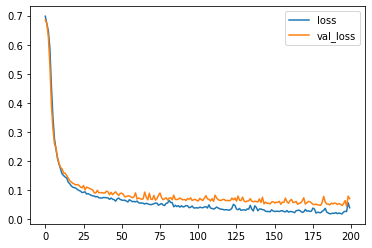

``` python
# Plot the accuracy too
plt.plot(r.history['accuracy'], label='acc')
plt.plot(r.history['val_accuracy'], label='val_acc')
plt.legend()
```

    <matplotlib.legend.Legend at 0x7fec380f10b8>

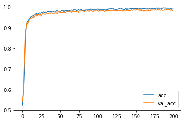

``` python
# Now change to the long distance problem

# Start with a small T and increase it later
T = 10
D = 1
X = []
Y = []

for t in range(5000):
  x = np.random.randn(T)
  X.append(x)
  y = get_label(x, 0, 1, 2) # long distance
  Y.append(y)

X = np.array(X)
Y = np.array(Y)
N = len(X)
```

``` python
# Now test our Simple RNN again
inputs = np.expand_dims(X, -1)

# make the RNN
i = Input(shape=(T, D))

# method 1
x = SimpleRNN(5)(i)

x = Dense(1, activation='sigmoid')(x)
model = Model(i, x)
model.compile(
  loss='binary_crossentropy',
  optimizer=Adam(lr=0.01),
  metrics=['accuracy'],
)

# train the RNN
r = model.fit(
  inputs, Y,
  epochs=200,
  validation_split=0.5,
)
```

    Epoch 1/200
    79/79 [==============================] - 1s 12ms/step - loss: 0.7009 - accuracy: 0.4996 - val_loss: 0.6948 - val_accuracy: 0.5088
    Epoch 2/200
    79/79 [==============================] - 1s 10ms/step - loss: 0.6944 - accuracy: 0.5128 - val_loss: 0.6951 - val_accuracy: 0.5076
    Epoch 3/200
    79/79 [==============================] - 1s 10ms/step - loss: 0.6951 - accuracy: 0.5112 - val_loss: 0.6940 - val_accuracy: 0.5160
    Epoch 4/200
    79/79 [==============================] - 1s 11ms/step - loss: 0.6933 - accuracy: 0.5112 - val_loss: 0.6935 - val_accuracy: 0.5024
    Epoch 5/200
    79/79 [==============================] - 1s 11ms/step - loss: 0.6946 - accuracy: 0.5092 - val_loss: 0.6932 - val_accuracy: 0.5140
    Epoch 6/200
    79/79 [==============================] - 1s 11ms/step - loss: 0.6923 - accuracy: 0.5236 - val_loss: 0.6952 - val_accuracy: 0.5072
    Epoch 7/200
    79/79 [==============================] - 1s 11ms/step - loss: 0.6922 - accuracy: 0.5248 - val_loss: 0.6935 - val_accuracy: 0.5088
    Epoch 8/200
    79/79 [==============================] - 1s 10ms/step - loss: 0.6919 - accuracy: 0.5276 - val_loss: 0.6930 - val_accuracy: 0.5184
    Epoch 9/200
    79/79 [==============================] - 1s 10ms/step - loss: 0.6936 - accuracy: 0.5220 - val_loss: 0.6934 - val_accuracy: 0.5180
    Epoch 10/200
    79/79 [==============================] - 1s 10ms/step - loss: 0.6914 - accuracy: 0.5356 - val_loss: 0.6923 - val_accuracy: 0.5204
    Epoch 11/200
    79/79 [==============================] - 1s 11ms/step - loss: 0.6909 - accuracy: 0.5292 - val_loss: 0.6931 - val_accuracy: 0.5232
    Epoch 12/200
    79/79 [==============================] - 1s 11ms/step - loss: 0.6912 - accuracy: 0.5288 - val_loss: 0.6967 - val_accuracy: 0.5188
    Epoch 13/200
    79/79 [==============================] - 1s 11ms/step - loss: 0.6921 - accuracy: 0.5184 - val_loss: 0.6934 - val_accuracy: 0.5124
    Epoch 14/200
    79/79 [==============================] - 1s 11ms/step - loss: 0.6907 - accuracy: 0.5260 - val_loss: 0.6942 - val_accuracy: 0.5188
    Epoch 15/200
    79/79 [==============================] - 1s 10ms/step - loss: 0.6907 - accuracy: 0.5304 - val_loss: 0.6951 - val_accuracy: 0.5188
    Epoch 16/200
    79/79 [==============================] - 1s 10ms/step - loss: 0.6905 - accuracy: 0.5292 - val_loss: 0.6921 - val_accuracy: 0.5196
    Epoch 17/200
    79/79 [==============================] - 1s 11ms/step - loss: 0.6906 - accuracy: 0.5416 - val_loss: 0.6937 - val_accuracy: 0.5296
    Epoch 18/200
    79/79 [==============================] - 1s 10ms/step - loss: 0.6895 - accuracy: 0.5184 - val_loss: 0.6940 - val_accuracy: 0.5164
    Epoch 19/200
    79/79 [==============================] - 1s 10ms/step - loss: 0.6903 - accuracy: 0.5304 - val_loss: 0.6949 - val_accuracy: 0.5120
    Epoch 20/200
    79/79 [==============================] - 1s 10ms/step - loss: 0.6907 - accuracy: 0.5412 - val_loss: 0.6931 - val_accuracy: 0.5184
    Epoch 21/200
    79/79 [==============================] - 1s 10ms/step - loss: 0.6893 - accuracy: 0.5444 - val_loss: 0.6942 - val_accuracy: 0.5076
    Epoch 22/200
    79/79 [==============================] - 1s 10ms/step - loss: 0.6913 - accuracy: 0.5328 - val_loss: 0.6936 - val_accuracy: 0.5148
    Epoch 23/200
    79/79 [==============================] - 1s 11ms/step - loss: 0.6902 - accuracy: 0.5364 - val_loss: 0.6941 - val_accuracy: 0.5260
    Epoch 24/200
    79/79 [==============================] - 1s 10ms/step - loss: 0.6883 - accuracy: 0.5464 - val_loss: 0.6933 - val_accuracy: 0.5284
    Epoch 25/200
    79/79 [==============================] - 1s 11ms/step - loss: 0.6887 - accuracy: 0.5392 - val_loss: 0.6921 - val_accuracy: 0.5248
    Epoch 26/200
    79/79 [==============================] - 1s 10ms/step - loss: 0.6888 - accuracy: 0.5512 - val_loss: 0.6979 - val_accuracy: 0.5088
    Epoch 27/200
    79/79 [==============================] - 1s 10ms/step - loss: 0.6897 - accuracy: 0.5436 - val_loss: 0.6926 - val_accuracy: 0.5312
    Epoch 28/200
    79/79 [==============================] - 1s 11ms/step - loss: 0.6899 - accuracy: 0.5512 - val_loss: 0.6925 - val_accuracy: 0.5236
    Epoch 29/200
    79/79 [==============================] - 1s 11ms/step - loss: 0.6886 - accuracy: 0.5516 - val_loss: 0.6927 - val_accuracy: 0.5208
    Epoch 30/200
    79/79 [==============================] - 1s 11ms/step - loss: 0.6912 - accuracy: 0.5448 - val_loss: 0.6915 - val_accuracy: 0.5276
    Epoch 31/200
    79/79 [==============================] - 1s 10ms/step - loss: 0.6860 - accuracy: 0.5572 - val_loss: 0.6932 - val_accuracy: 0.5264
    Epoch 32/200
    79/79 [==============================] - 1s 10ms/step - loss: 0.6869 - accuracy: 0.5564 - val_loss: 0.6926 - val_accuracy: 0.5232
    Epoch 33/200
    79/79 [==============================] - 1s 10ms/step - loss: 0.6858 - accuracy: 0.5604 - val_loss: 0.6936 - val_accuracy: 0.5200
    Epoch 34/200
    79/79 [==============================] - 1s 10ms/step - loss: 0.6862 - accuracy: 0.5580 - val_loss: 0.6934 - val_accuracy: 0.5284
    Epoch 35/200
    79/79 [==============================] - 1s 10ms/step - loss: 0.6842 - accuracy: 0.5652 - val_loss: 0.6920 - val_accuracy: 0.5384
    Epoch 36/200
    79/79 [==============================] - 1s 10ms/step - loss: 0.6839 - accuracy: 0.5624 - val_loss: 0.6884 - val_accuracy: 0.5468
    Epoch 37/200
    79/79 [==============================] - 1s 10ms/step - loss: 0.6796 - accuracy: 0.5712 - val_loss: 0.6856 - val_accuracy: 0.5488
    Epoch 38/200
    79/79 [==============================] - 1s 11ms/step - loss: 0.6724 - accuracy: 0.5836 - val_loss: 0.6723 - val_accuracy: 0.5784
    Epoch 39/200
    79/79 [==============================] - 1s 10ms/step - loss: 0.6612 - accuracy: 0.5936 - val_loss: 0.6746 - val_accuracy: 0.5872
    Epoch 40/200
    79/79 [==============================] - 1s 10ms/step - loss: 0.6565 - accuracy: 0.5996 - val_loss: 0.6659 - val_accuracy: 0.6104
    Epoch 41/200
    79/79 [==============================] - 1s 10ms/step - loss: 0.6572 - accuracy: 0.6176 - val_loss: 0.6759 - val_accuracy: 0.5988
    Epoch 42/200
    79/79 [==============================] - 1s 10ms/step - loss: 0.6521 - accuracy: 0.6092 - val_loss: 0.6534 - val_accuracy: 0.6112
    Epoch 43/200
    79/79 [==============================] - 1s 11ms/step - loss: 0.6309 - accuracy: 0.6384 - val_loss: 0.6267 - val_accuracy: 0.6444
    Epoch 44/200
    79/79 [==============================] - 1s 10ms/step - loss: 0.6448 - accuracy: 0.6256 - val_loss: 0.6421 - val_accuracy: 0.6244
    Epoch 45/200
    79/79 [==============================] - 1s 11ms/step - loss: 0.6301 - accuracy: 0.6380 - val_loss: 0.6289 - val_accuracy: 0.6352
    Epoch 46/200
    79/79 [==============================] - 1s 10ms/step - loss: 0.6370 - accuracy: 0.6360 - val_loss: 0.7009 - val_accuracy: 0.5672
    Epoch 47/200
    79/79 [==============================] - 1s 10ms/step - loss: 0.6710 - accuracy: 0.5856 - val_loss: 0.6421 - val_accuracy: 0.6224
    Epoch 48/200
    79/79 [==============================] - 1s 11ms/step - loss: 0.6243 - accuracy: 0.6436 - val_loss: 0.6336 - val_accuracy: 0.6400
    Epoch 49/200
    79/79 [==============================] - 1s 11ms/step - loss: 0.6238 - accuracy: 0.6516 - val_loss: 0.6313 - val_accuracy: 0.6420
    Epoch 50/200
    79/79 [==============================] - 1s 11ms/step - loss: 0.6192 - accuracy: 0.6472 - val_loss: 0.6221 - val_accuracy: 0.6492
    Epoch 51/200
    79/79 [==============================] - 1s 11ms/step - loss: 0.6009 - accuracy: 0.6724 - val_loss: 0.6352 - val_accuracy: 0.6508
    Epoch 52/200
    79/79 [==============================] - 1s 12ms/step - loss: 0.6152 - accuracy: 0.6468 - val_loss: 0.6018 - val_accuracy: 0.6596
    Epoch 53/200
    79/79 [==============================] - 1s 11ms/step - loss: 0.5915 - accuracy: 0.6816 - val_loss: 0.5911 - val_accuracy: 0.6592
    Epoch 54/200
    79/79 [==============================] - 1s 11ms/step - loss: 0.5794 - accuracy: 0.6776 - val_loss: 0.5868 - val_accuracy: 0.6772
    Epoch 55/200
    79/79 [==============================] - 1s 11ms/step - loss: 0.6113 - accuracy: 0.6520 - val_loss: 0.5924 - val_accuracy: 0.6788
    Epoch 56/200
    79/79 [==============================] - 1s 11ms/step - loss: 0.5776 - accuracy: 0.6816 - val_loss: 0.6155 - val_accuracy: 0.6468
    Epoch 57/200
    79/79 [==============================] - 1s 11ms/step - loss: 0.6426 - accuracy: 0.6272 - val_loss: 0.6447 - val_accuracy: 0.6164
    Epoch 58/200
    79/79 [==============================] - 1s 11ms/step - loss: 0.6070 - accuracy: 0.6544 - val_loss: 0.6043 - val_accuracy: 0.6600
    Epoch 59/200
    79/79 [==============================] - 1s 11ms/step - loss: 0.5754 - accuracy: 0.6776 - val_loss: 0.5564 - val_accuracy: 0.6996
    Epoch 60/200
    79/79 [==============================] - 1s 11ms/step - loss: 0.5524 - accuracy: 0.6972 - val_loss: 0.5752 - val_accuracy: 0.6976
    Epoch 61/200
    79/79 [==============================] - 1s 11ms/step - loss: 0.5632 - accuracy: 0.6916 - val_loss: 0.6242 - val_accuracy: 0.6272
    Epoch 62/200
    79/79 [==============================] - 1s 11ms/step - loss: 0.6013 - accuracy: 0.6508 - val_loss: 0.5646 - val_accuracy: 0.6940
    Epoch 63/200
    79/79 [==============================] - 1s 11ms/step - loss: 0.5497 - accuracy: 0.7024 - val_loss: 0.5493 - val_accuracy: 0.6940
    Epoch 64/200
    79/79 [==============================] - 1s 10ms/step - loss: 0.5718 - accuracy: 0.6868 - val_loss: 0.5542 - val_accuracy: 0.7016
    Epoch 65/200
    79/79 [==============================] - 1s 11ms/step - loss: 0.5447 - accuracy: 0.7212 - val_loss: 0.5553 - val_accuracy: 0.7104
    Epoch 66/200
    79/79 [==============================] - 1s 11ms/step - loss: 0.5345 - accuracy: 0.7232 - val_loss: 0.5673 - val_accuracy: 0.7128
    Epoch 67/200
    79/79 [==============================] - 1s 11ms/step - loss: 0.5677 - accuracy: 0.7200 - val_loss: 0.5253 - val_accuracy: 0.7688
    Epoch 68/200
    79/79 [==============================] - 1s 11ms/step - loss: 0.5185 - accuracy: 0.7496 - val_loss: 0.5156 - val_accuracy: 0.7620
    Epoch 69/200
    79/79 [==============================] - 1s 11ms/step - loss: 0.5330 - accuracy: 0.7440 - val_loss: 0.5130 - val_accuracy: 0.7476
    Epoch 70/200
    79/79 [==============================] - 1s 10ms/step - loss: 0.5412 - accuracy: 0.7452 - val_loss: 0.5197 - val_accuracy: 0.7636
    Epoch 71/200
    79/79 [==============================] - 1s 10ms/step - loss: 0.4882 - accuracy: 0.7788 - val_loss: 0.5193 - val_accuracy: 0.7600
    Epoch 72/200
    79/79 [==============================] - 1s 11ms/step - loss: 0.5023 - accuracy: 0.7716 - val_loss: 0.5054 - val_accuracy: 0.7704
    Epoch 73/200
    79/79 [==============================] - 1s 10ms/step - loss: 0.5104 - accuracy: 0.7764 - val_loss: 0.5132 - val_accuracy: 0.7764
    Epoch 74/200
    79/79 [==============================] - 1s 11ms/step - loss: 0.4758 - accuracy: 0.8048 - val_loss: 0.5033 - val_accuracy: 0.7928
    Epoch 75/200
    79/79 [==============================] - 1s 10ms/step - loss: 0.4713 - accuracy: 0.8124 - val_loss: 0.4803 - val_accuracy: 0.8100
    Epoch 76/200
    79/79 [==============================] - 1s 10ms/step - loss: 0.4762 - accuracy: 0.7996 - val_loss: 0.4966 - val_accuracy: 0.8000
    Epoch 77/200
    79/79 [==============================] - 1s 10ms/step - loss: 0.4560 - accuracy: 0.8172 - val_loss: 0.4961 - val_accuracy: 0.7932
    Epoch 78/200
    79/79 [==============================] - 1s 10ms/step - loss: 0.4521 - accuracy: 0.8200 - val_loss: 0.4663 - val_accuracy: 0.8080
    Epoch 79/200
    79/79 [==============================] - 1s 10ms/step - loss: 0.4624 - accuracy: 0.8080 - val_loss: 0.5134 - val_accuracy: 0.7788
    Epoch 80/200
    79/79 [==============================] - 1s 11ms/step - loss: 0.5291 - accuracy: 0.7596 - val_loss: 0.5268 - val_accuracy: 0.7668
    Epoch 81/200
    79/79 [==============================] - 1s 10ms/step - loss: 0.4886 - accuracy: 0.7952 - val_loss: 0.5036 - val_accuracy: 0.7968
    Epoch 82/200
    79/79 [==============================] - 1s 10ms/step - loss: 0.4483 - accuracy: 0.8192 - val_loss: 0.4857 - val_accuracy: 0.7820
    Epoch 83/200
    79/79 [==============================] - 1s 11ms/step - loss: 0.4724 - accuracy: 0.7868 - val_loss: 0.5214 - val_accuracy: 0.7624
    Epoch 84/200
    79/79 [==============================] - 1s 10ms/step - loss: 0.4629 - accuracy: 0.7980 - val_loss: 0.4601 - val_accuracy: 0.8044
    Epoch 85/200
    79/79 [==============================] - 1s 10ms/step - loss: 0.4590 - accuracy: 0.8020 - val_loss: 0.4799 - val_accuracy: 0.7892
    Epoch 86/200
    79/79 [==============================] - 1s 11ms/step - loss: 0.4843 - accuracy: 0.7808 - val_loss: 0.5494 - val_accuracy: 0.7452
    Epoch 87/200
    79/79 [==============================] - 1s 10ms/step - loss: 0.5111 - accuracy: 0.7768 - val_loss: 0.4562 - val_accuracy: 0.8008
    Epoch 88/200
    79/79 [==============================] - 1s 11ms/step - loss: 0.4392 - accuracy: 0.8204 - val_loss: 0.4450 - val_accuracy: 0.8128
    Epoch 89/200
    79/79 [==============================] - 1s 10ms/step - loss: 0.4546 - accuracy: 0.8204 - val_loss: 0.4002 - val_accuracy: 0.8484
    Epoch 90/200
    79/79 [==============================] - 1s 10ms/step - loss: 0.4200 - accuracy: 0.8312 - val_loss: 0.4415 - val_accuracy: 0.8304
    Epoch 91/200
    79/79 [==============================] - 1s 10ms/step - loss: 0.4022 - accuracy: 0.8484 - val_loss: 0.4678 - val_accuracy: 0.8000
    Epoch 92/200
    79/79 [==============================] - 1s 10ms/step - loss: 0.4207 - accuracy: 0.8272 - val_loss: 0.4074 - val_accuracy: 0.8504
    Epoch 93/200
    79/79 [==============================] - 1s 10ms/step - loss: 0.3875 - accuracy: 0.8520 - val_loss: 0.4857 - val_accuracy: 0.8000
    Epoch 94/200
    79/79 [==============================] - 1s 10ms/step - loss: 0.4068 - accuracy: 0.8356 - val_loss: 0.4879 - val_accuracy: 0.7900
    Epoch 95/200
    79/79 [==============================] - 1s 11ms/step - loss: 0.4873 - accuracy: 0.8028 - val_loss: 0.4495 - val_accuracy: 0.8416
    Epoch 96/200
    79/79 [==============================] - 1s 10ms/step - loss: 0.3773 - accuracy: 0.8732 - val_loss: 0.3833 - val_accuracy: 0.8672
    Epoch 97/200
    79/79 [==============================] - 1s 10ms/step - loss: 0.3640 - accuracy: 0.8776 - val_loss: 0.4010 - val_accuracy: 0.8684
    Epoch 98/200
    79/79 [==============================] - 1s 10ms/step - loss: 0.3723 - accuracy: 0.8716 - val_loss: 0.3782 - val_accuracy: 0.8744
    Epoch 99/200
    79/79 [==============================] - 1s 11ms/step - loss: 0.4678 - accuracy: 0.8152 - val_loss: 0.6316 - val_accuracy: 0.7104
    Epoch 100/200
    79/79 [==============================] - 1s 10ms/step - loss: 0.5038 - accuracy: 0.7836 - val_loss: 0.4439 - val_accuracy: 0.8280
    Epoch 101/200
    79/79 [==============================] - 1s 11ms/step - loss: 0.4657 - accuracy: 0.8216 - val_loss: 0.4984 - val_accuracy: 0.7936
    Epoch 102/200
    79/79 [==============================] - 1s 10ms/step - loss: 0.5420 - accuracy: 0.7528 - val_loss: 0.6300 - val_accuracy: 0.6660
    Epoch 103/200
    79/79 [==============================] - 1s 10ms/step - loss: 0.5793 - accuracy: 0.7136 - val_loss: 0.5262 - val_accuracy: 0.7696
    Epoch 104/200
    79/79 [==============================] - 1s 10ms/step - loss: 0.5042 - accuracy: 0.7864 - val_loss: 0.4314 - val_accuracy: 0.8424
    Epoch 105/200
    79/79 [==============================] - 1s 10ms/step - loss: 0.4277 - accuracy: 0.8372 - val_loss: 0.4179 - val_accuracy: 0.8460
    Epoch 106/200
    79/79 [==============================] - 1s 10ms/step - loss: 0.4170 - accuracy: 0.8296 - val_loss: 0.4903 - val_accuracy: 0.7940
    Epoch 107/200
    79/79 [==============================] - 1s 10ms/step - loss: 0.3549 - accuracy: 0.8724 - val_loss: 0.3610 - val_accuracy: 0.8752
    Epoch 108/200
    79/79 [==============================] - 1s 10ms/step - loss: 0.3170 - accuracy: 0.8988 - val_loss: 0.3182 - val_accuracy: 0.9036
    Epoch 109/200
    79/79 [==============================] - 1s 10ms/step - loss: 0.3382 - accuracy: 0.8820 - val_loss: 0.3694 - val_accuracy: 0.8732
    Epoch 110/200
    79/79 [==============================] - 1s 11ms/step - loss: 0.4927 - accuracy: 0.7988 - val_loss: 0.5154 - val_accuracy: 0.7928
    Epoch 111/200
    79/79 [==============================] - 1s 10ms/step - loss: 0.4499 - accuracy: 0.8240 - val_loss: 0.4852 - val_accuracy: 0.7972
    Epoch 112/200
    79/79 [==============================] - 1s 11ms/step - loss: 0.5167 - accuracy: 0.7772 - val_loss: 0.5273 - val_accuracy: 0.7652
    Epoch 113/200
    79/79 [==============================] - 1s 10ms/step - loss: 0.5258 - accuracy: 0.7620 - val_loss: 0.4776 - val_accuracy: 0.8088
    Epoch 114/200
    79/79 [==============================] - 1s 10ms/step - loss: 0.4321 - accuracy: 0.8384 - val_loss: 0.4269 - val_accuracy: 0.8508
    Epoch 115/200
    79/79 [==============================] - 1s 10ms/step - loss: 0.3960 - accuracy: 0.8632 - val_loss: 0.3897 - val_accuracy: 0.8652
    Epoch 116/200
    79/79 [==============================] - 1s 10ms/step - loss: 0.3598 - accuracy: 0.8764 - val_loss: 0.3446 - val_accuracy: 0.8836
    Epoch 117/200
    79/79 [==============================] - 1s 10ms/step - loss: 0.3355 - accuracy: 0.8896 - val_loss: 0.3143 - val_accuracy: 0.9088
    Epoch 118/200
    79/79 [==============================] - 1s 10ms/step - loss: 0.3117 - accuracy: 0.8960 - val_loss: 0.3016 - val_accuracy: 0.9068
    Epoch 119/200
    79/79 [==============================] - 1s 10ms/step - loss: 0.4481 - accuracy: 0.8416 - val_loss: 0.4037 - val_accuracy: 0.8580
    Epoch 120/200
    79/79 [==============================] - 1s 10ms/step - loss: 0.3510 - accuracy: 0.8880 - val_loss: 0.3300 - val_accuracy: 0.8932
    Epoch 121/200
    79/79 [==============================] - 1s 10ms/step - loss: 0.3791 - accuracy: 0.8748 - val_loss: 0.4971 - val_accuracy: 0.8112
    Epoch 122/200
    79/79 [==============================] - 1s 10ms/step - loss: 0.4033 - accuracy: 0.8528 - val_loss: 0.3500 - val_accuracy: 0.8864
    Epoch 123/200
    79/79 [==============================] - 1s 10ms/step - loss: 0.3238 - accuracy: 0.8996 - val_loss: 0.3461 - val_accuracy: 0.8872
    Epoch 124/200
    79/79 [==============================] - 1s 11ms/step - loss: 0.4098 - accuracy: 0.8520 - val_loss: 0.6394 - val_accuracy: 0.7480
    Epoch 125/200
    79/79 [==============================] - 1s 10ms/step - loss: 0.5331 - accuracy: 0.7832 - val_loss: 0.4910 - val_accuracy: 0.8080
    Epoch 126/200
    79/79 [==============================] - 1s 11ms/step - loss: 0.4373 - accuracy: 0.8432 - val_loss: 0.4168 - val_accuracy: 0.8580
    Epoch 127/200
    79/79 [==============================] - 1s 10ms/step - loss: 0.3445 - accuracy: 0.8852 - val_loss: 0.3493 - val_accuracy: 0.8856
    Epoch 128/200
    79/79 [==============================] - 1s 10ms/step - loss: 0.3966 - accuracy: 0.8628 - val_loss: 0.3932 - val_accuracy: 0.8676
    Epoch 129/200
    79/79 [==============================] - 1s 10ms/step - loss: 0.3495 - accuracy: 0.8852 - val_loss: 0.3292 - val_accuracy: 0.8964
    Epoch 130/200
    79/79 [==============================] - 1s 11ms/step - loss: 0.3341 - accuracy: 0.8888 - val_loss: 0.3204 - val_accuracy: 0.9028
    Epoch 131/200
    79/79 [==============================] - 1s 11ms/step - loss: 0.3434 - accuracy: 0.8908 - val_loss: 0.4491 - val_accuracy: 0.8332
    Epoch 132/200
    79/79 [==============================] - 1s 11ms/step - loss: 0.5237 - accuracy: 0.7880 - val_loss: 0.4900 - val_accuracy: 0.7976
    Epoch 133/200
    79/79 [==============================] - 1s 11ms/step - loss: 0.4198 - accuracy: 0.8484 - val_loss: 0.4675 - val_accuracy: 0.8184
    Epoch 134/200
    79/79 [==============================] - 1s 10ms/step - loss: 0.3387 - accuracy: 0.8908 - val_loss: 0.3651 - val_accuracy: 0.8804
    Epoch 135/200
    79/79 [==============================] - 1s 10ms/step - loss: 0.6448 - accuracy: 0.6680 - val_loss: 0.5885 - val_accuracy: 0.6936
    Epoch 136/200
    79/79 [==============================] - 1s 10ms/step - loss: 0.5542 - accuracy: 0.7360 - val_loss: 0.5517 - val_accuracy: 0.7392
    Epoch 137/200
    79/79 [==============================] - 1s 10ms/step - loss: 0.5331 - accuracy: 0.7492 - val_loss: 0.5222 - val_accuracy: 0.7568
    Epoch 138/200
    79/79 [==============================] - 1s 10ms/step - loss: 0.5067 - accuracy: 0.7716 - val_loss: 0.4807 - val_accuracy: 0.7924
    Epoch 139/200
    79/79 [==============================] - 1s 10ms/step - loss: 0.4294 - accuracy: 0.8052 - val_loss: 0.4049 - val_accuracy: 0.8116
    Epoch 140/200
    79/79 [==============================] - 1s 10ms/step - loss: 0.6623 - accuracy: 0.6196 - val_loss: 0.6804 - val_accuracy: 0.5624
    Epoch 141/200
    79/79 [==============================] - 1s 10ms/step - loss: 0.6885 - accuracy: 0.5320 - val_loss: 0.6820 - val_accuracy: 0.5436
    Epoch 142/200
    79/79 [==============================] - 1s 10ms/step - loss: 0.6836 - accuracy: 0.5268 - val_loss: 0.6772 - val_accuracy: 0.5556
    Epoch 143/200
    79/79 [==============================] - 1s 11ms/step - loss: 0.6853 - accuracy: 0.5372 - val_loss: 0.6855 - val_accuracy: 0.5480
    Epoch 144/200
    79/79 [==============================] - 1s 10ms/step - loss: 0.6882 - accuracy: 0.5328 - val_loss: 0.6866 - val_accuracy: 0.5392
    Epoch 145/200
    79/79 [==============================] - 1s 11ms/step - loss: 0.6861 - accuracy: 0.5448 - val_loss: 0.6867 - val_accuracy: 0.5400
    Epoch 146/200
    79/79 [==============================] - 1s 10ms/step - loss: 0.6825 - accuracy: 0.5608 - val_loss: 0.6919 - val_accuracy: 0.5484
    Epoch 147/200
    79/79 [==============================] - 1s 10ms/step - loss: 0.6876 - accuracy: 0.5624 - val_loss: 0.6843 - val_accuracy: 0.5644
    Epoch 148/200
    79/79 [==============================] - 1s 11ms/step - loss: 0.6837 - accuracy: 0.5612 - val_loss: 0.6810 - val_accuracy: 0.5648
    Epoch 149/200
    79/79 [==============================] - 1s 10ms/step - loss: 0.6843 - accuracy: 0.5596 - val_loss: 0.6818 - val_accuracy: 0.5644
    Epoch 150/200
    79/79 [==============================] - 1s 10ms/step - loss: 0.6839 - accuracy: 0.5616 - val_loss: 0.6844 - val_accuracy: 0.5536
    Epoch 151/200
    79/79 [==============================] - 1s 11ms/step - loss: 0.6880 - accuracy: 0.5312 - val_loss: 0.6752 - val_accuracy: 0.5876
    Epoch 152/200
    79/79 [==============================] - 1s 10ms/step - loss: 0.6816 - accuracy: 0.5660 - val_loss: 0.6818 - val_accuracy: 0.5632
    Epoch 153/200
    79/79 [==============================] - 1s 10ms/step - loss: 0.6932 - accuracy: 0.5348 - val_loss: 0.6877 - val_accuracy: 0.5476
    Epoch 154/200
    79/79 [==============================] - 1s 10ms/step - loss: 0.6868 - accuracy: 0.5360 - val_loss: 0.6820 - val_accuracy: 0.5600
    Epoch 155/200
    79/79 [==============================] - 1s 10ms/step - loss: 0.6835 - accuracy: 0.5600 - val_loss: 0.6846 - val_accuracy: 0.5500
    Epoch 156/200
    79/79 [==============================] - 1s 10ms/step - loss: 0.6807 - accuracy: 0.5616 - val_loss: 0.6772 - val_accuracy: 0.5640
    Epoch 157/200
    79/79 [==============================] - 1s 11ms/step - loss: 0.6892 - accuracy: 0.5400 - val_loss: 0.6904 - val_accuracy: 0.5100
    Epoch 158/200
    79/79 [==============================] - 1s 11ms/step - loss: 0.6936 - accuracy: 0.5148 - val_loss: 0.6913 - val_accuracy: 0.5220
    Epoch 159/200
    79/79 [==============================] - 1s 10ms/step - loss: 0.6904 - accuracy: 0.5180 - val_loss: 0.6910 - val_accuracy: 0.5248
    Epoch 160/200
    79/79 [==============================] - 1s 11ms/step - loss: 0.6913 - accuracy: 0.5260 - val_loss: 0.6924 - val_accuracy: 0.4888
    Epoch 161/200
    79/79 [==============================] - 1s 10ms/step - loss: 0.6927 - accuracy: 0.5124 - val_loss: 0.6907 - val_accuracy: 0.5220
    Epoch 162/200
    79/79 [==============================] - 1s 11ms/step - loss: 0.6943 - accuracy: 0.5032 - val_loss: 0.6958 - val_accuracy: 0.5120
    Epoch 163/200
    79/79 [==============================] - 1s 11ms/step - loss: 0.6947 - accuracy: 0.4876 - val_loss: 0.6931 - val_accuracy: 0.4924
    Epoch 164/200
    79/79 [==============================] - 1s 10ms/step - loss: 0.6940 - accuracy: 0.4972 - val_loss: 0.6920 - val_accuracy: 0.5240
    Epoch 165/200
    79/79 [==============================] - 1s 10ms/step - loss: 0.6936 - accuracy: 0.5060 - val_loss: 0.6931 - val_accuracy: 0.5024
    Epoch 166/200
    79/79 [==============================] - 1s 10ms/step - loss: 0.6947 - accuracy: 0.4984 - val_loss: 0.6931 - val_accuracy: 0.5168
    Epoch 167/200
    79/79 [==============================] - 1s 10ms/step - loss: 0.6928 - accuracy: 0.5196 - val_loss: 0.6936 - val_accuracy: 0.5188
    Epoch 168/200
    79/79 [==============================] - 1s 10ms/step - loss: 0.6927 - accuracy: 0.5156 - val_loss: 0.6935 - val_accuracy: 0.5124
    Epoch 169/200
    79/79 [==============================] - 1s 10ms/step - loss: 0.6936 - accuracy: 0.5144 - val_loss: 0.6939 - val_accuracy: 0.5252
    Epoch 170/200
    79/79 [==============================] - 1s 10ms/step - loss: 0.6935 - accuracy: 0.5164 - val_loss: 0.6926 - val_accuracy: 0.5288
    Epoch 171/200
    79/79 [==============================] - 1s 10ms/step - loss: 0.6965 - accuracy: 0.5052 - val_loss: 0.6938 - val_accuracy: 0.5284
    Epoch 172/200
    79/79 [==============================] - 1s 10ms/step - loss: 0.6928 - accuracy: 0.5264 - val_loss: 0.6968 - val_accuracy: 0.4776
    Epoch 173/200
    79/79 [==============================] - 1s 10ms/step - loss: 0.6948 - accuracy: 0.5060 - val_loss: 0.6954 - val_accuracy: 0.4988
    Epoch 174/200
    79/79 [==============================] - 1s 10ms/step - loss: 0.6927 - accuracy: 0.5196 - val_loss: 0.6937 - val_accuracy: 0.5264
    Epoch 175/200
    79/79 [==============================] - 1s 10ms/step - loss: 0.6922 - accuracy: 0.5316 - val_loss: 0.6917 - val_accuracy: 0.5284
    Epoch 176/200
    79/79 [==============================] - 1s 10ms/step - loss: 0.6921 - accuracy: 0.5304 - val_loss: 0.6923 - val_accuracy: 0.5292
    Epoch 177/200
    79/79 [==============================] - 1s 10ms/step - loss: 0.6908 - accuracy: 0.5292 - val_loss: 0.6923 - val_accuracy: 0.5248
    Epoch 178/200
    79/79 [==============================] - 1s 10ms/step - loss: 0.6937 - accuracy: 0.5164 - val_loss: 0.6915 - val_accuracy: 0.5216
    Epoch 179/200
    79/79 [==============================] - 1s 10ms/step - loss: 0.6929 - accuracy: 0.5084 - val_loss: 0.6931 - val_accuracy: 0.5072
    Epoch 180/200
    79/79 [==============================] - 1s 10ms/step - loss: 0.6948 - accuracy: 0.4988 - val_loss: 0.6914 - val_accuracy: 0.5260
    Epoch 181/200
    79/79 [==============================] - 1s 11ms/step - loss: 0.6944 - accuracy: 0.5032 - val_loss: 0.6938 - val_accuracy: 0.5148
    Epoch 182/200
    79/79 [==============================] - 1s 11ms/step - loss: 0.6930 - accuracy: 0.5136 - val_loss: 0.6941 - val_accuracy: 0.5080
    Epoch 183/200
    79/79 [==============================] - 1s 10ms/step - loss: 0.6935 - accuracy: 0.5152 - val_loss: 0.6947 - val_accuracy: 0.5024
    Epoch 184/200
    79/79 [==============================] - 1s 10ms/step - loss: 0.6933 - accuracy: 0.4952 - val_loss: 0.6958 - val_accuracy: 0.4984
    Epoch 185/200
    79/79 [==============================] - 1s 10ms/step - loss: 0.6940 - accuracy: 0.5092 - val_loss: 0.6992 - val_accuracy: 0.5260
    Epoch 186/200
    79/79 [==============================] - 1s 11ms/step - loss: 0.6922 - accuracy: 0.5144 - val_loss: 0.6927 - val_accuracy: 0.5252
    Epoch 187/200
    79/79 [==============================] - 1s 11ms/step - loss: 0.6922 - accuracy: 0.5200 - val_loss: 0.6918 - val_accuracy: 0.5284
    Epoch 188/200
    79/79 [==============================] - 1s 11ms/step - loss: 0.6922 - accuracy: 0.5236 - val_loss: 0.6922 - val_accuracy: 0.5244
    Epoch 189/200
    79/79 [==============================] - 1s 11ms/step - loss: 0.6904 - accuracy: 0.5392 - val_loss: 0.6853 - val_accuracy: 0.5540
    Epoch 190/200
    79/79 [==============================] - 1s 11ms/step - loss: 0.6791 - accuracy: 0.5796 - val_loss: 0.6795 - val_accuracy: 0.5704
    Epoch 191/200
    79/79 [==============================] - 1s 10ms/step - loss: 0.6787 - accuracy: 0.5696 - val_loss: 0.6742 - val_accuracy: 0.5720
    Epoch 192/200
    79/79 [==============================] - 1s 11ms/step - loss: 0.6815 - accuracy: 0.5708 - val_loss: 0.6789 - val_accuracy: 0.5636
    Epoch 193/200
    79/79 [==============================] - 1s 10ms/step - loss: 0.6819 - accuracy: 0.5672 - val_loss: 0.6796 - val_accuracy: 0.5644
    Epoch 194/200
    79/79 [==============================] - 1s 10ms/step - loss: 0.6843 - accuracy: 0.5496 - val_loss: 0.6893 - val_accuracy: 0.5508
    Epoch 195/200
    79/79 [==============================] - 1s 10ms/step - loss: 0.6948 - accuracy: 0.5256 - val_loss: 0.6948 - val_accuracy: 0.4884
    Epoch 196/200
    79/79 [==============================] - 1s 10ms/step - loss: 0.6938 - accuracy: 0.5128 - val_loss: 0.6924 - val_accuracy: 0.5188
    Epoch 197/200
    79/79 [==============================] - 1s 10ms/step - loss: 0.6939 - accuracy: 0.4996 - val_loss: 0.6933 - val_accuracy: 0.5076
    Epoch 198/200
    79/79 [==============================] - 1s 10ms/step - loss: 0.6915 - accuracy: 0.5244 - val_loss: 0.6972 - val_accuracy: 0.5020
    Epoch 199/200
    79/79 [==============================] - 1s 10ms/step - loss: 0.6951 - accuracy: 0.5020 - val_loss: 0.6947 - val_accuracy: 0.4760
    Epoch 200/200
    79/79 [==============================] - 1s 10ms/step - loss: 0.6943 - accuracy: 0.5044 - val_loss: 0.6935 - val_accuracy: 0.5160

``` python
# Plot the loss
plt.plot(r.history['loss'], label='loss')
plt.plot(r.history['val_loss'], label='val_loss')
plt.legend()
```

    <matplotlib.legend.Legend at 0x7fec1f652c88>

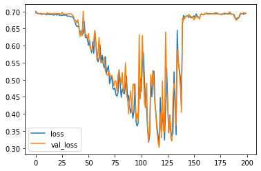

``` python
# Plot the accuracy too
plt.plot(r.history['accuracy'], label='acc')
plt.plot(r.history['val_accuracy'], label='val_acc')
plt.legend()
```

    <matplotlib.legend.Legend at 0x7fec1fae4470>

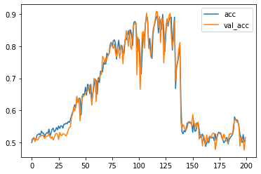

``` python
# Now test our LSTM
inputs = np.expand_dims(X, -1)

# make the RNN
i = Input(shape=(T, D))

# method 1
x = LSTM(5)(i)

x = Dense(1, activation='sigmoid')(x)
model = Model(i, x)
model.compile(
  loss='binary_crossentropy',
  optimizer=Adam(lr=0.01),
  metrics=['accuracy'],
)

# train the RNN
r = model.fit(
  inputs, Y,
  epochs=200,
  validation_split=0.5,
)
```

    Epoch 1/200
    79/79 [==============================] - 1s 9ms/step - loss: 0.6951 - accuracy: 0.4972 - val_loss: 0.6948 - val_accuracy: 0.5068
    Epoch 2/200
    79/79 [==============================] - 0s 6ms/step - loss: 0.6930 - accuracy: 0.5140 - val_loss: 0.6940 - val_accuracy: 0.4960
    Epoch 3/200
    79/79 [==============================] - 0s 6ms/step - loss: 0.6930 - accuracy: 0.5072 - val_loss: 0.6948 - val_accuracy: 0.5036
    Epoch 4/200
    79/79 [==============================] - 0s 6ms/step - loss: 0.6929 - accuracy: 0.5048 - val_loss: 0.6952 - val_accuracy: 0.5044
    Epoch 5/200
    79/79 [==============================] - 0s 6ms/step - loss: 0.6930 - accuracy: 0.5120 - val_loss: 0.6940 - val_accuracy: 0.4968
    Epoch 6/200
    79/79 [==============================] - 0s 6ms/step - loss: 0.6924 - accuracy: 0.5128 - val_loss: 0.6943 - val_accuracy: 0.4984
    Epoch 7/200
    79/79 [==============================] - 0s 6ms/step - loss: 0.6928 - accuracy: 0.5100 - val_loss: 0.6947 - val_accuracy: 0.5008
    Epoch 8/200
    79/79 [==============================] - 0s 6ms/step - loss: 0.6928 - accuracy: 0.5092 - val_loss: 0.6947 - val_accuracy: 0.4980
    Epoch 9/200
    79/79 [==============================] - 0s 6ms/step - loss: 0.6915 - accuracy: 0.5064 - val_loss: 0.6953 - val_accuracy: 0.5012
    Epoch 10/200
    79/79 [==============================] - 0s 6ms/step - loss: 0.6920 - accuracy: 0.5180 - val_loss: 0.6933 - val_accuracy: 0.5072
    Epoch 11/200
    79/79 [==============================] - 0s 6ms/step - loss: 0.6891 - accuracy: 0.5340 - val_loss: 0.6916 - val_accuracy: 0.5252
    Epoch 12/200
    79/79 [==============================] - 0s 6ms/step - loss: 0.6919 - accuracy: 0.5268 - val_loss: 0.6932 - val_accuracy: 0.5208
    Epoch 13/200
    79/79 [==============================] - 0s 6ms/step - loss: 0.6907 - accuracy: 0.5136 - val_loss: 0.6832 - val_accuracy: 0.5584
    Epoch 14/200
    79/79 [==============================] - 0s 6ms/step - loss: 0.6768 - accuracy: 0.5896 - val_loss: 0.6899 - val_accuracy: 0.5616
    Epoch 15/200
    79/79 [==============================] - 0s 6ms/step - loss: 0.6580 - accuracy: 0.6140 - val_loss: 0.6567 - val_accuracy: 0.6160
    Epoch 16/200
    79/79 [==============================] - 0s 6ms/step - loss: 0.6938 - accuracy: 0.5608 - val_loss: 0.6936 - val_accuracy: 0.5384
    Epoch 17/200
    79/79 [==============================] - 0s 6ms/step - loss: 0.6870 - accuracy: 0.5492 - val_loss: 0.6713 - val_accuracy: 0.5948
    Epoch 18/200
    79/79 [==============================] - 0s 6ms/step - loss: 0.6445 - accuracy: 0.6264 - val_loss: 0.6664 - val_accuracy: 0.5708
    Epoch 19/200
    79/79 [==============================] - 0s 6ms/step - loss: 0.6376 - accuracy: 0.5992 - val_loss: 0.6431 - val_accuracy: 0.6356
    Epoch 20/200
    79/79 [==============================] - 0s 6ms/step - loss: 0.6416 - accuracy: 0.6456 - val_loss: 0.6316 - val_accuracy: 0.6592
    Epoch 21/200
    79/79 [==============================] - 0s 6ms/step - loss: 0.6230 - accuracy: 0.6392 - val_loss: 0.6345 - val_accuracy: 0.6368
    Epoch 22/200
    79/79 [==============================] - 0s 6ms/step - loss: 0.6305 - accuracy: 0.6528 - val_loss: 0.6336 - val_accuracy: 0.6588
    Epoch 23/200
    79/79 [==============================] - 0s 6ms/step - loss: 0.6154 - accuracy: 0.6664 - val_loss: 0.6297 - val_accuracy: 0.6420
    Epoch 24/200
    79/79 [==============================] - 0s 6ms/step - loss: 0.6160 - accuracy: 0.6576 - val_loss: 0.6263 - val_accuracy: 0.6508
    Epoch 25/200
    79/79 [==============================] - 0s 6ms/step - loss: 0.6650 - accuracy: 0.6028 - val_loss: 0.6672 - val_accuracy: 0.5772
    Epoch 26/200
    79/79 [==============================] - 0s 6ms/step - loss: 0.6428 - accuracy: 0.6164 - val_loss: 0.6448 - val_accuracy: 0.6072
    Epoch 27/200
    79/79 [==============================] - 0s 6ms/step - loss: 0.6322 - accuracy: 0.6248 - val_loss: 0.6388 - val_accuracy: 0.6304
    Epoch 28/200
    79/79 [==============================] - 0s 6ms/step - loss: 0.6189 - accuracy: 0.6580 - val_loss: 0.6317 - val_accuracy: 0.6568
    Epoch 29/200
    79/79 [==============================] - 0s 6ms/step - loss: 0.6113 - accuracy: 0.6692 - val_loss: 0.6560 - val_accuracy: 0.5864
    Epoch 30/200
    79/79 [==============================] - 0s 6ms/step - loss: 0.6224 - accuracy: 0.6264 - val_loss: 0.6117 - val_accuracy: 0.6744
    Epoch 31/200
    79/79 [==============================] - 0s 6ms/step - loss: 0.6167 - accuracy: 0.6540 - val_loss: 0.6340 - val_accuracy: 0.6412
    Epoch 32/200
    79/79 [==============================] - 0s 6ms/step - loss: 0.6174 - accuracy: 0.6456 - val_loss: 0.6164 - val_accuracy: 0.6548
    Epoch 33/200
    79/79 [==============================] - 0s 6ms/step - loss: 0.6041 - accuracy: 0.6556 - val_loss: 0.5988 - val_accuracy: 0.6636
    Epoch 34/200
    79/79 [==============================] - 0s 6ms/step - loss: 0.5678 - accuracy: 0.7044 - val_loss: 0.5724 - val_accuracy: 0.7308
    Epoch 35/200
    79/79 [==============================] - 0s 6ms/step - loss: 0.5348 - accuracy: 0.7356 - val_loss: 0.5414 - val_accuracy: 0.7604
    Epoch 36/200
    79/79 [==============================] - 0s 6ms/step - loss: 0.5063 - accuracy: 0.7720 - val_loss: 0.5096 - val_accuracy: 0.7684
    Epoch 37/200
    79/79 [==============================] - 0s 6ms/step - loss: 0.4962 - accuracy: 0.7668 - val_loss: 0.4869 - val_accuracy: 0.7852
    Epoch 38/200
    79/79 [==============================] - 0s 6ms/step - loss: 0.4727 - accuracy: 0.7940 - val_loss: 0.5253 - val_accuracy: 0.7580
    Epoch 39/200
    79/79 [==============================] - 0s 6ms/step - loss: 0.4697 - accuracy: 0.7928 - val_loss: 0.4571 - val_accuracy: 0.8084
    Epoch 40/200
    79/79 [==============================] - 0s 6ms/step - loss: 0.4708 - accuracy: 0.7836 - val_loss: 0.4460 - val_accuracy: 0.8120
    Epoch 41/200
    79/79 [==============================] - 0s 6ms/step - loss: 0.4428 - accuracy: 0.8052 - val_loss: 0.4407 - val_accuracy: 0.8048
    Epoch 42/200
    79/79 [==============================] - 0s 6ms/step - loss: 0.4210 - accuracy: 0.8120 - val_loss: 0.4297 - val_accuracy: 0.8144
    Epoch 43/200
    79/79 [==============================] - 0s 6ms/step - loss: 0.4132 - accuracy: 0.8280 - val_loss: 0.4336 - val_accuracy: 0.8144
    Epoch 44/200
    79/79 [==============================] - 0s 6ms/step - loss: 0.4101 - accuracy: 0.8260 - val_loss: 0.4483 - val_accuracy: 0.8172
    Epoch 45/200
    79/79 [==============================] - 0s 6ms/step - loss: 0.4504 - accuracy: 0.8136 - val_loss: 0.4487 - val_accuracy: 0.8144
    Epoch 46/200
    79/79 [==============================] - 0s 6ms/step - loss: 0.4941 - accuracy: 0.7756 - val_loss: 0.5412 - val_accuracy: 0.7388
    Epoch 47/200
    79/79 [==============================] - 0s 6ms/step - loss: 0.5151 - accuracy: 0.7604 - val_loss: 0.4995 - val_accuracy: 0.7672
    Epoch 48/200
    79/79 [==============================] - 0s 6ms/step - loss: 0.4766 - accuracy: 0.7840 - val_loss: 0.4901 - val_accuracy: 0.7740
    Epoch 49/200
    79/79 [==============================] - 0s 6ms/step - loss: 0.4641 - accuracy: 0.7880 - val_loss: 0.5086 - val_accuracy: 0.7652
    Epoch 50/200
    79/79 [==============================] - 0s 6ms/step - loss: 0.4598 - accuracy: 0.8052 - val_loss: 0.4543 - val_accuracy: 0.8036
    Epoch 51/200
    79/79 [==============================] - 0s 6ms/step - loss: 0.4084 - accuracy: 0.8344 - val_loss: 0.4255 - val_accuracy: 0.8240
    Epoch 52/200
    79/79 [==============================] - 0s 6ms/step - loss: 0.3922 - accuracy: 0.8332 - val_loss: 0.4263 - val_accuracy: 0.8188
    Epoch 53/200
    79/79 [==============================] - 0s 6ms/step - loss: 0.3988 - accuracy: 0.8376 - val_loss: 0.4253 - val_accuracy: 0.8240
    Epoch 54/200
    79/79 [==============================] - 0s 6ms/step - loss: 0.3971 - accuracy: 0.8416 - val_loss: 0.4041 - val_accuracy: 0.8356
    Epoch 55/200
    79/79 [==============================] - 0s 6ms/step - loss: 0.3949 - accuracy: 0.8428 - val_loss: 0.4586 - val_accuracy: 0.8116
    Epoch 56/200
    79/79 [==============================] - 0s 6ms/step - loss: 0.4201 - accuracy: 0.8240 - val_loss: 0.4205 - val_accuracy: 0.8300
    Epoch 57/200
    79/79 [==============================] - 0s 6ms/step - loss: 0.3922 - accuracy: 0.8360 - val_loss: 0.4084 - val_accuracy: 0.8288
    Epoch 58/200
    79/79 [==============================] - 0s 6ms/step - loss: 0.4639 - accuracy: 0.8056 - val_loss: 0.4101 - val_accuracy: 0.8352
    Epoch 59/200
    79/79 [==============================] - 0s 6ms/step - loss: 0.3755 - accuracy: 0.8492 - val_loss: 0.3841 - val_accuracy: 0.8512
    Epoch 60/200
    79/79 [==============================] - 0s 6ms/step - loss: 0.3641 - accuracy: 0.8568 - val_loss: 0.3904 - val_accuracy: 0.8528
    Epoch 61/200
    79/79 [==============================] - 0s 6ms/step - loss: 0.3600 - accuracy: 0.8576 - val_loss: 0.4801 - val_accuracy: 0.8112
    Epoch 62/200
    79/79 [==============================] - 0s 6ms/step - loss: 0.4689 - accuracy: 0.8104 - val_loss: 0.4442 - val_accuracy: 0.8112
    Epoch 63/200
    79/79 [==============================] - 0s 6ms/step - loss: 0.4199 - accuracy: 0.8260 - val_loss: 0.4236 - val_accuracy: 0.8212
    Epoch 64/200
    79/79 [==============================] - 0s 6ms/step - loss: 0.4023 - accuracy: 0.8320 - val_loss: 0.4236 - val_accuracy: 0.8184
    Epoch 65/200
    79/79 [==============================] - 0s 6ms/step - loss: 0.3846 - accuracy: 0.8368 - val_loss: 0.4025 - val_accuracy: 0.8364
    Epoch 66/200
    79/79 [==============================] - 0s 6ms/step - loss: 0.3789 - accuracy: 0.8452 - val_loss: 0.4051 - val_accuracy: 0.8356
    Epoch 67/200
    79/79 [==============================] - 0s 6ms/step - loss: 0.3765 - accuracy: 0.8524 - val_loss: 0.3683 - val_accuracy: 0.8592
    Epoch 68/200
    79/79 [==============================] - 0s 6ms/step - loss: 0.3581 - accuracy: 0.8600 - val_loss: 0.3453 - val_accuracy: 0.8680
    Epoch 69/200
    79/79 [==============================] - 0s 6ms/step - loss: 0.3633 - accuracy: 0.8544 - val_loss: 0.3584 - val_accuracy: 0.8532
    Epoch 70/200
    79/79 [==============================] - 0s 6ms/step - loss: 0.3495 - accuracy: 0.8632 - val_loss: 0.3408 - val_accuracy: 0.8676
    Epoch 71/200
    79/79 [==============================] - 0s 6ms/step - loss: 0.3435 - accuracy: 0.8732 - val_loss: 0.3465 - val_accuracy: 0.8696
    Epoch 72/200
    79/79 [==============================] - 0s 6ms/step - loss: 0.3607 - accuracy: 0.8652 - val_loss: 0.3660 - val_accuracy: 0.8560
    Epoch 73/200
    79/79 [==============================] - 0s 6ms/step - loss: 0.3500 - accuracy: 0.8644 - val_loss: 0.3522 - val_accuracy: 0.8636
    Epoch 74/200
    79/79 [==============================] - 0s 6ms/step - loss: 0.3480 - accuracy: 0.8628 - val_loss: 0.3526 - val_accuracy: 0.8628
    Epoch 75/200
    79/79 [==============================] - 0s 6ms/step - loss: 0.3459 - accuracy: 0.8696 - val_loss: 0.3460 - val_accuracy: 0.8668
    Epoch 76/200
    79/79 [==============================] - 0s 6ms/step - loss: 0.3489 - accuracy: 0.8672 - val_loss: 0.4227 - val_accuracy: 0.8204
    Epoch 77/200
    79/79 [==============================] - 0s 6ms/step - loss: 0.3986 - accuracy: 0.8300 - val_loss: 0.4046 - val_accuracy: 0.8208
    Epoch 78/200
    79/79 [==============================] - 0s 6ms/step - loss: 0.3767 - accuracy: 0.8408 - val_loss: 0.3822 - val_accuracy: 0.8432
    Epoch 79/200
    79/79 [==============================] - 0s 6ms/step - loss: 0.3647 - accuracy: 0.8528 - val_loss: 0.3791 - val_accuracy: 0.8408
    Epoch 80/200
    79/79 [==============================] - 0s 6ms/step - loss: 0.3537 - accuracy: 0.8548 - val_loss: 0.3624 - val_accuracy: 0.8496
    Epoch 81/200
    79/79 [==============================] - 0s 6ms/step - loss: 0.3432 - accuracy: 0.8604 - val_loss: 0.3626 - val_accuracy: 0.8508
    Epoch 82/200
    79/79 [==============================] - 0s 6ms/step - loss: 0.3415 - accuracy: 0.8632 - val_loss: 0.3865 - val_accuracy: 0.8412
    Epoch 83/200
    79/79 [==============================] - 0s 6ms/step - loss: 0.3452 - accuracy: 0.8592 - val_loss: 0.3724 - val_accuracy: 0.8492
    Epoch 84/200
    79/79 [==============================] - 0s 6ms/step - loss: 0.3417 - accuracy: 0.8600 - val_loss: 0.3677 - val_accuracy: 0.8460
    Epoch 85/200
    79/79 [==============================] - 0s 6ms/step - loss: 0.3497 - accuracy: 0.8620 - val_loss: 0.4046 - val_accuracy: 0.8524
    Epoch 86/200
    79/79 [==============================] - 0s 6ms/step - loss: 0.3627 - accuracy: 0.8620 - val_loss: 0.3845 - val_accuracy: 0.8520
    Epoch 87/200
    79/79 [==============================] - 0s 6ms/step - loss: 0.3576 - accuracy: 0.8672 - val_loss: 0.4617 - val_accuracy: 0.8260
    Epoch 88/200
    79/79 [==============================] - 0s 6ms/step - loss: 0.3878 - accuracy: 0.8536 - val_loss: 0.3513 - val_accuracy: 0.8640
    Epoch 89/200
    79/79 [==============================] - 0s 6ms/step - loss: 0.3353 - accuracy: 0.8796 - val_loss: 0.3367 - val_accuracy: 0.8736
    Epoch 90/200
    79/79 [==============================] - 0s 6ms/step - loss: 0.3328 - accuracy: 0.8844 - val_loss: 0.3293 - val_accuracy: 0.8780
    Epoch 91/200
    79/79 [==============================] - 0s 6ms/step - loss: 0.3300 - accuracy: 0.8888 - val_loss: 0.3723 - val_accuracy: 0.8684
    Epoch 92/200
    79/79 [==============================] - 0s 6ms/step - loss: 0.3477 - accuracy: 0.8728 - val_loss: 0.3583 - val_accuracy: 0.8676
    Epoch 93/200
    79/79 [==============================] - 0s 6ms/step - loss: 0.3552 - accuracy: 0.8668 - val_loss: 0.4290 - val_accuracy: 0.8332
    Epoch 94/200
    79/79 [==============================] - 0s 6ms/step - loss: 0.3486 - accuracy: 0.8668 - val_loss: 0.3927 - val_accuracy: 0.8504
    Epoch 95/200
    79/79 [==============================] - 0s 6ms/step - loss: 0.3503 - accuracy: 0.8712 - val_loss: 0.3956 - val_accuracy: 0.8524
    Epoch 96/200
    79/79 [==============================] - 0s 6ms/step - loss: 0.3480 - accuracy: 0.8708 - val_loss: 0.3803 - val_accuracy: 0.8520
    Epoch 97/200
    79/79 [==============================] - 0s 6ms/step - loss: 0.3204 - accuracy: 0.8824 - val_loss: 0.3470 - val_accuracy: 0.8724
    Epoch 98/200
    79/79 [==============================] - 0s 6ms/step - loss: 0.3000 - accuracy: 0.8932 - val_loss: 0.3088 - val_accuracy: 0.8904
    Epoch 99/200
    79/79 [==============================] - 0s 6ms/step - loss: 0.2753 - accuracy: 0.9064 - val_loss: 0.3043 - val_accuracy: 0.8900
    Epoch 100/200
    79/79 [==============================] - 0s 6ms/step - loss: 0.2736 - accuracy: 0.9036 - val_loss: 0.2935 - val_accuracy: 0.8992
    Epoch 101/200
    79/79 [==============================] - 0s 6ms/step - loss: 0.2749 - accuracy: 0.9072 - val_loss: 0.3115 - val_accuracy: 0.8896
    Epoch 102/200
    79/79 [==============================] - 0s 6ms/step - loss: 0.2615 - accuracy: 0.9104 - val_loss: 0.3126 - val_accuracy: 0.8864
    Epoch 103/200
    79/79 [==============================] - 0s 6ms/step - loss: 0.2684 - accuracy: 0.9100 - val_loss: 0.2951 - val_accuracy: 0.8984
    Epoch 104/200
    79/79 [==============================] - 0s 6ms/step - loss: 0.2611 - accuracy: 0.9124 - val_loss: 0.2887 - val_accuracy: 0.8976
    Epoch 105/200
    79/79 [==============================] - 0s 6ms/step - loss: 0.2725 - accuracy: 0.9096 - val_loss: 0.3431 - val_accuracy: 0.8796
    Epoch 106/200
    79/79 [==============================] - 0s 6ms/step - loss: 0.2825 - accuracy: 0.9020 - val_loss: 0.2868 - val_accuracy: 0.9024
    Epoch 107/200
    79/79 [==============================] - 0s 6ms/step - loss: 0.2767 - accuracy: 0.9044 - val_loss: 0.3275 - val_accuracy: 0.8832
    Epoch 108/200
    79/79 [==============================] - 0s 6ms/step - loss: 0.2985 - accuracy: 0.8952 - val_loss: 0.3151 - val_accuracy: 0.8876
    Epoch 109/200
    79/79 [==============================] - 0s 6ms/step - loss: 0.2815 - accuracy: 0.9044 - val_loss: 0.3018 - val_accuracy: 0.8976
    Epoch 110/200
    79/79 [==============================] - 0s 6ms/step - loss: 0.2827 - accuracy: 0.9028 - val_loss: 0.2902 - val_accuracy: 0.9048
    Epoch 111/200
    79/79 [==============================] - 0s 6ms/step - loss: 0.2605 - accuracy: 0.9140 - val_loss: 0.2997 - val_accuracy: 0.8952
    Epoch 112/200
    79/79 [==============================] - 0s 6ms/step - loss: 0.2540 - accuracy: 0.9160 - val_loss: 0.2777 - val_accuracy: 0.9080
    Epoch 113/200
    79/79 [==============================] - 0s 6ms/step - loss: 0.2428 - accuracy: 0.9176 - val_loss: 0.2913 - val_accuracy: 0.8980
    Epoch 114/200
    79/79 [==============================] - 0s 6ms/step - loss: 0.2654 - accuracy: 0.9080 - val_loss: 0.3008 - val_accuracy: 0.8948
    Epoch 115/200
    79/79 [==============================] - 0s 6ms/step - loss: 0.2483 - accuracy: 0.9152 - val_loss: 0.2795 - val_accuracy: 0.9028
    Epoch 116/200
    79/79 [==============================] - 0s 6ms/step - loss: 0.2470 - accuracy: 0.9160 - val_loss: 0.2937 - val_accuracy: 0.8988
    Epoch 117/200
    79/79 [==============================] - 0s 6ms/step - loss: 0.3590 - accuracy: 0.8600 - val_loss: 0.3673 - val_accuracy: 0.8496
    Epoch 118/200
    79/79 [==============================] - 0s 6ms/step - loss: 0.3585 - accuracy: 0.8576 - val_loss: 0.3815 - val_accuracy: 0.8432
    Epoch 119/200
    79/79 [==============================] - 0s 6ms/step - loss: 0.3618 - accuracy: 0.8560 - val_loss: 0.3473 - val_accuracy: 0.8648
    Epoch 120/200
    79/79 [==============================] - 0s 6ms/step - loss: 0.3483 - accuracy: 0.8572 - val_loss: 0.3464 - val_accuracy: 0.8596
    Epoch 121/200
    79/79 [==============================] - 0s 6ms/step - loss: 0.3480 - accuracy: 0.8584 - val_loss: 0.3421 - val_accuracy: 0.8616
    Epoch 122/200
    79/79 [==============================] - 0s 6ms/step - loss: 0.3424 - accuracy: 0.8644 - val_loss: 0.3477 - val_accuracy: 0.8536
    Epoch 123/200
    79/79 [==============================] - 0s 6ms/step - loss: 0.3443 - accuracy: 0.8648 - val_loss: 0.3426 - val_accuracy: 0.8528
    Epoch 124/200
    79/79 [==============================] - 0s 6ms/step - loss: 0.3376 - accuracy: 0.8664 - val_loss: 0.3468 - val_accuracy: 0.8520
    Epoch 125/200
    79/79 [==============================] - 0s 6ms/step - loss: 0.3363 - accuracy: 0.8612 - val_loss: 0.3369 - val_accuracy: 0.8592
    Epoch 126/200
    79/79 [==============================] - 0s 6ms/step - loss: 0.3074 - accuracy: 0.8848 - val_loss: 0.2864 - val_accuracy: 0.8988
    Epoch 127/200
    79/79 [==============================] - 0s 6ms/step - loss: 0.2740 - accuracy: 0.9056 - val_loss: 0.2777 - val_accuracy: 0.9044
    Epoch 128/200
    79/79 [==============================] - 0s 6ms/step - loss: 0.2652 - accuracy: 0.9044 - val_loss: 0.2824 - val_accuracy: 0.9016
    Epoch 129/200
    79/79 [==============================] - 0s 6ms/step - loss: 0.2626 - accuracy: 0.9064 - val_loss: 0.2775 - val_accuracy: 0.9020
    Epoch 130/200
    79/79 [==============================] - 0s 6ms/step - loss: 0.2618 - accuracy: 0.9044 - val_loss: 0.2631 - val_accuracy: 0.9076
    Epoch 131/200
    79/79 [==============================] - 0s 6ms/step - loss: 0.2511 - accuracy: 0.9108 - val_loss: 0.2600 - val_accuracy: 0.9156
    Epoch 132/200
    79/79 [==============================] - 0s 6ms/step - loss: 0.2433 - accuracy: 0.9108 - val_loss: 0.2587 - val_accuracy: 0.9148
    Epoch 133/200
    79/79 [==============================] - 0s 6ms/step - loss: 0.2551 - accuracy: 0.9084 - val_loss: 0.2811 - val_accuracy: 0.8996
    Epoch 134/200
    79/79 [==============================] - 0s 6ms/step - loss: 0.2351 - accuracy: 0.9188 - val_loss: 0.2558 - val_accuracy: 0.9180
    Epoch 135/200
    79/79 [==============================] - 0s 6ms/step - loss: 0.2722 - accuracy: 0.9136 - val_loss: 0.2929 - val_accuracy: 0.9044
    Epoch 136/200
    79/79 [==============================] - 0s 6ms/step - loss: 0.3085 - accuracy: 0.9020 - val_loss: 0.2946 - val_accuracy: 0.9008
    Epoch 137/200
    79/79 [==============================] - 0s 6ms/step - loss: 0.2960 - accuracy: 0.8980 - val_loss: 0.3340 - val_accuracy: 0.8880
    Epoch 138/200
    79/79 [==============================] - 0s 6ms/step - loss: 0.2954 - accuracy: 0.8984 - val_loss: 0.3190 - val_accuracy: 0.8904
    Epoch 139/200
    79/79 [==============================] - 0s 6ms/step - loss: 0.2780 - accuracy: 0.9036 - val_loss: 0.2865 - val_accuracy: 0.9020
    Epoch 140/200
    79/79 [==============================] - 0s 6ms/step - loss: 0.2774 - accuracy: 0.9012 - val_loss: 0.3152 - val_accuracy: 0.8872
    Epoch 141/200
    79/79 [==============================] - 0s 6ms/step - loss: 0.2738 - accuracy: 0.9024 - val_loss: 0.4013 - val_accuracy: 0.8472
    Epoch 142/200
    79/79 [==============================] - 0s 6ms/step - loss: 0.2945 - accuracy: 0.8860 - val_loss: 0.3022 - val_accuracy: 0.8928
    Epoch 143/200
    79/79 [==============================] - 0s 6ms/step - loss: 0.2758 - accuracy: 0.8980 - val_loss: 0.2889 - val_accuracy: 0.8976
    Epoch 144/200
    79/79 [==============================] - 0s 6ms/step - loss: 0.2514 - accuracy: 0.9108 - val_loss: 0.2634 - val_accuracy: 0.9100
    Epoch 145/200
    79/79 [==============================] - 0s 6ms/step - loss: 0.2428 - accuracy: 0.9152 - val_loss: 0.3172 - val_accuracy: 0.8828
    Epoch 146/200
    79/79 [==============================] - 0s 6ms/step - loss: 0.3130 - accuracy: 0.8796 - val_loss: 0.3579 - val_accuracy: 0.8748
    Epoch 147/200
    79/79 [==============================] - 0s 6ms/step - loss: 0.3286 - accuracy: 0.8768 - val_loss: 0.3573 - val_accuracy: 0.8692
    Epoch 148/200
    79/79 [==============================] - 0s 6ms/step - loss: 0.3233 - accuracy: 0.8712 - val_loss: 0.3673 - val_accuracy: 0.8608
    Epoch 149/200
    79/79 [==============================] - 0s 6ms/step - loss: 0.3389 - accuracy: 0.8708 - val_loss: 0.3232 - val_accuracy: 0.8768
    Epoch 150/200
    79/79 [==============================] - 0s 6ms/step - loss: 0.2951 - accuracy: 0.8892 - val_loss: 0.2972 - val_accuracy: 0.8940
    Epoch 151/200
    79/79 [==============================] - 0s 6ms/step - loss: 0.2731 - accuracy: 0.9028 - val_loss: 0.2910 - val_accuracy: 0.8988
    Epoch 152/200
    79/79 [==============================] - 0s 6ms/step - loss: 0.2837 - accuracy: 0.8960 - val_loss: 0.2896 - val_accuracy: 0.9000
    Epoch 153/200
    79/79 [==============================] - 0s 6ms/step - loss: 0.2645 - accuracy: 0.9060 - val_loss: 0.2656 - val_accuracy: 0.9052
    Epoch 154/200
    79/79 [==============================] - 0s 6ms/step - loss: 0.2674 - accuracy: 0.9060 - val_loss: 0.2817 - val_accuracy: 0.8948
    Epoch 155/200
    79/79 [==============================] - 0s 6ms/step - loss: 0.2627 - accuracy: 0.9004 - val_loss: 0.2649 - val_accuracy: 0.9096
    Epoch 156/200
    79/79 [==============================] - 0s 6ms/step - loss: 0.2335 - accuracy: 0.9136 - val_loss: 0.2634 - val_accuracy: 0.9152
    Epoch 157/200
    79/79 [==============================] - 0s 6ms/step - loss: 0.2248 - accuracy: 0.9188 - val_loss: 0.2377 - val_accuracy: 0.9204
    Epoch 158/200
    79/79 [==============================] - 0s 6ms/step - loss: 0.2385 - accuracy: 0.9156 - val_loss: 0.2319 - val_accuracy: 0.9252
    Epoch 159/200
    79/79 [==============================] - 0s 6ms/step - loss: 0.2186 - accuracy: 0.9264 - val_loss: 0.2438 - val_accuracy: 0.9228
    Epoch 160/200
    79/79 [==============================] - 0s 6ms/step - loss: 0.2174 - accuracy: 0.9232 - val_loss: 0.2436 - val_accuracy: 0.9128
    Epoch 161/200
    79/79 [==============================] - 0s 6ms/step - loss: 0.2391 - accuracy: 0.9180 - val_loss: 0.2516 - val_accuracy: 0.9128
    Epoch 162/200
    79/79 [==============================] - 0s 6ms/step - loss: 0.2556 - accuracy: 0.9036 - val_loss: 0.2540 - val_accuracy: 0.9088
    Epoch 163/200
    79/79 [==============================] - 0s 6ms/step - loss: 0.2490 - accuracy: 0.9044 - val_loss: 0.2756 - val_accuracy: 0.9000
    Epoch 164/200
    79/79 [==============================] - 0s 6ms/step - loss: 0.2661 - accuracy: 0.8964 - val_loss: 0.2696 - val_accuracy: 0.9040
    Epoch 165/200
    79/79 [==============================] - 0s 6ms/step - loss: 0.2556 - accuracy: 0.9008 - val_loss: 0.2776 - val_accuracy: 0.8924
    Epoch 166/200
    79/79 [==============================] - 0s 6ms/step - loss: 0.2363 - accuracy: 0.9112 - val_loss: 0.2491 - val_accuracy: 0.9100
    Epoch 167/200
    79/79 [==============================] - 0s 6ms/step - loss: 0.2443 - accuracy: 0.9072 - val_loss: 0.2796 - val_accuracy: 0.9028
    Epoch 168/200
    79/79 [==============================] - 0s 6ms/step - loss: 0.2390 - accuracy: 0.9080 - val_loss: 0.2637 - val_accuracy: 0.9100
    Epoch 169/200
    79/79 [==============================] - 0s 6ms/step - loss: 0.2500 - accuracy: 0.9116 - val_loss: 0.2620 - val_accuracy: 0.9072
    Epoch 170/200
    79/79 [==============================] - 0s 6ms/step - loss: 0.2543 - accuracy: 0.9076 - val_loss: 0.2640 - val_accuracy: 0.9072
    Epoch 171/200
    79/79 [==============================] - 0s 6ms/step - loss: 0.2407 - accuracy: 0.9176 - val_loss: 0.3020 - val_accuracy: 0.8964
    Epoch 172/200
    79/79 [==============================] - 0s 6ms/step - loss: 0.2992 - accuracy: 0.8896 - val_loss: 0.2675 - val_accuracy: 0.9076
    Epoch 173/200
    79/79 [==============================] - 0s 6ms/step - loss: 0.2341 - accuracy: 0.9220 - val_loss: 0.2504 - val_accuracy: 0.9132
    Epoch 174/200
    79/79 [==============================] - 0s 6ms/step - loss: 0.2303 - accuracy: 0.9220 - val_loss: 0.2278 - val_accuracy: 0.9256
    Epoch 175/200
    79/79 [==============================] - 0s 6ms/step - loss: 0.2244 - accuracy: 0.9284 - val_loss: 0.2255 - val_accuracy: 0.9248
    Epoch 176/200
    79/79 [==============================] - 0s 6ms/step - loss: 0.2026 - accuracy: 0.9328 - val_loss: 0.2065 - val_accuracy: 0.9332
    Epoch 177/200
    79/79 [==============================] - 0s 6ms/step - loss: 0.1963 - accuracy: 0.9372 - val_loss: 0.2063 - val_accuracy: 0.9296
    Epoch 178/200
    79/79 [==============================] - 0s 6ms/step - loss: 0.2004 - accuracy: 0.9288 - val_loss: 0.2070 - val_accuracy: 0.9320
    Epoch 179/200
    79/79 [==============================] - 0s 6ms/step - loss: 0.2023 - accuracy: 0.9356 - val_loss: 0.2043 - val_accuracy: 0.9364
    Epoch 180/200
    79/79 [==============================] - 0s 6ms/step - loss: 0.1972 - accuracy: 0.9364 - val_loss: 0.1977 - val_accuracy: 0.9360
    Epoch 181/200
    79/79 [==============================] - 0s 6ms/step - loss: 0.2088 - accuracy: 0.9320 - val_loss: 0.2822 - val_accuracy: 0.9024
    Epoch 182/200
    79/79 [==============================] - 0s 6ms/step - loss: 0.2404 - accuracy: 0.9160 - val_loss: 0.2308 - val_accuracy: 0.9224
    Epoch 183/200
    79/79 [==============================] - 0s 6ms/step - loss: 0.2220 - accuracy: 0.9260 - val_loss: 0.2359 - val_accuracy: 0.9180
    Epoch 184/200
    79/79 [==============================] - 0s 6ms/step - loss: 0.2148 - accuracy: 0.9248 - val_loss: 0.2289 - val_accuracy: 0.9208
    Epoch 185/200
    79/79 [==============================] - 0s 6ms/step - loss: 0.1943 - accuracy: 0.9332 - val_loss: 0.2050 - val_accuracy: 0.9304
    Epoch 186/200
    79/79 [==============================] - 0s 6ms/step - loss: 0.1820 - accuracy: 0.9384 - val_loss: 0.2460 - val_accuracy: 0.9156
    Epoch 187/200
    79/79 [==============================] - 0s 6ms/step - loss: 0.2313 - accuracy: 0.9192 - val_loss: 0.2650 - val_accuracy: 0.9128
    Epoch 188/200
    79/79 [==============================] - 0s 6ms/step - loss: 0.2283 - accuracy: 0.9176 - val_loss: 0.2776 - val_accuracy: 0.9100
    Epoch 189/200
    79/79 [==============================] - 0s 6ms/step - loss: 0.2688 - accuracy: 0.8980 - val_loss: 0.3051 - val_accuracy: 0.8956
    Epoch 190/200
    79/79 [==============================] - 0s 6ms/step - loss: 0.2721 - accuracy: 0.9004 - val_loss: 0.2945 - val_accuracy: 0.9008
    Epoch 191/200
    79/79 [==============================] - 0s 6ms/step - loss: 0.2764 - accuracy: 0.8976 - val_loss: 0.2676 - val_accuracy: 0.9076
    Epoch 192/200
    79/79 [==============================] - 0s 6ms/step - loss: 0.2493 - accuracy: 0.9128 - val_loss: 0.2671 - val_accuracy: 0.9052
    Epoch 193/200
    79/79 [==============================] - 0s 6ms/step - loss: 0.2263 - accuracy: 0.9160 - val_loss: 0.2581 - val_accuracy: 0.9108
    Epoch 194/200
    79/79 [==============================] - 0s 6ms/step - loss: 0.2231 - accuracy: 0.9200 - val_loss: 0.2770 - val_accuracy: 0.9044
    Epoch 195/200
    79/79 [==============================] - 0s 6ms/step - loss: 0.2348 - accuracy: 0.9184 - val_loss: 0.2392 - val_accuracy: 0.9176
    Epoch 196/200
    79/79 [==============================] - 0s 6ms/step - loss: 0.1979 - accuracy: 0.9292 - val_loss: 0.2347 - val_accuracy: 0.9224
    Epoch 197/200
    79/79 [==============================] - 0s 6ms/step - loss: 0.2099 - accuracy: 0.9264 - val_loss: 0.2498 - val_accuracy: 0.9144
    Epoch 198/200
    79/79 [==============================] - 0s 6ms/step - loss: 0.2169 - accuracy: 0.9180 - val_loss: 0.2435 - val_accuracy: 0.9176
    Epoch 199/200
    79/79 [==============================] - 0s 6ms/step - loss: 0.2105 - accuracy: 0.9240 - val_loss: 0.3108 - val_accuracy: 0.8824
    Epoch 200/200
    79/79 [==============================] - 0s 6ms/step - loss: 0.4865 - accuracy: 0.7912 - val_loss: 0.3834 - val_accuracy: 0.8304

``` python
# Plot the loss
plt.plot(r.history['loss'], label='loss')
plt.plot(r.history['val_loss'], label='val_loss')
plt.legend()
```

    <matplotlib.legend.Legend at 0x7fec38311eb8>


``` python
# Plot the accuracy too
plt.plot(r.history['accuracy'], label='acc')
plt.plot(r.history['val_accuracy'], label='val_acc')
plt.legend()
```

    <matplotlib.legend.Legend at 0x7fec1fb28978>

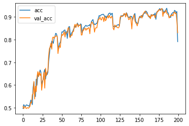

``` python
# Make the problem harder by making T larger
T = 20
D = 1
X = []
Y = []

for t in range(5000):
  x = np.random.randn(T)
  X.append(x)
  y = get_label(x, 0, 1, 2) # long distance
  Y.append(y)

X = np.array(X)
Y = np.array(Y)
N = len(X)
```

``` python
# Now test our Simple RNN again
inputs = np.expand_dims(X, -1)

# make the RNN
i = Input(shape=(T, D))

# method 1
x = SimpleRNN(5)(i)

x = Dense(1, activation='sigmoid')(x)
model = Model(i, x)
model.compile(
  loss='binary_crossentropy',
  optimizer=Adam(lr=0.01),
  metrics=['accuracy'],
)

# train the RNN
r = model.fit(
  inputs, Y,
  epochs=200,
  validation_split=0.5,
)
```

    Epoch 1/200
    79/79 [==============================] - 1s 18ms/step - loss: 0.7027 - accuracy: 0.4816 - val_loss: 0.6930 - val_accuracy: 0.5052
    Epoch 2/200
    79/79 [==============================] - 1s 16ms/step - loss: 0.6940 - accuracy: 0.5000 - val_loss: 0.6946 - val_accuracy: 0.5068
    Epoch 3/200
    79/79 [==============================] - 1s 16ms/step - loss: 0.6920 - accuracy: 0.5136 - val_loss: 0.6973 - val_accuracy: 0.5020
    Epoch 4/200
    79/79 [==============================] - 1s 16ms/step - loss: 0.6942 - accuracy: 0.5048 - val_loss: 0.6945 - val_accuracy: 0.4984
    Epoch 5/200
    79/79 [==============================] - 1s 16ms/step - loss: 0.6927 - accuracy: 0.5068 - val_loss: 0.6942 - val_accuracy: 0.5088
    Epoch 6/200
    79/79 [==============================] - 1s 16ms/step - loss: 0.6934 - accuracy: 0.5076 - val_loss: 0.6945 - val_accuracy: 0.5036
    Epoch 7/200
    79/79 [==============================] - 1s 16ms/step - loss: 0.6924 - accuracy: 0.5204 - val_loss: 0.6951 - val_accuracy: 0.5004
    Epoch 8/200
    79/79 [==============================] - 1s 16ms/step - loss: 0.6931 - accuracy: 0.5120 - val_loss: 0.6952 - val_accuracy: 0.5104
    Epoch 9/200
    79/79 [==============================] - 1s 16ms/step - loss: 0.6921 - accuracy: 0.5272 - val_loss: 0.6949 - val_accuracy: 0.4976
    Epoch 10/200
    79/79 [==============================] - 1s 16ms/step - loss: 0.6916 - accuracy: 0.5252 - val_loss: 0.6957 - val_accuracy: 0.5100
    Epoch 11/200
    79/79 [==============================] - 1s 16ms/step - loss: 0.6925 - accuracy: 0.5172 - val_loss: 0.6950 - val_accuracy: 0.5052
    Epoch 12/200
    79/79 [==============================] - 1s 16ms/step - loss: 0.6922 - accuracy: 0.5268 - val_loss: 0.6953 - val_accuracy: 0.4996
    Epoch 13/200
    79/79 [==============================] - 1s 16ms/step - loss: 0.6919 - accuracy: 0.5252 - val_loss: 0.6955 - val_accuracy: 0.5100
    Epoch 14/200
    79/79 [==============================] - 1s 16ms/step - loss: 0.6910 - accuracy: 0.5280 - val_loss: 0.6965 - val_accuracy: 0.5016
    Epoch 15/200
    79/79 [==============================] - 1s 16ms/step - loss: 0.6924 - accuracy: 0.5296 - val_loss: 0.6960 - val_accuracy: 0.5060
    Epoch 16/200
    79/79 [==============================] - 1s 16ms/step - loss: 0.6916 - accuracy: 0.5276 - val_loss: 0.6968 - val_accuracy: 0.4972
    Epoch 17/200
    79/79 [==============================] - 1s 16ms/step - loss: 0.6905 - accuracy: 0.5388 - val_loss: 0.6971 - val_accuracy: 0.4988
    Epoch 18/200
    79/79 [==============================] - 1s 16ms/step - loss: 0.6928 - accuracy: 0.5200 - val_loss: 0.6969 - val_accuracy: 0.4908
    Epoch 19/200
    79/79 [==============================] - 1s 16ms/step - loss: 0.6908 - accuracy: 0.5384 - val_loss: 0.6991 - val_accuracy: 0.4932
    Epoch 20/200
    79/79 [==============================] - 1s 16ms/step - loss: 0.6907 - accuracy: 0.5480 - val_loss: 0.6964 - val_accuracy: 0.5024
    Epoch 21/200
    79/79 [==============================] - 1s 17ms/step - loss: 0.6912 - accuracy: 0.5296 - val_loss: 0.6976 - val_accuracy: 0.4924
    Epoch 22/200
    79/79 [==============================] - 1s 16ms/step - loss: 0.6924 - accuracy: 0.5304 - val_loss: 0.6980 - val_accuracy: 0.4976
    Epoch 23/200
    79/79 [==============================] - 1s 16ms/step - loss: 0.6907 - accuracy: 0.5408 - val_loss: 0.6993 - val_accuracy: 0.5024
    Epoch 24/200
    79/79 [==============================] - 1s 17ms/step - loss: 0.6906 - accuracy: 0.5368 - val_loss: 0.6974 - val_accuracy: 0.5044
    Epoch 25/200
    79/79 [==============================] - 1s 16ms/step - loss: 0.6892 - accuracy: 0.5424 - val_loss: 0.6965 - val_accuracy: 0.5112
    Epoch 26/200
    79/79 [==============================] - 1s 16ms/step - loss: 0.6882 - accuracy: 0.5452 - val_loss: 0.6970 - val_accuracy: 0.4920
    Epoch 27/200
    79/79 [==============================] - 1s 16ms/step - loss: 0.6896 - accuracy: 0.5436 - val_loss: 0.6984 - val_accuracy: 0.4944
    Epoch 28/200
    79/79 [==============================] - 1s 16ms/step - loss: 0.6897 - accuracy: 0.5428 - val_loss: 0.6984 - val_accuracy: 0.4944
    Epoch 29/200
    79/79 [==============================] - 1s 16ms/step - loss: 0.6887 - accuracy: 0.5392 - val_loss: 0.6974 - val_accuracy: 0.5076
    Epoch 30/200
    79/79 [==============================] - 1s 16ms/step - loss: 0.6901 - accuracy: 0.5380 - val_loss: 0.6968 - val_accuracy: 0.5000
    Epoch 31/200
    79/79 [==============================] - 1s 16ms/step - loss: 0.6895 - accuracy: 0.5420 - val_loss: 0.6970 - val_accuracy: 0.5016
    Epoch 32/200
    79/79 [==============================] - 1s 16ms/step - loss: 0.6891 - accuracy: 0.5508 - val_loss: 0.7012 - val_accuracy: 0.4816
    Epoch 33/200
    79/79 [==============================] - 1s 16ms/step - loss: 0.6901 - accuracy: 0.5316 - val_loss: 0.6957 - val_accuracy: 0.5072
    Epoch 34/200
    79/79 [==============================] - 1s 16ms/step - loss: 0.6916 - accuracy: 0.5228 - val_loss: 0.6947 - val_accuracy: 0.5016
    Epoch 35/200
    79/79 [==============================] - 1s 16ms/step - loss: 0.6880 - accuracy: 0.5452 - val_loss: 0.6961 - val_accuracy: 0.5084
    Epoch 36/200
    79/79 [==============================] - 1s 16ms/step - loss: 0.6933 - accuracy: 0.5080 - val_loss: 0.6973 - val_accuracy: 0.5136
    Epoch 37/200
    79/79 [==============================] - 1s 18ms/step - loss: 0.6946 - accuracy: 0.5060 - val_loss: 0.6949 - val_accuracy: 0.5072
    Epoch 38/200
    79/79 [==============================] - 1s 16ms/step - loss: 0.6929 - accuracy: 0.5168 - val_loss: 0.6961 - val_accuracy: 0.5128
    Epoch 39/200
    79/79 [==============================] - 1s 16ms/step - loss: 0.6927 - accuracy: 0.5176 - val_loss: 0.6916 - val_accuracy: 0.5384
    Epoch 40/200
    79/79 [==============================] - 1s 16ms/step - loss: 0.6929 - accuracy: 0.5164 - val_loss: 0.6925 - val_accuracy: 0.5152
    Epoch 41/200
    79/79 [==============================] - 1s 16ms/step - loss: 0.6933 - accuracy: 0.5176 - val_loss: 0.6920 - val_accuracy: 0.5288
    Epoch 42/200
    79/79 [==============================] - 1s 16ms/step - loss: 0.6931 - accuracy: 0.5304 - val_loss: 0.6919 - val_accuracy: 0.5264
    Epoch 43/200
    79/79 [==============================] - 1s 16ms/step - loss: 0.6913 - accuracy: 0.5156 - val_loss: 0.6940 - val_accuracy: 0.5264
    Epoch 44/200
    79/79 [==============================] - 1s 16ms/step - loss: 0.6920 - accuracy: 0.5380 - val_loss: 0.6931 - val_accuracy: 0.5292
    Epoch 45/200
    79/79 [==============================] - 1s 16ms/step - loss: 0.6918 - accuracy: 0.5336 - val_loss: 0.6919 - val_accuracy: 0.5276
    Epoch 46/200
    79/79 [==============================] - 1s 16ms/step - loss: 0.6913 - accuracy: 0.5380 - val_loss: 0.6929 - val_accuracy: 0.4956
    Epoch 47/200
    79/79 [==============================] - 1s 16ms/step - loss: 0.6921 - accuracy: 0.5256 - val_loss: 0.6917 - val_accuracy: 0.5308
    Epoch 48/200
    79/79 [==============================] - 1s 16ms/step - loss: 0.6906 - accuracy: 0.5348 - val_loss: 0.6926 - val_accuracy: 0.5300
    Epoch 49/200
    79/79 [==============================] - 1s 16ms/step - loss: 0.6903 - accuracy: 0.5400 - val_loss: 0.6926 - val_accuracy: 0.5184
    Epoch 50/200
    79/79 [==============================] - 1s 16ms/step - loss: 0.6901 - accuracy: 0.5412 - val_loss: 0.6920 - val_accuracy: 0.5312
    Epoch 51/200
    79/79 [==============================] - 1s 16ms/step - loss: 0.6902 - accuracy: 0.5416 - val_loss: 0.6933 - val_accuracy: 0.5308
    Epoch 52/200
    79/79 [==============================] - 1s 16ms/step - loss: 0.6889 - accuracy: 0.5412 - val_loss: 0.6945 - val_accuracy: 0.5316
    Epoch 53/200
    79/79 [==============================] - 1s 16ms/step - loss: 0.6894 - accuracy: 0.5456 - val_loss: 0.6920 - val_accuracy: 0.5324
    Epoch 54/200
    79/79 [==============================] - 1s 16ms/step - loss: 0.6905 - accuracy: 0.5420 - val_loss: 0.6942 - val_accuracy: 0.5328
    Epoch 55/200
    79/79 [==============================] - 1s 16ms/step - loss: 0.6891 - accuracy: 0.5452 - val_loss: 0.6933 - val_accuracy: 0.5324
    Epoch 56/200
    79/79 [==============================] - 1s 16ms/step - loss: 0.6903 - accuracy: 0.5436 - val_loss: 0.6931 - val_accuracy: 0.5308
    Epoch 57/200
    79/79 [==============================] - 1s 16ms/step - loss: 0.6894 - accuracy: 0.5420 - val_loss: 0.6925 - val_accuracy: 0.5340
    Epoch 58/200
    79/79 [==============================] - 1s 16ms/step - loss: 0.6882 - accuracy: 0.5404 - val_loss: 0.6930 - val_accuracy: 0.5332
    Epoch 59/200
    79/79 [==============================] - 1s 16ms/step - loss: 0.6909 - accuracy: 0.5404 - val_loss: 0.6931 - val_accuracy: 0.5152
    Epoch 60/200
    79/79 [==============================] - 1s 16ms/step - loss: 0.6908 - accuracy: 0.5328 - val_loss: 0.6930 - val_accuracy: 0.5256
    Epoch 61/200
    79/79 [==============================] - 1s 16ms/step - loss: 0.6908 - accuracy: 0.5388 - val_loss: 0.6929 - val_accuracy: 0.5324
    Epoch 62/200
    79/79 [==============================] - 1s 16ms/step - loss: 0.6909 - accuracy: 0.5292 - val_loss: 0.6923 - val_accuracy: 0.5328
    Epoch 63/200
    79/79 [==============================] - 1s 16ms/step - loss: 0.6899 - accuracy: 0.5396 - val_loss: 0.6932 - val_accuracy: 0.5204
    Epoch 64/200
    79/79 [==============================] - 1s 17ms/step - loss: 0.6904 - accuracy: 0.5416 - val_loss: 0.6921 - val_accuracy: 0.5244
    Epoch 65/200
    79/79 [==============================] - 1s 16ms/step - loss: 0.6912 - accuracy: 0.5332 - val_loss: 0.6913 - val_accuracy: 0.5396
    Epoch 66/200
    79/79 [==============================] - 1s 17ms/step - loss: 0.6938 - accuracy: 0.5248 - val_loss: 0.7026 - val_accuracy: 0.4960
    Epoch 67/200
    79/79 [==============================] - 1s 17ms/step - loss: 0.6948 - accuracy: 0.5192 - val_loss: 0.6984 - val_accuracy: 0.5024
    Epoch 68/200
    79/79 [==============================] - 1s 17ms/step - loss: 0.6944 - accuracy: 0.5088 - val_loss: 0.6966 - val_accuracy: 0.4920
    Epoch 69/200
    79/79 [==============================] - 1s 17ms/step - loss: 0.6936 - accuracy: 0.5156 - val_loss: 0.6955 - val_accuracy: 0.5000
    Epoch 70/200
    79/79 [==============================] - 1s 17ms/step - loss: 0.6914 - accuracy: 0.5328 - val_loss: 0.6915 - val_accuracy: 0.5332
    Epoch 71/200
    79/79 [==============================] - 1s 17ms/step - loss: 0.6908 - accuracy: 0.5444 - val_loss: 0.6909 - val_accuracy: 0.5380
    Epoch 72/200
    79/79 [==============================] - 1s 17ms/step - loss: 0.6906 - accuracy: 0.5408 - val_loss: 0.6921 - val_accuracy: 0.5360
    Epoch 73/200
    79/79 [==============================] - 1s 16ms/step - loss: 0.6915 - accuracy: 0.5428 - val_loss: 0.6911 - val_accuracy: 0.5356
    Epoch 74/200
    79/79 [==============================] - 1s 16ms/step - loss: 0.6902 - accuracy: 0.5456 - val_loss: 0.6911 - val_accuracy: 0.5356
    Epoch 75/200
    79/79 [==============================] - 1s 16ms/step - loss: 0.6911 - accuracy: 0.5392 - val_loss: 0.6921 - val_accuracy: 0.5396
    Epoch 76/200
    79/79 [==============================] - 1s 16ms/step - loss: 0.6900 - accuracy: 0.5448 - val_loss: 0.6911 - val_accuracy: 0.5352
    Epoch 77/200
    79/79 [==============================] - 1s 16ms/step - loss: 0.6917 - accuracy: 0.5384 - val_loss: 0.6918 - val_accuracy: 0.5348
    Epoch 78/200
    79/79 [==============================] - 1s 18ms/step - loss: 0.6886 - accuracy: 0.5484 - val_loss: 0.6914 - val_accuracy: 0.5348
    Epoch 79/200
    79/79 [==============================] - 1s 16ms/step - loss: 0.6939 - accuracy: 0.5084 - val_loss: 0.6937 - val_accuracy: 0.5024
    Epoch 80/200
    79/79 [==============================] - 1s 17ms/step - loss: 0.6942 - accuracy: 0.4972 - val_loss: 0.6940 - val_accuracy: 0.5084
    Epoch 81/200
    79/79 [==============================] - 1s 16ms/step - loss: 0.6947 - accuracy: 0.5064 - val_loss: 0.6944 - val_accuracy: 0.4936
    Epoch 82/200
    79/79 [==============================] - 1s 16ms/step - loss: 0.6940 - accuracy: 0.5048 - val_loss: 0.6940 - val_accuracy: 0.5016
    Epoch 83/200
    79/79 [==============================] - 1s 16ms/step - loss: 0.6945 - accuracy: 0.5036 - val_loss: 0.6940 - val_accuracy: 0.5060
    Epoch 84/200
    79/79 [==============================] - 1s 16ms/step - loss: 0.6948 - accuracy: 0.4968 - val_loss: 0.6940 - val_accuracy: 0.5052
    Epoch 85/200
    79/79 [==============================] - 1s 16ms/step - loss: 0.6942 - accuracy: 0.4948 - val_loss: 0.6940 - val_accuracy: 0.4992
    Epoch 86/200
    79/79 [==============================] - 1s 16ms/step - loss: 0.6938 - accuracy: 0.5044 - val_loss: 0.6948 - val_accuracy: 0.5064
    Epoch 87/200
    79/79 [==============================] - 1s 16ms/step - loss: 0.6937 - accuracy: 0.5116 - val_loss: 0.6954 - val_accuracy: 0.5060
    Epoch 88/200
    79/79 [==============================] - 1s 16ms/step - loss: 0.6948 - accuracy: 0.5100 - val_loss: 0.6943 - val_accuracy: 0.4996
    Epoch 89/200
    79/79 [==============================] - 1s 16ms/step - loss: 0.6943 - accuracy: 0.5136 - val_loss: 0.6951 - val_accuracy: 0.4948
    Epoch 90/200
    79/79 [==============================] - 1s 16ms/step - loss: 0.6958 - accuracy: 0.4892 - val_loss: 0.6947 - val_accuracy: 0.4976
    Epoch 91/200
    79/79 [==============================] - 1s 16ms/step - loss: 0.6939 - accuracy: 0.5016 - val_loss: 0.6944 - val_accuracy: 0.5016
    Epoch 92/200
    79/79 [==============================] - 1s 16ms/step - loss: 0.6941 - accuracy: 0.5028 - val_loss: 0.6953 - val_accuracy: 0.4940
    Epoch 93/200
    79/79 [==============================] - 1s 16ms/step - loss: 0.6931 - accuracy: 0.5112 - val_loss: 0.6955 - val_accuracy: 0.5056
    Epoch 94/200
    79/79 [==============================] - 1s 16ms/step - loss: 0.6932 - accuracy: 0.5056 - val_loss: 0.6952 - val_accuracy: 0.4956
    Epoch 95/200
    79/79 [==============================] - 1s 16ms/step - loss: 0.6942 - accuracy: 0.5064 - val_loss: 0.6950 - val_accuracy: 0.4992
    Epoch 96/200
    79/79 [==============================] - 1s 16ms/step - loss: 0.6947 - accuracy: 0.5012 - val_loss: 0.6952 - val_accuracy: 0.4980
    Epoch 97/200
    79/79 [==============================] - 1s 16ms/step - loss: 0.6929 - accuracy: 0.5092 - val_loss: 0.7003 - val_accuracy: 0.4932
    Epoch 98/200
    79/79 [==============================] - 1s 16ms/step - loss: 0.6956 - accuracy: 0.4948 - val_loss: 0.6956 - val_accuracy: 0.4876
    Epoch 99/200
    79/79 [==============================] - 1s 16ms/step - loss: 0.6935 - accuracy: 0.5076 - val_loss: 0.6955 - val_accuracy: 0.4872
    Epoch 100/200
    79/79 [==============================] - 1s 16ms/step - loss: 0.6927 - accuracy: 0.5036 - val_loss: 0.6973 - val_accuracy: 0.4996
    Epoch 101/200
    79/79 [==============================] - 1s 16ms/step - loss: 0.6936 - accuracy: 0.5088 - val_loss: 0.6957 - val_accuracy: 0.4860
    Epoch 102/200
    79/79 [==============================] - 1s 16ms/step - loss: 0.6939 - accuracy: 0.4972 - val_loss: 0.6959 - val_accuracy: 0.4928
    Epoch 103/200
    79/79 [==============================] - 1s 16ms/step - loss: 0.6938 - accuracy: 0.4980 - val_loss: 0.6958 - val_accuracy: 0.4940
    Epoch 104/200
    79/79 [==============================] - 1s 16ms/step - loss: 0.6929 - accuracy: 0.5208 - val_loss: 0.6985 - val_accuracy: 0.5020
    Epoch 105/200
    79/79 [==============================] - 1s 17ms/step - loss: 0.6942 - accuracy: 0.5188 - val_loss: 0.6963 - val_accuracy: 0.4852
    Epoch 106/200
    79/79 [==============================] - 1s 16ms/step - loss: 0.6940 - accuracy: 0.5036 - val_loss: 0.6962 - val_accuracy: 0.4908
    Epoch 107/200
    79/79 [==============================] - 1s 16ms/step - loss: 0.6926 - accuracy: 0.5136 - val_loss: 0.6973 - val_accuracy: 0.4940
    Epoch 108/200
    79/79 [==============================] - 1s 16ms/step - loss: 0.6933 - accuracy: 0.5100 - val_loss: 0.6961 - val_accuracy: 0.4920
    Epoch 109/200
    79/79 [==============================] - 1s 16ms/step - loss: 0.6927 - accuracy: 0.5124 - val_loss: 0.6963 - val_accuracy: 0.4932
    Epoch 110/200
    79/79 [==============================] - 1s 16ms/step - loss: 0.6928 - accuracy: 0.5132 - val_loss: 0.6964 - val_accuracy: 0.4916
    Epoch 111/200
    79/79 [==============================] - 1s 16ms/step - loss: 0.6927 - accuracy: 0.5224 - val_loss: 0.6963 - val_accuracy: 0.4952
    Epoch 112/200
    79/79 [==============================] - 1s 16ms/step - loss: 0.6935 - accuracy: 0.5080 - val_loss: 0.6976 - val_accuracy: 0.4972
    Epoch 113/200
    79/79 [==============================] - 1s 16ms/step - loss: 0.6952 - accuracy: 0.5036 - val_loss: 0.6938 - val_accuracy: 0.4956
    Epoch 114/200
    79/79 [==============================] - 1s 16ms/step - loss: 0.6944 - accuracy: 0.4964 - val_loss: 0.6938 - val_accuracy: 0.4980
    Epoch 115/200
    79/79 [==============================] - 1s 16ms/step - loss: 0.6948 - accuracy: 0.4900 - val_loss: 0.6963 - val_accuracy: 0.5040
    Epoch 116/200
    79/79 [==============================] - 1s 16ms/step - loss: 0.6963 - accuracy: 0.4868 - val_loss: 0.6966 - val_accuracy: 0.5044
    Epoch 117/200
    79/79 [==============================] - 1s 16ms/step - loss: 0.6966 - accuracy: 0.4960 - val_loss: 0.6944 - val_accuracy: 0.4992
    Epoch 118/200
    79/79 [==============================] - 1s 16ms/step - loss: 0.6954 - accuracy: 0.4972 - val_loss: 0.6948 - val_accuracy: 0.5048
    Epoch 119/200
    79/79 [==============================] - 1s 16ms/step - loss: 0.6956 - accuracy: 0.4964 - val_loss: 0.6938 - val_accuracy: 0.5048
    Epoch 120/200
    79/79 [==============================] - 1s 16ms/step - loss: 0.6961 - accuracy: 0.4980 - val_loss: 0.6965 - val_accuracy: 0.4988
    Epoch 121/200
    79/79 [==============================] - 1s 16ms/step - loss: 0.6948 - accuracy: 0.5016 - val_loss: 0.6941 - val_accuracy: 0.5040
    Epoch 122/200
    79/79 [==============================] - 1s 16ms/step - loss: 0.6946 - accuracy: 0.5012 - val_loss: 0.6941 - val_accuracy: 0.4944
    Epoch 123/200
    79/79 [==============================] - 1s 16ms/step - loss: 0.6948 - accuracy: 0.4932 - val_loss: 0.6953 - val_accuracy: 0.5024
    Epoch 124/200
    79/79 [==============================] - 1s 16ms/step - loss: 0.6937 - accuracy: 0.5020 - val_loss: 0.6942 - val_accuracy: 0.4936
    Epoch 125/200
    79/79 [==============================] - 1s 16ms/step - loss: 0.6948 - accuracy: 0.4956 - val_loss: 0.6975 - val_accuracy: 0.4972
    Epoch 126/200
    79/79 [==============================] - 1s 16ms/step - loss: 0.6956 - accuracy: 0.4936 - val_loss: 0.6952 - val_accuracy: 0.4888
    Epoch 127/200
    79/79 [==============================] - 1s 16ms/step - loss: 0.6946 - accuracy: 0.5008 - val_loss: 0.6954 - val_accuracy: 0.4856
    Epoch 128/200
    79/79 [==============================] - 1s 16ms/step - loss: 0.6932 - accuracy: 0.5124 - val_loss: 0.6959 - val_accuracy: 0.4892
    Epoch 129/200
    79/79 [==============================] - 1s 16ms/step - loss: 0.6937 - accuracy: 0.5072 - val_loss: 0.6971 - val_accuracy: 0.4960
    Epoch 130/200
    79/79 [==============================] - 1s 16ms/step - loss: 0.6939 - accuracy: 0.5052 - val_loss: 0.6967 - val_accuracy: 0.4984
    Epoch 131/200
    79/79 [==============================] - 1s 16ms/step - loss: 0.6938 - accuracy: 0.5012 - val_loss: 0.6962 - val_accuracy: 0.4948
    Epoch 132/200
    79/79 [==============================] - 1s 16ms/step - loss: 0.6961 - accuracy: 0.5032 - val_loss: 0.6959 - val_accuracy: 0.4908
    Epoch 133/200
    79/79 [==============================] - 1s 16ms/step - loss: 0.6939 - accuracy: 0.4920 - val_loss: 0.6958 - val_accuracy: 0.4884
    Epoch 134/200
    79/79 [==============================] - 1s 16ms/step - loss: 0.6935 - accuracy: 0.4932 - val_loss: 0.6975 - val_accuracy: 0.4980
    Epoch 135/200
    79/79 [==============================] - 1s 16ms/step - loss: 0.6938 - accuracy: 0.4996 - val_loss: 0.6961 - val_accuracy: 0.4956
    Epoch 136/200
    79/79 [==============================] - 1s 16ms/step - loss: 0.6936 - accuracy: 0.4968 - val_loss: 0.6952 - val_accuracy: 0.5000
    Epoch 137/200
    79/79 [==============================] - 1s 16ms/step - loss: 0.6928 - accuracy: 0.5248 - val_loss: 0.6963 - val_accuracy: 0.4888
    Epoch 138/200
    79/79 [==============================] - 1s 16ms/step - loss: 0.6928 - accuracy: 0.5112 - val_loss: 0.6959 - val_accuracy: 0.4904
    Epoch 139/200
    79/79 [==============================] - 1s 16ms/step - loss: 0.6930 - accuracy: 0.4996 - val_loss: 0.6970 - val_accuracy: 0.4996
    Epoch 140/200
    79/79 [==============================] - 1s 16ms/step - loss: 0.6949 - accuracy: 0.5024 - val_loss: 0.6956 - val_accuracy: 0.4960
    Epoch 141/200
    79/79 [==============================] - 1s 16ms/step - loss: 0.6943 - accuracy: 0.5040 - val_loss: 0.6969 - val_accuracy: 0.4856
    Epoch 142/200
    79/79 [==============================] - 1s 16ms/step - loss: 0.6936 - accuracy: 0.5048 - val_loss: 0.6966 - val_accuracy: 0.4812
    Epoch 143/200
    79/79 [==============================] - 1s 16ms/step - loss: 0.6930 - accuracy: 0.5048 - val_loss: 0.6971 - val_accuracy: 0.4892
    Epoch 144/200
    79/79 [==============================] - 1s 16ms/step - loss: 0.6924 - accuracy: 0.5196 - val_loss: 0.6970 - val_accuracy: 0.4808
    Epoch 145/200
    79/79 [==============================] - 1s 17ms/step - loss: 0.6934 - accuracy: 0.5040 - val_loss: 0.6967 - val_accuracy: 0.4896
    Epoch 146/200
    79/79 [==============================] - 1s 16ms/step - loss: 0.6932 - accuracy: 0.5024 - val_loss: 0.6959 - val_accuracy: 0.4872
    Epoch 147/200
    79/79 [==============================] - 1s 16ms/step - loss: 0.6938 - accuracy: 0.5028 - val_loss: 0.6958 - val_accuracy: 0.4972
    Epoch 148/200
    79/79 [==============================] - 1s 16ms/step - loss: 0.6930 - accuracy: 0.5140 - val_loss: 0.6971 - val_accuracy: 0.4856
    Epoch 149/200
    79/79 [==============================] - 1s 17ms/step - loss: 0.6933 - accuracy: 0.5088 - val_loss: 0.6978 - val_accuracy: 0.5008
    Epoch 150/200
    79/79 [==============================] - 1s 16ms/step - loss: 0.6948 - accuracy: 0.5036 - val_loss: 0.6964 - val_accuracy: 0.4940
    Epoch 151/200
    79/79 [==============================] - 1s 16ms/step - loss: 0.6949 - accuracy: 0.4984 - val_loss: 0.6959 - val_accuracy: 0.4832
    Epoch 152/200
    79/79 [==============================] - 1s 17ms/step - loss: 0.6925 - accuracy: 0.5108 - val_loss: 0.6976 - val_accuracy: 0.4940
    Epoch 153/200
    79/79 [==============================] - 1s 17ms/step - loss: 0.6931 - accuracy: 0.5144 - val_loss: 0.6967 - val_accuracy: 0.4924
    Epoch 154/200
    79/79 [==============================] - 1s 16ms/step - loss: 0.6925 - accuracy: 0.5168 - val_loss: 0.6970 - val_accuracy: 0.4916
    Epoch 155/200
    79/79 [==============================] - 1s 16ms/step - loss: 0.6925 - accuracy: 0.5156 - val_loss: 0.6972 - val_accuracy: 0.4924
    Epoch 156/200
    79/79 [==============================] - 1s 16ms/step - loss: 0.6930 - accuracy: 0.5200 - val_loss: 0.6979 - val_accuracy: 0.4812
    Epoch 157/200
    79/79 [==============================] - 1s 16ms/step - loss: 0.6928 - accuracy: 0.4996 - val_loss: 0.7001 - val_accuracy: 0.4912
    Epoch 158/200
    79/79 [==============================] - 1s 16ms/step - loss: 0.6921 - accuracy: 0.5140 - val_loss: 0.7003 - val_accuracy: 0.4912
    Epoch 159/200
    79/79 [==============================] - 1s 16ms/step - loss: 0.6940 - accuracy: 0.5104 - val_loss: 0.6973 - val_accuracy: 0.4984
    Epoch 160/200
    79/79 [==============================] - 1s 16ms/step - loss: 0.6930 - accuracy: 0.5108 - val_loss: 0.6975 - val_accuracy: 0.4776
    Epoch 161/200
    79/79 [==============================] - 1s 16ms/step - loss: 0.6924 - accuracy: 0.5096 - val_loss: 0.6968 - val_accuracy: 0.4948
    Epoch 162/200
    79/79 [==============================] - 1s 16ms/step - loss: 0.6925 - accuracy: 0.5172 - val_loss: 0.6981 - val_accuracy: 0.4848
    Epoch 163/200
    79/79 [==============================] - 1s 16ms/step - loss: 0.6944 - accuracy: 0.5112 - val_loss: 0.6986 - val_accuracy: 0.4816
    Epoch 164/200
    79/79 [==============================] - 1s 16ms/step - loss: 0.6941 - accuracy: 0.5028 - val_loss: 0.6976 - val_accuracy: 0.4792
    Epoch 165/200
    79/79 [==============================] - 1s 16ms/step - loss: 0.6929 - accuracy: 0.5188 - val_loss: 0.6971 - val_accuracy: 0.4892
    Epoch 166/200
    79/79 [==============================] - 1s 16ms/step - loss: 0.6925 - accuracy: 0.5132 - val_loss: 0.6994 - val_accuracy: 0.4840
    Epoch 167/200
    79/79 [==============================] - 1s 16ms/step - loss: 0.6929 - accuracy: 0.5120 - val_loss: 0.6980 - val_accuracy: 0.4964
    Epoch 168/200
    79/79 [==============================] - 1s 16ms/step - loss: 0.6951 - accuracy: 0.5156 - val_loss: 0.6974 - val_accuracy: 0.4840
    Epoch 169/200
    79/79 [==============================] - 1s 16ms/step - loss: 0.6929 - accuracy: 0.5172 - val_loss: 0.6975 - val_accuracy: 0.4836
    Epoch 170/200
    79/79 [==============================] - 1s 16ms/step - loss: 0.6930 - accuracy: 0.5128 - val_loss: 0.6982 - val_accuracy: 0.4820
    Epoch 171/200
    79/79 [==============================] - 1s 16ms/step - loss: 0.6936 - accuracy: 0.5176 - val_loss: 0.6980 - val_accuracy: 0.4812
    Epoch 172/200
    79/79 [==============================] - 1s 16ms/step - loss: 0.6936 - accuracy: 0.4972 - val_loss: 0.6972 - val_accuracy: 0.4904
    Epoch 173/200
    79/79 [==============================] - 1s 16ms/step - loss: 0.6937 - accuracy: 0.5036 - val_loss: 0.6981 - val_accuracy: 0.4964
    Epoch 174/200
    79/79 [==============================] - 1s 16ms/step - loss: 0.6917 - accuracy: 0.5152 - val_loss: 0.6992 - val_accuracy: 0.4964
    Epoch 175/200
    79/79 [==============================] - 1s 16ms/step - loss: 0.6931 - accuracy: 0.5096 - val_loss: 0.6977 - val_accuracy: 0.4880
    Epoch 176/200
    79/79 [==============================] - 1s 16ms/step - loss: 0.6931 - accuracy: 0.5144 - val_loss: 0.6969 - val_accuracy: 0.4976
    Epoch 177/200
    79/79 [==============================] - 1s 16ms/step - loss: 0.6922 - accuracy: 0.5112 - val_loss: 0.6981 - val_accuracy: 0.4848
    Epoch 178/200
    79/79 [==============================] - 1s 16ms/step - loss: 0.6934 - accuracy: 0.5112 - val_loss: 0.6968 - val_accuracy: 0.4888
    Epoch 179/200
    79/79 [==============================] - 1s 16ms/step - loss: 0.6918 - accuracy: 0.5084 - val_loss: 0.6981 - val_accuracy: 0.5016
    Epoch 180/200
    79/79 [==============================] - 1s 16ms/step - loss: 0.6919 - accuracy: 0.5268 - val_loss: 0.7017 - val_accuracy: 0.4892
    Epoch 181/200
    79/79 [==============================] - 1s 16ms/step - loss: 0.6925 - accuracy: 0.5192 - val_loss: 0.6972 - val_accuracy: 0.4888
    Epoch 182/200
    79/79 [==============================] - 1s 16ms/step - loss: 0.6939 - accuracy: 0.5052 - val_loss: 0.6991 - val_accuracy: 0.4936
    Epoch 183/200
    79/79 [==============================] - 1s 16ms/step - loss: 0.6937 - accuracy: 0.5052 - val_loss: 0.6970 - val_accuracy: 0.4960
    Epoch 184/200
    79/79 [==============================] - 1s 16ms/step - loss: 0.6941 - accuracy: 0.5016 - val_loss: 0.6965 - val_accuracy: 0.4872
    Epoch 185/200
    79/79 [==============================] - 1s 16ms/step - loss: 0.6930 - accuracy: 0.5092 - val_loss: 0.6961 - val_accuracy: 0.4856
    Epoch 186/200
    79/79 [==============================] - 1s 16ms/step - loss: 0.6934 - accuracy: 0.5116 - val_loss: 0.6959 - val_accuracy: 0.4956
    Epoch 187/200
    79/79 [==============================] - 1s 16ms/step - loss: 0.6925 - accuracy: 0.5108 - val_loss: 0.6976 - val_accuracy: 0.4960
    Epoch 188/200
    79/79 [==============================] - 1s 16ms/step - loss: 0.6932 - accuracy: 0.5152 - val_loss: 0.6958 - val_accuracy: 0.4932
    Epoch 189/200
    79/79 [==============================] - 1s 16ms/step - loss: 0.6930 - accuracy: 0.5168 - val_loss: 0.6961 - val_accuracy: 0.4928
    Epoch 190/200
    79/79 [==============================] - 1s 16ms/step - loss: 0.6933 - accuracy: 0.5000 - val_loss: 0.6965 - val_accuracy: 0.4960
    Epoch 191/200
    79/79 [==============================] - 1s 16ms/step - loss: 0.6930 - accuracy: 0.5140 - val_loss: 0.7008 - val_accuracy: 0.4932
    Epoch 192/200
    79/79 [==============================] - 1s 16ms/step - loss: 0.6973 - accuracy: 0.4968 - val_loss: 0.6977 - val_accuracy: 0.4908
    Epoch 193/200
    79/79 [==============================] - 1s 16ms/step - loss: 0.6942 - accuracy: 0.5104 - val_loss: 0.6978 - val_accuracy: 0.4908
    Epoch 194/200
    79/79 [==============================] - 1s 16ms/step - loss: 0.6929 - accuracy: 0.5052 - val_loss: 0.6965 - val_accuracy: 0.4872
    Epoch 195/200
    79/79 [==============================] - 1s 16ms/step - loss: 0.6938 - accuracy: 0.4968 - val_loss: 0.6968 - val_accuracy: 0.4868
    Epoch 196/200
    79/79 [==============================] - 1s 16ms/step - loss: 0.6923 - accuracy: 0.5156 - val_loss: 0.6972 - val_accuracy: 0.4936
    Epoch 197/200
    79/79 [==============================] - 1s 16ms/step - loss: 0.6940 - accuracy: 0.5112 - val_loss: 0.6971 - val_accuracy: 0.4964
    Epoch 198/200
    79/79 [==============================] - 1s 16ms/step - loss: 0.6939 - accuracy: 0.5036 - val_loss: 0.6979 - val_accuracy: 0.4952
    Epoch 199/200
    79/79 [==============================] - 1s 16ms/step - loss: 0.6925 - accuracy: 0.5272 - val_loss: 0.6964 - val_accuracy: 0.4904
    Epoch 200/200
    79/79 [==============================] - 1s 16ms/step - loss: 0.6920 - accuracy: 0.5256 - val_loss: 0.6953 - val_accuracy: 0.4952

``` python
# Plot the loss
plt.plot(r.history['loss'], label='loss')
plt.plot(r.history['val_loss'], label='val_loss')
plt.legend()
```

    <matplotlib.legend.Legend at 0x7fec382d6550>

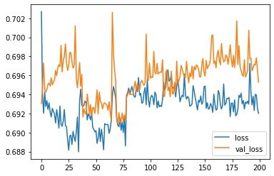

``` python
# Plot the accuracy too
plt.plot(r.history['accuracy'], label='acc')
plt.plot(r.history['val_accuracy'], label='val_acc')
plt.legend()
```

    <matplotlib.legend.Legend at 0x7fec260c87f0>

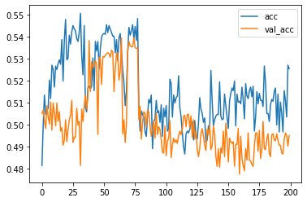

``` python
# Now test our LSTM
inputs = np.expand_dims(X, -1)

# make the RNN
i = Input(shape=(T, D))

# method 1
x = LSTM(5)(i)

x = Dense(1, activation='sigmoid')(x)
model = Model(i, x)
model.compile(
  loss='binary_crossentropy',
  optimizer=Adam(lr=0.01),
  metrics=['accuracy'],
)

# train the RNN
r = model.fit(
  inputs, Y,
  epochs=200,
  validation_split=0.5,
)
```

    Epoch 1/200
    79/79 [==============================] - 1s 10ms/step - loss: 0.6950 - accuracy: 0.5128 - val_loss: 0.6957 - val_accuracy: 0.4920
    Epoch 2/200
    79/79 [==============================] - 0s 6ms/step - loss: 0.6926 - accuracy: 0.5152 - val_loss: 0.6974 - val_accuracy: 0.4920
    Epoch 3/200
    79/79 [==============================] - 1s 6ms/step - loss: 0.6929 - accuracy: 0.5192 - val_loss: 0.6955 - val_accuracy: 0.4916
    Epoch 4/200
    79/79 [==============================] - 1s 7ms/step - loss: 0.6924 - accuracy: 0.5248 - val_loss: 0.6950 - val_accuracy: 0.4952
    Epoch 5/200
    79/79 [==============================] - 1s 6ms/step - loss: 0.6917 - accuracy: 0.5232 - val_loss: 0.6951 - val_accuracy: 0.4948
    Epoch 6/200
    79/79 [==============================] - 1s 7ms/step - loss: 0.6910 - accuracy: 0.5232 - val_loss: 0.6979 - val_accuracy: 0.4968
    Epoch 7/200
    79/79 [==============================] - 1s 6ms/step - loss: 0.6915 - accuracy: 0.5240 - val_loss: 0.6976 - val_accuracy: 0.4952
    Epoch 8/200
    79/79 [==============================] - 1s 6ms/step - loss: 0.6915 - accuracy: 0.5228 - val_loss: 0.6959 - val_accuracy: 0.4944
    Epoch 9/200
    79/79 [==============================] - 1s 7ms/step - loss: 0.6921 - accuracy: 0.5220 - val_loss: 0.6959 - val_accuracy: 0.4952
    Epoch 10/200
    79/79 [==============================] - 1s 7ms/step - loss: 0.6917 - accuracy: 0.5212 - val_loss: 0.6945 - val_accuracy: 0.4984
    Epoch 11/200
    79/79 [==============================] - 1s 7ms/step - loss: 0.6928 - accuracy: 0.5288 - val_loss: 0.6964 - val_accuracy: 0.4948
    Epoch 12/200
    79/79 [==============================] - 1s 6ms/step - loss: 0.6913 - accuracy: 0.5256 - val_loss: 0.6964 - val_accuracy: 0.4980
    Epoch 13/200
    79/79 [==============================] - 1s 7ms/step - loss: 0.6908 - accuracy: 0.5212 - val_loss: 0.6970 - val_accuracy: 0.4976
    Epoch 14/200
    79/79 [==============================] - 1s 6ms/step - loss: 0.6911 - accuracy: 0.5296 - val_loss: 0.6945 - val_accuracy: 0.5048
    Epoch 15/200
    79/79 [==============================] - 1s 7ms/step - loss: 0.6913 - accuracy: 0.5344 - val_loss: 0.6958 - val_accuracy: 0.4952
    Epoch 16/200
    79/79 [==============================] - 0s 6ms/step - loss: 0.6914 - accuracy: 0.5260 - val_loss: 0.6966 - val_accuracy: 0.5020
    Epoch 17/200
    79/79 [==============================] - 1s 7ms/step - loss: 0.6903 - accuracy: 0.5264 - val_loss: 0.6979 - val_accuracy: 0.4964
    Epoch 18/200
    79/79 [==============================] - 1s 6ms/step - loss: 0.6911 - accuracy: 0.5236 - val_loss: 0.6947 - val_accuracy: 0.5028
    Epoch 19/200
    79/79 [==============================] - 1s 7ms/step - loss: 0.6910 - accuracy: 0.5280 - val_loss: 0.6941 - val_accuracy: 0.5076
    Epoch 20/200
    79/79 [==============================] - 1s 6ms/step - loss: 0.6895 - accuracy: 0.5248 - val_loss: 0.6970 - val_accuracy: 0.4944
    Epoch 21/200
    79/79 [==============================] - 1s 7ms/step - loss: 0.6906 - accuracy: 0.5232 - val_loss: 0.6933 - val_accuracy: 0.5184
    Epoch 22/200
    79/79 [==============================] - 1s 9ms/step - loss: 0.6915 - accuracy: 0.5300 - val_loss: 0.6946 - val_accuracy: 0.5040
    Epoch 23/200
    79/79 [==============================] - 1s 6ms/step - loss: 0.6897 - accuracy: 0.5268 - val_loss: 0.6984 - val_accuracy: 0.4928
    Epoch 24/200
    79/79 [==============================] - 1s 6ms/step - loss: 0.6902 - accuracy: 0.5220 - val_loss: 0.6979 - val_accuracy: 0.4928
    Epoch 25/200
    79/79 [==============================] - 1s 6ms/step - loss: 0.6906 - accuracy: 0.5356 - val_loss: 0.6967 - val_accuracy: 0.4996
    Epoch 26/200
    79/79 [==============================] - 0s 6ms/step - loss: 0.6892 - accuracy: 0.5260 - val_loss: 0.6973 - val_accuracy: 0.5056
    Epoch 27/200
    79/79 [==============================] - 1s 6ms/step - loss: 0.6907 - accuracy: 0.5264 - val_loss: 0.6952 - val_accuracy: 0.5012
    Epoch 28/200
    79/79 [==============================] - 1s 6ms/step - loss: 0.6888 - accuracy: 0.5312 - val_loss: 0.6958 - val_accuracy: 0.5036
    Epoch 29/200
    79/79 [==============================] - 1s 7ms/step - loss: 0.6908 - accuracy: 0.5228 - val_loss: 0.6958 - val_accuracy: 0.4976
    Epoch 30/200
    79/79 [==============================] - 1s 7ms/step - loss: 0.6903 - accuracy: 0.5180 - val_loss: 0.6970 - val_accuracy: 0.5072
    Epoch 31/200
    79/79 [==============================] - 1s 6ms/step - loss: 0.6903 - accuracy: 0.5264 - val_loss: 0.6950 - val_accuracy: 0.5020
    Epoch 32/200
    79/79 [==============================] - 1s 6ms/step - loss: 0.6912 - accuracy: 0.5392 - val_loss: 0.6963 - val_accuracy: 0.4960
    Epoch 33/200
    79/79 [==============================] - 1s 6ms/step - loss: 0.6904 - accuracy: 0.5352 - val_loss: 0.6961 - val_accuracy: 0.4952
    Epoch 34/200
    79/79 [==============================] - 0s 6ms/step - loss: 0.6913 - accuracy: 0.5300 - val_loss: 0.6978 - val_accuracy: 0.4980
    Epoch 35/200
    79/79 [==============================] - 1s 6ms/step - loss: 0.6911 - accuracy: 0.5424 - val_loss: 0.6949 - val_accuracy: 0.4928
    Epoch 36/200
    79/79 [==============================] - 1s 7ms/step - loss: 0.6895 - accuracy: 0.5336 - val_loss: 0.6994 - val_accuracy: 0.4976
    Epoch 37/200
    79/79 [==============================] - 1s 7ms/step - loss: 0.6898 - accuracy: 0.5392 - val_loss: 0.7006 - val_accuracy: 0.4932
    Epoch 38/200
    79/79 [==============================] - 0s 6ms/step - loss: 0.6908 - accuracy: 0.5372 - val_loss: 0.6993 - val_accuracy: 0.4900
    Epoch 39/200
    79/79 [==============================] - 1s 6ms/step - loss: 0.6898 - accuracy: 0.5380 - val_loss: 0.6987 - val_accuracy: 0.4912
    Epoch 40/200
    79/79 [==============================] - 1s 6ms/step - loss: 0.6903 - accuracy: 0.5412 - val_loss: 0.6995 - val_accuracy: 0.4960
    Epoch 41/200
    79/79 [==============================] - 1s 7ms/step - loss: 0.6909 - accuracy: 0.5336 - val_loss: 0.6954 - val_accuracy: 0.5040
    Epoch 42/200
    79/79 [==============================] - 1s 6ms/step - loss: 0.6917 - accuracy: 0.5352 - val_loss: 0.7014 - val_accuracy: 0.4920
    Epoch 43/200
    79/79 [==============================] - 0s 6ms/step - loss: 0.6893 - accuracy: 0.5476 - val_loss: 0.6988 - val_accuracy: 0.4920
    Epoch 44/200
    79/79 [==============================] - 1s 6ms/step - loss: 0.6890 - accuracy: 0.5420 - val_loss: 0.7003 - val_accuracy: 0.4876
    Epoch 45/200
    79/79 [==============================] - 1s 6ms/step - loss: 0.6883 - accuracy: 0.5484 - val_loss: 0.7000 - val_accuracy: 0.4900
    Epoch 46/200
    79/79 [==============================] - 1s 6ms/step - loss: 0.6871 - accuracy: 0.5492 - val_loss: 0.7006 - val_accuracy: 0.4912
    Epoch 47/200
    79/79 [==============================] - 1s 6ms/step - loss: 0.6870 - accuracy: 0.5580 - val_loss: 0.7034 - val_accuracy: 0.4868
    Epoch 48/200
    79/79 [==============================] - 0s 6ms/step - loss: 0.6869 - accuracy: 0.5492 - val_loss: 0.7030 - val_accuracy: 0.4868
    Epoch 49/200
    79/79 [==============================] - 0s 6ms/step - loss: 0.6855 - accuracy: 0.5504 - val_loss: 0.7034 - val_accuracy: 0.4988
    Epoch 50/200
    79/79 [==============================] - 1s 7ms/step - loss: 0.6852 - accuracy: 0.5448 - val_loss: 0.7031 - val_accuracy: 0.4992
    Epoch 51/200
    79/79 [==============================] - 0s 6ms/step - loss: 0.6874 - accuracy: 0.5544 - val_loss: 0.7023 - val_accuracy: 0.4940
    Epoch 52/200
    79/79 [==============================] - 1s 6ms/step - loss: 0.6857 - accuracy: 0.5536 - val_loss: 0.7048 - val_accuracy: 0.4868
    Epoch 53/200
    79/79 [==============================] - 0s 6ms/step - loss: 0.6847 - accuracy: 0.5608 - val_loss: 0.7034 - val_accuracy: 0.4828
    Epoch 54/200
    79/79 [==============================] - 1s 6ms/step - loss: 0.6851 - accuracy: 0.5548 - val_loss: 0.7062 - val_accuracy: 0.4940
    Epoch 55/200
    79/79 [==============================] - 0s 6ms/step - loss: 0.6853 - accuracy: 0.5564 - val_loss: 0.7041 - val_accuracy: 0.4964
    Epoch 56/200
    79/79 [==============================] - 1s 7ms/step - loss: 0.6812 - accuracy: 0.5648 - val_loss: 0.7075 - val_accuracy: 0.4884
    Epoch 57/200
    79/79 [==============================] - 1s 6ms/step - loss: 0.6835 - accuracy: 0.5684 - val_loss: 0.7108 - val_accuracy: 0.4896
    Epoch 58/200
    79/79 [==============================] - 1s 6ms/step - loss: 0.6863 - accuracy: 0.5604 - val_loss: 0.7074 - val_accuracy: 0.4996
    Epoch 59/200
    79/79 [==============================] - 0s 6ms/step - loss: 0.6879 - accuracy: 0.5484 - val_loss: 0.7055 - val_accuracy: 0.4880
    Epoch 60/200
    79/79 [==============================] - 1s 6ms/step - loss: 0.6865 - accuracy: 0.5476 - val_loss: 0.7043 - val_accuracy: 0.4912
    Epoch 61/200
    79/79 [==============================] - 0s 6ms/step - loss: 0.6833 - accuracy: 0.5628 - val_loss: 0.7042 - val_accuracy: 0.4972
    Epoch 62/200
    79/79 [==============================] - 1s 6ms/step - loss: 0.6821 - accuracy: 0.5628 - val_loss: 0.7035 - val_accuracy: 0.4888
    Epoch 63/200
    79/79 [==============================] - 0s 6ms/step - loss: 0.6825 - accuracy: 0.5600 - val_loss: 0.7084 - val_accuracy: 0.4936
    Epoch 64/200
    79/79 [==============================] - 1s 7ms/step - loss: 0.6828 - accuracy: 0.5652 - val_loss: 0.7069 - val_accuracy: 0.4880
    Epoch 65/200
    79/79 [==============================] - 1s 6ms/step - loss: 0.6809 - accuracy: 0.5664 - val_loss: 0.7080 - val_accuracy: 0.4972
    Epoch 66/200
    79/79 [==============================] - 0s 6ms/step - loss: 0.6824 - accuracy: 0.5536 - val_loss: 0.7075 - val_accuracy: 0.4940
    Epoch 67/200
    79/79 [==============================] - 0s 6ms/step - loss: 0.6819 - accuracy: 0.5640 - val_loss: 0.7092 - val_accuracy: 0.4956
    Epoch 68/200
    79/79 [==============================] - 1s 7ms/step - loss: 0.6825 - accuracy: 0.5644 - val_loss: 0.7102 - val_accuracy: 0.5000
    Epoch 69/200
    79/79 [==============================] - 0s 6ms/step - loss: 0.6798 - accuracy: 0.5692 - val_loss: 0.7109 - val_accuracy: 0.4916
    Epoch 70/200
    79/79 [==============================] - 1s 6ms/step - loss: 0.6840 - accuracy: 0.5624 - val_loss: 0.7090 - val_accuracy: 0.5016
    Epoch 71/200
    79/79 [==============================] - 1s 6ms/step - loss: 0.6847 - accuracy: 0.5580 - val_loss: 0.7095 - val_accuracy: 0.4928
    Epoch 72/200
    79/79 [==============================] - 1s 7ms/step - loss: 0.6828 - accuracy: 0.5640 - val_loss: 0.7064 - val_accuracy: 0.4980
    Epoch 73/200
    79/79 [==============================] - 1s 6ms/step - loss: 0.6808 - accuracy: 0.5680 - val_loss: 0.7112 - val_accuracy: 0.4912
    Epoch 74/200
    79/79 [==============================] - 1s 6ms/step - loss: 0.6827 - accuracy: 0.5624 - val_loss: 0.7086 - val_accuracy: 0.4960
    Epoch 75/200
    79/79 [==============================] - 0s 6ms/step - loss: 0.6865 - accuracy: 0.5500 - val_loss: 0.7074 - val_accuracy: 0.4996
    Epoch 76/200
    79/79 [==============================] - 1s 6ms/step - loss: 0.6852 - accuracy: 0.5508 - val_loss: 0.7075 - val_accuracy: 0.4856
    Epoch 77/200
    79/79 [==============================] - 1s 6ms/step - loss: 0.6807 - accuracy: 0.5648 - val_loss: 0.7109 - val_accuracy: 0.4880
    Epoch 78/200
    79/79 [==============================] - 1s 6ms/step - loss: 0.6812 - accuracy: 0.5656 - val_loss: 0.7070 - val_accuracy: 0.4960
    Epoch 79/200
    79/79 [==============================] - 1s 7ms/step - loss: 0.6792 - accuracy: 0.5696 - val_loss: 0.7127 - val_accuracy: 0.4900
    Epoch 80/200
    79/79 [==============================] - 1s 6ms/step - loss: 0.6843 - accuracy: 0.5616 - val_loss: 0.7108 - val_accuracy: 0.5008
    Epoch 81/200
    79/79 [==============================] - 1s 7ms/step - loss: 0.6813 - accuracy: 0.5672 - val_loss: 0.7063 - val_accuracy: 0.5052
    Epoch 82/200
    79/79 [==============================] - 1s 6ms/step - loss: 0.6851 - accuracy: 0.5524 - val_loss: 0.7084 - val_accuracy: 0.4928
    Epoch 83/200
    79/79 [==============================] - 1s 6ms/step - loss: 0.6839 - accuracy: 0.5564 - val_loss: 0.7019 - val_accuracy: 0.4904
    Epoch 84/200
    79/79 [==============================] - 1s 6ms/step - loss: 0.6914 - accuracy: 0.5332 - val_loss: 0.6978 - val_accuracy: 0.4976
    Epoch 85/200
    79/79 [==============================] - 0s 6ms/step - loss: 0.6913 - accuracy: 0.5312 - val_loss: 0.6962 - val_accuracy: 0.4892
    Epoch 86/200
    79/79 [==============================] - 1s 6ms/step - loss: 0.6908 - accuracy: 0.5304 - val_loss: 0.6967 - val_accuracy: 0.4964
    Epoch 87/200
    79/79 [==============================] - 1s 6ms/step - loss: 0.6916 - accuracy: 0.5272 - val_loss: 0.7025 - val_accuracy: 0.4876
    Epoch 88/200
    79/79 [==============================] - 1s 6ms/step - loss: 0.6898 - accuracy: 0.5372 - val_loss: 0.7023 - val_accuracy: 0.4896
    Epoch 89/200
    79/79 [==============================] - 1s 6ms/step - loss: 0.6843 - accuracy: 0.5424 - val_loss: 0.7034 - val_accuracy: 0.4896
    Epoch 90/200
    79/79 [==============================] - 1s 6ms/step - loss: 0.6820 - accuracy: 0.5524 - val_loss: 0.7054 - val_accuracy: 0.4904
    Epoch 91/200
    79/79 [==============================] - 1s 6ms/step - loss: 0.6838 - accuracy: 0.5628 - val_loss: 0.7118 - val_accuracy: 0.4940
    Epoch 92/200
    79/79 [==============================] - 1s 7ms/step - loss: 0.6814 - accuracy: 0.5612 - val_loss: 0.7041 - val_accuracy: 0.4948
    Epoch 93/200
    79/79 [==============================] - 1s 6ms/step - loss: 0.6815 - accuracy: 0.5548 - val_loss: 0.7158 - val_accuracy: 0.4928
    Epoch 94/200
    79/79 [==============================] - 1s 6ms/step - loss: 0.6828 - accuracy: 0.5540 - val_loss: 0.7145 - val_accuracy: 0.4968
    Epoch 95/200
    79/79 [==============================] - 1s 7ms/step - loss: 0.6817 - accuracy: 0.5660 - val_loss: 0.7119 - val_accuracy: 0.4988
    Epoch 96/200
    79/79 [==============================] - 0s 6ms/step - loss: 0.6814 - accuracy: 0.5616 - val_loss: 0.7085 - val_accuracy: 0.4924
    Epoch 97/200
    79/79 [==============================] - 1s 6ms/step - loss: 0.6783 - accuracy: 0.5660 - val_loss: 0.7101 - val_accuracy: 0.4836
    Epoch 98/200
    79/79 [==============================] - 1s 7ms/step - loss: 0.6785 - accuracy: 0.5740 - val_loss: 0.7114 - val_accuracy: 0.4920
    Epoch 99/200
    79/79 [==============================] - 1s 6ms/step - loss: 0.6781 - accuracy: 0.5732 - val_loss: 0.7108 - val_accuracy: 0.5024
    Epoch 100/200
    79/79 [==============================] - 1s 7ms/step - loss: 0.6798 - accuracy: 0.5660 - val_loss: 0.7075 - val_accuracy: 0.5036
    Epoch 101/200
    79/79 [==============================] - 1s 6ms/step - loss: 0.6772 - accuracy: 0.5716 - val_loss: 0.7097 - val_accuracy: 0.5076
    Epoch 102/200
    79/79 [==============================] - 1s 7ms/step - loss: 0.6769 - accuracy: 0.5672 - val_loss: 0.7078 - val_accuracy: 0.4948
    Epoch 103/200
    79/79 [==============================] - 1s 7ms/step - loss: 0.6770 - accuracy: 0.5756 - val_loss: 0.7110 - val_accuracy: 0.4924
    Epoch 104/200
    79/79 [==============================] - 1s 7ms/step - loss: 0.6851 - accuracy: 0.5656 - val_loss: 0.7182 - val_accuracy: 0.4900
    Epoch 105/200
    79/79 [==============================] - 1s 6ms/step - loss: 0.6867 - accuracy: 0.5504 - val_loss: 0.7089 - val_accuracy: 0.4904
    Epoch 106/200
    79/79 [==============================] - 1s 7ms/step - loss: 0.6828 - accuracy: 0.5616 - val_loss: 0.7127 - val_accuracy: 0.4940
    Epoch 107/200
    79/79 [==============================] - 0s 6ms/step - loss: 0.6832 - accuracy: 0.5604 - val_loss: 0.7105 - val_accuracy: 0.4936
    Epoch 108/200
    79/79 [==============================] - 1s 6ms/step - loss: 0.6829 - accuracy: 0.5648 - val_loss: 0.7085 - val_accuracy: 0.5072
    Epoch 109/200
    79/79 [==============================] - 1s 6ms/step - loss: 0.6809 - accuracy: 0.5544 - val_loss: 0.7111 - val_accuracy: 0.4932
    Epoch 110/200
    79/79 [==============================] - 1s 7ms/step - loss: 0.6786 - accuracy: 0.5724 - val_loss: 0.7088 - val_accuracy: 0.5012
    Epoch 111/200
    79/79 [==============================] - 0s 6ms/step - loss: 0.6811 - accuracy: 0.5664 - val_loss: 0.7108 - val_accuracy: 0.5048
    Epoch 112/200
    79/79 [==============================] - 1s 7ms/step - loss: 0.6837 - accuracy: 0.5660 - val_loss: 0.7079 - val_accuracy: 0.4864
    Epoch 113/200
    79/79 [==============================] - 0s 6ms/step - loss: 0.6769 - accuracy: 0.5636 - val_loss: 0.7140 - val_accuracy: 0.4952
    Epoch 114/200
    79/79 [==============================] - 1s 7ms/step - loss: 0.6745 - accuracy: 0.5728 - val_loss: 0.7131 - val_accuracy: 0.4852
    Epoch 115/200
    79/79 [==============================] - 1s 6ms/step - loss: 0.6784 - accuracy: 0.5720 - val_loss: 0.7142 - val_accuracy: 0.4932
    Epoch 116/200
    79/79 [==============================] - 1s 7ms/step - loss: 0.6758 - accuracy: 0.5760 - val_loss: 0.7186 - val_accuracy: 0.4848
    Epoch 117/200
    79/79 [==============================] - 0s 6ms/step - loss: 0.6799 - accuracy: 0.5664 - val_loss: 0.7121 - val_accuracy: 0.5036
    Epoch 118/200
    79/79 [==============================] - 1s 7ms/step - loss: 0.6773 - accuracy: 0.5712 - val_loss: 0.7136 - val_accuracy: 0.4928
    Epoch 119/200
    79/79 [==============================] - 1s 6ms/step - loss: 0.6805 - accuracy: 0.5564 - val_loss: 0.7085 - val_accuracy: 0.4932
    Epoch 120/200
    79/79 [==============================] - 1s 6ms/step - loss: 0.6805 - accuracy: 0.5696 - val_loss: 0.7131 - val_accuracy: 0.4940
    Epoch 121/200
    79/79 [==============================] - 0s 6ms/step - loss: 0.6741 - accuracy: 0.5768 - val_loss: 0.7176 - val_accuracy: 0.4932
    Epoch 122/200
    79/79 [==============================] - 1s 6ms/step - loss: 0.6787 - accuracy: 0.5628 - val_loss: 0.7120 - val_accuracy: 0.5040
    Epoch 123/200
    79/79 [==============================] - 0s 6ms/step - loss: 0.6794 - accuracy: 0.5704 - val_loss: 0.7113 - val_accuracy: 0.4804
    Epoch 124/200
    79/79 [==============================] - 0s 6ms/step - loss: 0.6757 - accuracy: 0.5660 - val_loss: 0.7138 - val_accuracy: 0.4992
    Epoch 125/200
    79/79 [==============================] - 0s 6ms/step - loss: 0.6780 - accuracy: 0.5732 - val_loss: 0.7164 - val_accuracy: 0.4828
    Epoch 126/200
    79/79 [==============================] - 1s 6ms/step - loss: 0.6807 - accuracy: 0.5684 - val_loss: 0.7191 - val_accuracy: 0.5000
    Epoch 127/200
    79/79 [==============================] - 0s 6ms/step - loss: 0.6875 - accuracy: 0.5444 - val_loss: 0.7013 - val_accuracy: 0.4972
    Epoch 128/200
    79/79 [==============================] - 1s 6ms/step - loss: 0.6853 - accuracy: 0.5520 - val_loss: 0.7029 - val_accuracy: 0.4948
    Epoch 129/200
    79/79 [==============================] - 0s 6ms/step - loss: 0.6843 - accuracy: 0.5580 - val_loss: 0.7058 - val_accuracy: 0.4928
    Epoch 130/200
    79/79 [==============================] - 1s 7ms/step - loss: 0.6816 - accuracy: 0.5588 - val_loss: 0.7081 - val_accuracy: 0.4976
    Epoch 131/200
    79/79 [==============================] - 0s 6ms/step - loss: 0.6789 - accuracy: 0.5708 - val_loss: 0.7078 - val_accuracy: 0.4968
    Epoch 132/200
    79/79 [==============================] - 1s 7ms/step - loss: 0.6753 - accuracy: 0.5728 - val_loss: 0.7179 - val_accuracy: 0.5016
    Epoch 133/200
    79/79 [==============================] - 1s 7ms/step - loss: 0.6739 - accuracy: 0.5764 - val_loss: 0.7149 - val_accuracy: 0.4844
    Epoch 134/200
    79/79 [==============================] - 1s 6ms/step - loss: 0.6778 - accuracy: 0.5736 - val_loss: 0.7147 - val_accuracy: 0.4948
    Epoch 135/200
    79/79 [==============================] - 0s 6ms/step - loss: 0.6738 - accuracy: 0.5780 - val_loss: 0.7169 - val_accuracy: 0.4920
    Epoch 136/200
    79/79 [==============================] - 0s 6ms/step - loss: 0.6772 - accuracy: 0.5724 - val_loss: 0.7114 - val_accuracy: 0.4948
    Epoch 137/200
    79/79 [==============================] - 1s 6ms/step - loss: 0.6768 - accuracy: 0.5712 - val_loss: 0.7168 - val_accuracy: 0.4920
    Epoch 138/200
    79/79 [==============================] - 0s 6ms/step - loss: 0.6744 - accuracy: 0.5664 - val_loss: 0.7164 - val_accuracy: 0.4912
    Epoch 139/200
    79/79 [==============================] - 1s 7ms/step - loss: 0.6806 - accuracy: 0.5696 - val_loss: 0.7174 - val_accuracy: 0.4876
    Epoch 140/200
    79/79 [==============================] - 0s 6ms/step - loss: 0.6798 - accuracy: 0.5688 - val_loss: 0.7134 - val_accuracy: 0.4912
    Epoch 141/200
    79/79 [==============================] - 0s 6ms/step - loss: 0.6789 - accuracy: 0.5668 - val_loss: 0.7169 - val_accuracy: 0.4884
    Epoch 142/200
    79/79 [==============================] - 1s 7ms/step - loss: 0.6832 - accuracy: 0.5728 - val_loss: 0.7132 - val_accuracy: 0.4864
    Epoch 143/200
    79/79 [==============================] - 1s 6ms/step - loss: 0.6819 - accuracy: 0.5568 - val_loss: 0.7127 - val_accuracy: 0.4908
    Epoch 144/200
    79/79 [==============================] - 0s 6ms/step - loss: 0.6875 - accuracy: 0.5420 - val_loss: 0.7054 - val_accuracy: 0.4872
    Epoch 145/200
    79/79 [==============================] - 1s 6ms/step - loss: 0.6829 - accuracy: 0.5488 - val_loss: 0.7082 - val_accuracy: 0.4840
    Epoch 146/200
    79/79 [==============================] - 1s 6ms/step - loss: 0.6781 - accuracy: 0.5668 - val_loss: 0.7158 - val_accuracy: 0.4892
    Epoch 147/200
    79/79 [==============================] - 0s 6ms/step - loss: 0.6786 - accuracy: 0.5696 - val_loss: 0.7123 - val_accuracy: 0.4840
    Epoch 148/200
    79/79 [==============================] - 1s 6ms/step - loss: 0.6804 - accuracy: 0.5632 - val_loss: 0.7165 - val_accuracy: 0.4936
    Epoch 149/200
    79/79 [==============================] - 1s 7ms/step - loss: 0.6764 - accuracy: 0.5764 - val_loss: 0.7140 - val_accuracy: 0.4896
    Epoch 150/200
    79/79 [==============================] - 1s 6ms/step - loss: 0.6780 - accuracy: 0.5700 - val_loss: 0.7158 - val_accuracy: 0.4940
    Epoch 151/200
    79/79 [==============================] - 1s 6ms/step - loss: 0.6779 - accuracy: 0.5720 - val_loss: 0.7150 - val_accuracy: 0.4940
    Epoch 152/200
    79/79 [==============================] - 1s 6ms/step - loss: 0.6754 - accuracy: 0.5696 - val_loss: 0.7141 - val_accuracy: 0.4920
    Epoch 153/200
    79/79 [==============================] - 1s 6ms/step - loss: 0.6744 - accuracy: 0.5748 - val_loss: 0.7144 - val_accuracy: 0.4956
    Epoch 154/200
    79/79 [==============================] - 0s 6ms/step - loss: 0.6754 - accuracy: 0.5728 - val_loss: 0.7138 - val_accuracy: 0.4996
    Epoch 155/200
    79/79 [==============================] - 1s 7ms/step - loss: 0.6763 - accuracy: 0.5736 - val_loss: 0.7185 - val_accuracy: 0.4948
    Epoch 156/200
    79/79 [==============================] - 0s 6ms/step - loss: 0.6787 - accuracy: 0.5664 - val_loss: 0.7184 - val_accuracy: 0.4964
    Epoch 157/200
    79/79 [==============================] - 1s 6ms/step - loss: 0.6756 - accuracy: 0.5700 - val_loss: 0.7147 - val_accuracy: 0.4976
    Epoch 158/200
    79/79 [==============================] - 1s 7ms/step - loss: 0.6770 - accuracy: 0.5720 - val_loss: 0.7144 - val_accuracy: 0.5036
    Epoch 159/200
    79/79 [==============================] - 1s 7ms/step - loss: 0.6740 - accuracy: 0.5744 - val_loss: 0.7171 - val_accuracy: 0.4924
    Epoch 160/200
    79/79 [==============================] - 1s 7ms/step - loss: 0.6726 - accuracy: 0.5796 - val_loss: 0.7143 - val_accuracy: 0.5036
    Epoch 161/200
    79/79 [==============================] - 1s 7ms/step - loss: 0.6801 - accuracy: 0.5696 - val_loss: 0.7124 - val_accuracy: 0.5004
    Epoch 162/200
    79/79 [==============================] - 1s 6ms/step - loss: 0.6783 - accuracy: 0.5664 - val_loss: 0.7123 - val_accuracy: 0.4916
    Epoch 163/200
    79/79 [==============================] - 1s 7ms/step - loss: 0.6739 - accuracy: 0.5740 - val_loss: 0.7151 - val_accuracy: 0.5008
    Epoch 164/200
    79/79 [==============================] - 1s 6ms/step - loss: 0.6759 - accuracy: 0.5708 - val_loss: 0.7175 - val_accuracy: 0.4952
    Epoch 165/200
    79/79 [==============================] - 1s 7ms/step - loss: 0.6760 - accuracy: 0.5756 - val_loss: 0.7178 - val_accuracy: 0.4952
    Epoch 166/200
    79/79 [==============================] - 1s 6ms/step - loss: 0.6767 - accuracy: 0.5712 - val_loss: 0.7180 - val_accuracy: 0.4896
    Epoch 167/200
    79/79 [==============================] - 1s 7ms/step - loss: 0.6779 - accuracy: 0.5812 - val_loss: 0.7132 - val_accuracy: 0.5048
    Epoch 168/200
    79/79 [==============================] - 1s 6ms/step - loss: 0.6794 - accuracy: 0.5560 - val_loss: 0.7107 - val_accuracy: 0.4932
    Epoch 169/200
    79/79 [==============================] - 1s 7ms/step - loss: 0.6743 - accuracy: 0.5752 - val_loss: 0.7113 - val_accuracy: 0.4936
    Epoch 170/200
    79/79 [==============================] - 1s 7ms/step - loss: 0.6805 - accuracy: 0.5592 - val_loss: 0.7030 - val_accuracy: 0.4968
    Epoch 171/200
    79/79 [==============================] - 1s 7ms/step - loss: 0.6835 - accuracy: 0.5532 - val_loss: 0.7062 - val_accuracy: 0.4908
    Epoch 172/200
    79/79 [==============================] - 1s 6ms/step - loss: 0.6796 - accuracy: 0.5536 - val_loss: 0.7065 - val_accuracy: 0.4956
    Epoch 173/200
    79/79 [==============================] - 1s 7ms/step - loss: 0.6781 - accuracy: 0.5632 - val_loss: 0.7105 - val_accuracy: 0.4988
    Epoch 174/200
    79/79 [==============================] - 1s 6ms/step - loss: 0.6777 - accuracy: 0.5668 - val_loss: 0.7129 - val_accuracy: 0.4916
    Epoch 175/200
    79/79 [==============================] - 1s 7ms/step - loss: 0.6781 - accuracy: 0.5560 - val_loss: 0.7157 - val_accuracy: 0.4956
    Epoch 176/200
    79/79 [==============================] - 1s 7ms/step - loss: 0.6735 - accuracy: 0.5756 - val_loss: 0.7128 - val_accuracy: 0.4848
    Epoch 177/200
    79/79 [==============================] - 1s 7ms/step - loss: 0.6764 - accuracy: 0.5776 - val_loss: 0.7170 - val_accuracy: 0.4972
    Epoch 178/200
    79/79 [==============================] - 1s 6ms/step - loss: 0.6800 - accuracy: 0.5668 - val_loss: 0.7169 - val_accuracy: 0.4964
    Epoch 179/200
    79/79 [==============================] - 1s 6ms/step - loss: 0.6730 - accuracy: 0.5804 - val_loss: 0.7211 - val_accuracy: 0.4944
    Epoch 180/200
    79/79 [==============================] - 0s 6ms/step - loss: 0.6750 - accuracy: 0.5796 - val_loss: 0.7169 - val_accuracy: 0.4928
    Epoch 181/200
    79/79 [==============================] - 1s 6ms/step - loss: 0.6766 - accuracy: 0.5712 - val_loss: 0.7121 - val_accuracy: 0.4884
    Epoch 182/200
    79/79 [==============================] - 1s 6ms/step - loss: 0.6724 - accuracy: 0.5820 - val_loss: 0.7210 - val_accuracy: 0.4832
    Epoch 183/200
    79/79 [==============================] - 1s 7ms/step - loss: 0.6677 - accuracy: 0.5844 - val_loss: 0.7196 - val_accuracy: 0.4900
    Epoch 184/200
    79/79 [==============================] - 0s 6ms/step - loss: 0.6702 - accuracy: 0.5776 - val_loss: 0.7210 - val_accuracy: 0.4912
    Epoch 185/200
    79/79 [==============================] - 0s 6ms/step - loss: 0.6717 - accuracy: 0.5808 - val_loss: 0.7222 - val_accuracy: 0.4828
    Epoch 186/200
    79/79 [==============================] - 0s 6ms/step - loss: 0.6698 - accuracy: 0.5836 - val_loss: 0.7229 - val_accuracy: 0.5016
    Epoch 187/200
    79/79 [==============================] - 1s 6ms/step - loss: 0.6737 - accuracy: 0.5796 - val_loss: 0.7133 - val_accuracy: 0.4928
    Epoch 188/200
    79/79 [==============================] - 0s 6ms/step - loss: 0.6708 - accuracy: 0.5784 - val_loss: 0.7147 - val_accuracy: 0.4884
    Epoch 189/200
    79/79 [==============================] - 0s 6ms/step - loss: 0.6691 - accuracy: 0.5688 - val_loss: 0.7199 - val_accuracy: 0.4948
    Epoch 190/200
    79/79 [==============================] - 1s 6ms/step - loss: 0.6674 - accuracy: 0.5800 - val_loss: 0.7200 - val_accuracy: 0.4912
    Epoch 191/200
    79/79 [==============================] - 1s 6ms/step - loss: 0.6714 - accuracy: 0.5800 - val_loss: 0.7199 - val_accuracy: 0.4880
    Epoch 192/200
    79/79 [==============================] - 0s 6ms/step - loss: 0.6718 - accuracy: 0.5776 - val_loss: 0.7248 - val_accuracy: 0.4900
    Epoch 193/200
    79/79 [==============================] - 1s 6ms/step - loss: 0.6680 - accuracy: 0.5828 - val_loss: 0.7194 - val_accuracy: 0.4928
    Epoch 194/200
    79/79 [==============================] - 1s 6ms/step - loss: 0.6706 - accuracy: 0.5704 - val_loss: 0.7193 - val_accuracy: 0.4980
    Epoch 195/200
    79/79 [==============================] - 0s 6ms/step - loss: 0.6704 - accuracy: 0.5712 - val_loss: 0.7215 - val_accuracy: 0.4984
    Epoch 196/200
    79/79 [==============================] - 1s 7ms/step - loss: 0.6731 - accuracy: 0.5708 - val_loss: 0.7238 - val_accuracy: 0.4948
    Epoch 197/200
    79/79 [==============================] - 0s 6ms/step - loss: 0.6682 - accuracy: 0.5788 - val_loss: 0.7185 - val_accuracy: 0.4968
    Epoch 198/200
    79/79 [==============================] - 1s 6ms/step - loss: 0.6705 - accuracy: 0.5724 - val_loss: 0.7211 - val_accuracy: 0.4916
    Epoch 199/200
    79/79 [==============================] - 0s 6ms/step - loss: 0.6686 - accuracy: 0.5800 - val_loss: 0.7203 - val_accuracy: 0.5032
    Epoch 200/200
    79/79 [==============================] - 1s 6ms/step - loss: 0.6706 - accuracy: 0.5860 - val_loss: 0.7207 - val_accuracy: 0.5036

``` python
# Plot the loss
plt.plot(r.history['loss'], label='loss')
plt.plot(r.history['val_loss'], label='val_loss')
plt.legend()
```

    <matplotlib.legend.Legend at 0x7fec1fc08f60>

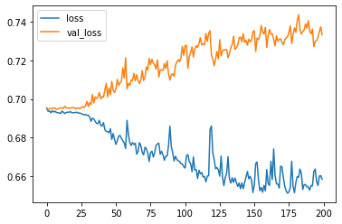

``` python
# Plot the accuracy too
plt.plot(r.history['accuracy'], label='acc')
plt.plot(r.history['val_accuracy'], label='val_acc')
plt.legend()
```

    <matplotlib.legend.Legend at 0x7fec1f79cc50>

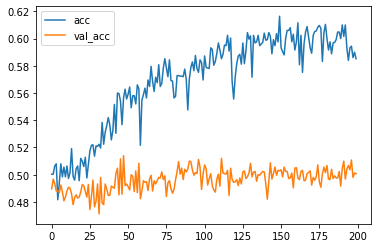

``` python
# Now test our GRU
inputs = np.expand_dims(X, -1)

# make the RNN
i = Input(shape=(T, D))

# method 1
x = GRU(5)(i)

x = Dense(1, activation='sigmoid')(x)
model = Model(i, x)
model.compile(
  loss='binary_crossentropy',
  optimizer=Adam(lr=0.01),
  metrics=['accuracy'],
)

# train the RNN
r = model.fit(
  inputs, Y,
  epochs=400,
  validation_split=0.5,
)
```

    Epoch 1/400
    79/79 [==============================] - 1s 9ms/step - loss: 0.6950 - accuracy: 0.4860 - val_loss: 0.6950 - val_accuracy: 0.4904
    Epoch 2/400
    79/79 [==============================] - 0s 6ms/step - loss: 0.6942 - accuracy: 0.5080 - val_loss: 0.6976 - val_accuracy: 0.4940
    Epoch 3/400
    79/79 [==============================] - 0s 6ms/step - loss: 0.6943 - accuracy: 0.5056 - val_loss: 0.6958 - val_accuracy: 0.4956
    Epoch 4/400
    79/79 [==============================] - 0s 6ms/step - loss: 0.6938 - accuracy: 0.4996 - val_loss: 0.6962 - val_accuracy: 0.4996
    Epoch 5/400
    79/79 [==============================] - 0s 6ms/step - loss: 0.6933 - accuracy: 0.5180 - val_loss: 0.6959 - val_accuracy: 0.4964
    Epoch 6/400
    79/79 [==============================] - 0s 6ms/step - loss: 0.6939 - accuracy: 0.4900 - val_loss: 0.6958 - val_accuracy: 0.4916
    Epoch 7/400
    79/79 [==============================] - 0s 6ms/step - loss: 0.6939 - accuracy: 0.4936 - val_loss: 0.6952 - val_accuracy: 0.4928
    Epoch 8/400
    79/79 [==============================] - 0s 6ms/step - loss: 0.6934 - accuracy: 0.4980 - val_loss: 0.6952 - val_accuracy: 0.4920
    Epoch 9/400
    79/79 [==============================] - 0s 6ms/step - loss: 0.6933 - accuracy: 0.4936 - val_loss: 0.6950 - val_accuracy: 0.4868
    Epoch 10/400
    79/79 [==============================] - 0s 6ms/step - loss: 0.6936 - accuracy: 0.5080 - val_loss: 0.6955 - val_accuracy: 0.4892
    Epoch 11/400
    79/79 [==============================] - 0s 6ms/step - loss: 0.6934 - accuracy: 0.4944 - val_loss: 0.6948 - val_accuracy: 0.4908
    Epoch 12/400
    79/79 [==============================] - 0s 6ms/step - loss: 0.6935 - accuracy: 0.5056 - val_loss: 0.6948 - val_accuracy: 0.4904
    Epoch 13/400
    79/79 [==============================] - 0s 6ms/step - loss: 0.6940 - accuracy: 0.5032 - val_loss: 0.6946 - val_accuracy: 0.4848
    Epoch 14/400
    79/79 [==============================] - 0s 6ms/step - loss: 0.6930 - accuracy: 0.5016 - val_loss: 0.6954 - val_accuracy: 0.4940
    Epoch 15/400
    79/79 [==============================] - 0s 6ms/step - loss: 0.6932 - accuracy: 0.4996 - val_loss: 0.6945 - val_accuracy: 0.4880
    Epoch 16/400
    79/79 [==============================] - 0s 6ms/step - loss: 0.6933 - accuracy: 0.5044 - val_loss: 0.6948 - val_accuracy: 0.4868
    Epoch 17/400
    79/79 [==============================] - 0s 6ms/step - loss: 0.6938 - accuracy: 0.4896 - val_loss: 0.6953 - val_accuracy: 0.4852
    Epoch 18/400
    79/79 [==============================] - 0s 6ms/step - loss: 0.6927 - accuracy: 0.5164 - val_loss: 0.6951 - val_accuracy: 0.4920
    Epoch 19/400
    79/79 [==============================] - 0s 6ms/step - loss: 0.6928 - accuracy: 0.5092 - val_loss: 0.6952 - val_accuracy: 0.4888
    Epoch 20/400
    79/79 [==============================] - 0s 6ms/step - loss: 0.6929 - accuracy: 0.5172 - val_loss: 0.6958 - val_accuracy: 0.4904
    Epoch 21/400
    79/79 [==============================] - 0s 6ms/step - loss: 0.6924 - accuracy: 0.5132 - val_loss: 0.6953 - val_accuracy: 0.4876
    Epoch 22/400
    79/79 [==============================] - 0s 6ms/step - loss: 0.6923 - accuracy: 0.5124 - val_loss: 0.6958 - val_accuracy: 0.4812
    Epoch 23/400
    79/79 [==============================] - 0s 6ms/step - loss: 0.6922 - accuracy: 0.5084 - val_loss: 0.6968 - val_accuracy: 0.4844
    Epoch 24/400
    79/79 [==============================] - 0s 6ms/step - loss: 0.6912 - accuracy: 0.5188 - val_loss: 0.6979 - val_accuracy: 0.4936
    Epoch 25/400
    79/79 [==============================] - 0s 6ms/step - loss: 0.6936 - accuracy: 0.5180 - val_loss: 0.6977 - val_accuracy: 0.4884
    Epoch 26/400
    79/79 [==============================] - 0s 6ms/step - loss: 0.6922 - accuracy: 0.5224 - val_loss: 0.6965 - val_accuracy: 0.5000
    Epoch 27/400
    79/79 [==============================] - 0s 6ms/step - loss: 0.6906 - accuracy: 0.5252 - val_loss: 0.6994 - val_accuracy: 0.4940
    Epoch 28/400
    79/79 [==============================] - 0s 6ms/step - loss: 0.6923 - accuracy: 0.5348 - val_loss: 0.6968 - val_accuracy: 0.4888
    Epoch 29/400
    79/79 [==============================] - 0s 6ms/step - loss: 0.6899 - accuracy: 0.5288 - val_loss: 0.6997 - val_accuracy: 0.4904
    Epoch 30/400
    79/79 [==============================] - 0s 6ms/step - loss: 0.6894 - accuracy: 0.5280 - val_loss: 0.7009 - val_accuracy: 0.4960
    Epoch 31/400
    79/79 [==============================] - 0s 6ms/step - loss: 0.6906 - accuracy: 0.5288 - val_loss: 0.7015 - val_accuracy: 0.4860
    Epoch 32/400
    79/79 [==============================] - 0s 6ms/step - loss: 0.6881 - accuracy: 0.5376 - val_loss: 0.6992 - val_accuracy: 0.4892
    Epoch 33/400
    79/79 [==============================] - 0s 6ms/step - loss: 0.6859 - accuracy: 0.5480 - val_loss: 0.7075 - val_accuracy: 0.4868
    Epoch 34/400
    79/79 [==============================] - 0s 6ms/step - loss: 0.6895 - accuracy: 0.5420 - val_loss: 0.7045 - val_accuracy: 0.4872
    Epoch 35/400
    79/79 [==============================] - 0s 6ms/step - loss: 0.6865 - accuracy: 0.5432 - val_loss: 0.7005 - val_accuracy: 0.5000
    Epoch 36/400
    79/79 [==============================] - 0s 6ms/step - loss: 0.6863 - accuracy: 0.5384 - val_loss: 0.7020 - val_accuracy: 0.4920
    Epoch 37/400
    79/79 [==============================] - 0s 6ms/step - loss: 0.6852 - accuracy: 0.5436 - val_loss: 0.7076 - val_accuracy: 0.4964
    Epoch 38/400
    79/79 [==============================] - 0s 6ms/step - loss: 0.6861 - accuracy: 0.5520 - val_loss: 0.7036 - val_accuracy: 0.4956
    Epoch 39/400
    79/79 [==============================] - 0s 6ms/step - loss: 0.6876 - accuracy: 0.5412 - val_loss: 0.7031 - val_accuracy: 0.4976
    Epoch 40/400
    79/79 [==============================] - 0s 6ms/step - loss: 0.6829 - accuracy: 0.5528 - val_loss: 0.7050 - val_accuracy: 0.4852
    Epoch 41/400
    79/79 [==============================] - 0s 6ms/step - loss: 0.6808 - accuracy: 0.5508 - val_loss: 0.7074 - val_accuracy: 0.4924
    Epoch 42/400
    79/79 [==============================] - 0s 6ms/step - loss: 0.6825 - accuracy: 0.5540 - val_loss: 0.7150 - val_accuracy: 0.4892
    Epoch 43/400
    79/79 [==============================] - 0s 6ms/step - loss: 0.6826 - accuracy: 0.5600 - val_loss: 0.7037 - val_accuracy: 0.4964
    Epoch 44/400
    79/79 [==============================] - 0s 6ms/step - loss: 0.6846 - accuracy: 0.5484 - val_loss: 0.7099 - val_accuracy: 0.4920
    Epoch 45/400
    79/79 [==============================] - 0s 6ms/step - loss: 0.6820 - accuracy: 0.5512 - val_loss: 0.7057 - val_accuracy: 0.4976
    Epoch 46/400
    79/79 [==============================] - 0s 6ms/step - loss: 0.6797 - accuracy: 0.5572 - val_loss: 0.7067 - val_accuracy: 0.5048
    Epoch 47/400
    79/79 [==============================] - 0s 6ms/step - loss: 0.6816 - accuracy: 0.5552 - val_loss: 0.7072 - val_accuracy: 0.4924
    Epoch 48/400
    79/79 [==============================] - 0s 6ms/step - loss: 0.6789 - accuracy: 0.5652 - val_loss: 0.7108 - val_accuracy: 0.4888
    Epoch 49/400
    79/79 [==============================] - 0s 6ms/step - loss: 0.6871 - accuracy: 0.5492 - val_loss: 0.7064 - val_accuracy: 0.4904
    Epoch 50/400
    79/79 [==============================] - 0s 6ms/step - loss: 0.6853 - accuracy: 0.5500 - val_loss: 0.7052 - val_accuracy: 0.4992
    Epoch 51/400
    79/79 [==============================] - 0s 6ms/step - loss: 0.6806 - accuracy: 0.5544 - val_loss: 0.7067 - val_accuracy: 0.4944
    Epoch 52/400
    79/79 [==============================] - 0s 6ms/step - loss: 0.6794 - accuracy: 0.5600 - val_loss: 0.7082 - val_accuracy: 0.4916
    Epoch 53/400
    79/79 [==============================] - 0s 6ms/step - loss: 0.6785 - accuracy: 0.5640 - val_loss: 0.7079 - val_accuracy: 0.4964
    Epoch 54/400
    79/79 [==============================] - 0s 6ms/step - loss: 0.6822 - accuracy: 0.5588 - val_loss: 0.7126 - val_accuracy: 0.4868
    Epoch 55/400
    79/79 [==============================] - 0s 6ms/step - loss: 0.6784 - accuracy: 0.5576 - val_loss: 0.7119 - val_accuracy: 0.4916
    Epoch 56/400
    79/79 [==============================] - 0s 6ms/step - loss: 0.6746 - accuracy: 0.5680 - val_loss: 0.7108 - val_accuracy: 0.4888
    Epoch 57/400
    79/79 [==============================] - 0s 6ms/step - loss: 0.6762 - accuracy: 0.5708 - val_loss: 0.7140 - val_accuracy: 0.4888
    Epoch 58/400
    79/79 [==============================] - 0s 6ms/step - loss: 0.6775 - accuracy: 0.5628 - val_loss: 0.7142 - val_accuracy: 0.4888
    Epoch 59/400
    79/79 [==============================] - 0s 6ms/step - loss: 0.6749 - accuracy: 0.5664 - val_loss: 0.7183 - val_accuracy: 0.4972
    Epoch 60/400
    79/79 [==============================] - 0s 6ms/step - loss: 0.6804 - accuracy: 0.5608 - val_loss: 0.7118 - val_accuracy: 0.4996
    Epoch 61/400
    79/79 [==============================] - 0s 6ms/step - loss: 0.6873 - accuracy: 0.5540 - val_loss: 0.7166 - val_accuracy: 0.4948
    Epoch 62/400
    79/79 [==============================] - 0s 6ms/step - loss: 0.6927 - accuracy: 0.5248 - val_loss: 0.7052 - val_accuracy: 0.4804
    Epoch 63/400
    79/79 [==============================] - 0s 6ms/step - loss: 0.6926 - accuracy: 0.5168 - val_loss: 0.7017 - val_accuracy: 0.4920
    Epoch 64/400
    79/79 [==============================] - 0s 6ms/step - loss: 0.6949 - accuracy: 0.5060 - val_loss: 0.6979 - val_accuracy: 0.4944
    Epoch 65/400
    79/79 [==============================] - 0s 6ms/step - loss: 0.6912 - accuracy: 0.5208 - val_loss: 0.6999 - val_accuracy: 0.4868
    Epoch 66/400
    79/79 [==============================] - 0s 6ms/step - loss: 0.6896 - accuracy: 0.5296 - val_loss: 0.6996 - val_accuracy: 0.5008
    Epoch 67/400
    79/79 [==============================] - 0s 6ms/step - loss: 0.6920 - accuracy: 0.5228 - val_loss: 0.6984 - val_accuracy: 0.4740
    Epoch 68/400
    79/79 [==============================] - 0s 6ms/step - loss: 0.6939 - accuracy: 0.5020 - val_loss: 0.6944 - val_accuracy: 0.5024
    Epoch 69/400
    79/79 [==============================] - 1s 6ms/step - loss: 0.6936 - accuracy: 0.5144 - val_loss: 0.6962 - val_accuracy: 0.4984
    Epoch 70/400
    79/79 [==============================] - 0s 6ms/step - loss: 0.6949 - accuracy: 0.5048 - val_loss: 0.6949 - val_accuracy: 0.5056
    Epoch 71/400
    79/79 [==============================] - 1s 7ms/step - loss: 0.6938 - accuracy: 0.5096 - val_loss: 0.6965 - val_accuracy: 0.5000
    Epoch 72/400
    79/79 [==============================] - 1s 6ms/step - loss: 0.6953 - accuracy: 0.4960 - val_loss: 0.6938 - val_accuracy: 0.5044
    Epoch 73/400
    79/79 [==============================] - 1s 7ms/step - loss: 0.6940 - accuracy: 0.5128 - val_loss: 0.6938 - val_accuracy: 0.5092
    Epoch 74/400
    79/79 [==============================] - 0s 6ms/step - loss: 0.6936 - accuracy: 0.5108 - val_loss: 0.6935 - val_accuracy: 0.5128
    Epoch 75/400
    79/79 [==============================] - 1s 7ms/step - loss: 0.6938 - accuracy: 0.5036 - val_loss: 0.6929 - val_accuracy: 0.5064
    Epoch 76/400
    79/79 [==============================] - 1s 6ms/step - loss: 0.6955 - accuracy: 0.4864 - val_loss: 0.6932 - val_accuracy: 0.5016
    Epoch 77/400
    79/79 [==============================] - 1s 7ms/step - loss: 0.6949 - accuracy: 0.4744 - val_loss: 0.6938 - val_accuracy: 0.4960
    Epoch 78/400
    79/79 [==============================] - 0s 6ms/step - loss: 0.6934 - accuracy: 0.4928 - val_loss: 0.6940 - val_accuracy: 0.4960
    Epoch 79/400
    79/79 [==============================] - 1s 7ms/step - loss: 0.6942 - accuracy: 0.5060 - val_loss: 0.6936 - val_accuracy: 0.5064
    Epoch 80/400
    79/79 [==============================] - 0s 6ms/step - loss: 0.6924 - accuracy: 0.5132 - val_loss: 0.6932 - val_accuracy: 0.5036
    Epoch 81/400
    79/79 [==============================] - 0s 6ms/step - loss: 0.6926 - accuracy: 0.5204 - val_loss: 0.6924 - val_accuracy: 0.5108
    Epoch 82/400
    79/79 [==============================] - 0s 6ms/step - loss: 0.6910 - accuracy: 0.5316 - val_loss: 0.6921 - val_accuracy: 0.5192
    Epoch 83/400
    79/79 [==============================] - 0s 6ms/step - loss: 0.6917 - accuracy: 0.5284 - val_loss: 0.6917 - val_accuracy: 0.5288
    Epoch 84/400
    79/79 [==============================] - 0s 6ms/step - loss: 0.6909 - accuracy: 0.5368 - val_loss: 0.6894 - val_accuracy: 0.5384
    Epoch 85/400
    79/79 [==============================] - 1s 7ms/step - loss: 0.6892 - accuracy: 0.5384 - val_loss: 0.6890 - val_accuracy: 0.5424
    Epoch 86/400
    79/79 [==============================] - 1s 6ms/step - loss: 0.6922 - accuracy: 0.5216 - val_loss: 0.6940 - val_accuracy: 0.5144
    Epoch 87/400
    79/79 [==============================] - 0s 6ms/step - loss: 0.6903 - accuracy: 0.5336 - val_loss: 0.6966 - val_accuracy: 0.5168
    Epoch 88/400
    79/79 [==============================] - 0s 6ms/step - loss: 0.6940 - accuracy: 0.5236 - val_loss: 0.6966 - val_accuracy: 0.5088
    Epoch 89/400
    79/79 [==============================] - 0s 6ms/step - loss: 0.6940 - accuracy: 0.5020 - val_loss: 0.6943 - val_accuracy: 0.5016
    Epoch 90/400
    79/79 [==============================] - 0s 6ms/step - loss: 0.6934 - accuracy: 0.5084 - val_loss: 0.6949 - val_accuracy: 0.4908
    Epoch 91/400
    79/79 [==============================] - 0s 6ms/step - loss: 0.6949 - accuracy: 0.5104 - val_loss: 0.6941 - val_accuracy: 0.5068
    Epoch 92/400
    79/79 [==============================] - 0s 6ms/step - loss: 0.6931 - accuracy: 0.5088 - val_loss: 0.6956 - val_accuracy: 0.4920
    Epoch 93/400
    79/79 [==============================] - 0s 6ms/step - loss: 0.6941 - accuracy: 0.5028 - val_loss: 0.6952 - val_accuracy: 0.4936
    Epoch 94/400
    79/79 [==============================] - 0s 6ms/step - loss: 0.6935 - accuracy: 0.5036 - val_loss: 0.6936 - val_accuracy: 0.4920
    Epoch 95/400
    79/79 [==============================] - 0s 6ms/step - loss: 0.6938 - accuracy: 0.5124 - val_loss: 0.6935 - val_accuracy: 0.4964
    Epoch 96/400
    79/79 [==============================] - 0s 6ms/step - loss: 0.6930 - accuracy: 0.5144 - val_loss: 0.6941 - val_accuracy: 0.5132
    Epoch 97/400
    79/79 [==============================] - 0s 6ms/step - loss: 0.6929 - accuracy: 0.5132 - val_loss: 0.6943 - val_accuracy: 0.5096
    Epoch 98/400
    79/79 [==============================] - 0s 6ms/step - loss: 0.6927 - accuracy: 0.5148 - val_loss: 0.6938 - val_accuracy: 0.5092
    Epoch 99/400
    79/79 [==============================] - 0s 6ms/step - loss: 0.6920 - accuracy: 0.5180 - val_loss: 0.6938 - val_accuracy: 0.5140
    Epoch 100/400
    79/79 [==============================] - 0s 6ms/step - loss: 0.6912 - accuracy: 0.5328 - val_loss: 0.6930 - val_accuracy: 0.5176
    Epoch 101/400
    79/79 [==============================] - 0s 6ms/step - loss: 0.6908 - accuracy: 0.5344 - val_loss: 0.6937 - val_accuracy: 0.5240
    Epoch 102/400
    79/79 [==============================] - 0s 6ms/step - loss: 0.6911 - accuracy: 0.5324 - val_loss: 0.6922 - val_accuracy: 0.5236
    Epoch 103/400
    79/79 [==============================] - 0s 6ms/step - loss: 0.6894 - accuracy: 0.5380 - val_loss: 0.6928 - val_accuracy: 0.5296
    Epoch 104/400
    79/79 [==============================] - 0s 6ms/step - loss: 0.6916 - accuracy: 0.5328 - val_loss: 0.6922 - val_accuracy: 0.5356
    Epoch 105/400
    79/79 [==============================] - 0s 6ms/step - loss: 0.6906 - accuracy: 0.5488 - val_loss: 0.6903 - val_accuracy: 0.5352
    Epoch 106/400
    79/79 [==============================] - 0s 6ms/step - loss: 0.6903 - accuracy: 0.5304 - val_loss: 0.6894 - val_accuracy: 0.5328
    Epoch 107/400
    79/79 [==============================] - 0s 6ms/step - loss: 0.6894 - accuracy: 0.5364 - val_loss: 0.6925 - val_accuracy: 0.5300
    Epoch 108/400
    79/79 [==============================] - 0s 6ms/step - loss: 0.6891 - accuracy: 0.5404 - val_loss: 0.6910 - val_accuracy: 0.5400
    Epoch 109/400
    79/79 [==============================] - 0s 6ms/step - loss: 0.6929 - accuracy: 0.5204 - val_loss: 0.6921 - val_accuracy: 0.5204
    Epoch 110/400
    79/79 [==============================] - 0s 6ms/step - loss: 0.6913 - accuracy: 0.5324 - val_loss: 0.6913 - val_accuracy: 0.5344
    Epoch 111/400
    79/79 [==============================] - 0s 6ms/step - loss: 0.6901 - accuracy: 0.5484 - val_loss: 0.6911 - val_accuracy: 0.5384
    Epoch 112/400
    79/79 [==============================] - 0s 6ms/step - loss: 0.6895 - accuracy: 0.5476 - val_loss: 0.6919 - val_accuracy: 0.5260
    Epoch 113/400
    79/79 [==============================] - 0s 6ms/step - loss: 0.6875 - accuracy: 0.5532 - val_loss: 0.6918 - val_accuracy: 0.5296
    Epoch 114/400
    79/79 [==============================] - 0s 6ms/step - loss: 0.6871 - accuracy: 0.5484 - val_loss: 0.6921 - val_accuracy: 0.5380
    Epoch 115/400
    79/79 [==============================] - 0s 6ms/step - loss: 0.6878 - accuracy: 0.5408 - val_loss: 0.6925 - val_accuracy: 0.5208
    Epoch 116/400
    79/79 [==============================] - 0s 6ms/step - loss: 0.6865 - accuracy: 0.5484 - val_loss: 0.6903 - val_accuracy: 0.5364
    Epoch 117/400
    79/79 [==============================] - 0s 6ms/step - loss: 0.6853 - accuracy: 0.5528 - val_loss: 0.6894 - val_accuracy: 0.5372
    Epoch 118/400
    79/79 [==============================] - 0s 6ms/step - loss: 0.6835 - accuracy: 0.5688 - val_loss: 0.6915 - val_accuracy: 0.5312
    Epoch 119/400
    79/79 [==============================] - 0s 6ms/step - loss: 0.6834 - accuracy: 0.5680 - val_loss: 0.6895 - val_accuracy: 0.5488
    Epoch 120/400
    79/79 [==============================] - 0s 6ms/step - loss: 0.6807 - accuracy: 0.5732 - val_loss: 0.6923 - val_accuracy: 0.5396
    Epoch 121/400
    79/79 [==============================] - 0s 6ms/step - loss: 0.6870 - accuracy: 0.5492 - val_loss: 0.6869 - val_accuracy: 0.5532
    Epoch 122/400
    79/79 [==============================] - 0s 6ms/step - loss: 0.6868 - accuracy: 0.5484 - val_loss: 0.6855 - val_accuracy: 0.5600
    Epoch 123/400
    79/79 [==============================] - 0s 6ms/step - loss: 0.6871 - accuracy: 0.5564 - val_loss: 0.6847 - val_accuracy: 0.5568
    Epoch 124/400
    79/79 [==============================] - 0s 6ms/step - loss: 0.6831 - accuracy: 0.5676 - val_loss: 0.6837 - val_accuracy: 0.5624
    Epoch 125/400
    79/79 [==============================] - 0s 6ms/step - loss: 0.6835 - accuracy: 0.5664 - val_loss: 0.6830 - val_accuracy: 0.5680
    Epoch 126/400
    79/79 [==============================] - 0s 6ms/step - loss: 0.6801 - accuracy: 0.5716 - val_loss: 0.6814 - val_accuracy: 0.5740
    Epoch 127/400
    79/79 [==============================] - 0s 6ms/step - loss: 0.6792 - accuracy: 0.5772 - val_loss: 0.6786 - val_accuracy: 0.5792
    Epoch 128/400
    79/79 [==============================] - 0s 6ms/step - loss: 0.6772 - accuracy: 0.5888 - val_loss: 0.6780 - val_accuracy: 0.5784
    Epoch 129/400
    79/79 [==============================] - 0s 6ms/step - loss: 0.6759 - accuracy: 0.5888 - val_loss: 0.6759 - val_accuracy: 0.5772
    Epoch 130/400
    79/79 [==============================] - 0s 6ms/step - loss: 0.6715 - accuracy: 0.5900 - val_loss: 0.6708 - val_accuracy: 0.5920
    Epoch 131/400
    79/79 [==============================] - 0s 6ms/step - loss: 0.6653 - accuracy: 0.5992 - val_loss: 0.6661 - val_accuracy: 0.6016
    Epoch 132/400
    79/79 [==============================] - 0s 6ms/step - loss: 0.6691 - accuracy: 0.5964 - val_loss: 0.6636 - val_accuracy: 0.6092
    Epoch 133/400
    79/79 [==============================] - 0s 6ms/step - loss: 0.6598 - accuracy: 0.6020 - val_loss: 0.6593 - val_accuracy: 0.6076
    Epoch 134/400
    79/79 [==============================] - 0s 6ms/step - loss: 0.6520 - accuracy: 0.6056 - val_loss: 0.6446 - val_accuracy: 0.6276
    Epoch 135/400
    79/79 [==============================] - 0s 6ms/step - loss: 0.6388 - accuracy: 0.6184 - val_loss: 0.6400 - val_accuracy: 0.6132
    Epoch 136/400
    79/79 [==============================] - 0s 6ms/step - loss: 0.6322 - accuracy: 0.6208 - val_loss: 0.6191 - val_accuracy: 0.6404
    Epoch 137/400
    79/79 [==============================] - 0s 6ms/step - loss: 0.6021 - accuracy: 0.6452 - val_loss: 0.6042 - val_accuracy: 0.6336
    Epoch 138/400
    79/79 [==============================] - 0s 6ms/step - loss: 0.5900 - accuracy: 0.6408 - val_loss: 0.5920 - val_accuracy: 0.6360
    Epoch 139/400
    79/79 [==============================] - 0s 6ms/step - loss: 0.5946 - accuracy: 0.6268 - val_loss: 0.5867 - val_accuracy: 0.6284
    Epoch 140/400
    79/79 [==============================] - 0s 6ms/step - loss: 0.5686 - accuracy: 0.6468 - val_loss: 0.5758 - val_accuracy: 0.6464
    Epoch 141/400
    79/79 [==============================] - 0s 6ms/step - loss: 0.5621 - accuracy: 0.6496 - val_loss: 0.5707 - val_accuracy: 0.6364
    Epoch 142/400
    79/79 [==============================] - 0s 6ms/step - loss: 0.5562 - accuracy: 0.6496 - val_loss: 0.5659 - val_accuracy: 0.6428
    Epoch 143/400
    79/79 [==============================] - 0s 6ms/step - loss: 0.5560 - accuracy: 0.6516 - val_loss: 0.5618 - val_accuracy: 0.6484
    Epoch 144/400
    79/79 [==============================] - 0s 6ms/step - loss: 0.5496 - accuracy: 0.6544 - val_loss: 0.5625 - val_accuracy: 0.6468
    Epoch 145/400
    79/79 [==============================] - 0s 6ms/step - loss: 0.5465 - accuracy: 0.6568 - val_loss: 0.5568 - val_accuracy: 0.6544
    Epoch 146/400
    79/79 [==============================] - 0s 6ms/step - loss: 0.5427 - accuracy: 0.6592 - val_loss: 0.5825 - val_accuracy: 0.6384
    Epoch 147/400
    79/79 [==============================] - 0s 6ms/step - loss: 0.5469 - accuracy: 0.6588 - val_loss: 0.5518 - val_accuracy: 0.6524
    Epoch 148/400
    79/79 [==============================] - 0s 6ms/step - loss: 0.5413 - accuracy: 0.6608 - val_loss: 0.5475 - val_accuracy: 0.6512
    Epoch 149/400
    79/79 [==============================] - 0s 6ms/step - loss: 0.5380 - accuracy: 0.6660 - val_loss: 0.5513 - val_accuracy: 0.6480
    Epoch 150/400
    79/79 [==============================] - 0s 6ms/step - loss: 0.5360 - accuracy: 0.6648 - val_loss: 0.5449 - val_accuracy: 0.6592
    Epoch 151/400
    79/79 [==============================] - 0s 6ms/step - loss: 0.5345 - accuracy: 0.6608 - val_loss: 0.5473 - val_accuracy: 0.6616
    Epoch 152/400
    79/79 [==============================] - 0s 6ms/step - loss: 0.5334 - accuracy: 0.6676 - val_loss: 0.5457 - val_accuracy: 0.6520
    Epoch 153/400
    79/79 [==============================] - 0s 6ms/step - loss: 0.5287 - accuracy: 0.6740 - val_loss: 0.5434 - val_accuracy: 0.6572
    Epoch 154/400
    79/79 [==============================] - 0s 6ms/step - loss: 0.5241 - accuracy: 0.6708 - val_loss: 0.5523 - val_accuracy: 0.6556
    Epoch 155/400
    79/79 [==============================] - 0s 6ms/step - loss: 0.5290 - accuracy: 0.6728 - val_loss: 0.5411 - val_accuracy: 0.6656
    Epoch 156/400
    79/79 [==============================] - 0s 6ms/step - loss: 0.5232 - accuracy: 0.6764 - val_loss: 0.5415 - val_accuracy: 0.6664
    Epoch 157/400
    79/79 [==============================] - 0s 6ms/step - loss: 0.5294 - accuracy: 0.6868 - val_loss: 0.5385 - val_accuracy: 0.6556
    Epoch 158/400
    79/79 [==============================] - 0s 6ms/step - loss: 0.5276 - accuracy: 0.6740 - val_loss: 0.5327 - val_accuracy: 0.6648
    Epoch 159/400
    79/79 [==============================] - 0s 6ms/step - loss: 0.5212 - accuracy: 0.6784 - val_loss: 0.5280 - val_accuracy: 0.6612
    Epoch 160/400
    79/79 [==============================] - 0s 6ms/step - loss: 0.5185 - accuracy: 0.6800 - val_loss: 0.5347 - val_accuracy: 0.6644
    Epoch 161/400
    79/79 [==============================] - 0s 6ms/step - loss: 0.5164 - accuracy: 0.6816 - val_loss: 0.5133 - val_accuracy: 0.6800
    Epoch 162/400
    79/79 [==============================] - 0s 6ms/step - loss: 0.5066 - accuracy: 0.6896 - val_loss: 0.5063 - val_accuracy: 0.6920
    Epoch 163/400
    79/79 [==============================] - 0s 6ms/step - loss: 0.5099 - accuracy: 0.6888 - val_loss: 0.5053 - val_accuracy: 0.6976
    Epoch 164/400
    79/79 [==============================] - 0s 6ms/step - loss: 0.4994 - accuracy: 0.6952 - val_loss: 0.5000 - val_accuracy: 0.7000
    Epoch 165/400
    79/79 [==============================] - 0s 6ms/step - loss: 0.5113 - accuracy: 0.7108 - val_loss: 0.4923 - val_accuracy: 0.7084
    Epoch 166/400
    79/79 [==============================] - 0s 6ms/step - loss: 0.5311 - accuracy: 0.6740 - val_loss: 0.5261 - val_accuracy: 0.6888
    Epoch 167/400
    79/79 [==============================] - 0s 6ms/step - loss: 0.5154 - accuracy: 0.6836 - val_loss: 0.5097 - val_accuracy: 0.6908
    Epoch 168/400
    79/79 [==============================] - 0s 6ms/step - loss: 0.5073 - accuracy: 0.6976 - val_loss: 0.5069 - val_accuracy: 0.7012
    Epoch 169/400
    79/79 [==============================] - 0s 6ms/step - loss: 0.4980 - accuracy: 0.7064 - val_loss: 0.5059 - val_accuracy: 0.7060
    Epoch 170/400
    79/79 [==============================] - 0s 6ms/step - loss: 0.4964 - accuracy: 0.7020 - val_loss: 0.4987 - val_accuracy: 0.7032
    Epoch 171/400
    79/79 [==============================] - 0s 6ms/step - loss: 0.4890 - accuracy: 0.7100 - val_loss: 0.4979 - val_accuracy: 0.7080
    Epoch 172/400
    79/79 [==============================] - 0s 6ms/step - loss: 0.4920 - accuracy: 0.7112 - val_loss: 0.4929 - val_accuracy: 0.7068
    Epoch 173/400
    79/79 [==============================] - 0s 6ms/step - loss: 0.4945 - accuracy: 0.7172 - val_loss: 0.5323 - val_accuracy: 0.7124
    Epoch 174/400
    79/79 [==============================] - 0s 6ms/step - loss: 0.5101 - accuracy: 0.7104 - val_loss: 0.4942 - val_accuracy: 0.7080
    Epoch 175/400
    79/79 [==============================] - 0s 6ms/step - loss: 0.4816 - accuracy: 0.7244 - val_loss: 0.4950 - val_accuracy: 0.7164
    Epoch 176/400
    79/79 [==============================] - 0s 6ms/step - loss: 0.4822 - accuracy: 0.7224 - val_loss: 0.4951 - val_accuracy: 0.7048
    Epoch 177/400
    79/79 [==============================] - 0s 6ms/step - loss: 0.4773 - accuracy: 0.7248 - val_loss: 0.4978 - val_accuracy: 0.7100
    Epoch 178/400
    79/79 [==============================] - 0s 6ms/step - loss: 0.4834 - accuracy: 0.7220 - val_loss: 0.4915 - val_accuracy: 0.7148
    Epoch 179/400
    79/79 [==============================] - 0s 6ms/step - loss: 0.4780 - accuracy: 0.7192 - val_loss: 0.4916 - val_accuracy: 0.7228
    Epoch 180/400
    79/79 [==============================] - 0s 6ms/step - loss: 0.4803 - accuracy: 0.7252 - val_loss: 0.4898 - val_accuracy: 0.7164
    Epoch 181/400
    79/79 [==============================] - 0s 6ms/step - loss: 0.4768 - accuracy: 0.7228 - val_loss: 0.4940 - val_accuracy: 0.7140
    Epoch 182/400
    79/79 [==============================] - 0s 6ms/step - loss: 0.4748 - accuracy: 0.7256 - val_loss: 0.4916 - val_accuracy: 0.7168
    Epoch 183/400
    79/79 [==============================] - 0s 6ms/step - loss: 0.4799 - accuracy: 0.7228 - val_loss: 0.4883 - val_accuracy: 0.7144
    Epoch 184/400
    79/79 [==============================] - 0s 6ms/step - loss: 0.4753 - accuracy: 0.7268 - val_loss: 0.4849 - val_accuracy: 0.7172
    Epoch 185/400
    79/79 [==============================] - 0s 6ms/step - loss: 0.4737 - accuracy: 0.7248 - val_loss: 0.4904 - val_accuracy: 0.7204
    Epoch 186/400
    79/79 [==============================] - 0s 6ms/step - loss: 0.4682 - accuracy: 0.7288 - val_loss: 0.4914 - val_accuracy: 0.7136
    Epoch 187/400
    79/79 [==============================] - 0s 6ms/step - loss: 0.4657 - accuracy: 0.7300 - val_loss: 0.4925 - val_accuracy: 0.7216
    Epoch 188/400
    79/79 [==============================] - 0s 6ms/step - loss: 0.4694 - accuracy: 0.7284 - val_loss: 0.4925 - val_accuracy: 0.7148
    Epoch 189/400
    79/79 [==============================] - 0s 6ms/step - loss: 0.4743 - accuracy: 0.7268 - val_loss: 0.4870 - val_accuracy: 0.7216
    Epoch 190/400
    79/79 [==============================] - 0s 6ms/step - loss: 0.4759 - accuracy: 0.7336 - val_loss: 0.4797 - val_accuracy: 0.7240
    Epoch 191/400
    79/79 [==============================] - 0s 6ms/step - loss: 0.4677 - accuracy: 0.7336 - val_loss: 0.4749 - val_accuracy: 0.7184
    Epoch 192/400
    79/79 [==============================] - 0s 6ms/step - loss: 0.4645 - accuracy: 0.7320 - val_loss: 0.4803 - val_accuracy: 0.7260
    Epoch 193/400
    79/79 [==============================] - 0s 6ms/step - loss: 0.4638 - accuracy: 0.7376 - val_loss: 0.4966 - val_accuracy: 0.7268
    Epoch 194/400
    79/79 [==============================] - 0s 6ms/step - loss: 0.4659 - accuracy: 0.7340 - val_loss: 0.4818 - val_accuracy: 0.7308
    Epoch 195/400
    79/79 [==============================] - 0s 6ms/step - loss: 0.4668 - accuracy: 0.7304 - val_loss: 0.4776 - val_accuracy: 0.7312
    Epoch 196/400
    79/79 [==============================] - 0s 6ms/step - loss: 0.4604 - accuracy: 0.7356 - val_loss: 0.4731 - val_accuracy: 0.7304
    Epoch 197/400
    79/79 [==============================] - 0s 6ms/step - loss: 0.4588 - accuracy: 0.7420 - val_loss: 0.4618 - val_accuracy: 0.7356
    Epoch 198/400
    79/79 [==============================] - 0s 6ms/step - loss: 0.4508 - accuracy: 0.7452 - val_loss: 0.4548 - val_accuracy: 0.7432
    Epoch 199/400
    79/79 [==============================] - 0s 6ms/step - loss: 0.4599 - accuracy: 0.7452 - val_loss: 0.4670 - val_accuracy: 0.7332
    Epoch 200/400
    79/79 [==============================] - 0s 6ms/step - loss: 0.4463 - accuracy: 0.7540 - val_loss: 0.4577 - val_accuracy: 0.7496
    Epoch 201/400
    79/79 [==============================] - 0s 6ms/step - loss: 0.4490 - accuracy: 0.7572 - val_loss: 0.4565 - val_accuracy: 0.7564
    Epoch 202/400
    79/79 [==============================] - 0s 6ms/step - loss: 0.4400 - accuracy: 0.7680 - val_loss: 0.4427 - val_accuracy: 0.7744
    Epoch 203/400
    79/79 [==============================] - 0s 6ms/step - loss: 0.4340 - accuracy: 0.7816 - val_loss: 0.4418 - val_accuracy: 0.7820
    Epoch 204/400
    79/79 [==============================] - 0s 6ms/step - loss: 0.4214 - accuracy: 0.7848 - val_loss: 0.4242 - val_accuracy: 0.7752
    Epoch 205/400
    79/79 [==============================] - 0s 6ms/step - loss: 0.4140 - accuracy: 0.7900 - val_loss: 0.4061 - val_accuracy: 0.7996
    Epoch 206/400
    79/79 [==============================] - 0s 6ms/step - loss: 0.4110 - accuracy: 0.8032 - val_loss: 0.4196 - val_accuracy: 0.7864
    Epoch 207/400
    79/79 [==============================] - 0s 6ms/step - loss: 0.4019 - accuracy: 0.8092 - val_loss: 0.4060 - val_accuracy: 0.8024
    Epoch 208/400
    79/79 [==============================] - 0s 6ms/step - loss: 0.3966 - accuracy: 0.8056 - val_loss: 0.4329 - val_accuracy: 0.7864
    Epoch 209/400
    79/79 [==============================] - 0s 6ms/step - loss: 0.4044 - accuracy: 0.8108 - val_loss: 0.4098 - val_accuracy: 0.8000
    Epoch 210/400
    79/79 [==============================] - 0s 6ms/step - loss: 0.3890 - accuracy: 0.8208 - val_loss: 0.3925 - val_accuracy: 0.8220
    Epoch 211/400
    79/79 [==============================] - 0s 6ms/step - loss: 0.3767 - accuracy: 0.8268 - val_loss: 0.3883 - val_accuracy: 0.8180
    Epoch 212/400
    79/79 [==============================] - 0s 6ms/step - loss: 0.3725 - accuracy: 0.8320 - val_loss: 0.3958 - val_accuracy: 0.8180
    Epoch 213/400
    79/79 [==============================] - 0s 6ms/step - loss: 0.3733 - accuracy: 0.8284 - val_loss: 0.3906 - val_accuracy: 0.8224
    Epoch 214/400
    79/79 [==============================] - 0s 6ms/step - loss: 0.3736 - accuracy: 0.8304 - val_loss: 0.3767 - val_accuracy: 0.8264
    Epoch 215/400
    79/79 [==============================] - 0s 6ms/step - loss: 0.3653 - accuracy: 0.8404 - val_loss: 0.3746 - val_accuracy: 0.8288
    Epoch 216/400
    79/79 [==============================] - 0s 6ms/step - loss: 0.3565 - accuracy: 0.8388 - val_loss: 0.3837 - val_accuracy: 0.8244
    Epoch 217/400
    79/79 [==============================] - 0s 6ms/step - loss: 0.3645 - accuracy: 0.8364 - val_loss: 0.3668 - val_accuracy: 0.8352
    Epoch 218/400
    79/79 [==============================] - 0s 6ms/step - loss: 0.3478 - accuracy: 0.8392 - val_loss: 0.3597 - val_accuracy: 0.8404
    Epoch 219/400
    79/79 [==============================] - 0s 6ms/step - loss: 0.3459 - accuracy: 0.8336 - val_loss: 0.3646 - val_accuracy: 0.8356
    Epoch 220/400
    79/79 [==============================] - 0s 6ms/step - loss: 0.3489 - accuracy: 0.8388 - val_loss: 0.3582 - val_accuracy: 0.8344
    Epoch 221/400
    79/79 [==============================] - 0s 6ms/step - loss: 0.3411 - accuracy: 0.8456 - val_loss: 0.3456 - val_accuracy: 0.8360
    Epoch 222/400
    79/79 [==============================] - 0s 6ms/step - loss: 0.3370 - accuracy: 0.8488 - val_loss: 0.3502 - val_accuracy: 0.8384
    Epoch 223/400
    79/79 [==============================] - 0s 6ms/step - loss: 0.3319 - accuracy: 0.8476 - val_loss: 0.3502 - val_accuracy: 0.8420
    Epoch 224/400
    79/79 [==============================] - 0s 6ms/step - loss: 0.3363 - accuracy: 0.8472 - val_loss: 0.3430 - val_accuracy: 0.8436
    Epoch 225/400
    79/79 [==============================] - 0s 6ms/step - loss: 0.3778 - accuracy: 0.8284 - val_loss: 0.4149 - val_accuracy: 0.8112
    Epoch 226/400
    79/79 [==============================] - 0s 6ms/step - loss: 0.3839 - accuracy: 0.8228 - val_loss: 0.3709 - val_accuracy: 0.8284
    Epoch 227/400
    79/79 [==============================] - 0s 6ms/step - loss: 0.3425 - accuracy: 0.8468 - val_loss: 0.3601 - val_accuracy: 0.8340
    Epoch 228/400
    79/79 [==============================] - 0s 6ms/step - loss: 0.3409 - accuracy: 0.8440 - val_loss: 0.3505 - val_accuracy: 0.8432
    Epoch 229/400
    79/79 [==============================] - 0s 6ms/step - loss: 0.3295 - accuracy: 0.8484 - val_loss: 0.3356 - val_accuracy: 0.8508
    Epoch 230/400
    79/79 [==============================] - 0s 6ms/step - loss: 0.3588 - accuracy: 0.8436 - val_loss: 0.3536 - val_accuracy: 0.8308
    Epoch 231/400
    79/79 [==============================] - 0s 6ms/step - loss: 0.3324 - accuracy: 0.8468 - val_loss: 0.3320 - val_accuracy: 0.8432
    Epoch 232/400
    79/79 [==============================] - 0s 6ms/step - loss: 0.3206 - accuracy: 0.8556 - val_loss: 0.3609 - val_accuracy: 0.8368
    Epoch 233/400
    79/79 [==============================] - 0s 6ms/step - loss: 0.3172 - accuracy: 0.8536 - val_loss: 0.3313 - val_accuracy: 0.8484
    Epoch 234/400
    79/79 [==============================] - 0s 6ms/step - loss: 0.3154 - accuracy: 0.8528 - val_loss: 0.3404 - val_accuracy: 0.8504
    Epoch 235/400
    79/79 [==============================] - 0s 6ms/step - loss: 0.3129 - accuracy: 0.8564 - val_loss: 0.3338 - val_accuracy: 0.8492
    Epoch 236/400
    79/79 [==============================] - 0s 6ms/step - loss: 0.3169 - accuracy: 0.8620 - val_loss: 0.3350 - val_accuracy: 0.8488
    Epoch 237/400
    79/79 [==============================] - 0s 6ms/step - loss: 0.3091 - accuracy: 0.8556 - val_loss: 0.3287 - val_accuracy: 0.8496
    Epoch 238/400
    79/79 [==============================] - 0s 6ms/step - loss: 0.3036 - accuracy: 0.8608 - val_loss: 0.3361 - val_accuracy: 0.8496
    Epoch 239/400
    79/79 [==============================] - 0s 6ms/step - loss: 0.3015 - accuracy: 0.8616 - val_loss: 0.3231 - val_accuracy: 0.8540
    Epoch 240/400
    79/79 [==============================] - 0s 6ms/step - loss: 0.3041 - accuracy: 0.8676 - val_loss: 0.3379 - val_accuracy: 0.8528
    Epoch 241/400
    79/79 [==============================] - 0s 6ms/step - loss: 0.3002 - accuracy: 0.8636 - val_loss: 0.3311 - val_accuracy: 0.8476
    Epoch 242/400
    79/79 [==============================] - 0s 6ms/step - loss: 0.3036 - accuracy: 0.8636 - val_loss: 0.3258 - val_accuracy: 0.8544
    Epoch 243/400
    79/79 [==============================] - 0s 6ms/step - loss: 0.3242 - accuracy: 0.8584 - val_loss: 0.3431 - val_accuracy: 0.8444
    Epoch 244/400
    79/79 [==============================] - 0s 6ms/step - loss: 0.3018 - accuracy: 0.8628 - val_loss: 0.3199 - val_accuracy: 0.8536
    Epoch 245/400
    79/79 [==============================] - 0s 6ms/step - loss: 0.3061 - accuracy: 0.8636 - val_loss: 0.3290 - val_accuracy: 0.8496
    Epoch 246/400
    79/79 [==============================] - 0s 6ms/step - loss: 0.3023 - accuracy: 0.8604 - val_loss: 0.3210 - val_accuracy: 0.8520
    Epoch 247/400
    79/79 [==============================] - 0s 6ms/step - loss: 0.2966 - accuracy: 0.8700 - val_loss: 0.3544 - val_accuracy: 0.8288
    Epoch 248/400
    79/79 [==============================] - 0s 6ms/step - loss: 0.3162 - accuracy: 0.8492 - val_loss: 0.3154 - val_accuracy: 0.8520
    Epoch 249/400
    79/79 [==============================] - 0s 6ms/step - loss: 0.3012 - accuracy: 0.8644 - val_loss: 0.3147 - val_accuracy: 0.8584
    Epoch 250/400
    79/79 [==============================] - 0s 6ms/step - loss: 0.2968 - accuracy: 0.8632 - val_loss: 0.3246 - val_accuracy: 0.8500
    Epoch 251/400
    79/79 [==============================] - 0s 6ms/step - loss: 0.2947 - accuracy: 0.8676 - val_loss: 0.3142 - val_accuracy: 0.8568
    Epoch 252/400
    79/79 [==============================] - 0s 6ms/step - loss: 0.2884 - accuracy: 0.8688 - val_loss: 0.3040 - val_accuracy: 0.8576
    Epoch 253/400
    79/79 [==============================] - 0s 6ms/step - loss: 0.2885 - accuracy: 0.8696 - val_loss: 0.3189 - val_accuracy: 0.8620
    Epoch 254/400
    79/79 [==============================] - 0s 6ms/step - loss: 0.2943 - accuracy: 0.8696 - val_loss: 0.3055 - val_accuracy: 0.8516
    Epoch 255/400
    79/79 [==============================] - 0s 6ms/step - loss: 0.2916 - accuracy: 0.8640 - val_loss: 0.3133 - val_accuracy: 0.8532
    Epoch 256/400
    79/79 [==============================] - 0s 6ms/step - loss: 0.2931 - accuracy: 0.8664 - val_loss: 0.3389 - val_accuracy: 0.8536
    Epoch 257/400
    79/79 [==============================] - 0s 6ms/step - loss: 0.2836 - accuracy: 0.8752 - val_loss: 0.3070 - val_accuracy: 0.8572
    Epoch 258/400
    79/79 [==============================] - 0s 6ms/step - loss: 0.2816 - accuracy: 0.8720 - val_loss: 0.3079 - val_accuracy: 0.8592
    Epoch 259/400
    79/79 [==============================] - 0s 6ms/step - loss: 0.2950 - accuracy: 0.8692 - val_loss: 0.3066 - val_accuracy: 0.8620
    Epoch 260/400
    79/79 [==============================] - 0s 6ms/step - loss: 0.2838 - accuracy: 0.8736 - val_loss: 0.3033 - val_accuracy: 0.8620
    Epoch 261/400
    79/79 [==============================] - 0s 6ms/step - loss: 0.2801 - accuracy: 0.8760 - val_loss: 0.3058 - val_accuracy: 0.8568
    Epoch 262/400
    79/79 [==============================] - 0s 6ms/step - loss: 0.2814 - accuracy: 0.8772 - val_loss: 0.3037 - val_accuracy: 0.8636
    Epoch 263/400
    79/79 [==============================] - 0s 6ms/step - loss: 0.2987 - accuracy: 0.8668 - val_loss: 0.3168 - val_accuracy: 0.8512
    Epoch 264/400
    79/79 [==============================] - 0s 6ms/step - loss: 0.2747 - accuracy: 0.8816 - val_loss: 0.2969 - val_accuracy: 0.8680
    Epoch 265/400
    79/79 [==============================] - 0s 6ms/step - loss: 0.2730 - accuracy: 0.8816 - val_loss: 0.3008 - val_accuracy: 0.8692
    Epoch 266/400
    79/79 [==============================] - 0s 6ms/step - loss: 0.2710 - accuracy: 0.8812 - val_loss: 0.2961 - val_accuracy: 0.8620
    Epoch 267/400
    79/79 [==============================] - 0s 6ms/step - loss: 0.2667 - accuracy: 0.8804 - val_loss: 0.2989 - val_accuracy: 0.8628
    Epoch 268/400
    79/79 [==============================] - 0s 6ms/step - loss: 0.2685 - accuracy: 0.8832 - val_loss: 0.2945 - val_accuracy: 0.8676
    Epoch 269/400
    79/79 [==============================] - 0s 6ms/step - loss: 0.2664 - accuracy: 0.8848 - val_loss: 0.2975 - val_accuracy: 0.8612
    Epoch 270/400
    79/79 [==============================] - 0s 6ms/step - loss: 0.2732 - accuracy: 0.8800 - val_loss: 0.3056 - val_accuracy: 0.8532
    Epoch 271/400
    79/79 [==============================] - 0s 6ms/step - loss: 0.3005 - accuracy: 0.8776 - val_loss: 0.2920 - val_accuracy: 0.8684
    Epoch 272/400
    79/79 [==============================] - 0s 6ms/step - loss: 0.2830 - accuracy: 0.8696 - val_loss: 0.2983 - val_accuracy: 0.8684
    Epoch 273/400
    79/79 [==============================] - 0s 6ms/step - loss: 0.2739 - accuracy: 0.8800 - val_loss: 0.2991 - val_accuracy: 0.8580
    Epoch 274/400
    79/79 [==============================] - 0s 6ms/step - loss: 0.2663 - accuracy: 0.8816 - val_loss: 0.2911 - val_accuracy: 0.8652
    Epoch 275/400
    79/79 [==============================] - 0s 6ms/step - loss: 0.2614 - accuracy: 0.8856 - val_loss: 0.2876 - val_accuracy: 0.8660
    Epoch 276/400
    79/79 [==============================] - 0s 6ms/step - loss: 0.2728 - accuracy: 0.8820 - val_loss: 0.3010 - val_accuracy: 0.8620
    Epoch 277/400
    79/79 [==============================] - 0s 6ms/step - loss: 0.2796 - accuracy: 0.8736 - val_loss: 0.3075 - val_accuracy: 0.8648
    Epoch 278/400
    79/79 [==============================] - 0s 6ms/step - loss: 0.2701 - accuracy: 0.8836 - val_loss: 0.2892 - val_accuracy: 0.8632
    Epoch 279/400
    79/79 [==============================] - 0s 6ms/step - loss: 0.2818 - accuracy: 0.8812 - val_loss: 0.2953 - val_accuracy: 0.8656
    Epoch 280/400
    79/79 [==============================] - 0s 6ms/step - loss: 0.3780 - accuracy: 0.8300 - val_loss: 0.3273 - val_accuracy: 0.8580
    Epoch 281/400
    79/79 [==============================] - 0s 6ms/step - loss: 0.2866 - accuracy: 0.8720 - val_loss: 0.2984 - val_accuracy: 0.8660
    Epoch 282/400
    79/79 [==============================] - 0s 6ms/step - loss: 0.2721 - accuracy: 0.8780 - val_loss: 0.2901 - val_accuracy: 0.8684
    Epoch 283/400
    79/79 [==============================] - 0s 6ms/step - loss: 0.3003 - accuracy: 0.8636 - val_loss: 0.3686 - val_accuracy: 0.8172
    Epoch 284/400
    79/79 [==============================] - 0s 6ms/step - loss: 0.3474 - accuracy: 0.8428 - val_loss: 0.3232 - val_accuracy: 0.8496
    Epoch 285/400
    79/79 [==============================] - 0s 6ms/step - loss: 0.3059 - accuracy: 0.8640 - val_loss: 0.3046 - val_accuracy: 0.8572
    Epoch 286/400
    79/79 [==============================] - 0s 6ms/step - loss: 0.2884 - accuracy: 0.8696 - val_loss: 0.2977 - val_accuracy: 0.8656
    Epoch 287/400
    79/79 [==============================] - 0s 6ms/step - loss: 0.2780 - accuracy: 0.8772 - val_loss: 0.3672 - val_accuracy: 0.8384
    Epoch 288/400
    79/79 [==============================] - 0s 6ms/step - loss: 0.2969 - accuracy: 0.8676 - val_loss: 0.2954 - val_accuracy: 0.8624
    Epoch 289/400
    79/79 [==============================] - 1s 6ms/step - loss: 0.2803 - accuracy: 0.8736 - val_loss: 0.2911 - val_accuracy: 0.8624
    Epoch 290/400
    79/79 [==============================] - 0s 6ms/step - loss: 0.2810 - accuracy: 0.8760 - val_loss: 0.2936 - val_accuracy: 0.8616
    Epoch 291/400
    79/79 [==============================] - 0s 6ms/step - loss: 0.2767 - accuracy: 0.8800 - val_loss: 0.2882 - val_accuracy: 0.8660
    Epoch 292/400
    79/79 [==============================] - 0s 6ms/step - loss: 0.2697 - accuracy: 0.8780 - val_loss: 0.2849 - val_accuracy: 0.8668
    Epoch 293/400
    79/79 [==============================] - 0s 6ms/step - loss: 0.2753 - accuracy: 0.8748 - val_loss: 0.2933 - val_accuracy: 0.8648
    Epoch 294/400
    79/79 [==============================] - 0s 6ms/step - loss: 0.2767 - accuracy: 0.8748 - val_loss: 0.2799 - val_accuracy: 0.8668
    Epoch 295/400
    79/79 [==============================] - 0s 6ms/step - loss: 0.2623 - accuracy: 0.8824 - val_loss: 0.2881 - val_accuracy: 0.8616
    Epoch 296/400
    79/79 [==============================] - 0s 6ms/step - loss: 0.2602 - accuracy: 0.8816 - val_loss: 0.2886 - val_accuracy: 0.8652
    Epoch 297/400
    79/79 [==============================] - 1s 6ms/step - loss: 0.2612 - accuracy: 0.8788 - val_loss: 0.2838 - val_accuracy: 0.8652
    Epoch 298/400
    79/79 [==============================] - 0s 6ms/step - loss: 0.2593 - accuracy: 0.8868 - val_loss: 0.2771 - val_accuracy: 0.8688
    Epoch 299/400
    79/79 [==============================] - 0s 6ms/step - loss: 0.2582 - accuracy: 0.8800 - val_loss: 0.2817 - val_accuracy: 0.8668
    Epoch 300/400
    79/79 [==============================] - 0s 6ms/step - loss: 0.2604 - accuracy: 0.8856 - val_loss: 0.2763 - val_accuracy: 0.8716
    Epoch 301/400
    79/79 [==============================] - 0s 6ms/step - loss: 0.2640 - accuracy: 0.8848 - val_loss: 0.3153 - val_accuracy: 0.8596
    Epoch 302/400
    79/79 [==============================] - 0s 6ms/step - loss: 0.2773 - accuracy: 0.8804 - val_loss: 0.2828 - val_accuracy: 0.8680
    Epoch 303/400
    79/79 [==============================] - 0s 6ms/step - loss: 0.2748 - accuracy: 0.8816 - val_loss: 0.2749 - val_accuracy: 0.8716
    Epoch 304/400
    79/79 [==============================] - 0s 6ms/step - loss: 0.2664 - accuracy: 0.8816 - val_loss: 0.2797 - val_accuracy: 0.8740
    Epoch 305/400
    79/79 [==============================] - 0s 6ms/step - loss: 0.2570 - accuracy: 0.8840 - val_loss: 0.2722 - val_accuracy: 0.8760
    Epoch 306/400
    79/79 [==============================] - 0s 6ms/step - loss: 0.2559 - accuracy: 0.8900 - val_loss: 0.2786 - val_accuracy: 0.8700
    Epoch 307/400
    79/79 [==============================] - 0s 6ms/step - loss: 0.2547 - accuracy: 0.8896 - val_loss: 0.2692 - val_accuracy: 0.8756
    Epoch 308/400
    79/79 [==============================] - 0s 6ms/step - loss: 0.2573 - accuracy: 0.8868 - val_loss: 0.2748 - val_accuracy: 0.8720
    Epoch 309/400
    79/79 [==============================] - 0s 6ms/step - loss: 0.2520 - accuracy: 0.8900 - val_loss: 0.2758 - val_accuracy: 0.8728
    Epoch 310/400
    79/79 [==============================] - 0s 6ms/step - loss: 0.2533 - accuracy: 0.8864 - val_loss: 0.2676 - val_accuracy: 0.8748
    Epoch 311/400
    79/79 [==============================] - 0s 6ms/step - loss: 0.2516 - accuracy: 0.8948 - val_loss: 0.2699 - val_accuracy: 0.8784
    Epoch 312/400
    79/79 [==============================] - 0s 6ms/step - loss: 0.2489 - accuracy: 0.8948 - val_loss: 0.2641 - val_accuracy: 0.8796
    Epoch 313/400
    79/79 [==============================] - 0s 6ms/step - loss: 0.2505 - accuracy: 0.8972 - val_loss: 0.2711 - val_accuracy: 0.8760
    Epoch 314/400
    79/79 [==============================] - 0s 6ms/step - loss: 0.2379 - accuracy: 0.9004 - val_loss: 0.2585 - val_accuracy: 0.8832
    Epoch 315/400
    79/79 [==============================] - 0s 6ms/step - loss: 0.2383 - accuracy: 0.9008 - val_loss: 0.2604 - val_accuracy: 0.8856
    Epoch 316/400
    79/79 [==============================] - 0s 6ms/step - loss: 0.2286 - accuracy: 0.9076 - val_loss: 0.2660 - val_accuracy: 0.8840
    Epoch 317/400
    79/79 [==============================] - 0s 6ms/step - loss: 0.2282 - accuracy: 0.9100 - val_loss: 0.2567 - val_accuracy: 0.8888
    Epoch 318/400
    79/79 [==============================] - 0s 6ms/step - loss: 0.2291 - accuracy: 0.9096 - val_loss: 0.2530 - val_accuracy: 0.8948
    Epoch 319/400
    79/79 [==============================] - 0s 6ms/step - loss: 0.2284 - accuracy: 0.9108 - val_loss: 0.2332 - val_accuracy: 0.9012
    Epoch 320/400
    79/79 [==============================] - 0s 6ms/step - loss: 0.2151 - accuracy: 0.9176 - val_loss: 0.2388 - val_accuracy: 0.8984
    Epoch 321/400
    79/79 [==============================] - 0s 6ms/step - loss: 0.2130 - accuracy: 0.9188 - val_loss: 0.2076 - val_accuracy: 0.9264
    Epoch 322/400
    79/79 [==============================] - 0s 6ms/step - loss: 0.1967 - accuracy: 0.9292 - val_loss: 0.2096 - val_accuracy: 0.9312
    Epoch 323/400
    79/79 [==============================] - 0s 6ms/step - loss: 0.1843 - accuracy: 0.9388 - val_loss: 0.1982 - val_accuracy: 0.9344
    Epoch 324/400
    79/79 [==============================] - 0s 6ms/step - loss: 0.1722 - accuracy: 0.9468 - val_loss: 0.1952 - val_accuracy: 0.9396
    Epoch 325/400
    79/79 [==============================] - 0s 6ms/step - loss: 0.1616 - accuracy: 0.9528 - val_loss: 0.1722 - val_accuracy: 0.9496
    Epoch 326/400
    79/79 [==============================] - 0s 6ms/step - loss: 0.1605 - accuracy: 0.9532 - val_loss: 0.1745 - val_accuracy: 0.9448
    Epoch 327/400
    79/79 [==============================] - 0s 6ms/step - loss: 0.1689 - accuracy: 0.9468 - val_loss: 0.1750 - val_accuracy: 0.9468
    Epoch 328/400
    79/79 [==============================] - 0s 6ms/step - loss: 0.1570 - accuracy: 0.9536 - val_loss: 0.1766 - val_accuracy: 0.9492
    Epoch 329/400
    79/79 [==============================] - 0s 6ms/step - loss: 0.1527 - accuracy: 0.9616 - val_loss: 0.1581 - val_accuracy: 0.9576
    Epoch 330/400
    79/79 [==============================] - 0s 6ms/step - loss: 0.1371 - accuracy: 0.9660 - val_loss: 0.1693 - val_accuracy: 0.9536
    Epoch 331/400
    79/79 [==============================] - 0s 6ms/step - loss: 0.1348 - accuracy: 0.9648 - val_loss: 0.1552 - val_accuracy: 0.9568
    Epoch 332/400
    79/79 [==============================] - 0s 6ms/step - loss: 0.1453 - accuracy: 0.9612 - val_loss: 0.1445 - val_accuracy: 0.9608
    Epoch 333/400
    79/79 [==============================] - 0s 6ms/step - loss: 0.1447 - accuracy: 0.9636 - val_loss: 0.1648 - val_accuracy: 0.9560
    Epoch 334/400
    79/79 [==============================] - 0s 6ms/step - loss: 0.1431 - accuracy: 0.9652 - val_loss: 0.1450 - val_accuracy: 0.9632
    Epoch 335/400
    79/79 [==============================] - 0s 6ms/step - loss: 0.2000 - accuracy: 0.9468 - val_loss: 0.1380 - val_accuracy: 0.9644
    Epoch 336/400
    79/79 [==============================] - 0s 6ms/step - loss: 0.1285 - accuracy: 0.9676 - val_loss: 0.1403 - val_accuracy: 0.9620
    Epoch 337/400
    79/79 [==============================] - 0s 6ms/step - loss: 0.1197 - accuracy: 0.9700 - val_loss: 0.1930 - val_accuracy: 0.9472
    Epoch 338/400
    79/79 [==============================] - 0s 6ms/step - loss: 0.1395 - accuracy: 0.9640 - val_loss: 0.1366 - val_accuracy: 0.9636
    Epoch 339/400
    79/79 [==============================] - 0s 6ms/step - loss: 0.1173 - accuracy: 0.9704 - val_loss: 0.1253 - val_accuracy: 0.9668
    Epoch 340/400
    79/79 [==============================] - 0s 6ms/step - loss: 0.1209 - accuracy: 0.9724 - val_loss: 0.1151 - val_accuracy: 0.9704
    Epoch 341/400
    79/79 [==============================] - 0s 6ms/step - loss: 0.1031 - accuracy: 0.9772 - val_loss: 0.1122 - val_accuracy: 0.9724
    Epoch 342/400
    79/79 [==============================] - 0s 6ms/step - loss: 0.1015 - accuracy: 0.9776 - val_loss: 0.1129 - val_accuracy: 0.9720
    Epoch 343/400
    79/79 [==============================] - 0s 6ms/step - loss: 0.1069 - accuracy: 0.9752 - val_loss: 0.1121 - val_accuracy: 0.9728
    Epoch 344/400
    79/79 [==============================] - 0s 6ms/step - loss: 0.1031 - accuracy: 0.9752 - val_loss: 0.0995 - val_accuracy: 0.9756
    Epoch 345/400
    79/79 [==============================] - 0s 6ms/step - loss: 0.1038 - accuracy: 0.9736 - val_loss: 0.0965 - val_accuracy: 0.9756
    Epoch 346/400
    79/79 [==============================] - 0s 6ms/step - loss: 0.0845 - accuracy: 0.9800 - val_loss: 0.0894 - val_accuracy: 0.9776
    Epoch 347/400
    79/79 [==============================] - 0s 6ms/step - loss: 0.0977 - accuracy: 0.9764 - val_loss: 0.1004 - val_accuracy: 0.9752
    Epoch 348/400
    79/79 [==============================] - 0s 6ms/step - loss: 0.0964 - accuracy: 0.9748 - val_loss: 0.1017 - val_accuracy: 0.9728
    Epoch 349/400
    79/79 [==============================] - 0s 6ms/step - loss: 0.0760 - accuracy: 0.9820 - val_loss: 0.0827 - val_accuracy: 0.9796
    Epoch 350/400
    79/79 [==============================] - 0s 6ms/step - loss: 0.0864 - accuracy: 0.9792 - val_loss: 0.0825 - val_accuracy: 0.9832
    Epoch 351/400
    79/79 [==============================] - 0s 6ms/step - loss: 0.0752 - accuracy: 0.9832 - val_loss: 0.1226 - val_accuracy: 0.9684
    Epoch 352/400
    79/79 [==============================] - 0s 6ms/step - loss: 0.1088 - accuracy: 0.9716 - val_loss: 0.1066 - val_accuracy: 0.9740
    Epoch 353/400
    79/79 [==============================] - 0s 6ms/step - loss: 0.1056 - accuracy: 0.9728 - val_loss: 0.0994 - val_accuracy: 0.9776
    Epoch 354/400
    79/79 [==============================] - 0s 6ms/step - loss: 0.0875 - accuracy: 0.9788 - val_loss: 0.0836 - val_accuracy: 0.9816
    Epoch 355/400
    79/79 [==============================] - 0s 6ms/step - loss: 0.0811 - accuracy: 0.9824 - val_loss: 0.0956 - val_accuracy: 0.9756
    Epoch 356/400
    79/79 [==============================] - 0s 6ms/step - loss: 0.0750 - accuracy: 0.9836 - val_loss: 0.0742 - val_accuracy: 0.9828
    Epoch 357/400
    79/79 [==============================] - 0s 6ms/step - loss: 0.1014 - accuracy: 0.9764 - val_loss: 0.1630 - val_accuracy: 0.9560
    Epoch 358/400
    79/79 [==============================] - 0s 6ms/step - loss: 0.1405 - accuracy: 0.9652 - val_loss: 0.1010 - val_accuracy: 0.9752
    Epoch 359/400
    79/79 [==============================] - 0s 6ms/step - loss: 0.1292 - accuracy: 0.9672 - val_loss: 0.1304 - val_accuracy: 0.9672
    Epoch 360/400
    79/79 [==============================] - 0s 6ms/step - loss: 0.1048 - accuracy: 0.9740 - val_loss: 0.0815 - val_accuracy: 0.9812
    Epoch 361/400
    79/79 [==============================] - 0s 6ms/step - loss: 0.0782 - accuracy: 0.9816 - val_loss: 0.0712 - val_accuracy: 0.9852
    Epoch 362/400
    79/79 [==============================] - 0s 6ms/step - loss: 0.0658 - accuracy: 0.9848 - val_loss: 0.0721 - val_accuracy: 0.9812
    Epoch 363/400
    79/79 [==============================] - 0s 6ms/step - loss: 0.0638 - accuracy: 0.9848 - val_loss: 0.0672 - val_accuracy: 0.9836
    Epoch 364/400
    79/79 [==============================] - 0s 6ms/step - loss: 0.0647 - accuracy: 0.9844 - val_loss: 0.0713 - val_accuracy: 0.9828
    Epoch 365/400
    79/79 [==============================] - 0s 6ms/step - loss: 0.0654 - accuracy: 0.9844 - val_loss: 0.0715 - val_accuracy: 0.9820
    Epoch 366/400
    79/79 [==============================] - 0s 6ms/step - loss: 0.0677 - accuracy: 0.9820 - val_loss: 0.0689 - val_accuracy: 0.9828
    Epoch 367/400
    79/79 [==============================] - 0s 6ms/step - loss: 0.0583 - accuracy: 0.9860 - val_loss: 0.0653 - val_accuracy: 0.9836
    Epoch 368/400
    79/79 [==============================] - 0s 6ms/step - loss: 0.0557 - accuracy: 0.9892 - val_loss: 0.0648 - val_accuracy: 0.9820
    Epoch 369/400
    79/79 [==============================] - 0s 6ms/step - loss: 0.0545 - accuracy: 0.9872 - val_loss: 0.0668 - val_accuracy: 0.9828
    Epoch 370/400
    79/79 [==============================] - 0s 6ms/step - loss: 0.0600 - accuracy: 0.9864 - val_loss: 0.0649 - val_accuracy: 0.9848
    Epoch 371/400
    79/79 [==============================] - 0s 6ms/step - loss: 0.0551 - accuracy: 0.9864 - val_loss: 0.0674 - val_accuracy: 0.9832
    Epoch 372/400
    79/79 [==============================] - 0s 6ms/step - loss: 0.0639 - accuracy: 0.9856 - val_loss: 0.0781 - val_accuracy: 0.9808
    Epoch 373/400
    79/79 [==============================] - 0s 6ms/step - loss: 0.0665 - accuracy: 0.9812 - val_loss: 0.0711 - val_accuracy: 0.9824
    Epoch 374/400
    79/79 [==============================] - 0s 6ms/step - loss: 0.0638 - accuracy: 0.9844 - val_loss: 0.0605 - val_accuracy: 0.9864
    Epoch 375/400
    79/79 [==============================] - 0s 6ms/step - loss: 0.0620 - accuracy: 0.9864 - val_loss: 0.0632 - val_accuracy: 0.9856
    Epoch 376/400
    79/79 [==============================] - 0s 6ms/step - loss: 0.0673 - accuracy: 0.9828 - val_loss: 0.0635 - val_accuracy: 0.9848
    Epoch 377/400
    79/79 [==============================] - 0s 6ms/step - loss: 0.0660 - accuracy: 0.9824 - val_loss: 0.0627 - val_accuracy: 0.9860
    Epoch 378/400
    79/79 [==============================] - 0s 6ms/step - loss: 0.0504 - accuracy: 0.9872 - val_loss: 0.0597 - val_accuracy: 0.9860
    Epoch 379/400
    79/79 [==============================] - 0s 6ms/step - loss: 0.0549 - accuracy: 0.9868 - val_loss: 0.0649 - val_accuracy: 0.9856
    Epoch 380/400
    79/79 [==============================] - 0s 6ms/step - loss: 0.0523 - accuracy: 0.9860 - val_loss: 0.1208 - val_accuracy: 0.9768
    Epoch 381/400
    79/79 [==============================] - 0s 6ms/step - loss: 0.1911 - accuracy: 0.9576 - val_loss: 0.1913 - val_accuracy: 0.9484
    Epoch 382/400
    79/79 [==============================] - 0s 6ms/step - loss: 0.1130 - accuracy: 0.9720 - val_loss: 0.0887 - val_accuracy: 0.9820
    Epoch 383/400
    79/79 [==============================] - 0s 6ms/step - loss: 0.0736 - accuracy: 0.9836 - val_loss: 0.0687 - val_accuracy: 0.9840
    Epoch 384/400
    79/79 [==============================] - 0s 6ms/step - loss: 0.0636 - accuracy: 0.9844 - val_loss: 0.0674 - val_accuracy: 0.9856
    Epoch 385/400
    79/79 [==============================] - 0s 6ms/step - loss: 0.0595 - accuracy: 0.9828 - val_loss: 0.0779 - val_accuracy: 0.9832
    Epoch 386/400
    79/79 [==============================] - 0s 6ms/step - loss: 0.0703 - accuracy: 0.9844 - val_loss: 0.0651 - val_accuracy: 0.9852
    Epoch 387/400
    79/79 [==============================] - 1s 8ms/step - loss: 0.0707 - accuracy: 0.9832 - val_loss: 0.0796 - val_accuracy: 0.9828
    Epoch 388/400
    79/79 [==============================] - 0s 6ms/step - loss: 0.2051 - accuracy: 0.9564 - val_loss: 0.4431 - val_accuracy: 0.8876
    Epoch 389/400
    79/79 [==============================] - 0s 6ms/step - loss: 0.2905 - accuracy: 0.9260 - val_loss: 0.1163 - val_accuracy: 0.9708
    Epoch 390/400
    79/79 [==============================] - 0s 6ms/step - loss: 0.1224 - accuracy: 0.9688 - val_loss: 0.0957 - val_accuracy: 0.9780
    Epoch 391/400
    79/79 [==============================] - 0s 6ms/step - loss: 0.1141 - accuracy: 0.9712 - val_loss: 0.1079 - val_accuracy: 0.9764
    Epoch 392/400
    79/79 [==============================] - 0s 6ms/step - loss: 0.1019 - accuracy: 0.9752 - val_loss: 0.0845 - val_accuracy: 0.9808
    Epoch 393/400
    79/79 [==============================] - 0s 6ms/step - loss: 0.0949 - accuracy: 0.9772 - val_loss: 0.0862 - val_accuracy: 0.9820
    Epoch 394/400
    79/79 [==============================] - 0s 6ms/step - loss: 0.0836 - accuracy: 0.9784 - val_loss: 0.0897 - val_accuracy: 0.9816
    Epoch 395/400
    79/79 [==============================] - 0s 6ms/step - loss: 0.0785 - accuracy: 0.9796 - val_loss: 0.0960 - val_accuracy: 0.9808
    Epoch 396/400
    79/79 [==============================] - 0s 6ms/step - loss: 0.0785 - accuracy: 0.9804 - val_loss: 0.0907 - val_accuracy: 0.9800
    Epoch 397/400
    79/79 [==============================] - 0s 6ms/step - loss: 0.0561 - accuracy: 0.9876 - val_loss: 0.0772 - val_accuracy: 0.9844
    Epoch 398/400
    79/79 [==============================] - 0s 6ms/step - loss: 0.0550 - accuracy: 0.9876 - val_loss: 0.0745 - val_accuracy: 0.9844
    Epoch 399/400
    79/79 [==============================] - 0s 6ms/step - loss: 0.0525 - accuracy: 0.9872 - val_loss: 0.0661 - val_accuracy: 0.9848
    Epoch 400/400
    79/79 [==============================] - 0s 6ms/step - loss: 0.0503 - accuracy: 0.9880 - val_loss: 0.0654 - val_accuracy: 0.9864

``` python
# Plot the loss
plt.plot(r.history['loss'], label='loss')
plt.plot(r.history['val_loss'], label='val_loss')
plt.legend()
```

    <matplotlib.legend.Legend at 0x7fec1f98f400>

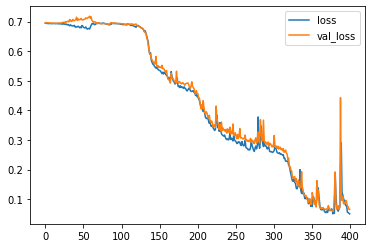

``` python
# Plot the accuracy too
plt.plot(r.history['accuracy'], label='acc')
plt.plot(r.history['val_accuracy'], label='val_acc')
plt.legend()
```

    <matplotlib.legend.Legend at 0x7fec262e1d30>

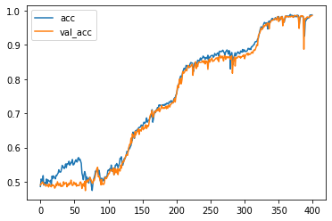

``` python
# Make the problem harder by making T larger
T = 30
D = 1
X = []
Y = []

for t in range(5000):
  x = np.random.randn(T)
  X.append(x)
  y = get_label(x, 0, 1, 2) # long distance
  Y.append(y)

X = np.array(X)
Y = np.array(Y)
N = len(X)
```

``` python
# Now test our LSTM
inputs = np.expand_dims(X, -1)

# make the RNN
i = Input(shape=(T, D))

# method 1
x = LSTM(15)(i)

x = Dense(1, activation='sigmoid')(x)
model = Model(i, x)
model.compile(
  loss='binary_crossentropy',
  optimizer=Adam(lr=0.01),
  metrics=['accuracy'],
)

# train the RNN
r = model.fit(
  inputs, Y,
  epochs=400,
  validation_split=0.5,
)
```

    Epoch 1/400
    79/79 [==============================] - 1s 10ms/step - loss: 0.6938 - accuracy: 0.5124 - val_loss: 0.6950 - val_accuracy: 0.4940
    Epoch 2/400
    79/79 [==============================] - 1s 7ms/step - loss: 0.6925 - accuracy: 0.5200 - val_loss: 0.6945 - val_accuracy: 0.4964
    Epoch 3/400
    79/79 [==============================] - 1s 6ms/step - loss: 0.6927 - accuracy: 0.5204 - val_loss: 0.6955 - val_accuracy: 0.4960
    Epoch 4/400
    79/79 [==============================] - 1s 7ms/step - loss: 0.6916 - accuracy: 0.5224 - val_loss: 0.6943 - val_accuracy: 0.4956
    Epoch 5/400
    79/79 [==============================] - 0s 6ms/step - loss: 0.6922 - accuracy: 0.5228 - val_loss: 0.6952 - val_accuracy: 0.4960
    Epoch 6/400
    79/79 [==============================] - 1s 7ms/step - loss: 0.6920 - accuracy: 0.5232 - val_loss: 0.6945 - val_accuracy: 0.4960
    Epoch 7/400
    79/79 [==============================] - 0s 6ms/step - loss: 0.6921 - accuracy: 0.5252 - val_loss: 0.6949 - val_accuracy: 0.4912
    Epoch 8/400
    79/79 [==============================] - 1s 7ms/step - loss: 0.6917 - accuracy: 0.5276 - val_loss: 0.6943 - val_accuracy: 0.4908
    Epoch 9/400
    79/79 [==============================] - 1s 6ms/step - loss: 0.6908 - accuracy: 0.5244 - val_loss: 0.6962 - val_accuracy: 0.4892
    Epoch 10/400
    79/79 [==============================] - 1s 7ms/step - loss: 0.6929 - accuracy: 0.5300 - val_loss: 0.6971 - val_accuracy: 0.4964
    Epoch 11/400
    79/79 [==============================] - 1s 6ms/step - loss: 0.6913 - accuracy: 0.5284 - val_loss: 0.6950 - val_accuracy: 0.4960
    Epoch 12/400
    79/79 [==============================] - 1s 7ms/step - loss: 0.6909 - accuracy: 0.5248 - val_loss: 0.6954 - val_accuracy: 0.4940
    Epoch 13/400
    79/79 [==============================] - 1s 7ms/step - loss: 0.6911 - accuracy: 0.5284 - val_loss: 0.6941 - val_accuracy: 0.4964
    Epoch 14/400
    79/79 [==============================] - 1s 7ms/step - loss: 0.6912 - accuracy: 0.5344 - val_loss: 0.6959 - val_accuracy: 0.4968
    Epoch 15/400
    79/79 [==============================] - 1s 7ms/step - loss: 0.6904 - accuracy: 0.5332 - val_loss: 0.6952 - val_accuracy: 0.5016
    Epoch 16/400
    79/79 [==============================] - 1s 6ms/step - loss: 0.6912 - accuracy: 0.5372 - val_loss: 0.6958 - val_accuracy: 0.5020
    Epoch 17/400
    79/79 [==============================] - 1s 7ms/step - loss: 0.6907 - accuracy: 0.5324 - val_loss: 0.6962 - val_accuracy: 0.5052
    Epoch 18/400
    79/79 [==============================] - 1s 6ms/step - loss: 0.6924 - accuracy: 0.5300 - val_loss: 0.6953 - val_accuracy: 0.5056
    Epoch 19/400
    79/79 [==============================] - 1s 7ms/step - loss: 0.6893 - accuracy: 0.5352 - val_loss: 0.6994 - val_accuracy: 0.4976
    Epoch 20/400
    79/79 [==============================] - 1s 6ms/step - loss: 0.6899 - accuracy: 0.5268 - val_loss: 0.6960 - val_accuracy: 0.4988
    Epoch 21/400
    79/79 [==============================] - 1s 6ms/step - loss: 0.6898 - accuracy: 0.5432 - val_loss: 0.6958 - val_accuracy: 0.5104
    Epoch 22/400
    79/79 [==============================] - 1s 6ms/step - loss: 0.6879 - accuracy: 0.5376 - val_loss: 0.6995 - val_accuracy: 0.5052
    Epoch 23/400
    79/79 [==============================] - 1s 7ms/step - loss: 0.6891 - accuracy: 0.5356 - val_loss: 0.7014 - val_accuracy: 0.5012
    Epoch 24/400
    79/79 [==============================] - 1s 6ms/step - loss: 0.6875 - accuracy: 0.5416 - val_loss: 0.7036 - val_accuracy: 0.5016
    Epoch 25/400
    79/79 [==============================] - 1s 7ms/step - loss: 0.6885 - accuracy: 0.5388 - val_loss: 0.6955 - val_accuracy: 0.4996
    Epoch 26/400
    79/79 [==============================] - 1s 6ms/step - loss: 0.6861 - accuracy: 0.5396 - val_loss: 0.7011 - val_accuracy: 0.5016
    Epoch 27/400
    79/79 [==============================] - 1s 7ms/step - loss: 0.6859 - accuracy: 0.5472 - val_loss: 0.7008 - val_accuracy: 0.4956
    Epoch 28/400
    79/79 [==============================] - 1s 6ms/step - loss: 0.6856 - accuracy: 0.5528 - val_loss: 0.7030 - val_accuracy: 0.5012
    Epoch 29/400
    79/79 [==============================] - 1s 7ms/step - loss: 0.6843 - accuracy: 0.5496 - val_loss: 0.7024 - val_accuracy: 0.4944
    Epoch 30/400
    79/79 [==============================] - 1s 6ms/step - loss: 0.6826 - accuracy: 0.5508 - val_loss: 0.7150 - val_accuracy: 0.4960
    Epoch 31/400
    79/79 [==============================] - 1s 7ms/step - loss: 0.6811 - accuracy: 0.5580 - val_loss: 0.7058 - val_accuracy: 0.5004
    Epoch 32/400
    79/79 [==============================] - 1s 7ms/step - loss: 0.6882 - accuracy: 0.5332 - val_loss: 0.7025 - val_accuracy: 0.4940
    Epoch 33/400
    79/79 [==============================] - 1s 7ms/step - loss: 0.6927 - accuracy: 0.5188 - val_loss: 0.6988 - val_accuracy: 0.5000
    Epoch 34/400
    79/79 [==============================] - 1s 6ms/step - loss: 0.6897 - accuracy: 0.5416 - val_loss: 0.7027 - val_accuracy: 0.5052
    Epoch 35/400
    79/79 [==============================] - 1s 7ms/step - loss: 0.6892 - accuracy: 0.5388 - val_loss: 0.6926 - val_accuracy: 0.5076
    Epoch 36/400
    79/79 [==============================] - 1s 7ms/step - loss: 0.6703 - accuracy: 0.5680 - val_loss: 0.6594 - val_accuracy: 0.5656
    Epoch 37/400
    79/79 [==============================] - 1s 7ms/step - loss: 0.6364 - accuracy: 0.6020 - val_loss: 0.6418 - val_accuracy: 0.5920
    Epoch 38/400
    79/79 [==============================] - 1s 6ms/step - loss: 0.6196 - accuracy: 0.6136 - val_loss: 0.6510 - val_accuracy: 0.5844
    Epoch 39/400
    79/79 [==============================] - 1s 7ms/step - loss: 0.6257 - accuracy: 0.6184 - val_loss: 0.6371 - val_accuracy: 0.5816
    Epoch 40/400
    79/79 [==============================] - 1s 6ms/step - loss: 0.6065 - accuracy: 0.6308 - val_loss: 0.6372 - val_accuracy: 0.5924
    Epoch 41/400
    79/79 [==============================] - 1s 7ms/step - loss: 0.6144 - accuracy: 0.6324 - val_loss: 0.6255 - val_accuracy: 0.5948
    Epoch 42/400
    79/79 [==============================] - 1s 7ms/step - loss: 0.6017 - accuracy: 0.6336 - val_loss: 0.6380 - val_accuracy: 0.5960
    Epoch 43/400
    79/79 [==============================] - 1s 6ms/step - loss: 0.6007 - accuracy: 0.6372 - val_loss: 0.6215 - val_accuracy: 0.6032
    Epoch 44/400
    79/79 [==============================] - 1s 6ms/step - loss: 0.5848 - accuracy: 0.6604 - val_loss: 0.5784 - val_accuracy: 0.6684
    Epoch 45/400
    79/79 [==============================] - 1s 6ms/step - loss: 0.5135 - accuracy: 0.7432 - val_loss: 0.4908 - val_accuracy: 0.7532
    Epoch 46/400
    79/79 [==============================] - 1s 7ms/step - loss: 0.4700 - accuracy: 0.7776 - val_loss: 0.5146 - val_accuracy: 0.7540
    Epoch 47/400
    79/79 [==============================] - 1s 7ms/step - loss: 0.4460 - accuracy: 0.7956 - val_loss: 0.4578 - val_accuracy: 0.7732
    Epoch 48/400
    79/79 [==============================] - 1s 6ms/step - loss: 0.4209 - accuracy: 0.8076 - val_loss: 0.4344 - val_accuracy: 0.7916
    Epoch 49/400
    79/79 [==============================] - 1s 6ms/step - loss: 0.3859 - accuracy: 0.8280 - val_loss: 0.3907 - val_accuracy: 0.8176
    Epoch 50/400
    79/79 [==============================] - 1s 7ms/step - loss: 0.2989 - accuracy: 0.8860 - val_loss: 0.2240 - val_accuracy: 0.9068
    Epoch 51/400
    79/79 [==============================] - 1s 6ms/step - loss: 0.1341 - accuracy: 0.9544 - val_loss: 0.1162 - val_accuracy: 0.9628
    Epoch 52/400
    79/79 [==============================] - 1s 7ms/step - loss: 0.0979 - accuracy: 0.9668 - val_loss: 0.0890 - val_accuracy: 0.9664
    Epoch 53/400
    79/79 [==============================] - 1s 6ms/step - loss: 0.0632 - accuracy: 0.9812 - val_loss: 0.0899 - val_accuracy: 0.9660
    Epoch 54/400
    79/79 [==============================] - 1s 7ms/step - loss: 0.0643 - accuracy: 0.9800 - val_loss: 0.1283 - val_accuracy: 0.9576
    Epoch 55/400
    79/79 [==============================] - 1s 6ms/step - loss: 0.0563 - accuracy: 0.9800 - val_loss: 0.0561 - val_accuracy: 0.9788
    Epoch 56/400
    79/79 [==============================] - 1s 7ms/step - loss: 0.0444 - accuracy: 0.9836 - val_loss: 0.0495 - val_accuracy: 0.9824
    Epoch 57/400
    79/79 [==============================] - 1s 7ms/step - loss: 0.0373 - accuracy: 0.9892 - val_loss: 0.0891 - val_accuracy: 0.9708
    Epoch 58/400
    79/79 [==============================] - 1s 7ms/step - loss: 0.0411 - accuracy: 0.9844 - val_loss: 0.0512 - val_accuracy: 0.9828
    Epoch 59/400
    79/79 [==============================] - 1s 7ms/step - loss: 0.0312 - accuracy: 0.9896 - val_loss: 0.0501 - val_accuracy: 0.9808
    Epoch 60/400
    79/79 [==============================] - 1s 7ms/step - loss: 0.0293 - accuracy: 0.9916 - val_loss: 0.0605 - val_accuracy: 0.9748
    Epoch 61/400
    79/79 [==============================] - 1s 6ms/step - loss: 0.0300 - accuracy: 0.9868 - val_loss: 0.0444 - val_accuracy: 0.9836
    Epoch 62/400
    79/79 [==============================] - 1s 7ms/step - loss: 0.0214 - accuracy: 0.9924 - val_loss: 0.0561 - val_accuracy: 0.9856
    Epoch 63/400
    79/79 [==============================] - 1s 7ms/step - loss: 0.0158 - accuracy: 0.9948 - val_loss: 0.0404 - val_accuracy: 0.9868
    Epoch 64/400
    79/79 [==============================] - 1s 7ms/step - loss: 0.0212 - accuracy: 0.9920 - val_loss: 0.0402 - val_accuracy: 0.9852
    Epoch 65/400
    79/79 [==============================] - 1s 7ms/step - loss: 0.0233 - accuracy: 0.9924 - val_loss: 0.0302 - val_accuracy: 0.9876
    Epoch 66/400
    79/79 [==============================] - 1s 7ms/step - loss: 0.0317 - accuracy: 0.9876 - val_loss: 0.0469 - val_accuracy: 0.9836
    Epoch 67/400
    79/79 [==============================] - 1s 6ms/step - loss: 0.0213 - accuracy: 0.9900 - val_loss: 0.0292 - val_accuracy: 0.9900
    Epoch 68/400
    79/79 [==============================] - 1s 7ms/step - loss: 0.0099 - accuracy: 0.9976 - val_loss: 0.0289 - val_accuracy: 0.9880
    Epoch 69/400
    79/79 [==============================] - 1s 7ms/step - loss: 0.0165 - accuracy: 0.9940 - val_loss: 0.0329 - val_accuracy: 0.9868
    Epoch 70/400
    79/79 [==============================] - 1s 7ms/step - loss: 0.0244 - accuracy: 0.9932 - val_loss: 0.0339 - val_accuracy: 0.9852
    Epoch 71/400
    79/79 [==============================] - 1s 7ms/step - loss: 0.0256 - accuracy: 0.9908 - val_loss: 0.0401 - val_accuracy: 0.9872
    Epoch 72/400
    79/79 [==============================] - 1s 7ms/step - loss: 0.0263 - accuracy: 0.9912 - val_loss: 0.0332 - val_accuracy: 0.9880
    Epoch 73/400
    79/79 [==============================] - 1s 6ms/step - loss: 0.0125 - accuracy: 0.9960 - val_loss: 0.0553 - val_accuracy: 0.9832
    Epoch 74/400
    79/79 [==============================] - 1s 7ms/step - loss: 0.0204 - accuracy: 0.9932 - val_loss: 0.0300 - val_accuracy: 0.9888
    Epoch 75/400
    79/79 [==============================] - 1s 7ms/step - loss: 0.0091 - accuracy: 0.9976 - val_loss: 0.0419 - val_accuracy: 0.9876
    Epoch 76/400
    79/79 [==============================] - 1s 7ms/step - loss: 0.0178 - accuracy: 0.9952 - val_loss: 0.0442 - val_accuracy: 0.9856
    Epoch 77/400
    79/79 [==============================] - 1s 7ms/step - loss: 0.0151 - accuracy: 0.9948 - val_loss: 0.0257 - val_accuracy: 0.9908
    Epoch 78/400
    79/79 [==============================] - 1s 7ms/step - loss: 0.0091 - accuracy: 0.9972 - val_loss: 0.0352 - val_accuracy: 0.9892
    Epoch 79/400
    79/79 [==============================] - 1s 7ms/step - loss: 0.0140 - accuracy: 0.9940 - val_loss: 0.0460 - val_accuracy: 0.9856
    Epoch 80/400
    79/79 [==============================] - 1s 7ms/step - loss: 0.0125 - accuracy: 0.9964 - val_loss: 0.0349 - val_accuracy: 0.9884
    Epoch 81/400
    79/79 [==============================] - 1s 7ms/step - loss: 0.0070 - accuracy: 0.9972 - val_loss: 0.0329 - val_accuracy: 0.9908
    Epoch 82/400
    79/79 [==============================] - 1s 7ms/step - loss: 0.0069 - accuracy: 0.9972 - val_loss: 0.0338 - val_accuracy: 0.9904
    Epoch 83/400
    79/79 [==============================] - 1s 7ms/step - loss: 0.0289 - accuracy: 0.9964 - val_loss: 0.0410 - val_accuracy: 0.9868
    Epoch 84/400
    79/79 [==============================] - 1s 7ms/step - loss: 0.0840 - accuracy: 0.9744 - val_loss: 0.0600 - val_accuracy: 0.9792
    Epoch 85/400
    79/79 [==============================] - 1s 7ms/step - loss: 0.0278 - accuracy: 0.9892 - val_loss: 0.0368 - val_accuracy: 0.9872
    Epoch 86/400
    79/79 [==============================] - 1s 7ms/step - loss: 0.0108 - accuracy: 0.9972 - val_loss: 0.0358 - val_accuracy: 0.9868
    Epoch 87/400
    79/79 [==============================] - 1s 7ms/step - loss: 0.0072 - accuracy: 0.9976 - val_loss: 0.0401 - val_accuracy: 0.9868
    Epoch 88/400
    79/79 [==============================] - 1s 6ms/step - loss: 0.0059 - accuracy: 0.9984 - val_loss: 0.0444 - val_accuracy: 0.9856
    Epoch 89/400
    79/79 [==============================] - 1s 7ms/step - loss: 0.0145 - accuracy: 0.9956 - val_loss: 0.0383 - val_accuracy: 0.9880
    Epoch 90/400
    79/79 [==============================] - 1s 6ms/step - loss: 0.0131 - accuracy: 0.9952 - val_loss: 0.0456 - val_accuracy: 0.9852
    Epoch 91/400
    79/79 [==============================] - 1s 7ms/step - loss: 0.0079 - accuracy: 0.9976 - val_loss: 0.0293 - val_accuracy: 0.9884
    Epoch 92/400
    79/79 [==============================] - 1s 7ms/step - loss: 0.0057 - accuracy: 0.9976 - val_loss: 0.0328 - val_accuracy: 0.9864
    Epoch 93/400
    79/79 [==============================] - 1s 7ms/step - loss: 0.0030 - accuracy: 0.9996 - val_loss: 0.0243 - val_accuracy: 0.9924
    Epoch 94/400
    79/79 [==============================] - 1s 6ms/step - loss: 0.0041 - accuracy: 0.9992 - val_loss: 0.0367 - val_accuracy: 0.9872
    Epoch 95/400
    79/79 [==============================] - 1s 7ms/step - loss: 0.0063 - accuracy: 0.9984 - val_loss: 0.0438 - val_accuracy: 0.9884
    Epoch 96/400
    79/79 [==============================] - 1s 7ms/step - loss: 0.0044 - accuracy: 0.9992 - val_loss: 0.0483 - val_accuracy: 0.9864
    Epoch 97/400
    79/79 [==============================] - 1s 7ms/step - loss: 0.0026 - accuracy: 0.9988 - val_loss: 0.0479 - val_accuracy: 0.9884
    Epoch 98/400
    79/79 [==============================] - 1s 7ms/step - loss: 0.0059 - accuracy: 0.9988 - val_loss: 0.0357 - val_accuracy: 0.9884
    Epoch 99/400
    79/79 [==============================] - 1s 7ms/step - loss: 0.0145 - accuracy: 0.9960 - val_loss: 0.0373 - val_accuracy: 0.9884
    Epoch 100/400
    79/79 [==============================] - 1s 6ms/step - loss: 0.0154 - accuracy: 0.9948 - val_loss: 0.0376 - val_accuracy: 0.9852
    Epoch 101/400
    79/79 [==============================] - 1s 6ms/step - loss: 0.0075 - accuracy: 0.9980 - val_loss: 0.0364 - val_accuracy: 0.9884
    Epoch 102/400
    79/79 [==============================] - 1s 6ms/step - loss: 0.0075 - accuracy: 0.9980 - val_loss: 0.0261 - val_accuracy: 0.9920
    Epoch 103/400
    79/79 [==============================] - 1s 6ms/step - loss: 0.0108 - accuracy: 0.9964 - val_loss: 0.0284 - val_accuracy: 0.9900
    Epoch 104/400
    79/79 [==============================] - 1s 7ms/step - loss: 0.0113 - accuracy: 0.9968 - val_loss: 0.0232 - val_accuracy: 0.9908
    Epoch 105/400
    79/79 [==============================] - 1s 6ms/step - loss: 0.0031 - accuracy: 0.9996 - val_loss: 0.0271 - val_accuracy: 0.9896
    Epoch 106/400
    79/79 [==============================] - 1s 7ms/step - loss: 0.0027 - accuracy: 0.9992 - val_loss: 0.0290 - val_accuracy: 0.9892
    Epoch 107/400
    79/79 [==============================] - 1s 6ms/step - loss: 0.0016 - accuracy: 0.9992 - val_loss: 0.0292 - val_accuracy: 0.9896
    Epoch 108/400
    79/79 [==============================] - 1s 6ms/step - loss: 0.0013 - accuracy: 0.9996 - val_loss: 0.0302 - val_accuracy: 0.9912
    Epoch 109/400
    79/79 [==============================] - 1s 7ms/step - loss: 9.9011e-04 - accuracy: 0.9996 - val_loss: 0.0255 - val_accuracy: 0.9920
    Epoch 110/400
    79/79 [==============================] - 1s 7ms/step - loss: 7.9221e-04 - accuracy: 1.0000 - val_loss: 0.0396 - val_accuracy: 0.9896
    Epoch 111/400
    79/79 [==============================] - 1s 7ms/step - loss: 0.0195 - accuracy: 0.9964 - val_loss: 0.0237 - val_accuracy: 0.9916
    Epoch 112/400
    79/79 [==============================] - 1s 7ms/step - loss: 0.0077 - accuracy: 0.9976 - val_loss: 0.0388 - val_accuracy: 0.9864
    Epoch 113/400
    79/79 [==============================] - 1s 7ms/step - loss: 0.0068 - accuracy: 0.9976 - val_loss: 0.0319 - val_accuracy: 0.9892
    Epoch 114/400
    79/79 [==============================] - 1s 7ms/step - loss: 0.0050 - accuracy: 0.9988 - val_loss: 0.0298 - val_accuracy: 0.9904
    Epoch 115/400
    79/79 [==============================] - 1s 6ms/step - loss: 0.0065 - accuracy: 0.9984 - val_loss: 0.0315 - val_accuracy: 0.9892
    Epoch 116/400
    79/79 [==============================] - 1s 7ms/step - loss: 0.0016 - accuracy: 0.9996 - val_loss: 0.0335 - val_accuracy: 0.9900
    Epoch 117/400
    79/79 [==============================] - 1s 7ms/step - loss: 9.3726e-04 - accuracy: 1.0000 - val_loss: 0.0297 - val_accuracy: 0.9908
    Epoch 118/400
    79/79 [==============================] - 1s 7ms/step - loss: 6.0662e-04 - accuracy: 1.0000 - val_loss: 0.0312 - val_accuracy: 0.9908
    Epoch 119/400
    79/79 [==============================] - 1s 7ms/step - loss: 5.9509e-04 - accuracy: 1.0000 - val_loss: 0.0352 - val_accuracy: 0.9904
    Epoch 120/400
    79/79 [==============================] - 1s 7ms/step - loss: 5.5597e-04 - accuracy: 1.0000 - val_loss: 0.0334 - val_accuracy: 0.9912
    Epoch 121/400
    79/79 [==============================] - 1s 7ms/step - loss: 5.2154e-04 - accuracy: 1.0000 - val_loss: 0.0347 - val_accuracy: 0.9908
    Epoch 122/400
    79/79 [==============================] - 1s 6ms/step - loss: 3.3155e-04 - accuracy: 1.0000 - val_loss: 0.0393 - val_accuracy: 0.9908
    Epoch 123/400
    79/79 [==============================] - 1s 6ms/step - loss: 2.8362e-04 - accuracy: 1.0000 - val_loss: 0.0393 - val_accuracy: 0.9912
    Epoch 124/400
    79/79 [==============================] - 1s 7ms/step - loss: 2.2577e-04 - accuracy: 1.0000 - val_loss: 0.0416 - val_accuracy: 0.9908
    Epoch 125/400
    79/79 [==============================] - 1s 7ms/step - loss: 1.9810e-04 - accuracy: 1.0000 - val_loss: 0.0404 - val_accuracy: 0.9912
    Epoch 126/400
    79/79 [==============================] - 1s 7ms/step - loss: 1.7869e-04 - accuracy: 1.0000 - val_loss: 0.0429 - val_accuracy: 0.9924
    Epoch 127/400
    79/79 [==============================] - 1s 6ms/step - loss: 1.5033e-04 - accuracy: 1.0000 - val_loss: 0.0429 - val_accuracy: 0.9924
    Epoch 128/400
    79/79 [==============================] - 1s 7ms/step - loss: 1.1684e-04 - accuracy: 1.0000 - val_loss: 0.0446 - val_accuracy: 0.9924
    Epoch 129/400
    79/79 [==============================] - 1s 7ms/step - loss: 1.0989e-04 - accuracy: 1.0000 - val_loss: 0.0461 - val_accuracy: 0.9924
    Epoch 130/400
    79/79 [==============================] - 1s 6ms/step - loss: 9.0361e-05 - accuracy: 1.0000 - val_loss: 0.0465 - val_accuracy: 0.9924
    Epoch 131/400
    79/79 [==============================] - 1s 7ms/step - loss: 7.7742e-05 - accuracy: 1.0000 - val_loss: 0.0473 - val_accuracy: 0.9924
    Epoch 132/400
    79/79 [==============================] - 1s 6ms/step - loss: 7.2091e-05 - accuracy: 1.0000 - val_loss: 0.0480 - val_accuracy: 0.9924
    Epoch 133/400
    79/79 [==============================] - 1s 7ms/step - loss: 6.4350e-05 - accuracy: 1.0000 - val_loss: 0.0493 - val_accuracy: 0.9924
    Epoch 134/400
    79/79 [==============================] - 1s 7ms/step - loss: 5.8189e-05 - accuracy: 1.0000 - val_loss: 0.0493 - val_accuracy: 0.9924
    Epoch 135/400
    79/79 [==============================] - 1s 6ms/step - loss: 4.9459e-05 - accuracy: 1.0000 - val_loss: 0.0501 - val_accuracy: 0.9924
    Epoch 136/400
    79/79 [==============================] - 1s 6ms/step - loss: 4.5237e-05 - accuracy: 1.0000 - val_loss: 0.0508 - val_accuracy: 0.9928
    Epoch 137/400
    79/79 [==============================] - 1s 7ms/step - loss: 4.1174e-05 - accuracy: 1.0000 - val_loss: 0.0510 - val_accuracy: 0.9928
    Epoch 138/400
    79/79 [==============================] - 1s 7ms/step - loss: 3.6626e-05 - accuracy: 1.0000 - val_loss: 0.0515 - val_accuracy: 0.9924
    Epoch 139/400
    79/79 [==============================] - 1s 7ms/step - loss: 3.3935e-05 - accuracy: 1.0000 - val_loss: 0.0522 - val_accuracy: 0.9928
    Epoch 140/400
    79/79 [==============================] - 1s 7ms/step - loss: 3.0910e-05 - accuracy: 1.0000 - val_loss: 0.0526 - val_accuracy: 0.9928
    Epoch 141/400
    79/79 [==============================] - 1s 7ms/step - loss: 2.8376e-05 - accuracy: 1.0000 - val_loss: 0.0529 - val_accuracy: 0.9928
    Epoch 142/400
    79/79 [==============================] - 1s 6ms/step - loss: 2.6438e-05 - accuracy: 1.0000 - val_loss: 0.0534 - val_accuracy: 0.9928
    Epoch 143/400
    79/79 [==============================] - 1s 6ms/step - loss: 2.4154e-05 - accuracy: 1.0000 - val_loss: 0.0538 - val_accuracy: 0.9928
    Epoch 144/400
    79/79 [==============================] - 1s 7ms/step - loss: 2.2308e-05 - accuracy: 1.0000 - val_loss: 0.0543 - val_accuracy: 0.9924
    Epoch 145/400
    79/79 [==============================] - 1s 7ms/step - loss: 2.1110e-05 - accuracy: 1.0000 - val_loss: 0.0547 - val_accuracy: 0.9928
    Epoch 146/400
    79/79 [==============================] - 1s 6ms/step - loss: 1.9753e-05 - accuracy: 1.0000 - val_loss: 0.0552 - val_accuracy: 0.9924
    Epoch 147/400
    79/79 [==============================] - 1s 6ms/step - loss: 1.9095e-05 - accuracy: 1.0000 - val_loss: 0.0557 - val_accuracy: 0.9920
    Epoch 148/400
    79/79 [==============================] - 1s 6ms/step - loss: 1.7381e-05 - accuracy: 1.0000 - val_loss: 0.0561 - val_accuracy: 0.9924
    Epoch 149/400
    79/79 [==============================] - 1s 7ms/step - loss: 1.6414e-05 - accuracy: 1.0000 - val_loss: 0.0565 - val_accuracy: 0.9924
    Epoch 150/400
    79/79 [==============================] - 1s 6ms/step - loss: 1.5528e-05 - accuracy: 1.0000 - val_loss: 0.0570 - val_accuracy: 0.9924
    Epoch 151/400
    79/79 [==============================] - 1s 7ms/step - loss: 1.4698e-05 - accuracy: 1.0000 - val_loss: 0.0576 - val_accuracy: 0.9924
    Epoch 152/400
    79/79 [==============================] - 1s 7ms/step - loss: 1.4516e-05 - accuracy: 1.0000 - val_loss: 0.0581 - val_accuracy: 0.9924
    Epoch 153/400
    79/79 [==============================] - 1s 7ms/step - loss: 1.3769e-05 - accuracy: 1.0000 - val_loss: 0.0585 - val_accuracy: 0.9920
    Epoch 154/400
    79/79 [==============================] - 0s 6ms/step - loss: 1.2615e-05 - accuracy: 1.0000 - val_loss: 0.0588 - val_accuracy: 0.9920
    Epoch 155/400
    79/79 [==============================] - 1s 7ms/step - loss: 1.2033e-05 - accuracy: 1.0000 - val_loss: 0.0592 - val_accuracy: 0.9920
    Epoch 156/400
    79/79 [==============================] - 1s 6ms/step - loss: 1.1480e-05 - accuracy: 1.0000 - val_loss: 0.0598 - val_accuracy: 0.9920
    Epoch 157/400
    79/79 [==============================] - 1s 6ms/step - loss: 1.1004e-05 - accuracy: 1.0000 - val_loss: 0.0604 - val_accuracy: 0.9920
    Epoch 158/400
    79/79 [==============================] - 1s 6ms/step - loss: 1.0427e-05 - accuracy: 1.0000 - val_loss: 0.0609 - val_accuracy: 0.9912
    Epoch 159/400
    79/79 [==============================] - 1s 7ms/step - loss: 1.0029e-05 - accuracy: 1.0000 - val_loss: 0.0613 - val_accuracy: 0.9912
    Epoch 160/400
    79/79 [==============================] - 1s 7ms/step - loss: 9.6064e-06 - accuracy: 1.0000 - val_loss: 0.0618 - val_accuracy: 0.9912
    Epoch 161/400
    79/79 [==============================] - 1s 7ms/step - loss: 9.2735e-06 - accuracy: 1.0000 - val_loss: 0.0624 - val_accuracy: 0.9912
    Epoch 162/400
    79/79 [==============================] - 0s 6ms/step - loss: 8.9280e-06 - accuracy: 1.0000 - val_loss: 0.0629 - val_accuracy: 0.9908
    Epoch 163/400
    79/79 [==============================] - 1s 7ms/step - loss: 8.5592e-06 - accuracy: 1.0000 - val_loss: 0.0634 - val_accuracy: 0.9908
    Epoch 164/400
    79/79 [==============================] - 1s 7ms/step - loss: 8.1564e-06 - accuracy: 1.0000 - val_loss: 0.0637 - val_accuracy: 0.9908
    Epoch 165/400
    79/79 [==============================] - 1s 7ms/step - loss: 7.7459e-06 - accuracy: 1.0000 - val_loss: 0.0642 - val_accuracy: 0.9908
    Epoch 166/400
    79/79 [==============================] - 1s 7ms/step - loss: 7.4394e-06 - accuracy: 1.0000 - val_loss: 0.0647 - val_accuracy: 0.9908
    Epoch 167/400
    79/79 [==============================] - 1s 6ms/step - loss: 7.3749e-06 - accuracy: 1.0000 - val_loss: 0.0652 - val_accuracy: 0.9908
    Epoch 168/400
    79/79 [==============================] - 1s 7ms/step - loss: 6.8616e-06 - accuracy: 1.0000 - val_loss: 0.0657 - val_accuracy: 0.9908
    Epoch 169/400
    79/79 [==============================] - 1s 7ms/step - loss: 6.6022e-06 - accuracy: 1.0000 - val_loss: 0.0662 - val_accuracy: 0.9908
    Epoch 170/400
    79/79 [==============================] - 1s 7ms/step - loss: 6.3705e-06 - accuracy: 1.0000 - val_loss: 0.0667 - val_accuracy: 0.9908
    Epoch 171/400
    79/79 [==============================] - 1s 7ms/step - loss: 6.0982e-06 - accuracy: 1.0000 - val_loss: 0.0671 - val_accuracy: 0.9908
    Epoch 172/400
    79/79 [==============================] - 1s 7ms/step - loss: 5.8814e-06 - accuracy: 1.0000 - val_loss: 0.0675 - val_accuracy: 0.9908
    Epoch 173/400
    79/79 [==============================] - 1s 7ms/step - loss: 5.6631e-06 - accuracy: 1.0000 - val_loss: 0.0682 - val_accuracy: 0.9908
    Epoch 174/400
    79/79 [==============================] - 1s 7ms/step - loss: 5.6681e-06 - accuracy: 1.0000 - val_loss: 0.0688 - val_accuracy: 0.9908
    Epoch 175/400
    79/79 [==============================] - 1s 7ms/step - loss: 5.4060e-06 - accuracy: 1.0000 - val_loss: 0.0691 - val_accuracy: 0.9904
    Epoch 176/400
    79/79 [==============================] - 1s 7ms/step - loss: 5.0593e-06 - accuracy: 1.0000 - val_loss: 0.0698 - val_accuracy: 0.9904
    Epoch 177/400
    79/79 [==============================] - 1s 7ms/step - loss: 4.9132e-06 - accuracy: 1.0000 - val_loss: 0.0703 - val_accuracy: 0.9904
    Epoch 178/400
    79/79 [==============================] - 1s 7ms/step - loss: 4.8269e-06 - accuracy: 1.0000 - val_loss: 0.0707 - val_accuracy: 0.9904
    Epoch 179/400
    79/79 [==============================] - 1s 7ms/step - loss: 4.5163e-06 - accuracy: 1.0000 - val_loss: 0.0713 - val_accuracy: 0.9908
    Epoch 180/400
    79/79 [==============================] - 1s 7ms/step - loss: 4.3722e-06 - accuracy: 1.0000 - val_loss: 0.0718 - val_accuracy: 0.9908
    Epoch 181/400
    79/79 [==============================] - 1s 7ms/step - loss: 4.1614e-06 - accuracy: 1.0000 - val_loss: 0.0724 - val_accuracy: 0.9904
    Epoch 182/400
    79/79 [==============================] - 1s 7ms/step - loss: 4.0555e-06 - accuracy: 1.0000 - val_loss: 0.0728 - val_accuracy: 0.9904
    Epoch 183/400
    79/79 [==============================] - 1s 7ms/step - loss: 3.8702e-06 - accuracy: 1.0000 - val_loss: 0.0734 - val_accuracy: 0.9904
    Epoch 184/400
    79/79 [==============================] - 1s 6ms/step - loss: 3.7382e-06 - accuracy: 1.0000 - val_loss: 0.0741 - val_accuracy: 0.9904
    Epoch 185/400
    79/79 [==============================] - 1s 7ms/step - loss: 3.6140e-06 - accuracy: 1.0000 - val_loss: 0.0745 - val_accuracy: 0.9904
    Epoch 186/400
    79/79 [==============================] - 1s 6ms/step - loss: 3.4893e-06 - accuracy: 1.0000 - val_loss: 0.0750 - val_accuracy: 0.9904
    Epoch 187/400
    79/79 [==============================] - 1s 7ms/step - loss: 3.4553e-06 - accuracy: 1.0000 - val_loss: 0.0757 - val_accuracy: 0.9900
    Epoch 188/400
    79/79 [==============================] - 1s 6ms/step - loss: 3.2320e-06 - accuracy: 1.0000 - val_loss: 0.0767 - val_accuracy: 0.9900
    Epoch 189/400
    79/79 [==============================] - 1s 7ms/step - loss: 3.0963e-06 - accuracy: 1.0000 - val_loss: 0.0772 - val_accuracy: 0.9900
    Epoch 190/400
    79/79 [==============================] - 1s 6ms/step - loss: 2.9725e-06 - accuracy: 1.0000 - val_loss: 0.0776 - val_accuracy: 0.9900
    Epoch 191/400
    79/79 [==============================] - 1s 7ms/step - loss: 2.8801e-06 - accuracy: 1.0000 - val_loss: 0.0783 - val_accuracy: 0.9900
    Epoch 192/400
    79/79 [==============================] - 0s 6ms/step - loss: 2.7571e-06 - accuracy: 1.0000 - val_loss: 0.0788 - val_accuracy: 0.9900
    Epoch 193/400
    79/79 [==============================] - 1s 7ms/step - loss: 2.6647e-06 - accuracy: 1.0000 - val_loss: 0.0795 - val_accuracy: 0.9896
    Epoch 194/400
    79/79 [==============================] - 1s 6ms/step - loss: 2.5738e-06 - accuracy: 1.0000 - val_loss: 0.0803 - val_accuracy: 0.9896
    Epoch 195/400
    79/79 [==============================] - 1s 7ms/step - loss: 2.4619e-06 - accuracy: 1.0000 - val_loss: 0.0809 - val_accuracy: 0.9896
    Epoch 196/400
    79/79 [==============================] - 0s 6ms/step - loss: 2.4338e-06 - accuracy: 1.0000 - val_loss: 0.0815 - val_accuracy: 0.9896
    Epoch 197/400
    79/79 [==============================] - 1s 7ms/step - loss: 2.2797e-06 - accuracy: 1.0000 - val_loss: 0.0822 - val_accuracy: 0.9896
    Epoch 198/400
    79/79 [==============================] - 1s 6ms/step - loss: 2.2387e-06 - accuracy: 1.0000 - val_loss: 0.0827 - val_accuracy: 0.9896
    Epoch 199/400
    79/79 [==============================] - 1s 7ms/step - loss: 2.1369e-06 - accuracy: 1.0000 - val_loss: 0.0833 - val_accuracy: 0.9896
    Epoch 200/400
    79/79 [==============================] - 1s 6ms/step - loss: 2.0409e-06 - accuracy: 1.0000 - val_loss: 0.0842 - val_accuracy: 0.9896
    Epoch 201/400
    79/79 [==============================] - 1s 7ms/step - loss: 2.0086e-06 - accuracy: 1.0000 - val_loss: 0.0848 - val_accuracy: 0.9896
    Epoch 202/400
    79/79 [==============================] - 1s 6ms/step - loss: 1.9156e-06 - accuracy: 1.0000 - val_loss: 0.0853 - val_accuracy: 0.9896
    Epoch 203/400
    79/79 [==============================] - 1s 7ms/step - loss: 1.9042e-06 - accuracy: 1.0000 - val_loss: 0.0859 - val_accuracy: 0.9896
    Epoch 204/400
    79/79 [==============================] - 1s 6ms/step - loss: 1.7815e-06 - accuracy: 1.0000 - val_loss: 0.0865 - val_accuracy: 0.9896
    Epoch 205/400
    79/79 [==============================] - 1s 7ms/step - loss: 1.7301e-06 - accuracy: 1.0000 - val_loss: 0.0860 - val_accuracy: 0.9896
    Epoch 206/400
    79/79 [==============================] - 1s 7ms/step - loss: 1.6366e-06 - accuracy: 1.0000 - val_loss: 0.0869 - val_accuracy: 0.9896
    Epoch 207/400
    79/79 [==============================] - 1s 6ms/step - loss: 1.6629e-06 - accuracy: 1.0000 - val_loss: 0.0875 - val_accuracy: 0.9896
    Epoch 208/400
    79/79 [==============================] - 1s 7ms/step - loss: 1.4986e-06 - accuracy: 1.0000 - val_loss: 0.0883 - val_accuracy: 0.9896
    Epoch 209/400
    79/79 [==============================] - 0s 6ms/step - loss: 1.4416e-06 - accuracy: 1.0000 - val_loss: 0.0889 - val_accuracy: 0.9896
    Epoch 210/400
    79/79 [==============================] - 1s 7ms/step - loss: 1.4065e-06 - accuracy: 1.0000 - val_loss: 0.0896 - val_accuracy: 0.9896
    Epoch 211/400
    79/79 [==============================] - 1s 7ms/step - loss: 1.3245e-06 - accuracy: 1.0000 - val_loss: 0.0903 - val_accuracy: 0.9896
    Epoch 212/400
    79/79 [==============================] - 1s 7ms/step - loss: 1.2749e-06 - accuracy: 1.0000 - val_loss: 0.0910 - val_accuracy: 0.9896
    Epoch 213/400
    79/79 [==============================] - 0s 6ms/step - loss: 1.2286e-06 - accuracy: 1.0000 - val_loss: 0.0915 - val_accuracy: 0.9896
    Epoch 214/400
    79/79 [==============================] - 1s 7ms/step - loss: 1.2243e-06 - accuracy: 1.0000 - val_loss: 0.0920 - val_accuracy: 0.9896
    Epoch 215/400
    79/79 [==============================] - 0s 6ms/step - loss: 1.1306e-06 - accuracy: 1.0000 - val_loss: 0.0929 - val_accuracy: 0.9896
    Epoch 216/400
    79/79 [==============================] - 1s 7ms/step - loss: 1.0883e-06 - accuracy: 1.0000 - val_loss: 0.0934 - val_accuracy: 0.9896
    Epoch 217/400
    79/79 [==============================] - 1s 6ms/step - loss: 1.0679e-06 - accuracy: 1.0000 - val_loss: 0.0939 - val_accuracy: 0.9896
    Epoch 218/400
    79/79 [==============================] - 1s 7ms/step - loss: 1.0146e-06 - accuracy: 1.0000 - val_loss: 0.0946 - val_accuracy: 0.9896
    Epoch 219/400
    79/79 [==============================] - 1s 6ms/step - loss: 9.6506e-07 - accuracy: 1.0000 - val_loss: 0.0951 - val_accuracy: 0.9896
    Epoch 220/400
    79/79 [==============================] - 1s 7ms/step - loss: 9.4242e-07 - accuracy: 1.0000 - val_loss: 0.0955 - val_accuracy: 0.9896
    Epoch 221/400
    79/79 [==============================] - 1s 7ms/step - loss: 9.3247e-07 - accuracy: 1.0000 - val_loss: 0.0960 - val_accuracy: 0.9896
    Epoch 222/400
    79/79 [==============================] - 1s 7ms/step - loss: 9.1268e-07 - accuracy: 1.0000 - val_loss: 0.0965 - val_accuracy: 0.9896
    Epoch 223/400
    79/79 [==============================] - 1s 7ms/step - loss: 8.4512e-07 - accuracy: 1.0000 - val_loss: 0.0969 - val_accuracy: 0.9896
    Epoch 224/400
    79/79 [==============================] - 1s 7ms/step - loss: 7.8692e-07 - accuracy: 1.0000 - val_loss: 0.0973 - val_accuracy: 0.9896
    Epoch 225/400
    79/79 [==============================] - 1s 7ms/step - loss: 7.5930e-07 - accuracy: 1.0000 - val_loss: 0.0977 - val_accuracy: 0.9896
    Epoch 226/400
    79/79 [==============================] - 1s 11ms/step - loss: 7.3015e-07 - accuracy: 1.0000 - val_loss: 0.0983 - val_accuracy: 0.9896
    Epoch 227/400
    79/79 [==============================] - 1s 7ms/step - loss: 7.3000e-07 - accuracy: 1.0000 - val_loss: 0.0988 - val_accuracy: 0.9896
    Epoch 228/400
    79/79 [==============================] - 1s 7ms/step - loss: 6.6488e-07 - accuracy: 1.0000 - val_loss: 0.0993 - val_accuracy: 0.9896
    Epoch 229/400
    79/79 [==============================] - 1s 7ms/step - loss: 6.4071e-07 - accuracy: 1.0000 - val_loss: 0.0997 - val_accuracy: 0.9896
    Epoch 230/400
    79/79 [==============================] - 1s 7ms/step - loss: 6.2024e-07 - accuracy: 1.0000 - val_loss: 0.1001 - val_accuracy: 0.9896
    Epoch 231/400
    79/79 [==============================] - 1s 7ms/step - loss: 5.8943e-07 - accuracy: 1.0000 - val_loss: 0.1007 - val_accuracy: 0.9896
    Epoch 232/400
    79/79 [==============================] - 1s 7ms/step - loss: 5.6635e-07 - accuracy: 1.0000 - val_loss: 0.1010 - val_accuracy: 0.9896
    Epoch 233/400
    79/79 [==============================] - 1s 7ms/step - loss: 5.4311e-07 - accuracy: 1.0000 - val_loss: 0.1015 - val_accuracy: 0.9896
    Epoch 234/400
    79/79 [==============================] - 1s 7ms/step - loss: 5.1889e-07 - accuracy: 1.0000 - val_loss: 0.1019 - val_accuracy: 0.9896
    Epoch 235/400
    79/79 [==============================] - 1s 7ms/step - loss: 4.9914e-07 - accuracy: 1.0000 - val_loss: 0.1025 - val_accuracy: 0.9896
    Epoch 236/400
    79/79 [==============================] - 1s 7ms/step - loss: 4.8892e-07 - accuracy: 1.0000 - val_loss: 0.1029 - val_accuracy: 0.9896
    Epoch 237/400
    79/79 [==============================] - 1s 6ms/step - loss: 4.5632e-07 - accuracy: 1.0000 - val_loss: 0.1033 - val_accuracy: 0.9896
    Epoch 238/400
    79/79 [==============================] - 1s 7ms/step - loss: 4.3818e-07 - accuracy: 1.0000 - val_loss: 0.1036 - val_accuracy: 0.9900
    Epoch 239/400
    79/79 [==============================] - 1s 7ms/step - loss: 4.2312e-07 - accuracy: 1.0000 - val_loss: 0.1043 - val_accuracy: 0.9900
    Epoch 240/400
    79/79 [==============================] - 1s 7ms/step - loss: 4.0240e-07 - accuracy: 1.0000 - val_loss: 0.1048 - val_accuracy: 0.9900
    Epoch 241/400
    79/79 [==============================] - 1s 6ms/step - loss: 3.8764e-07 - accuracy: 1.0000 - val_loss: 0.1052 - val_accuracy: 0.9900
    Epoch 242/400
    79/79 [==============================] - 1s 7ms/step - loss: 3.7113e-07 - accuracy: 1.0000 - val_loss: 0.1051 - val_accuracy: 0.9900
    Epoch 243/400
    79/79 [==============================] - 1s 6ms/step - loss: 3.5447e-07 - accuracy: 1.0000 - val_loss: 0.1058 - val_accuracy: 0.9900
    Epoch 244/400
    79/79 [==============================] - 1s 7ms/step - loss: 3.4402e-07 - accuracy: 1.0000 - val_loss: 0.1064 - val_accuracy: 0.9900
    Epoch 245/400
    79/79 [==============================] - 1s 6ms/step - loss: 3.2618e-07 - accuracy: 1.0000 - val_loss: 0.1069 - val_accuracy: 0.9900
    Epoch 246/400
    79/79 [==============================] - 1s 7ms/step - loss: 3.1365e-07 - accuracy: 1.0000 - val_loss: 0.1074 - val_accuracy: 0.9900
    Epoch 247/400
    79/79 [==============================] - 1s 7ms/step - loss: 2.9951e-07 - accuracy: 1.0000 - val_loss: 0.1080 - val_accuracy: 0.9900
    Epoch 248/400
    79/79 [==============================] - 1s 7ms/step - loss: 2.8696e-07 - accuracy: 1.0000 - val_loss: 0.1084 - val_accuracy: 0.9900
    Epoch 249/400
    79/79 [==============================] - 1s 7ms/step - loss: 2.7783e-07 - accuracy: 1.0000 - val_loss: 0.1090 - val_accuracy: 0.9900
    Epoch 250/400
    79/79 [==============================] - 1s 7ms/step - loss: 2.6762e-07 - accuracy: 1.0000 - val_loss: 0.1092 - val_accuracy: 0.9900
    Epoch 251/400
    79/79 [==============================] - 1s 6ms/step - loss: 2.6602e-07 - accuracy: 1.0000 - val_loss: 0.1097 - val_accuracy: 0.9900
    Epoch 252/400
    79/79 [==============================] - 1s 7ms/step - loss: 2.4770e-07 - accuracy: 1.0000 - val_loss: 0.1102 - val_accuracy: 0.9896
    Epoch 253/400
    79/79 [==============================] - 1s 7ms/step - loss: 2.3165e-07 - accuracy: 1.0000 - val_loss: 0.1105 - val_accuracy: 0.9892
    Epoch 254/400
    79/79 [==============================] - 1s 6ms/step - loss: 2.2150e-07 - accuracy: 1.0000 - val_loss: 0.1114 - val_accuracy: 0.9896
    Epoch 255/400
    79/79 [==============================] - 1s 6ms/step - loss: 2.1205e-07 - accuracy: 1.0000 - val_loss: 0.1118 - val_accuracy: 0.9896
    Epoch 256/400
    79/79 [==============================] - 1s 6ms/step - loss: 2.1201e-07 - accuracy: 1.0000 - val_loss: 0.1126 - val_accuracy: 0.9896
    Epoch 257/400
    79/79 [==============================] - 1s 6ms/step - loss: 1.9501e-07 - accuracy: 1.0000 - val_loss: 0.1123 - val_accuracy: 0.9896
    Epoch 258/400
    79/79 [==============================] - 1s 7ms/step - loss: 1.8666e-07 - accuracy: 1.0000 - val_loss: 0.1132 - val_accuracy: 0.9896
    Epoch 259/400
    79/79 [==============================] - 1s 7ms/step - loss: 1.7893e-07 - accuracy: 1.0000 - val_loss: 0.1140 - val_accuracy: 0.9896
    Epoch 260/400
    79/79 [==============================] - 1s 7ms/step - loss: 1.7109e-07 - accuracy: 1.0000 - val_loss: 0.1146 - val_accuracy: 0.9896
    Epoch 261/400
    79/79 [==============================] - 1s 6ms/step - loss: 1.6504e-07 - accuracy: 1.0000 - val_loss: 0.1154 - val_accuracy: 0.9896
    Epoch 262/400
    79/79 [==============================] - 1s 7ms/step - loss: 1.5974e-07 - accuracy: 1.0000 - val_loss: 0.1157 - val_accuracy: 0.9896
    Epoch 263/400
    79/79 [==============================] - 1s 6ms/step - loss: 1.5161e-07 - accuracy: 1.0000 - val_loss: 0.1162 - val_accuracy: 0.9896
    Epoch 264/400
    79/79 [==============================] - 1s 7ms/step - loss: 1.4414e-07 - accuracy: 1.0000 - val_loss: 0.1169 - val_accuracy: 0.9896
    Epoch 265/400
    79/79 [==============================] - 1s 6ms/step - loss: 1.3805e-07 - accuracy: 1.0000 - val_loss: 0.1174 - val_accuracy: 0.9896
    Epoch 266/400
    79/79 [==============================] - 1s 7ms/step - loss: 1.3314e-07 - accuracy: 1.0000 - val_loss: 0.1183 - val_accuracy: 0.9896
    Epoch 267/400
    79/79 [==============================] - 1s 7ms/step - loss: 1.2723e-07 - accuracy: 1.0000 - val_loss: 0.1189 - val_accuracy: 0.9896
    Epoch 268/400
    79/79 [==============================] - 1s 7ms/step - loss: 1.2212e-07 - accuracy: 1.0000 - val_loss: 0.1190 - val_accuracy: 0.9896
    Epoch 269/400
    79/79 [==============================] - 1s 7ms/step - loss: 1.1708e-07 - accuracy: 1.0000 - val_loss: 0.1204 - val_accuracy: 0.9892
    Epoch 270/400
    79/79 [==============================] - 1s 7ms/step - loss: 1.1297e-07 - accuracy: 1.0000 - val_loss: 0.1210 - val_accuracy: 0.9892
    Epoch 271/400
    79/79 [==============================] - 1s 6ms/step - loss: 1.4267e-07 - accuracy: 1.0000 - val_loss: 0.1218 - val_accuracy: 0.9892
    Epoch 272/400
    79/79 [==============================] - 1s 6ms/step - loss: 1.0165e-07 - accuracy: 1.0000 - val_loss: 0.1221 - val_accuracy: 0.9892
    Epoch 273/400
    79/79 [==============================] - 1s 7ms/step - loss: 9.6930e-08 - accuracy: 1.0000 - val_loss: 0.1238 - val_accuracy: 0.9892
    Epoch 274/400
    79/79 [==============================] - 1s 6ms/step - loss: 9.3161e-08 - accuracy: 1.0000 - val_loss: 0.1245 - val_accuracy: 0.9892
    Epoch 275/400
    79/79 [==============================] - 1s 7ms/step - loss: 8.9359e-08 - accuracy: 1.0000 - val_loss: 0.1236 - val_accuracy: 0.9892
    Epoch 276/400
    79/79 [==============================] - 1s 7ms/step - loss: 8.5516e-08 - accuracy: 1.0000 - val_loss: 0.1257 - val_accuracy: 0.9892
    Epoch 277/400
    79/79 [==============================] - 1s 7ms/step - loss: 8.1970e-08 - accuracy: 1.0000 - val_loss: 0.1253 - val_accuracy: 0.9892
    Epoch 278/400
    79/79 [==============================] - 1s 7ms/step - loss: 7.9408e-08 - accuracy: 1.0000 - val_loss: 0.1266 - val_accuracy: 0.9892
    Epoch 279/400
    79/79 [==============================] - 1s 7ms/step - loss: 7.9157e-08 - accuracy: 1.0000 - val_loss: 0.1276 - val_accuracy: 0.9892
    Epoch 280/400
    79/79 [==============================] - 1s 7ms/step - loss: 7.2570e-08 - accuracy: 1.0000 - val_loss: 0.1279 - val_accuracy: 0.9892
    Epoch 281/400
    79/79 [==============================] - 1s 7ms/step - loss: 6.9062e-08 - accuracy: 1.0000 - val_loss: 0.1283 - val_accuracy: 0.9892
    Epoch 282/400
    79/79 [==============================] - 1s 6ms/step - loss: 6.6571e-08 - accuracy: 1.0000 - val_loss: 0.1295 - val_accuracy: 0.9892
    Epoch 283/400
    79/79 [==============================] - 1s 7ms/step - loss: 6.3675e-08 - accuracy: 1.0000 - val_loss: 0.1295 - val_accuracy: 0.9892
    Epoch 284/400
    79/79 [==============================] - 1s 6ms/step - loss: 6.1242e-08 - accuracy: 1.0000 - val_loss: 0.1303 - val_accuracy: 0.9892
    Epoch 285/400
    79/79 [==============================] - 1s 7ms/step - loss: 5.8799e-08 - accuracy: 1.0000 - val_loss: 0.1310 - val_accuracy: 0.9892
    Epoch 286/400
    79/79 [==============================] - 1s 7ms/step - loss: 5.6264e-08 - accuracy: 1.0000 - val_loss: 0.1314 - val_accuracy: 0.9892
    Epoch 287/400
    79/79 [==============================] - 1s 7ms/step - loss: 5.6734e-08 - accuracy: 1.0000 - val_loss: 0.1321 - val_accuracy: 0.9892
    Epoch 288/400
    79/79 [==============================] - 1s 7ms/step - loss: 5.2411e-08 - accuracy: 1.0000 - val_loss: 0.1322 - val_accuracy: 0.9892
    Epoch 289/400
    79/79 [==============================] - 1s 7ms/step - loss: 4.9885e-08 - accuracy: 1.0000 - val_loss: 0.1331 - val_accuracy: 0.9892
    Epoch 290/400
    79/79 [==============================] - 1s 6ms/step - loss: 4.8236e-08 - accuracy: 1.0000 - val_loss: 0.1334 - val_accuracy: 0.9892
    Epoch 291/400
    79/79 [==============================] - 1s 7ms/step - loss: 4.6550e-08 - accuracy: 1.0000 - val_loss: 0.1341 - val_accuracy: 0.9892
    Epoch 292/400
    79/79 [==============================] - 1s 7ms/step - loss: 4.4213e-08 - accuracy: 1.0000 - val_loss: 0.1346 - val_accuracy: 0.9892
    Epoch 293/400
    79/79 [==============================] - 1s 7ms/step - loss: 4.2812e-08 - accuracy: 1.0000 - val_loss: 0.1348 - val_accuracy: 0.9892
    Epoch 294/400
    79/79 [==============================] - 1s 7ms/step - loss: 4.2498e-08 - accuracy: 1.0000 - val_loss: 0.1352 - val_accuracy: 0.9892
    Epoch 295/400
    79/79 [==============================] - 1s 7ms/step - loss: 3.9641e-08 - accuracy: 1.0000 - val_loss: 0.1371 - val_accuracy: 0.9892
    Epoch 296/400
    79/79 [==============================] - 1s 7ms/step - loss: 3.8775e-08 - accuracy: 1.0000 - val_loss: 0.1343 - val_accuracy: 0.9896
    Epoch 297/400
    79/79 [==============================] - 1s 7ms/step - loss: 4.9838e-08 - accuracy: 1.0000 - val_loss: 0.1330 - val_accuracy: 0.9896
    Epoch 298/400
    79/79 [==============================] - 1s 7ms/step - loss: 3.5308e-08 - accuracy: 1.0000 - val_loss: 0.1376 - val_accuracy: 0.9892
    Epoch 299/400
    79/79 [==============================] - 1s 7ms/step - loss: 5.0419e-08 - accuracy: 1.0000 - val_loss: 0.1292 - val_accuracy: 0.9896
    Epoch 300/400
    79/79 [==============================] - 1s 7ms/step - loss: 3.4353e-08 - accuracy: 1.0000 - val_loss: 0.1311 - val_accuracy: 0.9896
    Epoch 301/400
    79/79 [==============================] - 1s 7ms/step - loss: 3.2750e-08 - accuracy: 1.0000 - val_loss: 0.1323 - val_accuracy: 0.9896
    Epoch 302/400
    79/79 [==============================] - 1s 7ms/step - loss: 3.0650e-08 - accuracy: 1.0000 - val_loss: 0.1337 - val_accuracy: 0.9896
    Epoch 303/400
    79/79 [==============================] - 1s 7ms/step - loss: 2.9290e-08 - accuracy: 1.0000 - val_loss: 0.1348 - val_accuracy: 0.9896
    Epoch 304/400
    79/79 [==============================] - 1s 7ms/step - loss: 2.8035e-08 - accuracy: 1.0000 - val_loss: 0.1355 - val_accuracy: 0.9896
    Epoch 305/400
    79/79 [==============================] - 1s 6ms/step - loss: 2.6969e-08 - accuracy: 1.0000 - val_loss: 0.1362 - val_accuracy: 0.9896
    Epoch 306/400
    79/79 [==============================] - 1s 7ms/step - loss: 2.5546e-08 - accuracy: 1.0000 - val_loss: 0.1367 - val_accuracy: 0.9896
    Epoch 307/400
    79/79 [==============================] - 1s 7ms/step - loss: 2.4577e-08 - accuracy: 1.0000 - val_loss: 0.1371 - val_accuracy: 0.9896
    Epoch 308/400
    79/79 [==============================] - 1s 7ms/step - loss: 2.3482e-08 - accuracy: 1.0000 - val_loss: 0.1369 - val_accuracy: 0.9896
    Epoch 309/400
    79/79 [==============================] - 1s 7ms/step - loss: 2.2726e-08 - accuracy: 1.0000 - val_loss: 0.1374 - val_accuracy: 0.9896
    Epoch 310/400
    79/79 [==============================] - 1s 7ms/step - loss: 2.1791e-08 - accuracy: 1.0000 - val_loss: 0.1379 - val_accuracy: 0.9900
    Epoch 311/400
    79/79 [==============================] - 1s 7ms/step - loss: 2.0993e-08 - accuracy: 1.0000 - val_loss: 0.1385 - val_accuracy: 0.9900
    Epoch 312/400
    79/79 [==============================] - 1s 7ms/step - loss: 2.0128e-08 - accuracy: 1.0000 - val_loss: 0.1393 - val_accuracy: 0.9896
    Epoch 313/400
    79/79 [==============================] - 1s 7ms/step - loss: 1.9871e-08 - accuracy: 1.0000 - val_loss: 0.1402 - val_accuracy: 0.9896
    Epoch 314/400
    79/79 [==============================] - 1s 7ms/step - loss: 1.8920e-08 - accuracy: 1.0000 - val_loss: 0.1411 - val_accuracy: 0.9896
    Epoch 315/400
    79/79 [==============================] - 1s 7ms/step - loss: 1.8015e-08 - accuracy: 1.0000 - val_loss: 0.1421 - val_accuracy: 0.9896
    Epoch 316/400
    79/79 [==============================] - 1s 7ms/step - loss: 1.7445e-08 - accuracy: 1.0000 - val_loss: 0.1429 - val_accuracy: 0.9896
    Epoch 317/400
    79/79 [==============================] - 1s 7ms/step - loss: 1.7241e-08 - accuracy: 1.0000 - val_loss: 0.1436 - val_accuracy: 0.9896
    Epoch 318/400
    79/79 [==============================] - 1s 6ms/step - loss: 1.6312e-08 - accuracy: 1.0000 - val_loss: 0.1443 - val_accuracy: 0.9896
    Epoch 319/400
    79/79 [==============================] - 1s 7ms/step - loss: 1.5645e-08 - accuracy: 1.0000 - val_loss: 0.1450 - val_accuracy: 0.9896
    Epoch 320/400
    79/79 [==============================] - 1s 7ms/step - loss: 1.5163e-08 - accuracy: 1.0000 - val_loss: 0.1456 - val_accuracy: 0.9896
    Epoch 321/400
    79/79 [==============================] - 1s 7ms/step - loss: 1.4684e-08 - accuracy: 1.0000 - val_loss: 0.1459 - val_accuracy: 0.9896
    Epoch 322/400
    79/79 [==============================] - 1s 7ms/step - loss: 1.4123e-08 - accuracy: 1.0000 - val_loss: 0.1465 - val_accuracy: 0.9896
    Epoch 323/400
    79/79 [==============================] - 1s 7ms/step - loss: 1.3666e-08 - accuracy: 1.0000 - val_loss: 0.1471 - val_accuracy: 0.9892
    Epoch 324/400
    79/79 [==============================] - 1s 7ms/step - loss: 1.3325e-08 - accuracy: 1.0000 - val_loss: 0.1476 - val_accuracy: 0.9892
    Epoch 325/400
    79/79 [==============================] - 1s 6ms/step - loss: 1.2906e-08 - accuracy: 1.0000 - val_loss: 0.1479 - val_accuracy: 0.9892
    Epoch 326/400
    79/79 [==============================] - 1s 7ms/step - loss: 1.2509e-08 - accuracy: 1.0000 - val_loss: 0.1483 - val_accuracy: 0.9892
    Epoch 327/400
    79/79 [==============================] - 1s 7ms/step - loss: 1.2057e-08 - accuracy: 1.0000 - val_loss: 0.1484 - val_accuracy: 0.9892
    Epoch 328/400
    79/79 [==============================] - 1s 6ms/step - loss: 1.1698e-08 - accuracy: 1.0000 - val_loss: 0.1487 - val_accuracy: 0.9892
    Epoch 329/400
    79/79 [==============================] - 1s 7ms/step - loss: 1.1402e-08 - accuracy: 1.0000 - val_loss: 0.1491 - val_accuracy: 0.9892
    Epoch 330/400
    79/79 [==============================] - 1s 6ms/step - loss: 1.1036e-08 - accuracy: 1.0000 - val_loss: 0.1493 - val_accuracy: 0.9892
    Epoch 331/400
    79/79 [==============================] - 1s 6ms/step - loss: 1.0763e-08 - accuracy: 1.0000 - val_loss: 0.1496 - val_accuracy: 0.9892
    Epoch 332/400
    79/79 [==============================] - 1s 7ms/step - loss: 1.0315e-08 - accuracy: 1.0000 - val_loss: 0.1494 - val_accuracy: 0.9896
    Epoch 333/400
    79/79 [==============================] - 1s 7ms/step - loss: 1.0067e-08 - accuracy: 1.0000 - val_loss: 0.1497 - val_accuracy: 0.9896
    Epoch 334/400
    79/79 [==============================] - 1s 7ms/step - loss: 9.7468e-09 - accuracy: 1.0000 - val_loss: 0.1497 - val_accuracy: 0.9896
    Epoch 335/400
    79/79 [==============================] - 1s 7ms/step - loss: 9.4660e-09 - accuracy: 1.0000 - val_loss: 0.1500 - val_accuracy: 0.9896
    Epoch 336/400
    79/79 [==============================] - 1s 6ms/step - loss: 9.1215e-09 - accuracy: 1.0000 - val_loss: 0.1503 - val_accuracy: 0.9896
    Epoch 337/400
    79/79 [==============================] - 1s 6ms/step - loss: 8.9241e-09 - accuracy: 1.0000 - val_loss: 0.1504 - val_accuracy: 0.9896
    Epoch 338/400
    79/79 [==============================] - 1s 7ms/step - loss: 8.6136e-09 - accuracy: 1.0000 - val_loss: 0.1506 - val_accuracy: 0.9896
    Epoch 339/400
    79/79 [==============================] - 1s 7ms/step - loss: 8.3407e-09 - accuracy: 1.0000 - val_loss: 0.1507 - val_accuracy: 0.9896
    Epoch 340/400
    79/79 [==============================] - 1s 6ms/step - loss: 8.1220e-09 - accuracy: 1.0000 - val_loss: 0.1510 - val_accuracy: 0.9896
    Epoch 341/400
    79/79 [==============================] - 1s 7ms/step - loss: 7.9070e-09 - accuracy: 1.0000 - val_loss: 0.1510 - val_accuracy: 0.9896
    Epoch 342/400
    79/79 [==============================] - 1s 6ms/step - loss: 7.6520e-09 - accuracy: 1.0000 - val_loss: 0.1512 - val_accuracy: 0.9896
    Epoch 343/400
    79/79 [==============================] - 1s 7ms/step - loss: 7.4509e-09 - accuracy: 1.0000 - val_loss: 0.1514 - val_accuracy: 0.9896
    Epoch 344/400
    79/79 [==============================] - 1s 7ms/step - loss: 7.2214e-09 - accuracy: 1.0000 - val_loss: 0.1515 - val_accuracy: 0.9896
    Epoch 345/400
    79/79 [==============================] - 1s 7ms/step - loss: 7.0713e-09 - accuracy: 1.0000 - val_loss: 0.1517 - val_accuracy: 0.9896
    Epoch 346/400
    79/79 [==============================] - 1s 7ms/step - loss: 6.8703e-09 - accuracy: 1.0000 - val_loss: 0.1519 - val_accuracy: 0.9900
    Epoch 347/400
    79/79 [==============================] - 1s 7ms/step - loss: 6.6697e-09 - accuracy: 1.0000 - val_loss: 0.1522 - val_accuracy: 0.9900
    Epoch 348/400
    79/79 [==============================] - 1s 6ms/step - loss: 6.4546e-09 - accuracy: 1.0000 - val_loss: 0.1524 - val_accuracy: 0.9900
    Epoch 349/400
    79/79 [==============================] - 1s 7ms/step - loss: 6.2903e-09 - accuracy: 1.0000 - val_loss: 0.1525 - val_accuracy: 0.9900
    Epoch 350/400
    79/79 [==============================] - 0s 6ms/step - loss: 6.1464e-09 - accuracy: 1.0000 - val_loss: 0.1528 - val_accuracy: 0.9900
    Epoch 351/400
    79/79 [==============================] - 1s 7ms/step - loss: 6.1079e-09 - accuracy: 1.0000 - val_loss: 0.1531 - val_accuracy: 0.9900
    Epoch 352/400
    79/79 [==============================] - 1s 7ms/step - loss: 5.7918e-09 - accuracy: 1.0000 - val_loss: 0.1534 - val_accuracy: 0.9900
    Epoch 353/400
    79/79 [==============================] - 1s 7ms/step - loss: 5.6367e-09 - accuracy: 1.0000 - val_loss: 0.1537 - val_accuracy: 0.9900
    Epoch 354/400
    79/79 [==============================] - 1s 7ms/step - loss: 5.4914e-09 - accuracy: 1.0000 - val_loss: 0.1539 - val_accuracy: 0.9900
    Epoch 355/400
    79/79 [==============================] - 1s 7ms/step - loss: 5.4113e-09 - accuracy: 1.0000 - val_loss: 0.1541 - val_accuracy: 0.9900
    Epoch 356/400
    79/79 [==============================] - 1s 7ms/step - loss: 5.2781e-09 - accuracy: 1.0000 - val_loss: 0.1543 - val_accuracy: 0.9900
    Epoch 357/400
    79/79 [==============================] - 1s 7ms/step - loss: 5.0791e-09 - accuracy: 1.0000 - val_loss: 0.1546 - val_accuracy: 0.9900
    Epoch 358/400
    79/79 [==============================] - 1s 7ms/step - loss: 4.9753e-09 - accuracy: 1.0000 - val_loss: 0.1548 - val_accuracy: 0.9900
    Epoch 359/400
    79/79 [==============================] - 1s 7ms/step - loss: 4.8996e-09 - accuracy: 1.0000 - val_loss: 0.1549 - val_accuracy: 0.9900
    Epoch 360/400
    79/79 [==============================] - 1s 7ms/step - loss: 4.7424e-09 - accuracy: 1.0000 - val_loss: 0.1551 - val_accuracy: 0.9900
    Epoch 361/400
    79/79 [==============================] - 1s 7ms/step - loss: 4.6247e-09 - accuracy: 1.0000 - val_loss: 0.1552 - val_accuracy: 0.9900
    Epoch 362/400
    79/79 [==============================] - 1s 7ms/step - loss: 4.6962e-09 - accuracy: 1.0000 - val_loss: 0.1554 - val_accuracy: 0.9900
    Epoch 363/400
    79/79 [==============================] - 1s 7ms/step - loss: 4.3938e-09 - accuracy: 1.0000 - val_loss: 0.1558 - val_accuracy: 0.9900
    Epoch 364/400
    79/79 [==============================] - 1s 7ms/step - loss: 4.3013e-09 - accuracy: 1.0000 - val_loss: 0.1559 - val_accuracy: 0.9900
    Epoch 365/400
    79/79 [==============================] - 1s 7ms/step - loss: 4.1931e-09 - accuracy: 1.0000 - val_loss: 0.1562 - val_accuracy: 0.9900
    Epoch 366/400
    79/79 [==============================] - 1s 7ms/step - loss: 4.1789e-09 - accuracy: 1.0000 - val_loss: 0.1563 - val_accuracy: 0.9900
    Epoch 367/400
    79/79 [==============================] - 1s 7ms/step - loss: 3.9860e-09 - accuracy: 1.0000 - val_loss: 0.1563 - val_accuracy: 0.9900
    Epoch 368/400
    79/79 [==============================] - 1s 7ms/step - loss: 3.8786e-09 - accuracy: 1.0000 - val_loss: 0.1566 - val_accuracy: 0.9900
    Epoch 369/400
    79/79 [==============================] - 1s 7ms/step - loss: 3.7894e-09 - accuracy: 1.0000 - val_loss: 0.1568 - val_accuracy: 0.9900
    Epoch 370/400
    79/79 [==============================] - 1s 7ms/step - loss: 3.7430e-09 - accuracy: 1.0000 - val_loss: 0.1570 - val_accuracy: 0.9900
    Epoch 371/400
    79/79 [==============================] - 1s 7ms/step - loss: 3.6241e-09 - accuracy: 1.0000 - val_loss: 0.1571 - val_accuracy: 0.9900
    Epoch 372/400
    79/79 [==============================] - 1s 7ms/step - loss: 3.5539e-09 - accuracy: 1.0000 - val_loss: 0.1573 - val_accuracy: 0.9900
    Epoch 373/400
    79/79 [==============================] - 1s 7ms/step - loss: 3.4580e-09 - accuracy: 1.0000 - val_loss: 0.1575 - val_accuracy: 0.9900
    Epoch 374/400
    79/79 [==============================] - 1s 7ms/step - loss: 3.3896e-09 - accuracy: 1.0000 - val_loss: 0.1574 - val_accuracy: 0.9900
    Epoch 375/400
    79/79 [==============================] - 1s 7ms/step - loss: 3.3307e-09 - accuracy: 1.0000 - val_loss: 0.1576 - val_accuracy: 0.9900
    Epoch 376/400
    79/79 [==============================] - 1s 7ms/step - loss: 3.2459e-09 - accuracy: 1.0000 - val_loss: 0.1578 - val_accuracy: 0.9900
    Epoch 377/400
    79/79 [==============================] - 1s 7ms/step - loss: 3.2133e-09 - accuracy: 1.0000 - val_loss: 0.1580 - val_accuracy: 0.9900
    Epoch 378/400
    79/79 [==============================] - 1s 7ms/step - loss: 3.1123e-09 - accuracy: 1.0000 - val_loss: 0.1581 - val_accuracy: 0.9900
    Epoch 379/400
    79/79 [==============================] - 1s 7ms/step - loss: 3.0661e-09 - accuracy: 1.0000 - val_loss: 0.1582 - val_accuracy: 0.9900
    Epoch 380/400
    79/79 [==============================] - 1s 7ms/step - loss: 3.0002e-09 - accuracy: 1.0000 - val_loss: 0.1583 - val_accuracy: 0.9900
    Epoch 381/400
    79/79 [==============================] - 1s 7ms/step - loss: 2.9334e-09 - accuracy: 1.0000 - val_loss: 0.1584 - val_accuracy: 0.9900
    Epoch 382/400
    79/79 [==============================] - 1s 7ms/step - loss: 2.8723e-09 - accuracy: 1.0000 - val_loss: 0.1586 - val_accuracy: 0.9900
    Epoch 383/400
    79/79 [==============================] - 1s 7ms/step - loss: 2.8174e-09 - accuracy: 1.0000 - val_loss: 0.1588 - val_accuracy: 0.9900
    Epoch 384/400
    79/79 [==============================] - 1s 7ms/step - loss: 2.7735e-09 - accuracy: 1.0000 - val_loss: 0.1588 - val_accuracy: 0.9900
    Epoch 385/400
    79/79 [==============================] - 1s 7ms/step - loss: 2.7304e-09 - accuracy: 1.0000 - val_loss: 0.1589 - val_accuracy: 0.9900
    Epoch 386/400
    79/79 [==============================] - 1s 7ms/step - loss: 2.6646e-09 - accuracy: 1.0000 - val_loss: 0.1590 - val_accuracy: 0.9900
    Epoch 387/400
    79/79 [==============================] - 1s 7ms/step - loss: 2.6190e-09 - accuracy: 1.0000 - val_loss: 0.1592 - val_accuracy: 0.9900
    Epoch 388/400
    79/79 [==============================] - 1s 7ms/step - loss: 2.5701e-09 - accuracy: 1.0000 - val_loss: 0.1595 - val_accuracy: 0.9900
    Epoch 389/400
    79/79 [==============================] - 1s 7ms/step - loss: 2.6549e-09 - accuracy: 1.0000 - val_loss: 0.1594 - val_accuracy: 0.9900
    Epoch 390/400
    79/79 [==============================] - 1s 6ms/step - loss: 2.4742e-09 - accuracy: 1.0000 - val_loss: 0.1593 - val_accuracy: 0.9900
    Epoch 391/400
    79/79 [==============================] - 1s 7ms/step - loss: 2.4180e-09 - accuracy: 1.0000 - val_loss: 0.1595 - val_accuracy: 0.9900
    Epoch 392/400
    79/79 [==============================] - 1s 7ms/step - loss: 2.3913e-09 - accuracy: 1.0000 - val_loss: 0.1597 - val_accuracy: 0.9900
    Epoch 393/400
    79/79 [==============================] - 1s 7ms/step - loss: 2.4473e-09 - accuracy: 1.0000 - val_loss: 0.1595 - val_accuracy: 0.9900
    Epoch 394/400
    79/79 [==============================] - 1s 6ms/step - loss: 2.2954e-09 - accuracy: 1.0000 - val_loss: 0.1597 - val_accuracy: 0.9900
    Epoch 395/400
    79/79 [==============================] - 1s 7ms/step - loss: 2.2595e-09 - accuracy: 1.0000 - val_loss: 0.1598 - val_accuracy: 0.9900
    Epoch 396/400
    79/79 [==============================] - 1s 7ms/step - loss: 2.2090e-09 - accuracy: 1.0000 - val_loss: 0.1600 - val_accuracy: 0.9900
    Epoch 397/400
    79/79 [==============================] - 1s 7ms/step - loss: 2.1746e-09 - accuracy: 1.0000 - val_loss: 0.1600 - val_accuracy: 0.9900
    Epoch 398/400
    79/79 [==============================] - 1s 7ms/step - loss: 2.1427e-09 - accuracy: 1.0000 - val_loss: 0.1600 - val_accuracy: 0.9900
    Epoch 399/400
    79/79 [==============================] - 1s 7ms/step - loss: 2.1051e-09 - accuracy: 1.0000 - val_loss: 0.1602 - val_accuracy: 0.9900
    Epoch 400/400
    79/79 [==============================] - 1s 7ms/step - loss: 2.0643e-09 - accuracy: 1.0000 - val_loss: 0.1603 - val_accuracy: 0.9900

``` python
# Plot the loss
plt.plot(r.history['loss'], label='loss')
plt.plot(r.history['val_loss'], label='val_loss')
plt.legend()
```

    <matplotlib.legend.Legend at 0x7fec1e9abf60>

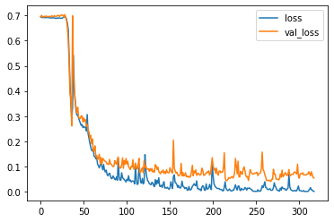

``` python
# Plot the accuracy too
plt.plot(r.history['accuracy'], label='acc')
plt.plot(r.history['val_accuracy'], label='val_acc')
plt.legend()
```

    <matplotlib.legend.Legend at 0x7fec20e9fa20>

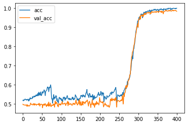

``` python
# Now try a LSTM with Global Max Pooling
inputs = np.expand_dims(X, -1)

# make the RNN
i = Input(shape=(T, D))

# method 2
x = LSTM(5, return_sequences=True)(i)
x = GlobalMaxPool1D()(x)

x = Dense(1, activation='sigmoid')(x)
model = Model(i, x)
model.compile(
  loss='binary_crossentropy',
  optimizer=Adam(lr=0.01),
  metrics=['accuracy'],
)

# train the RNN
r = model.fit(
  inputs, Y,
  epochs=100,
  validation_split=0.5,
)
```

    Epoch 1/100
    79/79 [==============================] - 1s 10ms/step - loss: 0.6922 - accuracy: 0.5128 - val_loss: 0.6952 - val_accuracy: 0.4960
    Epoch 2/100
    79/79 [==============================] - 1s 7ms/step - loss: 0.6920 - accuracy: 0.5256 - val_loss: 0.6938 - val_accuracy: 0.4916
    Epoch 3/100
    79/79 [==============================] - 1s 7ms/step - loss: 0.6920 - accuracy: 0.5256 - val_loss: 0.6938 - val_accuracy: 0.4916
    Epoch 4/100
    79/79 [==============================] - 1s 7ms/step - loss: 0.6916 - accuracy: 0.5188 - val_loss: 0.6934 - val_accuracy: 0.4920
    Epoch 5/100
    79/79 [==============================] - 1s 7ms/step - loss: 0.6906 - accuracy: 0.5200 - val_loss: 0.7001 - val_accuracy: 0.4960
    Epoch 6/100
    79/79 [==============================] - 1s 7ms/step - loss: 0.6898 - accuracy: 0.5216 - val_loss: 0.6995 - val_accuracy: 0.4924
    Epoch 7/100
    79/79 [==============================] - 1s 7ms/step - loss: 0.6900 - accuracy: 0.5120 - val_loss: 0.7016 - val_accuracy: 0.4916
    Epoch 8/100
    79/79 [==============================] - 1s 7ms/step - loss: 0.6862 - accuracy: 0.5516 - val_loss: 0.6866 - val_accuracy: 0.5744
    Epoch 9/100
    79/79 [==============================] - 1s 7ms/step - loss: 0.6788 - accuracy: 0.5668 - val_loss: 0.6845 - val_accuracy: 0.5476
    Epoch 10/100
    79/79 [==============================] - 1s 7ms/step - loss: 0.6640 - accuracy: 0.6072 - val_loss: 0.6606 - val_accuracy: 0.6100
    Epoch 11/100
    79/79 [==============================] - 1s 7ms/step - loss: 0.6728 - accuracy: 0.5720 - val_loss: 0.6956 - val_accuracy: 0.5208
    Epoch 12/100
    79/79 [==============================] - 1s 7ms/step - loss: 0.6911 - accuracy: 0.5244 - val_loss: 0.6947 - val_accuracy: 0.5100
    Epoch 13/100
    79/79 [==============================] - 1s 7ms/step - loss: 0.6892 - accuracy: 0.5428 - val_loss: 0.6953 - val_accuracy: 0.5160
    Epoch 14/100
    79/79 [==============================] - 1s 7ms/step - loss: 0.6879 - accuracy: 0.5524 - val_loss: 0.6920 - val_accuracy: 0.5348
    Epoch 15/100
    79/79 [==============================] - 1s 7ms/step - loss: 0.6851 - accuracy: 0.5516 - val_loss: 0.6950 - val_accuracy: 0.5072
    Epoch 16/100
    79/79 [==============================] - 1s 7ms/step - loss: 0.6837 - accuracy: 0.5624 - val_loss: 0.6968 - val_accuracy: 0.5120
    Epoch 17/100
    79/79 [==============================] - 1s 7ms/step - loss: 0.6834 - accuracy: 0.5360 - val_loss: 0.6892 - val_accuracy: 0.5148
    Epoch 18/100
    79/79 [==============================] - 1s 7ms/step - loss: 0.6794 - accuracy: 0.5340 - val_loss: 0.6846 - val_accuracy: 0.5392
    Epoch 19/100
    79/79 [==============================] - 1s 6ms/step - loss: 0.6782 - accuracy: 0.5444 - val_loss: 0.6825 - val_accuracy: 0.5424
    Epoch 20/100
    79/79 [==============================] - 1s 7ms/step - loss: 0.6752 - accuracy: 0.5480 - val_loss: 0.6802 - val_accuracy: 0.5260
    Epoch 21/100
    79/79 [==============================] - 1s 7ms/step - loss: 0.6711 - accuracy: 0.5364 - val_loss: 0.6748 - val_accuracy: 0.5260
    Epoch 22/100
    79/79 [==============================] - 1s 7ms/step - loss: 0.6654 - accuracy: 0.5416 - val_loss: 0.6752 - val_accuracy: 0.5176
    Epoch 23/100
    79/79 [==============================] - 1s 7ms/step - loss: 0.6588 - accuracy: 0.5520 - val_loss: 0.6679 - val_accuracy: 0.5388
    Epoch 24/100
    79/79 [==============================] - 1s 7ms/step - loss: 0.6531 - accuracy: 0.5648 - val_loss: 0.6652 - val_accuracy: 0.5416
    Epoch 25/100
    79/79 [==============================] - 1s 7ms/step - loss: 0.6462 - accuracy: 0.5728 - val_loss: 0.6525 - val_accuracy: 0.5784
    Epoch 26/100
    79/79 [==============================] - 1s 7ms/step - loss: 0.6396 - accuracy: 0.5880 - val_loss: 0.6378 - val_accuracy: 0.6028
    Epoch 27/100
    79/79 [==============================] - 1s 7ms/step - loss: 0.6258 - accuracy: 0.6152 - val_loss: 0.6318 - val_accuracy: 0.6208
    Epoch 28/100
    79/79 [==============================] - 1s 7ms/step - loss: 0.6056 - accuracy: 0.6636 - val_loss: 0.5923 - val_accuracy: 0.6812
    Epoch 29/100
    79/79 [==============================] - 1s 7ms/step - loss: 0.5701 - accuracy: 0.7096 - val_loss: 0.5999 - val_accuracy: 0.6684
    Epoch 30/100
    79/79 [==============================] - 1s 7ms/step - loss: 0.5357 - accuracy: 0.7500 - val_loss: 0.5204 - val_accuracy: 0.7716
    Epoch 31/100
    79/79 [==============================] - 1s 7ms/step - loss: 0.5005 - accuracy: 0.7652 - val_loss: 0.5802 - val_accuracy: 0.7012
    Epoch 32/100
    79/79 [==============================] - 1s 7ms/step - loss: 0.5468 - accuracy: 0.7332 - val_loss: 0.5303 - val_accuracy: 0.7600
    Epoch 33/100
    79/79 [==============================] - 1s 7ms/step - loss: 0.4894 - accuracy: 0.7704 - val_loss: 0.4789 - val_accuracy: 0.8024
    Epoch 34/100
    79/79 [==============================] - 1s 6ms/step - loss: 0.4361 - accuracy: 0.8068 - val_loss: 0.4265 - val_accuracy: 0.8304
    Epoch 35/100
    79/79 [==============================] - 1s 7ms/step - loss: 0.3958 - accuracy: 0.8424 - val_loss: 0.4039 - val_accuracy: 0.8512
    Epoch 36/100
    79/79 [==============================] - 1s 7ms/step - loss: 0.3591 - accuracy: 0.8604 - val_loss: 0.3483 - val_accuracy: 0.8824
    Epoch 37/100
    79/79 [==============================] - 1s 7ms/step - loss: 0.3223 - accuracy: 0.8788 - val_loss: 0.3191 - val_accuracy: 0.8828
    Epoch 38/100
    79/79 [==============================] - 1s 7ms/step - loss: 0.3949 - accuracy: 0.8412 - val_loss: 0.3870 - val_accuracy: 0.8552
    Epoch 39/100
    79/79 [==============================] - 1s 7ms/step - loss: 0.3276 - accuracy: 0.8852 - val_loss: 0.3033 - val_accuracy: 0.9040
    Epoch 40/100
    79/79 [==============================] - 1s 7ms/step - loss: 0.2861 - accuracy: 0.8992 - val_loss: 0.2872 - val_accuracy: 0.8984
    Epoch 41/100
    79/79 [==============================] - 1s 7ms/step - loss: 0.2709 - accuracy: 0.9060 - val_loss: 0.2601 - val_accuracy: 0.9104
    Epoch 42/100
    79/79 [==============================] - 1s 7ms/step - loss: 0.2476 - accuracy: 0.9088 - val_loss: 0.2502 - val_accuracy: 0.9128
    Epoch 43/100
    79/79 [==============================] - 1s 7ms/step - loss: 0.2438 - accuracy: 0.9152 - val_loss: 0.2460 - val_accuracy: 0.9124
    Epoch 44/100
    79/79 [==============================] - 1s 7ms/step - loss: 0.2410 - accuracy: 0.9128 - val_loss: 0.2703 - val_accuracy: 0.9072
    Epoch 45/100
    79/79 [==============================] - 1s 7ms/step - loss: 0.2333 - accuracy: 0.9188 - val_loss: 0.2288 - val_accuracy: 0.9252
    Epoch 46/100
    79/79 [==============================] - 1s 7ms/step - loss: 0.2147 - accuracy: 0.9244 - val_loss: 0.2322 - val_accuracy: 0.9192
    Epoch 47/100
    79/79 [==============================] - 1s 7ms/step - loss: 0.2729 - accuracy: 0.8940 - val_loss: 0.3241 - val_accuracy: 0.8808
    Epoch 48/100
    79/79 [==============================] - 1s 7ms/step - loss: 0.2782 - accuracy: 0.8868 - val_loss: 0.2404 - val_accuracy: 0.9212
    Epoch 49/100
    79/79 [==============================] - 1s 7ms/step - loss: 0.2247 - accuracy: 0.9220 - val_loss: 0.2149 - val_accuracy: 0.9364
    Epoch 50/100
    79/79 [==============================] - 1s 7ms/step - loss: 0.2006 - accuracy: 0.9340 - val_loss: 0.1975 - val_accuracy: 0.9432
    Epoch 51/100
    79/79 [==============================] - 1s 7ms/step - loss: 0.1819 - accuracy: 0.9424 - val_loss: 0.1847 - val_accuracy: 0.9492
    Epoch 52/100
    79/79 [==============================] - 1s 7ms/step - loss: 0.1808 - accuracy: 0.9400 - val_loss: 0.1770 - val_accuracy: 0.9460
    Epoch 53/100
    79/79 [==============================] - 1s 7ms/step - loss: 0.1819 - accuracy: 0.9396 - val_loss: 0.1812 - val_accuracy: 0.9496
    Epoch 54/100
    79/79 [==============================] - 1s 7ms/step - loss: 0.1610 - accuracy: 0.9484 - val_loss: 0.1729 - val_accuracy: 0.9516
    Epoch 55/100
    79/79 [==============================] - 1s 7ms/step - loss: 0.1583 - accuracy: 0.9480 - val_loss: 0.1687 - val_accuracy: 0.9524
    Epoch 56/100
    79/79 [==============================] - 1s 7ms/step - loss: 0.1474 - accuracy: 0.9484 - val_loss: 0.1795 - val_accuracy: 0.9452
    Epoch 57/100
    79/79 [==============================] - 1s 7ms/step - loss: 0.1531 - accuracy: 0.9440 - val_loss: 0.1821 - val_accuracy: 0.9504
    Epoch 58/100
    79/79 [==============================] - 1s 7ms/step - loss: 0.1545 - accuracy: 0.9488 - val_loss: 0.1570 - val_accuracy: 0.9532
    Epoch 59/100
    79/79 [==============================] - 1s 7ms/step - loss: 0.1374 - accuracy: 0.9520 - val_loss: 0.1556 - val_accuracy: 0.9528
    Epoch 60/100
    79/79 [==============================] - 1s 7ms/step - loss: 0.1329 - accuracy: 0.9516 - val_loss: 0.1441 - val_accuracy: 0.9580
    Epoch 61/100
    79/79 [==============================] - 1s 7ms/step - loss: 0.1282 - accuracy: 0.9556 - val_loss: 0.1637 - val_accuracy: 0.9556
    Epoch 62/100
    79/79 [==============================] - 1s 7ms/step - loss: 0.1489 - accuracy: 0.9568 - val_loss: 0.1428 - val_accuracy: 0.9516
    Epoch 63/100
    79/79 [==============================] - 1s 7ms/step - loss: 0.1164 - accuracy: 0.9588 - val_loss: 0.1803 - val_accuracy: 0.9516
    Epoch 64/100
    79/79 [==============================] - 1s 7ms/step - loss: 0.2297 - accuracy: 0.9368 - val_loss: 0.1882 - val_accuracy: 0.9500
    Epoch 65/100
    79/79 [==============================] - 1s 7ms/step - loss: 0.1285 - accuracy: 0.9552 - val_loss: 0.1299 - val_accuracy: 0.9576
    Epoch 66/100
    79/79 [==============================] - 1s 7ms/step - loss: 0.1113 - accuracy: 0.9624 - val_loss: 0.1390 - val_accuracy: 0.9596
    Epoch 67/100
    79/79 [==============================] - 1s 7ms/step - loss: 0.1054 - accuracy: 0.9660 - val_loss: 0.1181 - val_accuracy: 0.9628
    Epoch 68/100
    79/79 [==============================] - 1s 7ms/step - loss: 0.1078 - accuracy: 0.9672 - val_loss: 0.1155 - val_accuracy: 0.9640
    Epoch 69/100
    79/79 [==============================] - 1s 7ms/step - loss: 0.1340 - accuracy: 0.9636 - val_loss: 0.1945 - val_accuracy: 0.9488
    Epoch 70/100
    79/79 [==============================] - 1s 7ms/step - loss: 0.1208 - accuracy: 0.9564 - val_loss: 0.1208 - val_accuracy: 0.9636
    Epoch 71/100
    79/79 [==============================] - 1s 7ms/step - loss: 0.1188 - accuracy: 0.9604 - val_loss: 0.1047 - val_accuracy: 0.9664
    Epoch 72/100
    79/79 [==============================] - 1s 7ms/step - loss: 0.1027 - accuracy: 0.9660 - val_loss: 0.1066 - val_accuracy: 0.9668
    Epoch 73/100
    79/79 [==============================] - 1s 7ms/step - loss: 0.0941 - accuracy: 0.9736 - val_loss: 0.0951 - val_accuracy: 0.9708
    Epoch 74/100
    79/79 [==============================] - 1s 7ms/step - loss: 0.0874 - accuracy: 0.9716 - val_loss: 0.0990 - val_accuracy: 0.9668
    Epoch 75/100
    79/79 [==============================] - 1s 7ms/step - loss: 0.0855 - accuracy: 0.9720 - val_loss: 0.1011 - val_accuracy: 0.9688
    Epoch 76/100
    79/79 [==============================] - 1s 7ms/step - loss: 0.1028 - accuracy: 0.9692 - val_loss: 0.1240 - val_accuracy: 0.9628
    Epoch 77/100
    79/79 [==============================] - 1s 7ms/step - loss: 0.0825 - accuracy: 0.9720 - val_loss: 0.1017 - val_accuracy: 0.9736
    Epoch 78/100
    79/79 [==============================] - 1s 7ms/step - loss: 0.0786 - accuracy: 0.9748 - val_loss: 0.0949 - val_accuracy: 0.9704
    Epoch 79/100
    79/79 [==============================] - 1s 7ms/step - loss: 0.0777 - accuracy: 0.9764 - val_loss: 0.1001 - val_accuracy: 0.9728
    Epoch 80/100
    79/79 [==============================] - 1s 7ms/step - loss: 0.0846 - accuracy: 0.9736 - val_loss: 0.0992 - val_accuracy: 0.9672
    Epoch 81/100
    79/79 [==============================] - 1s 7ms/step - loss: 0.0718 - accuracy: 0.9804 - val_loss: 0.0954 - val_accuracy: 0.9700
    Epoch 82/100
    79/79 [==============================] - 1s 7ms/step - loss: 0.0698 - accuracy: 0.9788 - val_loss: 0.0893 - val_accuracy: 0.9728
    Epoch 83/100
    79/79 [==============================] - 1s 7ms/step - loss: 0.0633 - accuracy: 0.9820 - val_loss: 0.0924 - val_accuracy: 0.9732
    Epoch 84/100
    79/79 [==============================] - 1s 7ms/step - loss: 0.0630 - accuracy: 0.9816 - val_loss: 0.0772 - val_accuracy: 0.9760
    Epoch 85/100
    79/79 [==============================] - 1s 7ms/step - loss: 0.1032 - accuracy: 0.9664 - val_loss: 0.0859 - val_accuracy: 0.9744
    Epoch 86/100
    79/79 [==============================] - 1s 7ms/step - loss: 0.0643 - accuracy: 0.9812 - val_loss: 0.0761 - val_accuracy: 0.9744
    Epoch 87/100
    79/79 [==============================] - 1s 7ms/step - loss: 0.0599 - accuracy: 0.9828 - val_loss: 0.0722 - val_accuracy: 0.9756
    Epoch 88/100
    79/79 [==============================] - 1s 7ms/step - loss: 0.0601 - accuracy: 0.9812 - val_loss: 0.0712 - val_accuracy: 0.9788
    Epoch 89/100
    79/79 [==============================] - 1s 7ms/step - loss: 0.0545 - accuracy: 0.9816 - val_loss: 0.0688 - val_accuracy: 0.9780
    Epoch 90/100
    79/79 [==============================] - 1s 7ms/step - loss: 0.0505 - accuracy: 0.9848 - val_loss: 0.0739 - val_accuracy: 0.9796
    Epoch 91/100
    79/79 [==============================] - 1s 7ms/step - loss: 0.0502 - accuracy: 0.9848 - val_loss: 0.0864 - val_accuracy: 0.9764
    Epoch 92/100
    79/79 [==============================] - 1s 7ms/step - loss: 0.0772 - accuracy: 0.9724 - val_loss: 0.0678 - val_accuracy: 0.9780
    Epoch 93/100
    79/79 [==============================] - 1s 7ms/step - loss: 0.0572 - accuracy: 0.9800 - val_loss: 0.0756 - val_accuracy: 0.9772
    Epoch 94/100
    79/79 [==============================] - 1s 7ms/step - loss: 0.0530 - accuracy: 0.9804 - val_loss: 0.0852 - val_accuracy: 0.9780
    Epoch 95/100
    79/79 [==============================] - 1s 7ms/step - loss: 0.0543 - accuracy: 0.9796 - val_loss: 0.0818 - val_accuracy: 0.9776
    Epoch 96/100
    79/79 [==============================] - 1s 7ms/step - loss: 0.0487 - accuracy: 0.9840 - val_loss: 0.0531 - val_accuracy: 0.9792
    Epoch 97/100
    79/79 [==============================] - 1s 7ms/step - loss: 0.0526 - accuracy: 0.9852 - val_loss: 0.0644 - val_accuracy: 0.9804
    Epoch 98/100
    79/79 [==============================] - 1s 7ms/step - loss: 0.0445 - accuracy: 0.9856 - val_loss: 0.0567 - val_accuracy: 0.9796
    Epoch 99/100
    79/79 [==============================] - 1s 7ms/step - loss: 0.1566 - accuracy: 0.9680 - val_loss: 0.4206 - val_accuracy: 0.8924
    Epoch 100/100
    79/79 [==============================] - 1s 7ms/step - loss: 1.0968 - accuracy: 0.7592 - val_loss: 1.0851 - val_accuracy: 0.6596

``` python
# Plot the loss
plt.plot(r.history['loss'], label='loss')
plt.plot(r.history['val_loss'], label='val_loss')
plt.legend()
```

    <matplotlib.legend.Legend at 0x7fec209687b8>

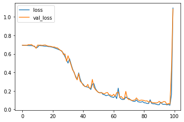

``` python
# Plot the accuracy too
plt.plot(r.history['accuracy'], label='acc')
plt.plot(r.history['val_accuracy'], label='val_acc')
plt.legend()
```

    <matplotlib.legend.Legend at 0x7fec20a92780>

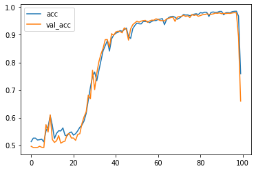

<center>

<a href=''>  </a>

</center>
<center>
<em>Copyright Qalmaqihir</em>
</center>
<center>
<em>For more information, visit us at
<a href='http://www.github.com/qalmaqihir/'>www.github.com/qalmaqihir/</a></em>
</center>
