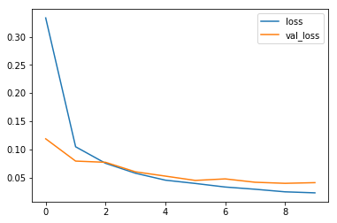
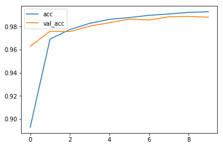
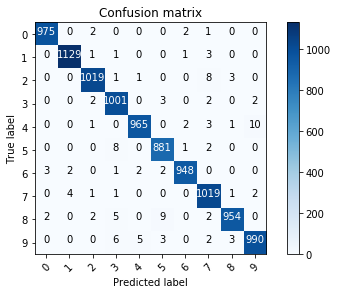
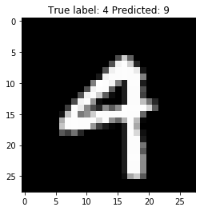

================
by Jawad Haider

- <a href="#rnn-mnist" id="toc-rnn-mnist">RNN MNIST</a>

## RNN MNIST

``` python
# Install TensorFlow
# !pip install -q tensorflow-gpu==2.0.0-beta1

try:
  %tensorflow_version 2.x  # Colab only.
except Exception:
  pass

import tensorflow as tf
print(tf.__version__)
```

         |████████████████████████████████| 348.9MB 70kB/s 
         |████████████████████████████████| 3.1MB 33.3MB/s 
         |████████████████████████████████| 501kB 41.2MB/s 
    2.0.0-beta1

``` python
# Load in the data
mnist = tf.keras.datasets.mnist

(x_train, y_train), (x_test, y_test) = mnist.load_data()
x_train, x_test = x_train / 255.0, x_test / 255.0
print("x_train.shape:", x_train.shape)
```

    Downloading data from https://storage.googleapis.com/tensorflow/tf-keras-datasets/mnist.npz
    11493376/11490434 [==============================] - 0s 0us/step
    x_train.shape: (60000, 28, 28)

``` python
# Build the model
i = Input(shape=x_train[0].shape)
x = LSTM(128)(i)
x = Dense(10, activation='softmax')(x)

model = Model(i, x)
```

``` python
# Compile and train
model.compile(optimizer='adam',
              loss='sparse_categorical_crossentropy',
              metrics=['accuracy'])
r = model.fit(x_train, y_train, validation_data=(x_test, y_test), epochs=10)
```

    WARNING: Logging before flag parsing goes to stderr.
    W0803 17:03:38.451040 140542585788288 deprecation.py:323] From /usr/local/lib/python3.6/dist-packages/tensorflow/python/ops/math_grad.py:1250: add_dispatch_support.<locals>.wrapper (from tensorflow.python.ops.array_ops) is deprecated and will be removed in a future version.
    Instructions for updating:
    Use tf.where in 2.0, which has the same broadcast rule as np.where

    Train on 60000 samples, validate on 10000 samples
    Epoch 1/10
    60000/60000 [==============================] - 25s 411us/sample - loss: 0.3334 - accuracy: 0.8929 - val_loss: 0.1187 - val_accuracy: 0.9629
    Epoch 2/10
    60000/60000 [==============================] - 21s 354us/sample - loss: 0.1046 - accuracy: 0.9692 - val_loss: 0.0792 - val_accuracy: 0.9759
    Epoch 3/10
    60000/60000 [==============================] - 21s 357us/sample - loss: 0.0753 - accuracy: 0.9774 - val_loss: 0.0770 - val_accuracy: 0.9756
    Epoch 4/10
    60000/60000 [==============================] - 22s 359us/sample - loss: 0.0576 - accuracy: 0.9827 - val_loss: 0.0601 - val_accuracy: 0.9803
    Epoch 5/10
    60000/60000 [==============================] - 21s 358us/sample - loss: 0.0453 - accuracy: 0.9862 - val_loss: 0.0525 - val_accuracy: 0.9833
    Epoch 6/10
    60000/60000 [==============================] - 21s 353us/sample - loss: 0.0395 - accuracy: 0.9877 - val_loss: 0.0448 - val_accuracy: 0.9864
    Epoch 7/10
    60000/60000 [==============================] - 21s 352us/sample - loss: 0.0331 - accuracy: 0.9897 - val_loss: 0.0476 - val_accuracy: 0.9857
    Epoch 8/10
    60000/60000 [==============================] - 21s 353us/sample - loss: 0.0292 - accuracy: 0.9908 - val_loss: 0.0416 - val_accuracy: 0.9884
    Epoch 9/10
    60000/60000 [==============================] - 21s 357us/sample - loss: 0.0246 - accuracy: 0.9923 - val_loss: 0.0397 - val_accuracy: 0.9887
    Epoch 10/10
    60000/60000 [==============================] - 21s 356us/sample - loss: 0.0228 - accuracy: 0.9927 - val_loss: 0.0409 - val_accuracy: 0.9881

``` python
# Plot loss per iteration
import matplotlib.pyplot as plt
plt.plot(r.history['loss'], label='loss')
plt.plot(r.history['val_loss'], label='val_loss')
plt.legend()
```

    <matplotlib.legend.Legend at 0x7fd1e8624a58>



``` python
# Plot accuracy per iteration
plt.plot(r.history['accuracy'], label='acc')
plt.plot(r.history['val_accuracy'], label='val_acc')
plt.legend()
```

    <matplotlib.legend.Legend at 0x7fd1e5dd0358>



``` python
# Plot confusion matrix
from sklearn.metrics import confusion_matrix
import numpy as np
import itertools

def plot_confusion_matrix(cm, classes,
                          normalize=False,
                          title='Confusion matrix',
                          cmap=plt.cm.Blues):
  """
  This function prints and plots the confusion matrix.
  Normalization can be applied by setting `normalize=True`.
  """
  if normalize:
      cm = cm.astype('float') / cm.sum(axis=1)[:, np.newaxis]
      print("Normalized confusion matrix")
  else:
      print('Confusion matrix, without normalization')

  print(cm)

  plt.imshow(cm, interpolation='nearest', cmap=cmap)
  plt.title(title)
  plt.colorbar()
  tick_marks = np.arange(len(classes))
  plt.xticks(tick_marks, classes, rotation=45)
  plt.yticks(tick_marks, classes)

  fmt = '.2f' if normalize else 'd'
  thresh = cm.max() / 2.
  for i, j in itertools.product(range(cm.shape[0]), range(cm.shape[1])):
      plt.text(j, i, format(cm[i, j], fmt),
               horizontalalignment="center",
               color="white" if cm[i, j] > thresh else "black")

  plt.tight_layout()
  plt.ylabel('True label')
  plt.xlabel('Predicted label')
  plt.show()


p_test = model.predict(x_test).argmax(axis=1)
cm = confusion_matrix(y_test, p_test)
plot_confusion_matrix(cm, list(range(10)))

# Do these results make sense?
# It's easy to confuse 9 <--> 4, 9 <--> 7, 2 <--> 7, etc. 
```

    Confusion matrix, without normalization
    [[ 975    0    2    0    0    0    2    1    0    0]
     [   0 1129    1    1    0    0    1    3    0    0]
     [   0    0 1019    1    1    0    0    8    3    0]
     [   0    0    2 1001    0    3    0    2    0    2]
     [   0    0    1    0  965    0    2    3    1   10]
     [   0    0    0    8    0  881    1    2    0    0]
     [   3    2    0    1    2    2  948    0    0    0]
     [   0    4    1    1    0    0    0 1019    1    2]
     [   2    0    2    5    0    9    0    2  954    0]
     [   0    0    0    6    5    3    0    2    3  990]]



``` python
# Show some misclassified examples
misclassified_idx = np.where(p_test != y_test)[0]
i = np.random.choice(misclassified_idx)
plt.imshow(x_test[i], cmap='gray')
plt.title("True label: %s Predicted: %s" % (y_test[i], p_test[i]));
```



<center>

<a href=''>  </a>

</center>
<center>
<em>Copyright Qalmaqihir</em>
</center>
<center>
<em>For more information, visit us at
<a href='http://www.github.com/qalmaqihir/'>www.github.com/qalmaqihir/</a></em>
</center>
