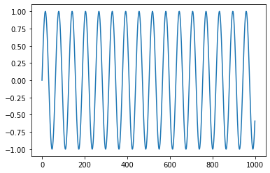
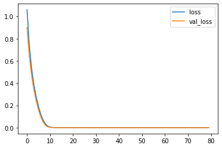
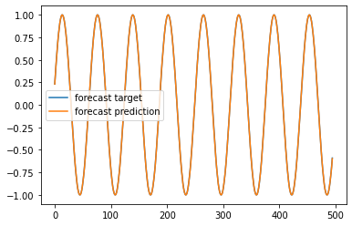
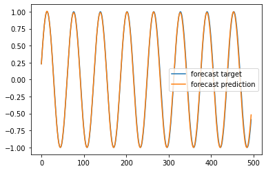

================
by Jawad Haider

- <a href="#simple-rnn-sine" id="toc-simple-rnn-sine">Simple RNN
  (sine)</a>

## Simple RNN (sine)

``` python
# Install TensorFlow
# !pip install -q tensorflow-gpu==2.0.0-beta1

try:
  %tensorflow_version 2.x  # Colab only.
except Exception:
  pass

import tensorflow as tf
print(tf.__version__)
```

    `%tensorflow_version` only switches the major version: 1.x or 2.x.
    You set: `2.x  # Colab only.`. This will be interpreted as: `2.x`.


    TensorFlow is already loaded. Please restart the runtime to change versions.
    2.2.0-rc2

``` python
from tensorflow.keras.layers import Input, SimpleRNN, Dense, Flatten
from tensorflow.keras.models import Model
from tensorflow.keras.optimizers import SGD, Adam

import numpy as np
import pandas as pd
import matplotlib.pyplot as plt
```

``` python
# make the original data
series = np.sin(0.1*np.arange(1000)) #+ np.random.randn(200)*0.1

# plot it
plt.plot(series)
plt.show()
```



``` python
### build the dataset
# let's see if we can use T past values to predict the next value
T = 10
D = 1
X = []
Y = []
for t in range(len(series) - T):
  x = series[t:t+T]
  X.append(x)
  y = series[t+T]
  Y.append(y)

X = np.array(X).reshape(-1, T, 1) # Now the data should be N x T x D
Y = np.array(Y)
N = len(X)
print("X.shape", X.shape, "Y.shape", Y.shape)
```

    X.shape (990, 10, 1) Y.shape (990,)

``` python
### try autoregressive RNN model
i = Input(shape=(T, 1))
x = SimpleRNN(15, activation='relu')(i)
x = Dense(1)(x)
model = Model(i, x)
model.compile(
  loss='mse',
  optimizer=Adam(lr=0.001),
)

# train the RNN
r = model.fit(
  X[:-N//2], Y[:-N//2],
  epochs=80,
  validation_data=(X[-N//2:], Y[-N//2:]),
)
```

    Epoch 1/80
    16/16 [==============================] - 0s 18ms/step - loss: 1.0602 - val_loss: 0.9011
    Epoch 2/80
    16/16 [==============================] - 0s 11ms/step - loss: 0.7332 - val_loss: 0.6423
    Epoch 3/80
    16/16 [==============================] - 0s 11ms/step - loss: 0.5313 - val_loss: 0.4673
    Epoch 4/80
    16/16 [==============================] - 0s 11ms/step - loss: 0.3822 - val_loss: 0.3390
    Epoch 5/80
    16/16 [==============================] - 0s 11ms/step - loss: 0.2761 - val_loss: 0.2398
    Epoch 6/80
    16/16 [==============================] - 0s 11ms/step - loss: 0.1896 - val_loss: 0.1587
    Epoch 7/80
    16/16 [==============================] - 0s 10ms/step - loss: 0.1180 - val_loss: 0.0952
    Epoch 8/80
    16/16 [==============================] - 0s 11ms/step - loss: 0.0677 - val_loss: 0.0502
    Epoch 9/80
    16/16 [==============================] - 0s 11ms/step - loss: 0.0335 - val_loss: 0.0208
    Epoch 10/80
    16/16 [==============================] - 0s 12ms/step - loss: 0.0134 - val_loss: 0.0081
    Epoch 11/80
    16/16 [==============================] - 0s 10ms/step - loss: 0.0055 - val_loss: 0.0032
    Epoch 12/80
    16/16 [==============================] - 0s 10ms/step - loss: 0.0022 - val_loss: 0.0012
    Epoch 13/80
    16/16 [==============================] - 0s 13ms/step - loss: 0.0010 - val_loss: 7.2874e-04
    Epoch 14/80
    16/16 [==============================] - 0s 10ms/step - loss: 6.3184e-04 - val_loss: 5.0028e-04
    Epoch 15/80
    16/16 [==============================] - 0s 11ms/step - loss: 4.2787e-04 - val_loss: 3.4568e-04
    Epoch 16/80
    16/16 [==============================] - 0s 11ms/step - loss: 3.1279e-04 - val_loss: 2.7649e-04
    Epoch 17/80
    16/16 [==============================] - 0s 10ms/step - loss: 2.4441e-04 - val_loss: 2.3303e-04
    Epoch 18/80
    16/16 [==============================] - 0s 12ms/step - loss: 2.2058e-04 - val_loss: 2.0768e-04
    Epoch 19/80
    16/16 [==============================] - 0s 11ms/step - loss: 1.9065e-04 - val_loss: 1.8392e-04
    Epoch 20/80
    16/16 [==============================] - 0s 10ms/step - loss: 1.7215e-04 - val_loss: 1.6563e-04
    Epoch 21/80
    16/16 [==============================] - 0s 11ms/step - loss: 1.5594e-04 - val_loss: 1.5306e-04
    Epoch 22/80
    16/16 [==============================] - 0s 11ms/step - loss: 1.4406e-04 - val_loss: 1.4254e-04
    Epoch 23/80
    16/16 [==============================] - 0s 11ms/step - loss: 1.3454e-04 - val_loss: 1.4183e-04
    Epoch 24/80
    16/16 [==============================] - 0s 11ms/step - loss: 1.3729e-04 - val_loss: 1.2434e-04
    Epoch 25/80
    16/16 [==============================] - 0s 12ms/step - loss: 1.2109e-04 - val_loss: 1.1460e-04
    Epoch 26/80
    16/16 [==============================] - 0s 10ms/step - loss: 1.1244e-04 - val_loss: 1.1472e-04
    Epoch 27/80
    16/16 [==============================] - 0s 10ms/step - loss: 1.0749e-04 - val_loss: 1.1334e-04
    Epoch 28/80
    16/16 [==============================] - 0s 10ms/step - loss: 1.0260e-04 - val_loss: 9.5891e-05
    Epoch 29/80
    16/16 [==============================] - 0s 11ms/step - loss: 9.2391e-05 - val_loss: 8.9984e-05
    Epoch 30/80
    16/16 [==============================] - 0s 11ms/step - loss: 8.6465e-05 - val_loss: 8.5319e-05
    Epoch 31/80
    16/16 [==============================] - 0s 11ms/step - loss: 8.2860e-05 - val_loss: 8.1269e-05
    Epoch 32/80
    16/16 [==============================] - 0s 10ms/step - loss: 8.3502e-05 - val_loss: 7.7294e-05
    Epoch 33/80
    16/16 [==============================] - 0s 11ms/step - loss: 7.8006e-05 - val_loss: 7.7529e-05
    Epoch 34/80
    16/16 [==============================] - 0s 11ms/step - loss: 7.2876e-05 - val_loss: 7.2808e-05
    Epoch 35/80
    16/16 [==============================] - 0s 11ms/step - loss: 7.1062e-05 - val_loss: 6.9914e-05
    Epoch 36/80
    16/16 [==============================] - 0s 11ms/step - loss: 7.2599e-05 - val_loss: 6.8395e-05
    Epoch 37/80
    16/16 [==============================] - 0s 11ms/step - loss: 6.3187e-05 - val_loss: 6.1742e-05
    Epoch 38/80
    16/16 [==============================] - 0s 11ms/step - loss: 6.2401e-05 - val_loss: 6.1536e-05
    Epoch 39/80
    16/16 [==============================] - 0s 11ms/step - loss: 6.0000e-05 - val_loss: 5.6692e-05
    Epoch 40/80
    16/16 [==============================] - 0s 11ms/step - loss: 5.5932e-05 - val_loss: 5.8413e-05
    Epoch 41/80
    16/16 [==============================] - 0s 11ms/step - loss: 5.7132e-05 - val_loss: 5.4641e-05
    Epoch 42/80
    16/16 [==============================] - 0s 11ms/step - loss: 5.2083e-05 - val_loss: 5.3853e-05
    Epoch 43/80
    16/16 [==============================] - 0s 11ms/step - loss: 4.8307e-05 - val_loss: 4.9899e-05
    Epoch 44/80
    16/16 [==============================] - 0s 11ms/step - loss: 4.9699e-05 - val_loss: 4.6176e-05
    Epoch 45/80
    16/16 [==============================] - 0s 11ms/step - loss: 4.7037e-05 - val_loss: 4.7717e-05
    Epoch 46/80
    16/16 [==============================] - 0s 12ms/step - loss: 4.4639e-05 - val_loss: 4.2385e-05
    Epoch 47/80
    16/16 [==============================] - 0s 11ms/step - loss: 4.2696e-05 - val_loss: 4.0801e-05
    Epoch 48/80
    16/16 [==============================] - 0s 11ms/step - loss: 4.3489e-05 - val_loss: 4.0174e-05
    Epoch 49/80
    16/16 [==============================] - 0s 10ms/step - loss: 4.0366e-05 - val_loss: 3.9151e-05
    Epoch 50/80
    16/16 [==============================] - 0s 11ms/step - loss: 3.9470e-05 - val_loss: 3.7980e-05
    Epoch 51/80
    16/16 [==============================] - 0s 11ms/step - loss: 3.7470e-05 - val_loss: 4.0943e-05
    Epoch 52/80
    16/16 [==============================] - 0s 11ms/step - loss: 3.9431e-05 - val_loss: 3.5197e-05
    Epoch 53/80
    16/16 [==============================] - 0s 11ms/step - loss: 4.0079e-05 - val_loss: 3.3711e-05
    Epoch 54/80
    16/16 [==============================] - 0s 10ms/step - loss: 3.7805e-05 - val_loss: 3.7489e-05
    Epoch 55/80
    16/16 [==============================] - 0s 12ms/step - loss: 3.6745e-05 - val_loss: 3.3163e-05
    Epoch 56/80
    16/16 [==============================] - 0s 11ms/step - loss: 3.0924e-05 - val_loss: 2.8880e-05
    Epoch 57/80
    16/16 [==============================] - 0s 11ms/step - loss: 2.9857e-05 - val_loss: 2.8039e-05
    Epoch 58/80
    16/16 [==============================] - 0s 11ms/step - loss: 2.9824e-05 - val_loss: 3.1579e-05
    Epoch 59/80
    16/16 [==============================] - 0s 11ms/step - loss: 2.7642e-05 - val_loss: 2.6629e-05
    Epoch 60/80
    16/16 [==============================] - 0s 11ms/step - loss: 2.7216e-05 - val_loss: 2.5554e-05
    Epoch 61/80
    16/16 [==============================] - 0s 12ms/step - loss: 2.5181e-05 - val_loss: 2.4444e-05
    Epoch 62/80
    16/16 [==============================] - 0s 11ms/step - loss: 2.4672e-05 - val_loss: 2.3357e-05
    Epoch 63/80
    16/16 [==============================] - 0s 13ms/step - loss: 2.4355e-05 - val_loss: 2.2902e-05
    Epoch 64/80
    16/16 [==============================] - 0s 11ms/step - loss: 2.2696e-05 - val_loss: 2.1753e-05
    Epoch 65/80
    16/16 [==============================] - 0s 10ms/step - loss: 2.2524e-05 - val_loss: 2.1157e-05
    Epoch 66/80
    16/16 [==============================] - 0s 11ms/step - loss: 2.1685e-05 - val_loss: 2.1447e-05
    Epoch 67/80
    16/16 [==============================] - 0s 11ms/step - loss: 2.1650e-05 - val_loss: 2.2276e-05
    Epoch 68/80
    16/16 [==============================] - 0s 12ms/step - loss: 2.3310e-05 - val_loss: 1.9242e-05
    Epoch 69/80
    16/16 [==============================] - 0s 10ms/step - loss: 2.1571e-05 - val_loss: 2.1485e-05
    Epoch 70/80
    16/16 [==============================] - 0s 11ms/step - loss: 1.9481e-05 - val_loss: 1.9370e-05
    Epoch 71/80
    16/16 [==============================] - 0s 12ms/step - loss: 1.8170e-05 - val_loss: 1.9942e-05
    Epoch 72/80
    16/16 [==============================] - 0s 11ms/step - loss: 2.0107e-05 - val_loss: 1.9778e-05
    Epoch 73/80
    16/16 [==============================] - 0s 12ms/step - loss: 1.9879e-05 - val_loss: 2.0639e-05
    Epoch 74/80
    16/16 [==============================] - 0s 12ms/step - loss: 1.9376e-05 - val_loss: 1.8434e-05
    Epoch 75/80
    16/16 [==============================] - 0s 11ms/step - loss: 1.8296e-05 - val_loss: 1.7548e-05
    Epoch 76/80
    16/16 [==============================] - 0s 11ms/step - loss: 1.7476e-05 - val_loss: 1.5592e-05
    Epoch 77/80
    16/16 [==============================] - 0s 11ms/step - loss: 1.6514e-05 - val_loss: 1.5914e-05
    Epoch 78/80
    16/16 [==============================] - 0s 11ms/step - loss: 1.6950e-05 - val_loss: 1.4816e-05
    Epoch 79/80
    16/16 [==============================] - 0s 12ms/step - loss: 1.5287e-05 - val_loss: 1.4795e-05
    Epoch 80/80
    16/16 [==============================] - 0s 10ms/step - loss: 1.5042e-05 - val_loss: 1.4638e-05

``` python
# Plot loss per iteration
import matplotlib.pyplot as plt
plt.plot(r.history['loss'], label='loss')
plt.plot(r.history['val_loss'], label='val_loss')
plt.legend()
```

    <matplotlib.legend.Legend at 0x7f31202e5978>



``` python
# "Wrong" forecast using true targets

validation_target = Y[-N//2:]
validation_predictions = []

# index of first validation input
i = -N//2

while len(validation_predictions) < len(validation_target):
  p = model.predict(X[i].reshape(1, -1, 1))[0,0] # 1x1 array -> scalar
  i += 1
  
  # update the predictions list
  validation_predictions.append(p)
```

``` python
plt.plot(validation_target, label='forecast target')
plt.plot(validation_predictions, label='forecast prediction')
plt.legend()
```

    <matplotlib.legend.Legend at 0x7f31200508d0>



``` python
# Forecast future values (use only self-predictions for making future predictions)

validation_target = Y[-N//2:]
validation_predictions = []

# first validation input
last_x = X[-N//2] # 1-D array of length T

while len(validation_predictions) < len(validation_target):
  p = model.predict(last_x.reshape(1, -1, 1))[0,0] # 1x1 array -> scalar
  
  # update the predictions list
  validation_predictions.append(p)
  
  # make the new input
  last_x = np.roll(last_x, -1)
  last_x[-1] = p
```

``` python
plt.plot(validation_target, label='forecast target')
plt.plot(validation_predictions, label='forecast prediction')
plt.legend()
```

    <matplotlib.legend.Legend at 0x7f31065716a0>



<center>

<a href=''>  </a>

</center>
<center>
<em>Copyright Qalmaqihir</em>
</center>
<center>
<em>For more information, visit us at
<a href='http://www.github.com/qalmaqihir/'>www.github.com/qalmaqihir/</a></em>
</center>
