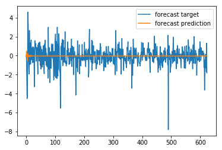

================
by Jawad Haider

- <a href="#stock-returns" id="toc-stock-returns">Stock Returns</a>

## Stock Returns

``` python
# Install TensorFlow
# !pip install -q tensorflow-gpu==2.0.0-beta1

try:
  %tensorflow_version 2.x  # Colab only.
except Exception:
  pass

import tensorflow as tf
print(tf.__version__)
```

    2.0.0-beta1

``` python
# More imports
from tensorflow.keras.layers import Input, LSTM, GRU, SimpleRNN, Dense, GlobalMaxPool1D
from tensorflow.keras.models import Model
from tensorflow.keras.optimizers import SGD, Adam

import numpy as np
import pandas as pd
import matplotlib.pyplot as plt
from sklearn.preprocessing import StandardScaler
```

``` python
# yes, you can read dataframes from URLs!
df = pd.read_csv('https://raw.githubusercontent.com/lazyprogrammer/machine_learning_examples/master/tf2.0/sbux.csv')
```

``` python
df.head()
```

<div>
<style scoped>
    .dataframe tbody tr th:only-of-type {
        vertical-align: middle;
    }

    .dataframe tbody tr th {
        vertical-align: top;
    }

    .dataframe thead th {
        text-align: right;
    }
</style>
<table border="1" class="dataframe">
  <thead>
    <tr style="text-align: right;">
      <th></th>
      <th>date</th>
      <th>open</th>
      <th>high</th>
      <th>low</th>
      <th>close</th>
      <th>volume</th>
      <th>Name</th>
    </tr>
  </thead>
  <tbody>
    <tr>
      <th>0</th>
      <td>2013-02-08</td>
      <td>27.920</td>
      <td>28.325</td>
      <td>27.920</td>
      <td>28.185</td>
      <td>7146296</td>
      <td>SBUX</td>
    </tr>
    <tr>
      <th>1</th>
      <td>2013-02-11</td>
      <td>28.260</td>
      <td>28.260</td>
      <td>27.930</td>
      <td>28.070</td>
      <td>5457354</td>
      <td>SBUX</td>
    </tr>
    <tr>
      <th>2</th>
      <td>2013-02-12</td>
      <td>28.000</td>
      <td>28.275</td>
      <td>27.975</td>
      <td>28.130</td>
      <td>8665592</td>
      <td>SBUX</td>
    </tr>
    <tr>
      <th>3</th>
      <td>2013-02-13</td>
      <td>28.230</td>
      <td>28.230</td>
      <td>27.750</td>
      <td>27.915</td>
      <td>7022056</td>
      <td>SBUX</td>
    </tr>
    <tr>
      <th>4</th>
      <td>2013-02-14</td>
      <td>27.765</td>
      <td>27.905</td>
      <td>27.675</td>
      <td>27.775</td>
      <td>8899188</td>
      <td>SBUX</td>
    </tr>
  </tbody>
</table>
</div>

``` python
df.tail()
```

<div>
<style scoped>
    .dataframe tbody tr th:only-of-type {
        vertical-align: middle;
    }

    .dataframe tbody tr th {
        vertical-align: top;
    }

    .dataframe thead th {
        text-align: right;
    }
</style>
<table border="1" class="dataframe">
  <thead>
    <tr style="text-align: right;">
      <th></th>
      <th>date</th>
      <th>open</th>
      <th>high</th>
      <th>low</th>
      <th>close</th>
      <th>volume</th>
      <th>Name</th>
    </tr>
  </thead>
  <tbody>
    <tr>
      <th>1254</th>
      <td>2018-02-01</td>
      <td>56.280</td>
      <td>56.42</td>
      <td>55.89</td>
      <td>56.00</td>
      <td>14690146</td>
      <td>SBUX</td>
    </tr>
    <tr>
      <th>1255</th>
      <td>2018-02-02</td>
      <td>55.900</td>
      <td>56.32</td>
      <td>55.70</td>
      <td>55.77</td>
      <td>15358909</td>
      <td>SBUX</td>
    </tr>
    <tr>
      <th>1256</th>
      <td>2018-02-05</td>
      <td>55.530</td>
      <td>56.26</td>
      <td>54.57</td>
      <td>54.69</td>
      <td>16059955</td>
      <td>SBUX</td>
    </tr>
    <tr>
      <th>1257</th>
      <td>2018-02-06</td>
      <td>53.685</td>
      <td>56.06</td>
      <td>53.56</td>
      <td>55.61</td>
      <td>17415065</td>
      <td>SBUX</td>
    </tr>
    <tr>
      <th>1258</th>
      <td>2018-02-07</td>
      <td>55.080</td>
      <td>55.43</td>
      <td>54.44</td>
      <td>54.46</td>
      <td>13927022</td>
      <td>SBUX</td>
    </tr>
  </tbody>
</table>
</div>

``` python
# Start by doing the WRONG thing - trying to predict the price itself
series = df['close'].values.reshape(-1, 1)
```

``` python
# Normalize the data
# Note: I didn't think about where the true boundary is, this is just approx.
scaler = StandardScaler()
scaler.fit(series[:len(series) // 2])
series = scaler.transform(series).flatten()
```

``` python
### build the dataset
# let's see if we can use T past values to predict the next value
T = 10
D = 1
X = []
Y = []
for t in range(len(series) - T):
  x = series[t:t+T]
  X.append(x)
  y = series[t+T]
  Y.append(y)

X = np.array(X).reshape(-1, T, 1) # Now the data should be N x T x D
Y = np.array(Y)
N = len(X)
print("X.shape", X.shape, "Y.shape", Y.shape)
```

    X.shape (1249, 10, 1) Y.shape (1249,)

``` python
### try autoregressive RNN model
i = Input(shape=(T, 1))
x = LSTM(5)(i)
x = Dense(1)(x)
model = Model(i, x)
model.compile(
  loss='mse',
  optimizer=Adam(lr=0.1),
)

# train the RNN
r = model.fit(
  X[:-N//2], Y[:-N//2],
  epochs=80,
  validation_data=(X[-N//2:], Y[-N//2:]),
)
```

    Train on 624 samples, validate on 625 samples
    Epoch 1/80
    624/624 [==============================] - 2s 3ms/sample - loss: 0.2222 - val_loss: 0.1727
    Epoch 2/80
    624/624 [==============================] - 0s 223us/sample - loss: 0.0128 - val_loss: 0.0407
    Epoch 3/80
    624/624 [==============================] - 0s 210us/sample - loss: 0.0069 - val_loss: 0.0373
    Epoch 4/80
    624/624 [==============================] - 0s 213us/sample - loss: 0.0063 - val_loss: 0.0386
    Epoch 5/80
    624/624 [==============================] - 0s 234us/sample - loss: 0.0062 - val_loss: 0.0375
    Epoch 6/80
    624/624 [==============================] - 0s 214us/sample - loss: 0.0067 - val_loss: 0.0406
    Epoch 7/80
    624/624 [==============================] - 0s 217us/sample - loss: 0.0057 - val_loss: 0.0290
    Epoch 8/80
    624/624 [==============================] - 0s 220us/sample - loss: 0.0061 - val_loss: 0.0248
    Epoch 9/80
    624/624 [==============================] - 0s 223us/sample - loss: 0.0065 - val_loss: 0.0303
    Epoch 10/80
    624/624 [==============================] - 0s 211us/sample - loss: 0.0069 - val_loss: 0.0529
    Epoch 11/80
    624/624 [==============================] - 0s 210us/sample - loss: 0.0070 - val_loss: 0.0734
    Epoch 12/80
    624/624 [==============================] - 0s 209us/sample - loss: 0.0078 - val_loss: 0.0258
    Epoch 13/80
    624/624 [==============================] - 0s 232us/sample - loss: 0.0063 - val_loss: 0.0313
    Epoch 14/80
    624/624 [==============================] - 0s 213us/sample - loss: 0.0058 - val_loss: 0.0239
    Epoch 15/80
    624/624 [==============================] - 0s 218us/sample - loss: 0.0066 - val_loss: 0.0314
    Epoch 16/80
    624/624 [==============================] - 0s 208us/sample - loss: 0.0068 - val_loss: 0.0248
    Epoch 17/80
    624/624 [==============================] - 0s 208us/sample - loss: 0.0058 - val_loss: 0.0245
    Epoch 18/80
    624/624 [==============================] - 0s 209us/sample - loss: 0.0062 - val_loss: 0.0457
    Epoch 19/80
    624/624 [==============================] - 0s 208us/sample - loss: 0.0056 - val_loss: 0.0200
    Epoch 20/80
    624/624 [==============================] - 0s 242us/sample - loss: 0.0057 - val_loss: 0.0207
    Epoch 21/80
    624/624 [==============================] - 0s 207us/sample - loss: 0.0056 - val_loss: 0.0258
    Epoch 22/80
    624/624 [==============================] - 0s 218us/sample - loss: 0.0059 - val_loss: 0.0244
    Epoch 23/80
    624/624 [==============================] - 0s 205us/sample - loss: 0.0073 - val_loss: 0.0426
    Epoch 24/80
    624/624 [==============================] - 0s 205us/sample - loss: 0.0059 - val_loss: 0.0446
    Epoch 25/80
    624/624 [==============================] - 0s 209us/sample - loss: 0.0065 - val_loss: 0.0359
    Epoch 26/80
    624/624 [==============================] - 0s 216us/sample - loss: 0.0064 - val_loss: 0.0198
    Epoch 27/80
    624/624 [==============================] - 0s 213us/sample - loss: 0.0054 - val_loss: 0.0279
    Epoch 28/80
    624/624 [==============================] - 0s 225us/sample - loss: 0.0053 - val_loss: 0.0239
    Epoch 29/80
    624/624 [==============================] - 0s 207us/sample - loss: 0.0056 - val_loss: 0.0189
    Epoch 30/80
    624/624 [==============================] - 0s 208us/sample - loss: 0.0070 - val_loss: 0.0445
    Epoch 31/80
    624/624 [==============================] - 0s 215us/sample - loss: 0.0066 - val_loss: 0.0388
    Epoch 32/80
    624/624 [==============================] - 0s 211us/sample - loss: 0.0065 - val_loss: 0.0193
    Epoch 33/80
    624/624 [==============================] - 0s 208us/sample - loss: 0.0058 - val_loss: 0.0234
    Epoch 34/80
    624/624 [==============================] - 0s 210us/sample - loss: 0.0066 - val_loss: 0.0463
    Epoch 35/80
    624/624 [==============================] - 0s 204us/sample - loss: 0.0056 - val_loss: 0.0161
    Epoch 36/80
    624/624 [==============================] - 0s 229us/sample - loss: 0.0054 - val_loss: 0.0300
    Epoch 37/80
    624/624 [==============================] - 0s 217us/sample - loss: 0.0062 - val_loss: 0.0232
    Epoch 38/80
    624/624 [==============================] - 0s 212us/sample - loss: 0.0055 - val_loss: 0.0207
    Epoch 39/80
    624/624 [==============================] - 0s 213us/sample - loss: 0.0060 - val_loss: 0.0193
    Epoch 40/80
    624/624 [==============================] - 0s 217us/sample - loss: 0.0058 - val_loss: 0.0362
    Epoch 41/80
    624/624 [==============================] - 0s 210us/sample - loss: 0.0072 - val_loss: 0.0290
    Epoch 42/80
    624/624 [==============================] - 0s 210us/sample - loss: 0.0061 - val_loss: 0.0209
    Epoch 43/80
    624/624 [==============================] - 0s 227us/sample - loss: 0.0060 - val_loss: 0.0521
    Epoch 44/80
    624/624 [==============================] - 0s 210us/sample - loss: 0.0071 - val_loss: 0.0147
    Epoch 45/80
    624/624 [==============================] - 0s 218us/sample - loss: 0.0054 - val_loss: 0.0229
    Epoch 46/80
    624/624 [==============================] - 0s 220us/sample - loss: 0.0054 - val_loss: 0.0163
    Epoch 47/80
    624/624 [==============================] - 0s 216us/sample - loss: 0.0050 - val_loss: 0.0249
    Epoch 48/80
    624/624 [==============================] - 0s 206us/sample - loss: 0.0053 - val_loss: 0.0471
    Epoch 49/80
    624/624 [==============================] - 0s 203us/sample - loss: 0.0054 - val_loss: 0.0186
    Epoch 50/80
    624/624 [==============================] - 0s 212us/sample - loss: 0.0055 - val_loss: 0.0399
    Epoch 51/80
    624/624 [==============================] - 0s 228us/sample - loss: 0.0061 - val_loss: 0.0203
    Epoch 52/80
    624/624 [==============================] - 0s 211us/sample - loss: 0.0064 - val_loss: 0.0176
    Epoch 53/80
    624/624 [==============================] - 0s 210us/sample - loss: 0.0058 - val_loss: 0.0332
    Epoch 54/80
    624/624 [==============================] - 0s 217us/sample - loss: 0.0056 - val_loss: 0.0202
    Epoch 55/80
    624/624 [==============================] - 0s 209us/sample - loss: 0.0073 - val_loss: 0.0219
    Epoch 56/80
    624/624 [==============================] - 0s 220us/sample - loss: 0.0068 - val_loss: 0.0156
    Epoch 57/80
    624/624 [==============================] - 0s 212us/sample - loss: 0.0058 - val_loss: 0.0389
    Epoch 58/80
    624/624 [==============================] - 0s 227us/sample - loss: 0.0064 - val_loss: 0.0973
    Epoch 59/80
    624/624 [==============================] - 0s 203us/sample - loss: 0.0089 - val_loss: 0.0399
    Epoch 60/80
    624/624 [==============================] - 0s 220us/sample - loss: 0.0053 - val_loss: 0.0218
    Epoch 61/80
    624/624 [==============================] - 0s 214us/sample - loss: 0.0062 - val_loss: 0.0229
    Epoch 62/80
    624/624 [==============================] - 0s 223us/sample - loss: 0.0058 - val_loss: 0.0254
    Epoch 63/80
    624/624 [==============================] - 0s 241us/sample - loss: 0.0055 - val_loss: 0.0165
    Epoch 64/80
    624/624 [==============================] - 0s 216us/sample - loss: 0.0060 - val_loss: 0.0158
    Epoch 65/80
    624/624 [==============================] - 0s 213us/sample - loss: 0.0063 - val_loss: 0.0142
    Epoch 66/80
    624/624 [==============================] - 0s 230us/sample - loss: 0.0060 - val_loss: 0.0237
    Epoch 67/80
    624/624 [==============================] - 0s 217us/sample - loss: 0.0054 - val_loss: 0.0207
    Epoch 68/80
    624/624 [==============================] - 0s 218us/sample - loss: 0.0055 - val_loss: 0.0157
    Epoch 69/80
    624/624 [==============================] - 0s 217us/sample - loss: 0.0056 - val_loss: 0.0188
    Epoch 70/80
    624/624 [==============================] - 0s 206us/sample - loss: 0.0055 - val_loss: 0.0216
    Epoch 71/80
    624/624 [==============================] - 0s 212us/sample - loss: 0.0059 - val_loss: 0.0145
    Epoch 72/80
    624/624 [==============================] - 0s 213us/sample - loss: 0.0060 - val_loss: 0.0172
    Epoch 73/80
    624/624 [==============================] - 0s 218us/sample - loss: 0.0063 - val_loss: 0.0127
    Epoch 74/80
    624/624 [==============================] - 0s 212us/sample - loss: 0.0057 - val_loss: 0.0326
    Epoch 75/80
    624/624 [==============================] - 0s 223us/sample - loss: 0.0064 - val_loss: 0.0178
    Epoch 76/80
    624/624 [==============================] - 0s 209us/sample - loss: 0.0056 - val_loss: 0.0182
    Epoch 77/80
    624/624 [==============================] - 0s 209us/sample - loss: 0.0059 - val_loss: 0.0158
    Epoch 78/80
    624/624 [==============================] - 0s 219us/sample - loss: 0.0051 - val_loss: 0.0126
    Epoch 79/80
    624/624 [==============================] - 0s 204us/sample - loss: 0.0051 - val_loss: 0.0187
    Epoch 80/80
    624/624 [==============================] - 0s 208us/sample - loss: 0.0056 - val_loss: 0.0157

``` python
# Plot loss per iteration
import matplotlib.pyplot as plt
plt.plot(r.history['loss'], label='loss')
plt.plot(r.history['val_loss'], label='val_loss')
plt.legend()
```

    <matplotlib.legend.Legend at 0x7f726fa0ca90>


``` python
# One-step forecast using true targets
outputs = model.predict(X)
print(outputs.shape)
predictions = outputs[:,0]

plt.plot(Y, label='targets')
plt.plot(predictions, label='predictions')
plt.legend()
plt.show()
```

    (1249, 1)


``` python
# Multi-step forecast
validation_target = Y[-N//2:]
validation_predictions = []

# first validation input
last_x = X[-N//2] # 1-D array of length T

while len(validation_predictions) < len(validation_target):
  p = model.predict(last_x.reshape(1, T, 1))[0,0] # 1x1 array -> scalar
  
  # update the predictions list
  validation_predictions.append(p)
  
  # make the new input
  last_x = np.roll(last_x, -1)
  last_x[-1] = p

plt.plot(validation_target, label='forecast target')
plt.plot(validation_predictions, label='forecast prediction')
plt.legend()
```

    <matplotlib.legend.Legend at 0x7f726987fba8>


``` python
# calculate returns by first shifting the data
df['PrevClose'] = df['close'].shift(1) # move everything up 1

# so now it's like
# close / prev close
# x[2] x[1]
# x[3] x[2]
# x[4] x[3]
# ...
# x[t] x[t-1]
```

``` python
df.head()
```

<div>
<style scoped>
    .dataframe tbody tr th:only-of-type {
        vertical-align: middle;
    }

    .dataframe tbody tr th {
        vertical-align: top;
    }

    .dataframe thead th {
        text-align: right;
    }
</style>
<table border="1" class="dataframe">
  <thead>
    <tr style="text-align: right;">
      <th></th>
      <th>date</th>
      <th>open</th>
      <th>high</th>
      <th>low</th>
      <th>close</th>
      <th>volume</th>
      <th>Name</th>
      <th>PrevClose</th>
    </tr>
  </thead>
  <tbody>
    <tr>
      <th>0</th>
      <td>2013-02-08</td>
      <td>27.920</td>
      <td>28.325</td>
      <td>27.920</td>
      <td>28.185</td>
      <td>7146296</td>
      <td>SBUX</td>
      <td>NaN</td>
    </tr>
    <tr>
      <th>1</th>
      <td>2013-02-11</td>
      <td>28.260</td>
      <td>28.260</td>
      <td>27.930</td>
      <td>28.070</td>
      <td>5457354</td>
      <td>SBUX</td>
      <td>28.185</td>
    </tr>
    <tr>
      <th>2</th>
      <td>2013-02-12</td>
      <td>28.000</td>
      <td>28.275</td>
      <td>27.975</td>
      <td>28.130</td>
      <td>8665592</td>
      <td>SBUX</td>
      <td>28.070</td>
    </tr>
    <tr>
      <th>3</th>
      <td>2013-02-13</td>
      <td>28.230</td>
      <td>28.230</td>
      <td>27.750</td>
      <td>27.915</td>
      <td>7022056</td>
      <td>SBUX</td>
      <td>28.130</td>
    </tr>
    <tr>
      <th>4</th>
      <td>2013-02-14</td>
      <td>27.765</td>
      <td>27.905</td>
      <td>27.675</td>
      <td>27.775</td>
      <td>8899188</td>
      <td>SBUX</td>
      <td>27.915</td>
    </tr>
  </tbody>
</table>
</div>

``` python
# then the return is
# (x[t] - x[t-1]) / x[t-1]
df['Return'] = (df['close'] - df['PrevClose']) / df['PrevClose']
```

``` python
df.head()
```

<div>
<style scoped>
    .dataframe tbody tr th:only-of-type {
        vertical-align: middle;
    }

    .dataframe tbody tr th {
        vertical-align: top;
    }

    .dataframe thead th {
        text-align: right;
    }
</style>
<table border="1" class="dataframe">
  <thead>
    <tr style="text-align: right;">
      <th></th>
      <th>date</th>
      <th>open</th>
      <th>high</th>
      <th>low</th>
      <th>close</th>
      <th>volume</th>
      <th>Name</th>
      <th>PrevClose</th>
      <th>Return</th>
    </tr>
  </thead>
  <tbody>
    <tr>
      <th>0</th>
      <td>2013-02-08</td>
      <td>27.920</td>
      <td>28.325</td>
      <td>27.920</td>
      <td>28.185</td>
      <td>7146296</td>
      <td>SBUX</td>
      <td>NaN</td>
      <td>NaN</td>
    </tr>
    <tr>
      <th>1</th>
      <td>2013-02-11</td>
      <td>28.260</td>
      <td>28.260</td>
      <td>27.930</td>
      <td>28.070</td>
      <td>5457354</td>
      <td>SBUX</td>
      <td>28.185</td>
      <td>-0.004080</td>
    </tr>
    <tr>
      <th>2</th>
      <td>2013-02-12</td>
      <td>28.000</td>
      <td>28.275</td>
      <td>27.975</td>
      <td>28.130</td>
      <td>8665592</td>
      <td>SBUX</td>
      <td>28.070</td>
      <td>0.002138</td>
    </tr>
    <tr>
      <th>3</th>
      <td>2013-02-13</td>
      <td>28.230</td>
      <td>28.230</td>
      <td>27.750</td>
      <td>27.915</td>
      <td>7022056</td>
      <td>SBUX</td>
      <td>28.130</td>
      <td>-0.007643</td>
    </tr>
    <tr>
      <th>4</th>
      <td>2013-02-14</td>
      <td>27.765</td>
      <td>27.905</td>
      <td>27.675</td>
      <td>27.775</td>
      <td>8899188</td>
      <td>SBUX</td>
      <td>27.915</td>
      <td>-0.005015</td>
    </tr>
  </tbody>
</table>
</div>

``` python
# Now let's try an LSTM to predict returns
df['Return'].hist()
```

    <matplotlib.axes._subplots.AxesSubplot at 0x7f726f9a3518>


``` python
series = df['Return'].values[1:].reshape(-1, 1)

# Normalize the data
# Note: I didn't think about where the true boundary is, this is just approx.
scaler = StandardScaler()
scaler.fit(series[:len(series) // 2])
series = scaler.transform(series).flatten()
```

``` python
### build the dataset
# let's see if we can use T past values to predict the next value
T = 10
D = 1
X = []
Y = []
for t in range(len(series) - T):
  x = series[t:t+T]
  X.append(x)
  y = series[t+T]
  Y.append(y)

X = np.array(X).reshape(-1, T, 1) # Now the data should be N x T x D
Y = np.array(Y)
N = len(X)
print("X.shape", X.shape, "Y.shape", Y.shape)
```

    X.shape (1248, 10, 1) Y.shape (1248,)

``` python
### try autoregressive RNN model
i = Input(shape=(T, 1))
x = LSTM(5)(i)
x = Dense(1)(x)
model = Model(i, x)
model.compile(
  loss='mse',
  optimizer=Adam(lr=0.01),
)

# train the RNN
r = model.fit(
  X[:-N//2], Y[:-N//2],
  epochs=80,
  validation_data=(X[-N//2:], Y[-N//2:]),
)
```

    Train on 624 samples, validate on 624 samples
    Epoch 1/80
    624/624 [==============================] - 1s 1ms/sample - loss: 0.9940 - val_loss: 1.1571
    Epoch 2/80
    624/624 [==============================] - 0s 214us/sample - loss: 0.9866 - val_loss: 1.1597
    Epoch 3/80
    624/624 [==============================] - 0s 214us/sample - loss: 0.9829 - val_loss: 1.1493
    Epoch 4/80
    624/624 [==============================] - 0s 209us/sample - loss: 0.9836 - val_loss: 1.1523
    Epoch 5/80
    624/624 [==============================] - 0s 216us/sample - loss: 0.9877 - val_loss: 1.1510
    Epoch 6/80
    624/624 [==============================] - 0s 216us/sample - loss: 0.9838 - val_loss: 1.1552
    Epoch 7/80
    624/624 [==============================] - 0s 211us/sample - loss: 0.9853 - val_loss: 1.1602
    Epoch 8/80
    624/624 [==============================] - 0s 222us/sample - loss: 0.9822 - val_loss: 1.1499
    Epoch 9/80
    624/624 [==============================] - 0s 215us/sample - loss: 0.9857 - val_loss: 1.1637
    Epoch 10/80
    624/624 [==============================] - 0s 213us/sample - loss: 0.9815 - val_loss: 1.1354
    Epoch 11/80
    624/624 [==============================] - 0s 212us/sample - loss: 0.9894 - val_loss: 1.1632
    Epoch 12/80
    624/624 [==============================] - 0s 213us/sample - loss: 0.9768 - val_loss: 1.1462
    Epoch 13/80
    624/624 [==============================] - 0s 209us/sample - loss: 0.9813 - val_loss: 1.1539
    Epoch 14/80
    624/624 [==============================] - 0s 205us/sample - loss: 0.9802 - val_loss: 1.1491
    Epoch 15/80
    624/624 [==============================] - 0s 222us/sample - loss: 0.9745 - val_loss: 1.1466
    Epoch 16/80
    624/624 [==============================] - 0s 226us/sample - loss: 0.9766 - val_loss: 1.1588
    Epoch 17/80
    624/624 [==============================] - 0s 220us/sample - loss: 0.9651 - val_loss: 1.1595
    Epoch 18/80
    624/624 [==============================] - 0s 207us/sample - loss: 0.9571 - val_loss: 1.1705
    Epoch 19/80
    624/624 [==============================] - 0s 207us/sample - loss: 0.9463 - val_loss: 1.1902
    Epoch 20/80
    624/624 [==============================] - 0s 242us/sample - loss: 0.9363 - val_loss: 1.1664
    Epoch 21/80
    624/624 [==============================] - 0s 209us/sample - loss: 0.9419 - val_loss: 1.1877
    Epoch 22/80
    624/624 [==============================] - 0s 216us/sample - loss: 0.9314 - val_loss: 1.2258
    Epoch 23/80
    624/624 [==============================] - 0s 231us/sample - loss: 0.9192 - val_loss: 1.1998
    Epoch 24/80
    624/624 [==============================] - 0s 206us/sample - loss: 0.9266 - val_loss: 1.2173
    Epoch 25/80
    624/624 [==============================] - 0s 210us/sample - loss: 0.9174 - val_loss: 1.2386
    Epoch 26/80
    624/624 [==============================] - 0s 213us/sample - loss: 0.9116 - val_loss: 1.2249
    Epoch 27/80
    624/624 [==============================] - 0s 215us/sample - loss: 0.9065 - val_loss: 1.2387
    Epoch 28/80
    624/624 [==============================] - 0s 223us/sample - loss: 0.9102 - val_loss: 1.2492
    Epoch 29/80
    624/624 [==============================] - 0s 213us/sample - loss: 0.9022 - val_loss: 1.2742
    Epoch 30/80
    624/624 [==============================] - 0s 211us/sample - loss: 0.8919 - val_loss: 1.2505
    Epoch 31/80
    624/624 [==============================] - 0s 241us/sample - loss: 0.8865 - val_loss: 1.2967
    Epoch 32/80
    624/624 [==============================] - 0s 212us/sample - loss: 0.9019 - val_loss: 1.2916
    Epoch 33/80
    624/624 [==============================] - 0s 217us/sample - loss: 0.8976 - val_loss: 1.2559
    Epoch 34/80
    624/624 [==============================] - 0s 227us/sample - loss: 0.8814 - val_loss: 1.2702
    Epoch 35/80
    624/624 [==============================] - 0s 224us/sample - loss: 0.8668 - val_loss: 1.3312
    Epoch 36/80
    624/624 [==============================] - 0s 212us/sample - loss: 0.8769 - val_loss: 1.2489
    Epoch 37/80
    624/624 [==============================] - 0s 217us/sample - loss: 0.8774 - val_loss: 1.3559
    Epoch 38/80
    624/624 [==============================] - 0s 240us/sample - loss: 0.8659 - val_loss: 1.3003
    Epoch 39/80
    624/624 [==============================] - 0s 219us/sample - loss: 0.8513 - val_loss: 1.3741
    Epoch 40/80
    624/624 [==============================] - 0s 210us/sample - loss: 0.8468 - val_loss: 1.3747
    Epoch 41/80
    624/624 [==============================] - 0s 224us/sample - loss: 0.8590 - val_loss: 1.3489
    Epoch 42/80
    624/624 [==============================] - 0s 211us/sample - loss: 0.8395 - val_loss: 1.3724
    Epoch 43/80
    624/624 [==============================] - 0s 210us/sample - loss: 0.8469 - val_loss: 1.4338
    Epoch 44/80
    624/624 [==============================] - 0s 211us/sample - loss: 0.8469 - val_loss: 1.4760
    Epoch 45/80
    624/624 [==============================] - 0s 225us/sample - loss: 0.8629 - val_loss: 1.3005
    Epoch 46/80
    624/624 [==============================] - 0s 221us/sample - loss: 0.8444 - val_loss: 1.3844
    Epoch 47/80
    624/624 [==============================] - 0s 215us/sample - loss: 0.8402 - val_loss: 1.3652
    Epoch 48/80
    624/624 [==============================] - 0s 213us/sample - loss: 0.8166 - val_loss: 1.4462
    Epoch 49/80
    624/624 [==============================] - 0s 206us/sample - loss: 0.8166 - val_loss: 1.4201
    Epoch 50/80
    624/624 [==============================] - 0s 215us/sample - loss: 0.8072 - val_loss: 1.4665
    Epoch 51/80
    624/624 [==============================] - 0s 215us/sample - loss: 0.8032 - val_loss: 1.4918
    Epoch 52/80
    624/624 [==============================] - 0s 214us/sample - loss: 0.7988 - val_loss: 1.5627
    Epoch 53/80
    624/624 [==============================] - 0s 224us/sample - loss: 0.7954 - val_loss: 1.5068
    Epoch 54/80
    624/624 [==============================] - 0s 211us/sample - loss: 0.7866 - val_loss: 1.5371
    Epoch 55/80
    624/624 [==============================] - 0s 221us/sample - loss: 0.7843 - val_loss: 1.4661
    Epoch 56/80
    624/624 [==============================] - 0s 228us/sample - loss: 0.7888 - val_loss: 1.6810
    Epoch 57/80
    624/624 [==============================] - 0s 213us/sample - loss: 0.8047 - val_loss: 1.5455
    Epoch 58/80
    624/624 [==============================] - 0s 220us/sample - loss: 0.7924 - val_loss: 1.5155
    Epoch 59/80
    624/624 [==============================] - 0s 217us/sample - loss: 0.7815 - val_loss: 1.4651
    Epoch 60/80
    624/624 [==============================] - 0s 209us/sample - loss: 0.7777 - val_loss: 1.4777
    Epoch 61/80
    624/624 [==============================] - 0s 224us/sample - loss: 0.7991 - val_loss: 1.3920
    Epoch 62/80
    624/624 [==============================] - 0s 219us/sample - loss: 0.7914 - val_loss: 1.4990
    Epoch 63/80
    624/624 [==============================] - 0s 213us/sample - loss: 0.7683 - val_loss: 1.4576
    Epoch 64/80
    624/624 [==============================] - 0s 215us/sample - loss: 0.7609 - val_loss: 1.5357
    Epoch 65/80
    624/624 [==============================] - 0s 211us/sample - loss: 0.7529 - val_loss: 1.5212
    Epoch 66/80
    624/624 [==============================] - 0s 213us/sample - loss: 0.7500 - val_loss: 1.5611
    Epoch 67/80
    624/624 [==============================] - 0s 214us/sample - loss: 0.7521 - val_loss: 1.5443
    Epoch 68/80
    624/624 [==============================] - 0s 239us/sample - loss: 0.7456 - val_loss: 1.6059
    Epoch 69/80
    624/624 [==============================] - 0s 222us/sample - loss: 0.7481 - val_loss: 1.5969
    Epoch 70/80
    624/624 [==============================] - 0s 209us/sample - loss: 0.7860 - val_loss: 1.6076
    Epoch 71/80
    624/624 [==============================] - 0s 213us/sample - loss: 0.8211 - val_loss: 1.3821
    Epoch 72/80
    624/624 [==============================] - 0s 207us/sample - loss: 0.8178 - val_loss: 1.5862
    Epoch 73/80
    624/624 [==============================] - 0s 214us/sample - loss: 0.7538 - val_loss: 1.5646
    Epoch 74/80
    624/624 [==============================] - 0s 222us/sample - loss: 0.7356 - val_loss: 1.6355
    Epoch 75/80
    624/624 [==============================] - 0s 215us/sample - loss: 0.7513 - val_loss: 1.4834
    Epoch 76/80
    624/624 [==============================] - 0s 232us/sample - loss: 0.7505 - val_loss: 1.5441
    Epoch 77/80
    624/624 [==============================] - 0s 213us/sample - loss: 0.7432 - val_loss: 1.5286
    Epoch 78/80
    624/624 [==============================] - 0s 203us/sample - loss: 0.7276 - val_loss: 1.5084
    Epoch 79/80
    624/624 [==============================] - 0s 209us/sample - loss: 0.7282 - val_loss: 1.6215
    Epoch 80/80
    624/624 [==============================] - 0s 215us/sample - loss: 0.7342 - val_loss: 1.5306

``` python
# Plot loss per iteration
import matplotlib.pyplot as plt
plt.plot(r.history['loss'], label='loss')
plt.plot(r.history['val_loss'], label='val_loss')
plt.legend()
```

    <matplotlib.legend.Legend at 0x7f7267aa46d8>


``` python
# One-step forecast using true targets
outputs = model.predict(X)
print(outputs.shape)
predictions = outputs[:,0]

plt.plot(Y, label='targets')
plt.plot(predictions, label='predictions')
plt.legend()
plt.show()
```

    (1248, 1)


``` python
# Multi-step forecast
validation_target = Y[-N//2:]
validation_predictions = []

# first validation input
last_x = X[-N//2] # 1-D array of length T

while len(validation_predictions) < len(validation_target):
  p = model.predict(last_x.reshape(1, T, 1))[0,0] # 1x1 array -> scalar
  
  # update the predictions list
  validation_predictions.append(p)
  
  # make the new input
  last_x = np.roll(last_x, -1)
  last_x[-1] = p

plt.plot(validation_target, label='forecast target')
plt.plot(validation_predictions, label='forecast prediction')
plt.legend()
```

    <matplotlib.legend.Legend at 0x7f726fab4e10>



``` python
# Now turn the full data into numpy arrays

# Not yet in the final "X" format!
input_data = df[['open', 'high', 'low', 'close', 'volume']].values
targets = df['Return'].values
```

``` python
# Now make the actual data which will go into the neural network
T = 10 # the number of time steps to look at to make a prediction for the next day
D = input_data.shape[1]
N = len(input_data) - T # (e.g. if T=10 and you have 11 data points then you'd only have 1 sample)
```

``` python
# normalize the inputs
Ntrain = len(input_data) * 2 // 3
scaler = StandardScaler()
scaler.fit(input_data[:Ntrain + T - 1])
input_data = scaler.transform(input_data)
```

``` python
# Setup X_train and Y_train
X_train = np.zeros((Ntrain, T, D))
Y_train = np.zeros(Ntrain)

for t in range(Ntrain):
  X_train[t, :, :] = input_data[t:t+T]
  Y_train[t] = (targets[t+T] > 0)
```

``` python
# Setup X_test and Y_test
X_test = np.zeros((N - Ntrain, T, D))
Y_test = np.zeros(N - Ntrain)

for u in range(N - Ntrain):
  # u counts from 0...(N - Ntrain)
  # t counts from Ntrain...N
  t = u + Ntrain
  X_test[u, :, :] = input_data[t:t+T]
  Y_test[u] = (targets[t+T] > 0)
```

``` python
# make the RNN
i = Input(shape=(T, D))
x = LSTM(50)(i)
x = Dense(1, activation='sigmoid')(x)
model = Model(i, x)
model.compile(
  loss='binary_crossentropy',
  optimizer=Adam(lr=0.001),
  metrics=['accuracy'],
)
```

``` python
# train the RNN
r = model.fit(
  X_train, Y_train,
  batch_size=32,
  epochs=300,
  validation_data=(X_test, Y_test),
)
```

    WARNING: Logging before flag parsing goes to stderr.
    W0803 17:30:48.500098 140132640524160 deprecation.py:323] From /usr/local/lib/python3.6/dist-packages/tensorflow/python/ops/math_grad.py:1250: add_dispatch_support.<locals>.wrapper (from tensorflow.python.ops.array_ops) is deprecated and will be removed in a future version.
    Instructions for updating:
    Use tf.where in 2.0, which has the same broadcast rule as np.where

    Train on 839 samples, validate on 410 samples
    Epoch 1/300
    839/839 [==============================] - 1s 2ms/sample - loss: 0.6995 - accuracy: 0.4923 - val_loss: 0.6965 - val_accuracy: 0.4732
    Epoch 2/300
    839/839 [==============================] - 0s 232us/sample - loss: 0.6937 - accuracy: 0.5221 - val_loss: 0.6970 - val_accuracy: 0.4805
    Epoch 3/300
    839/839 [==============================] - 0s 225us/sample - loss: 0.6925 - accuracy: 0.5185 - val_loss: 0.6938 - val_accuracy: 0.4951
    Epoch 4/300
    839/839 [==============================] - 0s 225us/sample - loss: 0.6914 - accuracy: 0.5125 - val_loss: 0.6922 - val_accuracy: 0.5220
    Epoch 5/300
    839/839 [==============================] - 0s 228us/sample - loss: 0.6915 - accuracy: 0.5280 - val_loss: 0.6944 - val_accuracy: 0.4927
    Epoch 6/300
    839/839 [==============================] - 0s 246us/sample - loss: 0.6920 - accuracy: 0.5185 - val_loss: 0.6923 - val_accuracy: 0.4927
    Epoch 7/300
    839/839 [==============================] - 0s 228us/sample - loss: 0.6929 - accuracy: 0.5352 - val_loss: 0.7042 - val_accuracy: 0.4854
    Epoch 8/300
    839/839 [==============================] - 0s 229us/sample - loss: 0.6918 - accuracy: 0.5435 - val_loss: 0.6933 - val_accuracy: 0.5000
    Epoch 9/300
    839/839 [==============================] - 0s 227us/sample - loss: 0.6900 - accuracy: 0.5280 - val_loss: 0.6942 - val_accuracy: 0.5024
    Epoch 10/300
    839/839 [==============================] - 0s 232us/sample - loss: 0.6905 - accuracy: 0.5185 - val_loss: 0.6937 - val_accuracy: 0.5000
    Epoch 11/300
    839/839 [==============================] - 0s 237us/sample - loss: 0.6892 - accuracy: 0.5209 - val_loss: 0.6926 - val_accuracy: 0.4902
    Epoch 12/300
    839/839 [==============================] - 0s 224us/sample - loss: 0.6897 - accuracy: 0.5364 - val_loss: 0.6930 - val_accuracy: 0.4878
    Epoch 13/300
    839/839 [==============================] - 0s 233us/sample - loss: 0.6888 - accuracy: 0.5352 - val_loss: 0.6965 - val_accuracy: 0.5024
    Epoch 14/300
    839/839 [==============================] - 0s 237us/sample - loss: 0.6878 - accuracy: 0.5411 - val_loss: 0.6956 - val_accuracy: 0.4976
    Epoch 15/300
    839/839 [==============================] - 0s 227us/sample - loss: 0.6883 - accuracy: 0.5399 - val_loss: 0.6949 - val_accuracy: 0.4878
    Epoch 16/300
    839/839 [==============================] - 0s 240us/sample - loss: 0.6882 - accuracy: 0.5447 - val_loss: 0.6910 - val_accuracy: 0.5195
    Epoch 17/300
    839/839 [==============================] - 0s 227us/sample - loss: 0.6861 - accuracy: 0.5650 - val_loss: 0.6932 - val_accuracy: 0.4976
    Epoch 18/300
    839/839 [==============================] - 0s 232us/sample - loss: 0.6869 - accuracy: 0.5626 - val_loss: 0.6933 - val_accuracy: 0.4878
    Epoch 19/300
    839/839 [==============================] - 0s 226us/sample - loss: 0.6861 - accuracy: 0.5578 - val_loss: 0.6946 - val_accuracy: 0.4878
    Epoch 20/300
    839/839 [==============================] - 0s 232us/sample - loss: 0.6860 - accuracy: 0.5662 - val_loss: 0.6928 - val_accuracy: 0.5171
    Epoch 21/300
    839/839 [==============================] - 0s 223us/sample - loss: 0.6867 - accuracy: 0.5244 - val_loss: 0.6930 - val_accuracy: 0.5171
    Epoch 22/300
    839/839 [==============================] - 0s 245us/sample - loss: 0.6864 - accuracy: 0.5530 - val_loss: 0.6916 - val_accuracy: 0.5195
    Epoch 23/300
    839/839 [==============================] - 0s 231us/sample - loss: 0.6866 - accuracy: 0.5352 - val_loss: 0.6941 - val_accuracy: 0.4927
    Epoch 24/300
    839/839 [==============================] - 0s 229us/sample - loss: 0.6856 - accuracy: 0.5721 - val_loss: 0.6930 - val_accuracy: 0.5220
    Epoch 25/300
    839/839 [==============================] - 0s 230us/sample - loss: 0.6857 - accuracy: 0.5387 - val_loss: 0.6930 - val_accuracy: 0.5220
    Epoch 26/300
    839/839 [==============================] - 0s 232us/sample - loss: 0.6878 - accuracy: 0.5602 - val_loss: 0.6960 - val_accuracy: 0.4927
    Epoch 27/300
    839/839 [==============================] - 0s 256us/sample - loss: 0.6875 - accuracy: 0.5328 - val_loss: 0.6939 - val_accuracy: 0.4854
    Epoch 28/300
    839/839 [==============================] - 0s 230us/sample - loss: 0.6857 - accuracy: 0.5518 - val_loss: 0.6920 - val_accuracy: 0.5220
    Epoch 29/300
    839/839 [==============================] - 0s 226us/sample - loss: 0.6857 - accuracy: 0.5495 - val_loss: 0.6931 - val_accuracy: 0.5098
    Epoch 30/300
    839/839 [==============================] - 0s 231us/sample - loss: 0.6834 - accuracy: 0.5602 - val_loss: 0.6951 - val_accuracy: 0.5098
    Epoch 31/300
    839/839 [==============================] - 0s 229us/sample - loss: 0.6825 - accuracy: 0.5638 - val_loss: 0.6936 - val_accuracy: 0.5146
    Epoch 32/300
    839/839 [==============================] - 0s 244us/sample - loss: 0.6828 - accuracy: 0.5745 - val_loss: 0.6937 - val_accuracy: 0.5171
    Epoch 33/300
    839/839 [==============================] - 0s 228us/sample - loss: 0.6822 - accuracy: 0.5721 - val_loss: 0.6941 - val_accuracy: 0.5146
    Epoch 34/300
    839/839 [==============================] - 0s 225us/sample - loss: 0.6829 - accuracy: 0.5685 - val_loss: 0.6959 - val_accuracy: 0.5122
    Epoch 35/300
    839/839 [==============================] - 0s 226us/sample - loss: 0.6818 - accuracy: 0.5638 - val_loss: 0.6941 - val_accuracy: 0.5171
    Epoch 36/300
    839/839 [==============================] - 0s 263us/sample - loss: 0.6816 - accuracy: 0.5733 - val_loss: 0.6930 - val_accuracy: 0.5195
    Epoch 37/300
    839/839 [==============================] - 0s 241us/sample - loss: 0.6817 - accuracy: 0.5650 - val_loss: 0.6951 - val_accuracy: 0.5220
    Epoch 38/300
    839/839 [==============================] - 0s 225us/sample - loss: 0.6816 - accuracy: 0.5507 - val_loss: 0.6927 - val_accuracy: 0.5341
    Epoch 39/300
    839/839 [==============================] - 0s 235us/sample - loss: 0.6803 - accuracy: 0.5793 - val_loss: 0.6947 - val_accuracy: 0.5122
    Epoch 40/300
    839/839 [==============================] - 0s 228us/sample - loss: 0.6795 - accuracy: 0.5626 - val_loss: 0.6942 - val_accuracy: 0.5268
    Epoch 41/300
    839/839 [==============================] - 0s 224us/sample - loss: 0.6792 - accuracy: 0.5626 - val_loss: 0.6946 - val_accuracy: 0.5220
    Epoch 42/300
    839/839 [==============================] - 0s 246us/sample - loss: 0.6796 - accuracy: 0.5745 - val_loss: 0.6931 - val_accuracy: 0.5244
    Epoch 43/300
    839/839 [==============================] - 0s 224us/sample - loss: 0.6795 - accuracy: 0.5542 - val_loss: 0.6962 - val_accuracy: 0.5122
    Epoch 44/300
    839/839 [==============================] - 0s 237us/sample - loss: 0.6784 - accuracy: 0.5781 - val_loss: 0.6947 - val_accuracy: 0.5122
    Epoch 45/300
    839/839 [==============================] - 0s 227us/sample - loss: 0.6755 - accuracy: 0.5769 - val_loss: 0.6987 - val_accuracy: 0.5073
    Epoch 46/300
    839/839 [==============================] - 0s 228us/sample - loss: 0.6799 - accuracy: 0.5578 - val_loss: 0.6950 - val_accuracy: 0.5171
    Epoch 47/300
    839/839 [==============================] - 0s 251us/sample - loss: 0.6779 - accuracy: 0.5757 - val_loss: 0.6953 - val_accuracy: 0.5098
    Epoch 48/300
    839/839 [==============================] - 0s 234us/sample - loss: 0.6765 - accuracy: 0.5685 - val_loss: 0.6953 - val_accuracy: 0.5049
    Epoch 49/300
    839/839 [==============================] - 0s 229us/sample - loss: 0.6738 - accuracy: 0.5733 - val_loss: 0.6964 - val_accuracy: 0.5049
    Epoch 50/300
    839/839 [==============================] - 0s 230us/sample - loss: 0.6753 - accuracy: 0.5662 - val_loss: 0.6969 - val_accuracy: 0.5098
    Epoch 51/300
    839/839 [==============================] - 0s 231us/sample - loss: 0.6733 - accuracy: 0.5745 - val_loss: 0.6973 - val_accuracy: 0.5098
    Epoch 52/300
    839/839 [==============================] - 0s 253us/sample - loss: 0.6744 - accuracy: 0.5757 - val_loss: 0.7016 - val_accuracy: 0.4976
    Epoch 53/300
    839/839 [==============================] - 0s 227us/sample - loss: 0.6717 - accuracy: 0.5650 - val_loss: 0.6987 - val_accuracy: 0.5122
    Epoch 54/300
    839/839 [==============================] - 0s 220us/sample - loss: 0.6703 - accuracy: 0.5709 - val_loss: 0.6997 - val_accuracy: 0.4976
    Epoch 55/300
    839/839 [==============================] - 0s 233us/sample - loss: 0.6695 - accuracy: 0.5864 - val_loss: 0.6986 - val_accuracy: 0.5073
    Epoch 56/300
    839/839 [==============================] - 0s 231us/sample - loss: 0.6708 - accuracy: 0.5781 - val_loss: 0.7012 - val_accuracy: 0.5024
    Epoch 57/300
    839/839 [==============================] - 0s 225us/sample - loss: 0.6716 - accuracy: 0.5745 - val_loss: 0.7007 - val_accuracy: 0.5024
    Epoch 58/300
    839/839 [==============================] - 0s 243us/sample - loss: 0.6699 - accuracy: 0.5828 - val_loss: 0.7017 - val_accuracy: 0.4902
    Epoch 59/300
    839/839 [==============================] - 0s 230us/sample - loss: 0.6656 - accuracy: 0.5840 - val_loss: 0.7005 - val_accuracy: 0.5146
    Epoch 60/300
    839/839 [==============================] - 0s 229us/sample - loss: 0.6654 - accuracy: 0.5781 - val_loss: 0.7066 - val_accuracy: 0.5000
    Epoch 61/300
    839/839 [==============================] - 0s 224us/sample - loss: 0.6689 - accuracy: 0.5685 - val_loss: 0.7009 - val_accuracy: 0.5098
    Epoch 62/300
    839/839 [==============================] - 0s 231us/sample - loss: 0.6640 - accuracy: 0.6007 - val_loss: 0.7120 - val_accuracy: 0.4951
    Epoch 63/300
    839/839 [==============================] - 0s 239us/sample - loss: 0.6632 - accuracy: 0.5864 - val_loss: 0.6998 - val_accuracy: 0.5049
    Epoch 64/300
    839/839 [==============================] - 0s 236us/sample - loss: 0.6655 - accuracy: 0.5959 - val_loss: 0.7051 - val_accuracy: 0.5122
    Epoch 65/300
    839/839 [==============================] - 0s 227us/sample - loss: 0.6616 - accuracy: 0.5864 - val_loss: 0.7050 - val_accuracy: 0.4951
    Epoch 66/300
    839/839 [==============================] - 0s 227us/sample - loss: 0.6598 - accuracy: 0.5948 - val_loss: 0.7053 - val_accuracy: 0.4878
    Epoch 67/300
    839/839 [==============================] - 0s 235us/sample - loss: 0.6596 - accuracy: 0.5912 - val_loss: 0.7044 - val_accuracy: 0.4976
    Epoch 68/300
    839/839 [==============================] - 0s 238us/sample - loss: 0.6580 - accuracy: 0.5971 - val_loss: 0.7052 - val_accuracy: 0.5049
    Epoch 69/300
    839/839 [==============================] - 0s 229us/sample - loss: 0.6559 - accuracy: 0.5959 - val_loss: 0.7074 - val_accuracy: 0.5000
    Epoch 70/300
    839/839 [==============================] - 0s 227us/sample - loss: 0.6579 - accuracy: 0.6019 - val_loss: 0.7053 - val_accuracy: 0.5049
    Epoch 71/300
    839/839 [==============================] - 0s 236us/sample - loss: 0.6540 - accuracy: 0.5948 - val_loss: 0.7123 - val_accuracy: 0.4829
    Epoch 72/300
    839/839 [==============================] - 0s 238us/sample - loss: 0.6532 - accuracy: 0.6031 - val_loss: 0.7101 - val_accuracy: 0.5000
    Epoch 73/300
    839/839 [==============================] - 0s 250us/sample - loss: 0.6518 - accuracy: 0.5995 - val_loss: 0.7110 - val_accuracy: 0.4927
    Epoch 74/300
    839/839 [==============================] - 0s 231us/sample - loss: 0.6512 - accuracy: 0.5888 - val_loss: 0.7119 - val_accuracy: 0.4902
    Epoch 75/300
    839/839 [==============================] - 0s 230us/sample - loss: 0.6467 - accuracy: 0.6019 - val_loss: 0.7134 - val_accuracy: 0.5049
    Epoch 76/300
    839/839 [==============================] - 0s 235us/sample - loss: 0.6500 - accuracy: 0.6031 - val_loss: 0.7183 - val_accuracy: 0.4902
    Epoch 77/300
    839/839 [==============================] - 0s 234us/sample - loss: 0.6479 - accuracy: 0.6079 - val_loss: 0.7141 - val_accuracy: 0.4854
    Epoch 78/300
    839/839 [==============================] - 0s 250us/sample - loss: 0.6475 - accuracy: 0.6174 - val_loss: 0.7129 - val_accuracy: 0.4976
    Epoch 79/300
    839/839 [==============================] - 0s 229us/sample - loss: 0.6503 - accuracy: 0.5995 - val_loss: 0.7134 - val_accuracy: 0.4976
    Epoch 80/300
    839/839 [==============================] - 0s 232us/sample - loss: 0.6484 - accuracy: 0.5936 - val_loss: 0.7196 - val_accuracy: 0.4878
    Epoch 81/300
    839/839 [==============================] - 0s 229us/sample - loss: 0.6427 - accuracy: 0.6114 - val_loss: 0.7213 - val_accuracy: 0.4902
    Epoch 82/300
    839/839 [==============================] - 0s 231us/sample - loss: 0.6402 - accuracy: 0.6079 - val_loss: 0.7244 - val_accuracy: 0.4902
    Epoch 83/300
    839/839 [==============================] - 0s 239us/sample - loss: 0.6366 - accuracy: 0.6174 - val_loss: 0.7321 - val_accuracy: 0.4902
    Epoch 84/300
    839/839 [==============================] - 0s 231us/sample - loss: 0.6365 - accuracy: 0.6246 - val_loss: 0.7324 - val_accuracy: 0.4707
    Epoch 85/300
    839/839 [==============================] - 0s 231us/sample - loss: 0.6364 - accuracy: 0.6103 - val_loss: 0.7287 - val_accuracy: 0.4878
    Epoch 86/300
    839/839 [==============================] - 0s 232us/sample - loss: 0.6331 - accuracy: 0.6317 - val_loss: 0.7351 - val_accuracy: 0.4780
    Epoch 87/300
    839/839 [==============================] - 0s 223us/sample - loss: 0.6262 - accuracy: 0.6389 - val_loss: 0.7337 - val_accuracy: 0.4683
    Epoch 88/300
    839/839 [==============================] - 0s 271us/sample - loss: 0.6332 - accuracy: 0.6210 - val_loss: 0.7299 - val_accuracy: 0.4878
    Epoch 89/300
    839/839 [==============================] - 0s 232us/sample - loss: 0.6295 - accuracy: 0.6234 - val_loss: 0.7332 - val_accuracy: 0.4659
    Epoch 90/300
    839/839 [==============================] - 0s 233us/sample - loss: 0.6278 - accuracy: 0.6234 - val_loss: 0.7433 - val_accuracy: 0.4707
    Epoch 91/300
    839/839 [==============================] - 0s 227us/sample - loss: 0.6265 - accuracy: 0.6210 - val_loss: 0.7453 - val_accuracy: 0.4707
    Epoch 92/300
    839/839 [==============================] - 0s 234us/sample - loss: 0.6205 - accuracy: 0.6353 - val_loss: 0.7377 - val_accuracy: 0.4561
    Epoch 93/300
    839/839 [==============================] - 0s 244us/sample - loss: 0.6213 - accuracy: 0.6472 - val_loss: 0.7452 - val_accuracy: 0.4610
    Epoch 94/300
    839/839 [==============================] - 0s 226us/sample - loss: 0.6187 - accuracy: 0.6353 - val_loss: 0.7305 - val_accuracy: 0.4659
    Epoch 95/300
    839/839 [==============================] - 0s 234us/sample - loss: 0.6149 - accuracy: 0.6377 - val_loss: 0.7415 - val_accuracy: 0.4756
    Epoch 96/300
    839/839 [==============================] - 0s 232us/sample - loss: 0.6211 - accuracy: 0.6389 - val_loss: 0.7494 - val_accuracy: 0.4780
    Epoch 97/300
    839/839 [==============================] - 0s 231us/sample - loss: 0.6182 - accuracy: 0.6412 - val_loss: 0.7506 - val_accuracy: 0.4634
    Epoch 98/300
    839/839 [==============================] - 0s 229us/sample - loss: 0.6123 - accuracy: 0.6424 - val_loss: 0.7368 - val_accuracy: 0.4805
    Epoch 99/300
    839/839 [==============================] - 0s 246us/sample - loss: 0.6165 - accuracy: 0.6317 - val_loss: 0.7546 - val_accuracy: 0.4634
    Epoch 100/300
    839/839 [==============================] - 0s 235us/sample - loss: 0.6076 - accuracy: 0.6555 - val_loss: 0.7510 - val_accuracy: 0.4659
    Epoch 101/300
    839/839 [==============================] - 0s 229us/sample - loss: 0.6032 - accuracy: 0.6579 - val_loss: 0.7475 - val_accuracy: 0.4780
    Epoch 102/300
    839/839 [==============================] - 0s 229us/sample - loss: 0.6038 - accuracy: 0.6460 - val_loss: 0.7579 - val_accuracy: 0.4732
    Epoch 103/300
    839/839 [==============================] - 0s 235us/sample - loss: 0.6036 - accuracy: 0.6544 - val_loss: 0.7605 - val_accuracy: 0.4732
    Epoch 104/300
    839/839 [==============================] - 0s 257us/sample - loss: 0.6001 - accuracy: 0.6555 - val_loss: 0.7650 - val_accuracy: 0.4854
    Epoch 105/300
    839/839 [==============================] - 0s 221us/sample - loss: 0.5982 - accuracy: 0.6579 - val_loss: 0.7669 - val_accuracy: 0.4659
    Epoch 106/300
    839/839 [==============================] - 0s 225us/sample - loss: 0.5946 - accuracy: 0.6532 - val_loss: 0.7702 - val_accuracy: 0.4634
    Epoch 107/300
    839/839 [==============================] - 0s 227us/sample - loss: 0.5914 - accuracy: 0.6484 - val_loss: 0.7694 - val_accuracy: 0.4537
    Epoch 108/300
    839/839 [==============================] - 0s 229us/sample - loss: 0.5894 - accuracy: 0.6651 - val_loss: 0.7644 - val_accuracy: 0.4561
    Epoch 109/300
    839/839 [==============================] - 0s 243us/sample - loss: 0.5855 - accuracy: 0.6698 - val_loss: 0.7878 - val_accuracy: 0.4561
    Epoch 110/300
    839/839 [==============================] - 0s 225us/sample - loss: 0.5890 - accuracy: 0.6722 - val_loss: 0.7798 - val_accuracy: 0.4659
    Epoch 111/300
    839/839 [==============================] - 0s 226us/sample - loss: 0.5869 - accuracy: 0.6698 - val_loss: 0.7716 - val_accuracy: 0.4732
    Epoch 112/300
    839/839 [==============================] - 0s 239us/sample - loss: 0.5867 - accuracy: 0.6627 - val_loss: 0.7694 - val_accuracy: 0.4732
    Epoch 113/300
    839/839 [==============================] - 0s 222us/sample - loss: 0.5815 - accuracy: 0.6722 - val_loss: 0.7673 - val_accuracy: 0.4805
    Epoch 114/300
    839/839 [==============================] - 0s 237us/sample - loss: 0.5819 - accuracy: 0.6675 - val_loss: 0.7746 - val_accuracy: 0.4659
    Epoch 115/300
    839/839 [==============================] - 0s 230us/sample - loss: 0.5795 - accuracy: 0.6794 - val_loss: 0.7947 - val_accuracy: 0.4488
    Epoch 116/300
    839/839 [==============================] - 0s 236us/sample - loss: 0.5747 - accuracy: 0.6794 - val_loss: 0.7833 - val_accuracy: 0.4463
    Epoch 117/300
    839/839 [==============================] - 0s 227us/sample - loss: 0.5731 - accuracy: 0.6782 - val_loss: 0.7782 - val_accuracy: 0.4683
    Epoch 118/300
    839/839 [==============================] - 0s 233us/sample - loss: 0.5749 - accuracy: 0.6579 - val_loss: 0.7906 - val_accuracy: 0.4561
    Epoch 119/300
    839/839 [==============================] - 0s 251us/sample - loss: 0.5842 - accuracy: 0.6698 - val_loss: 0.7910 - val_accuracy: 0.4683
    Epoch 120/300
    839/839 [==============================] - 0s 233us/sample - loss: 0.5716 - accuracy: 0.6746 - val_loss: 0.7893 - val_accuracy: 0.4732
    Epoch 121/300
    839/839 [==============================] - 0s 226us/sample - loss: 0.5704 - accuracy: 0.6806 - val_loss: 0.7887 - val_accuracy: 0.4707
    Epoch 122/300
    839/839 [==============================] - 0s 232us/sample - loss: 0.5719 - accuracy: 0.6746 - val_loss: 0.7765 - val_accuracy: 0.4683
    Epoch 123/300
    839/839 [==============================] - 0s 233us/sample - loss: 0.5609 - accuracy: 0.6937 - val_loss: 0.7892 - val_accuracy: 0.4659
    Epoch 124/300
    839/839 [==============================] - 0s 253us/sample - loss: 0.5650 - accuracy: 0.6853 - val_loss: 0.7970 - val_accuracy: 0.4610
    Epoch 125/300
    839/839 [==============================] - 0s 222us/sample - loss: 0.5561 - accuracy: 0.6925 - val_loss: 0.7993 - val_accuracy: 0.4659
    Epoch 126/300
    839/839 [==============================] - 0s 222us/sample - loss: 0.5549 - accuracy: 0.6865 - val_loss: 0.7989 - val_accuracy: 0.4732
    Epoch 127/300
    839/839 [==============================] - 0s 230us/sample - loss: 0.5527 - accuracy: 0.6841 - val_loss: 0.8133 - val_accuracy: 0.4683
    Epoch 128/300
    839/839 [==============================] - 0s 233us/sample - loss: 0.5459 - accuracy: 0.6996 - val_loss: 0.7921 - val_accuracy: 0.4732
    Epoch 129/300
    839/839 [==============================] - 0s 242us/sample - loss: 0.5440 - accuracy: 0.6973 - val_loss: 0.8099 - val_accuracy: 0.4683
    Epoch 130/300
    839/839 [==============================] - 0s 224us/sample - loss: 0.5440 - accuracy: 0.6913 - val_loss: 0.8107 - val_accuracy: 0.4756
    Epoch 131/300
    839/839 [==============================] - 0s 230us/sample - loss: 0.5413 - accuracy: 0.6949 - val_loss: 0.8150 - val_accuracy: 0.4512
    Epoch 132/300
    839/839 [==============================] - 0s 233us/sample - loss: 0.5446 - accuracy: 0.7032 - val_loss: 0.8127 - val_accuracy: 0.4756
    Epoch 133/300
    839/839 [==============================] - 0s 220us/sample - loss: 0.5357 - accuracy: 0.7199 - val_loss: 0.8074 - val_accuracy: 0.4610
    Epoch 134/300
    839/839 [==============================] - 0s 229us/sample - loss: 0.5530 - accuracy: 0.6877 - val_loss: 0.8165 - val_accuracy: 0.4634
    Epoch 135/300
    839/839 [==============================] - 0s 250us/sample - loss: 0.5324 - accuracy: 0.7175 - val_loss: 0.8221 - val_accuracy: 0.4634
    Epoch 136/300
    839/839 [==============================] - 0s 231us/sample - loss: 0.5403 - accuracy: 0.7068 - val_loss: 0.8180 - val_accuracy: 0.4537
    Epoch 137/300
    839/839 [==============================] - 0s 228us/sample - loss: 0.5320 - accuracy: 0.7163 - val_loss: 0.8175 - val_accuracy: 0.4732
    Epoch 138/300
    839/839 [==============================] - 0s 222us/sample - loss: 0.5369 - accuracy: 0.7008 - val_loss: 0.8190 - val_accuracy: 0.4512
    Epoch 139/300
    839/839 [==============================] - 0s 261us/sample - loss: 0.5270 - accuracy: 0.7128 - val_loss: 0.8141 - val_accuracy: 0.4683
    Epoch 140/300
    839/839 [==============================] - 0s 240us/sample - loss: 0.5216 - accuracy: 0.7282 - val_loss: 0.8281 - val_accuracy: 0.4463
    Epoch 141/300
    839/839 [==============================] - 0s 224us/sample - loss: 0.5183 - accuracy: 0.7235 - val_loss: 0.8204 - val_accuracy: 0.4683
    Epoch 142/300
    839/839 [==============================] - 0s 224us/sample - loss: 0.5174 - accuracy: 0.7259 - val_loss: 0.8253 - val_accuracy: 0.4561
    Epoch 143/300
    839/839 [==============================] - 0s 225us/sample - loss: 0.5185 - accuracy: 0.7223 - val_loss: 0.8074 - val_accuracy: 0.4732
    Epoch 144/300
    839/839 [==============================] - 0s 235us/sample - loss: 0.5198 - accuracy: 0.7259 - val_loss: 0.8325 - val_accuracy: 0.4488
    Epoch 145/300
    839/839 [==============================] - 0s 238us/sample - loss: 0.5041 - accuracy: 0.7366 - val_loss: 0.8289 - val_accuracy: 0.4585
    Epoch 146/300
    839/839 [==============================] - 0s 231us/sample - loss: 0.5039 - accuracy: 0.7354 - val_loss: 0.8330 - val_accuracy: 0.4634
    Epoch 147/300
    839/839 [==============================] - 0s 233us/sample - loss: 0.5029 - accuracy: 0.7461 - val_loss: 0.8260 - val_accuracy: 0.4439
    Epoch 148/300
    839/839 [==============================] - 0s 229us/sample - loss: 0.5089 - accuracy: 0.7294 - val_loss: 0.8477 - val_accuracy: 0.4659
    Epoch 149/300
    839/839 [==============================] - 0s 226us/sample - loss: 0.4999 - accuracy: 0.7414 - val_loss: 0.8250 - val_accuracy: 0.4439
    Epoch 150/300
    839/839 [==============================] - 0s 238us/sample - loss: 0.4918 - accuracy: 0.7390 - val_loss: 0.8383 - val_accuracy: 0.4634
    Epoch 151/300
    839/839 [==============================] - 0s 227us/sample - loss: 0.4952 - accuracy: 0.7366 - val_loss: 0.8418 - val_accuracy: 0.4634
    Epoch 152/300
    839/839 [==============================] - 0s 236us/sample - loss: 0.4889 - accuracy: 0.7521 - val_loss: 0.8415 - val_accuracy: 0.4585
    Epoch 153/300
    839/839 [==============================] - 0s 227us/sample - loss: 0.4829 - accuracy: 0.7545 - val_loss: 0.8385 - val_accuracy: 0.4610
    Epoch 154/300
    839/839 [==============================] - 0s 222us/sample - loss: 0.4856 - accuracy: 0.7414 - val_loss: 0.8599 - val_accuracy: 0.4561
    Epoch 155/300
    839/839 [==============================] - 0s 235us/sample - loss: 0.4784 - accuracy: 0.7557 - val_loss: 0.8614 - val_accuracy: 0.4512
    Epoch 156/300
    839/839 [==============================] - 0s 223us/sample - loss: 0.4741 - accuracy: 0.7628 - val_loss: 0.8526 - val_accuracy: 0.4512
    Epoch 157/300
    839/839 [==============================] - 0s 228us/sample - loss: 0.4781 - accuracy: 0.7688 - val_loss: 0.8476 - val_accuracy: 0.4707
    Epoch 158/300
    839/839 [==============================] - 0s 229us/sample - loss: 0.4776 - accuracy: 0.7485 - val_loss: 0.8494 - val_accuracy: 0.4537
    Epoch 159/300
    839/839 [==============================] - 0s 230us/sample - loss: 0.4717 - accuracy: 0.7497 - val_loss: 0.8671 - val_accuracy: 0.4488
    Epoch 160/300
    839/839 [==============================] - 0s 239us/sample - loss: 0.4660 - accuracy: 0.7664 - val_loss: 0.8559 - val_accuracy: 0.4610
    Epoch 161/300
    839/839 [==============================] - 0s 225us/sample - loss: 0.4675 - accuracy: 0.7592 - val_loss: 0.8709 - val_accuracy: 0.4634
    Epoch 162/300
    839/839 [==============================] - 0s 233us/sample - loss: 0.4657 - accuracy: 0.7652 - val_loss: 0.8544 - val_accuracy: 0.4659
    Epoch 163/300
    839/839 [==============================] - 0s 227us/sample - loss: 0.4662 - accuracy: 0.7592 - val_loss: 0.8584 - val_accuracy: 0.4634
    Epoch 164/300
    839/839 [==============================] - 0s 239us/sample - loss: 0.4613 - accuracy: 0.7783 - val_loss: 0.8703 - val_accuracy: 0.4634
    Epoch 165/300
    839/839 [==============================] - 0s 226us/sample - loss: 0.4571 - accuracy: 0.7747 - val_loss: 0.8628 - val_accuracy: 0.4634
    Epoch 166/300
    839/839 [==============================] - 0s 255us/sample - loss: 0.4465 - accuracy: 0.7747 - val_loss: 0.8725 - val_accuracy: 0.4683
    Epoch 167/300
    839/839 [==============================] - 0s 232us/sample - loss: 0.4495 - accuracy: 0.7795 - val_loss: 0.8717 - val_accuracy: 0.4805
    Epoch 168/300
    839/839 [==============================] - 0s 224us/sample - loss: 0.4508 - accuracy: 0.7783 - val_loss: 0.8831 - val_accuracy: 0.4659
    Epoch 169/300
    839/839 [==============================] - 0s 227us/sample - loss: 0.4540 - accuracy: 0.7712 - val_loss: 0.8799 - val_accuracy: 0.4707
    Epoch 170/300
    839/839 [==============================] - 0s 235us/sample - loss: 0.4417 - accuracy: 0.7819 - val_loss: 0.8839 - val_accuracy: 0.4707
    Epoch 171/300
    839/839 [==============================] - 0s 243us/sample - loss: 0.4524 - accuracy: 0.7771 - val_loss: 0.8871 - val_accuracy: 0.4634
    Epoch 172/300
    839/839 [==============================] - 0s 229us/sample - loss: 0.4376 - accuracy: 0.7855 - val_loss: 0.8819 - val_accuracy: 0.4732
    Epoch 173/300
    839/839 [==============================] - 0s 225us/sample - loss: 0.4345 - accuracy: 0.7867 - val_loss: 0.9004 - val_accuracy: 0.4707
    Epoch 174/300
    839/839 [==============================] - 0s 230us/sample - loss: 0.4330 - accuracy: 0.7890 - val_loss: 0.9038 - val_accuracy: 0.4780
    Epoch 175/300
    839/839 [==============================] - 0s 231us/sample - loss: 0.4293 - accuracy: 0.7974 - val_loss: 0.8944 - val_accuracy: 0.4659
    Epoch 176/300
    839/839 [==============================] - 0s 245us/sample - loss: 0.4300 - accuracy: 0.7878 - val_loss: 0.9014 - val_accuracy: 0.4780
    Epoch 177/300
    839/839 [==============================] - 0s 222us/sample - loss: 0.4231 - accuracy: 0.7938 - val_loss: 0.8976 - val_accuracy: 0.4829
    Epoch 178/300
    839/839 [==============================] - 0s 233us/sample - loss: 0.4206 - accuracy: 0.7926 - val_loss: 0.9104 - val_accuracy: 0.4829
    Epoch 179/300
    839/839 [==============================] - 0s 233us/sample - loss: 0.4240 - accuracy: 0.7902 - val_loss: 0.9080 - val_accuracy: 0.4854
    Epoch 180/300
    839/839 [==============================] - 0s 228us/sample - loss: 0.4198 - accuracy: 0.7926 - val_loss: 0.9067 - val_accuracy: 0.4854
    Epoch 181/300
    839/839 [==============================] - 0s 240us/sample - loss: 0.4153 - accuracy: 0.7938 - val_loss: 0.9102 - val_accuracy: 0.4878
    Epoch 182/300
    839/839 [==============================] - 0s 235us/sample - loss: 0.4161 - accuracy: 0.7926 - val_loss: 0.9071 - val_accuracy: 0.4854
    Epoch 183/300
    839/839 [==============================] - 0s 235us/sample - loss: 0.4160 - accuracy: 0.7998 - val_loss: 0.9261 - val_accuracy: 0.4634
    Epoch 184/300
    839/839 [==============================] - 0s 224us/sample - loss: 0.4153 - accuracy: 0.7986 - val_loss: 0.9151 - val_accuracy: 0.4683
    Epoch 185/300
    839/839 [==============================] - 0s 225us/sample - loss: 0.4110 - accuracy: 0.7926 - val_loss: 0.9413 - val_accuracy: 0.4707
    Epoch 186/300
    839/839 [==============================] - 0s 248us/sample - loss: 0.4073 - accuracy: 0.8033 - val_loss: 0.9216 - val_accuracy: 0.4829
    Epoch 187/300
    839/839 [==============================] - 0s 229us/sample - loss: 0.3984 - accuracy: 0.8093 - val_loss: 0.9198 - val_accuracy: 0.4878
    Epoch 188/300
    839/839 [==============================] - 0s 236us/sample - loss: 0.3971 - accuracy: 0.8081 - val_loss: 0.9325 - val_accuracy: 0.4780
    Epoch 189/300
    839/839 [==============================] - 0s 238us/sample - loss: 0.3975 - accuracy: 0.7998 - val_loss: 0.9169 - val_accuracy: 0.4756
    Epoch 190/300
    839/839 [==============================] - 0s 253us/sample - loss: 0.3974 - accuracy: 0.8033 - val_loss: 0.9268 - val_accuracy: 0.4780
    Epoch 191/300
    839/839 [==============================] - 0s 243us/sample - loss: 0.4044 - accuracy: 0.8045 - val_loss: 0.9188 - val_accuracy: 0.4902
    Epoch 192/300
    839/839 [==============================] - 0s 228us/sample - loss: 0.3939 - accuracy: 0.8141 - val_loss: 0.9361 - val_accuracy: 0.4902
    Epoch 193/300
    839/839 [==============================] - 0s 230us/sample - loss: 0.3997 - accuracy: 0.8069 - val_loss: 0.9397 - val_accuracy: 0.4805
    Epoch 194/300
    839/839 [==============================] - 0s 227us/sample - loss: 0.3846 - accuracy: 0.8200 - val_loss: 0.9364 - val_accuracy: 0.4756
    Epoch 195/300
    839/839 [==============================] - 0s 232us/sample - loss: 0.3861 - accuracy: 0.8153 - val_loss: 0.9314 - val_accuracy: 0.4878
    Epoch 196/300
    839/839 [==============================] - 0s 258us/sample - loss: 0.3818 - accuracy: 0.8129 - val_loss: 0.9423 - val_accuracy: 0.4976
    Epoch 197/300
    839/839 [==============================] - 0s 225us/sample - loss: 0.3822 - accuracy: 0.8141 - val_loss: 0.9365 - val_accuracy: 0.4756
    Epoch 198/300
    839/839 [==============================] - 0s 229us/sample - loss: 0.3744 - accuracy: 0.8260 - val_loss: 0.9652 - val_accuracy: 0.4927
    Epoch 199/300
    839/839 [==============================] - 0s 230us/sample - loss: 0.3773 - accuracy: 0.8272 - val_loss: 0.9589 - val_accuracy: 0.4780
    Epoch 200/300
    839/839 [==============================] - 0s 236us/sample - loss: 0.3652 - accuracy: 0.8391 - val_loss: 0.9297 - val_accuracy: 0.5122
    Epoch 201/300
    839/839 [==============================] - 0s 249us/sample - loss: 0.3681 - accuracy: 0.8284 - val_loss: 0.9497 - val_accuracy: 0.4878
    Epoch 202/300
    839/839 [==============================] - 0s 228us/sample - loss: 0.3716 - accuracy: 0.8188 - val_loss: 0.9587 - val_accuracy: 0.4780
    Epoch 203/300
    839/839 [==============================] - 0s 232us/sample - loss: 0.3610 - accuracy: 0.8319 - val_loss: 0.9399 - val_accuracy: 0.4902
    Epoch 204/300
    839/839 [==============================] - 0s 234us/sample - loss: 0.3559 - accuracy: 0.8379 - val_loss: 0.9560 - val_accuracy: 0.5000
    Epoch 205/300
    839/839 [==============================] - 0s 237us/sample - loss: 0.3600 - accuracy: 0.8343 - val_loss: 0.9606 - val_accuracy: 0.4927
    Epoch 206/300
    839/839 [==============================] - 0s 238us/sample - loss: 0.3483 - accuracy: 0.8415 - val_loss: 0.9535 - val_accuracy: 0.5000
    Epoch 207/300
    839/839 [==============================] - 0s 222us/sample - loss: 0.3447 - accuracy: 0.8355 - val_loss: 0.9562 - val_accuracy: 0.4854
    Epoch 208/300
    839/839 [==============================] - 0s 228us/sample - loss: 0.3439 - accuracy: 0.8391 - val_loss: 0.9458 - val_accuracy: 0.4780
    Epoch 209/300
    839/839 [==============================] - 0s 228us/sample - loss: 0.3452 - accuracy: 0.8427 - val_loss: 0.9819 - val_accuracy: 0.4805
    Epoch 210/300
    839/839 [==============================] - 0s 231us/sample - loss: 0.3417 - accuracy: 0.8451 - val_loss: 0.9985 - val_accuracy: 0.4732
    Epoch 211/300
    839/839 [==============================] - 0s 229us/sample - loss: 0.3533 - accuracy: 0.8355 - val_loss: 0.9619 - val_accuracy: 0.4805
    Epoch 212/300
    839/839 [==============================] - 0s 243us/sample - loss: 0.3368 - accuracy: 0.8522 - val_loss: 0.9666 - val_accuracy: 0.4976
    Epoch 213/300
    839/839 [==============================] - 0s 223us/sample - loss: 0.3305 - accuracy: 0.8439 - val_loss: 0.9618 - val_accuracy: 0.4902
    Epoch 214/300
    839/839 [==============================] - 0s 236us/sample - loss: 0.3266 - accuracy: 0.8474 - val_loss: 0.9895 - val_accuracy: 0.4927
    Epoch 215/300
    839/839 [==============================] - 0s 227us/sample - loss: 0.3365 - accuracy: 0.8343 - val_loss: 0.9858 - val_accuracy: 0.5000
    Epoch 216/300
    839/839 [==============================] - 0s 228us/sample - loss: 0.3256 - accuracy: 0.8462 - val_loss: 0.9796 - val_accuracy: 0.4854
    Epoch 217/300
    839/839 [==============================] - 0s 249us/sample - loss: 0.3292 - accuracy: 0.8546 - val_loss: 1.0061 - val_accuracy: 0.4780
    Epoch 218/300
    839/839 [==============================] - 0s 222us/sample - loss: 0.3259 - accuracy: 0.8439 - val_loss: 1.0063 - val_accuracy: 0.4805
    Epoch 219/300
    839/839 [==============================] - 0s 224us/sample - loss: 0.3204 - accuracy: 0.8570 - val_loss: 0.9881 - val_accuracy: 0.4756
    Epoch 220/300
    839/839 [==============================] - 0s 229us/sample - loss: 0.3316 - accuracy: 0.8403 - val_loss: 0.9789 - val_accuracy: 0.4854
    Epoch 221/300
    839/839 [==============================] - 0s 225us/sample - loss: 0.3185 - accuracy: 0.8486 - val_loss: 1.0082 - val_accuracy: 0.4756
    Epoch 222/300
    839/839 [==============================] - 0s 235us/sample - loss: 0.3266 - accuracy: 0.8462 - val_loss: 1.0083 - val_accuracy: 0.4780
    Epoch 223/300
    839/839 [==============================] - 0s 220us/sample - loss: 0.3113 - accuracy: 0.8462 - val_loss: 1.0257 - val_accuracy: 0.4756
    Epoch 224/300
    839/839 [==============================] - 0s 228us/sample - loss: 0.3023 - accuracy: 0.8641 - val_loss: 1.0054 - val_accuracy: 0.4854
    Epoch 225/300
    839/839 [==============================] - 0s 233us/sample - loss: 0.2967 - accuracy: 0.8641 - val_loss: 1.0320 - val_accuracy: 0.4829
    Epoch 226/300
    839/839 [==============================] - 0s 225us/sample - loss: 0.3007 - accuracy: 0.8582 - val_loss: 1.0144 - val_accuracy: 0.4756
    Epoch 227/300
    839/839 [==============================] - 0s 233us/sample - loss: 0.3366 - accuracy: 0.8439 - val_loss: 1.0106 - val_accuracy: 0.4805
    Epoch 228/300
    839/839 [==============================] - 0s 230us/sample - loss: 0.3243 - accuracy: 0.8474 - val_loss: 1.0429 - val_accuracy: 0.4780
    Epoch 229/300
    839/839 [==============================] - 0s 241us/sample - loss: 0.2990 - accuracy: 0.8629 - val_loss: 1.0181 - val_accuracy: 0.4927
    Epoch 230/300
    839/839 [==============================] - 0s 229us/sample - loss: 0.2901 - accuracy: 0.8594 - val_loss: 1.0292 - val_accuracy: 0.4902
    Epoch 231/300
    839/839 [==============================] - 0s 235us/sample - loss: 0.3153 - accuracy: 0.8558 - val_loss: 1.0244 - val_accuracy: 0.4780
    Epoch 232/300
    839/839 [==============================] - 0s 234us/sample - loss: 0.2941 - accuracy: 0.8653 - val_loss: 1.0348 - val_accuracy: 0.4927
    Epoch 233/300
    839/839 [==============================] - 0s 239us/sample - loss: 0.2882 - accuracy: 0.8629 - val_loss: 1.0568 - val_accuracy: 0.4732
    Epoch 234/300
    839/839 [==============================] - 0s 228us/sample - loss: 0.2857 - accuracy: 0.8665 - val_loss: 1.0517 - val_accuracy: 0.4780
    Epoch 235/300
    839/839 [==============================] - 0s 226us/sample - loss: 0.2800 - accuracy: 0.8701 - val_loss: 1.0463 - val_accuracy: 0.4659
    Epoch 236/300
    839/839 [==============================] - 0s 229us/sample - loss: 0.2967 - accuracy: 0.8629 - val_loss: 1.0587 - val_accuracy: 0.4854
    Epoch 237/300
    839/839 [==============================] - 0s 231us/sample - loss: 0.2799 - accuracy: 0.8749 - val_loss: 1.0579 - val_accuracy: 0.4780
    Epoch 238/300
    839/839 [==============================] - 0s 260us/sample - loss: 0.2790 - accuracy: 0.8760 - val_loss: 1.0519 - val_accuracy: 0.4780
    Epoch 239/300
    839/839 [==============================] - 0s 220us/sample - loss: 0.2760 - accuracy: 0.8737 - val_loss: 1.0895 - val_accuracy: 0.4756
    Epoch 240/300
    839/839 [==============================] - 0s 224us/sample - loss: 0.2781 - accuracy: 0.8701 - val_loss: 1.0483 - val_accuracy: 0.4902
    Epoch 241/300
    839/839 [==============================] - 0s 264us/sample - loss: 0.2709 - accuracy: 0.8760 - val_loss: 1.0658 - val_accuracy: 0.4756
    Epoch 242/300
    839/839 [==============================] - 0s 232us/sample - loss: 0.2641 - accuracy: 0.8808 - val_loss: 1.0596 - val_accuracy: 0.4780
    Epoch 243/300
    839/839 [==============================] - 0s 247us/sample - loss: 0.2663 - accuracy: 0.8784 - val_loss: 1.0631 - val_accuracy: 0.4829
    Epoch 244/300
    839/839 [==============================] - 0s 234us/sample - loss: 0.2679 - accuracy: 0.8749 - val_loss: 1.0996 - val_accuracy: 0.4780
    Epoch 245/300
    839/839 [==============================] - 0s 234us/sample - loss: 0.2604 - accuracy: 0.8737 - val_loss: 1.0590 - val_accuracy: 0.4854
    Epoch 246/300
    839/839 [==============================] - 0s 225us/sample - loss: 0.2627 - accuracy: 0.8844 - val_loss: 1.0861 - val_accuracy: 0.4805
    Epoch 247/300
    839/839 [==============================] - 0s 223us/sample - loss: 0.2566 - accuracy: 0.8844 - val_loss: 1.0796 - val_accuracy: 0.4780
    Epoch 248/300
    839/839 [==============================] - 0s 253us/sample - loss: 0.2547 - accuracy: 0.8820 - val_loss: 1.0945 - val_accuracy: 0.4707
    Epoch 249/300
    839/839 [==============================] - 0s 230us/sample - loss: 0.2501 - accuracy: 0.8975 - val_loss: 1.1233 - val_accuracy: 0.4829
    Epoch 250/300
    839/839 [==============================] - 0s 224us/sample - loss: 0.2443 - accuracy: 0.8963 - val_loss: 1.1275 - val_accuracy: 0.4756
    Epoch 251/300
    839/839 [==============================] - 0s 228us/sample - loss: 0.2532 - accuracy: 0.8808 - val_loss: 1.0957 - val_accuracy: 0.4659
    Epoch 252/300
    839/839 [==============================] - 0s 227us/sample - loss: 0.2447 - accuracy: 0.8975 - val_loss: 1.1147 - val_accuracy: 0.4927
    Epoch 253/300
    839/839 [==============================] - 0s 241us/sample - loss: 0.2465 - accuracy: 0.8856 - val_loss: 1.1121 - val_accuracy: 0.4707
    Epoch 254/300
    839/839 [==============================] - 0s 228us/sample - loss: 0.2442 - accuracy: 0.8844 - val_loss: 1.1563 - val_accuracy: 0.4780
    Epoch 255/300
    839/839 [==============================] - 0s 243us/sample - loss: 0.2382 - accuracy: 0.8999 - val_loss: 1.1053 - val_accuracy: 0.4756
    Epoch 256/300
    839/839 [==============================] - 0s 229us/sample - loss: 0.2340 - accuracy: 0.8963 - val_loss: 1.1087 - val_accuracy: 0.4805
    Epoch 257/300
    839/839 [==============================] - 0s 233us/sample - loss: 0.2360 - accuracy: 0.8951 - val_loss: 1.1373 - val_accuracy: 0.4756
    Epoch 258/300
    839/839 [==============================] - 0s 246us/sample - loss: 0.2412 - accuracy: 0.8951 - val_loss: 1.1333 - val_accuracy: 0.4878
    Epoch 259/300
    839/839 [==============================] - 0s 227us/sample - loss: 0.2410 - accuracy: 0.8915 - val_loss: 1.1303 - val_accuracy: 0.4878
    Epoch 260/300
    839/839 [==============================] - 0s 231us/sample - loss: 0.2266 - accuracy: 0.8987 - val_loss: 1.1675 - val_accuracy: 0.4927
    Epoch 261/300
    839/839 [==============================] - 0s 225us/sample - loss: 0.2395 - accuracy: 0.8832 - val_loss: 1.1388 - val_accuracy: 0.4732
    Epoch 262/300
    839/839 [==============================] - 0s 232us/sample - loss: 0.2390 - accuracy: 0.8987 - val_loss: 1.1354 - val_accuracy: 0.4683
    Epoch 263/300
    839/839 [==============================] - 0s 243us/sample - loss: 0.2320 - accuracy: 0.8939 - val_loss: 1.1302 - val_accuracy: 0.4854
    Epoch 264/300
    839/839 [==============================] - 0s 226us/sample - loss: 0.2311 - accuracy: 0.9011 - val_loss: 1.1624 - val_accuracy: 0.4854
    Epoch 265/300
    839/839 [==============================] - 0s 228us/sample - loss: 0.2252 - accuracy: 0.9011 - val_loss: 1.1641 - val_accuracy: 0.4951
    Epoch 266/300
    839/839 [==============================] - 0s 238us/sample - loss: 0.2339 - accuracy: 0.8975 - val_loss: 1.1559 - val_accuracy: 0.4951
    Epoch 267/300
    839/839 [==============================] - 0s 236us/sample - loss: 0.2179 - accuracy: 0.9046 - val_loss: 1.1967 - val_accuracy: 0.4878
    Epoch 268/300
    839/839 [==============================] - 0s 246us/sample - loss: 0.2178 - accuracy: 0.9046 - val_loss: 1.1752 - val_accuracy: 0.5024
    Epoch 269/300
    839/839 [==============================] - 0s 229us/sample - loss: 0.2176 - accuracy: 0.9070 - val_loss: 1.1572 - val_accuracy: 0.4976
    Epoch 270/300
    839/839 [==============================] - 0s 230us/sample - loss: 0.2251 - accuracy: 0.8999 - val_loss: 1.2162 - val_accuracy: 0.4878
    Epoch 271/300
    839/839 [==============================] - 0s 240us/sample - loss: 0.3056 - accuracy: 0.8605 - val_loss: 1.1761 - val_accuracy: 0.4878
    Epoch 272/300
    839/839 [==============================] - 0s 235us/sample - loss: 0.3435 - accuracy: 0.8403 - val_loss: 1.1900 - val_accuracy: 0.4951
    Epoch 273/300
    839/839 [==============================] - 0s 241us/sample - loss: 0.2510 - accuracy: 0.8987 - val_loss: 1.1899 - val_accuracy: 0.4878
    Epoch 274/300
    839/839 [==============================] - 0s 226us/sample - loss: 0.2561 - accuracy: 0.8963 - val_loss: 1.2053 - val_accuracy: 0.4829
    Epoch 275/300
    839/839 [==============================] - 0s 228us/sample - loss: 0.2505 - accuracy: 0.8987 - val_loss: 1.1747 - val_accuracy: 0.4976
    Epoch 276/300
    839/839 [==============================] - 0s 237us/sample - loss: 0.2221 - accuracy: 0.9035 - val_loss: 1.1897 - val_accuracy: 0.4976
    Epoch 277/300
    839/839 [==============================] - 0s 229us/sample - loss: 0.2093 - accuracy: 0.9094 - val_loss: 1.1901 - val_accuracy: 0.5073
    Epoch 278/300
    839/839 [==============================] - 0s 227us/sample - loss: 0.1988 - accuracy: 0.9118 - val_loss: 1.2047 - val_accuracy: 0.4878
    Epoch 279/300
    839/839 [==============================] - 0s 255us/sample - loss: 0.1972 - accuracy: 0.9166 - val_loss: 1.2043 - val_accuracy: 0.4902
    Epoch 280/300
    839/839 [==============================] - 0s 231us/sample - loss: 0.1923 - accuracy: 0.9190 - val_loss: 1.1818 - val_accuracy: 0.5024
    Epoch 281/300
    839/839 [==============================] - 0s 230us/sample - loss: 0.1976 - accuracy: 0.9142 - val_loss: 1.1958 - val_accuracy: 0.4780
    Epoch 282/300
    839/839 [==============================] - 0s 231us/sample - loss: 0.1966 - accuracy: 0.9154 - val_loss: 1.2146 - val_accuracy: 0.5024
    Epoch 283/300
    839/839 [==============================] - 0s 238us/sample - loss: 0.1929 - accuracy: 0.9154 - val_loss: 1.2188 - val_accuracy: 0.4707
    Epoch 284/300
    839/839 [==============================] - 0s 254us/sample - loss: 0.1893 - accuracy: 0.9213 - val_loss: 1.2239 - val_accuracy: 0.4829
    Epoch 285/300
    839/839 [==============================] - 0s 228us/sample - loss: 0.1932 - accuracy: 0.9190 - val_loss: 1.1966 - val_accuracy: 0.4927
    Epoch 286/300
    839/839 [==============================] - 0s 230us/sample - loss: 0.1886 - accuracy: 0.9201 - val_loss: 1.2821 - val_accuracy: 0.4756
    Epoch 287/300
    839/839 [==============================] - 0s 226us/sample - loss: 0.1865 - accuracy: 0.9190 - val_loss: 1.2937 - val_accuracy: 0.4756
    Epoch 288/300
    839/839 [==============================] - 0s 225us/sample - loss: 0.1829 - accuracy: 0.9225 - val_loss: 1.2400 - val_accuracy: 0.5122
    Epoch 289/300
    839/839 [==============================] - 0s 241us/sample - loss: 0.1895 - accuracy: 0.9142 - val_loss: 1.2456 - val_accuracy: 0.4780
    Epoch 290/300
    839/839 [==============================] - 0s 226us/sample - loss: 0.1847 - accuracy: 0.9166 - val_loss: 1.2518 - val_accuracy: 0.4951
    Epoch 291/300
    839/839 [==============================] - 0s 234us/sample - loss: 0.1777 - accuracy: 0.9249 - val_loss: 1.2598 - val_accuracy: 0.4732
    Epoch 292/300
    839/839 [==============================] - 0s 256us/sample - loss: 0.1771 - accuracy: 0.9237 - val_loss: 1.2527 - val_accuracy: 0.4902
    Epoch 293/300
    839/839 [==============================] - 0s 237us/sample - loss: 0.1735 - accuracy: 0.9273 - val_loss: 1.2976 - val_accuracy: 0.5024
    Epoch 294/300
    839/839 [==============================] - 0s 240us/sample - loss: 0.1845 - accuracy: 0.9106 - val_loss: 1.2478 - val_accuracy: 0.4976
    Epoch 295/300
    839/839 [==============================] - 0s 229us/sample - loss: 0.1820 - accuracy: 0.9225 - val_loss: 1.2710 - val_accuracy: 0.5122
    Epoch 296/300
    839/839 [==============================] - 0s 231us/sample - loss: 0.1829 - accuracy: 0.9154 - val_loss: 1.3229 - val_accuracy: 0.5000
    Epoch 297/300
    839/839 [==============================] - 0s 235us/sample - loss: 0.1719 - accuracy: 0.9261 - val_loss: 1.2958 - val_accuracy: 0.4951
    Epoch 298/300
    839/839 [==============================] - 0s 222us/sample - loss: 0.1739 - accuracy: 0.9249 - val_loss: 1.2766 - val_accuracy: 0.5049
    Epoch 299/300
    839/839 [==============================] - 0s 238us/sample - loss: 0.1712 - accuracy: 0.9249 - val_loss: 1.2826 - val_accuracy: 0.5122
    Epoch 300/300
    839/839 [==============================] - 0s 231us/sample - loss: 0.1672 - accuracy: 0.9344 - val_loss: 1.2757 - val_accuracy: 0.5024

``` python
# plot the loss
plt.plot(r.history['loss'], label='loss')
plt.plot(r.history['val_loss'], label='val_loss')
plt.legend()
plt.show()
```


``` python
# Plot accuracy per iteration
plt.plot(r.history['accuracy'], label='accuracy')
plt.plot(r.history['val_accuracy'], label='val_accuracy')
plt.legend()
plt.show()
```


<center>

<a href=''>  </a>

</center>
<center>
<em>Copyright Qalmaqihir</em>
</center>
<center>
<em>For more information, visit us at
<a href='http://www.github.com/qalmaqihir/'>www.github.com/qalmaqihir/</a></em>
</center>
