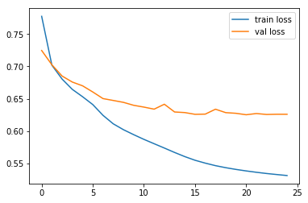

================
by Jawad Haider

- <a href="#recommendation-system"
  id="toc-recommendation-system">Recommendation System</a>

## Recommendation System

``` python
# Install TensorFlow
# !pip install -q tensorflow-gpu==2.0.0-rc0

try:
  %tensorflow_version 2.x  # Colab only.
except Exception:
  pass

import tensorflow as tf
print(tf.__version__)
```

    `%tensorflow_version` only switches the major version: `1.x` or `2.x`.
    You set: `2.x  # Colab only.`. This will be interpreted as: `2.x`.


    TensorFlow 2.x selected.
    2.0.0-rc0

``` python
# More imports
from tensorflow.keras.layers import Input, Dense, Embedding, Flatten, \
  Concatenate
from tensorflow.keras.models import Model
from tensorflow.keras.optimizers import SGD, Adam

from sklearn.utils import shuffle

import numpy as np
import pandas as pd
import matplotlib.pyplot as plt
```

``` python
# data is from: https://grouplens.org/datasets/movielens/
# in case the link changes in the future

!wget -nc http://files.grouplens.org/datasets/movielens/ml-20m.zip
```

    --2019-09-16 21:12:57--  http://files.grouplens.org/datasets/movielens/ml-20m.zip
    Resolving files.grouplens.org (files.grouplens.org)... 128.101.65.152
    Connecting to files.grouplens.org (files.grouplens.org)|128.101.65.152|:80... connected.
    HTTP request sent, awaiting response... 200 OK
    Length: 198702078 (189M) [application/zip]
    Saving to: ‘ml-20m.zip’

    ml-20m.zip          100%[===================>] 189.50M  16.6MB/s    in 11s     

    2019-09-16 21:13:09 (17.5 MB/s) - ‘ml-20m.zip’ saved [198702078/198702078]

``` python
!unzip -n ml-20m.zip
```

    Archive:  ml-20m.zip
       creating: ml-20m/
      inflating: ml-20m/genome-scores.csv  
      inflating: ml-20m/genome-tags.csv  
      inflating: ml-20m/links.csv        
      inflating: ml-20m/movies.csv       
      inflating: ml-20m/ratings.csv      
      inflating: ml-20m/README.txt       
      inflating: ml-20m/tags.csv         

``` python
!ls
```

    ml-20m  ml-20m.zip  sample_data

``` python
df = pd.read_csv('ml-20m/ratings.csv')
df.head()
```

<div>
<style scoped>
    .dataframe tbody tr th:only-of-type {
        vertical-align: middle;
    }

    .dataframe tbody tr th {
        vertical-align: top;
    }

    .dataframe thead th {
        text-align: right;
    }
</style>
<table border="1" class="dataframe">
  <thead>
    <tr style="text-align: right;">
      <th></th>
      <th>userId</th>
      <th>movieId</th>
      <th>rating</th>
      <th>timestamp</th>
    </tr>
  </thead>
  <tbody>
    <tr>
      <th>0</th>
      <td>1</td>
      <td>2</td>
      <td>3.5</td>
      <td>1112486027</td>
    </tr>
    <tr>
      <th>1</th>
      <td>1</td>
      <td>29</td>
      <td>3.5</td>
      <td>1112484676</td>
    </tr>
    <tr>
      <th>2</th>
      <td>1</td>
      <td>32</td>
      <td>3.5</td>
      <td>1112484819</td>
    </tr>
    <tr>
      <th>3</th>
      <td>1</td>
      <td>47</td>
      <td>3.5</td>
      <td>1112484727</td>
    </tr>
    <tr>
      <th>4</th>
      <td>1</td>
      <td>50</td>
      <td>3.5</td>
      <td>1112484580</td>
    </tr>
  </tbody>
</table>
</div>

``` python
# We can't trust the userId and movieId to be numbered 0...N-1
# Let's just set our own ids

# current_user_id = 0
# custom_user_map = {} # old user id > new user id
# def map_user_id(row):
#   global current_user_id, custom_user_map
#   old_user_id = row['userId']
#   if old_user_id not in custom_user_map:
#     custom_user_map[old_user_id] = current_user_id
#     current_user_id += 1
#   return custom_user_map[old_user_id]

# df['new_user_id'] = df.apply(map_user_id, axis=1)

df.userId = pd.Categorical(df.userId)
df['new_user_id'] = df.userId.cat.codes
```

``` python
# Now do the same thing for movie ids
# current_movie_id = 0
# custom_movie_map = {} # old movie id > new movie id
# def map_movie_id(row):
#   global current_movie_id, custom_movie_map
#   old_movie_id = row['movieId']
#   if old_movie_id not in custom_movie_map:
#     custom_movie_map[old_movie_id] = current_movie_id
#     current_movie_id += 1
#   return custom_movie_map[old_movie_id]

# df['new_movie_id'] = df.apply(map_movie_id, axis=1)

df.movieId = pd.Categorical(df.movieId)
df['new_movie_id'] = df.movieId.cat.codes
```

``` python
# Get user IDs, movie IDs, and ratings as separate arrays
user_ids = df['new_user_id'].values
movie_ids = df['new_movie_id'].values
ratings = df['rating'].values
```

``` python
# Get number of users and number of movies
N = len(set(user_ids))
M = len(set(movie_ids))

# Set embedding dimension
K = 10
```

``` python
# Make a neural network

# User input
u = Input(shape=(1,))

# Movie input
m = Input(shape=(1,))

# User embedding
u_emb = Embedding(N, K)(u) # output is (num_samples, 1, K)

# Movie embedding
m_emb = Embedding(M, K)(m) # output is (num_samples, 1, K)

# Flatten both embeddings
u_emb = Flatten()(u_emb) # now it's (num_samples, K)
m_emb = Flatten()(m_emb) # now it's (num_samples, K)

# Concatenate user-movie embeddings into a feature vector
x = Concatenate()([u_emb, m_emb]) # now it's (num_samples, 2K)

# Now that we have a feature vector, it's just a regular ANN
x = Dense(1024, activation='relu')(x)
# x = Dense(400, activation='relu')(x)
# x = Dense(400, activation='relu')(x)
x = Dense(1)(x)
```

``` python
# Build the model and compile
model = Model(inputs=[u, m], outputs=x)
model.compile(
  loss='mse',
  optimizer=SGD(lr=0.08, momentum=0.9),
)
```

``` python
# split the data
user_ids, movie_ids, ratings = shuffle(user_ids, movie_ids, ratings)
Ntrain = int(0.8 * len(ratings))
train_user = user_ids[:Ntrain]
train_movie = movie_ids[:Ntrain]
train_ratings = ratings[:Ntrain]

test_user = user_ids[Ntrain:]
test_movie = movie_ids[Ntrain:]
test_ratings = ratings[Ntrain:]

# center the ratings
avg_rating = train_ratings.mean()
train_ratings = train_ratings - avg_rating
test_ratings = test_ratings - avg_rating
```

``` python
r = model.fit(
  x=[train_user, train_movie],
  y=train_ratings,
  epochs=25,
  batch_size=1024,
  verbose=2, # goes a little faster when you don't print the progress bar
  validation_data=([test_user, test_movie], test_ratings),
)
```

    Train on 16000210 samples, validate on 4000053 samples
    Epoch 1/25
    WARNING:tensorflow:Entity <function Function._initialize_uninitialized_variables.<locals>.initialize_variables at 0x7fbb23faec80> could not be transformed and will be executed as-is. Please report this to the AutoGraph team. When filing the bug, set the verbosity to 10 (on Linux, `export AUTOGRAPH_VERBOSITY=10`) and attach the full output. Cause: module 'gast' has no attribute 'Num'
    WARNING: Entity <function Function._initialize_uninitialized_variables.<locals>.initialize_variables at 0x7fbb23faec80> could not be transformed and will be executed as-is. Please report this to the AutoGraph team. When filing the bug, set the verbosity to 10 (on Linux, `export AUTOGRAPH_VERBOSITY=10`) and attach the full output. Cause: module 'gast' has no attribute 'Num'
    16000210/16000210 - 119s - loss: 0.7774 - val_loss: 0.7246
    Epoch 2/25
    16000210/16000210 - 122s - loss: 0.7018 - val_loss: 0.7025
    Epoch 3/25
    16000210/16000210 - 124s - loss: 0.6803 - val_loss: 0.6850
    Epoch 4/25
    16000210/16000210 - 122s - loss: 0.6644 - val_loss: 0.6757
    Epoch 5/25
    16000210/16000210 - 128s - loss: 0.6531 - val_loss: 0.6699
    Epoch 6/25
    16000210/16000210 - 125s - loss: 0.6409 - val_loss: 0.6604
    Epoch 7/25
    16000210/16000210 - 122s - loss: 0.6242 - val_loss: 0.6502
    Epoch 8/25
    16000210/16000210 - 116s - loss: 0.6111 - val_loss: 0.6473
    Epoch 9/25
    16000210/16000210 - 116s - loss: 0.6020 - val_loss: 0.6443
    Epoch 10/25
    16000210/16000210 - 119s - loss: 0.5944 - val_loss: 0.6398
    Epoch 11/25
    16000210/16000210 - 135s - loss: 0.5871 - val_loss: 0.6370
    Epoch 12/25
    16000210/16000210 - 125s - loss: 0.5804 - val_loss: 0.6338
    Epoch 13/25
    16000210/16000210 - 126s - loss: 0.5737 - val_loss: 0.6414
    Epoch 14/25
    16000210/16000210 - 124s - loss: 0.5668 - val_loss: 0.6294
    Epoch 15/25
    16000210/16000210 - 123s - loss: 0.5604 - val_loss: 0.6285
    Epoch 16/25
    16000210/16000210 - 123s - loss: 0.5548 - val_loss: 0.6258
    Epoch 17/25
    16000210/16000210 - 122s - loss: 0.5503 - val_loss: 0.6261
    Epoch 18/25
    16000210/16000210 - 122s - loss: 0.5464 - val_loss: 0.6337
    Epoch 19/25
    16000210/16000210 - 121s - loss: 0.5433 - val_loss: 0.6284
    Epoch 20/25
    16000210/16000210 - 121s - loss: 0.5406 - val_loss: 0.6274
    Epoch 21/25
    16000210/16000210 - 122s - loss: 0.5383 - val_loss: 0.6252
    Epoch 22/25
    16000210/16000210 - 121s - loss: 0.5362 - val_loss: 0.6270
    Epoch 23/25
    16000210/16000210 - 122s - loss: 0.5343 - val_loss: 0.6256
    Epoch 24/25
    16000210/16000210 - 124s - loss: 0.5327 - val_loss: 0.6259
    Epoch 25/25
    16000210/16000210 - 124s - loss: 0.5311 - val_loss: 0.6259

``` python
# plot losses
plt.plot(r.history['loss'], label="train loss")
plt.plot(r.history['val_loss'], label="val loss")
plt.legend()
plt.show()
```



``` python
# is this on par with other approaches?
# https://datascience.stackexchange.com/questions/29740/benchmark-result-for-movielens-dataset
np.sqrt(0.6259)
```

    0.7911384202527394

<center>

<a href=''>  </a>

</center>
<center>
<em>Copyright Qalmaqihir</em>
</center>
<center>
<em>For more information, visit us at
<a href='http://www.github.com/qalmaqihir/'>www.github.com/qalmaqihir/</a></em>
</center>
