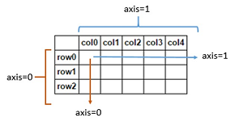

================
by Jawad Haider
# **02 - Numpy Operations**
------------------------------------------------------------------------
<center>
<a href=''></a>
</center>
<center>
<em>Copyright Qalmaqihir</em>
</center>
<center>
<em>For more information, visit us at
<a href='http://www.github.com/qalmaqihir/'>www.github.com/qalmaqihir/</a></em>
</center>
------------------------------------------------------------------------

- <a href="#numpy-operations" id="toc-numpy-operations"><span
  class="toc-section-number">1</span> NumPy Operations</a>
  - <a href="#arithmetic" id="toc-arithmetic"><span
    class="toc-section-number">1.1</span> Arithmetic</a>
  - <a href="#universal-array-functions"
    id="toc-universal-array-functions"><span
    class="toc-section-number">1.2</span> Universal Array Functions</a>
  - <a href="#summary-statistics-on-arrays"
    id="toc-summary-statistics-on-arrays"><span
    class="toc-section-number">1.3</span> Summary Statistics on Arrays</a>
  - <a href="#axis-logic" id="toc-axis-logic"><span
    class="toc-section-number">1.4</span> Axis Logic</a>
- <a href="#great-job-thats-the-end-of-this-part."
  id="toc-great-job-thats-the-end-of-this-part."><span
  class="toc-section-number">2</span> Great Job! Thats the end of this
  part.</a>

------------------------------------------------------------------------ 

# NumPy Operations

## Arithmetic

You can easily perform *array with array* arithmetic, or *scalar with
array* arithmetic. Let’s see some examples:

``` python
import numpy as np
arr = np.arange(0,10)
arr
```

    array([0, 1, 2, 3, 4, 5, 6, 7, 8, 9])

``` python
arr + arr
```

    array([ 0,  2,  4,  6,  8, 10, 12, 14, 16, 18])

``` python
arr * arr
```

    array([ 0,  1,  4,  9, 16, 25, 36, 49, 64, 81])

``` python
arr - arr
```

    array([0, 0, 0, 0, 0, 0, 0, 0, 0, 0])

``` python
# This will raise a Warning on division by zero, but not an error!
# It just fills the spot with nan
arr/arr
```

    C:\Anaconda3\envs\tsa_course\lib\site-packages\ipykernel_launcher.py:3: RuntimeWarning: invalid value encountered in true_divide
      This is separate from the ipykernel package so we can avoid doing imports until

    array([nan,  1.,  1.,  1.,  1.,  1.,  1.,  1.,  1.,  1.])

``` python
# Also a warning (but not an error) relating to infinity
1/arr
```

    C:\Anaconda3\envs\tsa_course\lib\site-packages\ipykernel_launcher.py:2: RuntimeWarning: divide by zero encountered in true_divide
      

    array([       inf, 1.        , 0.5       , 0.33333333, 0.25      ,
           0.2       , 0.16666667, 0.14285714, 0.125     , 0.11111111])

``` python
arr**3
```

    array([  0,   1,   8,  27,  64, 125, 216, 343, 512, 729], dtype=int32)

## Universal Array Functions

NumPy comes with many [universal array
functions](http://docs.scipy.org/doc/numpy/reference/ufuncs.html), or
<em>ufuncs</em>, which are essentially just mathematical operations that
can be applied across the array.<br>Let’s show some common ones:

``` python
# Taking Square Roots
np.sqrt(arr)
```

    array([0.        , 1.        , 1.41421356, 1.73205081, 2.        ,
           2.23606798, 2.44948974, 2.64575131, 2.82842712, 3.        ])

``` python
# Calculating exponential (e^)
np.exp(arr)
```

    array([1.00000000e+00, 2.71828183e+00, 7.38905610e+00, 2.00855369e+01,
           5.45981500e+01, 1.48413159e+02, 4.03428793e+02, 1.09663316e+03,
           2.98095799e+03, 8.10308393e+03])

``` python
# Trigonometric Functions like sine
np.sin(arr)
```

    array([ 0.        ,  0.84147098,  0.90929743,  0.14112001, -0.7568025 ,
           -0.95892427, -0.2794155 ,  0.6569866 ,  0.98935825,  0.41211849])

``` python
# Taking the Natural Logarithm
np.log(arr)
```

    C:\Anaconda3\envs\tsa_course\lib\site-packages\ipykernel_launcher.py:2: RuntimeWarning: divide by zero encountered in log
      

    array([      -inf, 0.        , 0.69314718, 1.09861229, 1.38629436,
           1.60943791, 1.79175947, 1.94591015, 2.07944154, 2.19722458])

## Summary Statistics on Arrays

NumPy also offers common summary statistics like <em>sum</em>,
<em>mean</em> and <em>max</em>. You would call these as methods on an
array.

``` python
arr = np.arange(0,10)
arr
```

    array([0, 1, 2, 3, 4, 5, 6, 7, 8, 9])

``` python
arr.sum()
```

    45

``` python
arr.mean()
```

    4.5

``` python
arr.max()
```

    9

<strong>Other summary statistics include:</strong>
<pre>
arr.min() returns 0                   minimum
arr.var() returns 8.25                variance
arr.std() returns 2.8722813232690143  standard deviation
</pre>

## Axis Logic

When working with 2-dimensional arrays (matrices) we have to consider
rows and columns. This becomes very important when we get to the section
on pandas. In array terms, axis 0 (zero) is the vertical axis (rows),
and axis 1 is the horizonal axis (columns). These values (0,1)
correspond to the order in which <tt>arr.shape</tt> values are returned.

Let’s see how this affects our summary statistic calculations from
above.

``` python
arr_2d = np.array([[1,2,3,4],[5,6,7,8],[9,10,11,12]])
arr_2d
```

    array([[ 1,  2,  3,  4],
           [ 5,  6,  7,  8],
           [ 9, 10, 11, 12]])

``` python
arr_2d.sum(axis=0)
```

    array([15, 18, 21, 24])

By passing in <tt>axis=0</tt>, we’re returning an array of sums along
the vertical axis, essentially <tt>\[(1+5+9), (2+6+10), (3+7+11),
(4+8+12)\]</tt>



``` python
arr_2d.shape
```

    (3, 4)

This tells us that <tt>arr_2d</tt> has 3 rows and 4 columns.

In <tt>arr_2d.sum(axis=0)</tt> above, the first element in each row was
summed, then the second element, and so forth.

So what should <tt>arr_2d.sum(axis=1)</tt> return?

``` python
# THINK ABOUT WHAT THIS WILL RETURN BEFORE RUNNING THE CELL!
arr_2d.sum(axis=1)
```

# Great Job! Thats the end of this part.

`Don't forget to give a star on github and follow for more curated Computer Science, Machine Learning materials`
