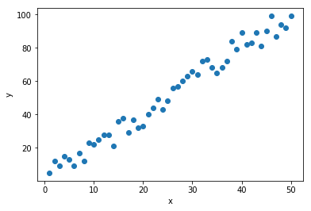
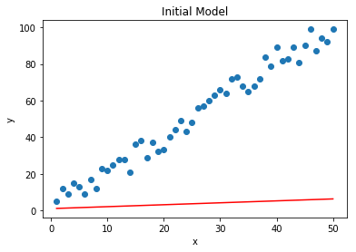
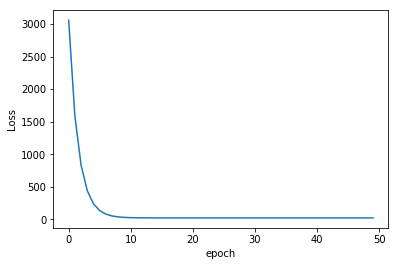
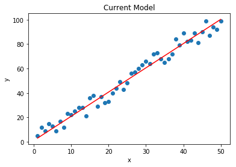

================
by Jawad Haider

# **01 - Linear Regression with PyTorch**
------------------------------------------------------------------------
<center>
<a href=''></a>
</center>
<center>
<em>Copyright Qalmaqihir</em>
</center>
<center>
<em>For more information, visit us at
<a href='http://www.github.com/qalmaqihir/'>www.github.com/qalmaqihir/</a></em>
</center>
------------------------------------------------------------------------

- <a href="#linear-regression-with-pytorch"
  id="toc-linear-regression-with-pytorch">Linear Regression with
  PyTorch</a>
  - <a href="#perform-standard-imports"
    id="toc-perform-standard-imports">Perform standard imports</a>
  - <a href="#create-a-column-matrix-of-x-values"
    id="toc-create-a-column-matrix-of-x-values">Create a column matrix of X
    values</a>
  - <a href="#create-a-random-array-of-error-values"
    id="toc-create-a-random-array-of-error-values">Create a “random” array
    of error values</a>
  - <a href="#create-a-column-matrix-of-y-values"
    id="toc-create-a-column-matrix-of-y-values">Create a column matrix of y
    values</a>
  - <a href="#plot-the-results" id="toc-plot-the-results">Plot the
    results</a>
  - <a href="#simple-linear-model" id="toc-simple-linear-model">Simple
    linear model</a>
  - <a href="#model-classes" id="toc-model-classes">Model classes</a>
  - <a href="#plot-the-initial-model" id="toc-plot-the-initial-model">Plot
    the initial model</a>
  - <a href="#set-the-loss-function" id="toc-set-the-loss-function">Set the
    loss function</a>
  - <a href="#set-the-optimization" id="toc-set-the-optimization">Set the
    optimization</a>
  - <a href="#train-the-model" id="toc-train-the-model">Train the model</a>
  - <a href="#plot-the-loss-values" id="toc-plot-the-loss-values">Plot the
    loss values</a>
  - <a href="#plot-the-result" id="toc-plot-the-result">Plot the result</a>
  - <a href="#great-job" id="toc-great-job">Great job!</a>

------------------------------------------------------------------------

# Linear Regression with PyTorch

In this section we’ll use PyTorch’s machine learning model to
progressively develop a best-fit line for a given set of data points.
Like most linear regression algorithms, we’re seeking to minimize the
error between our model and the actual data, using a <em>loss
function</em> like mean-squared-error.

<br>

Image source:
<a href='https://commons.wikimedia.org/wiki/File:Residuals_for_Linear_Regression_Fit.png'>https://commons.wikimedia.org/wiki/File:Residuals_for_Linear_Regression_Fit.png</a>

To start, we’ll develop a collection of data points that appear random,
but that fit a known linear equation


## Perform standard imports

``` python
import torch
import torch.nn as nn  # we'll use this a lot going forward!

import numpy as np
import matplotlib.pyplot as plt
%matplotlib inline
```

## Create a column matrix of X values

We can create tensors right away rather than convert from NumPy arrays.

``` python
X = torch.linspace(1,50,50).reshape(-1,1)

# Equivalent to
# X = torch.unsqueeze(torch.linspace(1,50,50), dim=1)
```

## Create a “random” array of error values

We want 50 random integer values that collectively cancel each other
out.

``` python
torch.manual_seed(71) # to obtain reproducible results
e = torch.randint(-8,9,(50,1),dtype=torch.float)
print(e.sum())
```

    tensor(0.)

## Create a column matrix of y values

Here we’ll set our own parameters of
,
plus the error amount.<br><strong><tt>y</tt></strong> will have the same
shape as <strong><tt>X</tt></strong> and <strong><tt>e</tt></strong>

``` python
y = 2*X + 1 + e
print(y.shape)
```

    torch.Size([50, 1])

## Plot the results

We have to convert tensors to NumPy arrays just for plotting.

``` python
plt.scatter(X.numpy(), y.numpy())
plt.ylabel('y')
plt.xlabel('x');
```



Note that when we created tensor
, we did <em>not</em>
pass <tt>requires_grad=True</tt>. This means that
 doesn’t have a gradient
function, and <tt>y.backward()</tt> won’t work. Since PyTorch is not
tracking operations, it doesn’t know the relationship between
 and
.

## Simple linear model

As a quick demonstration we’ll show how the built-in
<tt>nn.Linear()</tt> model preselects weight and bias values at random.

``` python
torch.manual_seed(59)

model = nn.Linear(in_features=1, out_features=1)
print(model.weight)
print(model.bias)
```

    Parameter containing:
    tensor([[0.1060]], requires_grad=True)
    Parameter containing:
    tensor([0.9638], requires_grad=True)

Without seeing any data, the model sets a random weight of 0.1060 and a
bias of 0.9638.

## Model classes

PyTorch lets us define models as object classes that can store multiple
model layers. In upcoming sections we’ll set up several neural network
layers, and determine how each layer should perform its forward pass to
the next layer. For now, though, we only need a single <tt>linear</tt>
layer.

``` python
class Model(nn.Module):
    def __init__(self, in_features, out_features):
        super().__init__()
        self.linear = nn.Linear(in_features, out_features)
        
    def forward(self, x):
        y_pred = self.linear(x)
        return y_pred
```

<div class="alert alert-info">

<strong>NOTE:</strong> The “Linear” model layer used here doesn’t really
refer to linear regression. Instead, it describes the type of neural
network layer employed. Linear layers are also called “fully connected”
or “dense” layers. Going forward our models may contain linear layers,
convolutional layers, and more.

</div>

When <tt>Model</tt> is instantiated, we need to pass in the size
(dimensions) of the incoming and outgoing features. For our purposes
we’ll use (1,1).<br>As above, we can see the initial hyperparameters.

``` python
torch.manual_seed(59)
model = Model(1, 1)
print(model)
print('Weight:', model.linear.weight.item())
print('Bias:  ', model.linear.bias.item())
```

    Model(
      (linear): Linear(in_features=1, out_features=1, bias=True)
    )
    Weight: 0.10597813129425049
    Bias:   0.9637961387634277

As models become more complex, it may be better to iterate over all the
model parameters:

``` python
for name, param in model.named_parameters():
    print(name, '\t', param.item())
```

    linear.weight    0.10597813129425049
    linear.bias      0.9637961387634277

<div class="alert alert-info">

<strong>NOTE:</strong> In the above example we had our Model class
accept arguments for the number of input and output features.<br>For
simplicity we can hardcode them into the Model:

<tt><font color=black> class Model(torch.nn.Module):<br>     def
\_\_init\_\_(self):<br>         super().\_\_init\_\_()<br>
        self.linear = Linear(1,1)<br><br> model = Model()
</font></tt><br><br>

Alternatively we can use default arguments:

<tt><font color=black> class Model(torch.nn.Module):<br>     def
\_\_init\_\_(self, in_dim=1, out_dim=1):<br>
        super().\_\_init\_\_()<br>         self.linear =
Linear(in_dim,out_dim)<br><br> model = Model()<br> <em>\# or</em><br>
model = Model(i,o)</font></tt>

</div>

Now let’s see the result when we pass a tensor into the model.

``` python
x = torch.tensor([2.0])
print(model.forward(x))   # equivalent to print(model(x))
```

    tensor([1.1758], grad_fn=<AddBackward0>)

which is confirmed with
 = (0.1060)(2.0)+(0.9638) = 1.1758")

## Plot the initial model

We can plot the untrained model against our dataset to get an idea of
our starting point.

``` python
x1 = np.array([X.min(),X.max()])
print(x1)
```

    [ 1. 50.]

``` python
w1,b1 = model.linear.weight.item(), model.linear.bias.item()
print(f'Initial weight: {w1:.8f}, Initial bias: {b1:.8f}')
print()

y1 = x1*w1 + b1
print(y1)
```

    Initial weight: 0.10597813, Initial bias: 0.96379614

    [1.0697743 6.2627025]

``` python
plt.scatter(X.numpy(), y.numpy())
plt.plot(x1,y1,'r')
plt.title('Initial Model')
plt.ylabel('y')
plt.xlabel('x');
```



## Set the loss function

We could write our own function to apply a Mean Squared Error (MSE) that
follows<br>

}^2 \\ &= \frac {1} {n} \sum_{i=1}^n {(y_i - (wx_i + b))}^2\end{split}")<br>

Fortunately PyTorch has it built in.<br> <em>By convention, you’ll see
the variable name “criterion” used, but feel free to use something like
“linear_loss_func” if that’s clearer.</em>

``` python
criterion = nn.MSELoss()
```

## Set the optimization

Here we’ll use
<a href='https://en.wikipedia.org/wiki/Stochastic_gradient_descent'>Stochastic
Gradient Descent</a> (SGD) with an applied
<a href='https://en.wikipedia.org/wiki/Learning_rate'>learning rate</a>
(lr) of 0.001. Recall that the learning rate tells the optimizer how
much to adjust each parameter on the next round of calculations. Too
large a step and we run the risk of overshooting the minimum, causing
the algorithm to diverge. Too small and it will take a long time to
converge.

For more complicated (multivariate) data, you might also consider
passing optional
<a href='https://en.wikipedia.org/wiki/Stochastic_gradient_descent#Momentum'><tt>momentum</tt></a>
and
<a href='https://en.wikipedia.org/wiki/Tikhonov_regularization'><tt>weight_decay</tt></a>
arguments. Momentum allows the algorithm to “roll over” small bumps to
avoid local minima that can cause convergence too soon. Weight decay
(also called an L2 penalty) applies to biases.

For more information, see
<a href='https://pytorch.org/docs/stable/optim.html'><strong><tt>torch.optim</tt></strong></a>

``` python
optimizer = torch.optim.SGD(model.parameters(), lr = 0.001)

# You'll sometimes see this as
# optimizer = torch.optim.SGD(model.parameters(), lr = 1e-3)
```

## Train the model

An <em>epoch</em> is a single pass through the entire dataset. We want
to pick a sufficiently large number of epochs to reach a plateau close
to our known parameters of


<div class="alert alert-info">

<strong>Let’s walk through the steps we’re about to take:</strong><br>

1.  Set a reasonably large number of passes<br>
    <tt><font color=black>epochs = 50</font></tt><br>
2.  Create a list to store loss values. This will let us view our
    progress afterward.<br> <tt><font color=black>losses =
    \[\]</font></tt><br> <tt><font color=black>for i in
    range(epochs):</font></tt><br>
3.  Bump “i” so that the printed report starts at 1<br>
    <tt><font color=black>    i+=1</font></tt><br>
4.  Create a prediction set by running “X” through the current model
    parameters<br> <tt><font color=black>    y_pred =
    model.forward(X)</font></tt><br>
5.  Calculate the loss<br> <tt><font color=black>    loss =
    criterion(y_pred, y)</font></tt><br>
6.  Add the loss value to our tracking list<br>
    <tt><font color=black>    losses.append(loss)</font></tt><br>
7.  Print the current line of results<br>
    <tt><font color=black>    print(f’epoch: {i:2} loss:
    {loss.item():10.8f}’)</font></tt><br>
8.  Gradients accumulate with every backprop. To prevent compounding we
    need to reset the stored gradient for each new epoch.<br>
    <tt><font color=black>    optimizer.zero_grad()</font></tt><br>
9.  Now we can backprop<br>
    <tt><font color=black>    loss.backward()</font></tt><br>
10. Finally, we can update the hyperparameters of our model<br>
    <tt><font color=black>    optimizer.step()</font></tt>

</div>

``` python
epochs = 50
losses = []

for i in range(epochs):
    i+=1
    y_pred = model.forward(X)
    loss = criterion(y_pred, y)
    losses.append(loss)
    print(f'epoch: {i:2}  loss: {loss.item():10.8f}  weight: {model.linear.weight.item():10.8f}  \
bias: {model.linear.bias.item():10.8f}') 
    optimizer.zero_grad()
    loss.backward()
    optimizer.step()
```

    epoch:  1  loss: 3057.21679688  weight: 0.10597813  bias: 0.96379614
    epoch:  2  loss: 1588.53100586  weight: 3.33490038  bias: 1.06046367
    epoch:  3  loss: 830.30010986  weight: 1.01483274  bias: 0.99226278
    epoch:  4  loss: 438.85241699  weight: 2.68179965  bias: 1.04252183
    epoch:  5  loss: 236.76152039  weight: 1.48402119  bias: 1.00766504
    epoch:  6  loss: 132.42912292  weight: 2.34460592  bias: 1.03396463
    epoch:  7  loss: 78.56572723  weight: 1.72622538  bias: 1.01632178
    epoch:  8  loss: 50.75775909  weight: 2.17050409  bias: 1.03025162
    epoch:  9  loss: 36.40123367  weight: 1.85124576  bias: 1.02149546
    epoch: 10  loss: 28.98922729  weight: 2.08060074  bias: 1.02903891
    epoch: 11  loss: 25.16238213  weight: 1.91576838  bias: 1.02487016
    epoch: 12  loss: 23.18647385  weight: 2.03416562  bias: 1.02911627
    epoch: 13  loss: 22.16612816  weight: 1.94905841  bias: 1.02731562
    epoch: 14  loss: 21.63911057  weight: 2.01017213  bias: 1.02985907
    epoch: 15  loss: 21.36677170  weight: 1.96622372  bias: 1.02928054
    epoch: 16  loss: 21.22591782  weight: 1.99776423  bias: 1.03094459
    epoch: 17  loss: 21.15294647  weight: 1.97506487  bias: 1.03099668
    epoch: 18  loss: 21.11501122  weight: 1.99133754  bias: 1.03220642
    epoch: 19  loss: 21.09517670  weight: 1.97960854  bias: 1.03258383
    epoch: 20  loss: 21.08468437  weight: 1.98799884  bias: 1.03355861
    epoch: 21  loss: 21.07901382  weight: 1.98193336  bias: 1.03410351
    epoch: 22  loss: 21.07583046  weight: 1.98625445  bias: 1.03495669
    epoch: 23  loss: 21.07393837  weight: 1.98311269  bias: 1.03558779
    epoch: 24  loss: 21.07269859  weight: 1.98533309  bias: 1.03637791
    epoch: 25  loss: 21.07181931  weight: 1.98370099  bias: 1.03705311
    epoch: 26  loss: 21.07110596  weight: 1.98483658  bias: 1.03781021
    epoch: 27  loss: 21.07048416  weight: 1.98398376  bias: 1.03850794
    epoch: 28  loss: 21.06991386  weight: 1.98455977  bias: 1.03924775
    epoch: 29  loss: 21.06936646  weight: 1.98410904  bias: 1.03995669
    epoch: 30  loss: 21.06883621  weight: 1.98439610  bias: 1.04068720
    epoch: 31  loss: 21.06830788  weight: 1.98415291  bias: 1.04140162
    epoch: 32  loss: 21.06778145  weight: 1.98429084  bias: 1.04212701
    epoch: 33  loss: 21.06726265  weight: 1.98415494  bias: 1.04284394
    epoch: 34  loss: 21.06674004  weight: 1.98421574  bias: 1.04356635
    epoch: 35  loss: 21.06622314  weight: 1.98413551  bias: 1.04428422
    epoch: 36  loss: 21.06570625  weight: 1.98415649  bias: 1.04500473
    epoch: 37  loss: 21.06518936  weight: 1.98410451  bias: 1.04572272
    epoch: 38  loss: 21.06466866  weight: 1.98410523  bias: 1.04644191
    epoch: 39  loss: 21.06415749  weight: 1.98406804  bias: 1.04715967
    epoch: 40  loss: 21.06363869  weight: 1.98405814  bias: 1.04787791
    epoch: 41  loss: 21.06312370  weight: 1.98402870  bias: 1.04859519
    epoch: 42  loss: 21.06260681  weight: 1.98401320  bias: 1.04931259
    epoch: 43  loss: 21.06209564  weight: 1.98398757  bias: 1.05002928
    epoch: 44  loss: 21.06157875  weight: 1.98396957  bias: 1.05074584
    epoch: 45  loss: 21.06106949  weight: 1.98394585  bias: 1.05146194
    epoch: 46  loss: 21.06055450  weight: 1.98392630  bias: 1.05217779
    epoch: 47  loss: 21.06004143  weight: 1.98390377  bias: 1.05289316
    epoch: 48  loss: 21.05953217  weight: 1.98388338  bias: 1.05360830
    epoch: 49  loss: 21.05901527  weight: 1.98386145  bias: 1.05432308
    epoch: 50  loss: 21.05850983  weight: 1.98384094  bias: 1.05503750

## Plot the loss values

Let’s see how loss changed over time

``` python
plt.plot(range(epochs), losses)
plt.ylabel('Loss')
plt.xlabel('epoch');
```



## Plot the result

Now we’ll derive <tt>y1</tt> from the new model to plot the most recent
best-fit line.

``` python
w1,b1 = model.linear.weight.item(), model.linear.bias.item()
print(f'Current weight: {w1:.8f}, Current bias: {b1:.8f}')
print()

y1 = x1*w1 + b1
print(x1)
print(y1)
```

    Current weight: 1.98381913, Current bias: 1.05575156

    [ 1. 50.]
    [  3.0395708 100.246704 ]

``` python
plt.scatter(X.numpy(), y.numpy())
plt.plot(x1,y1,'r')
plt.title('Current Model')
plt.ylabel('y')
plt.xlabel('x');
```



## Great job!
