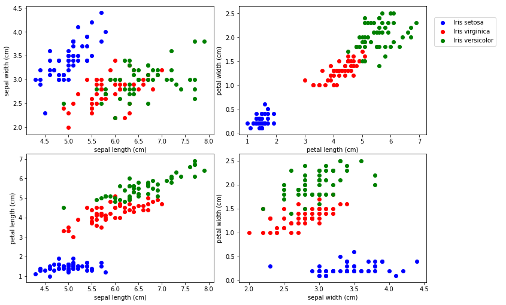

================
by Jawad Haider

- <a href="#datasets-with-pytorch" id="toc-datasets-with-pytorch">Datasets
  with PyTorch</a>
  - <a href="#perform-standard-imports"
    id="toc-perform-standard-imports">Perform standard imports</a>
- <a href="#loading-data-from-files"
  id="toc-loading-data-from-files">Loading data from files</a>
  - <a href="#plot-the-data" id="toc-plot-the-data">Plot the data</a>
    - <a href="#the-classic-method-for-building-traintest-split-tensors"
      id="toc-the-classic-method-for-building-traintest-split-tensors">The
      classic method for building train/test split tensors</a>
  - <a href="#using-pytorchs-dataset-and-dataloader-classes"
    id="toc-using-pytorchs-dataset-and-dataloader-classes">Using PyTorch’s
    Dataset and DataLoader classes</a>
  - <a href="#a-quick-note-on-torchvision"
    id="toc-a-quick-note-on-torchvision">A Quick Note on Torchvision</a>

------------------------------------------------------------------------

<center>
<a href=''></a>
</center>

------------------------------------------------------------------------

<center>
<em>Copyright Qalmaqihir</em>
</center>
<center>
<em>For more information, visit us at
<a href='http://www.github.com/qalmaqihir/'>www.github.com/qalmaqihir/</a></em>
</center>

# Datasets with PyTorch

In this section we’ll show how to: \* load data from outside files \*
build random batches using PyTorch’s
<a href='https://pytorch.org/docs/stable/data.html'><strong><tt>data</tt></strong></a>
utilities<br>

At the end we’ll briefly mention
<a href='https://pytorch.org/docs/stable/torchvision/index.html'><tt><strong>torchvision</strong></tt></a>.

## Perform standard imports

``` python
import torch
import numpy as np
import pandas as pd
import matplotlib.pyplot as plt
%matplotlib inline
```

# Loading data from files

We’ve seen how to load NumPy arrays into PyTorch, and anyone familiar
with <tt>pandas.read_csv()</tt> can use it to prepare data before
forming tensors. Here we’ll load the
<a href='https://en.wikipedia.org/wiki/Iris_flower_data_set'>iris flower
dataset</a> saved as a .csv file.

``` python
df = pd.read_csv('../Data/iris.csv')
df.head()
```

<div>
<style scoped>
    .dataframe tbody tr th:only-of-type {
        vertical-align: middle;
    }

    .dataframe tbody tr th {
        vertical-align: top;
    }

    .dataframe thead th {
        text-align: right;
    }
</style>
<table border="1" class="dataframe">
  <thead>
    <tr style="text-align: right;">
      <th></th>
      <th>sepal length (cm)</th>
      <th>sepal width (cm)</th>
      <th>petal length (cm)</th>
      <th>petal width (cm)</th>
      <th>target</th>
    </tr>
  </thead>
  <tbody>
    <tr>
      <th>0</th>
      <td>5.1</td>
      <td>3.5</td>
      <td>1.4</td>
      <td>0.2</td>
      <td>0.0</td>
    </tr>
    <tr>
      <th>1</th>
      <td>4.9</td>
      <td>3.0</td>
      <td>1.4</td>
      <td>0.2</td>
      <td>0.0</td>
    </tr>
    <tr>
      <th>2</th>
      <td>4.7</td>
      <td>3.2</td>
      <td>1.3</td>
      <td>0.2</td>
      <td>0.0</td>
    </tr>
    <tr>
      <th>3</th>
      <td>4.6</td>
      <td>3.1</td>
      <td>1.5</td>
      <td>0.2</td>
      <td>0.0</td>
    </tr>
    <tr>
      <th>4</th>
      <td>5.0</td>
      <td>3.6</td>
      <td>1.4</td>
      <td>0.2</td>
      <td>0.0</td>
    </tr>
  </tbody>
</table>
</div>

``` python
df.shape
```

    (150, 5)

## Plot the data

``` python
fig, axes = plt.subplots(nrows=2, ncols=2, figsize=(10,7))
fig.tight_layout()

plots = [(0,1),(2,3),(0,2),(1,3)]
colors = ['b', 'r', 'g']
labels = ['Iris setosa','Iris virginica','Iris versicolor']

for i, ax in enumerate(axes.flat):
    for j in range(3):
        x = df.columns[plots[i][0]]
        y = df.columns[plots[i][1]]
        ax.scatter(df[df['target']==j][x], df[df['target']==j][y], color=colors[j])
        ax.set(xlabel=x, ylabel=y)

fig.legend(labels=labels, loc=3, bbox_to_anchor=(1.0,0.85))
plt.show()
```



The iris dataset consists of 50 samples each from three species of Iris
(<em>Iris setosa</em>, <em>Iris virginica</em> and <em>Iris
versicolor</em>), for 150 total samples. We have four features (sepal
length & width, petal length & width) and three unique labels: 0.
<em>Iris setosa</em> 1. <em>Iris virginica</em> 2. <em>Iris
versicolor</em>

### The classic method for building train/test split tensors

Before introducing PyTorch’s Dataset and DataLoader classes, we’ll take
a quick look at the alternative.

``` python
from sklearn.model_selection import train_test_split

train_X, test_X, train_y, test_y = train_test_split(df.drop('target',axis=1).values,
                                                    df['target'].values, test_size=0.2,
                                                    random_state=33)

X_train = torch.FloatTensor(train_X)
X_test = torch.FloatTensor(test_X)
y_train = torch.LongTensor(train_y).reshape(-1, 1)
y_test = torch.LongTensor(test_y).reshape(-1, 1)
```

``` python
print(f'Training size: {len(y_train)}')
labels, counts = y_train.unique(return_counts=True)
print(f'Labels: {labels}\nCounts: {counts}')
```

    Training size: 120
    Labels: tensor([0, 1, 2])
    Counts: tensor([42, 42, 36])

<div class="alert alert-success">

<strong>NOTE: </strong>The importance of a balanced training set is
discussed in <em>A systematic study of the class imbalance problem in
convolutional neural networks</em> by Mateusz Buda, Atsuto Maki, Maciej
A. Mazurowski (10/15/17, latest rev 10/13/18)
<a href='https://arxiv.org/abs/1710.05381'>https://arxiv.org/abs/1710.05381</a><br>For
example, the authors show that oversampling a less common class so that
it matches the more common classes is always the preferred choice.

</div>

``` python
X_train.size()
```

    torch.Size([120, 4])

``` python
y_train.size()
```

    torch.Size([120, 1])

<div class="alert alert-info">

<strong>NOTE: </strong>It’s up to us to remember which columns
correspond to which features.

</div>

## Using PyTorch’s Dataset and DataLoader classes

A far better alternative is to leverage PyTorch’s
<a href='https://pytorch.org/docs/stable/data.html'><strong><tt>Dataset</tt></strong></a>
and
<a href='https://pytorch.org/docs/stable/data.html#torch.utils.data.DataLoader'><strong><tt>DataLoader</strong></tt></a>
classes.

Usually, to set up a Dataset specific to our investigation we would
define our own custom class that inherits from
<tt>torch.utils.data.Dataset</tt> (we’ll do this in the CNN section).
For now, we can use the built-in
<a href='https://pytorch.org/docs/stable/data.html#torch.utils.data.TensorDataset'><strong><tt>TensorDataset</tt></strong></a>
class.

``` python
from torch.utils.data import TensorDataset, DataLoader

data = df.drop('target',axis=1).values
labels = df['target'].values

iris = TensorDataset(torch.FloatTensor(data),torch.LongTensor(labels))
```

``` python
len(iris)
```

    150

``` python
type(iris)
```

    torch.utils.data.dataset.TensorDataset

``` python
for i in iris:
    print(i)
```

    (tensor([5.1000, 3.5000, 1.4000, 0.2000]), tensor(0))
    (tensor([4.9000, 3.0000, 1.4000, 0.2000]), tensor(0))
    (tensor([4.7000, 3.2000, 1.3000, 0.2000]), tensor(0))
    (tensor([4.6000, 3.1000, 1.5000, 0.2000]), tensor(0))
    (tensor([5.0000, 3.6000, 1.4000, 0.2000]), tensor(0))
    (tensor([5.4000, 3.9000, 1.7000, 0.4000]), tensor(0))
    (tensor([4.6000, 3.4000, 1.4000, 0.3000]), tensor(0))
    (tensor([5.0000, 3.4000, 1.5000, 0.2000]), tensor(0))
    (tensor([4.4000, 2.9000, 1.4000, 0.2000]), tensor(0))
    (tensor([4.9000, 3.1000, 1.5000, 0.1000]), tensor(0))
    (tensor([5.4000, 3.7000, 1.5000, 0.2000]), tensor(0))
    (tensor([4.8000, 3.4000, 1.6000, 0.2000]), tensor(0))
    (tensor([4.8000, 3.0000, 1.4000, 0.1000]), tensor(0))
    (tensor([4.3000, 3.0000, 1.1000, 0.1000]), tensor(0))
    (tensor([5.8000, 4.0000, 1.2000, 0.2000]), tensor(0))
    (tensor([5.7000, 4.4000, 1.5000, 0.4000]), tensor(0))
    (tensor([5.4000, 3.9000, 1.3000, 0.4000]), tensor(0))
    (tensor([5.1000, 3.5000, 1.4000, 0.3000]), tensor(0))
    (tensor([5.7000, 3.8000, 1.7000, 0.3000]), tensor(0))
    (tensor([5.1000, 3.8000, 1.5000, 0.3000]), tensor(0))
    (tensor([5.4000, 3.4000, 1.7000, 0.2000]), tensor(0))
    (tensor([5.1000, 3.7000, 1.5000, 0.4000]), tensor(0))
    (tensor([4.6000, 3.6000, 1.0000, 0.2000]), tensor(0))
    (tensor([5.1000, 3.3000, 1.7000, 0.5000]), tensor(0))
    (tensor([4.8000, 3.4000, 1.9000, 0.2000]), tensor(0))
    (tensor([5.0000, 3.0000, 1.6000, 0.2000]), tensor(0))
    (tensor([5.0000, 3.4000, 1.6000, 0.4000]), tensor(0))
    (tensor([5.2000, 3.5000, 1.5000, 0.2000]), tensor(0))
    (tensor([5.2000, 3.4000, 1.4000, 0.2000]), tensor(0))
    (tensor([4.7000, 3.2000, 1.6000, 0.2000]), tensor(0))
    (tensor([4.8000, 3.1000, 1.6000, 0.2000]), tensor(0))
    (tensor([5.4000, 3.4000, 1.5000, 0.4000]), tensor(0))
    (tensor([5.2000, 4.1000, 1.5000, 0.1000]), tensor(0))
    (tensor([5.5000, 4.2000, 1.4000, 0.2000]), tensor(0))
    (tensor([4.9000, 3.1000, 1.5000, 0.1000]), tensor(0))
    (tensor([5.0000, 3.2000, 1.2000, 0.2000]), tensor(0))
    (tensor([5.5000, 3.5000, 1.3000, 0.2000]), tensor(0))
    (tensor([4.9000, 3.1000, 1.5000, 0.1000]), tensor(0))
    (tensor([4.4000, 3.0000, 1.3000, 0.2000]), tensor(0))
    (tensor([5.1000, 3.4000, 1.5000, 0.2000]), tensor(0))
    (tensor([5.0000, 3.5000, 1.3000, 0.3000]), tensor(0))
    (tensor([4.5000, 2.3000, 1.3000, 0.3000]), tensor(0))
    (tensor([4.4000, 3.2000, 1.3000, 0.2000]), tensor(0))
    (tensor([5.0000, 3.5000, 1.6000, 0.6000]), tensor(0))
    (tensor([5.1000, 3.8000, 1.9000, 0.4000]), tensor(0))
    (tensor([4.8000, 3.0000, 1.4000, 0.3000]), tensor(0))
    (tensor([5.1000, 3.8000, 1.6000, 0.2000]), tensor(0))
    (tensor([4.6000, 3.2000, 1.4000, 0.2000]), tensor(0))
    (tensor([5.3000, 3.7000, 1.5000, 0.2000]), tensor(0))
    (tensor([5.0000, 3.3000, 1.4000, 0.2000]), tensor(0))
    (tensor([7.0000, 3.2000, 4.7000, 1.4000]), tensor(1))
    (tensor([6.4000, 3.2000, 4.5000, 1.5000]), tensor(1))
    (tensor([6.9000, 3.1000, 4.9000, 1.5000]), tensor(1))
    (tensor([5.5000, 2.3000, 4.0000, 1.3000]), tensor(1))
    (tensor([6.5000, 2.8000, 4.6000, 1.5000]), tensor(1))
    (tensor([5.7000, 2.8000, 4.5000, 1.3000]), tensor(1))
    (tensor([6.3000, 3.3000, 4.7000, 1.6000]), tensor(1))
    (tensor([4.9000, 2.4000, 3.3000, 1.0000]), tensor(1))
    (tensor([6.6000, 2.9000, 4.6000, 1.3000]), tensor(1))
    (tensor([5.2000, 2.7000, 3.9000, 1.4000]), tensor(1))
    (tensor([5.0000, 2.0000, 3.5000, 1.0000]), tensor(1))
    (tensor([5.9000, 3.0000, 4.2000, 1.5000]), tensor(1))
    (tensor([6.0000, 2.2000, 4.0000, 1.0000]), tensor(1))
    (tensor([6.1000, 2.9000, 4.7000, 1.4000]), tensor(1))
    (tensor([5.6000, 2.9000, 3.6000, 1.3000]), tensor(1))
    (tensor([6.7000, 3.1000, 4.4000, 1.4000]), tensor(1))
    (tensor([5.6000, 3.0000, 4.5000, 1.5000]), tensor(1))
    (tensor([5.8000, 2.7000, 4.1000, 1.0000]), tensor(1))
    (tensor([6.2000, 2.2000, 4.5000, 1.5000]), tensor(1))
    (tensor([5.6000, 2.5000, 3.9000, 1.1000]), tensor(1))
    (tensor([5.9000, 3.2000, 4.8000, 1.8000]), tensor(1))
    (tensor([6.1000, 2.8000, 4.0000, 1.3000]), tensor(1))
    (tensor([6.3000, 2.5000, 4.9000, 1.5000]), tensor(1))
    (tensor([6.1000, 2.8000, 4.7000, 1.2000]), tensor(1))
    (tensor([6.4000, 2.9000, 4.3000, 1.3000]), tensor(1))
    (tensor([6.6000, 3.0000, 4.4000, 1.4000]), tensor(1))
    (tensor([6.8000, 2.8000, 4.8000, 1.4000]), tensor(1))
    (tensor([6.7000, 3.0000, 5.0000, 1.7000]), tensor(1))
    (tensor([6.0000, 2.9000, 4.5000, 1.5000]), tensor(1))
    (tensor([5.7000, 2.6000, 3.5000, 1.0000]), tensor(1))
    (tensor([5.5000, 2.4000, 3.8000, 1.1000]), tensor(1))
    (tensor([5.5000, 2.4000, 3.7000, 1.0000]), tensor(1))
    (tensor([5.8000, 2.7000, 3.9000, 1.2000]), tensor(1))
    (tensor([6.0000, 2.7000, 5.1000, 1.6000]), tensor(1))
    (tensor([5.4000, 3.0000, 4.5000, 1.5000]), tensor(1))
    (tensor([6.0000, 3.4000, 4.5000, 1.6000]), tensor(1))
    (tensor([6.7000, 3.1000, 4.7000, 1.5000]), tensor(1))
    (tensor([6.3000, 2.3000, 4.4000, 1.3000]), tensor(1))
    (tensor([5.6000, 3.0000, 4.1000, 1.3000]), tensor(1))
    (tensor([5.5000, 2.5000, 4.0000, 1.3000]), tensor(1))
    (tensor([5.5000, 2.6000, 4.4000, 1.2000]), tensor(1))
    (tensor([6.1000, 3.0000, 4.6000, 1.4000]), tensor(1))
    (tensor([5.8000, 2.6000, 4.0000, 1.2000]), tensor(1))
    (tensor([5.0000, 2.3000, 3.3000, 1.0000]), tensor(1))
    (tensor([5.6000, 2.7000, 4.2000, 1.3000]), tensor(1))
    (tensor([5.7000, 3.0000, 4.2000, 1.2000]), tensor(1))
    (tensor([5.7000, 2.9000, 4.2000, 1.3000]), tensor(1))
    (tensor([6.2000, 2.9000, 4.3000, 1.3000]), tensor(1))
    (tensor([5.1000, 2.5000, 3.0000, 1.1000]), tensor(1))
    (tensor([5.7000, 2.8000, 4.1000, 1.3000]), tensor(1))
    (tensor([6.3000, 3.3000, 6.0000, 2.5000]), tensor(2))
    (tensor([5.8000, 2.7000, 5.1000, 1.9000]), tensor(2))
    (tensor([7.1000, 3.0000, 5.9000, 2.1000]), tensor(2))
    (tensor([6.3000, 2.9000, 5.6000, 1.8000]), tensor(2))
    (tensor([6.5000, 3.0000, 5.8000, 2.2000]), tensor(2))
    (tensor([7.6000, 3.0000, 6.6000, 2.1000]), tensor(2))
    (tensor([4.9000, 2.5000, 4.5000, 1.7000]), tensor(2))
    (tensor([7.3000, 2.9000, 6.3000, 1.8000]), tensor(2))
    (tensor([6.7000, 2.5000, 5.8000, 1.8000]), tensor(2))
    (tensor([7.2000, 3.6000, 6.1000, 2.5000]), tensor(2))
    (tensor([6.5000, 3.2000, 5.1000, 2.0000]), tensor(2))
    (tensor([6.4000, 2.7000, 5.3000, 1.9000]), tensor(2))
    (tensor([6.8000, 3.0000, 5.5000, 2.1000]), tensor(2))
    (tensor([5.7000, 2.5000, 5.0000, 2.0000]), tensor(2))
    (tensor([5.8000, 2.8000, 5.1000, 2.4000]), tensor(2))
    (tensor([6.4000, 3.2000, 5.3000, 2.3000]), tensor(2))
    (tensor([6.5000, 3.0000, 5.5000, 1.8000]), tensor(2))
    (tensor([7.7000, 3.8000, 6.7000, 2.2000]), tensor(2))
    (tensor([7.7000, 2.6000, 6.9000, 2.3000]), tensor(2))
    (tensor([6.0000, 2.2000, 5.0000, 1.5000]), tensor(2))
    (tensor([6.9000, 3.2000, 5.7000, 2.3000]), tensor(2))
    (tensor([5.6000, 2.8000, 4.9000, 2.0000]), tensor(2))
    (tensor([7.7000, 2.8000, 6.7000, 2.0000]), tensor(2))
    (tensor([6.3000, 2.7000, 4.9000, 1.8000]), tensor(2))
    (tensor([6.7000, 3.3000, 5.7000, 2.1000]), tensor(2))
    (tensor([7.2000, 3.2000, 6.0000, 1.8000]), tensor(2))
    (tensor([6.2000, 2.8000, 4.8000, 1.8000]), tensor(2))
    (tensor([6.1000, 3.0000, 4.9000, 1.8000]), tensor(2))
    (tensor([6.4000, 2.8000, 5.6000, 2.1000]), tensor(2))
    (tensor([7.2000, 3.0000, 5.8000, 1.6000]), tensor(2))
    (tensor([7.4000, 2.8000, 6.1000, 1.9000]), tensor(2))
    (tensor([7.9000, 3.8000, 6.4000, 2.0000]), tensor(2))
    (tensor([6.4000, 2.8000, 5.6000, 2.2000]), tensor(2))
    (tensor([6.3000, 2.8000, 5.1000, 1.5000]), tensor(2))
    (tensor([6.1000, 2.6000, 5.6000, 1.4000]), tensor(2))
    (tensor([7.7000, 3.0000, 6.1000, 2.3000]), tensor(2))
    (tensor([6.3000, 3.4000, 5.6000, 2.4000]), tensor(2))
    (tensor([6.4000, 3.1000, 5.5000, 1.8000]), tensor(2))
    (tensor([6.0000, 3.0000, 4.8000, 1.8000]), tensor(2))
    (tensor([6.9000, 3.1000, 5.4000, 2.1000]), tensor(2))
    (tensor([6.7000, 3.1000, 5.6000, 2.4000]), tensor(2))
    (tensor([6.9000, 3.1000, 5.1000, 2.3000]), tensor(2))
    (tensor([5.8000, 2.7000, 5.1000, 1.9000]), tensor(2))
    (tensor([6.8000, 3.2000, 5.9000, 2.3000]), tensor(2))
    (tensor([6.7000, 3.3000, 5.7000, 2.5000]), tensor(2))
    (tensor([6.7000, 3.0000, 5.2000, 2.3000]), tensor(2))
    (tensor([6.3000, 2.5000, 5.0000, 1.9000]), tensor(2))
    (tensor([6.5000, 3.0000, 5.2000, 2.0000]), tensor(2))
    (tensor([6.2000, 3.4000, 5.4000, 2.3000]), tensor(2))
    (tensor([5.9000, 3.0000, 5.1000, 1.8000]), tensor(2))

Once we have a dataset we can wrap it with a DataLoader. This gives us a
powerful sampler that provides single- or multi-process iterators over
the dataset.

``` python
iris_loader = DataLoader(iris, batch_size=105, shuffle=True)
```

``` python
for i_batch, sample_batched in enumerate(iris_loader):
    print(i_batch, sample_batched)
```

    0 [tensor([[6.7000, 3.1000, 4.4000, 1.4000],
            [4.8000, 3.4000, 1.6000, 0.2000],
            [4.8000, 3.4000, 1.9000, 0.2000],
            [5.6000, 2.9000, 3.6000, 1.3000],
            [6.7000, 3.3000, 5.7000, 2.1000],
            [6.9000, 3.1000, 4.9000, 1.5000],
            [6.7000, 2.5000, 5.8000, 1.8000],
            [6.4000, 3.1000, 5.5000, 1.8000],
            [6.7000, 3.1000, 5.6000, 2.4000],
            [5.5000, 2.5000, 4.0000, 1.3000],
            [7.0000, 3.2000, 4.7000, 1.4000],
            [5.5000, 4.2000, 1.4000, 0.2000],
            [7.3000, 2.9000, 6.3000, 1.8000],
            [7.7000, 2.8000, 6.7000, 2.0000],
            [4.9000, 3.1000, 1.5000, 0.1000],
            [7.2000, 3.0000, 5.8000, 1.6000],
            [6.7000, 3.1000, 4.7000, 1.5000],
            [5.8000, 2.7000, 3.9000, 1.2000],
            [5.5000, 2.4000, 3.8000, 1.1000],
            [5.0000, 3.5000, 1.6000, 0.6000],
            [5.1000, 3.8000, 1.6000, 0.2000],
            [4.8000, 3.0000, 1.4000, 0.1000],
            [6.5000, 3.0000, 5.5000, 1.8000],
            [6.7000, 3.0000, 5.2000, 2.3000],
            [6.8000, 2.8000, 4.8000, 1.4000],
            [7.4000, 2.8000, 6.1000, 1.9000],
            [5.0000, 3.4000, 1.6000, 0.4000],
            [6.3000, 3.3000, 6.0000, 2.5000],
            [5.7000, 2.8000, 4.1000, 1.3000],
            [5.1000, 3.8000, 1.9000, 0.4000],
            [6.6000, 2.9000, 4.6000, 1.3000],
            [6.3000, 3.4000, 5.6000, 2.4000],
            [5.0000, 3.2000, 1.2000, 0.2000],
            [5.9000, 3.2000, 4.8000, 1.8000],
            [4.7000, 3.2000, 1.6000, 0.2000],
            [5.1000, 3.8000, 1.5000, 0.3000],
            [5.7000, 2.6000, 3.5000, 1.0000],
            [5.7000, 4.4000, 1.5000, 0.4000],
            [5.0000, 2.0000, 3.5000, 1.0000],
            [4.4000, 3.2000, 1.3000, 0.2000],
            [5.2000, 3.4000, 1.4000, 0.2000],
            [5.5000, 2.3000, 4.0000, 1.3000],
            [7.6000, 3.0000, 6.6000, 2.1000],
            [4.4000, 2.9000, 1.4000, 0.2000],
            [5.7000, 3.8000, 1.7000, 0.3000],
            [7.7000, 3.0000, 6.1000, 2.3000],
            [4.9000, 2.5000, 4.5000, 1.7000],
            [5.9000, 3.0000, 5.1000, 1.8000],
            [7.2000, 3.6000, 6.1000, 2.5000],
            [5.8000, 2.8000, 5.1000, 2.4000],
            [4.7000, 3.2000, 1.3000, 0.2000],
            [6.2000, 3.4000, 5.4000, 2.3000],
            [5.7000, 3.0000, 4.2000, 1.2000],
            [5.6000, 2.7000, 4.2000, 1.3000],
            [5.2000, 4.1000, 1.5000, 0.1000],
            [5.1000, 3.5000, 1.4000, 0.3000],
            [5.0000, 3.0000, 1.6000, 0.2000],
            [6.3000, 2.3000, 4.4000, 1.3000],
            [6.5000, 3.2000, 5.1000, 2.0000],
            [5.6000, 2.8000, 4.9000, 2.0000],
            [5.4000, 3.4000, 1.7000, 0.2000],
            [5.9000, 3.0000, 4.2000, 1.5000],
            [6.2000, 2.2000, 4.5000, 1.5000],
            [5.1000, 3.4000, 1.5000, 0.2000],
            [6.9000, 3.1000, 5.4000, 2.1000],
            [4.6000, 3.2000, 1.4000, 0.2000],
            [5.8000, 2.7000, 4.1000, 1.0000],
            [5.8000, 2.7000, 5.1000, 1.9000],
            [6.0000, 2.2000, 4.0000, 1.0000],
            [6.3000, 2.7000, 4.9000, 1.8000],
            [7.1000, 3.0000, 5.9000, 2.1000],
            [6.3000, 2.9000, 5.6000, 1.8000],
            [4.6000, 3.1000, 1.5000, 0.2000],
            [4.4000, 3.0000, 1.3000, 0.2000],
            [5.5000, 2.6000, 4.4000, 1.2000],
            [5.4000, 3.4000, 1.5000, 0.4000],
            [4.9000, 2.4000, 3.3000, 1.0000],
            [6.2000, 2.8000, 4.8000, 1.8000],
            [7.2000, 3.2000, 6.0000, 1.8000],
            [6.3000, 3.3000, 4.7000, 1.6000],
            [5.6000, 3.0000, 4.5000, 1.5000],
            [6.0000, 2.7000, 5.1000, 1.6000],
            [6.0000, 2.2000, 5.0000, 1.5000],
            [6.4000, 2.9000, 4.3000, 1.3000],
            [5.8000, 2.6000, 4.0000, 1.2000],
            [6.9000, 3.1000, 5.1000, 2.3000],
            [5.6000, 3.0000, 4.1000, 1.3000],
            [5.4000, 3.9000, 1.3000, 0.4000],
            [5.3000, 3.7000, 1.5000, 0.2000],
            [6.3000, 2.5000, 4.9000, 1.5000],
            [5.0000, 3.6000, 1.4000, 0.2000],
            [5.1000, 3.3000, 1.7000, 0.5000],
            [6.1000, 2.8000, 4.7000, 1.2000],
            [6.2000, 2.9000, 4.3000, 1.3000],
            [6.7000, 3.0000, 5.0000, 1.7000],
            [6.1000, 2.6000, 5.6000, 1.4000],
            [6.4000, 2.7000, 5.3000, 1.9000],
            [4.5000, 2.3000, 1.3000, 0.3000],
            [6.1000, 2.8000, 4.0000, 1.3000],
            [5.4000, 3.0000, 4.5000, 1.5000],
            [6.5000, 3.0000, 5.2000, 2.0000],
            [6.0000, 3.0000, 4.8000, 1.8000],
            [5.0000, 3.5000, 1.3000, 0.3000],
            [6.5000, 3.0000, 5.8000, 2.2000],
            [5.0000, 3.3000, 1.4000, 0.2000]]), tensor([1, 0, 0, 1, 2, 1, 2, 2, 2, 1, 1, 0, 2, 2, 0, 2, 1, 1, 1, 0, 0, 0, 2, 2,
            1, 2, 0, 2, 1, 0, 1, 2, 0, 1, 0, 0, 1, 0, 1, 0, 0, 1, 2, 0, 0, 2, 2, 2,
            2, 2, 0, 2, 1, 1, 0, 0, 0, 1, 2, 2, 0, 1, 1, 0, 2, 0, 1, 2, 1, 2, 2, 2,
            0, 0, 1, 0, 1, 2, 2, 1, 1, 1, 2, 1, 1, 2, 1, 0, 0, 1, 0, 0, 1, 1, 1, 2,
            2, 0, 1, 1, 2, 2, 0, 2, 0])]
    1 [tensor([[5.5000, 2.4000, 3.7000, 1.0000],
            [6.4000, 3.2000, 4.5000, 1.5000],
            [5.6000, 2.5000, 3.9000, 1.1000],
            [5.1000, 3.7000, 1.5000, 0.4000],
            [5.0000, 2.3000, 3.3000, 1.0000],
            [5.0000, 3.4000, 1.5000, 0.2000],
            [5.7000, 2.9000, 4.2000, 1.3000],
            [6.1000, 3.0000, 4.9000, 1.8000],
            [5.1000, 2.5000, 3.0000, 1.1000],
            [6.0000, 2.9000, 4.5000, 1.5000],
            [4.3000, 3.0000, 1.1000, 0.1000],
            [6.4000, 2.8000, 5.6000, 2.1000],
            [5.1000, 3.5000, 1.4000, 0.2000],
            [5.7000, 2.8000, 4.5000, 1.3000],
            [4.9000, 3.1000, 1.5000, 0.1000],
            [7.7000, 2.6000, 6.9000, 2.3000],
            [6.6000, 3.0000, 4.4000, 1.4000],
            [4.8000, 3.0000, 1.4000, 0.3000],
            [6.4000, 2.8000, 5.6000, 2.2000],
            [6.8000, 3.2000, 5.9000, 2.3000],
            [5.4000, 3.7000, 1.5000, 0.2000],
            [4.9000, 3.1000, 1.5000, 0.1000],
            [6.9000, 3.2000, 5.7000, 2.3000],
            [5.8000, 2.7000, 5.1000, 1.9000],
            [6.1000, 2.9000, 4.7000, 1.4000],
            [4.6000, 3.6000, 1.0000, 0.2000],
            [5.2000, 3.5000, 1.5000, 0.2000],
            [6.8000, 3.0000, 5.5000, 2.1000],
            [7.7000, 3.8000, 6.7000, 2.2000],
            [6.0000, 3.4000, 4.5000, 1.6000],
            [5.7000, 2.5000, 5.0000, 2.0000],
            [6.5000, 2.8000, 4.6000, 1.5000],
            [4.6000, 3.4000, 1.4000, 0.3000],
            [5.2000, 2.7000, 3.9000, 1.4000],
            [5.5000, 3.5000, 1.3000, 0.2000],
            [4.9000, 3.0000, 1.4000, 0.2000],
            [6.3000, 2.5000, 5.0000, 1.9000],
            [6.1000, 3.0000, 4.6000, 1.4000],
            [6.4000, 3.2000, 5.3000, 2.3000],
            [5.8000, 4.0000, 1.2000, 0.2000],
            [6.3000, 2.8000, 5.1000, 1.5000],
            [4.8000, 3.1000, 1.6000, 0.2000],
            [6.7000, 3.3000, 5.7000, 2.5000],
            [5.4000, 3.9000, 1.7000, 0.4000],
            [7.9000, 3.8000, 6.4000, 2.0000]]), tensor([1, 1, 1, 0, 1, 0, 1, 2, 1, 1, 0, 2, 0, 1, 0, 2, 1, 0, 2, 2, 0, 0, 2, 2,
            1, 0, 0, 2, 2, 1, 2, 1, 0, 1, 0, 0, 2, 1, 2, 0, 2, 0, 2, 0, 2])]

``` python
list(iris_loader)[0][1].bincount()
```

    tensor([30, 36, 39])

``` python
next(iter(iris_loader))
```

    [tensor([[5.4000, 3.7000, 1.5000, 0.2000],
             [4.7000, 3.2000, 1.3000, 0.2000],
             [6.1000, 3.0000, 4.6000, 1.4000],
             [4.3000, 3.0000, 1.1000, 0.1000],
             [5.0000, 3.5000, 1.3000, 0.3000],
             [7.2000, 3.2000, 6.0000, 1.8000],
             [4.8000, 3.4000, 1.9000, 0.2000],
             [6.4000, 3.1000, 5.5000, 1.8000],
             [6.6000, 3.0000, 4.4000, 1.4000],
             [6.8000, 3.2000, 5.9000, 2.3000],
             [6.4000, 3.2000, 4.5000, 1.5000],
             [5.0000, 2.3000, 3.3000, 1.0000],
             [6.0000, 2.2000, 4.0000, 1.0000],
             [6.7000, 3.1000, 5.6000, 2.4000],
             [6.0000, 2.7000, 5.1000, 1.6000],
             [6.2000, 2.8000, 4.8000, 1.8000],
             [5.4000, 3.4000, 1.7000, 0.2000],
             [5.4000, 3.9000, 1.7000, 0.4000],
             [4.6000, 3.2000, 1.4000, 0.2000],
             [5.2000, 2.7000, 3.9000, 1.4000],
             [6.0000, 3.0000, 4.8000, 1.8000],
             [5.7000, 2.8000, 4.5000, 1.3000],
             [7.7000, 2.6000, 6.9000, 2.3000],
             [5.2000, 3.5000, 1.5000, 0.2000],
             [6.4000, 2.8000, 5.6000, 2.1000],
             [5.7000, 3.8000, 1.7000, 0.3000],
             [6.3000, 2.7000, 4.9000, 1.8000],
             [6.8000, 2.8000, 4.8000, 1.4000],
             [6.5000, 3.2000, 5.1000, 2.0000],
             [6.9000, 3.2000, 5.7000, 2.3000],
             [7.6000, 3.0000, 6.6000, 2.1000],
             [6.5000, 2.8000, 4.6000, 1.5000],
             [5.4000, 3.9000, 1.3000, 0.4000],
             [5.6000, 3.0000, 4.5000, 1.5000],
             [6.3000, 2.5000, 4.9000, 1.5000],
             [5.2000, 4.1000, 1.5000, 0.1000],
             [5.6000, 3.0000, 4.1000, 1.3000],
             [4.9000, 3.1000, 1.5000, 0.1000],
             [6.2000, 2.2000, 4.5000, 1.5000],
             [5.9000, 3.0000, 4.2000, 1.5000],
             [6.7000, 2.5000, 5.8000, 1.8000],
             [5.1000, 3.5000, 1.4000, 0.2000],
             [6.5000, 3.0000, 5.2000, 2.0000],
             [7.2000, 3.0000, 5.8000, 1.6000],
             [5.9000, 3.2000, 4.8000, 1.8000],
             [6.7000, 3.3000, 5.7000, 2.1000],
             [5.5000, 2.5000, 4.0000, 1.3000],
             [6.6000, 2.9000, 4.6000, 1.3000],
             [5.0000, 3.2000, 1.2000, 0.2000],
             [5.3000, 3.7000, 1.5000, 0.2000],
             [6.2000, 3.4000, 5.4000, 2.3000],
             [6.3000, 3.4000, 5.6000, 2.4000],
             [5.8000, 2.7000, 5.1000, 1.9000],
             [7.0000, 3.2000, 4.7000, 1.4000],
             [4.6000, 3.1000, 1.5000, 0.2000],
             [7.3000, 2.9000, 6.3000, 1.8000],
             [5.5000, 2.4000, 3.8000, 1.1000],
             [5.6000, 2.8000, 4.9000, 2.0000],
             [6.2000, 2.9000, 4.3000, 1.3000],
             [5.0000, 3.0000, 1.6000, 0.2000],
             [6.9000, 3.1000, 5.1000, 2.3000],
             [6.4000, 2.9000, 4.3000, 1.3000],
             [5.6000, 2.5000, 3.9000, 1.1000],
             [6.7000, 3.1000, 4.4000, 1.4000],
             [7.7000, 3.8000, 6.7000, 2.2000],
             [5.8000, 4.0000, 1.2000, 0.2000],
             [6.7000, 3.3000, 5.7000, 2.5000],
             [5.5000, 2.6000, 4.4000, 1.2000],
             [4.4000, 3.0000, 1.3000, 0.2000],
             [6.5000, 3.0000, 5.8000, 2.2000],
             [7.7000, 2.8000, 6.7000, 2.0000],
             [6.1000, 2.6000, 5.6000, 1.4000],
             [4.9000, 2.4000, 3.3000, 1.0000],
             [6.7000, 3.1000, 4.7000, 1.5000],
             [6.0000, 3.4000, 4.5000, 1.6000],
             [4.5000, 2.3000, 1.3000, 0.3000],
             [5.1000, 3.7000, 1.5000, 0.4000],
             [7.2000, 3.6000, 6.1000, 2.5000],
             [5.6000, 2.9000, 3.6000, 1.3000],
             [5.8000, 2.7000, 3.9000, 1.2000],
             [7.1000, 3.0000, 5.9000, 2.1000],
             [6.0000, 2.2000, 5.0000, 1.5000],
             [5.0000, 3.4000, 1.5000, 0.2000],
             [6.9000, 3.1000, 4.9000, 1.5000],
             [5.7000, 2.8000, 4.1000, 1.3000],
             [6.3000, 2.5000, 5.0000, 1.9000],
             [6.4000, 2.7000, 5.3000, 1.9000],
             [5.0000, 2.0000, 3.5000, 1.0000],
             [6.3000, 3.3000, 6.0000, 2.5000],
             [6.3000, 2.8000, 5.1000, 1.5000],
             [5.5000, 2.3000, 4.0000, 1.3000],
             [5.8000, 2.6000, 4.0000, 1.2000],
             [5.7000, 2.9000, 4.2000, 1.3000],
             [6.7000, 3.0000, 5.2000, 2.3000],
             [7.4000, 2.8000, 6.1000, 1.9000],
             [5.7000, 2.6000, 3.5000, 1.0000],
             [4.9000, 2.5000, 4.5000, 1.7000],
             [5.8000, 2.7000, 5.1000, 1.9000],
             [5.7000, 3.0000, 4.2000, 1.2000],
             [4.9000, 3.1000, 1.5000, 0.1000],
             [6.1000, 2.9000, 4.7000, 1.4000],
             [4.8000, 3.0000, 1.4000, 0.3000],
             [4.4000, 3.2000, 1.3000, 0.2000],
             [5.1000, 3.8000, 1.9000, 0.4000],
             [5.7000, 4.4000, 1.5000, 0.4000]]),
     tensor([0, 0, 1, 0, 0, 2, 0, 2, 1, 2, 1, 1, 1, 2, 1, 2, 0, 0, 0, 1, 2, 1, 2, 0,
             2, 0, 2, 1, 2, 2, 2, 1, 0, 1, 1, 0, 1, 0, 1, 1, 2, 0, 2, 2, 1, 2, 1, 1,
             0, 0, 2, 2, 2, 1, 0, 2, 1, 2, 1, 0, 2, 1, 1, 1, 2, 0, 2, 1, 0, 2, 2, 2,
             1, 1, 1, 0, 0, 2, 1, 1, 2, 2, 0, 1, 1, 2, 2, 1, 2, 2, 1, 1, 1, 2, 2, 1,
             2, 2, 1, 0, 1, 0, 0, 0, 0])]

## A Quick Note on Torchvision

PyTorch offers another powerful dataset tool called
<a href='https://pytorch.org/docs/stable/torchvision/index.html'><tt><strong>torchvision</strong></tt></a>,
which is useful when working with image data. We’ll go into a lot more
detail in the Convolutional Neural Network (CNN) section. For now, just
know that torchvision offers built-in image datasets like
<a href='https://en.wikipedia.org/wiki/MNIST_database'>MNIST</a> and
<a href='https://en.wikipedia.org/wiki/CIFAR-10'>CIFAR-10</a>, as well
as tools for transforming images into tensors.
