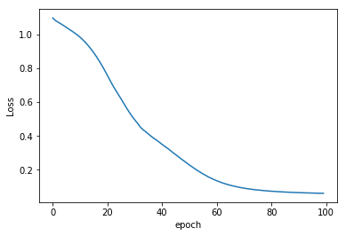
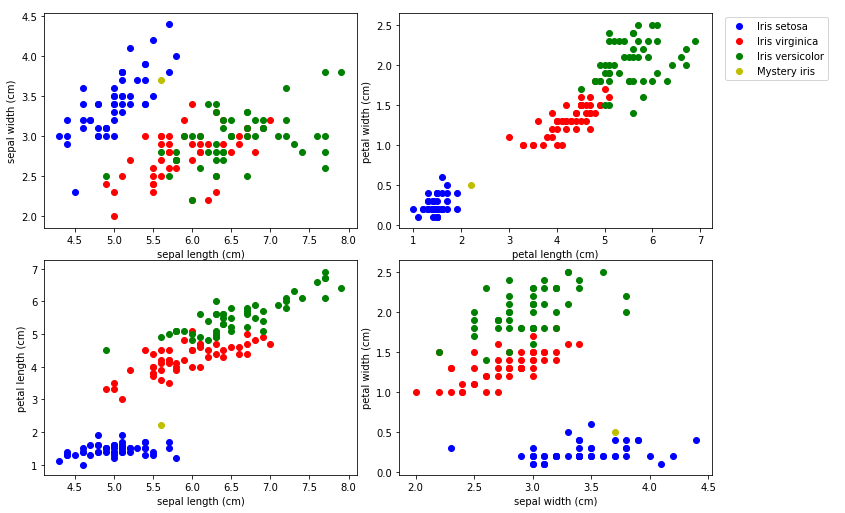

Pytorch for Deep Learning BootCamp
================
by Jawad Haider

# **03 - Basic PyTorch Neural Network**  
------------------------------------------------------------------------
<center>
<a href=''></a>
</center>
<center>
<em>Copyright Qalmaqihir</em>
</center>
<center>
<em>For more information, visit us at
<a href='http://www.github.com/qalmaqihir/'>www.github.com/qalmaqihir/</a></em>
</center>
------------------------------------------------------------------------


- <a href="#basic-pytorch-neural-network"
  id="toc-basic-pytorch-neural-network">Basic PyTorch Neural Network</a>
  - <a href="#perform-standard-imports"
    id="toc-perform-standard-imports">Perform standard imports</a>
  - <a href="#create-a-model-class" id="toc-create-a-model-class">Create a
    model class</a>
  - <a href="#load-the-iris-dataset" id="toc-load-the-iris-dataset">Load the
    iris dataset</a>
  - <a href="#plot-the-dataset" id="toc-plot-the-dataset">Plot the
    dataset</a>
  - <a href="#perform-traintestsplit"
    id="toc-perform-traintestsplit">Perform Train/Test/Split</a>
  - <a href="#prepare-dataloader" id="toc-prepare-dataloader">Prepare
    DataLoader</a>
  - <a href="#define-loss-equations-and-optimizations"
    id="toc-define-loss-equations-and-optimizations">Define loss equations
    and optimizations</a>
  - <a href="#train-the-model" id="toc-train-the-model">Train the model</a>
  - <a href="#plot-the-loss-function" id="toc-plot-the-loss-function">Plot
    the loss function</a>
  - <a href="#validate-the-model" id="toc-validate-the-model">Validate the
    model</a>
  - <a href="#save-the-trained-model-to-a-file"
    id="toc-save-the-trained-model-to-a-file">Save the trained model to a
    file</a>
    - <a href="#save-the-model" id="toc-save-the-model">Save the model</a>
    - <a href="#load-a-new-model" id="toc-load-a-new-model">Load a new
      model</a>
  - <a href="#apply-the-model-to-classify-new-unseen-data"
    id="toc-apply-the-model-to-classify-new-unseen-data">Apply the model to
    classify new, unseen data</a>
  - <a href="#great-job" id="toc-great-job">Great job!</a>

------------------------------------------------------------------------


# Basic PyTorch Neural Network

Now it’s time to put the pieces together. In this section we’ll: \*
create a multi-layer deep learning model \* load data \* train and
validate the model<br>

We’ll also introduce a new step: \* save and load a trained model

Our goal is to develop a model capable of classifying an iris plant
based on four features. This is a multi-class classification where each
sample can belong to ONE of 3 classes (<em>Iris setosa</em>, <em>Iris
virginica</em> or <em>Iris versicolor</em>). The network will have 4
input neurons (flower dimensions) and 3 output neurons (scores). Our
loss function will compare the target label (ground truth) to the
corresponding output score.

<div class="alert alert-info">

<strong>NOTE:</strong> Multi-class classifications usually involve
converting the target vector to a one_hot encoded matrix. That is, if 5
labels show up as<br>
<pre style='background-color:rgb(217,237,247)'>tensor([0,2,1,0,1])</pre>
then we would encode them as:
<pre style='background-color:rgb(217,237,247)'>tensor([[1, 0, 0],
        [0, 0, 1],
        [0, 1, 0],
        [1, 0, 0],
        [0, 1, 0]])</pre>
This is easily accomplished with
<a href='https://pytorch.org/docs/stable/nn.html#one-hot'><strong><tt>torch.nn.functional.one_hot()</tt></strong></a>.<br>
However, our loss function
<a href='https://pytorch.org/docs/stable/nn.html#crossentropyloss'><strong><tt>torch.nn.CrossEntropyLoss()</tt></strong></a>
takes care of this for us.

</div>

## Perform standard imports

``` python
import torch
import torch.nn as nn
import torch.nn.functional as F
from torch.utils.data import Dataset, DataLoader
from sklearn.model_selection import train_test_split

import pandas as pd
import matplotlib.pyplot as plt
%matplotlib inline
```

## Create a model class

For this exercise we’re using the Iris dataset. Since a single straight
line can’t classify three flowers we should include at least one hidden
layer in our model.

In the forward section we’ll use the
<a href='https://en.wikipedia.org/wiki/Rectifier_(neural_networks)'>rectified
linear unit</a> (ReLU) function<br>
=max(0,x)")<br>
as our activation function. This is available as a full module
<a href='https://pytorch.org/docs/stable/nn.html#relu'><strong><tt>torch.nn.ReLU</tt></strong></a>
or as just a functional call
<a href='https://pytorch.org/docs/stable/nn.html#id27'><strong><tt>torch.nn.functional.relu</tt></strong></a>

``` python
class Model(nn.Module):
    def __init__(self, in_features=4, h1=8, h2=9, out_features=3):
        super().__init__()
        self.fc1 = nn.Linear(in_features,h1)    # input layer
        self.fc2 = nn.Linear(h1, h2)            # hidden layer
        self.out = nn.Linear(h2, out_features)  # output layer
        
    def forward(self, x):
        x = F.relu(self.fc1(x))
        x = F.relu(self.fc2(x))
        x = self.out(x)
        return x
```

``` python
# Instantiate the Model class using parameter defaults:
torch.manual_seed(32)
model = Model()
```

## Load the iris dataset

``` python
df = pd.read_csv('../Data/iris.csv')
df.head()
```

<div>
<style scoped>
    .dataframe tbody tr th:only-of-type {
        vertical-align: middle;
    }

    .dataframe tbody tr th {
        vertical-align: top;
    }

    .dataframe thead th {
        text-align: right;
    }
</style>
<table border="1" class="dataframe">
  <thead>
    <tr style="text-align: right;">
      <th></th>
      <th>sepal length (cm)</th>
      <th>sepal width (cm)</th>
      <th>petal length (cm)</th>
      <th>petal width (cm)</th>
      <th>target</th>
    </tr>
  </thead>
  <tbody>
    <tr>
      <th>0</th>
      <td>5.1</td>
      <td>3.5</td>
      <td>1.4</td>
      <td>0.2</td>
      <td>0.0</td>
    </tr>
    <tr>
      <th>1</th>
      <td>4.9</td>
      <td>3.0</td>
      <td>1.4</td>
      <td>0.2</td>
      <td>0.0</td>
    </tr>
    <tr>
      <th>2</th>
      <td>4.7</td>
      <td>3.2</td>
      <td>1.3</td>
      <td>0.2</td>
      <td>0.0</td>
    </tr>
    <tr>
      <th>3</th>
      <td>4.6</td>
      <td>3.1</td>
      <td>1.5</td>
      <td>0.2</td>
      <td>0.0</td>
    </tr>
    <tr>
      <th>4</th>
      <td>5.0</td>
      <td>3.6</td>
      <td>1.4</td>
      <td>0.2</td>
      <td>0.0</td>
    </tr>
  </tbody>
</table>
</div>

## Plot the dataset

The iris dataset has 4 features. To get an idea how they correlate we
can plot four different relationships among them.<br> We’ll use the
index positions of the columns to grab their names in pairs with
<tt>plots = \[(0,1),(2,3),(0,2),(1,3)\]</tt>.<br> Here <tt>(0,1)</tt>
sets “sepal length (cm)” as <tt>x</tt> and “sepal width (cm)” as
<tt>y</tt>

``` python
fig, axes = plt.subplots(nrows=2, ncols=2, figsize=(10,7))
fig.tight_layout()

plots = [(0,1),(2,3),(0,2),(1,3)]
colors = ['b', 'r', 'g']
labels = ['Iris setosa','Iris virginica','Iris versicolor']

for i, ax in enumerate(axes.flat):
    for j in range(3):
        x = df.columns[plots[i][0]]
        y = df.columns[plots[i][1]]
        ax.scatter(df[df['target']==j][x], df[df['target']==j][y], color=colors[j])
        ax.set(xlabel=x, ylabel=y)

fig.legend(labels=labels, loc=3, bbox_to_anchor=(1.0,0.85))
plt.show()
```


## Perform Train/Test/Split

``` python
X = df.drop('target',axis=1).values
y = df['target'].values

X_train, X_test, y_train, y_test = train_test_split(X,y,test_size=0.2,random_state=33)

X_train = torch.FloatTensor(X_train)
X_test = torch.FloatTensor(X_test)
# y_train = F.one_hot(torch.LongTensor(y_train))  # not needed with Cross Entropy Loss
# y_test = F.one_hot(torch.LongTensor(y_test))
y_train = torch.LongTensor(y_train)
y_test = torch.LongTensor(y_test)
```

## Prepare DataLoader

For this analysis we don’t need to create a Dataset object, but we
should take advantage of PyTorch’s DataLoader tool. Even though our
dataset is small (120 training samples), we’ll load it into our model in
two batches. This technique becomes very helpful with large datasets.

Note that scikit-learn already shuffled the source dataset before
preparing train and test sets. We’ll still benefit from the DataLoader
shuffle utility for model training if we make multiple passes throught
the dataset.

``` python
trainloader = DataLoader(X_train, batch_size=60, shuffle=True)

testloader = DataLoader(X_test, batch_size=60, shuffle=False)
```

## Define loss equations and optimizations

As before, we’ll utilize
<a href='https://en.wikipedia.org/wiki/Cross_entropy'>Cross Entropy</a>
with
<a href='https://pytorch.org/docs/stable/nn.html#crossentropyloss'><strong><tt>torch.nn.CrossEntropyLoss()</tt></strong></a><br>
For the optimizer, we’ll use a variation of Stochastic Gradient Descent
called
<a href='https://en.wikipedia.org/wiki/Stochastic_gradient_descent#Adam'>Adam</a>
(short for Adaptive Moment Estimation), with
<a href='https://pytorch.org/docs/stable/optim.html#torch.optim.Adam'><strong><tt>torch.optim.Adam()</tt></strong></a>

``` python
# FOR REDO
torch.manual_seed(4)
model = Model()
```

``` python
criterion = nn.CrossEntropyLoss()
optimizer = torch.optim.Adam(model.parameters(), lr=0.01)
```

## Train the model

``` python
epochs = 100
losses = []

for i in range(epochs):
    i+=1
    y_pred = model.forward(X_train)
    loss = criterion(y_pred, y_train)
    losses.append(loss)
    
    # a neat trick to save screen space:
    if i%10 == 1:
        print(f'epoch: {i:2}  loss: {loss.item():10.8f}')

    optimizer.zero_grad()
    loss.backward()
    optimizer.step()
```

    epoch:  1  loss: 1.09568226
    epoch: 11  loss: 0.98190653
    epoch: 21  loss: 0.75652307
    epoch: 31  loss: 0.49447522
    epoch: 41  loss: 0.34981874
    epoch: 51  loss: 0.22807853
    epoch: 61  loss: 0.13547322
    epoch: 71  loss: 0.09162075
    epoch: 81  loss: 0.07378192
    epoch: 91  loss: 0.06546164

## Plot the loss function

``` python
plt.plot(range(epochs), losses)
plt.ylabel('Loss')
plt.xlabel('epoch');
```



## Validate the model

Now we run the test set through the model to see if the loss calculation
resembles the training data.

``` python
# TO EVALUATE THE ENTIRE TEST SET
with torch.no_grad():
    y_val = model.forward(X_test)
    loss = criterion(y_val, y_test)
print(f'{loss:.8f}')
```

    0.06246195

``` python
correct = 0
with torch.no_grad():
    for i,data in enumerate(X_test):
        y_val = model.forward(data)
        print(f'{i+1:2}. {str(y_val):38}  {y_test[i]}')
        if y_val.argmax().item() == y_test[i]:
            correct += 1
print(f'\n{correct} out of {len(y_test)} = {100*correct/len(y_test):.2f}% correct')
```

     1. tensor([-0.3355,  7.3630,  1.3783])     1
     2. tensor([0.2775, 8.1554, 0.4269])        1
     3. tensor([ 11.9969,   6.1847, -19.1976])  0
     4. tensor([-2.0187,  7.9664,  4.2447])     1
     5. tensor([-6.1348,  7.9516, 11.0913])     2
     6. tensor([-10.2635,   8.3101,  17.9998])  2
     7. tensor([ 12.0542,   6.4321, -19.2909])  0
     8. tensor([ 12.9507,   6.4819, -20.7540])  0
     9. tensor([-5.7723,  8.2435, 10.5083])     2
    10. tensor([-7.8867,  8.6126, 14.0731])     2
    11. tensor([-8.7055,  8.6074, 15.4337])     2
    12. tensor([ 11.6358,   5.8167, -18.6220])  0
    13. tensor([-8.1009,  8.2331, 14.3888])     2
    14. tensor([-2.0791,  7.7752,  4.3188])     1
    15. tensor([-6.0828,  8.3916, 11.0586])     2
    16. tensor([0.1360, 7.8660, 0.6409])        1
    17. tensor([-4.0875,  7.7217,  7.6642])     2
    18. tensor([ 13.1522,   6.5911, -21.0798])  0
    19. tensor([-1.5644,  8.0222,  3.4754])     1
    20. tensor([-6.2859,  8.9728, 11.4248])     2
    21. tensor([ 12.3859,   6.2571, -19.8275])  0
    22. tensor([ 13.8200,   7.0859, -22.1528])  0
    23. tensor([-8.8470,  8.3180, 15.6476])     2
    24. tensor([ 12.1979,   6.1264, -19.5260])  0
    25. tensor([-5.8084,  7.5468, 10.5340])     2
    26. tensor([-4.4526,  7.7876,  8.2865])     2
    27. tensor([-1.4284,  7.7786,  3.2328])     1
    28. tensor([ 0.5356,  7.5360, -0.0492])     1
    29. tensor([-5.8230,  8.1573, 10.5975])     2
    30. tensor([-5.2569,  7.7476,  9.6105])     2

    29 out of 30 = 96.67% correct

Here we can see that \#17 was misclassified.

## Save the trained model to a file

Right now <strong><tt>model</tt></strong> has been trained and
validated, and seems to correctly classify an iris 97% of the time.
Let’s save this to disk.<br> The tools we’ll use are
<a href='https://pytorch.org/docs/stable/torch.html#torch.save'><strong><tt>torch.save()</tt></strong></a>
and
<a href='https://pytorch.org/docs/stable/torch.html#torch.load'><strong><tt>torch.load()</tt></strong></a><br>

There are two basic ways to save a model.<br>

The first saves/loads the `state_dict` (learned parameters) of the
model, but not the model class. The syntax follows:<br>
<tt><strong>Save:</strong> torch.save(model.state_dict(), PATH)<br><br>
<strong>Load:</strong> model = TheModelClass(\*args, \*\*kwargs)<br>
      model.load_state_dict(torch.load(PATH))<br>
      model.eval()</tt>

The second saves the entire model including its class and parameters as
a pickle file. Care must be taken if you want to load this into another
notebook to make sure all the target data is brought in properly.<br>
<tt><strong>Save:</strong> torch.save(model, PATH)<br><br>
<strong>Load:</strong> model = torch.load(PATH))<br>
      model.eval()</tt>

In either method, you must call <tt>model.eval()</tt> to set dropout and
batch normalization layers to evaluation mode before running inference.
Failing to do this will yield inconsistent inference results.

For more information visit
https://pytorch.org/tutorials/beginner/saving_loading_models.html

### Save the model

``` python
torch.save(model.state_dict(), 'IrisDatasetModel.pt')
```

### Load a new model

We’ll load a new model object and test it as we had before to make sure
it worked.

``` python
new_model = Model()
new_model.load_state_dict(torch.load('IrisDatasetModel.pt'))
new_model.eval()
```

    Model(
      (fc1): Linear(in_features=4, out_features=8, bias=True)
      (fc2): Linear(in_features=8, out_features=9, bias=True)
      (out): Linear(in_features=9, out_features=3, bias=True)
    )

``` python
with torch.no_grad():
    y_val = new_model.forward(X_test)
    loss = criterion(y_val, y_test)
print(f'{loss:.8f}')
```

    0.06246195

## Apply the model to classify new, unseen data

``` python
mystery_iris = torch.tensor([5.6,3.7,2.2,0.5])
```

Let’s plot this new iris in yellow to see where it falls in relation to
the others:

``` python
fig, axes = plt.subplots(nrows=2, ncols=2, figsize=(10,7))
fig.tight_layout()

plots = [(0,1),(2,3),(0,2),(1,3)]
colors = ['b', 'r', 'g']
labels = ['Iris setosa','Iris virginica','Iris versicolor','Mystery iris']

for i, ax in enumerate(axes.flat):
    for j in range(3):
        x = df.columns[plots[i][0]]
        y = df.columns[plots[i][1]]
        ax.scatter(df[df['target']==j][x], df[df['target']==j][y], color=colors[j])
        ax.set(xlabel=x, ylabel=y)
        
    # Add a plot for our mystery iris:
    ax.scatter(mystery_iris[plots[i][0]],mystery_iris[plots[i][1]], color='y')
    
fig.legend(labels=labels, loc=3, bbox_to_anchor=(1.0,0.85))
plt.show()
```



Now run it through the model:

``` python
with torch.no_grad():
    print(new_model(mystery_iris))
    print()
    print(labels[new_model(mystery_iris).argmax()])
```

    tensor([ 12.2116,   7.1285, -19.5247])

    Iris setosa

## Great job!
