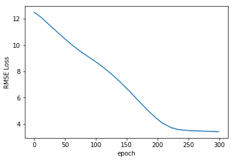

================
by Jawad Haider

# **04 - Full Artificial Neural Network Code Along**  
------------------------------------------------------------------------
<center>
<a href=''></a>
</center>
<center>
<em>Copyright Qalmaqihir</em>
</center>
<center>
<em>For more information, visit us at
<a href='http://www.github.com/qalmaqihir/'>www.github.com/qalmaqihir/</a></em>
</center>
------------------------------------------------------------------------


- <a href="#full-artificial-neural-network-code-along"
  id="toc-full-artificial-neural-network-code-along">Full Artificial
  Neural Network Code Along</a>
  - <a href="#working-with-tabular-data"
    id="toc-working-with-tabular-data">Working with tabular data</a>
  - <a href="#perform-standard-imports"
    id="toc-perform-standard-imports">Perform standard imports</a>
  - <a href="#load-the-nyc-taxi-fares-dataset"
    id="toc-load-the-nyc-taxi-fares-dataset">Load the NYC Taxi Fares
    dataset</a>
  - <a href="#calculate-the-distance-traveled"
    id="toc-calculate-the-distance-traveled">Calculate the distance
    traveled</a>
  - <a href="#add-a-datetime-column-and-derive-useful-statistics"
    id="toc-add-a-datetime-column-and-derive-useful-statistics">Add a
    datetime column and derive useful statistics</a>
  - <a href="#separate-categorical-from-continuous-columns"
    id="toc-separate-categorical-from-continuous-columns">Separate
    categorical from continuous columns</a>
  - <a href="#categorify" id="toc-categorify">Categorify</a>
  - <a href="#convert-numpy-arrays-to-tensors"
    id="toc-convert-numpy-arrays-to-tensors">Convert numpy arrays to
    tensors</a>
  - <a href="#set-an-embedding-size" id="toc-set-an-embedding-size">Set an
    embedding size</a>
  - <a href="#define-a-tabularmodel" id="toc-define-a-tabularmodel">Define a
    TabularModel</a>
  - <a href="#define-loss-function-optimizer"
    id="toc-define-loss-function-optimizer">Define loss function &amp;
    optimizer</a>
  - <a href="#perform-traintest-splits"
    id="toc-perform-traintest-splits">Perform train/test splits</a>
  - <a href="#train-the-model" id="toc-train-the-model">Train the model</a>
  - <a href="#plot-the-loss-function" id="toc-plot-the-loss-function">Plot
    the loss function</a>
  - <a href="#validate-the-model" id="toc-validate-the-model">Validate the
    model</a>
  - <a href="#save-the-model" id="toc-save-the-model">Save the model</a>
  - <a href="#loading-a-saved-model-starting-from-scratch"
    id="toc-loading-a-saved-model-starting-from-scratch">Loading a saved
    model (starting from scratch)</a>
  - <a href="#feed-new-data-through-the-trained-model"
    id="toc-feed-new-data-through-the-trained-model">Feed new data through
    the trained model</a>
  - <a href="#great-job" id="toc-great-job">Great job!</a>

------------------------------------------------------------------------

# Full Artificial Neural Network Code Along

In the last section we took in four continuous variables (lengths) to
perform a classification. In this section we’ll combine continuous and
categorical data to perform a regression. The goal is to estimate the
cost of a New York City cab ride from several inputs. The inspiration
behind this code along is a recent
<a href='https://www.kaggle.com/c/new-york-city-taxi-fare-prediction'>Kaggle
competition</a>.

<div class="alert alert-success">

<strong>NOTE:</strong> In this notebook we’ll perform a regression with
one output value. In the next one we’ll perform a binary classification
with two output values.

</div>

## Working with tabular data

Deep learning with neural networks is often associated with
sophisticated image recognition, and in upcoming sections we’ll train
models based on properties like pixels patterns and colors.

Here we’re working with tabular data (spreadsheets, SQL tables, etc.)
with columns of values that may or may not be relevant. As it happens,
neural networks can learn to make connections we probably wouldn’t have
developed on our own. However, to do this we have to handle categorical
values separately from continuous ones. Make sure to watch the theory
lectures! You’ll want to be comfortable with: \* continuous
vs. categorical values \* embeddings \* batch normalization \* dropout
layers

## Perform standard imports

``` python
import torch
import torch.nn as nn

import numpy as np
import pandas as pd
import matplotlib.pyplot as plt
%matplotlib inline
```

## Load the NYC Taxi Fares dataset

The
<a href='https://www.kaggle.com/c/new-york-city-taxi-fare-prediction'>Kaggle
competition</a> provides a dataset with about 55 million records. The
data contains only the pickup date & time, the latitude & longitude (GPS
coordinates) of the pickup and dropoff locations, and the number of
passengers. It is up to the contest participant to extract any further
information. For instance, does the time of day matter? The day of the
week? How do we determine the distance traveled from pairs of GPS
coordinates?

For this exercise we’ve whittled the dataset down to just 120,000
records from April 11 to April 24, 2010. The records are randomly
sorted. We’ll show how to calculate distance from GPS coordinates, and
how to create a pandas datatime object from a text column. This will let
us quickly get information like day of the week, am vs. pm, etc.

Let’s get started!

``` python
df = pd.read_csv('../Data/NYCTaxiFares.csv')
df.head()
```

<div>
<style scoped>
    .dataframe tbody tr th:only-of-type {
        vertical-align: middle;
    }

    .dataframe tbody tr th {
        vertical-align: top;
    }

    .dataframe thead th {
        text-align: right;
    }
</style>
<table border="1" class="dataframe">
  <thead>
    <tr style="text-align: right;">
      <th></th>
      <th>pickup_datetime</th>
      <th>fare_amount</th>
      <th>fare_class</th>
      <th>pickup_longitude</th>
      <th>pickup_latitude</th>
      <th>dropoff_longitude</th>
      <th>dropoff_latitude</th>
      <th>passenger_count</th>
    </tr>
  </thead>
  <tbody>
    <tr>
      <th>0</th>
      <td>2010-04-19 08:17:56 UTC</td>
      <td>6.5</td>
      <td>0</td>
      <td>-73.992365</td>
      <td>40.730521</td>
      <td>-73.975499</td>
      <td>40.744746</td>
      <td>1</td>
    </tr>
    <tr>
      <th>1</th>
      <td>2010-04-17 15:43:53 UTC</td>
      <td>6.9</td>
      <td>0</td>
      <td>-73.990078</td>
      <td>40.740558</td>
      <td>-73.974232</td>
      <td>40.744114</td>
      <td>1</td>
    </tr>
    <tr>
      <th>2</th>
      <td>2010-04-17 11:23:26 UTC</td>
      <td>10.1</td>
      <td>1</td>
      <td>-73.994149</td>
      <td>40.751118</td>
      <td>-73.960064</td>
      <td>40.766235</td>
      <td>2</td>
    </tr>
    <tr>
      <th>3</th>
      <td>2010-04-11 21:25:03 UTC</td>
      <td>8.9</td>
      <td>0</td>
      <td>-73.990485</td>
      <td>40.756422</td>
      <td>-73.971205</td>
      <td>40.748192</td>
      <td>1</td>
    </tr>
    <tr>
      <th>4</th>
      <td>2010-04-17 02:19:01 UTC</td>
      <td>19.7</td>
      <td>1</td>
      <td>-73.990976</td>
      <td>40.734202</td>
      <td>-73.905956</td>
      <td>40.743115</td>
      <td>1</td>
    </tr>
  </tbody>
</table>
</div>

``` python
df['fare_amount'].describe()
```

    count    120000.000000
    mean         10.040326
    std           7.500134
    min           2.500000
    25%           5.700000
    50%           7.700000
    75%          11.300000
    max          49.900000
    Name: fare_amount, dtype: float64

From this we see that fares range from \\\$2.50 to \\\$49.90, with a
mean of \\\$10.04 and a median of \\\$7.70

## Calculate the distance traveled

The <a href='https://en.wikipedia.org/wiki/Haversine_formula'>haversine
formula</a> calculates the distance on a sphere between two sets of GPS
coordinates.<br> Here we assign latitude values with

(phi) and longitude with

(lambda).

The distance formula works out to

+\cos(\varphi _{1})\:\cos(\varphi _{2})\:\sin ^{2}\left({\frac {\lambda _{2}-\lambda _{1}}{2}}\right)}}\right)}")

where

}\\ \varphi_1, \varphi_2&: \textrm {latitudes of point 1 and point 2}\\ \lambda_1, \lambda_2&: \textrm {longitudes of point 1 and point 2}\end{split}")

``` python
def haversine_distance(df, lat1, long1, lat2, long2):
    """
    Calculates the haversine distance between 2 sets of GPS coordinates in df
    """
    r = 6371  # average radius of Earth in kilometers
       
    phi1 = np.radians(df[lat1])
    phi2 = np.radians(df[lat2])
    
    delta_phi = np.radians(df[lat2]-df[lat1])
    delta_lambda = np.radians(df[long2]-df[long1])
     
    a = np.sin(delta_phi/2)**2 + np.cos(phi1) * np.cos(phi2) * np.sin(delta_lambda/2)**2
    c = 2 * np.arctan2(np.sqrt(a), np.sqrt(1-a))
    d = (r * c) # in kilometers

    return d
```

``` python
df['dist_km'] = haversine_distance(df,'pickup_latitude', 'pickup_longitude', 'dropoff_latitude', 'dropoff_longitude')
df.head()
```

<div>
<style scoped>
    .dataframe tbody tr th:only-of-type {
        vertical-align: middle;
    }

    .dataframe tbody tr th {
        vertical-align: top;
    }

    .dataframe thead th {
        text-align: right;
    }
</style>
<table border="1" class="dataframe">
  <thead>
    <tr style="text-align: right;">
      <th></th>
      <th>pickup_datetime</th>
      <th>fare_amount</th>
      <th>fare_class</th>
      <th>pickup_longitude</th>
      <th>pickup_latitude</th>
      <th>dropoff_longitude</th>
      <th>dropoff_latitude</th>
      <th>passenger_count</th>
      <th>dist_km</th>
    </tr>
  </thead>
  <tbody>
    <tr>
      <th>0</th>
      <td>2010-04-19 08:17:56 UTC</td>
      <td>6.5</td>
      <td>0</td>
      <td>-73.992365</td>
      <td>40.730521</td>
      <td>-73.975499</td>
      <td>40.744746</td>
      <td>1</td>
      <td>2.126312</td>
    </tr>
    <tr>
      <th>1</th>
      <td>2010-04-17 15:43:53 UTC</td>
      <td>6.9</td>
      <td>0</td>
      <td>-73.990078</td>
      <td>40.740558</td>
      <td>-73.974232</td>
      <td>40.744114</td>
      <td>1</td>
      <td>1.392307</td>
    </tr>
    <tr>
      <th>2</th>
      <td>2010-04-17 11:23:26 UTC</td>
      <td>10.1</td>
      <td>1</td>
      <td>-73.994149</td>
      <td>40.751118</td>
      <td>-73.960064</td>
      <td>40.766235</td>
      <td>2</td>
      <td>3.326763</td>
    </tr>
    <tr>
      <th>3</th>
      <td>2010-04-11 21:25:03 UTC</td>
      <td>8.9</td>
      <td>0</td>
      <td>-73.990485</td>
      <td>40.756422</td>
      <td>-73.971205</td>
      <td>40.748192</td>
      <td>1</td>
      <td>1.864129</td>
    </tr>
    <tr>
      <th>4</th>
      <td>2010-04-17 02:19:01 UTC</td>
      <td>19.7</td>
      <td>1</td>
      <td>-73.990976</td>
      <td>40.734202</td>
      <td>-73.905956</td>
      <td>40.743115</td>
      <td>1</td>
      <td>7.231321</td>
    </tr>
  </tbody>
</table>
</div>

## Add a datetime column and derive useful statistics

By creating a datetime object, we can extract information like “day of
the week”, “am vs. pm” etc. Note that the data was saved in UTC time.
Our data falls in April of 2010 which occurred during Daylight Savings
Time in New York. For that reason, we’ll make an adjustment to EDT using
UTC-4 (subtracting four hours).

``` python
df['EDTdate'] = pd.to_datetime(df['pickup_datetime'].str[:19]) - pd.Timedelta(hours=4)
df['Hour'] = df['EDTdate'].dt.hour
df['AMorPM'] = np.where(df['Hour']<12,'am','pm')
df['Weekday'] = df['EDTdate'].dt.strftime("%a")
df.head()
```

<div>
<style scoped>
    .dataframe tbody tr th:only-of-type {
        vertical-align: middle;
    }

    .dataframe tbody tr th {
        vertical-align: top;
    }

    .dataframe thead th {
        text-align: right;
    }
</style>
<table border="1" class="dataframe">
  <thead>
    <tr style="text-align: right;">
      <th></th>
      <th>pickup_datetime</th>
      <th>fare_amount</th>
      <th>fare_class</th>
      <th>pickup_longitude</th>
      <th>pickup_latitude</th>
      <th>dropoff_longitude</th>
      <th>dropoff_latitude</th>
      <th>passenger_count</th>
      <th>dist_km</th>
      <th>EDTdate</th>
      <th>Hour</th>
      <th>AMorPM</th>
      <th>Weekday</th>
    </tr>
  </thead>
  <tbody>
    <tr>
      <th>0</th>
      <td>2010-04-19 08:17:56 UTC</td>
      <td>6.5</td>
      <td>0</td>
      <td>-73.992365</td>
      <td>40.730521</td>
      <td>-73.975499</td>
      <td>40.744746</td>
      <td>1</td>
      <td>2.126312</td>
      <td>2010-04-19 04:17:56</td>
      <td>4</td>
      <td>am</td>
      <td>Mon</td>
    </tr>
    <tr>
      <th>1</th>
      <td>2010-04-17 15:43:53 UTC</td>
      <td>6.9</td>
      <td>0</td>
      <td>-73.990078</td>
      <td>40.740558</td>
      <td>-73.974232</td>
      <td>40.744114</td>
      <td>1</td>
      <td>1.392307</td>
      <td>2010-04-17 11:43:53</td>
      <td>11</td>
      <td>am</td>
      <td>Sat</td>
    </tr>
    <tr>
      <th>2</th>
      <td>2010-04-17 11:23:26 UTC</td>
      <td>10.1</td>
      <td>1</td>
      <td>-73.994149</td>
      <td>40.751118</td>
      <td>-73.960064</td>
      <td>40.766235</td>
      <td>2</td>
      <td>3.326763</td>
      <td>2010-04-17 07:23:26</td>
      <td>7</td>
      <td>am</td>
      <td>Sat</td>
    </tr>
    <tr>
      <th>3</th>
      <td>2010-04-11 21:25:03 UTC</td>
      <td>8.9</td>
      <td>0</td>
      <td>-73.990485</td>
      <td>40.756422</td>
      <td>-73.971205</td>
      <td>40.748192</td>
      <td>1</td>
      <td>1.864129</td>
      <td>2010-04-11 17:25:03</td>
      <td>17</td>
      <td>pm</td>
      <td>Sun</td>
    </tr>
    <tr>
      <th>4</th>
      <td>2010-04-17 02:19:01 UTC</td>
      <td>19.7</td>
      <td>1</td>
      <td>-73.990976</td>
      <td>40.734202</td>
      <td>-73.905956</td>
      <td>40.743115</td>
      <td>1</td>
      <td>7.231321</td>
      <td>2010-04-16 22:19:01</td>
      <td>22</td>
      <td>pm</td>
      <td>Fri</td>
    </tr>
  </tbody>
</table>
</div>

``` python
df['EDTdate'].min()
```

    Timestamp('2010-04-11 00:00:10')

``` python
df['EDTdate'].max()
```

    Timestamp('2010-04-24 23:59:42')

## Separate categorical from continuous columns

``` python
df.columns
```

    Index(['pickup_datetime', 'fare_amount', 'fare_class', 'pickup_longitude',
           'pickup_latitude', 'dropoff_longitude', 'dropoff_latitude',
           'passenger_count', 'dist_km', 'EDTdate', 'Hour', 'AMorPM', 'Weekday'],
          dtype='object')

``` python
cat_cols = ['Hour', 'AMorPM', 'Weekday']
cont_cols = ['pickup_latitude', 'pickup_longitude', 'dropoff_latitude', 'dropoff_longitude', 'passenger_count', 'dist_km']
y_col = ['fare_amount']  # this column contains the labels
```

<div class="alert alert-info">

<strong>NOTE:</strong> If you plan to use all of the columns in the data
table, there’s a shortcut to grab the remaining continuous columns:<br>
<pre style='background-color:rgb(217,237,247)'>cont_cols = [col for col in df.columns if col not in cat_cols + y_col]</pre>
Here we entered the continuous columns explicitly because there are
columns we’re not running through the model (pickup_datetime and
EDTdate)

</div>

## Categorify

Pandas offers a
<a href='https://pandas.pydata.org/pandas-docs/stable/user_guide/categorical.html'><strong>category
dtype</strong></a> for converting categorical values to numerical codes.
A dataset containing months of the year will be assigned 12 codes, one
for each month. These will usually be the integers 0 to 11. Pandas
replaces the column values with codes, and retains an index list of
category values. In the steps ahead we’ll call the categorical values
“names” and the encodings “codes”.

``` python
# Convert our three categorical columns to category dtypes.
for cat in cat_cols:
    df[cat] = df[cat].astype('category')
```

``` python
df.dtypes
```

    pickup_datetime              object
    fare_amount                 float64
    fare_class                    int64
    pickup_longitude            float64
    pickup_latitude             float64
    dropoff_longitude           float64
    dropoff_latitude            float64
    passenger_count               int64
    dist_km                     float64
    EDTdate              datetime64[ns]
    Hour                       category
    AMorPM                     category
    Weekday                    category
    dtype: object

We can see that <tt>df\[‘Hour’\]</tt> is a categorical feature by
displaying some of the rows:

``` python
df['Hour'].head()
```

    0     4
    1    11
    2     7
    3    17
    4    22
    Name: Hour, dtype: category
    Categories (24, int64): [0, 1, 2, 3, ..., 20, 21, 22, 23]

Here our categorical names are the integers 0 through 23, for a total of
24 unique categories. These values <em>also</em> correspond to the codes
assigned to each name.

We can access the category names with <tt>Series.cat.categories</tt> or
just the codes with <tt>Series.cat.codes</tt>. This will make more sense
if we look at <tt>df\[‘AMorPM’\]</tt>:

``` python
df['AMorPM'].head()
```

    0    am
    1    am
    2    am
    3    pm
    4    pm
    Name: AMorPM, dtype: category
    Categories (2, object): [am, pm]

``` python
df['AMorPM'].cat.categories
```

    Index(['am', 'pm'], dtype='object')

``` python
df['AMorPM'].head().cat.codes
```

    0    0
    1    0
    2    0
    3    1
    4    1
    dtype: int8

``` python
df['Weekday'].cat.categories
```

    Index(['Fri', 'Mon', 'Sat', 'Sun', 'Thu', 'Tue', 'Wed'], dtype='object')

``` python
df['Weekday'].head().cat.codes
```

    0    1
    1    2
    2    2
    3    3
    4    0
    dtype: int8

<div class="alert alert-info">

<strong>NOTE: </strong>NaN values in categorical data are assigned a
code of -1. We don’t have any in this particular dataset.

</div>

Now we want to combine the three categorical columns into one input
array using
<a href='https://docs.scipy.org/doc/numpy/reference/generated/numpy.stack.html'><tt>numpy.stack</tt></a>
We don’t want the Series index, just the values.

``` python
hr = df['Hour'].cat.codes.values
ampm = df['AMorPM'].cat.codes.values
wkdy = df['Weekday'].cat.codes.values

cats = np.stack([hr, ampm, wkdy], 1)

cats[:5]
```

    array([[ 4,  0,  1],
           [11,  0,  2],
           [ 7,  0,  2],
           [17,  1,  3],
           [22,  1,  0]], dtype=int8)

<div class="alert alert-info">

<strong>NOTE:</strong> This can be done in one line of code using a list
comprehension:
<pre style='background-color:rgb(217,237,247)'>cats = np.stack([df[col].cat.codes.values for col in cat_cols], 1)</pre>
Don’t worry about the dtype for now, we can make it int64 when we
convert it to a tensor.

</div>

## Convert numpy arrays to tensors

``` python
# Convert categorical variables to a tensor
cats = torch.tensor(cats, dtype=torch.int64) 
# this syntax is ok, since the source data is an array, not an existing tensor

cats[:5]
```

    tensor([[ 4,  0,  1],
            [11,  0,  2],
            [ 7,  0,  2],
            [17,  1,  3],
            [22,  1,  0]])

We can feed all of our continuous variables into the model as a tensor.
Note that we’re not normalizing the values here; we’ll let the model
perform this step.

<div class="alert alert-info">

<strong>NOTE:</strong> We have to store <tt>conts</tt> and <tt>y</tt> as
Float (float32) tensors, not Double (float64) in order for batch
normalization to work properly.

</div>

``` python
# Convert continuous variables to a tensor
conts = np.stack([df[col].values for col in cont_cols], 1)
conts = torch.tensor(conts, dtype=torch.float)
conts[:5]
```

    tensor([[ 40.7305, -73.9924,  40.7447, -73.9755,   1.0000,   2.1263],
            [ 40.7406, -73.9901,  40.7441, -73.9742,   1.0000,   1.3923],
            [ 40.7511, -73.9941,  40.7662, -73.9601,   2.0000,   3.3268],
            [ 40.7564, -73.9905,  40.7482, -73.9712,   1.0000,   1.8641],
            [ 40.7342, -73.9910,  40.7431, -73.9060,   1.0000,   7.2313]])

``` python
conts.type()
```

    'torch.FloatTensor'

``` python
# Convert labels to a tensor
y = torch.tensor(df[y_col].values, dtype=torch.float).reshape(-1,1)

y[:5]
```

    tensor([[ 6.5000],
            [ 6.9000],
            [10.1000],
            [ 8.9000],
            [19.7000]])

``` python
cats.shape
```

    torch.Size([120000, 3])

``` python
conts.shape
```

    torch.Size([120000, 6])

``` python
y.shape
```

    torch.Size([120000, 1])

## Set an embedding size

The rule of thumb for determining the embedding size is to divide the
number of unique entries in each column by 2, but not to exceed 50.

``` python
# This will set embedding sizes for Hours, AMvsPM and Weekdays
cat_szs = [len(df[col].cat.categories) for col in cat_cols]
emb_szs = [(size, min(50, (size+1)//2)) for size in cat_szs]
emb_szs
```

    [(24, 12), (2, 1), (7, 4)]

## Define a TabularModel

This somewhat follows the
<a href='https://docs.fast.ai/tabular.models.html'>fast.ai library</a>
The goal is to define a model based on the number of continuous columns
(given by <tt>conts.shape\[1\]</tt>) plus the number of categorical
columns and their embeddings (given by <tt>len(emb_szs)</tt> and
<tt>emb_szs</tt> respectively). The output would either be a regression
(a single float value), or a classification (a group of bins and their
softmax values). For this exercise our output will be a single
regression value. Note that we’ll assume our data contains both
categorical and continuous data. You can add boolean parameters to your
own model class to handle a variety of datasets.

<div class="alert alert-info">

<strong>Let’s walk through the steps we’re about to take. See below for
more detailed illustrations of the steps.</strong><br>

1.  Extend the base Module class, set up the following parameters:
    - <tt>emb_szs: </tt>list of tuples: each categorical variable size
      is paired with an embedding size
    - <tt>n_cont: </tt>int: number of continuous variables
    - <tt>out_sz: </tt>int: output size
    - <tt>layers: </tt>list of ints: layer sizes
    - <tt>p: </tt>float: dropout probability for each layer (for
      simplicity we’ll use the same value throughout)

<tt><font color=black>class TabularModel(nn.Module):<br>     def
\_\_init\_\_(self, emb_szs, n_cont, out_sz, layers, p=0.5):<br>
        super().\_\_init\_\_()</font></tt><br>

2.  Set up the embedded layers with
    <a href='https://pytorch.org/docs/stable/nn.html#modulelist'><tt><strong>torch.nn.ModuleList()</strong></tt></a>
    and
    <a href='https://pytorch.org/docs/stable/nn.html#embedding'><tt><strong>torch.nn.Embedding()</strong></tt></a><br>Categorical
    data will be filtered through these Embeddings in the forward
    section.<br> <tt><font color=black>    self.embeds =
    nn.ModuleList(\[nn.Embedding(ni, nf) for ni,nf in
    emb_szs\])</font></tt><br><br>
3.  Set up a dropout function for the embeddings with
    <a href='https://pytorch.org/docs/stable/nn.html#dropout'><tt><strong>torch.nn.Dropout()</strong></tt></a>
    The default p-value=0.5<br> <tt><font color=black>    self.emb_drop
    = nn.Dropout(emb_drop)</font></tt><br><br>
4.  Set up a normalization function for the continuous variables with
    <a href='https://pytorch.org/docs/stable/nn.html#batchnorm1d'><tt><strong>torch.nn.BatchNorm1d()</strong></tt></a><br>
    <tt><font color=black>    self.bn_cont =
    nn.BatchNorm1d(n_cont)</font></tt><br><br>
5.  Set up a sequence of neural network layers where each level includes
    a Linear function, an activation function (we’ll use
    <a href='https://pytorch.org/docs/stable/nn.html#relu'><strong>ReLU</strong></a>),
    a normalization step, and a dropout layer. We’ll combine the list of
    layers with
    <a href='https://pytorch.org/docs/stable/nn.html#sequential'><tt><strong>torch.nn.Sequential()</strong></tt></a><br>
    <tt><font color=black>    self.bn_cont = nn.BatchNorm1d(n_cont)<br>
        layerlist = \[\]<br>     n_emb = sum((nf for ni,nf in
    emb_szs))<br>     n_in = n_emb + n_cont<br> <br>     for i in
    layers:<br>       layerlist.append(nn.Linear(n_in,i)) <br>
          layerlist.append(nn.ReLU(inplace=True))<br>
          layerlist.append(nn.BatchNorm1d(i))<br>
          layerlist.append(nn.Dropout(p))<br>       n_in = i<br>
        layerlist.append(nn.Linear(layers\[-1\],out_sz))<br> <br>
        self.layers = nn.Sequential(\*layerlist)</font></tt><br><br>
6.  Define the forward method. Preprocess the embeddings and normalize
    the continuous variables before passing them through the
    layers.<br>Use
    <a href='https://pytorch.org/docs/stable/torch.html#torch.cat'><tt><strong>torch.cat()</strong></tt></a>
    to combine multiple tensors into one.<br>
    <tt><font color=black>    def forward(self, x_cat, x_cont):<br>
        embeddings = \[\]<br>     for i,e in enumerate(self.embeds):<br>
          embeddings.append(e(x_cat\[:,i\]))<br>     x =
    torch.cat(embeddings, 1)<br>     x = self.emb_drop(x)<br> <br>
        x_cont = self.bn_cont(x_cont)<br>     x = torch.cat(\[x,
    x_cont\], 1)<br>     x = self.layers(x)<br>     return x</font></tt>

</div>

<div class="alert alert-danger">

<strong>Breaking down the embeddings steps</strong> (this code is for
illustration purposes only.)

</div>

``` python
# This is our source data
catz = cats[:4]
catz
```

    tensor([[ 4,  0,  1],
            [11,  0,  2],
            [ 7,  0,  2],
            [17,  1,  3]])

``` python
# This is passed in when the model is instantiated
emb_szs
```

    [(24, 12), (2, 1), (7, 4)]

``` python
# This is assigned inside the __init__() method
selfembeds = nn.ModuleList([nn.Embedding(ni, nf) for ni,nf in emb_szs])
selfembeds
```

    ModuleList(
      (0): Embedding(24, 12)
      (1): Embedding(2, 1)
      (2): Embedding(7, 4)
    )

``` python
list(enumerate(selfembeds))
```

    [(0, Embedding(24, 12)), (1, Embedding(2, 1)), (2, Embedding(7, 4))]

``` python
# This happens inside the forward() method
embeddingz = []
for i,e in enumerate(selfembeds):
    embeddingz.append(e(catz[:,i]))
embeddingz
```

    [tensor([[ 0.7031,  0.5132, -1.0168,  1.3594,  0.7909, -1.2648,  0.9565,  0.6827,
               0.4922,  0.1282, -0.9863,  0.2622],
             [ 0.0402, -0.8209,  2.5186,  0.5037,  0.0925,  0.0058,  1.0398,  1.7655,
               0.0216, -0.1349, -1.0968,  1.4534],
             [ 0.5162, -0.6815,  1.4828,  0.1271,  1.1672,  0.8569,  1.1472,  0.7672,
               0.4720,  1.3629,  1.2446,  0.3470],
             [ 0.1047,  0.2153, -1.4652, -1.6907, -0.0670,  0.9863,  0.7836, -1.3762,
               1.6670,  0.1276,  1.2241,  0.1415]], grad_fn=<EmbeddingBackward>),
     tensor([[-1.1156],
             [-1.1156],
             [-1.1156],
             [-0.7577]], grad_fn=<EmbeddingBackward>),
     tensor([[-0.8579, -0.4516,  0.3814,  0.9935],
             [ 0.6264, -1.1347,  1.9039,  1.1867],
             [ 0.6264, -1.1347,  1.9039,  1.1867],
             [ 0.1609, -0.1231,  0.5787, -0.3180]], grad_fn=<EmbeddingBackward>)]

``` python
# We concatenate the embedding sections (12,1,4) into one (17)
z = torch.cat(embeddingz, 1)
z
```

    tensor([[ 0.7031,  0.5132, -1.0168,  1.3594,  0.7909, -1.2648,  0.9565,  0.6827,
              0.4922,  0.1282, -0.9863,  0.2622, -1.1156, -0.8579, -0.4516,  0.3814,
              0.9935],
            [ 0.0402, -0.8209,  2.5186,  0.5037,  0.0925,  0.0058,  1.0398,  1.7655,
              0.0216, -0.1349, -1.0968,  1.4534, -1.1156,  0.6264, -1.1347,  1.9039,
              1.1867],
            [ 0.5162, -0.6815,  1.4828,  0.1271,  1.1672,  0.8569,  1.1472,  0.7672,
              0.4720,  1.3629,  1.2446,  0.3470, -1.1156,  0.6264, -1.1347,  1.9039,
              1.1867],
            [ 0.1047,  0.2153, -1.4652, -1.6907, -0.0670,  0.9863,  0.7836, -1.3762,
              1.6670,  0.1276,  1.2241,  0.1415, -0.7577,  0.1609, -0.1231,  0.5787,
             -0.3180]], grad_fn=<CatBackward>)

``` python
# This was assigned under the __init__() method
selfembdrop = nn.Dropout(.4)
```

``` python
z = selfembdrop(z)
z
```

    tensor([[ 0.0000,  0.8553, -1.6946,  0.0000,  1.3182, -2.1080,  1.5942,  1.1378,
              0.8204,  0.2137, -1.6438,  0.0000, -0.0000, -1.4298, -0.0000,  0.6357,
              0.0000],
            [ 0.0000, -1.3682,  0.0000,  0.8395,  0.0000,  0.0000,  0.0000,  2.9425,
              0.0359, -0.0000, -1.8280,  2.4223, -0.0000,  0.0000, -1.8912,  3.1731,
              0.0000],
            [ 0.0000, -1.1359,  0.0000,  0.0000,  0.0000,  0.0000,  0.0000,  1.2786,
              0.7867,  2.2715,  0.0000,  0.5783, -0.0000,  1.0440, -1.8912,  3.1731,
              0.0000],
            [ 0.0000,  0.3589, -2.4420, -0.0000, -0.1117,  1.6438,  1.3059, -0.0000,
              2.7783,  0.2127,  2.0402,  0.0000, -0.0000,  0.0000, -0.0000,  0.0000,
             -0.5300]], grad_fn=<MulBackward0>)

<div class="alert alert-danger">

<strong>This is how the categorical embeddings are passed into the
layers.</strong>

</div>

``` python
class TabularModel(nn.Module):

    def __init__(self, emb_szs, n_cont, out_sz, layers, p=0.5):
        super().__init__()
        self.embeds = nn.ModuleList([nn.Embedding(ni, nf) for ni,nf in emb_szs])
        self.emb_drop = nn.Dropout(p)
        self.bn_cont = nn.BatchNorm1d(n_cont)
        
        layerlist = []
        n_emb = sum((nf for ni,nf in emb_szs))
        n_in = n_emb + n_cont
        
        for i in layers:
            layerlist.append(nn.Linear(n_in,i)) 
            layerlist.append(nn.ReLU(inplace=True))
            layerlist.append(nn.BatchNorm1d(i))
            layerlist.append(nn.Dropout(p))
            n_in = i
        layerlist.append(nn.Linear(layers[-1],out_sz))
            
        self.layers = nn.Sequential(*layerlist)
    
    def forward(self, x_cat, x_cont):
        embeddings = []
        for i,e in enumerate(self.embeds):
            embeddings.append(e(x_cat[:,i]))
        x = torch.cat(embeddings, 1)
        x = self.emb_drop(x)
        
        x_cont = self.bn_cont(x_cont)
        x = torch.cat([x, x_cont], 1)
        x = self.layers(x)
        return x
```

``` python
torch.manual_seed(33)
model = TabularModel(emb_szs, conts.shape[1], 1, [200,100], p=0.4)
```

``` python
model
```

    TabularModel(
      (embeds): ModuleList(
        (0): Embedding(24, 12)
        (1): Embedding(2, 1)
        (2): Embedding(7, 4)
      )
      (emb_drop): Dropout(p=0.4)
      (bn_cont): BatchNorm1d(6, eps=1e-05, momentum=0.1, affine=True, track_running_stats=True)
      (layers): Sequential(
        (0): Linear(in_features=23, out_features=200, bias=True)
        (1): ReLU(inplace)
        (2): BatchNorm1d(200, eps=1e-05, momentum=0.1, affine=True, track_running_stats=True)
        (3): Dropout(p=0.4)
        (4): Linear(in_features=200, out_features=100, bias=True)
        (5): ReLU(inplace)
        (6): BatchNorm1d(100, eps=1e-05, momentum=0.1, affine=True, track_running_stats=True)
        (7): Dropout(p=0.4)
        (8): Linear(in_features=100, out_features=1, bias=True)
      )
    )

## Define loss function & optimizer

PyTorch does not offer a built-in
<a href='https://en.wikipedia.org/wiki/Root-mean-square_deviation'>RMSE
Loss</a> function, and it would be nice to see this in place of MSE.<br>
For this reason, we’ll simply apply the <tt>torch.sqrt()</tt> function
to the output of MSELoss during training.

``` python
criterion = nn.MSELoss()  # we'll convert this to RMSE later
optimizer = torch.optim.Adam(model.parameters(), lr=0.001)
```

## Perform train/test splits

At this point our batch size is the entire dataset of 120,000 records.
This will take a long time to train, so you might consider reducing
this. We’ll use 60,000. Recall that our tensors are already randomly
shuffled.

``` python
batch_size = 60000
test_size = int(batch_size * .2)

cat_train = cats[:batch_size-test_size]
cat_test = cats[batch_size-test_size:batch_size]
con_train = conts[:batch_size-test_size]
con_test = conts[batch_size-test_size:batch_size]
y_train = y[:batch_size-test_size]
y_test = y[batch_size-test_size:batch_size]
```

``` python
len(cat_train)
```

    48000

``` python
len(cat_test)
```

    12000

## Train the model

Expect this to take 30 minutes or more! We’ve added code to tell us the
duration at the end.

``` python
import time
start_time = time.time()

epochs = 300
losses = []

for i in range(epochs):
    i+=1
    y_pred = model(cat_train, con_train)
    loss = torch.sqrt(criterion(y_pred, y_train)) # RMSE
    losses.append(loss)
    
    # a neat trick to save screen space:
    if i%25 == 1:
        print(f'epoch: {i:3}  loss: {loss.item():10.8f}')

    optimizer.zero_grad()
    loss.backward()
    optimizer.step()

print(f'epoch: {i:3}  loss: {loss.item():10.8f}') # print the last line
print(f'\nDuration: {time.time() - start_time:.0f} seconds') # print the time elapsed
```

    epoch:   1  loss: 12.49953079
    epoch:  26  loss: 11.52666759
    epoch:  51  loss: 10.47162533
    epoch:  76  loss: 9.53090382
    epoch: 101  loss: 8.72838020
    epoch: 126  loss: 7.81538534
    epoch: 151  loss: 6.70782852
    epoch: 176  loss: 5.48520994
    epoch: 201  loss: 4.37029028
    epoch: 226  loss: 3.70538783
    epoch: 251  loss: 3.51656818
    epoch: 276  loss: 3.44707990
    epoch: 300  loss: 3.42467499

    Duration: 730 seconds

## Plot the loss function

``` python
plt.plot(range(epochs), losses)
plt.ylabel('RMSE Loss')
plt.xlabel('epoch');
```



## Validate the model

Here we want to run the entire test set through the model, and compare
it to the known labels.<br> For this step we don’t want to update
weights and biases, so we set <tt>torch.no_grad()</tt>

``` python
# TO EVALUATE THE ENTIRE TEST SET
with torch.no_grad():
    y_val = model(cat_test, con_test)
    loss = torch.sqrt(criterion(y_val, y_test))
print(f'RMSE: {loss:.8f}')
```

    RMSE: 3.34590030

This means that on average, predicted values are within ±\$3.31 of the
actual value.

Now let’s look at the first 50 predicted values:

``` python
print(f'{"PREDICTED":>12} {"ACTUAL":>8} {"DIFF":>8}')
for i in range(50):
    diff = np.abs(y_val[i].item()-y_test[i].item())
    print(f'{i+1:2}. {y_val[i].item():8.4f} {y_test[i].item():8.4f} {diff:8.4f}')
```

       PREDICTED   ACTUAL     DIFF
     1.   2.5379   2.9000   0.3621
     2.  25.1634   5.7000  19.4634
     3.   6.3749   7.7000   1.3251
     4.  13.4677  12.5000   0.9677
     5.   4.4992   4.1000   0.3992
     6.   4.8968   5.3000   0.4032
     7.   3.1796   3.7000   0.5204
     8.  17.7814  14.5000   3.2814
     9.   6.1348   5.7000   0.4348
    10.  12.0325  10.1000   1.9325
    11.   6.1323   4.5000   1.6323
    12.   6.9208   6.1000   0.8208
    13.   5.9448   6.9000   0.9552
    14.  13.4625  14.1000   0.6375
    15.   5.9277   4.5000   1.4277
    16.  27.5778  34.1000   6.5222
    17.   3.2774  12.5000   9.2226
    18.   5.7506   4.1000   1.6506
    19.   8.1940   8.5000   0.3060
    20.   6.2858   5.3000   0.9858
    21.  13.6693  11.3000   2.3693
    22.   9.6759  10.5000   0.8241
    23.  16.0568  15.3000   0.7568
    24.  19.3310  14.9000   4.4310
    25.  48.6873  49.5700   0.8827
    26.   6.3257   5.3000   1.0257
    27.   6.0392   3.7000   2.3392
    28.   7.1921   6.5000   0.6921
    29.  14.9567  14.1000   0.8567
    30.   6.7476   4.9000   1.8476
    31.   4.3447   3.7000   0.6447
    32.  35.6969  38.6700   2.9731
    33.  13.9892  12.5000   1.4892
    34.  12.8934  16.5000   3.6066
    35.   6.3164   5.7000   0.6164
    36.   5.9684   8.9000   2.9316
    37.  16.1289  22.1000   5.9711
    38.   7.6541  12.1000   4.4459
    39.   8.6153  10.1000   1.4847
    40.   4.0447   3.3000   0.7447
    41.  10.2168   8.5000   1.7168
    42.   8.8325   8.1000   0.7325
    43.  15.2500  14.5000   0.7500
    44.   6.3571   4.9000   1.4571
    45.   9.7002   8.5000   1.2002
    46.  12.1134  12.1000   0.0134
    47.  24.3001  23.7000   0.6001
    48.   2.8357   3.7000   0.8643
    49.   6.8266   9.3000   2.4734
    50.   8.2082   8.1000   0.1082

So while many predictions were off by a few cents, some were off by
\\\$19.00. Feel free to change the batch size, test size, and number of
epochs to obtain a better model.

## Save the model

We can save a trained model to a file in case we want to come back later
and feed new data through it. The best practice is to save the state of
the model (weights & biases) and not the full definition. Also, we want
to ensure that only a trained model is saved, to prevent overwriting a
previously saved model with an untrained one.<br>For more information
visit
<a href='https://pytorch.org/tutorials/beginner/saving_loading_models.html'>https://pytorch.org/tutorials/beginner/saving_loading_models.html</a>

``` python
# Make sure to save the model only after the training has happened!
if len(losses) == epochs:
    torch.save(model.state_dict(), 'TaxiFareRegrModel.pt')
else:
    print('Model has not been trained. Consider loading a trained model instead.')
```

## Loading a saved model (starting from scratch)

We can load the trained weights and biases from a saved model. If we’ve
just opened the notebook, we’ll have to run standard imports and
function definitions. To demonstrate, restart the kernel before
proceeding.

``` python
import torch
import torch.nn as nn
import numpy as np
import pandas as pd

def haversine_distance(df, lat1, long1, lat2, long2):
    r = 6371
    phi1 = np.radians(df[lat1])
    phi2 = np.radians(df[lat2])
    delta_phi = np.radians(df[lat2]-df[lat1])
    delta_lambda = np.radians(df[long2]-df[long1])
    a = np.sin(delta_phi/2)**2 + np.cos(phi1) * np.cos(phi2) * np.sin(delta_lambda/2)**2
    c = 2 * np.arctan2(np.sqrt(a), np.sqrt(1-a))
    return r * c

class TabularModel(nn.Module):
    def __init__(self, emb_szs, n_cont, out_sz, layers, p=0.5):
        super().__init__()
        self.embeds = nn.ModuleList([nn.Embedding(ni, nf) for ni,nf in emb_szs])
        self.emb_drop = nn.Dropout(p)
        self.bn_cont = nn.BatchNorm1d(n_cont)
        layerlist = []
        n_emb = sum((nf for ni,nf in emb_szs))
        n_in = n_emb + n_cont
        for i in layers:
            layerlist.append(nn.Linear(n_in,i)) 
            layerlist.append(nn.ReLU(inplace=True))
            layerlist.append(nn.BatchNorm1d(i))
            layerlist.append(nn.Dropout(p))
            n_in = i
        layerlist.append(nn.Linear(layers[-1],out_sz))
        self.layers = nn.Sequential(*layerlist)
    def forward(self, x_cat, x_cont):
        embeddings = []
        for i,e in enumerate(self.embeds):
            embeddings.append(e(x_cat[:,i]))
        x = torch.cat(embeddings, 1)
        x = self.emb_drop(x)
        x_cont = self.bn_cont(x_cont)
        x = torch.cat([x, x_cont], 1)
        return self.layers(x)
```

Now define the model. Before we can load the saved settings, we need to
instantiate our TabularModel with the parameters we used before
(embedding sizes, number of continuous columns, output size, layer
sizes, and dropout layer p-value).

``` python
emb_szs = [(24, 12), (2, 1), (7, 4)]
model2 = TabularModel(emb_szs, 6, 1, [200,100], p=0.4)
```

Once the model is set up, loading the saved settings is a snap.

``` python
model2.load_state_dict(torch.load('TaxiFareRegrModel.pt'));
model2.eval() # be sure to run this step!
```

    TabularModel(
      (embeds): ModuleList(
        (0): Embedding(24, 12)
        (1): Embedding(2, 1)
        (2): Embedding(7, 4)
      )
      (emb_drop): Dropout(p=0.4)
      (bn_cont): BatchNorm1d(6, eps=1e-05, momentum=0.1, affine=True, track_running_stats=True)
      (layers): Sequential(
        (0): Linear(in_features=23, out_features=200, bias=True)
        (1): ReLU(inplace)
        (2): BatchNorm1d(200, eps=1e-05, momentum=0.1, affine=True, track_running_stats=True)
        (3): Dropout(p=0.4)
        (4): Linear(in_features=200, out_features=100, bias=True)
        (5): ReLU(inplace)
        (6): BatchNorm1d(100, eps=1e-05, momentum=0.1, affine=True, track_running_stats=True)
        (7): Dropout(p=0.4)
        (8): Linear(in_features=100, out_features=1, bias=True)
      )
    )

Next we’ll define a function that takes in new parameters from the user,
performs all of the preprocessing steps above, and passes the new data
through our trained model.

``` python
def test_data(mdl): # pass in the name of the new model
    # INPUT NEW DATA
    plat = float(input('What is the pickup latitude?  '))
    plong = float(input('What is the pickup longitude? '))
    dlat = float(input('What is the dropoff latitude?  '))
    dlong = float(input('What is the dropoff longitude? '))
    psngr = int(input('How many passengers? '))
    dt = input('What is the pickup date and time?\nFormat as YYYY-MM-DD HH:MM:SS     ')
    
    # PREPROCESS THE DATA
    dfx_dict = {'pickup_latitude':plat,'pickup_longitude':plong,'dropoff_latitude':dlat,
         'dropoff_longitude':dlong,'passenger_count':psngr,'EDTdate':dt}
    dfx = pd.DataFrame(dfx_dict, index=[0])
    dfx['dist_km'] = haversine_distance(dfx,'pickup_latitude', 'pickup_longitude',
                                        'dropoff_latitude', 'dropoff_longitude')
    dfx['EDTdate'] = pd.to_datetime(dfx['EDTdate'])
    
    # We can skip the .astype(category) step since our fields are small,
    # and encode them right away
    dfx['Hour'] = dfx['EDTdate'].dt.hour
    dfx['AMorPM'] = np.where(dfx['Hour']<12,0,1) 
    dfx['Weekday'] = dfx['EDTdate'].dt.strftime("%a")
    dfx['Weekday'] = dfx['Weekday'].replace(['Fri','Mon','Sat','Sun','Thu','Tue','Wed'],
                                            [0,1,2,3,4,5,6]).astype('int64')
    # CREATE CAT AND CONT TENSORS
    cat_cols = ['Hour', 'AMorPM', 'Weekday']
    cont_cols = ['pickup_latitude', 'pickup_longitude', 'dropoff_latitude',
                 'dropoff_longitude', 'passenger_count', 'dist_km']
    xcats = np.stack([dfx[col].values for col in cat_cols], 1)
    xcats = torch.tensor(xcats, dtype=torch.int64)
    xconts = np.stack([dfx[col].values for col in cont_cols], 1)
    xconts = torch.tensor(xconts, dtype=torch.float)
    
    # PASS NEW DATA THROUGH THE MODEL WITHOUT PERFORMING A BACKPROP
    with torch.no_grad():
        z = mdl(xcats, xconts)
    print(f'\nThe predicted fare amount is ${z.item():.2f}')
```

## Feed new data through the trained model

For convenience, here are the max and min values for each of the
variables:
<table style="display: inline-block">
<tr>
<th>
Column
</th>
<th>
Minimum
</th>
<th>
Maximum
</th>
</tr>
<tr>
<td>
pickup_latitude
</td>
<td>
40
</td>
<td>
41
</td>
</tr>
<tr>
<td>
pickup_longitude
</td>
<td>
-74.5
</td>
<td>
-73.3
</td>
</tr>
<tr>
<td>
dropoff_latitude
</td>
<td>
40
</td>
<td>
41
</td>
</tr>
<tr>
<td>
dropoff_longitude
</td>
<td>
-74.5
</td>
<td>
-73.3
</td>
</tr>
<tr>
<td>
passenger_count
</td>
<td>
1
</td>
<td>
5
</td>
</tr>
<tr>
<td>
EDTdate
</td>
<td>
2010-04-11 00:00:00
</td>
<td>
2010-04-24 23:59:42
</td>
</tr>

<strong>Use caution!</strong> The distance between 1 degree of latitude
(from 40 to 41) is 111km (69mi) and between 1 degree of longitude (from
-73 to -74) is 85km (53mi). The longest cab ride in the dataset spanned
a difference of only 0.243 degrees latitude and 0.284 degrees longitude.
The mean difference for both latitude and longitude was about 0.02. To
get a fair prediction, use values that fall close to one another.

``` python
z = test_data(model2)
```

    What is the pickup latitude?  40.5
    What is the pickup longitude? -73.9
    What is the dropoff latitude?  40.52
    What is the dropoff longitude? -73.92
    How many passengers? 2
    What is the pickup date and time?
    Format as YYYY-MM-DD HH:MM:SS     2010-04-15 16:00:00

    The predicted fare amount is $13.86

## Great job!
