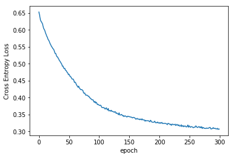

Pytorch for Deep Learning BootCamp
================
by Jawad Haider
# **06 - Neural Network Exercises - SOLUTIONS**
------------------------------------------------------------------------
<center>
<a href=''></a>
</center>
<center>
<em>Copyright Qalmaqihir</em>
</center>
<center>
<em>For more information, visit us at
<a href='http://www.github.com/qalmaqihir/'>www.github.com/qalmaqihir/</a></em>
</center>
------------------------------------------------------------------------

- <a href="#neural-network-exercises---solutions"
  id="toc-neural-network-exercises---solutions">Neural Network Exercises -
  SOLUTIONS</a>
  - <a href="#census-income-dataset" id="toc-census-income-dataset">Census
    Income Dataset</a>
  - <a href="#perform-standard-imports"
    id="toc-perform-standard-imports">Perform standard imports</a>
    - <a href="#separate-continuous-categorical-and-label-column-names"
      id="toc-separate-continuous-categorical-and-label-column-names">1.
      Separate continuous, categorical and label column names</a>
    - <a href="#convert-categorical-columns-to-category-dtypes"
      id="toc-convert-categorical-columns-to-category-dtypes">2. Convert
      categorical columns to category dtypes</a>
    - <a href="#optional-shuffle-the-dataset"
      id="toc-optional-shuffle-the-dataset">Optional: Shuffle the dataset</a>
    - <a href="#set-the-embedding-sizes" id="toc-set-the-embedding-sizes">3.
      Set the embedding sizes</a>
    - <a href="#create-an-array-of-categorical-values"
      id="toc-create-an-array-of-categorical-values">4. Create an array of
      categorical values</a>
    - <a href="#convert-cats-to-a-tensor" id="toc-convert-cats-to-a-tensor">5.
      Convert “cats” to a tensor</a>
    - <a href="#create-an-array-of-continuous-values"
      id="toc-create-an-array-of-continuous-values">6. Create an array of
      continuous values</a>
    - <a href="#convert-conts-to-a-tensor"
      id="toc-convert-conts-to-a-tensor">7. Convert “conts” to a tensor</a>
    - <a href="#create-a-label-tensor" id="toc-create-a-label-tensor">8.
      Create a label tensor</a>
    - <a href="#create-train-and-test-sets-from-cats-conts-and-y"
      id="toc-create-train-and-test-sets-from-cats-conts-and-y">9. Create
      train and test sets from <tt>cats</tt>, <tt>conts</tt>, and
      <tt>y</tt></a>
    - <a href="#define-the-model-class" id="toc-define-the-model-class">Define
      the model class</a>
    - <a href="#set-the-random-seed" id="toc-set-the-random-seed">10. Set the
      random seed</a>
    - <a href="#create-a-tabularmodel-instance"
      id="toc-create-a-tabularmodel-instance">11. Create a TabularModel
      instance</a>
    - <a href="#define-the-loss-and-optimization-functions"
      id="toc-define-the-loss-and-optimization-functions">12. Define the loss
      and optimization functions</a>
    - <a href="#train-the-model" id="toc-train-the-model">Train the model</a>
    - <a href="#plot-the-cross-entropy-loss-against-epochs"
      id="toc-plot-the-cross-entropy-loss-against-epochs">13. Plot the Cross
      Entropy Loss against epochs</a>
    - <a href="#evaluate-the-test-set" id="toc-evaluate-the-test-set">14.
      Evaluate the test set</a>
    - <a href="#calculate-the-overall-percent-accuracy"
      id="toc-calculate-the-overall-percent-accuracy">15. Calculate the
      overall percent accuracy</a>
    - <a href="#bonus-feed-new-data-through-the-trained-model"
      id="toc-bonus-feed-new-data-through-the-trained-model">BONUS: Feed new
      data through the trained model</a>
  - <a href="#great-job" id="toc-great-job">Great job!</a>

------------------------------------------------------------------------

# Neural Network Exercises - SOLUTIONS

For these exercises we’ll perform a binary classification on the Census
Income dataset available from the
<a href = 'http://archive.ics.uci.edu/ml/datasets/Adult'>UC Irvine
Machine Learning Repository</a><br> The goal is to determine if an
individual earns more than \$50K based on a set of continuous and
categorical variables.

<div class="alert alert-danger" style="margin: 10px">

<strong>IMPORTANT NOTE!</strong> Make sure you don’t run the cells
directly above the example output shown, <br>otherwise you will end up
writing over the example output!

</div>

## Census Income Dataset

For this exercises we’re using the Census Income dataset available from
the <a href='http://archive.ics.uci.edu/ml/datasets/Adult'>UC Irvine
Machine Learning Repository</a>.

The full dataset has 48,842 entries. For this exercise we have reduced
the number of records, fields and field entries, and have removed
entries with null values. The file <strong>income.csv</strong> has
30,000 entries

Each entry contains the following information about an individual: \*
<strong>age</strong>: the age of an individual as an integer from 18 to
90 (continuous) \* <strong>sex</strong>: Male or Female (categorical) \*
<strong>education</strong>: represents the highest level of education
achieved by an individual (categorical) \*
<strong>education_num</strong>: represents education as an integer from
3 to 16 (categorical)

<div>

<table style="display: inline-block">
<tr>
<td>
3
</td>
<td>
5th-6th
</td>
<td>
8
</td>
<td>
12th
</td>
<td>
13
</td>
<td>
Bachelors
</td>
</tr>
<tr>
<td>
4
</td>
<td>
7th-8th
</td>
<td>
9
</td>
<td>
HS-grad
</td>
<td>
14
</td>
<td>
Masters
</td>
</tr>
<tr>
<td>
5
</td>
<td>
9th
</td>
<td>
10
</td>
<td>
Some-college
</td>
<td>
15
</td>
<td>
Prof-school
</td>
</tr>
<tr>
<td>
6
</td>
<td>
10th
</td>
<td>
11
</td>
<td>
Assoc-voc
</td>
<td>
16
</td>
<td>
Doctorate
</td>
</tr>
<tr>
<td>
7
</td>
<td>
11th
</td>
<td>
12
</td>
<td>
Assoc-acdm
</td>
</tr>
</table>

</div>

- <strong>marital-status</strong>: marital status of an individual
  (categorical)
  <div>

  <table style="display: inline-block">
  <tr>
  <td>
  Married
  </td>
  <td>
  Divorced
  </td>
  <td>
  Married-spouse-absent
  </td>
  </tr>
  <tr>
  <td>
  Separated
  </td>
  <td>
  Widowed
  </td>
  <td>
  Never-married
  </td>
  </tr>
  </table>

  </div>
- <strong>workclass</strong>: a general term to represent the employment
  status of an individual (categorical)
  <div>

  <table style="display: inline-block">
  <tr>
  <td>
  Local-gov
  </td>
  <td>
  Private
  </td>
  </tr>
  <tr>
  <td>
  State-gov
  </td>
  <td>
  Self-emp
  </td>
  </tr>
  <tr>
  <td>
  Federal-gov
  </td>
  </tr>
  </table>

  </div>
- <strong>occupation</strong>: the general type of occupation of an
  individual (categorical)
  <div>

  <table style="display: inline-block">
  <tr>
  <td>
  Adm-clerical
  </td>
  <td>
  Handlers-cleaners
  </td>
  <td>
  Protective-serv
  </td>
  </tr>
  <tr>
  <td>
  Craft-repair
  </td>
  <td>
  Machine-op-inspct
  </td>
  <td>
  Sales
  </td>
  </tr>
  <tr>
  <td>
  Exec-managerial
  </td>
  <td>
  Other-service
  </td>
  <td>
  Tech-support
  </td>
  </tr>
  <tr>
  <td>
  Farming-fishing
  </td>
  <td>
  Prof-specialty
  </td>
  <td>
  Transport-moving
  </td>
  </tr>
  </table>

  </div>
- <strong>hours-per-week</strong>: the hours an individual has reported
  to work per week as an integer from 20 to 90 (continuous)
- <strong>income</strong>: whether or not an individual makes more than
  \\\$50,000 annually (label)
- <strong>label</strong>: income represented as an integer (0:
  \<=\\\$50K, 1: \>\\\$50K) (optional label)

## Perform standard imports

Run the cell below to load the libraries needed for this exercise and
the Census Income dataset.

``` python
import torch
import torch.nn as nn

import numpy as np
import pandas as pd
import matplotlib.pyplot as plt
from sklearn.utils import shuffle
%matplotlib inline

df = pd.read_csv('../Data/income.csv')
```

``` python
print(len(df))
df.head()
```

    30000

<div>
<style scoped>
    .dataframe tbody tr th:only-of-type {
        vertical-align: middle;
    }

    .dataframe tbody tr th {
        vertical-align: top;
    }

    .dataframe thead th {
        text-align: right;
    }
</style>
<table border="1" class="dataframe">
  <thead>
    <tr style="text-align: right;">
      <th></th>
      <th>age</th>
      <th>sex</th>
      <th>education</th>
      <th>education-num</th>
      <th>marital-status</th>
      <th>workclass</th>
      <th>occupation</th>
      <th>hours-per-week</th>
      <th>income</th>
      <th>label</th>
    </tr>
  </thead>
  <tbody>
    <tr>
      <th>0</th>
      <td>27</td>
      <td>Male</td>
      <td>HS-grad</td>
      <td>9</td>
      <td>Never-married</td>
      <td>Private</td>
      <td>Craft-repair</td>
      <td>40</td>
      <td>&lt;=50K</td>
      <td>0</td>
    </tr>
    <tr>
      <th>1</th>
      <td>47</td>
      <td>Male</td>
      <td>Masters</td>
      <td>14</td>
      <td>Married</td>
      <td>Local-gov</td>
      <td>Exec-managerial</td>
      <td>50</td>
      <td>&gt;50K</td>
      <td>1</td>
    </tr>
    <tr>
      <th>2</th>
      <td>59</td>
      <td>Male</td>
      <td>HS-grad</td>
      <td>9</td>
      <td>Divorced</td>
      <td>Self-emp</td>
      <td>Prof-specialty</td>
      <td>20</td>
      <td>&lt;=50K</td>
      <td>0</td>
    </tr>
    <tr>
      <th>3</th>
      <td>38</td>
      <td>Female</td>
      <td>Prof-school</td>
      <td>15</td>
      <td>Never-married</td>
      <td>Federal-gov</td>
      <td>Prof-specialty</td>
      <td>57</td>
      <td>&gt;50K</td>
      <td>1</td>
    </tr>
    <tr>
      <th>4</th>
      <td>64</td>
      <td>Female</td>
      <td>11th</td>
      <td>7</td>
      <td>Widowed</td>
      <td>Private</td>
      <td>Farming-fishing</td>
      <td>40</td>
      <td>&lt;=50K</td>
      <td>0</td>
    </tr>
  </tbody>
</table>
</div>

``` python
df['label'].value_counts()
```

    0    21700
    1     8300
    Name: label, dtype: int64

### 1. Separate continuous, categorical and label column names

You should find that there are 5 categorical columns, 2 continuous
columns and 1 label.<br> In the case of <em>education</em> and
<em>education-num</em> it doesn’t matter which column you use. For the
label column, be sure to use <em>label</em> and not <em>income</em>.<br>
Assign the variable names “cat_cols”, “cont_cols” and “y_col” to the
lists of names.

``` python
df.columns
```

``` python
# CODE HERE


# RUN THIS CODE TO COMPARE RESULTS:
print(f'cat_cols  has {len(cat_cols)} columns')
print(f'cont_cols has {len(cont_cols)} columns')
print(f'y_col     has {len(y_col)} column')
```

``` python
# DON'T WRITE HERE
cat_cols = ['sex', 'education', 'marital-status', 'workclass', 'occupation']
cont_cols = ['age', 'hours-per-week']
y_col = ['label']

print(f'cat_cols  has {len(cat_cols)} columns')  # 5
print(f'cont_cols has {len(cont_cols)} columns') # 2
print(f'y_col     has {len(y_col)} column')      # 1
```

    cat_cols  has 5 columns
    cont_cols has 2 columns
    y_col     has 1 column

### 2. Convert categorical columns to category dtypes

``` python
# CODE HERE


```

``` python
# DON'T WRITE HERE
for cat in cat_cols:
    df[cat] = df[cat].astype('category')
```

### Optional: Shuffle the dataset

The <strong>income.csv</strong> dataset is already shuffled. However, if
you would like to try different configurations after completing the
exercises, this is where you would want to shuffle the entire set.

``` python
# THIS CELL IS OPTIONAL
df = shuffle(df, random_state=101)
df.reset_index(drop=True, inplace=True)
df.head()
```

### 3. Set the embedding sizes

Create a variable “cat_szs” to hold the number of categories in each
variable.<br> Then create a variable “emb_szs” to hold the list of
(category size, embedding size) tuples.

``` python
# CODE HERE


```

``` python
# DON'T WRITE HERE
cat_szs = [len(df[col].cat.categories) for col in cat_cols]
emb_szs = [(size, min(50, (size+1)//2)) for size in cat_szs]
emb_szs
```

    [(2, 1), (14, 7), (6, 3), (5, 3), (12, 6)]

### 4. Create an array of categorical values

Create a NumPy array called “cats” that contains a stack of each
categorical column <tt>.cat.codes.values</tt><br> Note: your output may
contain different values. Ours came after performing the shuffle step
shown above.

``` python
# CODE HERE


# RUN THIS CODE TO COMPARE RESULTS
cats[:5]
```

``` python
# DON'T WRITE HERE
sx = df['sex'].cat.codes.values
ed = df['education'].cat.codes.values
ms = df['marital-status'].cat.codes.values
wc = df['workclass'].cat.codes.values
oc = df['occupation'].cat.codes.values

cats = np.stack([sx,ed,ms,wc,oc], 1)

cats[:5]
```

    array([[ 1, 10,  3,  2,  1],
           [ 1, 11,  1,  1,  2],
           [ 1, 10,  0,  3,  7],
           [ 0, 12,  3,  0,  7],
           [ 0,  1,  5,  2,  3]], dtype=int8)

### 5. Convert “cats” to a tensor

Convert the “cats” NumPy array to a tensor of dtype <tt>int64</tt>

``` python
# CODE HERE
```

``` python
# DON'T WRITE HERE
cats = torch.tensor(cats, dtype=torch.int64)
```

### 6. Create an array of continuous values

Create a NumPy array called “conts” that contains a stack of each
continuous column.<br> Note: your output may contain different values.
Ours came after performing the shuffle step shown above.

``` python
# CODE HERE


# RUN THIS CODE TO COMPARE RESULTS
conts[:5]
```

``` python
# DON'T WRITE HERE
conts = np.stack([df[col].values for col in cont_cols], 1)
conts[:5]
```

    array([[27, 40],
           [47, 50],
           [59, 20],
           [38, 57],
           [64, 40]], dtype=int64)

### 7. Convert “conts” to a tensor

Convert the “conts” NumPy array to a tensor of dtype <tt>float32</tt>

``` python
# CODE HERE


# RUN THIS CODE TO COMPARE RESULTS
conts.dtype
```

``` python
# DON'T WRITE HERE
conts = torch.tensor(conts, dtype=torch.float)
conts.dtype
```

    torch.float32

### 8. Create a label tensor

Create a tensor called “y” from the values in the label column. Be sure
to flatten the tensor so that it can be passed into the CE Loss
function.

``` python
# CODE HERE
```

``` python
# DON'T WRITE HERE
y = torch.tensor(df[y_col].values).flatten()
```

### 9. Create train and test sets from <tt>cats</tt>, <tt>conts</tt>, and <tt>y</tt>

We use the entire batch of 30,000 records, but a smaller batch size will
save time during training.<br> We used a test size of 5,000 records, but
you can choose another fixed value or a percentage of the batch
size.<br> Make sure that your test records remain separate from your
training records, without overlap.<br> To make coding slices easier, we
recommend assigning batch and test sizes to simple variables like “b”
and “t”.

``` python
# CODE HERE
b = 30000 # suggested batch size
t = 5000  # suggested test size


```

``` python
# DON'T WRITE HERE
b = 30000 # suggested batch size
t = 5000  # suggested test size

cat_train = cats[:b-t]
cat_test  = cats[b-t:b]
con_train = conts[:b-t]
con_test  = conts[b-t:b]
y_train   = y[:b-t]
y_test    = y[b-t:b]
```

### Define the model class

Run the cell below to define the TabularModel model class we’ve used
before.

``` python
class TabularModel(nn.Module):

    def __init__(self, emb_szs, n_cont, out_sz, layers, p=0.5):
        # Call the parent __init__
        super().__init__()
        
        # Set up the embedding, dropout, and batch normalization layer attributes
        self.embeds = nn.ModuleList([nn.Embedding(ni, nf) for ni,nf in emb_szs])
        self.emb_drop = nn.Dropout(p)
        self.bn_cont = nn.BatchNorm1d(n_cont)
        
        # Assign a variable to hold a list of layers
        layerlist = []
        
        # Assign a variable to store the number of embedding and continuous layers
        n_emb = sum((nf for ni,nf in emb_szs))
        n_in = n_emb + n_cont
        
        # Iterate through the passed-in "layers" parameter (ie, [200,100]) to build a list of layers
        for i in layers:
            layerlist.append(nn.Linear(n_in,i)) 
            layerlist.append(nn.ReLU(inplace=True))
            layerlist.append(nn.BatchNorm1d(i))
            layerlist.append(nn.Dropout(p))
            n_in = i
        layerlist.append(nn.Linear(layers[-1],out_sz))
        
        # Convert the list of layers into an attribute
        self.layers = nn.Sequential(*layerlist)
    
    def forward(self, x_cat, x_cont):
        # Extract embedding values from the incoming categorical data
        embeddings = []
        for i,e in enumerate(self.embeds):
            embeddings.append(e(x_cat[:,i]))
        x = torch.cat(embeddings, 1)
        # Perform an initial dropout on the embeddings
        x = self.emb_drop(x)
        
        # Normalize the incoming continuous data
        x_cont = self.bn_cont(x_cont)
        x = torch.cat([x, x_cont], 1)
        
        # Set up model layers
        x = self.layers(x)
        return x
```

### 10. Set the random seed

To obtain results that can be recreated, set a torch manual_seed (we
used 33).

``` python
# CODE HERE
```

``` python
# DON'T WRITE HERE
torch.manual_seed(33)
```

    <torch._C.Generator at 0x1e5e64e5e30>

### 11. Create a TabularModel instance

Create an instance called “model” with one hidden layer containing 50
neurons and a dropout layer p-value of 0.4

``` python
# CODE HERE


# RUN THIS CODE TO COMPARE RESULTS
model
```

``` python
# DON'T WRITE HERE
model = TabularModel(emb_szs, conts.shape[1], 2, [50], p=0.4)
model
```

    TabularModel(
      (embeds): ModuleList(
        (0): Embedding(2, 1)
        (1): Embedding(14, 7)
        (2): Embedding(6, 3)
        (3): Embedding(5, 3)
        (4): Embedding(12, 6)
      )
      (emb_drop): Dropout(p=0.4)
      (bn_cont): BatchNorm1d(2, eps=1e-05, momentum=0.1, affine=True, track_running_stats=True)
      (layers): Sequential(
        (0): Linear(in_features=22, out_features=50, bias=True)
        (1): ReLU(inplace)
        (2): BatchNorm1d(50, eps=1e-05, momentum=0.1, affine=True, track_running_stats=True)
        (3): Dropout(p=0.4)
        (4): Linear(in_features=50, out_features=2, bias=True)
      )
    )

### 12. Define the loss and optimization functions

Create a loss function called “criterion” using CrossEntropyLoss<br>
Create an optimization function called “optimizer” using Adam, with a
learning rate of 0.001

``` python
# CODE HERE


```

``` python
# DON'T WRITE HERE
criterion = nn.CrossEntropyLoss()
optimizer = torch.optim.Adam(model.parameters(), lr=0.001)
```

### Train the model

Run the cell below to train the model through 300 epochs. Remember,
results may vary!<br> After completing the exercises, feel free to come
back to this section and experiment with different parameters.

``` python
import time
start_time = time.time()

epochs = 300
losses = []

for i in range(epochs):
    i+=1
    y_pred = model(cat_train, con_train)
    loss = criterion(y_pred, y_train)
    losses.append(loss)
    
    # a neat trick to save screen space:
    if i%25 == 1:
        print(f'epoch: {i:3}  loss: {loss.item():10.8f}')

    optimizer.zero_grad()
    loss.backward()
    optimizer.step()

print(f'epoch: {i:3}  loss: {loss.item():10.8f}') # print the last line
print(f'\nDuration: {time.time() - start_time:.0f} seconds') # print the time elapsed
```

    epoch:   1  loss: 0.65308946
    epoch:  26  loss: 0.54059124
    epoch:  51  loss: 0.46917316
    epoch:  76  loss: 0.41288978
    epoch: 101  loss: 0.37744597
    epoch: 126  loss: 0.35649022
    epoch: 151  loss: 0.34338138
    epoch: 176  loss: 0.33378774
    epoch: 201  loss: 0.32601979
    epoch: 226  loss: 0.32018784
    epoch: 251  loss: 0.31548899
    epoch: 276  loss: 0.30901730
    epoch: 300  loss: 0.30690485

    Duration: 170 seconds

### 13. Plot the Cross Entropy Loss against epochs

Results may vary. The shape of the plot is what matters.

``` python
# CODE HERE


```

``` python
# DON'T WRITE HERE
plt.plot(range(epochs), losses)
plt.ylabel('Cross Entropy Loss')
plt.xlabel('epoch');
```



### 14. Evaluate the test set

With torch set to <tt>no_grad</tt>, pass <tt>cat_test</tt> and
<tt>con_test</tt> through the trained model. Create a validation set
called “y_val”. Compare the output to <tt>y_test</tt> using the loss
function defined above. Results may vary.

``` python
# CODE HERE


# RUN THIS CODE TO COMPARE RESULTS
print(f'CE Loss: {loss:.8f}')
```

``` python
# TO EVALUATE THE TEST SET
with torch.no_grad():
    y_val = model(cat_test, con_test)
    loss = criterion(y_val, y_test)
print(f'CE Loss: {loss:.8f}')
```

    CE Loss: 0.30774996

### 15. Calculate the overall percent accuracy

Using a for loop, compare the argmax values of the <tt>y_val</tt>
validation set to the <tt>y_test</tt> set.

``` python
# CODE HERE


```

``` python
# DON'T WRITE HERE
rows = len(y_test)
correct = 0

# print(f'{"MODEL OUTPUT":26} ARGMAX  Y_TEST')

for i in range(rows):
    # print(f'{str(y_val[i]):26} {y_val[i].argmax().item():^7}{y_test[i]:^7}')

    if y_val[i].argmax().item() == y_test[i]:
        correct += 1

print(f'\n{correct} out of {rows} = {100*correct/rows:.2f}% correct')
```


    4255 out of 5000 = 85.10% correct

### BONUS: Feed new data through the trained model

See if you can write a function that allows a user to input their own
values, and generates a prediction.<br>
<strong>HINT</strong>:<br>There’s no need to build a DataFrame. You can
use inputs to populate column variables, convert them to embeddings with
a context dictionary, and pass the embedded values directly into the
tensor constructors:<br>
<pre>mar = input("What is the person's marital status? ")
mar_d = dict(Divorced=0, Married=1, Married-spouse-absent=2, Never-married=3, Separated=4, Widowed=5)
mar = mar_d[mar]
cats = torch.tensor([..., ..., mar, ..., ...], dtype=torch.int64).reshape(1,-1)</pre>

Make sure that names are put in alphabetical order before assigning
numbers.

Also, be sure to run <tt>model.eval()</tt> before passing new date
through. Good luck!

``` python
# WRITE YOUR CODE HERE:
```

``` python
# RUN YOUR CODE HERE:
```

``` python
# DON'T WRITE HERE
def test_data(mdl): # pass in the name of the model
    # INPUT NEW DATA
    age = float(input("What is the person's age? (18-90)  "))
    sex = input("What is the person's sex? (Male/Female) ").capitalize()
    edn = int(input("What is the person's education level? (3-16) "))
    mar = input("What is the person's marital status? ").capitalize()
    wrk = input("What is the person's workclass? ").capitalize()
    occ = input("What is the person's occupation? ").capitalize()
    hrs = float(input("How many hours/week are worked? (20-90)  "))

    # PREPROCESS THE DATA
    sex_d = {'Female':0, 'Male':1}
    mar_d = {'Divorced':0, 'Married':1, 'Married-spouse-absent':2, 'Never-married':3, 'Separated':4, 'Widowed':5}
    wrk_d = {'Federal-gov':0, 'Local-gov':1, 'Private':2, 'Self-emp':3, 'State-gov':4}
    occ_d = {'Adm-clerical':0, 'Craft-repair':1, 'Exec-managerial':2, 'Farming-fishing':3, 'Handlers-cleaners':4,
            'Machine-op-inspct':5, 'Other-service':6, 'Prof-specialty':7, 'Protective-serv':8, 'Sales':9, 
            'Tech-support':10, 'Transport-moving':11}

    sex = sex_d[sex]
    mar = mar_d[mar]
    wrk = wrk_d[wrk]
    occ = occ_d[occ]

    # CREATE CAT AND CONT TENSORS
    cats = torch.tensor([sex,edn,mar,wrk,occ], dtype=torch.int64).reshape(1,-1)
    conts = torch.tensor([age,hrs], dtype=torch.float).reshape(1,-1)
    
    # SET MODEL TO EVAL (in case this hasn't been done)
    mdl.eval()

    # PASS NEW DATA THROUGH THE MODEL WITHOUT PERFORMING A BACKPROP
    with torch.no_grad():
        z = mdl(cats, conts).argmax().item()

    print(f'\nThe predicted label is {z}')
    
test_data(model)
```

    What is the person's age? (18-90)  22
    What is the person's sex? (Male/Female) male
    What is the person's education level? (3-16) 12
    What is the person's marital status? married
    What is the person's workclass? private
    What is the person's occupation? sales
    How many hours/week are worked? (20-90)  40

    The predicted label is 0

## Great job!
