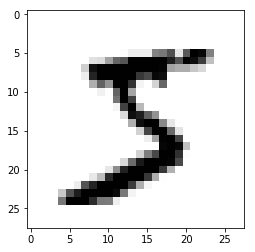
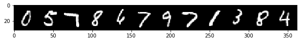
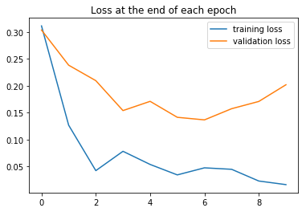
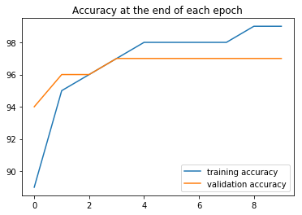
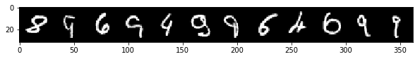

================
by Jawad Haider

- <a href="#mnist-code-along-with-ann"
  id="toc-mnist-code-along-with-ann">MNIST Code Along with ANN</a>
  - <a href="#perform-standard-imports"
    id="toc-perform-standard-imports">Perform standard imports</a>
  - <a href="#load-the-mnist-dataset" id="toc-load-the-mnist-dataset">Load
    the MNIST dataset</a>
    - <a href="#load-the-training-set" id="toc-load-the-training-set">Load the
      training set</a>
    - <a href="#load-the-test-set" id="toc-load-the-test-set">Load the test
      set</a>
    - <a href="#examine-a-training-record"
      id="toc-examine-a-training-record">Examine a training record</a>
    - <a href="#view-the-image" id="toc-view-the-image">View the image</a>
  - <a href="#batch-loading-with-dataloader"
    id="toc-batch-loading-with-dataloader">Batch loading with DataLoader</a>
    - <a href="#view-a-batch-of-images" id="toc-view-a-batch-of-images">View a
      batch of images</a>
  - <a href="#define-the-model" id="toc-define-the-model">Define the
    model</a>
  - <a href="#count-the-model-parameters"
    id="toc-count-the-model-parameters">Count the model parameters</a>
  - <a href="#define-loss-function-optimizer"
    id="toc-define-loss-function-optimizer">Define loss function &amp;
    optimizer</a>
  - <a href="#flatten-the-training-data"
    id="toc-flatten-the-training-data">Flatten the training data</a>
  - <a href="#train-the-model" id="toc-train-the-model">Train the model</a>
  - <a href="#plot-the-loss-and-accuracy-comparisons"
    id="toc-plot-the-loss-and-accuracy-comparisons">Plot the loss and
    accuracy comparisons</a>
  - <a href="#evaluate-test-data" id="toc-evaluate-test-data">Evaluate Test
    Data</a>
  - <a href="#display-the-confusion-matrix"
    id="toc-display-the-confusion-matrix">Display the confusion matrix</a>
  - <a href="#examine-the-misses" id="toc-examine-the-misses">Examine the
    misses</a>
  - <a href="#great-job" id="toc-great-job">Great job!</a>

# MNIST Code Along with ANN

Before we start working with Convolutional Neural Networks (CNN), let’s
model the <a href='https://en.wikipedia.org/wiki/MNIST_database'>MNIST
dataset</a> using only linear layers.<br> In this exercise we’ll use the
same logic laid out in the ANN notebook. We’ll reshape the MNIST data
from a 28x28 image to a flattened 1x784 vector to mimic a single row of
784 features.

## Perform standard imports

Torchvision should have been installed by the environment file during
setup. If not, you can install it now. At the terminal with your virtual
environment activated, run<br>
<pre>conda install torchvision -c pytorch
<em>or</em>
pip install torchvision</pre>

``` python
import torch
import torch.nn as nn
import torch.nn.functional as F          # adds some efficiency
from torch.utils.data import DataLoader  # lets us load data in batches
from torchvision import datasets, transforms

import numpy as np
import pandas as pd
from sklearn.metrics import confusion_matrix  # for evaluating results
import matplotlib.pyplot as plt
%matplotlib inline
```

## Load the MNIST dataset

PyTorch makes the MNIST dataset available through
<a href='https://pytorch.org/docs/stable/torchvision/index.html'><tt><strong>torchvision</strong></tt></a>.
The first time it’s called, the dataset will be downloaded onto your
computer to the path specified. From that point, torchvision will always
look for a local copy before attempting another download. \### Define
transform As part of the loading process, we can apply multiple
transformations (reshape, convert to tensor, normalize, etc.) to the
incoming data.<br>For this exercise we only need to convert images to
tensors.

``` python
transform = transforms.ToTensor()
```

### Load the training set

``` python
train_data = datasets.MNIST(root='../Data', train=True, download=True, transform=transform)
train_data
```

    Dataset MNIST
        Number of datapoints: 60000
        Split: train
        Root Location: ../Data
        Transforms (if any): ToTensor()
        Target Transforms (if any): None

### Load the test set

There’s a companion set of MNIST data containing 10,000 records
accessible by setting train=False. As before, torchvision will only
download this once, and in the future will look for the local copy.

``` python
test_data = datasets.MNIST(root='../Data', train=False, download=True, transform=transform)
test_data
```

    Dataset MNIST
        Number of datapoints: 10000
        Split: test
        Root Location: ../Data
        Transforms (if any): ToTensor()
        Target Transforms (if any): None

### Examine a training record

``` python
train_data[0]
```

    (tensor([[[0.0000, 0.0000, 0.0000, 0.0000, 0.0000, 0.0000, 0.0000, 0.0000,
               0.0000, 0.0000, 0.0000, 0.0000, 0.0000, 0.0000, 0.0000, 0.0000,
               0.0000, 0.0000, 0.0000, 0.0000, 0.0000, 0.0000, 0.0000, 0.0000,
               0.0000, 0.0000, 0.0000, 0.0000],
              [0.0000, 0.0000, 0.0000, 0.0000, 0.0000, 0.0000, 0.0000, 0.0000,
               0.0000, 0.0000, 0.0000, 0.0000, 0.0000, 0.0000, 0.0000, 0.0000,
               0.0000, 0.0000, 0.0000, 0.0000, 0.0000, 0.0000, 0.0000, 0.0000,
               0.0000, 0.0000, 0.0000, 0.0000],
              [0.0000, 0.0000, 0.0000, 0.0000, 0.0000, 0.0000, 0.0000, 0.0000,
               0.0000, 0.0000, 0.0000, 0.0000, 0.0000, 0.0000, 0.0000, 0.0000,
               0.0000, 0.0000, 0.0000, 0.0000, 0.0000, 0.0000, 0.0000, 0.0000,
               0.0000, 0.0000, 0.0000, 0.0000],
              [0.0000, 0.0000, 0.0000, 0.0000, 0.0000, 0.0000, 0.0000, 0.0000,
               0.0000, 0.0000, 0.0000, 0.0000, 0.0000, 0.0000, 0.0000, 0.0000,
               0.0000, 0.0000, 0.0000, 0.0000, 0.0000, 0.0000, 0.0000, 0.0000,
               0.0000, 0.0000, 0.0000, 0.0000],
              [0.0000, 0.0000, 0.0000, 0.0000, 0.0000, 0.0000, 0.0000, 0.0000,
               0.0000, 0.0000, 0.0000, 0.0000, 0.0000, 0.0000, 0.0000, 0.0000,
               0.0000, 0.0000, 0.0000, 0.0000, 0.0000, 0.0000, 0.0000, 0.0000,
               0.0000, 0.0000, 0.0000, 0.0000],
              [0.0000, 0.0000, 0.0000, 0.0000, 0.0000, 0.0000, 0.0000, 0.0000,
               0.0000, 0.0000, 0.0000, 0.0000, 0.0118, 0.0706, 0.0706, 0.0706,
               0.4941, 0.5333, 0.6863, 0.1020, 0.6510, 1.0000, 0.9686, 0.4980,
               0.0000, 0.0000, 0.0000, 0.0000],
              [0.0000, 0.0000, 0.0000, 0.0000, 0.0000, 0.0000, 0.0000, 0.0000,
               0.1176, 0.1412, 0.3686, 0.6039, 0.6667, 0.9922, 0.9922, 0.9922,
               0.9922, 0.9922, 0.8824, 0.6745, 0.9922, 0.9490, 0.7647, 0.2510,
               0.0000, 0.0000, 0.0000, 0.0000],
              [0.0000, 0.0000, 0.0000, 0.0000, 0.0000, 0.0000, 0.0000, 0.1922,
               0.9333, 0.9922, 0.9922, 0.9922, 0.9922, 0.9922, 0.9922, 0.9922,
               0.9922, 0.9843, 0.3647, 0.3216, 0.3216, 0.2196, 0.1529, 0.0000,
               0.0000, 0.0000, 0.0000, 0.0000],
              [0.0000, 0.0000, 0.0000, 0.0000, 0.0000, 0.0000, 0.0000, 0.0706,
               0.8588, 0.9922, 0.9922, 0.9922, 0.9922, 0.9922, 0.7765, 0.7137,
               0.9686, 0.9451, 0.0000, 0.0000, 0.0000, 0.0000, 0.0000, 0.0000,
               0.0000, 0.0000, 0.0000, 0.0000],
              [0.0000, 0.0000, 0.0000, 0.0000, 0.0000, 0.0000, 0.0000, 0.0000,
               0.3137, 0.6118, 0.4196, 0.9922, 0.9922, 0.8039, 0.0431, 0.0000,
               0.1686, 0.6039, 0.0000, 0.0000, 0.0000, 0.0000, 0.0000, 0.0000,
               0.0000, 0.0000, 0.0000, 0.0000],
              [0.0000, 0.0000, 0.0000, 0.0000, 0.0000, 0.0000, 0.0000, 0.0000,
               0.0000, 0.0549, 0.0039, 0.6039, 0.9922, 0.3529, 0.0000, 0.0000,
               0.0000, 0.0000, 0.0000, 0.0000, 0.0000, 0.0000, 0.0000, 0.0000,
               0.0000, 0.0000, 0.0000, 0.0000],
              [0.0000, 0.0000, 0.0000, 0.0000, 0.0000, 0.0000, 0.0000, 0.0000,
               0.0000, 0.0000, 0.0000, 0.5451, 0.9922, 0.7451, 0.0078, 0.0000,
               0.0000, 0.0000, 0.0000, 0.0000, 0.0000, 0.0000, 0.0000, 0.0000,
               0.0000, 0.0000, 0.0000, 0.0000],
              [0.0000, 0.0000, 0.0000, 0.0000, 0.0000, 0.0000, 0.0000, 0.0000,
               0.0000, 0.0000, 0.0000, 0.0431, 0.7451, 0.9922, 0.2745, 0.0000,
               0.0000, 0.0000, 0.0000, 0.0000, 0.0000, 0.0000, 0.0000, 0.0000,
               0.0000, 0.0000, 0.0000, 0.0000],
              [0.0000, 0.0000, 0.0000, 0.0000, 0.0000, 0.0000, 0.0000, 0.0000,
               0.0000, 0.0000, 0.0000, 0.0000, 0.1373, 0.9451, 0.8824, 0.6275,
               0.4235, 0.0039, 0.0000, 0.0000, 0.0000, 0.0000, 0.0000, 0.0000,
               0.0000, 0.0000, 0.0000, 0.0000],
              [0.0000, 0.0000, 0.0000, 0.0000, 0.0000, 0.0000, 0.0000, 0.0000,
               0.0000, 0.0000, 0.0000, 0.0000, 0.0000, 0.3176, 0.9412, 0.9922,
               0.9922, 0.4667, 0.0980, 0.0000, 0.0000, 0.0000, 0.0000, 0.0000,
               0.0000, 0.0000, 0.0000, 0.0000],
              [0.0000, 0.0000, 0.0000, 0.0000, 0.0000, 0.0000, 0.0000, 0.0000,
               0.0000, 0.0000, 0.0000, 0.0000, 0.0000, 0.0000, 0.1765, 0.7294,
               0.9922, 0.9922, 0.5882, 0.1059, 0.0000, 0.0000, 0.0000, 0.0000,
               0.0000, 0.0000, 0.0000, 0.0000],
              [0.0000, 0.0000, 0.0000, 0.0000, 0.0000, 0.0000, 0.0000, 0.0000,
               0.0000, 0.0000, 0.0000, 0.0000, 0.0000, 0.0000, 0.0000, 0.0627,
               0.3647, 0.9882, 0.9922, 0.7333, 0.0000, 0.0000, 0.0000, 0.0000,
               0.0000, 0.0000, 0.0000, 0.0000],
              [0.0000, 0.0000, 0.0000, 0.0000, 0.0000, 0.0000, 0.0000, 0.0000,
               0.0000, 0.0000, 0.0000, 0.0000, 0.0000, 0.0000, 0.0000, 0.0000,
               0.0000, 0.9765, 0.9922, 0.9765, 0.2510, 0.0000, 0.0000, 0.0000,
               0.0000, 0.0000, 0.0000, 0.0000],
              [0.0000, 0.0000, 0.0000, 0.0000, 0.0000, 0.0000, 0.0000, 0.0000,
               0.0000, 0.0000, 0.0000, 0.0000, 0.0000, 0.0000, 0.1804, 0.5098,
               0.7176, 0.9922, 0.9922, 0.8118, 0.0078, 0.0000, 0.0000, 0.0000,
               0.0000, 0.0000, 0.0000, 0.0000],
              [0.0000, 0.0000, 0.0000, 0.0000, 0.0000, 0.0000, 0.0000, 0.0000,
               0.0000, 0.0000, 0.0000, 0.0000, 0.1529, 0.5804, 0.8980, 0.9922,
               0.9922, 0.9922, 0.9804, 0.7137, 0.0000, 0.0000, 0.0000, 0.0000,
               0.0000, 0.0000, 0.0000, 0.0000],
              [0.0000, 0.0000, 0.0000, 0.0000, 0.0000, 0.0000, 0.0000, 0.0000,
               0.0000, 0.0000, 0.0941, 0.4471, 0.8667, 0.9922, 0.9922, 0.9922,
               0.9922, 0.7882, 0.3059, 0.0000, 0.0000, 0.0000, 0.0000, 0.0000,
               0.0000, 0.0000, 0.0000, 0.0000],
              [0.0000, 0.0000, 0.0000, 0.0000, 0.0000, 0.0000, 0.0000, 0.0000,
               0.0902, 0.2588, 0.8353, 0.9922, 0.9922, 0.9922, 0.9922, 0.7765,
               0.3176, 0.0078, 0.0000, 0.0000, 0.0000, 0.0000, 0.0000, 0.0000,
               0.0000, 0.0000, 0.0000, 0.0000],
              [0.0000, 0.0000, 0.0000, 0.0000, 0.0000, 0.0000, 0.0706, 0.6706,
               0.8588, 0.9922, 0.9922, 0.9922, 0.9922, 0.7647, 0.3137, 0.0353,
               0.0000, 0.0000, 0.0000, 0.0000, 0.0000, 0.0000, 0.0000, 0.0000,
               0.0000, 0.0000, 0.0000, 0.0000],
              [0.0000, 0.0000, 0.0000, 0.0000, 0.2157, 0.6745, 0.8863, 0.9922,
               0.9922, 0.9922, 0.9922, 0.9569, 0.5216, 0.0431, 0.0000, 0.0000,
               0.0000, 0.0000, 0.0000, 0.0000, 0.0000, 0.0000, 0.0000, 0.0000,
               0.0000, 0.0000, 0.0000, 0.0000],
              [0.0000, 0.0000, 0.0000, 0.0000, 0.5333, 0.9922, 0.9922, 0.9922,
               0.8314, 0.5294, 0.5176, 0.0627, 0.0000, 0.0000, 0.0000, 0.0000,
               0.0000, 0.0000, 0.0000, 0.0000, 0.0000, 0.0000, 0.0000, 0.0000,
               0.0000, 0.0000, 0.0000, 0.0000],
              [0.0000, 0.0000, 0.0000, 0.0000, 0.0000, 0.0000, 0.0000, 0.0000,
               0.0000, 0.0000, 0.0000, 0.0000, 0.0000, 0.0000, 0.0000, 0.0000,
               0.0000, 0.0000, 0.0000, 0.0000, 0.0000, 0.0000, 0.0000, 0.0000,
               0.0000, 0.0000, 0.0000, 0.0000],
              [0.0000, 0.0000, 0.0000, 0.0000, 0.0000, 0.0000, 0.0000, 0.0000,
               0.0000, 0.0000, 0.0000, 0.0000, 0.0000, 0.0000, 0.0000, 0.0000,
               0.0000, 0.0000, 0.0000, 0.0000, 0.0000, 0.0000, 0.0000, 0.0000,
               0.0000, 0.0000, 0.0000, 0.0000],
              [0.0000, 0.0000, 0.0000, 0.0000, 0.0000, 0.0000, 0.0000, 0.0000,
               0.0000, 0.0000, 0.0000, 0.0000, 0.0000, 0.0000, 0.0000, 0.0000,
               0.0000, 0.0000, 0.0000, 0.0000, 0.0000, 0.0000, 0.0000, 0.0000,
               0.0000, 0.0000, 0.0000, 0.0000]]]), 5)

Calling the first record from <tt>train_data</tt> returns a two-item
tuple. The first item is our 28x28 tensor representing the image. The
second is a label, in this case the number “5”.

``` python
image, label = train_data[0]
print('Shape:', image.shape, '\nLabel:', label)
```

    Shape: torch.Size([1, 28, 28]) 
    Label: 5

### View the image

Matplotlib can interpret pixel values through a variety of
<a href='https://matplotlib.org/tutorials/colors/colormaps.html'>colormaps</a>.

``` python
plt.imshow(train_data[0][0].reshape((28,28)), cmap="gray");
```


``` python
plt.imshow(train_data[0][0].reshape((28,28)), cmap="gist_yarg");
```



## Batch loading with DataLoader

Our training set contains 60,000 records. If we look ahead to our model
we have 784 incoming features, hidden layers of 120 and 84 neurons, and
10 output features. Including the bias terms for each layer, the total
number of parameters being trained is:<br>

$\begin{split}\quad(784\times120)+120+(120\times84)+84+(84\times10)+10 &=\\ 94080+120+10080+84+840+10 &= 105,214\end{split}$<br>

For this reason it makes sense to load training data in batches using
<a href='https://pytorch.org/docs/stable/data.html#torch.utils.data.DataLoader'><tt><strong>DataLoader</strong></tt></a>.

``` python
torch.manual_seed(101)  # for consistent results

train_loader = DataLoader(train_data, batch_size=100, shuffle=True)

test_loader = DataLoader(test_data, batch_size=500, shuffle=False)
```

In the cell above, <tt><strong>train_data</strong></tt> is a PyTorch
<a href='https://pytorch.org/docs/stable/data.html#torch.utils.data.Dataset'><em>Dataset</em></a>
object (an object that supports data loading and sampling).<br> The
<tt><strong>batch_size</strong></tt> is the number of records to be
processed at a time. If it’s not evenly divisible into the dataset, then
the final batch contains the remainder.<br> Setting
<tt><strong>shuffle</strong></tt> to True means that the dataset will be
shuffled after each epoch.

<div class="alert alert-info">

<strong>NOTE:</strong> DataLoader takes an optional
<tt><strong>num_workers</strong></tt> parameter that sets up how many
subprocesses to use for data loading. This behaves differently with
different operating systems so we’ve omitted it here. See
<a href='https://pytorch.org/docs/stable/data.html#torch.utils.data.DataLoader'>the
docs</a> for more information.

</div>

### View a batch of images

Once we’ve defined a DataLoader, we can create a grid of images using
<a href='https://pytorch.org/docs/stable/torchvision/utils.html#torchvision.utils.make_grid'><tt><strong>torchvision.utils.make_grid</strong></tt></a>

``` python
from torchvision.utils import make_grid
np.set_printoptions(formatter=dict(int=lambda x: f'{x:4}')) # to widen the printed array

# Grab the first batch of images
for images,labels in train_loader: 
    break

# Print the first 12 labels
print('Labels: ', labels[:12].numpy())

# Print the first 12 images
im = make_grid(images[:12], nrow=12)  # the default nrow is 8
plt.figure(figsize=(10,4))
# We need to transpose the images from CWH to WHC
plt.imshow(np.transpose(im.numpy(), (1, 2, 0)));
```

    Labels:  [   0    5    7    8    6    7    9    7    1    3    8    4]



## Define the model

For this exercise we’ll use fully connected layers to develop a
<a href='https://en.wikipedia.org/wiki/Multilayer_perceptron'>multilayer
perceptron</a>.<br> Our input size is 784 once we flatten the incoming
28x28 tensors.<br> Our output size represents the 10 possible
digits.<br> We’ll set our hidden layers to \[120, 84\] for now. Once
you’ve completed the exercise feel free to come back and try different
values.

``` python
class MultilayerPerceptron(nn.Module):
    def __init__(self, in_sz=784, out_sz=10, layers=[120,84]):
        super().__init__()
        self.fc1 = nn.Linear(in_sz,layers[0])
        self.fc2 = nn.Linear(layers[0],layers[1])
        self.fc3 = nn.Linear(layers[1],out_sz)
    
    def forward(self,X):
        X = F.relu(self.fc1(X))
        X = F.relu(self.fc2(X))
        X = self.fc3(X)
        return F.log_softmax(X, dim=1)
```

``` python
torch.manual_seed(101)
model = MultilayerPerceptron()
model
```

    MultilayerPerceptron(
      (fc1): Linear(in_features=784, out_features=120, bias=True)
      (fc2): Linear(in_features=120, out_features=84, bias=True)
      (fc3): Linear(in_features=84, out_features=10, bias=True)
    )

<div class="alert alert-info">

<strong>NOTE:</strong> You may have noticed our shortcut for adding ReLU
to the linear layer. In the last section this was done under the
<tt>**init**</tt> section as
<pre style='background-color:rgb(217,237,247)'>
layerlist = []
for i in layers:
    layerlist.append(nn.Linear(n_in,i)) 
    layerlist.append(nn.ReLU(inplace=True))
self.layers = nn.Sequential(*layerlist)</pre>
Here we’re calling <tt>F.relu()</tt> as a functional wrapper on the
linear layer directly:
<pre style='background-color:rgb(217,237,247)'>
def forward(self,X):
    X = F.relu(self.fc1(X))</pre>

</div>

## Count the model parameters

This optional step shows that the number of trainable parameters in our
model matches the equation above.

``` python
def count_parameters(model):
    params = [p.numel() for p in model.parameters() if p.requires_grad]
    for item in params:
        print(f'{item:>6}')
    print(f'______\n{sum(params):>6}')
```

``` python
count_parameters(model)
```

     94080
       120
     10080
        84
       840
        10
    ______
    105214

## Define loss function & optimizer

``` python
criterion = nn.CrossEntropyLoss()
optimizer = torch.optim.Adam(model.parameters(), lr=0.001)
```

## Flatten the training data

The batch tensors fed in by DataLoader have a shape of \[100, 1, 28,
28\]:

``` python
# Load the first batch, print its shape
for images, labels in train_loader:
    print('Batch shape:', images.size())
    break
    
# EQUIVALENT TO:
# dataiter = iter(train_loader)
# images, labels = dataiter.next()
# print('Batch shape:', images.size())
```

    Batch shape: torch.Size([100, 1, 28, 28])

We can flatten them using <tt>.view()</tt>

``` python
images.view(100,-1).size()
```

    torch.Size([100, 784])

We’ll do this just before applying the model to our data.

## Train the model

This time we’ll run the test data through the model during each epoch,
so that we can compare loss & accuracy on the same plot.

<div class="alert alert-info">

<strong>A QUICK NOTE: </strong>In the section below marked
 <tt><em>\#Tally the number of correct predictions</em></tt>  we include
the code
<pre style='background-color:rgb(217,237,247)'>
predicted = torch.max(y_pred.data, 1)[1]</pre>
This uses the
<a href='https://pytorch.org/docs/stable/torch.html#torch.max'><tt><strong>torch.max()</strong></tt></a>
function. <tt>torch.max()</tt> returns a tensor of maximum values, and a
tensor of the indices where the max values were found. In our code we’re
asking for the index positions of the maximum values along dimension 1.
In this way we can match predictions up to image labels.

</div>

``` python
import time
start_time = time.time()

epochs = 10
train_losses = []
test_losses = []
train_correct = []
test_correct = []

for i in range(epochs):
    trn_corr = 0
    tst_corr = 0
    
    # Run the training batches
    for b, (X_train, y_train) in enumerate(train_loader):
        b+=1
        
        # Apply the model
        y_pred = model(X_train.view(100, -1))  # Here we flatten X_train
        loss = criterion(y_pred, y_train)
 
        # Tally the number of correct predictions
        predicted = torch.max(y_pred.data, 1)[1]
        batch_corr = (predicted == y_train).sum()
        trn_corr += batch_corr
        
        # Update parameters
        optimizer.zero_grad()
        loss.backward()
        optimizer.step()
        
        # Print interim results
        if b%200 == 0:
            print(f'epoch: {i:2}  batch: {b:4} [{100*b:6}/60000]  loss: {loss.item():10.8f}  \
accuracy: {trn_corr.item()*100/(100*b):7.3f}%')
    
    # Update train loss & accuracy for the epoch
    train_losses.append(loss)
    train_correct.append(trn_corr)
        
    # Run the testing batches
    with torch.no_grad():
        for b, (X_test, y_test) in enumerate(test_loader):

            # Apply the model
            y_val = model(X_test.view(500, -1))  # Here we flatten X_test

            # Tally the number of correct predictions
            predicted = torch.max(y_val.data, 1)[1] 
            tst_corr += (predicted == y_test).sum()
    
    # Update test loss & accuracy for the epoch
    loss = criterion(y_val, y_test)
    test_losses.append(loss)
    test_correct.append(tst_corr)
        
print(f'\nDuration: {time.time() - start_time:.0f} seconds') # print the time elapsed            
```

    epoch:  0  batch:  200 [ 20000/60000]  loss: 0.35221729  accuracy:  82.695%
    epoch:  0  batch:  400 [ 40000/60000]  loss: 0.32761699  accuracy:  87.340%
    epoch:  0  batch:  600 [ 60000/60000]  loss: 0.31156573  accuracy:  89.490%
    epoch:  1  batch:  200 [ 20000/60000]  loss: 0.20120722  accuracy:  94.800%
    epoch:  1  batch:  400 [ 40000/60000]  loss: 0.14656080  accuracy:  95.185%
    epoch:  1  batch:  600 [ 60000/60000]  loss: 0.12691295  accuracy:  95.478%
    epoch:  2  batch:  200 [ 20000/60000]  loss: 0.13621402  accuracy:  96.815%
    epoch:  2  batch:  400 [ 40000/60000]  loss: 0.07235763  accuracy:  96.790%
    epoch:  2  batch:  600 [ 60000/60000]  loss: 0.04241359  accuracy:  96.878%
    epoch:  3  batch:  200 [ 20000/60000]  loss: 0.09474990  accuracy:  97.635%
    epoch:  3  batch:  400 [ 40000/60000]  loss: 0.06394162  accuracy:  97.600%
    epoch:  3  batch:  600 [ 60000/60000]  loss: 0.07836709  accuracy:  97.562%
    epoch:  4  batch:  200 [ 20000/60000]  loss: 0.05509195  accuracy:  98.135%
    epoch:  4  batch:  400 [ 40000/60000]  loss: 0.06395346  accuracy:  98.125%
    epoch:  4  batch:  600 [ 60000/60000]  loss: 0.05392118  accuracy:  98.105%
    epoch:  5  batch:  200 [ 20000/60000]  loss: 0.03487724  accuracy:  98.515%
    epoch:  5  batch:  400 [ 40000/60000]  loss: 0.03120600  accuracy:  98.433%
    epoch:  5  batch:  600 [ 60000/60000]  loss: 0.03449132  accuracy:  98.402%
    epoch:  6  batch:  200 [ 20000/60000]  loss: 0.04473587  accuracy:  98.770%
    epoch:  6  batch:  400 [ 40000/60000]  loss: 0.05389304  accuracy:  98.770%
    epoch:  6  batch:  600 [ 60000/60000]  loss: 0.04762774  accuracy:  98.685%
    epoch:  7  batch:  200 [ 20000/60000]  loss: 0.01370908  accuracy:  98.885%
    epoch:  7  batch:  400 [ 40000/60000]  loss: 0.01426961  accuracy:  98.945%
    epoch:  7  batch:  600 [ 60000/60000]  loss: 0.04490321  accuracy:  98.902%
    epoch:  8  batch:  200 [ 20000/60000]  loss: 0.02279496  accuracy:  99.150%
    epoch:  8  batch:  400 [ 40000/60000]  loss: 0.03816750  accuracy:  99.060%
    epoch:  8  batch:  600 [ 60000/60000]  loss: 0.02311455  accuracy:  99.055%
    epoch:  9  batch:  200 [ 20000/60000]  loss: 0.01244260  accuracy:  99.330%
    epoch:  9  batch:  400 [ 40000/60000]  loss: 0.00740430  accuracy:  99.340%
    epoch:  9  batch:  600 [ 60000/60000]  loss: 0.01638621  accuracy:  99.280%

    Duration: 275 seconds

## Plot the loss and accuracy comparisons

``` python
plt.plot(train_losses, label='training loss')
plt.plot(test_losses, label='validation loss')
plt.title('Loss at the end of each epoch')
plt.legend();
```



This shows some evidence of overfitting the training data.

``` python
plt.plot([t/600 for t in train_correct], label='training accuracy')
plt.plot([t/100 for t in test_correct], label='validation accuracy')
plt.title('Accuracy at the end of each epoch')
plt.legend();
```



## Evaluate Test Data

We retained the test scores during our training session:

``` python
print(test_correct) # contains the results of all 10 epochs
print()
print(f'Test accuracy: {test_correct[-1].item()*100/10000:.3f}%') # print the most recent result as a percent
```

    [tensor(9439), tensor(9635), tensor(9666), tensor(9726), tensor(9746), tensor(9758), tensor(9737), tensor(9749), tensor(9746), tensor(9725)]

    Test accuracy: 97.250%

However, we’d like to compare the predicted values to the ground truth
(the y_test labels), so we’ll run the test set through the trained model
all at once.

``` python
# Extract the data all at once, not in batches
test_load_all = DataLoader(test_data, batch_size=10000, shuffle=False)
```

``` python
with torch.no_grad():
    correct = 0
    for X_test, y_test in test_load_all:
        y_val = model(X_test.view(len(X_test), -1))  # pass in a flattened view of X_test
        predicted = torch.max(y_val,1)[1]
        correct += (predicted == y_test).sum()
print(f'Test accuracy: {correct.item()}/{len(test_data)} = {correct.item()*100/(len(test_data)):7.3f}%')
```

    Test accuracy: 9725/10000 =  97.250%

Not bad considering that a random guess gives only 10% accuracy!

## Display the confusion matrix

This uses scikit-learn, and the predicted values obtained above.

``` python
# print a row of values for reference
np.set_printoptions(formatter=dict(int=lambda x: f'{x:4}'))
print(np.arange(10).reshape(1,10))
print()

# print the confusion matrix
print(confusion_matrix(predicted.view(-1), y_test.view(-1)))
```

    [[   0    1    2    3    4    5    6    7    8    9]]

    [[ 968    0    1    0    1    2    5    0    4    1]
     [   0 1126    4    0    0    0    2    5    0    4]
     [   2    1 1007    4    3    0    0   10    5    0]
     [   1    0    5  985    0    2    1    3    4    7]
     [   1    0    1    0  962    1    3    1    3   12]
     [   2    1    1   13    0  882   33    1   23   16]
     [   1    2    2    0    5    1  913    0    1    0]
     [   1    1    5    5    3    2    0 1003    7    7]
     [   2    4    6    2    1    2    1    1  925    8]
     [   2    0    0    1    7    0    0    4    2  954]]

This shows that the model had the greatest success with ones, twos and
sevens, and the lowest with fives, sixes and eights.

## Examine the misses

We can track the index positions of “missed” predictions, and extract
the corresponding image and label. We’ll do this in batches to save
screen space.

``` python
misses = np.array([])
for i in range(len(predicted.view(-1))):
    if predicted[i] != y_test[i]:
        misses = np.append(misses,i).astype('int64')
        
# Display the number of misses
len(misses)
```

    275

``` python
# Display the first 10 index positions
misses[:10]
```

    array([  61,   62,   81,  104,  115,  151,  193,  217,  247,  259],
          dtype=int64)

``` python
# Set up an iterator to feed batched rows
r = 12   # row size
row = iter(np.array_split(misses,len(misses)//r+1))
```

Now that everything is set up, run and re-run the cell below to view all
of the missed predictions.<br> Use <kbd>Ctrl+Enter</kbd> to remain on
the cell between runs. You’ll see a <tt>StopIteration</tt> once all the
misses have been seen.

``` python
nextrow = next(row)
print("Index:", nextrow)
print("Label:", y_test.index_select(0,torch.tensor(nextrow)).numpy())
print("Guess:", predicted.index_select(0,torch.tensor(nextrow)).numpy())

images = X_test.index_select(0,torch.tensor(nextrow))
im = make_grid(images, nrow=r)
plt.figure(figsize=(10,4))
plt.imshow(np.transpose(im.numpy(), (1, 2, 0)));
```

    Index: [  61   62   81  104  115  151  193  217  247  259  264  320]
    Label: [   8    9    6    9    4    9    9    6    4    6    9    9]
    Guess: [   2    5    5    5    9    8    8    5    6    0    4    8]



## Great job!

<center>

<a href=''>  </a>

</center>
<center>
<em>Copyright Qalmaqihir</em>
</center>
<center>
<em>For more information, visit us at
<a href='http://www.github.com/qalmaqihir/'>www.github.com/qalmaqihir/</a></em>
</center>
