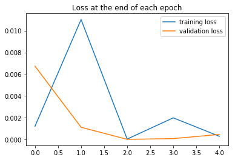
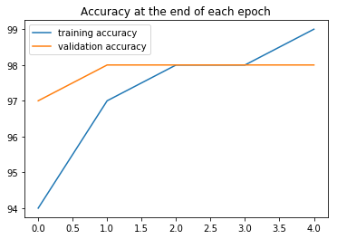
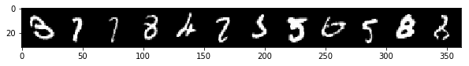
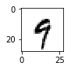

PyTorch BootCamp - Convolutional Neural Networks
================
by Jawad Haider

- <a href="#mnist-code-along-with-cnn"
  id="toc-mnist-code-along-with-cnn">MNIST Code Along with CNN</a>
  - <a href="#perform-standard-imports"
    id="toc-perform-standard-imports">Perform standard imports</a>
  - <a href="#load-the-mnist-dataset" id="toc-load-the-mnist-dataset">Load
    the MNIST dataset</a>
    - <a href="#create-loaders" id="toc-create-loaders">Create loaders</a>
  - <a href="#define-a-convolutional-model"
    id="toc-define-a-convolutional-model">Define a convolutional model</a>
  - <a href="#define-loss-function-optimizer"
    id="toc-define-loss-function-optimizer">Define loss function &amp;
    optimizer</a>
  - <a href="#train-the-model" id="toc-train-the-model">Train the model</a>
  - <a href="#plot-the-loss-and-accuracy-comparisons"
    id="toc-plot-the-loss-and-accuracy-comparisons">Plot the loss and
    accuracy comparisons</a>
  - <a href="#evaluate-test-data" id="toc-evaluate-test-data">Evaluate Test
    Data</a>
  - <a href="#display-the-confusion-matrix"
    id="toc-display-the-confusion-matrix">Display the confusion matrix</a>
  - <a href="#examine-the-misses" id="toc-examine-the-misses">Examine the
    misses</a>
  - <a href="#run-a-new-image-through-the-model"
    id="toc-run-a-new-image-through-the-model">Run a new image through the
    model</a>
  - <a href="#great-job" id="toc-great-job">Great job!</a>

# MNIST Code Along with CNN

Now that we’ve seen the results of an artificial neural network model on
the <a href='https://en.wikipedia.org/wiki/MNIST_database'>MNIST
dataset</a>, let’s work the same data with a
<a href='https://en.wikipedia.org/wiki/Convolutional_neural_network'>Convolutional
Neural Network</a> (CNN). Make sure to watch the theory lectures! You’ll
want to be comfortable with: \* convolutional layers \* filters/kernels
\* pooling \* depth, stride and zero-padding

Note that in this exercise there is no need to flatten the MNIST data,
as a CNN expects 2-dimensional data.

## Perform standard imports

``` python
import torch
import torch.nn as nn
import torch.nn.functional as F
from torch.utils.data import DataLoader
from torchvision import datasets, transforms
from torchvision.utils import make_grid

import numpy as np
import pandas as pd
from sklearn.metrics import confusion_matrix
import matplotlib.pyplot as plt
%matplotlib inline
```

## Load the MNIST dataset

PyTorch makes the MNIST train and test datasets available through
<a href='https://pytorch.org/docs/stable/torchvision/index.html'><tt><strong>torchvision</strong></tt></a>.
The first time they’re called, the datasets will be downloaded onto your
computer to the path specified. From that point, torchvision will always
look for a local copy before attempting another download.

Refer to the previous section for explanations of transformations, batch
sizes and
<a href='https://pytorch.org/docs/stable/data.html#torch.utils.data.DataLoader'><tt><strong>DataLoader</strong></tt></a>.

``` python
transform = transforms.ToTensor()

train_data = datasets.MNIST(root='../Data', train=True, download=True, transform=transform)
test_data = datasets.MNIST(root='../Data', train=False, download=True, transform=transform)
```

``` python
train_data
```

    Dataset MNIST
        Number of datapoints: 60000
        Split: train
        Root Location: ../Data
        Transforms (if any): ToTensor()
        Target Transforms (if any): None

``` python
test_data
```

    Dataset MNIST
        Number of datapoints: 10000
        Split: test
        Root Location: ../Data
        Transforms (if any): ToTensor()
        Target Transforms (if any): None

### Create loaders

When working with images, we want relatively small batches; a batch size
of 4 is not uncommon.

``` python
train_loader = DataLoader(train_data, batch_size=10, shuffle=True)
test_loader = DataLoader(test_data, batch_size=10, shuffle=False)
```

## Define a convolutional model

In the previous section we used only fully connected layers, with an
input layer of 784 (our flattened 28x28 images), hidden layers of 120
and 84 neurons, and an output size representing 10 possible digits.

This time we’ll employ two convolutional layers and two pooling layers
before feeding data through fully connected hidden layers to our output.
The model follows CONV/RELU/POOL/CONV/RELU/POOL/FC/RELU/FC.

<div class="alert alert-info">

<strong>Let’s walk through the steps we’re about to take.</strong><br>

1.  Extend the base Module class:

<tt><font color=black>class ConvolutionalNetwork(nn.Module):<br>     def
\_\_init\_\_(self):<br>         super().\_\_init\_\_()</font></tt><br>

2.  Set up the convolutional layers with
    <a href='https://pytorch.org/docs/stable/nn.html#conv2d'><tt><strong>torch.nn.Conv2d()</strong></tt></a><br><br>The
    first layer has one input channel (the grayscale color channel).
    We’ll assign 6 output channels for feature extraction. We’ll set our
    kernel size to 3 to make a 3x3 filter, and set the step size to
    1.<br> <tt><font color=black>    self.conv1 = nn.Conv2d(1, 6, 3,
    1)</font></tt><br> The second layer will take our 6 input channels
    and deliver 16 output channels.<br>
    <tt><font color=black>    self.conv2 = nn.Conv2d(6, 16, 3,
    1)</font></tt><br><br>

3.  Set up the fully connected layers with
    <a href='https://pytorch.org/docs/stable/nn.html#linear'><tt><strong>torch.nn.Linear()</strong></tt></a>.<br><br>The
    input size of (5x5x16) is determined by the effect of our kernels on
    the input image size. A 3x3 filter applied to a 28x28 image leaves a
    1-pixel edge on all four sides. In one layer the size changes from
    28x28 to 26x26. We could address this with zero-padding, but since
    an MNIST image is mostly black at the edges, we should be safe
    ignoring these pixels. We’ll apply the kernel twice, and apply
    pooling layers twice, so our resulting output will be
    $\;(((28-2)/2)-2)/2 = 5.5\;$ which rounds down to 5 pixels per
    side.<br> <tt><font color=black>    self.fc1 = nn.Linear(5\*5\*16,
    120)</font></tt><br> <tt><font color=black>    self.fc2 =
    nn.Linear(120, 84)</font></tt><br>
    <tt><font color=black>    self.fc3 = nn.Linear(84,
    10)</font></tt><br> See below for a more detailed look at this
    step.<br><br>

4.  Define the forward method.<br><br>Activations can be applied to the
    convolutions in one line using
    <a href='https://pytorch.org/docs/stable/nn.html#id27'><tt><strong>F.relu()</strong></tt></a>
    and pooling is done using
    <a href='https://pytorch.org/docs/stable/nn.html#maxpool2d'><tt><strong>F.max_pool2d()</strong></tt></a><br>
    <tt><font color=black>def forward(self, X):<br>     X =
    F.relu(self.conv1(X))<br>     X = F.max_pool2d(X, 2, 2)<br>     X =
    F.relu(self.conv2(X))<br>     X = F.max_pool2d(X, 2, 2)<br>
    </font></tt>Flatten the data for the fully connected
    layers:<br><tt><font color=black>     X = X.view(-1, 5\*5\*16)<br>
        X = F.relu(self.fc1(X))<br>     X = self.fc2(X)<br>     return
    F.log_softmax(X, dim=1)</font></tt>

</div>

<div class="alert alert-danger">

<strong>Breaking down the convolutional layers</strong> (this code is
for illustration purposes only.)

</div>

``` python
# Define layers
conv1 = nn.Conv2d(1, 6, 3, 1)
conv2 = nn.Conv2d(6, 16, 3, 1)
```

``` python
# Grab the first MNIST record
for i, (X_train, y_train) in enumerate(train_data):
    break
```

``` python
# Create a rank-4 tensor to be passed into the model
# (train_loader will have done this already)
x = X_train.view(1,1,28,28)
print(x.shape)
```

    torch.Size([1, 1, 28, 28])

``` python
# Perform the first convolution/activation
x = F.relu(conv1(x))
print(x.shape)
```

    torch.Size([1, 6, 26, 26])

``` python
# Run the first pooling layer
x = F.max_pool2d(x, 2, 2)
print(x.shape)
```

    torch.Size([1, 6, 13, 13])

``` python
# Perform the second convolution/activation
x = F.relu(conv2(x))
print(x.shape)
```

    torch.Size([1, 16, 11, 11])

``` python
# Run the second pooling layer
x = F.max_pool2d(x, 2, 2)
print(x.shape)
```

    torch.Size([1, 16, 5, 5])

``` python
# Flatten the data
x = x.view(-1, 5*5*16)
print(x.shape)
```

    torch.Size([1, 400])

<div class="alert alert-danger">

<strong>This is how the convolution output is passed into the fully
connected layers.</strong>

</div>

Now let’s run the code.

``` python
class ConvolutionalNetwork(nn.Module):
    def __init__(self):
        super().__init__()
        self.conv1 = nn.Conv2d(1, 6, 3, 1)
        self.conv2 = nn.Conv2d(6, 16, 3, 1)
        self.fc1 = nn.Linear(5*5*16, 120)
        self.fc2 = nn.Linear(120, 84)
        self.fc3 = nn.Linear(84,10)

    def forward(self, X):
        X = F.relu(self.conv1(X))
        X = F.max_pool2d(X, 2, 2)
        X = F.relu(self.conv2(X))
        X = F.max_pool2d(X, 2, 2)
        X = X.view(-1, 5*5*16)
        X = F.relu(self.fc1(X))
        X = F.relu(self.fc2(X))
        X = self.fc3(X)
        return F.log_softmax(X, dim=1)
```

``` python
torch.manual_seed(42)
model = ConvolutionalNetwork()
model
```

    ConvolutionalNetwork(
      (conv1): Conv2d(1, 6, kernel_size=(3, 3), stride=(1, 1))
      (conv2): Conv2d(6, 16, kernel_size=(3, 3), stride=(1, 1))
      (fc1): Linear(in_features=400, out_features=120, bias=True)
      (fc2): Linear(in_features=120, out_features=84, bias=True)
      (fc3): Linear(in_features=84, out_features=10, bias=True)
    )

Including the bias terms for each layer, the total number of parameters
being trained is:<br>

$\quad\begin{split}(1\times6\times3\times3)+6+(6\times16\times3\times3)+16+(400\times120)+120+(120\times84)+84+(84\times10)+10 &=\\ 54+6+864+16+48000+120+10080+84+840+10 &= 60,074\end{split}$<br>

``` python
def count_parameters(model):
    params = [p.numel() for p in model.parameters() if p.requires_grad]
    for item in params:
        print(f'{item:>6}')
    print(f'______\n{sum(params):>6}')
```

``` python
count_parameters(model)
```

        54
         6
       864
        16
     48000
       120
     10080
        84
       840
        10
    ______
     60074

## Define loss function & optimizer

``` python
criterion = nn.CrossEntropyLoss()
optimizer = torch.optim.Adam(model.parameters(), lr=0.001)
```

## Train the model

This time we’ll feed the data directly into the model without flattening
it first.

``` python
import time
start_time = time.time()

epochs = 5
train_losses = []
test_losses = []
train_correct = []
test_correct = []

for i in range(epochs):
    trn_corr = 0
    tst_corr = 0
    
    # Run the training batches
    for b, (X_train, y_train) in enumerate(train_loader):
        b+=1
        
        # Apply the model
        y_pred = model(X_train)  # we don't flatten X-train here
        loss = criterion(y_pred, y_train)
 
        # Tally the number of correct predictions
        predicted = torch.max(y_pred.data, 1)[1]
        batch_corr = (predicted == y_train).sum()
        trn_corr += batch_corr
        
        # Update parameters
        optimizer.zero_grad()
        loss.backward()
        optimizer.step()
        
        # Print interim results
        if b%600 == 0:
            print(f'epoch: {i:2}  batch: {b:4} [{10*b:6}/60000]  loss: {loss.item():10.8f}  \
accuracy: {trn_corr.item()*100/(10*b):7.3f}%')
        
    train_losses.append(loss)
    train_correct.append(trn_corr)
        
    # Run the testing batches
    with torch.no_grad():
        for b, (X_test, y_test) in enumerate(test_loader):

            # Apply the model
            y_val = model(X_test)

            # Tally the number of correct predictions
            predicted = torch.max(y_val.data, 1)[1] 
            tst_corr += (predicted == y_test).sum()
            
    loss = criterion(y_val, y_test)
    test_losses.append(loss)
    test_correct.append(tst_corr)
        
print(f'\nDuration: {time.time() - start_time:.0f} seconds') # print the time elapsed            
```

    epoch:  0  batch:  600 [  6000/60000]  loss: 0.21188490  accuracy:  78.233%
    epoch:  0  batch: 1200 [ 12000/60000]  loss: 0.58768761  accuracy:  85.433%
    epoch:  0  batch: 1800 [ 18000/60000]  loss: 0.03002630  accuracy:  88.539%
    epoch:  0  batch: 2400 [ 24000/60000]  loss: 0.02856987  accuracy:  90.396%
    epoch:  0  batch: 3000 [ 30000/60000]  loss: 0.01619262  accuracy:  91.543%
    epoch:  0  batch: 3600 [ 36000/60000]  loss: 0.00392615  accuracy:  92.347%
    epoch:  0  batch: 4200 [ 42000/60000]  loss: 0.07892600  accuracy:  92.938%
    epoch:  0  batch: 4800 [ 48000/60000]  loss: 0.00173595  accuracy:  93.458%
    epoch:  0  batch: 5400 [ 54000/60000]  loss: 0.00021752  accuracy:  93.889%
    epoch:  0  batch: 6000 [ 60000/60000]  loss: 0.00123056  accuracy:  94.245%
    epoch:  1  batch:  600 [  6000/60000]  loss: 0.03455487  accuracy:  97.967%
    epoch:  1  batch: 1200 [ 12000/60000]  loss: 0.25245315  accuracy:  97.792%
    epoch:  1  batch: 1800 [ 18000/60000]  loss: 0.15286988  accuracy:  97.833%
    epoch:  1  batch: 2400 [ 24000/60000]  loss: 0.00420426  accuracy:  97.875%
    epoch:  1  batch: 3000 [ 30000/60000]  loss: 0.00133034  accuracy:  97.897%
    epoch:  1  batch: 3600 [ 36000/60000]  loss: 0.10122252  accuracy:  97.922%
    epoch:  1  batch: 4200 [ 42000/60000]  loss: 0.03956039  accuracy:  97.931%
    epoch:  1  batch: 4800 [ 48000/60000]  loss: 0.15445584  accuracy:  97.950%
    epoch:  1  batch: 5400 [ 54000/60000]  loss: 0.02514876  accuracy:  97.998%
    epoch:  1  batch: 6000 [ 60000/60000]  loss: 0.01102044  accuracy:  97.990%
    epoch:  2  batch:  600 [  6000/60000]  loss: 0.00138958  accuracy:  98.667%
    epoch:  2  batch: 1200 [ 12000/60000]  loss: 0.00090325  accuracy:  98.533%
    epoch:  2  batch: 1800 [ 18000/60000]  loss: 0.00036748  accuracy:  98.567%
    epoch:  2  batch: 2400 [ 24000/60000]  loss: 0.00072705  accuracy:  98.487%
    epoch:  2  batch: 3000 [ 30000/60000]  loss: 0.00448279  accuracy:  98.460%
    epoch:  2  batch: 3600 [ 36000/60000]  loss: 0.00007090  accuracy:  98.508%
    epoch:  2  batch: 4200 [ 42000/60000]  loss: 0.00142251  accuracy:  98.500%
    epoch:  2  batch: 4800 [ 48000/60000]  loss: 0.00054714  accuracy:  98.473%
    epoch:  2  batch: 5400 [ 54000/60000]  loss: 0.00036345  accuracy:  98.493%
    epoch:  2  batch: 6000 [ 60000/60000]  loss: 0.00005013  accuracy:  98.515%
    epoch:  3  batch:  600 [  6000/60000]  loss: 0.00073732  accuracy:  99.117%
    epoch:  3  batch: 1200 [ 12000/60000]  loss: 0.01391867  accuracy:  98.933%
    epoch:  3  batch: 1800 [ 18000/60000]  loss: 0.00901531  accuracy:  98.806%
    epoch:  3  batch: 2400 [ 24000/60000]  loss: 0.00081765  accuracy:  98.846%
    epoch:  3  batch: 3000 [ 30000/60000]  loss: 0.00001284  accuracy:  98.880%
    epoch:  3  batch: 3600 [ 36000/60000]  loss: 0.00020319  accuracy:  98.886%
    epoch:  3  batch: 4200 [ 42000/60000]  loss: 0.00093818  accuracy:  98.879%
    epoch:  3  batch: 4800 [ 48000/60000]  loss: 0.00241654  accuracy:  98.917%
    epoch:  3  batch: 5400 [ 54000/60000]  loss: 0.00376742  accuracy:  98.893%
    epoch:  3  batch: 6000 [ 60000/60000]  loss: 0.00199913  accuracy:  98.863%
    epoch:  4  batch:  600 [  6000/60000]  loss: 0.00138756  accuracy:  99.183%
    epoch:  4  batch: 1200 [ 12000/60000]  loss: 0.10804896  accuracy:  99.075%
    epoch:  4  batch: 1800 [ 18000/60000]  loss: 0.00437851  accuracy:  99.156%
    epoch:  4  batch: 2400 [ 24000/60000]  loss: 0.00001171  accuracy:  99.104%
    epoch:  4  batch: 3000 [ 30000/60000]  loss: 0.00447276  accuracy:  99.050%
    epoch:  4  batch: 3600 [ 36000/60000]  loss: 0.00048421  accuracy:  99.061%
    epoch:  4  batch: 4200 [ 42000/60000]  loss: 0.00056122  accuracy:  99.043%
    epoch:  4  batch: 4800 [ 48000/60000]  loss: 0.00057514  accuracy:  99.033%
    epoch:  4  batch: 5400 [ 54000/60000]  loss: 0.07913177  accuracy:  99.028%
    epoch:  4  batch: 6000 [ 60000/60000]  loss: 0.00030920  accuracy:  99.027%

    Duration: 253 seconds

## Plot the loss and accuracy comparisons

``` python
plt.plot(train_losses, label='training loss')
plt.plot(test_losses, label='validation loss')
plt.title('Loss at the end of each epoch')
plt.legend();
```



``` python
test_losses
```

    [tensor(0.0067),
     tensor(0.0011),
     tensor(2.5534e-05),
     tensor(9.3650e-05),
     tensor(0.0005)]

While there may be some overfitting of the training data, there is far
less than we saw with the ANN model.

``` python
plt.plot([t/600 for t in train_correct], label='training accuracy')
plt.plot([t/100 for t in test_correct], label='validation accuracy')
plt.title('Accuracy at the end of each epoch')
plt.legend();
```



## Evaluate Test Data

``` python
# Extract the data all at once, not in batches
test_load_all = DataLoader(test_data, batch_size=10000, shuffle=False)
```

``` python
with torch.no_grad():
    correct = 0
    for X_test, y_test in test_load_all:
        y_val = model(X_test)  # we don't flatten the data this time
        predicted = torch.max(y_val,1)[1]
        correct += (predicted == y_test).sum()
print(f'Test accuracy: {correct.item()}/{len(test_data)} = {correct.item()*100/(len(test_data)):7.3f}%')
```

    Test accuracy: 9848/10000 =  98.480%

Recall that our \[784,120,84,10\] ANN returned an accuracy of 97.25%
after 10 epochs. And it used 105,214 parameters to our current 60,074.

## Display the confusion matrix

``` python
# print a row of values for reference
np.set_printoptions(formatter=dict(int=lambda x: f'{x:4}'))
print(np.arange(10).reshape(1,10))
print()

# print the confusion matrix
print(confusion_matrix(predicted.view(-1), y_test.view(-1)))
```

    [[   0    1    2    3    4    5    6    7    8    9]]

    [[ 977    0    3    2    2    2    4    1   10    2]
     [   0 1132    5    1    1    0    3    7    1    2]
     [   0    0 1015    1    0    0    0    4    3    0]
     [   0    2    0 1001    0   11    0    1    3    4]
     [   0    0    1    0  966    0    1    0    2    2]
     [   0    0    0    1    0  863    2    0    0    2]
     [   1    0    0    0    3    4  948    0    0    0]
     [   1    0    5    0    0    1    0 1005    1    2]
     [   1    1    3    4    1    4    0    2  948    2]
     [   0    0    0    0    9    7    0    8    6  993]]

## Examine the misses

We can track the index positions of “missed” predictions, and extract
the corresponding image and label. We’ll do this in batches to save
screen space.

``` python
misses = np.array([])
for i in range(len(predicted.view(-1))):
    if predicted[i] != y_test[i]:
        misses = np.append(misses,i).astype('int64')
        
# Display the number of misses
len(misses)
```

    152

``` python
# Display the first 10 index positions
misses[:10]
```

    array([  18,  111,  175,  184,  247,  321,  340,  412,  445,  460],
          dtype=int64)

``` python
# Set up an iterator to feed batched rows
r = 12   # row size
row = iter(np.array_split(misses,len(misses)//r+1))
```

Now that everything is set up, run and re-run the cell below to view all
of the missed predictions.<br> Use <kbd>Ctrl+Enter</kbd> to remain on
the cell between runs. You’ll see a <tt>StopIteration</tt> once all the
misses have been seen.

``` python
nextrow = next(row)
print("Index:", nextrow)
print("Label:", y_test.index_select(0,torch.tensor(nextrow)).numpy())
print("Guess:", predicted.index_select(0,torch.tensor(nextrow)).numpy())

images = X_test.index_select(0,torch.tensor(nextrow))
im = make_grid(images, nrow=r)
plt.figure(figsize=(10,4))
plt.imshow(np.transpose(im.numpy(), (1, 2, 0)));
```

    Index: [  18  111  175  184  247  321  340  412  445  460  495  582]
    Label: [   3    7    7    8    4    2    5    5    6    5    8    8]
    Guess: [   8    1    1    3    6    7    3    3    0    9    0    2]



## Run a new image through the model

We can also pass a single image through the model to obtain a
prediction. Pick a number from 0 to 9999, assign it to “x”, and we’ll
use that value to select a number from the MNIST test set.

``` python
x = 2019
plt.figure(figsize=(1,1))
plt.imshow(test_data[x][0].reshape((28,28)), cmap="gist_yarg");
```



``` python
model.eval()
with torch.no_grad():
    new_pred = model(test_data[x][0].view(1,1,28,28)).argmax()
print("Predicted value:",new_pred.item())
```

    Predicted value: 9

## Great job!

<center>

<a href=''>  </a>

</center>
<center>
<em>Copyright Qalmaqihir</em>
</center>
<center>
<em>For more information, visit us at
<a href='http://www.github.com/qalmaqihir/'>www.github.com/qalmaqihir/</a></em>
</center>
