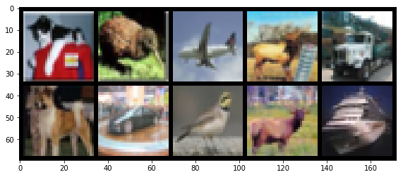
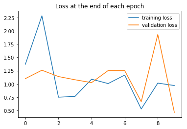
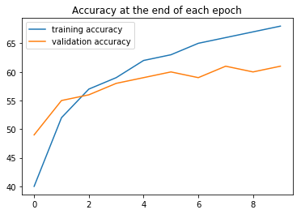
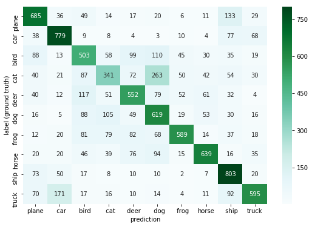
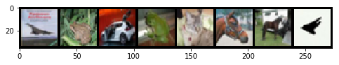

PyTorch BootCamp - Convolutional Neural Networks
================
by Jawad Haider

- <a href="#cifar-code-along-with-cnn"
  id="toc-cifar-code-along-with-cnn">CIFAR Code Along with CNN</a>
  - <a href="#perform-standard-imports"
    id="toc-perform-standard-imports">Perform standard imports</a>
  - <a href="#load-the-cifar-10-dataset"
    id="toc-load-the-cifar-10-dataset">Load the CIFAR-10 dataset</a>
    - <a href="#create-loaders" id="toc-create-loaders">Create loaders</a>
    - <a href="#define-strings-for-labels"
      id="toc-define-strings-for-labels">Define strings for labels</a>
  - <a href="#view-a-batch-of-images" id="toc-view-a-batch-of-images">View a
    batch of images</a>
  - <a href="#define-the-model" id="toc-define-the-model">Define the
    model</a>
  - <a href="#define-loss-function-optimizer"
    id="toc-define-loss-function-optimizer">Define loss function &amp;
    optimizer</a>
  - <a href="#train-the-model" id="toc-train-the-model">Train the model</a>
  - <a href="#optional-save-the-model"
    id="toc-optional-save-the-model">Optional: Save the model</a>
  - <a href="#plot-the-loss-and-accuracy-comparisons"
    id="toc-plot-the-loss-and-accuracy-comparisons">Plot the loss and
    accuracy comparisons</a>
  - <a href="#evaluate-test-data" id="toc-evaluate-test-data">Evaluate Test
    Data</a>
  - <a href="#display-the-confusion-matrix"
    id="toc-display-the-confusion-matrix">Display the confusion matrix</a>
  - <a href="#examine-the-misses" id="toc-examine-the-misses">Examine the
    misses</a>
  - <a href="#great-job" id="toc-great-job">Great job!</a>

# CIFAR Code Along with CNN

The <a href='https://en.wikipedia.org/wiki/CIFAR-10'>CIFAR-10</a>
dataset is similar to MNIST, except that instead of one color channel
(grayscale) there are three channels (RGB).<br> Where an MNIST image has
a size of (1,28,28), CIFAR images are (3,32,32). There are 10 categories
an image may fall under: 0. airplane 1. automobile 2. bird 3. cat 4.
deer 5. dog 6. frog 7. horse 8. ship 9. truck

As with the previous code along, make sure to watch the theory lectures!
You’ll want to be comfortable with: \* convolutional layers \*
filters/kernels \* pooling \* depth, stride and zero-padding

## Perform standard imports

``` python
import torch
import torch.nn as nn
import torch.nn.functional as F
from torch.utils.data import DataLoader
from torchvision import datasets, transforms
from torchvision.utils import make_grid

import numpy as np
import pandas as pd
import seaborn as sn  # for heatmaps
from sklearn.metrics import confusion_matrix
import matplotlib.pyplot as plt
%matplotlib inline
```

## Load the CIFAR-10 dataset

PyTorch makes the CIFAR-10 train and test datasets available through
<a href='https://pytorch.org/docs/stable/torchvision/index.html'><tt><strong>torchvision</strong></tt></a>.
The first time they’re called, the datasets will be downloaded onto your
computer to the path specified. From that point, torchvision will always
look for a local copy before attempting another download.<br>The set
contains 50,000 train and 10,000 test images.

Refer to the previous section for explanations of transformations, batch
sizes and
<a href='https://pytorch.org/docs/stable/data.html#torch.utils.data.DataLoader'><tt><strong>DataLoader</strong></tt></a>.

``` python
transform = transforms.ToTensor()

train_data = datasets.CIFAR10(root='../Data', train=True, download=True, transform=transform)
test_data = datasets.CIFAR10(root='../Data', train=False, download=True, transform=transform)
```

    Files already downloaded and verified
    Files already downloaded and verified

``` python
train_data
```

    Dataset CIFAR10
        Number of datapoints: 50000
        Split: train
        Root Location: ../Data
        Transforms (if any): ToTensor()
        Target Transforms (if any): None

``` python
test_data
```

    Dataset CIFAR10
        Number of datapoints: 10000
        Split: test
        Root Location: ../Data
        Transforms (if any): ToTensor()
        Target Transforms (if any): None

### Create loaders

``` python
torch.manual_seed(101)  # for reproducible results

train_loader = DataLoader(train_data, batch_size=10, shuffle=True)
test_loader = DataLoader(test_data, batch_size=10, shuffle=False)
```

### Define strings for labels

We can call the labels whatever we want, so long as they appear in the
order of ‘airplane’, ‘automobile’, ‘bird’, ‘cat’, ‘deer’, ‘dog’, ‘frog’,
‘horse’, ‘ship’, ‘truck’. Here we’re using 5-character labels padded
with spaces so that our reports line up later.

``` python
class_names = ['plane', '  car', ' bird', '  cat', ' deer', '  dog', ' frog', 'horse', ' ship', 'truck']
```

We don’t want to use the variable name “class” here, as it would
overwrite Python’s built-in keyword.

## View a batch of images

``` python
np.set_printoptions(formatter=dict(int=lambda x: f'{x:5}')) # to widen the printed array

# Grab the first batch of 10 images
for images,labels in train_loader: 
    break

# Print the labels
print('Label:', labels.numpy())
print('Class: ', *np.array([class_names[i] for i in labels]))

# Print the images
im = make_grid(images, nrow=5)  # the default nrow is 8
plt.figure(figsize=(10,4))
plt.imshow(np.transpose(im.numpy(), (1, 2, 0)));
```

    Label: [    3     2     0     4     9     5     1     2     4     8]
    Class:    cat  bird plane  deer truck   dog   car  bird  deer  ship



## Define the model

In the previous section we used two convolutional layers and two pooling
layers before feeding data through a fully connected hidden layer to our
output. The model follows CONV/RELU/POOL/CONV/RELU/POOL/FC/RELU/FC.
We’ll use the same format here.

The only changes are: \* take in 3-channel images instead of 1-channel
\* adjust the size of the fully connected input<br>

Our first convolutional layer will have 3 input channels, 6 output
channels, a kernel size of 3 (resulting in a 3x3 filter), and a stride
length of 1 pixel.<br>These are passed in as <tt>nn.Conv2d(3,6,3,1)</tt>

``` python
class ConvolutionalNetwork(nn.Module):
    def __init__(self):
        super().__init__()
        self.conv1 = nn.Conv2d(3, 6, 3, 1)  # changed from (1, 6, 5, 1)
        self.conv2 = nn.Conv2d(6, 16, 3, 1)
        self.fc1 = nn.Linear(6*6*16, 120)   # changed from (4*4*16) to fit 32x32 images with 3x3 filters
        self.fc2 = nn.Linear(120,84)
        self.fc3 = nn.Linear(84, 10)

    def forward(self, X):
        X = F.relu(self.conv1(X))
        X = F.max_pool2d(X, 2, 2)
        X = F.relu(self.conv2(X))
        X = F.max_pool2d(X, 2, 2)
        X = X.view(-1, 6*6*16)
        X = F.relu(self.fc1(X))
        X = F.relu(self.fc2(X))
        X = self.fc3(X)
        return F.log_softmax(X, dim=1)
```

<div class="alert alert-info">

<strong>Why <tt>(6x6x16)</tt> instead of <tt>(5x5x16)</tt>?</strong><br>
With MNIST the kernels and pooling layers resulted in
$\;(((28−2)/2)−2)/2=5.5 \;$ which rounds down to 5 pixels per side.<br>
With CIFAR the result is $\;(((32-2)/2)-2)/2 = 6.5\;$ which rounds down
to 6 pixels per side.

</div>

``` python
torch.manual_seed(101)
model = ConvolutionalNetwork()
model
```

    ConvolutionalNetwork(
      (conv1): Conv2d(3, 6, kernel_size=(3, 3), stride=(1, 1))
      (conv2): Conv2d(6, 16, kernel_size=(3, 3), stride=(1, 1))
      (fc1): Linear(in_features=576, out_features=120, bias=True)
      (fc2): Linear(in_features=120, out_features=84, bias=True)
      (fc3): Linear(in_features=84, out_features=10, bias=True)
    )

Including the bias terms for each layer, the total number of parameters
being trained is:<br>

$\quad\begin{split}(3\times6\times3\times3)+6+(6\times16\times3\times3)+16+(576\times120)+120+(120\times84)+84+(84\times10)+10 &=\\ 162+6+864+16+69120+120+10080+84+840+10 &= 81,302\end{split}$<br>

``` python
def count_parameters(model):
    params = [p.numel() for p in model.parameters() if p.requires_grad]
    for item in params:
        print(f'{item:>6}')
    print(f'______\n{sum(params):>6}')
```

``` python
count_parameters(model)
```

       162
         6
       864
        16
     69120
       120
     10080
        84
       840
        10
    ______
     81302

## Define loss function & optimizer

``` python
criterion = nn.CrossEntropyLoss()
optimizer = torch.optim.Adam(model.parameters(), lr=0.001)
```

## Train the model

This time we’ll feed the data directly into the model without flattening
it first.<br>

<div class="alert alert-info">

<font color=blue><strong>OPTIONAL: </strong>In the event that training
takes too long, you can interrupt the kernel, skip ahead to the bottom
of the notebook, and load a trained version of the model that’s been
saved in this folder.</font>

</div>

``` python
import time
start_time = time.time()

epochs = 10
train_losses = []
test_losses = []
train_correct = []
test_correct = []

for i in range(epochs):
    trn_corr = 0
    tst_corr = 0
    
    # Run the training batches
    for b, (X_train, y_train) in enumerate(train_loader):
        b+=1
        
        # Apply the model
        y_pred = model(X_train)
        loss = criterion(y_pred, y_train)
 
        # Tally the number of correct predictions
        predicted = torch.max(y_pred.data, 1)[1]
        batch_corr = (predicted == y_train).sum()
        trn_corr += batch_corr
        
        # Update parameters
        optimizer.zero_grad()
        loss.backward()
        optimizer.step()
        
        # Print interim results
        if b%1000 == 0:
            print(f'epoch: {i:2}  batch: {b:4} [{10*b:6}/50000]  loss: {loss.item():10.8f}  \
accuracy: {trn_corr.item()*100/(10*b):7.3f}%')
        
    train_losses.append(loss)
    train_correct.append(trn_corr)
        
    # Run the testing batches
    with torch.no_grad():
        for b, (X_test, y_test) in enumerate(test_loader):

            # Apply the model
            y_val = model(X_test)

            # Tally the number of correct predictions
            predicted = torch.max(y_val.data, 1)[1] 
            tst_corr += (predicted == y_test).sum()
            
    loss = criterion(y_val, y_test)
    test_losses.append(loss)
    test_correct.append(tst_corr)
        
print(f'\nDuration: {time.time() - start_time:.0f} seconds') # print the time elapsed            
```

    epoch:  0  batch: 1000 [ 10000/50000]  loss: 1.72811735  accuracy:  26.660%
    epoch:  0  batch: 2000 [ 20000/50000]  loss: 1.90085292  accuracy:  32.790%
    epoch:  0  batch: 3000 [ 30000/50000]  loss: 1.77626872  accuracy:  36.507%
    epoch:  0  batch: 4000 [ 40000/50000]  loss: 1.32156026  accuracy:  38.925%
    epoch:  0  batch: 5000 [ 50000/50000]  loss: 1.37019920  accuracy:  40.922%
    epoch:  1  batch: 1000 [ 10000/50000]  loss: 1.18819773  accuracy:  51.520%
    epoch:  1  batch: 2000 [ 20000/50000]  loss: 1.21327436  accuracy:  51.725%
    epoch:  1  batch: 3000 [ 30000/50000]  loss: 1.15835631  accuracy:  52.283%
    epoch:  1  batch: 4000 [ 40000/50000]  loss: 1.28492486  accuracy:  52.587%
    epoch:  1  batch: 5000 [ 50000/50000]  loss: 2.28428698  accuracy:  52.930%
    epoch:  2  batch: 1000 [ 10000/50000]  loss: 1.22954726  accuracy:  56.750%
    epoch:  2  batch: 2000 [ 20000/50000]  loss: 1.51806808  accuracy:  56.725%
    epoch:  2  batch: 3000 [ 30000/50000]  loss: 0.82857972  accuracy:  56.847%
    epoch:  2  batch: 4000 [ 40000/50000]  loss: 0.99008143  accuracy:  57.108%
    epoch:  2  batch: 5000 [ 50000/50000]  loss: 0.74985492  accuracy:  57.280%
    epoch:  3  batch: 1000 [ 10000/50000]  loss: 0.73941267  accuracy:  60.430%
    epoch:  3  batch: 2000 [ 20000/50000]  loss: 0.85795957  accuracy:  60.200%
    epoch:  3  batch: 3000 [ 30000/50000]  loss: 0.99735087  accuracy:  59.877%
    epoch:  3  batch: 4000 [ 40000/50000]  loss: 1.01958919  accuracy:  59.965%
    epoch:  3  batch: 5000 [ 50000/50000]  loss: 0.76560205  accuracy:  59.992%
    epoch:  4  batch: 1000 [ 10000/50000]  loss: 1.01610267  accuracy:  62.400%
    epoch:  4  batch: 2000 [ 20000/50000]  loss: 0.91081637  accuracy:  62.405%
    epoch:  4  batch: 3000 [ 30000/50000]  loss: 1.82826269  accuracy:  62.287%
    epoch:  4  batch: 4000 [ 40000/50000]  loss: 0.83664912  accuracy:  62.260%
    epoch:  4  batch: 5000 [ 50000/50000]  loss: 1.08910477  accuracy:  62.156%
    epoch:  5  batch: 1000 [ 10000/50000]  loss: 0.74583805  accuracy:  64.360%
    epoch:  5  batch: 2000 [ 20000/50000]  loss: 0.55392635  accuracy:  64.360%
    epoch:  5  batch: 3000 [ 30000/50000]  loss: 1.75524867  accuracy:  63.840%
    epoch:  5  batch: 4000 [ 40000/50000]  loss: 1.33982396  accuracy:  63.767%
    epoch:  5  batch: 5000 [ 50000/50000]  loss: 1.00686800  accuracy:  63.760%
    epoch:  6  batch: 1000 [ 10000/50000]  loss: 1.14186704  accuracy:  65.820%
    epoch:  6  batch: 2000 [ 20000/50000]  loss: 1.05023360  accuracy:  65.320%
    epoch:  6  batch: 3000 [ 30000/50000]  loss: 1.02424061  accuracy:  65.353%
    epoch:  6  batch: 4000 [ 40000/50000]  loss: 0.92525661  accuracy:  65.438%
    epoch:  6  batch: 5000 [ 50000/50000]  loss: 1.16625285  accuracy:  65.342%
    epoch:  7  batch: 1000 [ 10000/50000]  loss: 1.45434511  accuracy:  66.870%
    epoch:  7  batch: 2000 [ 20000/50000]  loss: 1.03906512  accuracy:  66.835%
    epoch:  7  batch: 3000 [ 30000/50000]  loss: 1.39975834  accuracy:  66.730%
    epoch:  7  batch: 4000 [ 40000/50000]  loss: 0.61725640  accuracy:  66.528%
    epoch:  7  batch: 5000 [ 50000/50000]  loss: 0.52788514  accuracy:  66.414%
    epoch:  8  batch: 1000 [ 10000/50000]  loss: 1.14143419  accuracy:  69.010%
    epoch:  8  batch: 2000 [ 20000/50000]  loss: 1.21063972  accuracy:  68.010%
    epoch:  8  batch: 3000 [ 30000/50000]  loss: 1.08417308  accuracy:  67.817%
    epoch:  8  batch: 4000 [ 40000/50000]  loss: 0.89879084  accuracy:  67.935%
    epoch:  8  batch: 5000 [ 50000/50000]  loss: 1.01553142  accuracy:  67.740%
    epoch:  9  batch: 1000 [ 10000/50000]  loss: 0.66314524  accuracy:  69.630%
    epoch:  9  batch: 2000 [ 20000/50000]  loss: 1.15445566  accuracy:  69.450%
    epoch:  9  batch: 3000 [ 30000/50000]  loss: 0.69587100  accuracy:  69.300%
    epoch:  9  batch: 4000 [ 40000/50000]  loss: 0.72007024  accuracy:  68.873%
    epoch:  9  batch: 5000 [ 50000/50000]  loss: 0.96967870  accuracy:  68.824%

    Duration: 1207 seconds

## Optional: Save the model

This will save your trained model, without overwriting the saved model
we have provided called <strong>CIFAR10-CNN-Model-master.pt</strong>

``` python
torch.save(model.state_dict(), 'CIFAR10-CNN-Model.pt')
```

## Plot the loss and accuracy comparisons

``` python
plt.plot(train_losses, label='training loss')
plt.plot(test_losses, label='validation loss')
plt.title('Loss at the end of each epoch')
plt.legend();
```



``` python
plt.plot([t/500 for t in train_correct], label='training accuracy')
plt.plot([t/100 for t in test_correct], label='validation accuracy')
plt.title('Accuracy at the end of each epoch')
plt.legend();
```



## Evaluate Test Data

``` python
print(test_correct) # contains the results of all 10 epochs
print()
print(f'Test accuracy: {test_correct[-1].item()*100/10000:.3f}%') # print the most recent result as a percent
```

    [tensor(4940), tensor(5519), tensor(5685), tensor(5812), tensor(5930), tensor(6048), tensor(5941), tensor(6166), tensor(6035), tensor(6105)]

    Test accuracy: 61.050%

This is not as impressive as with MNIST, which makes sense. We would
have to adjust our parameters to obtain better results.<br> Still, it’s
much better than the 10% we’d get with random chance!

## Display the confusion matrix

In order to map predictions against ground truth, we need to run the
entire test set through the model.<br> Also, since our model was not as
accurate as with MNIST, we’ll use a
<a href='https://seaborn.pydata.org/generated/seaborn.heatmap.html'>heatmap</a>
to better display the results.

``` python
# Create a loader for the entire the test set
test_load_all = DataLoader(test_data, batch_size=10000, shuffle=False)

with torch.no_grad():
    correct = 0
    for X_test, y_test in test_load_all:
        y_val = model(X_test)
        predicted = torch.max(y_val,1)[1]
        correct += (predicted == y_test).sum()

arr = confusion_matrix(y_test.view(-1), predicted.view(-1))
df_cm = pd.DataFrame(arr, class_names, class_names)
plt.figure(figsize = (9,6))
sn.heatmap(df_cm, annot=True, fmt="d", cmap='BuGn')
plt.xlabel("prediction")
plt.ylabel("label (ground truth)")
plt.show();
```



For more info on the above chart, visit the docs on
<a href='https://scikit-learn.org/stable/modules/generated/sklearn.metrics.confusion_matrix.html'>scikit-learn’s
confusion_matrix</a>,
<a href='https://seaborn.pydata.org/generated/seaborn.heatmap.html'>seaborn
heatmaps</a>, and
<a href='https://matplotlib.org/3.1.0/tutorials/colors/colormaps.html'>matplotlib
colormaps</a>.

## Examine the misses

We can track the index positions of “missed” predictions, and extract
the corresponding image and label. We’ll do this in batches to save
screen space.

``` python
misses = np.array([])
for i in range(len(predicted.view(-1))):
    if predicted[i] != y_test[i]:
        misses = np.append(misses,i).astype('int64')
        
# Display the number of misses
len(misses)
```

    3895

``` python
# Display the first 8 index positions
misses[:8]
```

    array([    3,     4,     6,     7,     8,    17,    20,    21],
          dtype=int64)

``` python
# Set up an iterator to feed batched rows
r = 8   # row size
row = iter(np.array_split(misses,len(misses)//r+1))
```

Now that everything is set up, run and re-run the cell below to view all
of the missed predictions.<br> Use <kbd>Ctrl+Enter</kbd> to remain on
the cell between runs. You’ll see a <tt>StopIteration</tt> once all the
misses have been seen.

``` python
np.set_printoptions(formatter=dict(int=lambda x: f'{x:5}')) # to widen the printed array

nextrow = next(row)
lbls = y_test.index_select(0,torch.tensor(nextrow)).numpy()
gues = predicted.index_select(0,torch.tensor(nextrow)).numpy()
print("Index:", nextrow)
print("Label:", lbls)
print("Class: ", *np.array([class_names[i] for i in lbls]))
print()
print("Guess:", gues)
print("Class: ", *np.array([class_names[i] for i in gues]))

images = X_test.index_select(0,torch.tensor(nextrow))
im = make_grid(images, nrow=r)
plt.figure(figsize=(8,4))
plt.imshow(np.transpose(im.numpy(), (1, 2, 0)));
```

    Index: [    3     4     6     7     8    17    20    21]
    Label: [    0     6     1     6     3     7     7     0]
    Class:  plane  frog   car  frog   cat horse horse plane

    Guess: [    8     4     2     4     5     3     2     2]
    Class:   ship  deer  bird  deer   dog   cat  bird  bird



<div class="alert alert-info">

<font color=blue>
<h2>
Optional: Load a Saved Model
</h2>
In the event that training the ConvolutionalNetwork takes too long, you
can load a trained version by running the following code:</font>
<pre style='background-color:rgb(217,237,247)'>
model2 = ConvolutionalNetwork()
model2.load_state_dict(torch.load('CIFAR10-CNN-Model-master.pt'))
model2.eval()</pre>

</div>

``` python
# Instantiate the model and load saved parameters
model2 = ConvolutionalNetwork()
model2.load_state_dict(torch.load('CIFAR10-CNN-Model-master.pt'))
model2.eval()
```

    ConvolutionalNetwork(
      (conv1): Conv2d(3, 6, kernel_size=(3, 3), stride=(1, 1))
      (conv2): Conv2d(6, 16, kernel_size=(3, 3), stride=(1, 1))
      (fc1): Linear(in_features=576, out_features=120, bias=True)
      (fc2): Linear(in_features=120, out_features=84, bias=True)
      (fc3): Linear(in_features=84, out_features=10, bias=True)
    )

``` python
# Evaluate the saved model against the test set
test_load_all = DataLoader(test_data, batch_size=10000, shuffle=False)

with torch.no_grad():
    correct = 0
    for X_test, y_test in test_load_all:
        y_val = model2(X_test)
        predicted = torch.max(y_val,1)[1]
        correct += (predicted == y_test).sum()
        
print(f'Test accuracy: {correct.item()}/{len(test_data)} = {correct.item()*100/(len(test_data)):7.3f}%')
```

    Test accuracy: 6105/10000 =  61.050%

``` python
# Display the confusion matrix as a heatmap
arr = confusion_matrix(y_test.view(-1), predicted.view(-1))
df_cm = pd.DataFrame(arr, class_names, class_names)
plt.figure(figsize = (9,6))
sn.heatmap(df_cm, annot=True, fmt="d", cmap='BuGn')
plt.xlabel("prediction")
plt.ylabel("label (ground truth)")
plt.show();
```


## Great job!

<center>

<a href=''>  </a>

</center>
<center>
<em>Copyright Qalmaqihir</em>
</center>
<center>
<em>For more information, visit us at
<a href='http://www.github.com/qalmaqihir/'>www.github.com/qalmaqihir/</a></em>
</center>
