PyTorch BootCamp - Convolutional Neural Networks
================
by Jawad Haider

- <a href="#loading-real-image-data"
  id="toc-loading-real-image-data">Loading Real Image Data</a>
  - <a href="#image-files-directory-tree"
    id="toc-image-files-directory-tree">Image files directory tree</a>
  - <a href="#perform-standard-imports"
    id="toc-perform-standard-imports">Perform standard imports</a>
  - <a href="#examine-the-data" id="toc-examine-the-data">Examine the
    data</a>
    - <a href="#create-a-list-of-image-filenames"
      id="toc-create-a-list-of-image-filenames">Create a list of image
      filenames</a>
    - <a href="#create-a-dataframe-of-image-sizes-width-x-height"
      id="toc-create-a-dataframe-of-image-sizes-width-x-height">Create a
      DataFrame of image sizes (width x height)</a>
  - <a href="#image-preprocessing" id="toc-image-preprocessing">Image
    Preprocessing</a>
  - <a href="#transformations" id="toc-transformations">Transformations</a>
    - <a href="#transforms.resizesize"
      id="toc-transforms.resizesize"><a href='https://pytorch.org/docs/stable/torchvision/transforms.html#torchvision.transforms.Resize'><tt>transforms.Resize(<em>size</em>)</tt></a></a>
    - <a href="#transforms.centercropsize"
      id="toc-transforms.centercropsize"><a href='https://pytorch.org/docs/stable/torchvision/transforms.html#torchvision.transforms.CenterCrop'><tt>transforms.CenterCrop(<em>size</em>)</tt></a></a>
  - <a href="#other-affine-transformations"
    id="toc-other-affine-transformations">Other affine transformations</a>
    - <a href="#transforms.randomrotationdegrees"
      id="toc-transforms.randomrotationdegrees"><a href='https://pytorch.org/docs/stable/torchvision/transforms.html#torchvision.transforms.RandomRotation'><tt>transforms.RandomRotation(<em>degrees</em>)</tt></a></a>
    - <a href="#scaling-is-done-using-transforms.resizesize"
      id="toc-scaling-is-done-using-transforms.resizesize">Scaling is done
      using
      <a href='https://pytorch.org/docs/stable/torchvision/transforms.html#torchvision.transforms.Resize'><tt>transforms.Resize(<em>size</em>)</tt></a></a>
  - <a href="#lets-put-it-all-together"
    id="toc-lets-put-it-all-together">Let’s put it all together</a>
  - <a href="#normalization" id="toc-normalization">Normalization</a>
    - <a href="#transforms.normalizemean-std"
      id="toc-transforms.normalizemean-std"><a href='https://pytorch.org/docs/stable/torchvision/transforms.html#torchvision.transforms.Normalize'><tt>transforms.Normalize(<em>mean,
      std</em>)</tt></a></a>
    - <a href="#optional-de-normalize-the-images"
      id="toc-optional-de-normalize-the-images">Optional: De-normalize the
      images</a>
  - <a href="#up-next-performing-cnn-on-real-images"
    id="toc-up-next-performing-cnn-on-real-images">Up next: performing CNN
    on real images!</a>

# Loading Real Image Data

So far we’ve only worked with toy datasets (MNIST, CIFAR-10)
conveniently packaged by torchvision, where every image has the same
size and shape. Now let’s learn the real deal, and work from a varied
collection of .jpg files.

For this section we’ll be working with a version of the Cats vs. Dogs
dataset inspired by a classic
<a href='https://www.kaggle.com/c/dogs-vs-cats'>Kaggle
competition</a>.<br> A quick note - do <strong>not</strong> download the
dataset from Kaggle! Ours is a cleaned version of the data without any
0by0 files, etc.<br>The images are similar to ones available from the
<a href='http://www.image-net.org/'>ImageNet</a> database.

We have organized the files into train and test folders, and further
divided the images into CAT and DOG subfolders. In this way the file
path contains the label.

### Image files directory tree

<pre>.
└── Data
    └── CATS_DOGS
        ├── test
        │   ├── CAT
        │   │   ├── 9374.jpg
        │   │   ├── 9375.jpg
        │   │   └── ... (3,126 files)
        │   └── DOG
        │       ├── 9374.jpg
        │       ├── 9375.jpg
        │       └── ... (3,125 files)       
        │           
        └── train
            ├── CAT
            │   ├── 0.jpg
            │   ├── 1.jpg
            │   └── ... (9,371 files)
            └── DOG
                ├── 0.jpg
                ├── 1.jpg
                └── ... (9,372 files)</pre>

## Perform standard imports

``` python
import torch
import torch.nn as nn
import torch.nn.functional as F
from torch.utils.data import DataLoader
from torchvision import datasets, transforms

import numpy as np
import pandas as pd
import matplotlib.pyplot as plt
%matplotlib inline
```

## Examine the data

We’ll us Python’s built-in
<a href='https://docs.python.org/3/library/os.html'>os module</a> to
walk the directories collecting file names. We’ll then use
<a href='https://python-pillow.org/'>Pillow</a>, an extension to the
Python Imaging Library (PIL), to open image files and extract image
sizes. A pandas DataFrame will provide summary statistics on our data
like max/min width & height from which we can choose our model
parameters.

``` python
import os
from PIL import Image
from IPython.display import display

# Filter harmless warnings
import warnings
warnings.filterwarnings("ignore")
```

<div class="alert-danger">

<strong>NOTE: </strong>There’s a
<a href='https://github.com/python-pillow/Pillow/issues/3769'>known
issue</a> with <strong>Pillow v6.0.0</strong> where it cannot open
certain .jpg files, and instead raises an<br>
<tt><strong>UnboundLocalError: </strong>local variable ‘photoshop’
referenced before assignment</tt><br>This is due to be fixed in an
upcoming release.

For example, the images affected in the CAT test set are:
<pre style='background-color:rgb(242,222,222)'>['../Data/CATS_DOGS/test/CAT/10107.jpg',
 '../Data/CATS_DOGS/test/CAT/10404.jpg',
 '../Data/CATS_DOGS/test/CAT/12086.jpg',
 '../Data/CATS_DOGS/test/CAT/9493.jpg',
 '../Data/CATS_DOGS/test/CAT/9683.jpg']</pre>
If this happens, you can either install an older version of Pillow, or
use our pytorch_course_env.yml file.

</div>

``` python
# TEST YOUR VERSION OF PILLOW
# Run this cell. If you see a picture of a cat you're all set!
with Image.open('../Data/CATS_DOGS/test/CAT/10107.jpg') as im:
    display(im)
```


### Create a list of image filenames

``` python
path = '..\\Data\\CATS_DOGS\\'
img_names = []

for folder, subfolders, filenames in os.walk(path):
    for img in filenames:
        img_names.append(folder+'\\'+img)
        
print('Images: ',len(img_names))
```

    Images:  24994

### Create a DataFrame of image sizes (width x height)

It’s worth noting that <tt>Image.open()</tt> doesn’t read the entire
image into memory, so it’s a reasonable way to get image sizes.<br>
Still, this can take awhile.

``` python
# Start by creating a list
img_sizes = []
rejected = []

for item in img_names:
    try:
        with Image.open(item) as img:
            img_sizes.append(img.size)
    except:
        rejected.append(item)
        
print(f'Images:  {len(img_sizes)}')
print(f'Rejects: {len(rejected)}')
```

    Images:  24994
    Rejects: 0

``` python
# Convert the list to a DataFrame
df = pd.DataFrame(img_sizes)

# Run summary statistics on image widths
df[0].describe()
```

    count    24994.000000
    mean       404.493518
    std        108.941802
    min         42.000000
    25%        323.000000
    50%        448.000000
    75%        500.000000
    max        500.000000
    Name: 0, dtype: float64

``` python
# Run summary statistics on image heights
df[1].describe()
```

    count    24994.000000
    mean       361.037129
    std         96.936811
    min         33.000000
    25%        302.000000
    50%        375.000000
    75%        421.000000
    max        500.000000
    Name: 1, dtype: float64

This tells us the shortest width is 42, the shortest height is 33, the
largest width and height are 500, and that most images have more than
300 pixels per side. This is useful for deciding on an input size. We’ll
see in the next section that 224x224 will work well for our purposes
(we’ll take advantage of some pre-trained models that use this size!)

## Image Preprocessing

Any network we define requires consistent input data. That is, the
incoming image files need to have the same number of channels (3 for
red/green/blue), the same depth per channel (0-255), and the same height
and width. This last requirement can be tricky. How do we transform an
800x450 pixel image into one that is 224x224? In the theory lectures we
covered the following: \*
<a href='https://en.wikipedia.org/wiki/Aspect_ratio_(image)'><strong>aspect
ratio</strong></a>: the ratio of width to height (16:9, 1:1, etc.) An
800x450 pixel image has an aspect ration of 16:9. We can change the
aspect ratio of an image by cropping it, by stretching/squeezing it, or
by some combination of the two. In both cases we lose some information
contained in the original. Let’s say we crop 175 pixels from the left
and right sides of our 800x450 image, resulting in one that’s 450x450.
\* <strong>scale</strong>: Once we’ve attained the proper aspect ratio
we may need to scale an image up or down to fit our input parameters.
There are several libraries we can use to scale a 450x450 image down to
224x224 with minimal loss. \*
<a href=''><strong>normalization</strong></a>: when images are converted
to tensors, the \[0,255\] rgb channels are loaded into range \[0,1\]. We
can then normalize them using the generally accepted values of
mean=\[0.485, 0.456, 0.406\] and std=\[0.229, 0.224, 0.225\]. For the
curious, these values were obtained by the PyTorch team using a random
10,000 sample of <a href='http://www.image-net.org/'>ImageNet</a>
images. There’s a good discussion of this
<a href='https://discuss.pytorch.org/t/normalization-in-the-mnist-example/457/22'>here</a>,
and the original source code can be found
<a href='https://github.com/soumith/imagenet-multiGPU.torch/blob/master/donkey.lua#L154'>here</a>.

## Transformations

Before defining our Convolutional Network, let’s look at a sample image
and perform various transformations on it to see their effect.

``` python
dog = Image.open('..\\Data\\CATS_DOGS\\train\\DOG\\14.jpg')
print(dog.size)
display(dog)
```

    (500, 387)

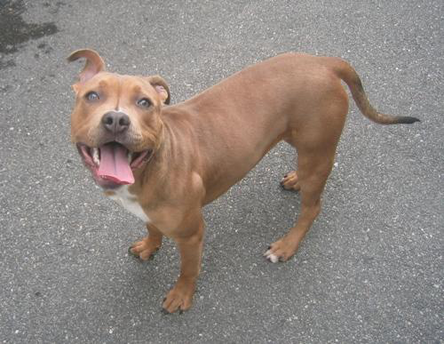

This is how jupyter displays the original .jpg image. Note that size is
given as (width, height).<br> Let’s look at a single pixel:

``` python
r, g, b = dog.getpixel((0, 0))
print(r,g,b)
```

    90 95 98

The pixel at position \[0,0\] (upper left) of the source image has an
rgb value of (90,95,98). This corresponds to
<font style="background-color:rgb(90,95,98)">this color </font><br>
Great! Now let’s look at some specific transformations. \###
<a href='https://pytorch.org/docs/stable/torchvision/transforms.html#torchvision.transforms.ToTensor'><tt>transforms.ToTensor()</tt></a>
Converts a PIL Image or numpy.ndarray (HxWxC) in the range \[0, 255\] to
a <tt>torch.FloatTensor</tt> of shape (CxHxW) in the range \[0.0, 1.0\]

``` python
transform = transforms.Compose([
    transforms.ToTensor()
])
im = transform(dog)
print(im.shape)
plt.imshow(np.transpose(im.numpy(), (1, 2, 0)));
```

    torch.Size([3, 387, 500])

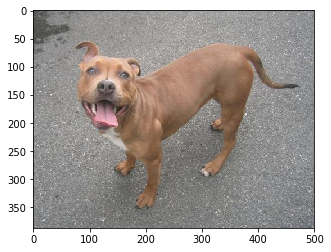

This is the same image converted to a tensor and displayed using
matplotlib. Note that the torch dimensions follow \[channel, height,
width\]<br><br> PyTorch automatically loads the \[0,255\] pixel channels
to \[0,1\]:<br><br>
$\frac{90}{255}=0.3529\quad\frac{95}{255}=0.3725\quad\frac{98}{255}=0.3843$

``` python
im[:,0,0]
```

    tensor([0.3529, 0.3725, 0.3843])

### <a href='https://pytorch.org/docs/stable/torchvision/transforms.html#torchvision.transforms.Resize'><tt>transforms.Resize(<em>size</em>)</tt></a>

If size is a sequence like (h, w), the output size will be matched to
this. If size is an integer, the smaller edge of the image will be
matched to this number.<br>i.e, if height \> width, then the image will
be rescaled to (size \* height / width, size)

``` python
transform = transforms.Compose([
    transforms.Resize(224), 
    transforms.ToTensor()
])
im = transform(dog)
print(im.shape)
plt.imshow(np.transpose(im.numpy(), (1, 2, 0)));
```

    torch.Size([3, 224, 289])

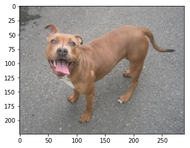

This resized the shortest side, and scaled the other. Let’s try this on
a small image.

``` python
small_dog = Image.open('../Data/CATS_DOGS/train/DOG/11.jpg')
print(small_dog.size)
display(small_dog)
```

    (135, 102)

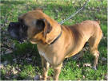

``` python
im = transform(small_dog)
print(im.shape)
plt.imshow(np.transpose(im.numpy(), (1, 2, 0)));
```

    torch.Size([3, 224, 296])

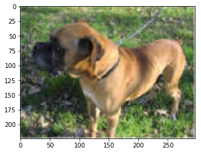

### <a href='https://pytorch.org/docs/stable/torchvision/transforms.html#torchvision.transforms.CenterCrop'><tt>transforms.CenterCrop(<em>size</em>)</tt></a>

If size is an integer instead of sequence like (h, w), a square crop of
(size, size) is made.

``` python
transform = transforms.Compose([
    transforms.CenterCrop(224), 
    transforms.ToTensor()
])
im = transform(dog) # this crops the original image
print(im.shape)
plt.imshow(np.transpose(im.numpy(), (1, 2, 0)));
```

    torch.Size([3, 224, 224])

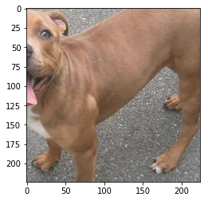

It may be better to resize the image first, then crop:

``` python
transform = transforms.Compose([
    transforms.Resize(224),
    transforms.CenterCrop(224), 
    transforms.ToTensor()
])
im = transform(dog)
print(im.shape)
plt.imshow(np.transpose(im.numpy(), (1, 2, 0)));
```

    torch.Size([3, 224, 224])

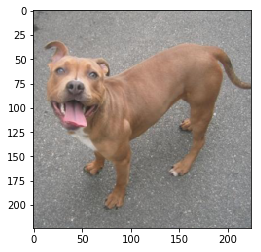

## Other affine transformations

An
<a href='https://en.wikipedia.org/wiki/Affine_transformation'><em>affine</em></a>
transformation is one that preserves points and straight lines. Examples
include rotation, reflection, and scaling. For instance, we can double
the effective size of our training set simply by flipping the images.
\###
<a href='https://pytorch.org/docs/stable/torchvision/transforms.html#torchvision.transforms.RandomHorizontalFlip'><tt>transforms.RandomHorizontalFlip(<em>p=0.5</em>)</tt></a>
Horizontally flip the given PIL image randomly with a given probability.

``` python
transform = transforms.Compose([
    transforms.RandomHorizontalFlip(p=1),  # normally we'd set p=0.5
    transforms.ToTensor()
])
im = transform(dog)
print(im.shape)
plt.imshow(np.transpose(im.numpy(), (1, 2, 0)));
```

    torch.Size([3, 387, 500])

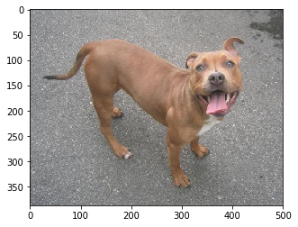

### <a href='https://pytorch.org/docs/stable/torchvision/transforms.html#torchvision.transforms.RandomRotation'><tt>transforms.RandomRotation(<em>degrees</em>)</tt></a>

If degrees is a number instead of sequence like (min, max), the range of
degrees will be (-degrees, +degrees).<br> Run the cell below several
times to see a sample of rotations.

``` python
transform = transforms.Compose([
    transforms.RandomRotation(30),  # rotate randomly between +/- 30 degrees
    transforms.ToTensor()
])
im = transform(dog)
print(im.shape)
plt.imshow(np.transpose(im.numpy(), (1, 2, 0)));
```

    torch.Size([3, 387, 500])

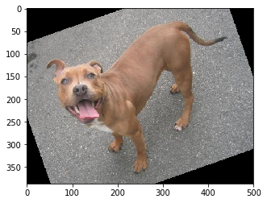

### Scaling is done using <a href='https://pytorch.org/docs/stable/torchvision/transforms.html#torchvision.transforms.Resize'><tt>transforms.Resize(<em>size</em>)</tt></a>

``` python
transform = transforms.Compose([
    transforms.Resize((224,224)),  # be sure to pass in a list or a tuple
    transforms.ToTensor()
])
im = transform(dog)
print(im.shape)
plt.imshow(np.transpose(im.numpy(), (1, 2, 0)));
```

    torch.Size([3, 224, 224])

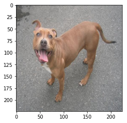

## Let’s put it all together

``` python
transform = transforms.Compose([
    transforms.RandomHorizontalFlip(p=1),  # normally we'd set p=0.5
    transforms.RandomRotation(30),
    transforms.Resize(224),
    transforms.CenterCrop(224), 
    transforms.ToTensor()
])
im = transform(dog)
print(im.shape)
plt.imshow(np.transpose(im.numpy(), (1, 2, 0)));
```

    torch.Size([3, 224, 224])

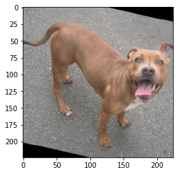

------------------------------------------------------------------------

## Normalization

Once the image has been loaded into a tensor, we can perform
normalization on it. This serves to make convergence happen quicker
during training. The values are somewhat arbitrary - you can use a mean
of 0.5 and a standard deviation of 0.5 to convert a range of \[0,1\] to
\[-1,1\], for example.<br>However,
<a href='https://discuss.pytorch.org/t/normalization-in-the-mnist-example/457/22'>research
has shown</a> that mean=\[0.485, 0.456, 0.406\] and std=\[0.229, 0.224,
0.225\] work well in practice.

### <a href='https://pytorch.org/docs/stable/torchvision/transforms.html#torchvision.transforms.Normalize'><tt>transforms.Normalize(<em>mean, std</em>)</tt></a>

Given mean: (M1,…,Mn) and std: (S1,..,Sn) for n channels, this transform
will normalize each channel of the input tensor \###
$\quad\textrm {input[channel]} = \frac{\textrm{input[channel] - mean[channel]}}{\textrm {std[channel]}}$

``` python
transform = transforms.Compose([
    transforms.ToTensor(),
    transforms.Normalize([0.485, 0.456, 0.406],
                         [0.229, 0.224, 0.225])
])
im = transform(dog)
print(im.shape)
plt.imshow(np.transpose(im.numpy(), (1, 2, 0)));
```

    Clipping input data to the valid range for imshow with RGB data ([0..1] for floats or [0..255] for integers).

    torch.Size([3, 387, 500])

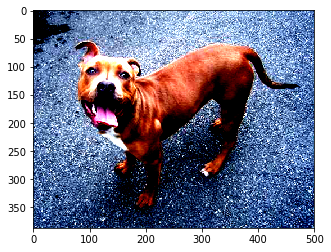

Recall that before normalization, the upper-leftmost tensor had pixel
values of <tt>\[0.3529, 0.3725, 0.3843\]</tt>.<br> With normalization we
subtract the channel mean from the input channel, then divide by the
channel std.<br><br>
$\frac{(0.3529-0.485)}{0.229}=-0.5767\quad\frac{(0.3725-0.456)}{0.224}=-0.3725\quad\frac{(0.3843-0.406)}{0.225}=-0.0964$<br>

``` python
# After normalization:
im[:,0,0]
```

    tensor([-0.5767, -0.3725, -0.0964])

When displayed, matplotlib clipped this particular pixel up to \[0,0,0\]
so it appears black on the screen. However, the appearance isn’t
important; the goal of normalization is improved mathematical
performance.

### Optional: De-normalize the images

To see the image back in its true colors, we can apply an
inverse-transform to the tensor being displayed.

``` python
inv_normalize = transforms.Normalize(
    mean=[-0.485/0.229, -0.456/0.224, -0.406/0.225],
    std=[1/0.229, 1/0.224, 1/0.225]
)
im_inv = inv_normalize(im)
plt.figure(figsize=(12,4))
plt.imshow(np.transpose(im_inv.numpy(), (1, 2, 0)));
```

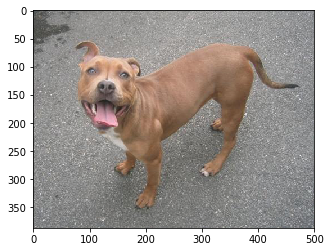

Note that the original tensor was not modified:

``` python
plt.figure(figsize=(12,4))
plt.imshow(np.transpose(im.numpy(), (1, 2, 0)));
```

    Clipping input data to the valid range for imshow with RGB data ([0..1] for floats or [0..255] for integers).


## Up next: performing CNN on real images!

<center>

<a href=''>  </a>

</center>
<center>
<em>Copyright Qalmaqihir</em>
</center>
<center>
<em>For more information, visit us at
<a href='http://www.github.com/qalmaqihir/'>www.github.com/qalmaqihir/</a></em>
</center>
