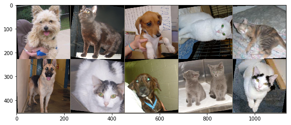
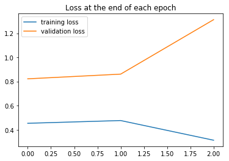
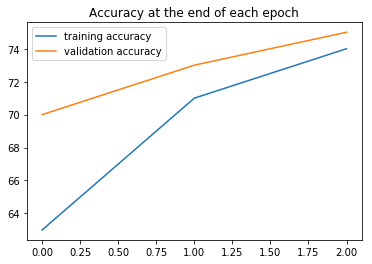
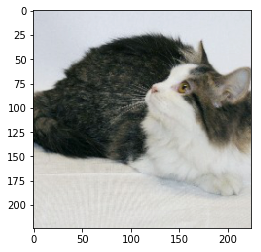

PyTorch BootCamp - Convolutional Neural Networks
================
by Jawad Haider

- <a href="#cnn-on-custom-images" id="toc-cnn-on-custom-images">CNN on
  Custom Images</a>
  - <a href="#image-files-directory-tree"
    id="toc-image-files-directory-tree">Image files directory tree</a>
  - <a href="#perform-standard-imports"
    id="toc-perform-standard-imports">Perform standard imports</a>
  - <a href="#define-transforms" id="toc-define-transforms">Define
    transforms</a>
  - <a href="#prepare-train-and-test-sets-loaders"
    id="toc-prepare-train-and-test-sets-loaders">Prepare train and test
    sets, loaders</a>
  - <a href="#display-a-batch-of-images"
    id="toc-display-a-batch-of-images">Display a batch of images</a>
  - <a href="#define-the-model" id="toc-define-the-model">Define the
    model</a>
    - <a href="#instantiate-the-model-define-loss-and-optimization-functions"
      id="toc-instantiate-the-model-define-loss-and-optimization-functions">Instantiate
      the model, define loss and optimization functions</a>
    - <a href="#looking-at-the-trainable-parameters"
      id="toc-looking-at-the-trainable-parameters">Looking at the trainable
      parameters</a>
  - <a href="#train-the-model" id="toc-train-the-model">Train the model</a>
  - <a href="#save-the-trained-model" id="toc-save-the-trained-model">Save
    the trained model</a>
  - <a href="#evaluate-model-performance"
    id="toc-evaluate-model-performance">Evaluate model performance</a>
  - <a href="#download-a-pretrained-model"
    id="toc-download-a-pretrained-model">Download a pretrained model</a>
  - <a href="#freeze-feature-parameters"
    id="toc-freeze-feature-parameters">Freeze feature parameters</a>
  - <a href="#modify-the-classifier" id="toc-modify-the-classifier">Modify
    the classifier</a>
  - <a href="#define-loss-function-optimizer"
    id="toc-define-loss-function-optimizer">Define loss function &amp;
    optimizer</a>
  - <a href="#train-the-model-1" id="toc-train-the-model-1">Train the
    model</a>
  - <a href="#run-a-new-image-through-the-model"
    id="toc-run-a-new-image-through-the-model">Run a new image through the
    model</a>
  - <a href="#great-job" id="toc-great-job">Great job!</a>

# CNN on Custom Images

For this exercise we’re using a collection of Cats and Dogs images
inspired by the classic
<a href='https://www.kaggle.com/c/dogs-vs-cats'>Kaggle competition</a>.

In the last section we downloaded the files, looked at the directory
structure, examined the images, and performed a variety of transforms in
preparation for training.

In this section we’ll define our model, then feed images through a
training and validation sequence using DataLoader.

### Image files directory tree

<pre>.
└── Data
    └── CATS_DOGS
        ├── test
        │   ├── CAT
        │   │   ├── 9374.jpg
        │   │   ├── 9375.jpg
        │   │   └── ... (3,126 files)
        │   └── DOG
        │       ├── 9374.jpg
        │       ├── 9375.jpg
        │       └── ... (3,125 files)       
        │           
        └── train
            ├── CAT
            │   ├── 0.jpg
            │   ├── 1.jpg
            │   └── ... (9,371 files)
            └── DOG
                ├── 0.jpg
                ├── 1.jpg
                └── ... (9,372 files)</pre>

## Perform standard imports

``` python
import torch
import torch.nn as nn
import torch.nn.functional as F
from torch.utils.data import DataLoader
from torchvision import datasets, transforms, models # add models to the list
from torchvision.utils import make_grid
import os

import numpy as np
import pandas as pd
import matplotlib.pyplot as plt
%matplotlib inline

# ignore harmless warnings
import warnings
warnings.filterwarnings("ignore")
```

## Define transforms

In the previous section we looked at a variety of transforms available
for data augmentation (rotate, flip, etc.) and normalization.<br> Here
we’ll combine the ones we want, including the
<a href='https://discuss.pytorch.org/t/normalization-in-the-mnist-example/457/22'>recommended
normalization parameters</a> for mean and std per channel.

``` python
train_transform = transforms.Compose([
        transforms.RandomRotation(10),      # rotate +/- 10 degrees
        transforms.RandomHorizontalFlip(),  # reverse 50% of images
        transforms.Resize(224),             # resize shortest side to 224 pixels
        transforms.CenterCrop(224),         # crop longest side to 224 pixels at center
        transforms.ToTensor(),
        transforms.Normalize([0.485, 0.456, 0.406],
                             [0.229, 0.224, 0.225])
    ])

test_transform = transforms.Compose([
        transforms.Resize(224),
        transforms.CenterCrop(224),
        transforms.ToTensor(),
        transforms.Normalize([0.485, 0.456, 0.406],
                             [0.229, 0.224, 0.225])
    ])
```

## Prepare train and test sets, loaders

We’re going to take advantage of a built-in torchvision dataset tool
called
<a href='https://pytorch.org/docs/stable/torchvision/datasets.html#imagefolder'><tt><strong>ImageFolder</strong></tt></a>.

``` python
root = '../Data/CATS_DOGS'

train_data = datasets.ImageFolder(os.path.join(root, 'train'), transform=train_transform)
test_data = datasets.ImageFolder(os.path.join(root, 'test'), transform=test_transform)

torch.manual_seed(42)
train_loader = DataLoader(train_data, batch_size=10, shuffle=True)
test_loader = DataLoader(test_data, batch_size=10, shuffle=True)

class_names = train_data.classes

print(class_names)
print(f'Training images available: {len(train_data)}')
print(f'Testing images available:  {len(test_data)}')
```

    ['CAT', 'DOG']
    Training images available: 18743
    Testing images available:  6251

## Display a batch of images

To verify that the training loader selects cat and dog images at random,
let’s show a batch of loaded images.<br> Recall that imshow clips pixel
values \<0, so the resulting display lacks contrast. We’ll apply a quick
inverse transform to the input tensor so that images show their “true”
colors.

``` python
# Grab the first batch of 10 images
for images,labels in train_loader: 
    break

# Print the labels
print('Label:', labels.numpy())
print('Class:', *np.array([class_names[i] for i in labels]))

im = make_grid(images, nrow=5)  # the default nrow is 8

# Inverse normalize the images
inv_normalize = transforms.Normalize(
    mean=[-0.485/0.229, -0.456/0.224, -0.406/0.225],
    std=[1/0.229, 1/0.224, 1/0.225]
)
im_inv = inv_normalize(im)

# Print the images
plt.figure(figsize=(12,4))
plt.imshow(np.transpose(im_inv.numpy(), (1, 2, 0)));
```

    Label: [1 0 1 0 0 1 0 1 0 0]
    Class: DOG CAT DOG CAT CAT DOG CAT DOG CAT CAT



## Define the model

We’ll start by using a model similar to the one we applied to the
CIFAR-10 dataset, except that here we have a binary classification (2
output channels, not 10). Also, we’ll add another set of
convolution/pooling layers.

``` python
class ConvolutionalNetwork(nn.Module):
    def __init__(self):
        super().__init__()
        self.conv1 = nn.Conv2d(3, 6, 3, 1)
        self.conv2 = nn.Conv2d(6, 16, 3, 1)
        self.fc1 = nn.Linear(54*54*16, 120)
        self.fc2 = nn.Linear(120, 84)
        self.fc3 = nn.Linear(84, 2)

    def forward(self, X):
        X = F.relu(self.conv1(X))
        X = F.max_pool2d(X, 2, 2)
        X = F.relu(self.conv2(X))
        X = F.max_pool2d(X, 2, 2)
        X = X.view(-1, 54*54*16)
        X = F.relu(self.fc1(X))
        X = F.relu(self.fc2(X))
        X = self.fc3(X)
        return F.log_softmax(X, dim=1)
```

<div class="alert alert-info">

<strong>Why <tt>(54x54x16)</tt>?</strong><br> With 224 pixels per side,
the kernels and pooling layers result in $\;(((224-2)/2)-2)/2 = 54.5\;$
which rounds down to 54 pixels per side.

</div>

### Instantiate the model, define loss and optimization functions

We’re going to call our model “CNNmodel” to differentiate it from an
“AlexNetmodel” we’ll use later.

``` python
torch.manual_seed(101)
CNNmodel = ConvolutionalNetwork()
criterion = nn.CrossEntropyLoss()
optimizer = torch.optim.Adam(CNNmodel.parameters(), lr=0.001)
CNNmodel
```

    ConvolutionalNetwork(
      (conv1): Conv2d(3, 6, kernel_size=(3, 3), stride=(1, 1))
      (conv2): Conv2d(6, 16, kernel_size=(3, 3), stride=(1, 1))
      (fc1): Linear(in_features=46656, out_features=120, bias=True)
      (fc2): Linear(in_features=120, out_features=84, bias=True)
      (fc3): Linear(in_features=84, out_features=2, bias=True)
    )

### Looking at the trainable parameters

``` python
def count_parameters(model):
    params = [p.numel() for p in model.parameters() if p.requires_grad]
    for item in params:
        print(f'{item:>8}')
    print(f'________\n{sum(params):>8}')
```

``` python
count_parameters(CNNmodel)
```

         162
           6
         864
          16
     5598720
         120
       10080
          84
         168
           2
    ________
     5610222

## Train the model

In the interests of time, we’ll limit the number of training batches to
800, and the number of testing batches to 300. We’ll train the model on
8000 of 18743 available images, and test it on 3000 out of 6251 images.

``` python
import time
start_time = time.time()

epochs = 3

max_trn_batch = 800
max_tst_batch = 300

train_losses = []
test_losses = []
train_correct = []
test_correct = []

for i in range(epochs):
    trn_corr = 0
    tst_corr = 0
    
    # Run the training batches
    for b, (X_train, y_train) in enumerate(train_loader):
        
        # Limit the number of batches
        if b == max_trn_batch:
            break
        b+=1
        
        # Apply the model
        y_pred = CNNmodel(X_train)
        loss = criterion(y_pred, y_train)
 
        # Tally the number of correct predictions
        predicted = torch.max(y_pred.data, 1)[1]
        batch_corr = (predicted == y_train).sum()
        trn_corr += batch_corr
        
        # Update parameters
        optimizer.zero_grad()
        loss.backward()
        optimizer.step()

        # Print interim results
        if b%200 == 0:
            print(f'epoch: {i:2}  batch: {b:4} [{10*b:6}/8000]  loss: {loss.item():10.8f}  \
accuracy: {trn_corr.item()*100/(10*b):7.3f}%')

    train_losses.append(loss)
    train_correct.append(trn_corr)

    # Run the testing batches
    with torch.no_grad():
        for b, (X_test, y_test) in enumerate(test_loader):
            # Limit the number of batches
            if b == max_tst_batch:
                break

            # Apply the model
            y_val = CNNmodel(X_test)

            # Tally the number of correct predictions
            predicted = torch.max(y_val.data, 1)[1] 
            tst_corr += (predicted == y_test).sum()

    loss = criterion(y_val, y_test)
    test_losses.append(loss)
    test_correct.append(tst_corr)

print(f'\nDuration: {time.time() - start_time:.0f} seconds') # print the time elapsed
```

    epoch:  0  batch:  200 [  2000/8000]  loss: 0.73729956  accuracy:  57.150%
    epoch:  0  batch:  400 [  4000/8000]  loss: 0.69267005  accuracy:  59.100%
    epoch:  0  batch:  600 [  6000/8000]  loss: 0.64823747  accuracy:  61.067%
    epoch:  0  batch:  800 [  8000/8000]  loss: 0.45315751  accuracy:  63.200%
    epoch:  1  batch:  200 [  2000/8000]  loss: 0.57837021  accuracy:  69.450%
    epoch:  1  batch:  400 [  4000/8000]  loss: 0.65500635  accuracy:  69.700%
    epoch:  1  batch:  600 [  6000/8000]  loss: 0.85159266  accuracy:  70.433%
    epoch:  1  batch:  800 [  8000/8000]  loss: 0.47595224  accuracy:  71.025%
    epoch:  2  batch:  200 [  2000/8000]  loss: 0.68083632  accuracy:  74.500%
    epoch:  2  batch:  400 [  4000/8000]  loss: 0.32654241  accuracy:  74.025%
    epoch:  2  batch:  600 [  6000/8000]  loss: 0.52883595  accuracy:  74.467%
    epoch:  2  batch:  800 [  8000/8000]  loss: 0.31269351  accuracy:  74.950%

    Duration: 1142 seconds

## Save the trained model

``` python
torch.save(CNNmodel.state_dict(), 'CustomImageCNNModel.pt')
```

## Evaluate model performance

``` python
plt.plot(train_losses, label='training loss')
plt.plot(test_losses, label='validation loss')
plt.title('Loss at the end of each epoch')
plt.legend();
```



``` python
plt.plot([t/80 for t in train_correct], label='training accuracy')
plt.plot([t/30 for t in test_correct], label='validation accuracy')
plt.title('Accuracy at the end of each epoch')
plt.legend();
```



``` python
print(test_correct)
print(f'Test accuracy: {test_correct[-1].item()*100/3000:.3f}%')
```

    [tensor(2109), tensor(2195), tensor(2254)]
    Test accuracy: 75.133%

## Download a pretrained model

Torchvision has a number of proven models available through
<a href='https://pytorch.org/docs/stable/torchvision/models.html#classification'><tt><strong>torchvision.models</strong></tt></a>:
<ul>
<li>
<a href="https://arxiv.org/abs/1404.5997">AlexNet</a>
</li>
<li>
<a href="https://arxiv.org/abs/1409.1556">VGG</a>
</li>
<li>
<a href="https://arxiv.org/abs/1512.03385">ResNet</a>
</li>
<li>
<a href="https://arxiv.org/abs/1602.07360">SqueezeNet</a>
</li>
<li>
<a href="https://arxiv.org/abs/1608.06993">DenseNet</a>
</li>
<li>
<a href="https://arxiv.org/abs/1512.00567">Inception</a>
</li>
<li>
<a href="https://arxiv.org/abs/1409.4842">GoogLeNet</a>
</li>
<li>
<a href="https://arxiv.org/abs/1807.11164">ShuffleNet</a>
</li>
<li>
<a href="https://arxiv.org/abs/1801.04381">MobileNet</a>
</li>
<li>
<a href="https://arxiv.org/abs/1611.05431">ResNeXt</a>
</li>
</ul>

These have all been trained on the
<a href='http://www.image-net.org/'>ImageNet</a> database of images. Our
only task is to reduce the output of the fully connected layers from
(typically) 1000 categories to just 2.

To access the models, you can construct a model with random weights by
calling its constructor:<br>
<pre>resnet18 = models.resnet18()</pre>
You can also obtain a pre-trained model by passing pretrained=True:<br>
<pre>resnet18 = models.resnet18(pretrained=True)</pre>

All pre-trained models expect input images normalized in the same way,
i.e. mini-batches of 3-channel RGB images of shape (3 x H x W), where H
and W are expected to be at least 224. The images have to be loaded in
to a range of \[0, 1\] and then normalized using mean = \[0.485, 0.456,
0.406\] and std = \[0.229, 0.224, 0.225\].

Feel free to investigate the different models available. Each one will
be downloaded to a cache directory the first time they’re accessed -
from then on they’ll be available locally.

For its simplicity and effectiveness, we’ll use AlexNet:

``` python
AlexNetmodel = models.alexnet(pretrained=True)
AlexNetmodel
```

    AlexNet(
      (features): Sequential(
        (0): Conv2d(3, 64, kernel_size=(11, 11), stride=(4, 4), padding=(2, 2))
        (1): ReLU(inplace)
        (2): MaxPool2d(kernel_size=3, stride=2, padding=0, dilation=1, ceil_mode=False)
        (3): Conv2d(64, 192, kernel_size=(5, 5), stride=(1, 1), padding=(2, 2))
        (4): ReLU(inplace)
        (5): MaxPool2d(kernel_size=3, stride=2, padding=0, dilation=1, ceil_mode=False)
        (6): Conv2d(192, 384, kernel_size=(3, 3), stride=(1, 1), padding=(1, 1))
        (7): ReLU(inplace)
        (8): Conv2d(384, 256, kernel_size=(3, 3), stride=(1, 1), padding=(1, 1))
        (9): ReLU(inplace)
        (10): Conv2d(256, 256, kernel_size=(3, 3), stride=(1, 1), padding=(1, 1))
        (11): ReLU(inplace)
        (12): MaxPool2d(kernel_size=3, stride=2, padding=0, dilation=1, ceil_mode=False)
      )
      (avgpool): AdaptiveAvgPool2d(output_size=(6, 6))
      (classifier): Sequential(
        (0): Dropout(p=0.5)
        (1): Linear(in_features=9216, out_features=4096, bias=True)
        (2): ReLU(inplace)
        (3): Dropout(p=0.5)
        (4): Linear(in_features=4096, out_features=4096, bias=True)
        (5): ReLU(inplace)
        (6): Linear(in_features=4096, out_features=1000, bias=True)
      )
    )

<div class="alert alert-info">

This model uses
<a href='https://pytorch.org/docs/master/nn.html#torch.nn.AdaptiveAvgPool2d'><tt><strong>torch.nn.AdaptiveAvgPool2d(<em>output_size</em>)</strong></tt></a>
to convert the large matrix coming out of the convolutional layers to a
(6x6)x256 matrix being fed into the fully connected layers.

</div>

## Freeze feature parameters

We want to freeze the pre-trained weights & biases. We set
<tt>.requires_grad</tt> to False so we don’t backprop through them.

``` python
for param in AlexNetmodel.parameters():
    param.requires_grad = False
```

## Modify the classifier

Next we need to modify the fully connected layers to produce a binary
output. The section is labeled “classifier” in the AlexNet model.<br>
Note that when we assign new layers, their parameters default to
<tt>.requires_grad=True</tt>.

``` python
torch.manual_seed(42)
AlexNetmodel.classifier = nn.Sequential(nn.Linear(9216, 1024),
                                 nn.ReLU(),
                                 nn.Dropout(0.4),
                                 nn.Linear(1024, 2),
                                 nn.LogSoftmax(dim=1))
AlexNetmodel
```

    AlexNet(
      (features): Sequential(
        (0): Conv2d(3, 64, kernel_size=(11, 11), stride=(4, 4), padding=(2, 2))
        (1): ReLU(inplace)
        (2): MaxPool2d(kernel_size=3, stride=2, padding=0, dilation=1, ceil_mode=False)
        (3): Conv2d(64, 192, kernel_size=(5, 5), stride=(1, 1), padding=(2, 2))
        (4): ReLU(inplace)
        (5): MaxPool2d(kernel_size=3, stride=2, padding=0, dilation=1, ceil_mode=False)
        (6): Conv2d(192, 384, kernel_size=(3, 3), stride=(1, 1), padding=(1, 1))
        (7): ReLU(inplace)
        (8): Conv2d(384, 256, kernel_size=(3, 3), stride=(1, 1), padding=(1, 1))
        (9): ReLU(inplace)
        (10): Conv2d(256, 256, kernel_size=(3, 3), stride=(1, 1), padding=(1, 1))
        (11): ReLU(inplace)
        (12): MaxPool2d(kernel_size=3, stride=2, padding=0, dilation=1, ceil_mode=False)
      )
      (avgpool): AdaptiveAvgPool2d(output_size=(6, 6))
      (classifier): Sequential(
        (0): Linear(in_features=9216, out_features=1024, bias=True)
        (1): ReLU()
        (2): Dropout(p=0.4)
        (3): Linear(in_features=1024, out_features=2, bias=True)
        (4): LogSoftmax()
      )
    )

``` python
# These are the TRAINABLE parameters:
count_parameters(AlexNetmodel)
```

     9437184
        1024
        2048
           2
    ________
     9440258

## Define loss function & optimizer

We only want to optimize the classifier parameters, as the feature
parameters are frozen.

``` python
criterion = nn.CrossEntropyLoss()
optimizer = torch.optim.Adam(AlexNetmodel.classifier.parameters(), lr=0.001)
```

## Train the model

Remember, we’re only training the fully connected layers. The
convolutional layers have fixed weights and biases. For this reason, we
only need to run one epoch.

``` python
import time
start_time = time.time()

epochs = 1

max_trn_batch = 800
max_tst_batch = 300

train_losses = []
test_losses = []
train_correct = []
test_correct = []

for i in range(epochs):
    trn_corr = 0
    tst_corr = 0
    
    # Run the training batches
    for b, (X_train, y_train) in enumerate(train_loader):
        if b == max_trn_batch:
            break
        b+=1
        
        # Apply the model
        y_pred = AlexNetmodel(X_train)
        loss = criterion(y_pred, y_train)
 
        # Tally the number of correct predictions
        predicted = torch.max(y_pred.data, 1)[1]
        batch_corr = (predicted == y_train).sum()
        trn_corr += batch_corr
        
        # Update parameters
        optimizer.zero_grad()
        loss.backward()
        optimizer.step()

        # Print interim results
        if b%200 == 0:
            print(f'epoch: {i:2}  batch: {b:4} [{10*b:6}/8000]  loss: {loss.item():10.8f}  \
accuracy: {trn_corr.item()*100/(10*b):7.3f}%')

    train_losses.append(loss)
    train_correct.append(trn_corr)

    # Run the testing batches
    with torch.no_grad():
        for b, (X_test, y_test) in enumerate(test_loader):
            if b == max_tst_batch:
                break

            # Apply the model
            y_val = AlexNetmodel(X_test)

            # Tally the number of correct predictions
            predicted = torch.max(y_val.data, 1)[1] 
            tst_corr += (predicted == y_test).sum()

    loss = criterion(y_val, y_test)
    test_losses.append(loss)
    test_correct.append(tst_corr)

print(f'\nDuration: {time.time() - start_time:.0f} seconds') # print the time elapsed
```

    epoch:  0  batch:  200 [  2000/8000]  loss: 0.01413172  accuracy:  88.900%
    epoch:  0  batch:  400 [  4000/8000]  loss: 0.24275371  accuracy:  90.825%
    epoch:  0  batch:  600 [  6000/8000]  loss: 0.09340305  accuracy:  91.900%
    epoch:  0  batch:  800 [  8000/8000]  loss: 0.07545806  accuracy:  92.250%

    Duration: 513 seconds

``` python
print(test_correct)
print(f'Test accuracy: {test_correct[-1].item()*100/3000:.3f}%')
```

    [tensor(2810)]
    Test accuracy: 93.667%

## Run a new image through the model

We can also pass a single image through the model to obtain a
prediction.<br> Pick a number from 0 to 6250, assign it to “x”, and
we’ll use that value to select an image from the Cats and Dogs test set.

``` python
x = 2019
im = inv_normalize(test_data[x][0])
plt.imshow(np.transpose(im.numpy(), (1, 2, 0)));
```



``` python
test_data[x][0].shape
```

    torch.Size([3, 224, 224])

``` python
# CNN Model Prediction:

CNNmodel.eval()
with torch.no_grad():
    new_pred = CNNmodel(test_data[x][0].view(1,3,224,224)).argmax()
print(f'Predicted value: {new_pred.item()} {class_names[new_pred.item()]}')
```

    Predicted value: 1 DOG

``` python
# AlexNet Model Prediction:

AlexNetmodel.eval()
with torch.no_grad():
    new_pred = AlexNetmodel(test_data[x][0].view(1,3,224,224)).argmax()
print(f'Predicted value: {new_pred.item()} {class_names[new_pred.item()]}')
```

    Predicted value: 0 CAT

## Great job!

<center>

<a href=''>  </a>

</center>
<center>
<em>Copyright Qalmaqihir</em>
</center>
<center>
<em>For more information, visit us at
<a href='http://www.github.com/qalmaqihir/'>www.github.com/qalmaqihir/</a></em>
</center>
