PyTorch BootCamp - Recurrent Neural Networks
================
by Jawad Haider

- <a href="#basic-rnn---recurrent-neural-networks"
  id="toc-basic-rnn---recurrent-neural-networks">Basic RNN - Recurrent
  Neural Networks</a>
  - <a href="#advantages-of-an-lstm"
    id="toc-advantages-of-an-lstm">Advantages of an LSTM</a>
  - <a href="#perform-standard-imports"
    id="toc-perform-standard-imports">Perform standard imports</a>
  - <a href="#create-a-sine-wave-dataset"
    id="toc-create-a-sine-wave-dataset">Create a sine wave dataset</a>
  - <a href="#create-train-and-test-sets"
    id="toc-create-train-and-test-sets">Create train and test sets</a>
  - <a href="#prepare-the-training-data"
    id="toc-prepare-the-training-data">Prepare the training data</a>
  - <a href="#define-an-lstm-model" id="toc-define-an-lstm-model">Define an
    LSTM model</a>
  - <a href="#instantiate-the-model-define-loss-optimization-functions"
    id="toc-instantiate-the-model-define-loss-optimization-functions">Instantiate
    the model, define loss &amp; optimization functions</a>
  - <a href="#predicting-future-values"
    id="toc-predicting-future-values">Predicting future values</a>
  - <a href="#train-and-simultaneously-evaluate-the-model"
    id="toc-train-and-simultaneously-evaluate-the-model">Train and
    simultaneously evaluate the model</a>
- <a href="#forecasting-into-an-unknown-future"
  id="toc-forecasting-into-an-unknown-future">Forecasting into an unknown
  future</a>
  - <a href="#train-the-model" id="toc-train-the-model">Train the model</a>
  - <a href="#predict-future-values-plot-the-result"
    id="toc-predict-future-values-plot-the-result">Predict future values,
    plot the result</a>
  - <a href="#great-job" id="toc-great-job">Great job!</a>

# Basic RNN - Recurrent Neural Networks

Up to now we’ve used neural networks to classify static images. What
happens when the thing we’re trying to explain changes over time? What
if a predicted value depends on a series of past behaviors?

We can train networks to tell us that an image contains a car.<br>

How do we answer the question “Is the car moving? Where will it be a
minute from now?”

This challenge of incorporating a series of measurements over time into
the model parameters is addressed by
<a href='https://en.wikipedia.org/wiki/Recurrent_neural_network'>Recurrent
Neural Networks</a> (RNNs).

Be sure to watch the theory lectures. You should be comfortable with: \*
conditional memory \* deep sequence modeling \* vanishing gradients \*
gated cells \* long short-term memory (LSTM) cells

PyTorch offers a number of RNN layers and options.<br> \*
<a href='https://pytorch.org/docs/stable/nn.html#rnn'><tt><strong>torch.nn.RNN()</strong></tt></a>
provides a basic model which applies a multilayer RNN with either
<em>tanh</em> or <em>ReLU</em> non-linearity functions to an input
sequence.<br> As we learned in the theory lectures, however, this has
its limits.<br><br> \*
<a href='https://pytorch.org/docs/stable/nn.html#lstm'><tt><strong>torch.nn.LSTM()</strong></tt></a>
adds a multi-layer long short-term memory (LSTM) process which greatly
extends the memory of the RNN.

## Advantages of an LSTM

For each element in the input sequence, an LSTM layer computes the
following functions:<br>
$\begin{array}{ll} \\  i_t = \sigma(W_{ii} x_t + b_{ii} + W_{hi} h_{(t-1)} + b_{hi}) \\  f_t = \sigma(W_{if} x_t + b_{if} + W_{hf} h_{(t-1)} + b_{hf}) \\  g_t = \tanh(W_{ig} x_t + b_{ig} + W_{hg} h_{(t-1)} + b_{hg}) \\  o_t = \sigma(W_{io} x_t + b_{io} + W_{ho} h_{(t-1)} + b_{ho}) \\  c_t = f_t * c_{(t-1)} + i_t * g_t \\  h_t = o_t * \tanh(c_t) \\ \end{array}$

where $h_t$ is the hidden state at time $t$, <br> $c_t$ is the cell
state at time $t$, <br> $x_t$ is the input at time $t$, <br> $h_{(t-1)}$
is the hidden state of the layer at time $t-1$ or the initial hidden
state at time $0$, and <br> $i_t, f_t, g_t, o_t$ are the input, forget,
cell, and output gates, respectively.<br> $\sigma$ is the sigmoid
function, and $*$ is the Hadamard product.

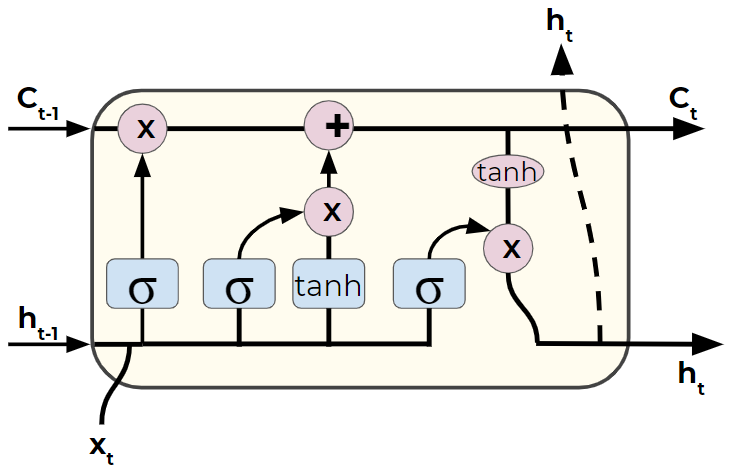

To demonstrate the potential of LSTMs, we’ll look at a simple sine wave.
Our goal is, given a value, predict the next value in the sequence. Due
to the cyclical nature of sine waves, an typical neural network won’t
know if it should predict upward or downward, while an LSTM is capable
of learning patterns of values.

## Perform standard imports

``` python
import torch
import torch.nn as nn

import numpy as np
import pandas as pd
import matplotlib.pyplot as plt
%matplotlib inline
```

## Create a sine wave dataset

For this exercise we’ll look at a simple sine wave. We’ll take 800 data
points and assign 40 points per full cycle, for a total of 20 complete
cycles. We’ll train our model on all but the last cycle, and use that to
evaluate our test predictions.

``` python
# Create & plot data points
x = torch.linspace(0,799,steps=800)
y = torch.sin(x*2*3.1416/40)

plt.figure(figsize=(12,4))
plt.xlim(-10,801)
plt.grid(True)
plt.plot(y.numpy());
```

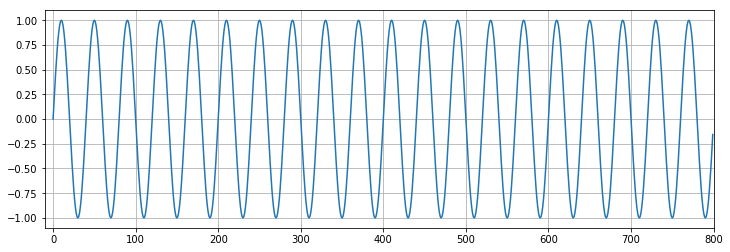

## Create train and test sets

We want to take the first 760 samples in our series as a training
sequence, and the last 40 for testing.

<div class="alert alert-info">

<strong>NOTE:</strong> We tend to use the terms “series” and “sequence”
interchangeably. Usually “series” refers to the entire population of
data, or the full time series, and “sequence” refers to some portion of
it.

</div>

``` python
test_size = 40

train_set = y[:-test_size]
test_set = y[-test_size:]
```

## Prepare the training data

When working with LSTM models, we start by dividing the training
sequence into a series of overlapping “windows”. Each window consists of
a connected string of samples. The label used for comparison is equal to
the next value in the sequence. In this way our network learns what
value should follow a given pattern of preceding values. Note: although
the LSTM layer produces a prediction for each sample in the window, we
only care about the last one.

For example, say we have a series of 15 records, and a window size of 5.
We feed $[x_1,..,x_5]$ into the model, and compare the prediction to
$x_6$. Then we backprop, update parameters, and feed $[x_2,..,x_6]$ into
the model. We compare the new output to $x_7$ and so forth up to
$[x_{10},..,x_{14}]$.

To simplify matters, we’ll define a function called <tt>input_data</tt>
that builds a list of <tt>(seq, label)</tt> tuples. Windows overlap, so
the first tuple might contain $([x_1,..,x_5],[x_6])$, the second would
have $([x_2,..,x_6],[x_7])$, etc.

Here $k$ is the width of the window. Due to the overlap, we’ll have a
total number of <tt>(seq, label)</tt> tuples equal to
$\textrm{len}(series)-k$

``` python
def input_data(seq,ws):  # ws is the window size
    out = []
    L = len(seq)
    for i in range(L-ws):
        window = seq[i:i+ws]
        label = seq[i+ws:i+ws+1]
        out.append((window,label))
    return out
```

<div class="alert alert-info">

<strong>NOTE:</strong> “Windows” are different from “batches”. In our
example we’ll feed one window into the model at a time, so our batch
size would be 1. If we passed two windows into the model before we
backprop and update weights, our batch size would be 2.

</div>

To train on our sine wave data we’ll use a window size of 40 (one entire
cycle).

``` python
# From above:
# test_size = 40
# train_set = y[:-test_size]
# test_set = y[-test_size:]

window_size = 40

# Create the training dataset of sequence/label tuples:
train_data = input_data(train_set,window_size)

len(train_data) # this should equal 760-40
```

    720

``` python
# Display the first (seq/label) tuple in train_data
train_data[0]
```

    (tensor([ 0.0000e+00,  1.5643e-01,  3.0902e-01,  4.5399e-01,  5.8779e-01,
              7.0711e-01,  8.0902e-01,  8.9101e-01,  9.5106e-01,  9.8769e-01,
              1.0000e+00,  9.8769e-01,  9.5106e-01,  8.9100e-01,  8.0901e-01,
              7.0710e-01,  5.8778e-01,  4.5398e-01,  3.0901e-01,  1.5643e-01,
             -7.2400e-06, -1.5644e-01, -3.0902e-01, -4.5400e-01, -5.8779e-01,
             -7.0711e-01, -8.0902e-01, -8.9101e-01, -9.5106e-01, -9.8769e-01,
             -1.0000e+00, -9.8769e-01, -9.5105e-01, -8.9100e-01, -8.0901e-01,
             -7.0710e-01, -5.8777e-01, -4.5398e-01, -3.0900e-01, -1.5642e-01]),
     tensor([1.4480e-05]))

``` python
torch.set_printoptions(sci_mode=False) # to improve the appearance of tensors
train_data[0]
```

    (tensor([     0.0000,      0.1564,      0.3090,      0.4540,      0.5878,
                  0.7071,      0.8090,      0.8910,      0.9511,      0.9877,
                  1.0000,      0.9877,      0.9511,      0.8910,      0.8090,
                  0.7071,      0.5878,      0.4540,      0.3090,      0.1564,
                 -0.0000,     -0.1564,     -0.3090,     -0.4540,     -0.5878,
                 -0.7071,     -0.8090,     -0.8910,     -0.9511,     -0.9877,
                 -1.0000,     -0.9877,     -0.9511,     -0.8910,     -0.8090,
                 -0.7071,     -0.5878,     -0.4540,     -0.3090,     -0.1564]),
     tensor([    0.0000]))

## Define an LSTM model

Our model will have one LSTM layer with an input size of 1 and a hidden
size of 50, followed by a fully-connected layer to reduce the output to
the prediction size of 1.<br>

<div class="alert alert-info">

<strong>NOTE:</strong> You will often see the terms <em>input_dim</em>
and <em> hidden_dim</em> used in place of <em>input_size</em> and
<em>hidden_size</em>. They mean the same thing. We’ll stick to
<em>input_size</em> and <em>hidden_size</em> to stay consistent with
PyTorch’s built-in keywords.

</div>

During training we pass three tensors through the LSTM layer - the
sequence, the hidden state $h_0$ and the cell state $c_0$.<br>

This means we need to initialize $h_0$ and $c_0$. This can be done with
random values, but we’ll use zeros instead.

``` python
class LSTM(nn.Module):
    def __init__(self, input_size=1, hidden_size=50, out_size=1):
        super().__init__()
        self.hidden_size = hidden_size
        
        # Add an LSTM layer:
        self.lstm = nn.LSTM(input_size,hidden_size)
        
        # Add a fully-connected layer:
        self.linear = nn.Linear(hidden_size,out_size)
        
        # Initialize h0 and c0:
        self.hidden = (torch.zeros(1,1,hidden_size),
                       torch.zeros(1,1,hidden_size))
    
    def forward(self,seq):
        lstm_out, self.hidden = self.lstm(
            seq.view(len(seq), 1, -1), self.hidden)
        pred = self.linear(lstm_out.view(len(seq),-1))
        return pred[-1]   # we only care about the last prediction
```

## Instantiate the model, define loss & optimization functions

Since we’re comparing single values, we’ll use
<a href='https://pytorch.org/docs/stable/nn.html#mseloss'><tt><strong>torch.nn.MSELoss</strong></tt></a><br>Also,
we’ve found that
<a href='https://pytorch.org/docs/stable/optim.html#torch.optim.SGD'><tt><strong>torch.optim.SGD</strong></tt></a>
converges faster for this application than
<a href='https://pytorch.org/docs/stable/optim.html#torch.optim.Adam'><tt><strong>torch.optim.Adam</strong></tt></a>

``` python
torch.manual_seed(42)
model = LSTM()
criterion = nn.MSELoss()
optimizer = torch.optim.SGD(model.parameters(), lr=0.01)

model
```

    LSTM(
      (lstm): LSTM(1, 50)
      (linear): Linear(in_features=50, out_features=1, bias=True)
    )

``` python
def count_parameters(model):
    params = [p.numel() for p in model.parameters() if p.requires_grad]
    for item in params:
        print(f'{item:>6}')
    print(f'______\n{sum(params):>6}')
    
count_parameters(model)
```

       200
     10000
       200
       200
        50
         1
    ______
     10651

## Predicting future values

To show how an LSTM model improves after each epoch, we’ll run
predictions and plot the results. Our goal is to predict the last
sequence of 40 values, and compare them to the known data in our test
set. However, we have to be careful <em>not</em> to use test data in the
predictions - that is, each new prediction derives from previously
predicted values.

The trick is to take the last known window, predict the next value, then
<em>append</em> the predicted value to the sequence and run a new
prediction on a window that includes the value we’ve just predicted.
It’s like adding track in front of the train as it’s
moving.<br><em>Image source:</em>
https://giphy.com/gifs/aardman-cartoon-train-3oz8xtBx06mcZWoNJm<br>


In this way, a well-trained model <em>should</em> follow any regular
trends/cycles in the data.

## Train and simultaneously evaluate the model

We’ll train 10 epochs. For clarity, we’ll “zoom in” on the test set, and
only display from point 700 to the end.

``` python
epochs = 10
future = 40

for i in range(epochs):
    
    # tuple-unpack the train_data set
    for seq, y_train in train_data:
        
        # reset the parameters and hidden states
        optimizer.zero_grad()
        model.hidden = (torch.zeros(1,1,model.hidden_size),
                        torch.zeros(1,1,model.hidden_size))
        
        y_pred = model(seq)
        
        loss = criterion(y_pred, y_train)
        loss.backward()
        optimizer.step()
        
    # print training result
    print(f'Epoch: {i+1:2} Loss: {loss.item():10.8f}')
    
    # MAKE PREDICTIONS
    # start with a list of the last 10 training records
    preds = train_set[-window_size:].tolist()

    for f in range(future):  
        seq = torch.FloatTensor(preds[-window_size:])
        with torch.no_grad():
            model.hidden = (torch.zeros(1,1,model.hidden_size),
                            torch.zeros(1,1,model.hidden_size))
            preds.append(model(seq).item())
            
    loss = criterion(torch.tensor(preds[-window_size:]),y[760:])
    print(f'Loss on test predictions: {loss}')

    # Plot from point 700 to the end
    plt.figure(figsize=(12,4))
    plt.xlim(700,801)
    plt.grid(True)
    plt.plot(y.numpy())
    plt.plot(range(760,800),preds[window_size:])
    plt.show()
```

    Epoch:  1 Loss: 0.09212875
    Loss on test predictions: 0.6071590185165405

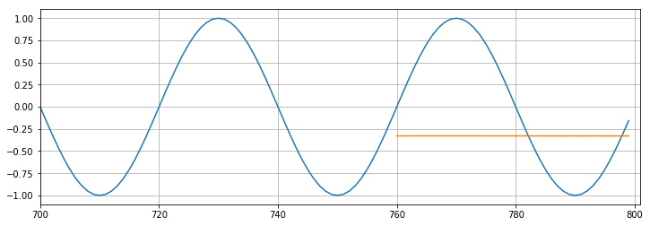

    Epoch:  2 Loss: 0.06506767
    Loss on test predictions: 0.565098762512207

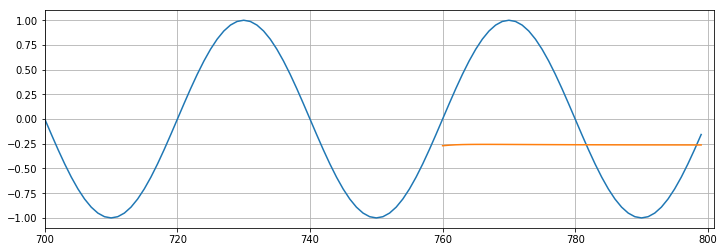

    Epoch:  3 Loss: 0.04198047
    Loss on test predictions: 0.5199716687202454

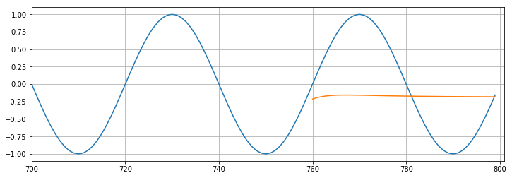

    Epoch:  4 Loss: 0.01784276
    Loss on test predictions: 0.42209967970848083

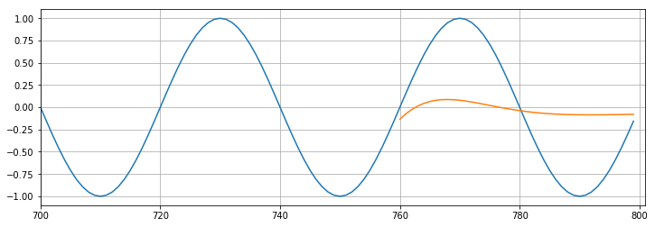

    Epoch:  5 Loss: 0.00288710
    Loss on test predictions: 0.16624116897583008

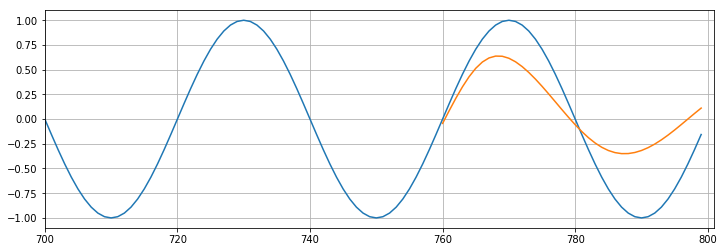

    Epoch:  6 Loss: 0.00032008
    Loss on test predictions: 0.03055439703166485

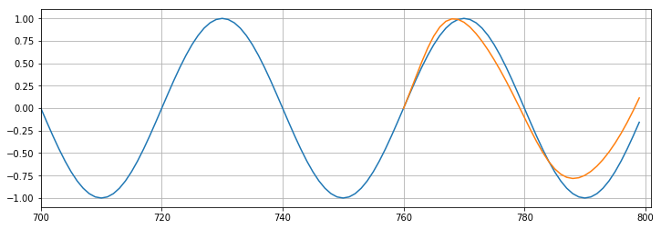

    Epoch:  7 Loss: 0.00012969
    Loss on test predictions: 0.014990181662142277

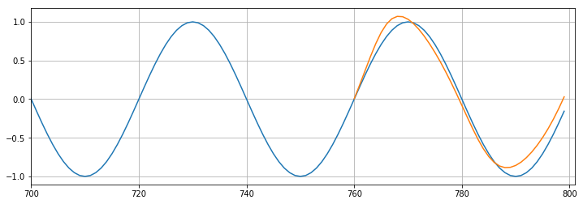

    Epoch:  8 Loss: 0.00012007
    Loss on test predictions: 0.011856676079332829

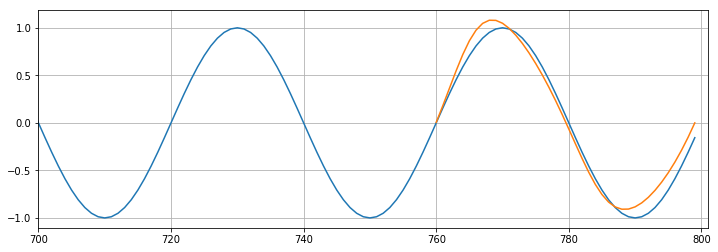

    Epoch:  9 Loss: 0.00012656
    Loss on test predictions: 0.010163827799260616

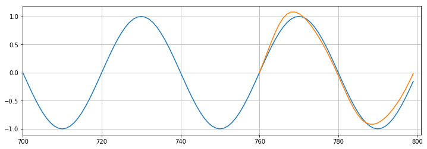

    Epoch: 10 Loss: 0.00013195
    Loss on test predictions: 0.00889757089316845

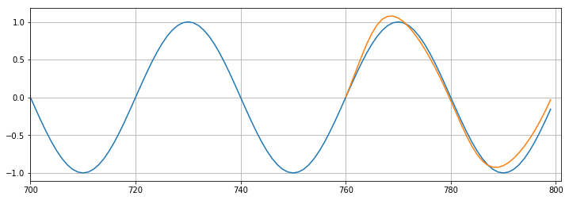

# Forecasting into an unknown future

We’ll continue to train our model, this time using the entire dataset.
Then we’ll predict what the <em>next</em> 40 points should be.

## Train the model

Expect this to take a few minutes.

``` python
epochs = 10
window_size = 40
future = 40

# Create the full set of sequence/label tuples:
all_data = input_data(y,window_size)
len(all_data)  # this should equal 800-40
```

    760

``` python
import time
start_time = time.time()

for i in range(epochs):
    
    # tuple-unpack the entire set of data
    for seq, y_train in all_data:  
       
        # reset the parameters and hidden states
        optimizer.zero_grad()
        model.hidden = (torch.zeros(1,1,model.hidden_size),
                        torch.zeros(1,1,model.hidden_size))
        
        y_pred = model(seq)
        
        loss = criterion(y_pred, y_train)
        
        loss.backward()
        optimizer.step()
        
    # print training result
    print(f'Epoch: {i+1:2} Loss: {loss.item():10.8f}')
    
print(f'\nDuration: {time.time() - start_time:.0f} seconds')
```

    Epoch:  1 Loss: 0.00013453
    Epoch:  2 Loss: 0.00013443
    Epoch:  3 Loss: 0.00013232
    Epoch:  4 Loss: 0.00012879
    Epoch:  5 Loss: 0.00012434
    Epoch:  6 Loss: 0.00011931
    Epoch:  7 Loss: 0.00011398
    Epoch:  8 Loss: 0.00010854
    Epoch:  9 Loss: 0.00010313
    Epoch: 10 Loss: 0.00009784

    Duration: 173 seconds

## Predict future values, plot the result

``` python
preds = y[-window_size:].tolist()

for i in range(future):  
    seq = torch.FloatTensor(preds[-window_size:])
    with torch.no_grad():
        # Reset the hidden parameters
        model.hidden = (torch.zeros(1,1,model.hidden_size),
                        torch.zeros(1,1,model.hidden_size))  
        preds.append(model(seq).item())

plt.figure(figsize=(12,4))
plt.xlim(-10,841)
plt.grid(True)
plt.plot(y.numpy())
plt.plot(range(800,800+future),preds[window_size:])
plt.show()
```

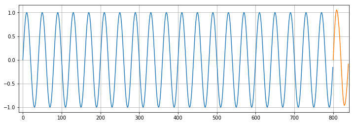

## Great job!

<center>

<a href=''>  </a>

</center>
<center>
<em>Copyright Qalmaqihir</em>
</center>
<center>
<em>For more information, visit us at
<a href='http://www.github.com/qalmaqihir/'>www.github.com/qalmaqihir/</a></em>
</center>
