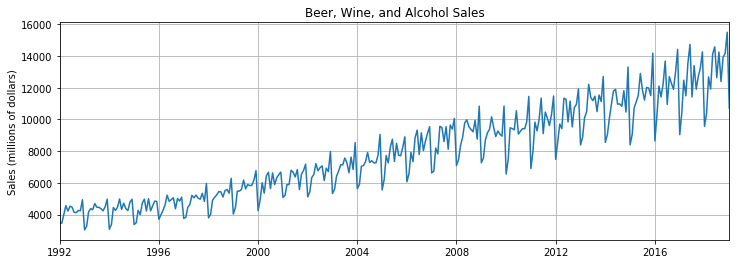
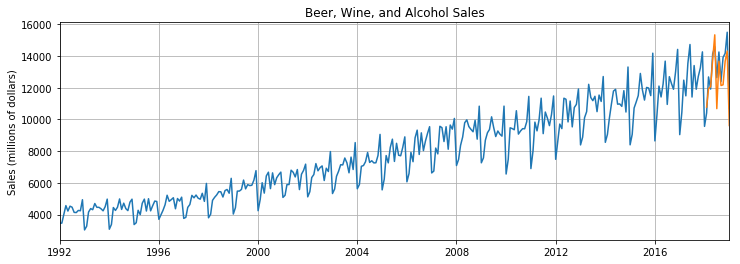
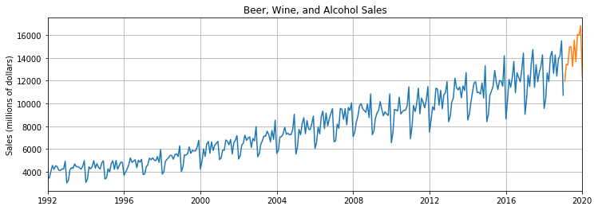
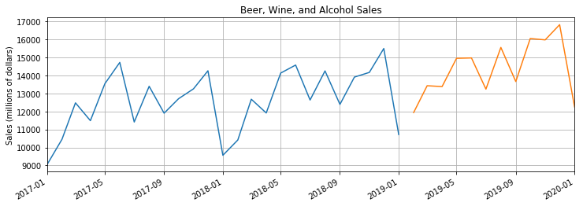

Tensorflow BootCamp - Recurrent Neural Networks
================
by Jawad Haider

- <a href="#rnn-on-a-time-series" id="toc-rnn-on-a-time-series">RNN on a
  Time Series</a>
  - <a href="#perform-standard-imports"
    id="toc-perform-standard-imports">Perform standard imports</a>
  - <a href="#load-the-dataset" id="toc-load-the-dataset">Load the
    dataset</a>
  - <a href="#plotting-time-series-data"
    id="toc-plotting-time-series-data">Plotting time series data</a>
  - <a href="#prepare-the-data" id="toc-prepare-the-data">Prepare the
    data</a>
  - <a href="#normalize-the-data" id="toc-normalize-the-data">Normalize the
    data</a>
  - <a href="#prepare-data-for-lstm" id="toc-prepare-data-for-lstm">Prepare
    data for LSTM</a>
  - <a href="#define-the-model" id="toc-define-the-model">Define the
    model</a>
  - <a href="#instantiate-the-model-define-loss-and-optimization-functions"
    id="toc-instantiate-the-model-define-loss-and-optimization-functions">Instantiate
    the model, define loss and optimization functions</a>
  - <a href="#train-the-model" id="toc-train-the-model">Train the model</a>
  - <a href="#run-predictions-and-compare-to-known-test-set"
    id="toc-run-predictions-and-compare-to-known-test-set">Run predictions
    and compare to known test set</a>
  - <a href="#invert-the-normalization"
    id="toc-invert-the-normalization">Invert the normalization</a>
- <a href="#forecast-into-an-unknown-future"
  id="toc-forecast-into-an-unknown-future">Forecast into an unknown
  future</a>
  - <a href="#predict-future-values-plot-the-result"
    id="toc-predict-future-values-plot-the-result">Predict future values,
    plot the result</a>
  - <a href="#great-job" id="toc-great-job">Great job!</a>

# RNN on a Time Series

For these examples we’re using data from the Federal Reserve Economic
Database (FRED) concerning Sales of Beer, Wine, and Distilled Alcoholic
Beverages in millions of dollars from January 1992 to January 2019 (325
records).

Data source: https://fred.stlouisfed.org/series/S4248SM144NCEN

## Perform standard imports

``` python
import torch
import torch.nn as nn

import numpy as np
import pandas as pd
import matplotlib.pyplot as plt
%matplotlib inline

# This relates to plotting datetime values with matplotlib:
from pandas.plotting import register_matplotlib_converters
register_matplotlib_converters()
```

## Load the dataset

We’ll take advantage of pandas’ built-in
<a href='https://pandas.pydata.org/pandas-docs/stable/timeseries.html'>DatetimeIndex</a>
by passing <tt>parse_dates=True</tt>

``` python
df = pd.read_csv('../Data/TimeSeriesData/Alcohol_Sales.csv',index_col=0,parse_dates=True)
len(df)
```

    325

``` python
# Always a good idea with time series data:
df.dropna(inplace=True)
len(df)
```

    325

``` python
df.head()
```

<div>
<style scoped>
    .dataframe tbody tr th:only-of-type {
        vertical-align: middle;
    }

    .dataframe tbody tr th {
        vertical-align: top;
    }

    .dataframe thead th {
        text-align: right;
    }
</style>
<table border="1" class="dataframe">
  <thead>
    <tr style="text-align: right;">
      <th></th>
      <th>S4248SM144NCEN</th>
    </tr>
    <tr>
      <th>DATE</th>
      <th></th>
    </tr>
  </thead>
  <tbody>
    <tr>
      <th>1992-01-01</th>
      <td>3459</td>
    </tr>
    <tr>
      <th>1992-02-01</th>
      <td>3458</td>
    </tr>
    <tr>
      <th>1992-03-01</th>
      <td>4002</td>
    </tr>
    <tr>
      <th>1992-04-01</th>
      <td>4564</td>
    </tr>
    <tr>
      <th>1992-05-01</th>
      <td>4221</td>
    </tr>
  </tbody>
</table>
</div>

``` python
df.tail()
```

<div>
<style scoped>
    .dataframe tbody tr th:only-of-type {
        vertical-align: middle;
    }

    .dataframe tbody tr th {
        vertical-align: top;
    }

    .dataframe thead th {
        text-align: right;
    }
</style>
<table border="1" class="dataframe">
  <thead>
    <tr style="text-align: right;">
      <th></th>
      <th>S4248SM144NCEN</th>
    </tr>
    <tr>
      <th>DATE</th>
      <th></th>
    </tr>
  </thead>
  <tbody>
    <tr>
      <th>2018-09-01</th>
      <td>12396</td>
    </tr>
    <tr>
      <th>2018-10-01</th>
      <td>13914</td>
    </tr>
    <tr>
      <th>2018-11-01</th>
      <td>14174</td>
    </tr>
    <tr>
      <th>2018-12-01</th>
      <td>15504</td>
    </tr>
    <tr>
      <th>2019-01-01</th>
      <td>10718</td>
    </tr>
  </tbody>
</table>
</div>

## Plotting time series data

We can add titles, axis labels, and other features to the plot.<br>
We’re going to tighten the x-axis to fit the width of the actual data
with <tt>plt.autoscale(axis=‘x’,tight=True)</tt>.<br> Alternatively you
could set your own limits with <tt>plt.xlim(pd.Timestamp(‘1992-01-01’),
pd.Timestamp(‘2019-01-01’))</tt> or some other values.

``` python
plt.figure(figsize=(12,4))
plt.title('Beer, Wine, and Alcohol Sales')
plt.ylabel('Sales (millions of dollars)')
plt.grid(True)
plt.autoscale(axis='x',tight=True)
plt.plot(df['S4248SM144NCEN'])
plt.show()
```



## Prepare the data

In the next steps we’ll divide the data into train/test sets, then
normalize the training values so that they fall between -1 and 1 (to
improve training). We’ll train the model, then predict into a period
that matches the test set. Finally, we’ll forecast into an unknown
future.

``` python
# Extract values from the source .csv file
y = df['S4248SM144NCEN'].values.astype(float)

# Define a test size
test_size = 12

# Create train and test sets
train_set = y[:-test_size]
test_set = y[-test_size:]
```

``` python
test_set
```

    array([10415., 12683., 11919., 14138., 14583., 12640., 14257., 12396.,
           13914., 14174., 15504., 10718.])

It’s worth noting that in our previous exercise the train and test sets
were tensors. Here they’re numpy arrays. This is because one of the
steps we’re about to perform outputs an array, and we’d have to turn it
into a tensor anyway.

## Normalize the data

The formula for normalizing data around zero is:<br> \###
$X_{norm} = \frac{X - \mu} {\sigma}$ where $\mu$ is the population mean,
and $\sigma$ is the population standard deviation.<br> Recall that back
in the CNN section we transformed image files using
<a href='https://pytorch.org/docs/stable/torchvision/transforms.html#torchvision.transforms.Normalize'><tt><strong>torchvision.transforms.Normalize(<em>mean,
std</em>)</strong></tt></a>, both because it was built into DataLoader,
and because our pretrained models expected specific normalization
values.<br>

Ultimately we want to perform
<a href='https://en.wikipedia.org/wiki/Feature_scaling'>min/max feature
scaling</a> so that our values fall between -1 and 1, as this makes
hyperparameters converge faster.<br>The formula for this would be:<br>
\### $X^{\prime} = a + \frac{(X - X_{min}) (b - a)} {X_{max} - X_{min}}$
where $a={-1}$ and $b=1$<br>

We can use scikit-learn to do this, with
<a href='https://scikit-learn.org/stable/modules/generated/sklearn.preprocessing.MinMaxScaler.html'><tt><strong>sklearn.preprocessing.MinMaxScaler()</strong></tt></a>

NOTE: We only want to normalize the training set to avoid data leakage.
If we include the test set then the higher average values of the test
set could become part of the signal in the training set. There’s a good
article on data leakage
<a href='test_set = input_data(test_norm,window_size)'>here</a>.

After using transformed data to train the model and generate
predictions, we’ll inverse_transform the predicted values so that we can
compare them to the actual test data.

``` python
from sklearn.preprocessing import MinMaxScaler

# Instantiate a scaler with a feature range from -1 to 1
scaler = MinMaxScaler(feature_range=(-1, 1))
```

``` python
# Normalize the training set
train_norm = scaler.fit_transform(train_set.reshape(-1, 1))
```

``` python
train_norm.min()
```

    -1.0

``` python
train_norm.max()
```

    1.0

``` python
train_norm.mean()
```

    -0.2041940178388313

``` python
type(train_norm)
```

    numpy.ndarray

## Prepare data for LSTM

Here we’ll create our list of (seq/label) tuples from the training set.
Recall that an LSTM consumes a window of samples toward the first
prediction, so the size of our training set will become ((325 -
test_size) - window_size).

``` python
# Convert train_norm from an array to a tensor
train_norm = torch.FloatTensor(train_norm).view(-1)

# Define a window size
window_size = 12

# Define function to create seq/label tuples
def input_data(seq,ws):  # ws is the window size
    out = []
    L = len(seq)
    for i in range(L-ws):
        window = seq[i:i+ws]
        label = seq[i+ws:i+ws+1]
        out.append((window,label))
    return out

# Apply the input_data function to train_norm
train_data = input_data(train_norm,window_size)
len(train_data)  # this should equal 325-12-12
```

    301

``` python
# Display the first seq/label tuple in the train data
train_data[0]
```

    (tensor([-0.9268, -0.9270, -0.8340, -0.7379, -0.7966, -0.7439, -0.7547, -0.8109,
             -0.8128, -0.7901, -0.7933, -0.6743]), tensor([-1.]))

## Define the model

This time we’ll use an LSTM layer of size (1,100).

``` python
class LSTMnetwork(nn.Module):
    def __init__(self,input_size=1,hidden_size=100,output_size=1):
        super().__init__()
        self.hidden_size = hidden_size
        
        # Add an LSTM layer:
        self.lstm = nn.LSTM(input_size,hidden_size)
        
        # Add a fully-connected layer:
        self.linear = nn.Linear(hidden_size,output_size)
        
        # Initialize h0 and c0:
        self.hidden = (torch.zeros(1,1,self.hidden_size),
                       torch.zeros(1,1,self.hidden_size))

    def forward(self,seq):
        lstm_out, self.hidden = self.lstm(
            seq.view(len(seq),1,-1), self.hidden)
        pred = self.linear(lstm_out.view(len(seq),-1))
        return pred[-1]  # we only want the last value
```

## Instantiate the model, define loss and optimization functions

``` python
torch.manual_seed(101)
model = LSTMnetwork()

criterion = nn.MSELoss()
optimizer = torch.optim.Adam(model.parameters(), lr=0.001)

model
```

    LSTMnetwork(
      (lstm): LSTM(1, 100)
      (linear): Linear(in_features=100, out_features=1, bias=True)
    )

``` python
def count_parameters(model):
    params = [p.numel() for p in model.parameters() if p.requires_grad]
    for item in params:
        print(f'{item:>6}')
    print(f'______\n{sum(params):>6}')
    
count_parameters(model)
```

       400
     40000
       400
       400
       100
         1
    ______
     41301

## Train the model

``` python
epochs = 100

import time
start_time = time.time()

for epoch in range(epochs):
    
    # extract the sequence & label from the training data
    for seq, y_train in train_data:
        
        # reset the parameters and hidden states
        optimizer.zero_grad()
        model.hidden = (torch.zeros(1,1,model.hidden_size),
                        torch.zeros(1,1,model.hidden_size))
        
        y_pred = model(seq)
        
        loss = criterion(y_pred, y_train)
        loss.backward()
        optimizer.step()
        
    # print training result
    print(f'Epoch: {epoch+1:2} Loss: {loss.item():10.8f}')
    
print(f'\nDuration: {time.time() - start_time:.0f} seconds')
```

    Epoch:  1 Loss: 0.25314346
    Epoch:  2 Loss: 0.37523878
    Epoch:  3 Loss: 0.39012098
    Epoch:  4 Loss: 0.34949699
    Epoch:  5 Loss: 0.33077896
    Epoch:  6 Loss: 0.33230731
    Epoch:  7 Loss: 0.32667691
    Epoch:  8 Loss: 0.32077038
    Epoch:  9 Loss: 0.30651760
    Epoch: 10 Loss: 0.29517019
    Epoch: 11 Loss: 0.26913935
    Epoch: 12 Loss: 0.25979361
    Epoch: 13 Loss: 0.24600053
    Epoch: 14 Loss: 0.22227803
    Epoch: 15 Loss: 0.18593730
    Epoch: 16 Loss: 0.18445705
    Epoch: 17 Loss: 0.17432655
    Epoch: 18 Loss: 0.25822312
    Epoch: 19 Loss: 0.22420478
    Epoch: 20 Loss: 0.23121868
    Epoch: 21 Loss: 0.19758533
    Epoch: 22 Loss: 0.18988022
    Epoch: 23 Loss: 0.21032184
    Epoch: 24 Loss: 0.16950732
    Epoch: 25 Loss: 0.14586549
    Epoch: 26 Loss: 0.11828811
    Epoch: 27 Loss: 0.00027535
    Epoch: 28 Loss: 0.00681852
    Epoch: 29 Loss: 0.05630350
    Epoch: 30 Loss: 0.01223376
    Epoch: 31 Loss: 0.02709176
    Epoch: 32 Loss: 0.03447094
    Epoch: 33 Loss: 0.02249899
    Epoch: 34 Loss: 0.01159327
    Epoch: 35 Loss: 0.01592799
    Epoch: 36 Loss: 0.00303702
    Epoch: 37 Loss: 0.00015524
    Epoch: 38 Loss: 0.00017455
    Epoch: 39 Loss: 0.00034566
    Epoch: 40 Loss: 0.00000055
    Epoch: 41 Loss: 0.00002718
    Epoch: 42 Loss: 0.00010465
    Epoch: 43 Loss: 0.00106159
    Epoch: 44 Loss: 0.00250127
    Epoch: 45 Loss: 0.00288290
    Epoch: 46 Loss: 0.00362020
    Epoch: 47 Loss: 0.00371592
    Epoch: 48 Loss: 0.00542405
    Epoch: 49 Loss: 0.00589132
    Epoch: 50 Loss: 0.00713205
    Epoch: 51 Loss: 0.00702253
    Epoch: 52 Loss: 0.00773653
    Epoch: 53 Loss: 0.00765838
    Epoch: 54 Loss: 0.00816493
    Epoch: 55 Loss: 0.00806901
    Epoch: 56 Loss: 0.00782317
    Epoch: 57 Loss: 0.00831962
    Epoch: 58 Loss: 0.00794266
    Epoch: 59 Loss: 0.00764198
    Epoch: 60 Loss: 0.00736130
    Epoch: 61 Loss: 0.00857497
    Epoch: 62 Loss: 0.00942086
    Epoch: 63 Loss: 0.00335479
    Epoch: 64 Loss: 0.00118402
    Epoch: 65 Loss: 0.00320848
    Epoch: 66 Loss: 0.00212591
    Epoch: 67 Loss: 0.00150738
    Epoch: 68 Loss: 0.00153509
    Epoch: 69 Loss: 0.00182797
    Epoch: 70 Loss: 0.00180291
    Epoch: 71 Loss: 0.00140510
    Epoch: 72 Loss: 0.00096806
    Epoch: 73 Loss: 0.00047413
    Epoch: 74 Loss: 0.00035952
    Epoch: 75 Loss: 0.00008912
    Epoch: 76 Loss: 0.00112789
    Epoch: 77 Loss: 0.00002196
    Epoch: 78 Loss: 0.00695060
    Epoch: 79 Loss: 0.00038595
    Epoch: 80 Loss: 0.00011149
    Epoch: 81 Loss: 0.00043127
    Epoch: 82 Loss: 0.00040868
    Epoch: 83 Loss: 0.00032796
    Epoch: 84 Loss: 0.00048195
    Epoch: 85 Loss: 0.00049252
    Epoch: 86 Loss: 0.00037195
    Epoch: 87 Loss: 0.00072067
    Epoch: 88 Loss: 0.00096091
    Epoch: 89 Loss: 0.00063866
    Epoch: 90 Loss: 0.00073793
    Epoch: 91 Loss: 0.00092162
    Epoch: 92 Loss: 0.00084968
    Epoch: 93 Loss: 0.00073029
    Epoch: 94 Loss: 0.00015117
    Epoch: 95 Loss: 0.00018061
    Epoch: 96 Loss: 0.00010094
    Epoch: 97 Loss: 0.00006259
    Epoch: 98 Loss: 0.00049196
    Epoch: 99 Loss: 0.00033408
    Epoch: 100 Loss: 0.00050564

    Duration: 278 seconds

## Run predictions and compare to known test set

``` python
future = 12

# Add the last window of training values to the list of predictions
preds = train_norm[-window_size:].tolist()

# Set the model to evaluation mode
model.eval()

for i in range(future):
    seq = torch.FloatTensor(preds[-window_size:])
    with torch.no_grad():
        model.hidden = (torch.zeros(1,1,model.hidden_size),
                        torch.zeros(1,1,model.hidden_size))
        preds.append(model(seq).item())
```

``` python
# Display predicted values
preds[window_size:]    # equivalent to preds[-future:]
```

    [0.3245275914669037,
     0.5227924585342407,
     0.5454435348510742,
     0.8364425301551819,
     1.104264736175537,
     0.30810344219207764,
     0.8207511901855469,
     0.5576714873313904,
     0.5653725862503052,
     0.8198413848876953,
     0.9293676018714905,
     0.12615284323692322]

## Invert the normalization

We want to compare our test predictions to the original data, so we need
to undo the previous normalization step. Note that
<tt>inverse_transform</tt> uses the most recently applied parameters; we
can rescale based on the test data, but not on the previous training
data.

``` python
true_predictions = scaler.inverse_transform(np.array(preds[window_size:]).reshape(-1, 1))
true_predictions
```

    array([[10778.82414629],
           [11938.5744862 ],
           [12071.07195711],
           [13773.27058014],
           [15339.89657426],
           [10682.7510851 ],
           [13681.48408699],
           [12142.59936514],
           [12187.64694327],
           [13676.1621809 ],
           [14316.83578715],
           [ 9618.43105651]])

``` python
df['S4248SM144NCEN'][-12:]
```

    DATE
    2018-02-01    10415
    2018-03-01    12683
    2018-04-01    11919
    2018-05-01    14138
    2018-06-01    14583
    2018-07-01    12640
    2018-08-01    14257
    2018-09-01    12396
    2018-10-01    13914
    2018-11-01    14174
    2018-12-01    15504
    2019-01-01    10718
    Name: S4248SM144NCEN, dtype: int64

It looks like our predictions weren’t that far off! \## Plot the results
Our original data contains a datetime index, but our predicted values do
not. We can create a range of dates using NumPy that are spaced one
month apart using <tt>dtype=‘datetime64\[M\]’</tt>, and then store them
with day values to match our dataset with
<tt>.astype(‘datetime64\[D\]’)</tt>.

``` python
# Remember that the stop date has to be later than the last predicted value.
x = np.arange('2018-02-01', '2019-02-01', dtype='datetime64[M]').astype('datetime64[D]')
x
```

    array(['2018-02-01', '2018-03-01', '2018-04-01', '2018-05-01',
           '2018-06-01', '2018-07-01', '2018-08-01', '2018-09-01',
           '2018-10-01', '2018-11-01', '2018-12-01', '2019-01-01'],
          dtype='datetime64[D]')

``` python
plt.figure(figsize=(12,4))
plt.title('Beer, Wine, and Alcohol Sales')
plt.ylabel('Sales (millions of dollars)')
plt.grid(True)
plt.autoscale(axis='x',tight=True)
plt.plot(df['S4248SM144NCEN'])
plt.plot(x,true_predictions)
plt.show()
```



``` python
# Plot the end of the graph
fig = plt.figure(figsize=(12,4))
plt.title('Beer, Wine, and Alcohol Sales')
plt.ylabel('Sales (millions of dollars)')
plt.grid(True)
plt.autoscale(axis='x',tight=True)
fig.autofmt_xdate()

# Select the end of the graph with slice notation:
plt.plot(df['S4248SM144NCEN']['2017-01-01':])
plt.plot(x,true_predictions)
plt.show()
```


For more information on x-axis date formatting in matplotlib, check out
<a href='https://matplotlib.org/api/_as_gen/matplotlib.figure.Figure.html#matplotlib.figure.Figure.autofmt_xdate'><tt><strong>matplotlib.figure.Figure.autofmt_xdate</strong></tt></a>
and
<a href='https://matplotlib.org/api/dates_api.html#matplotlib.dates.DateFormatter'><tt><strong>matplotlib.dates.DateFormatter</strong></tt></a>

# Forecast into an unknown future

This time we’ll continue training the model using the entire dataset,
and predict 12 steps into the future.

``` python
epochs = 100

# set model to back to training mode
model.train()

# feature scale the entire dataset
y_norm = scaler.fit_transform(y.reshape(-1, 1))
y_norm = torch.FloatTensor(y_norm).view(-1)
all_data = input_data(y_norm,window_size)

import time
start_time = time.time()

for epoch in range(epochs):
    
    # train on the full set of sequences
    for seq, y_train in all_data:  
        
        # reset the parameters and hidden states
        optimizer.zero_grad()
        model.hidden = (torch.zeros(1,1,model.hidden_size),
                        torch.zeros(1,1,model.hidden_size))
        
        y_pred = model(seq)
        
        loss = criterion(y_pred, y_train)
        loss.backward()
        optimizer.step()
        
    # print training result
    print(f'Epoch: {epoch+1:2} Loss: {loss.item():10.8f}')
    
print(f'\nDuration: {time.time() - start_time:.0f} seconds')
```

    Epoch:  1 Loss: 0.02658496
    Epoch:  2 Loss: 0.02985313
    Epoch:  3 Loss: 0.01421225
    Epoch:  4 Loss: 0.01419733
    Epoch:  5 Loss: 0.01290122
    Epoch:  6 Loss: 0.01244991
    Epoch:  7 Loss: 0.01119690
    Epoch:  8 Loss: 0.00854800
    Epoch:  9 Loss: 0.00788417
    Epoch: 10 Loss: 0.00792318
    Epoch: 11 Loss: 0.00556064
    Epoch: 12 Loss: 0.00598394
    Epoch: 13 Loss: 0.00537636
    Epoch: 14 Loss: 0.00649350
    Epoch: 15 Loss: 0.00798889
    Epoch: 16 Loss: 0.00699036
    Epoch: 17 Loss: 0.00741554
    Epoch: 18 Loss: 0.00671443
    Epoch: 19 Loss: 0.00555703
    Epoch: 20 Loss: 0.00517232
    Epoch: 21 Loss: 0.00519288
    Epoch: 22 Loss: 0.00412102
    Epoch: 23 Loss: 0.00535119
    Epoch: 24 Loss: 0.00888540
    Epoch: 25 Loss: 0.00753472
    Epoch: 26 Loss: 0.00589289
    Epoch: 27 Loss: 0.00580891
    Epoch: 28 Loss: 0.00776316
    Epoch: 29 Loss: 0.00629479
    Epoch: 30 Loss: 0.00895946
    Epoch: 31 Loss: 0.00883982
    Epoch: 32 Loss: 0.00968022
    Epoch: 33 Loss: 0.00415197
    Epoch: 34 Loss: 0.00383917
    Epoch: 35 Loss: 0.00253066
    Epoch: 36 Loss: 0.00149691
    Epoch: 37 Loss: 0.00340568
    Epoch: 38 Loss: 0.00264327
    Epoch: 39 Loss: 0.00205079
    Epoch: 40 Loss: 0.00436785
    Epoch: 41 Loss: 0.00065083
    Epoch: 42 Loss: 0.00063657
    Epoch: 43 Loss: 0.00052040
    Epoch: 44 Loss: 0.00060114
    Epoch: 45 Loss: 0.00001630
    Epoch: 46 Loss: 0.00138428
    Epoch: 47 Loss: 0.00005873
    Epoch: 48 Loss: 0.00092580
    Epoch: 49 Loss: 0.00028546
    Epoch: 50 Loss: 0.00265119
    Epoch: 51 Loss: 0.00000118
    Epoch: 52 Loss: 0.00076291
    Epoch: 53 Loss: 0.00050618
    Epoch: 54 Loss: 0.00063220
    Epoch: 55 Loss: 0.00001087
    Epoch: 56 Loss: 0.00001940
    Epoch: 57 Loss: 0.00038629
    Epoch: 58 Loss: 0.00057537
    Epoch: 59 Loss: 0.00001950
    Epoch: 60 Loss: 0.00133490
    Epoch: 61 Loss: 0.00203123
    Epoch: 62 Loss: 0.00004929
    Epoch: 63 Loss: 0.00098640
    Epoch: 64 Loss: 0.00086584
    Epoch: 65 Loss: 0.00075280
    Epoch: 66 Loss: 0.00050309
    Epoch: 67 Loss: 0.00211758
    Epoch: 68 Loss: 0.00260141
    Epoch: 69 Loss: 0.00385657
    Epoch: 70 Loss: 0.00009936
    Epoch: 71 Loss: 0.00036399
    Epoch: 72 Loss: 0.00154005
    Epoch: 73 Loss: 0.00036845
    Epoch: 74 Loss: 0.00021908
    Epoch: 75 Loss: 0.01171840
    Epoch: 76 Loss: 0.00335702
    Epoch: 77 Loss: 0.00374896
    Epoch: 78 Loss: 0.00772837
    Epoch: 79 Loss: 0.00071883
    Epoch: 80 Loss: 0.00118207
    Epoch: 81 Loss: 0.00225649
    Epoch: 82 Loss: 0.00011194
    Epoch: 83 Loss: 0.00061754
    Epoch: 84 Loss: 0.00208528
    Epoch: 85 Loss: 0.01009495
    Epoch: 86 Loss: 0.00545910
    Epoch: 87 Loss: 0.00120122
    Epoch: 88 Loss: 0.00036599
    Epoch: 89 Loss: 0.00008251
    Epoch: 90 Loss: 0.00085317
    Epoch: 91 Loss: 0.00470886
    Epoch: 92 Loss: 0.00336765
    Epoch: 93 Loss: 0.00118269
    Epoch: 94 Loss: 0.00009316
    Epoch: 95 Loss: 0.00007733
    Epoch: 96 Loss: 0.00416005
    Epoch: 97 Loss: 0.00755412
    Epoch: 98 Loss: 0.00003969
    Epoch: 99 Loss: 0.00005710
    Epoch: 100 Loss: 0.00009160

    Duration: 297 seconds

## Predict future values, plot the result

``` python
window_size = 12
future = 12
L = len(y)

preds = y_norm[-window_size:].tolist()

model.eval()
for i in range(future):  
    seq = torch.FloatTensor(preds[-window_size:])
    with torch.no_grad():
        # Reset the hidden parameters here!
        model.hidden = (torch.zeros(1,1,model.hidden_size),
                        torch.zeros(1,1,model.hidden_size))  
        preds.append(model(seq).item())

# Inverse-normalize the prediction set
true_predictions = scaler.inverse_transform(np.array(preds).reshape(-1, 1))

# PLOT THE RESULT
# Set a data range for the predicted data.
# Remember that the stop date has to be later than the last predicted value.
x = np.arange('2019-02-01', '2020-02-01', dtype='datetime64[M]').astype('datetime64[D]')

plt.figure(figsize=(12,4))
plt.title('Beer, Wine, and Alcohol Sales')
plt.ylabel('Sales (millions of dollars)')
plt.grid(True)
plt.autoscale(axis='x',tight=True)
plt.plot(df['S4248SM144NCEN'])
plt.plot(x,true_predictions[window_size:])
plt.show()
```



``` python
fig = plt.figure(figsize=(12,4))
plt.title('Beer, Wine, and Alcohol Sales')
plt.ylabel('Sales (millions of dollars)')
plt.grid(True)
plt.autoscale(axis='x',tight=True)
fig.autofmt_xdate()
plt.plot(df['S4248SM144NCEN']['2017-01-01':])
plt.plot(x,true_predictions[window_size:])
plt.show()
```



## Great job!

<h3>
BONUS:
</h3>

To save time in the future, we’ve written a function that will take in a
time series training data set, and output a tensor of <tt>(seq,
label)</tt> tuples.

``` python
# Load dependencies
from sklearn.preprocessing import MinMaxScaler

# Instantiate a scaler
"""
This has to be done outside the function definition so that
we can inverse_transform the prediction set later on.
"""
scaler = MinMaxScaler(feature_range=(-1, 1))

# Extract values from the source .csv file
df = pd.read_csv('../Data/TimeSeriesData/Alcohol_Sales.csv',index_col=0,parse_dates=True)
y = df['S4248SM144NCEN'].values.astype(float)

# Define a test size
test_size = 12

# Create the training set of values
train_set = y[:-test_size]
```

``` python
# DEFINE A FUNCTION:
def create_train_data(seq,ws=12):
    """Takes in a training sequence and window size (ws) of
       default size 12, returns a tensor of (seq/label) tuples"""
    seq_norm = scaler.fit_transform(seq.reshape(-1, 1))    
    seq_norm = torch.FloatTensor(seq_norm).view(-1)

    out = []
    L = len(seq_norm)
    for i in range(L-ws):
        window = seq_norm[i:i+ws]
        label = seq_norm[i+ws:i+ws+1]
        out.append((window,label))
    return out
```

``` python
# Apply the function to train_set
train_data = create_train_data(train_set,12)
len(train_data)  # this should equal 313-12
```

    301

``` python
train_data[0]
```

    (tensor([-0.9268, -0.9270, -0.8340, -0.7379, -0.7966, -0.7439, -0.7547, -0.8109,
             -0.8128, -0.7901, -0.7933, -0.6743]), tensor([-1.]))

``` python
help(create_train_data)
```

    Help on function create_train_data in module __main__:

    create_train_data(seq, ws=12)
        Takes in a training sequence and window size (ws) of
        default size 12, returns a tensor of (seq/label) tuples

<center>

<a href=''>  </a>

</center>
<center>
<em>Copyright Qalmaqihir</em>
</center>
<center>
<em>For more information, visit us at
<a href='http://www.github.com/qalmaqihir/'>www.github.com/qalmaqihir/</a></em>
</center>
