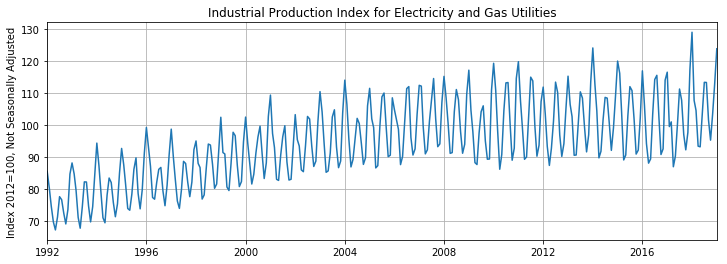
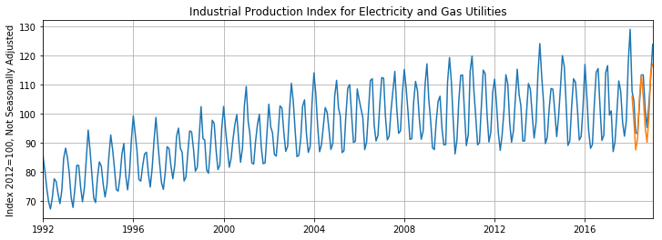
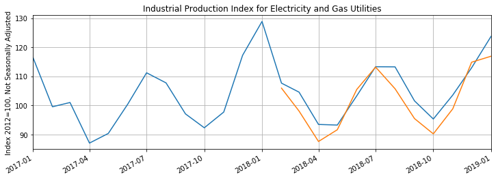

Tensorflow BootCamp - Recurrent Neural Networks
================
by Jawad Haider

- <a href="#rnn-exercises" id="toc-rnn-exercises">RNN Exercises</a>
  - <a href="#perform-standard-imports-load-and-plot-the-dataset"
    id="toc-perform-standard-imports-load-and-plot-the-dataset">Perform
    standard imports, load and plot the dataset</a>
- <a href="#prepare-the-data" id="toc-prepare-the-data">Prepare the
  data</a>
  - <a href="#divide-the-data-into-train-and-test-sets"
    id="toc-divide-the-data-into-train-and-test-sets">1. Divide the data
    into train and test sets</a>
  - <a href="#normalize-the-training-set"
    id="toc-normalize-the-training-set">2. Normalize the training set</a>
  - <a href="#prepare-data-for-lstm" id="toc-prepare-data-for-lstm">3.
    Prepare data for LSTM</a>
  - <a href="#define-the-model" id="toc-define-the-model">4. Define the
    model</a>
  - <a href="#define-loss-and-optimization-functions"
    id="toc-define-loss-and-optimization-functions">5. Define loss and
    optimization functions</a>
    - <a href="#train-the-model" id="toc-train-the-model">6. Train the
      model</a>
    - <a href="#evaluate-the-model-using-the-test-set"
      id="toc-evaluate-the-model-using-the-test-set">9. Evaluate the model
      using the test set</a>
  - <a href="#inverse-transform-the-predicted-values"
    id="toc-inverse-transform-the-predicted-values">10. Inverse transform
    the predicted values</a>
  - <a href="#bonus-exercise-plot-the-result"
    id="toc-bonus-exercise-plot-the-result">BONUS EXERCISE: Plot the
    result</a>
  - <a href="#great-job" id="toc-great-job">Great job!</a>

# RNN Exercises

For these exercises we’re using data from the Federal Reserve Economic
Database (FRED) concerning Electricity and Gas Utilities Production from
January 1992 to January 2019 (325 records).

Data source: https://fred.stlouisfed.org/series/IPG2211A2N

In the exercises below you’ll be asked to do the following: \* Perform
standard imports, load & plot the dataset (code provided) \* Prepare
data for an LSTM model \* Define the LSTM model, loss and optimization
functions \* Train the model \* Evaluate the model on test data \*
OPTIONAL: Plot the results

<div class="alert alert-danger" style="margin: 10px">

<strong>IMPORTANT NOTE!</strong> Make sure you don’t run the cells
directly above the example output shown, <br>otherwise you will end up
writing over the example output!

</div>

## Perform standard imports, load and plot the dataset

Run the cells below to load the libraries needed for this exercise and
the Energy Production dataset, and to plot the data.

``` python
# RUN THIS CELL
import torch
import torch.nn as nn
from sklearn.preprocessing import MinMaxScaler

import numpy as np
import pandas as pd
import matplotlib.pyplot as plt
%matplotlib inline

from pandas.plotting import register_matplotlib_converters
register_matplotlib_converters()

df = pd.read_csv('../Data/TimeSeriesData/Energy_Production.csv',index_col=0,parse_dates=True)
df.dropna(inplace=True)
print(len(df))
df.head()
```

    325

<div>
<style scoped>
    .dataframe tbody tr th:only-of-type {
        vertical-align: middle;
    }

    .dataframe tbody tr th {
        vertical-align: top;
    }

    .dataframe thead th {
        text-align: right;
    }
</style>
<table border="1" class="dataframe">
  <thead>
    <tr style="text-align: right;">
      <th></th>
      <th>IPG2211A2N</th>
    </tr>
    <tr>
      <th>DATE</th>
      <th></th>
    </tr>
  </thead>
  <tbody>
    <tr>
      <th>1992-01-01</th>
      <td>85.5560</td>
    </tr>
    <tr>
      <th>1992-02-01</th>
      <td>80.4178</td>
    </tr>
    <tr>
      <th>1992-03-01</th>
      <td>74.7390</td>
    </tr>
    <tr>
      <th>1992-04-01</th>
      <td>69.8367</td>
    </tr>
    <tr>
      <th>1992-05-01</th>
      <td>67.3781</td>
    </tr>
  </tbody>
</table>
</div>

``` python
# RUN THIS CELL
plt.figure(figsize=(12,4))
plt.title('Industrial Production Index for Electricity and Gas Utilities')
plt.ylabel('Index 2012=100, Not Seasonally Adjusted')
plt.grid(True)
plt.autoscale(axis='x',tight=True)
plt.plot(df['IPG2211A2N'])
plt.show()
```



# Prepare the data

For the first set of exercises we’ll \* divide the data into train and
test sets \* normalize the training set \* prepare windowed seq/label
tuples for an LSTM model

## 1. Divide the data into train and test sets

Working with a window_size of 12, divide the dataset into a sequence of
313 training records (including the window), and a test set of 12
records.

``` python
# CODE HERE
y = df['IPG2211A2N'].values.astype(float)

test_size = 
window_size = 

train_set = 
test_set = 
```

``` python
# Run the code below to check your results:
print(f'Train: {len(train_set)}')
print(f'Test:  {len(test_set)}')
```

``` python
# DON'T WRITE HERE
```

    Train: 313
    Test:  12

## 2. Normalize the training set

Feature scale the training set to fit within the range \[-1,1\].

``` python
# CODE HERE
scaler = MinMaxScaler(feature_range=(-1, 1))


train_norm = 
```

``` python
# Run the code below to check your results:
print(f'First item, original: {train_set[0]}')
print(f'First item, scaled:  {train_norm[0]}')
```

``` python
# DON'T WRITE HERE
```

    First item, original: 85.556
    First item, scaled: [-0.4091274]

## 3. Prepare data for LSTM

Prepare the list of windowed sequence/label tuples to be fed into an
LSTM model.

``` python
# RUN THIS CELL
train_norm = torch.FloatTensor(train_norm).view(-1)

def input_data(seq,ws):
    out = []
    L = len(seq)
    for i in range(L-ws):
        window = seq[i:i+ws]
        label = seq[i+ws:i+ws+1]
        out.append((window,label))
    return out
```

``` python
# CODE HERE

train_data = 
```

``` python
# Run the code below to check your results:
print(f'Train_data: {len(train_data)}')  # should equal 301
```

``` python
# DON'T WRITE HERE
```

    Train_data: 301

## 4. Define the model

Design a model that has a (1,64) LSTM layer and a (64,1) fully-connected
linear layer. Be sure to initialize $h_0$ and $c_0$, and return only the
last predicted value.

``` python
# CODE HERE
class LSTMnetwork(nn.Module):
    
    
    
    
    
    
    
    

```

``` python
# Run the code below to check your results:
torch.manual_seed(101)
model = LSTMnetwork()
model
```

``` python
# DON'T WRITE HERE
```

    LSTMnetwork(
      (lstm): LSTM(1, 64)
      (linear): Linear(in_features=64, out_features=1, bias=True)
    )

## 5. Define loss and optimization functions

Define a loss function called “criterion” and an optimizer called
“optimizer”.<br> You can use any functions you want, although we used
MSELoss and Adam (learning rate of 0.001) respectively.

``` python
# CODE HERE


```

``` python
# DON'T WRITE HERE
```

### 6. Train the model

Don’t worry about tracking loss values, displaying results, or
validating the test set. Just train the model through 50 epochs. We’ll
evaluate the trained model in the next step.<br> OPTIONAL: print
something after each epoch to indicate training progress.

``` python
# CODE HERE


```

``` python
# DON'T WRITE HERE
```

    1 of 50 epochs completed
    2 of 50 epochs completed
    3 of 50 epochs completed
    4 of 50 epochs completed
    5 of 50 epochs completed
    6 of 50 epochs completed
    7 of 50 epochs completed
    8 of 50 epochs completed
    9 of 50 epochs completed
    10 of 50 epochs completed
    11 of 50 epochs completed
    12 of 50 epochs completed
    13 of 50 epochs completed
    14 of 50 epochs completed
    15 of 50 epochs completed
    16 of 50 epochs completed
    17 of 50 epochs completed
    18 of 50 epochs completed
    19 of 50 epochs completed
    20 of 50 epochs completed
    21 of 50 epochs completed
    22 of 50 epochs completed
    23 of 50 epochs completed
    24 of 50 epochs completed
    25 of 50 epochs completed
    26 of 50 epochs completed
    27 of 50 epochs completed
    28 of 50 epochs completed
    29 of 50 epochs completed
    30 of 50 epochs completed
    31 of 50 epochs completed
    32 of 50 epochs completed
    33 of 50 epochs completed
    34 of 50 epochs completed
    35 of 50 epochs completed
    36 of 50 epochs completed
    37 of 50 epochs completed
    38 of 50 epochs completed
    39 of 50 epochs completed
    40 of 50 epochs completed
    41 of 50 epochs completed
    42 of 50 epochs completed
    43 of 50 epochs completed
    44 of 50 epochs completed
    45 of 50 epochs completed
    46 of 50 epochs completed
    47 of 50 epochs completed
    48 of 50 epochs completed
    49 of 50 epochs completed
    50 of 50 epochs completed

### 9. Evaluate the model using the test set

Be sure to re-initialize the hidden parameters $h_0$ and $c_0$ before
running the model.

``` python
# CODE HERE
future = 
preds = 

model.eval()

for i in range(future):


```

``` python
# Run the code below to check your results:
preds[window_size:]
```

``` python
# DON'T WRITE HERE
```

    [0.25382155179977417,
     -0.0027704648673534393,
     -0.343053936958313,
     -0.21152164041996002,
     0.23945370316505432,
     0.4895053505897522,
     0.24688751995563507,
     -0.08669154345989227,
     -0.25793153047561646,
     0.022461334243416786,
     0.5438402891159058,
     0.6108715534210205]

## 10. Inverse transform the predicted values

Rescale the predicted values up to the original test set range.

``` python
# CODE HERE
true_predictions = 
```

``` python
# Run the code below to check your results:
true_predictions
```

``` python
# DON'T WRITE HERE
```

    array([[105.95129313],
           [ 98.05736803],
           [ 87.58871716],
           [ 91.63524249],
           [105.50927345],
           [113.20198736],
           [105.73797111],
           [ 95.47557801],
           [ 90.20746543],
           [ 98.83361172],
           [114.87357457],
           [116.93575791]])

## BONUS EXERCISE: Plot the result

Plot the true_predictions values together with the original data.
Remember to create a range of datetime values for the predicted data.

``` python
# CODE HERE
```

``` python
# CODE HERE TO DISPLAY THE END OF THE GRAPH
```

``` python
# DON'T WRITE HERE
```



``` python
# DON'T WRITE HERE
```



## Great job!

<center>

<a href=''>  </a>

</center>
<center>
<em>Copyright Qalmaqihir</em>
</center>
<center>
<em>For more information, visit us at
<a href='http://www.github.com/qalmaqihir/'>www.github.com/qalmaqihir/</a></em>
</center>
