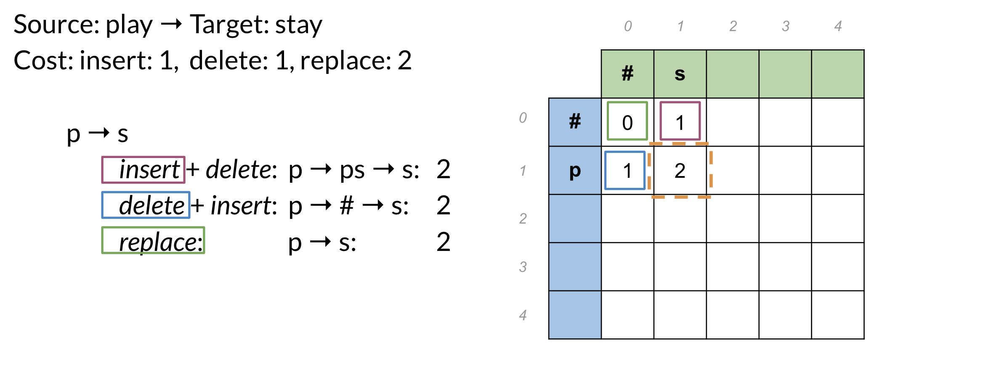
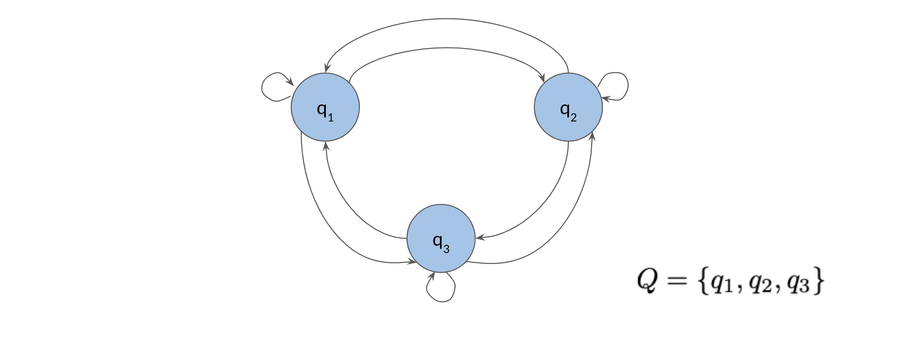
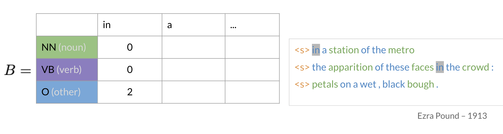
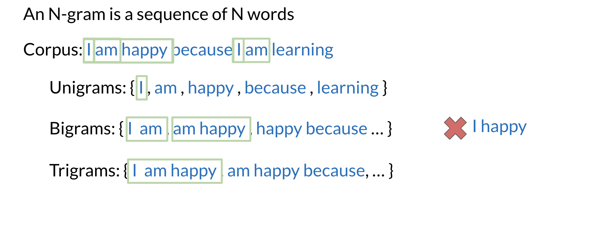
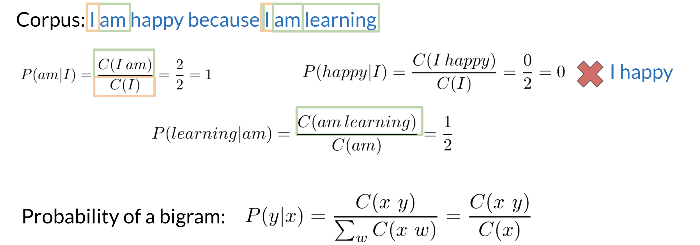
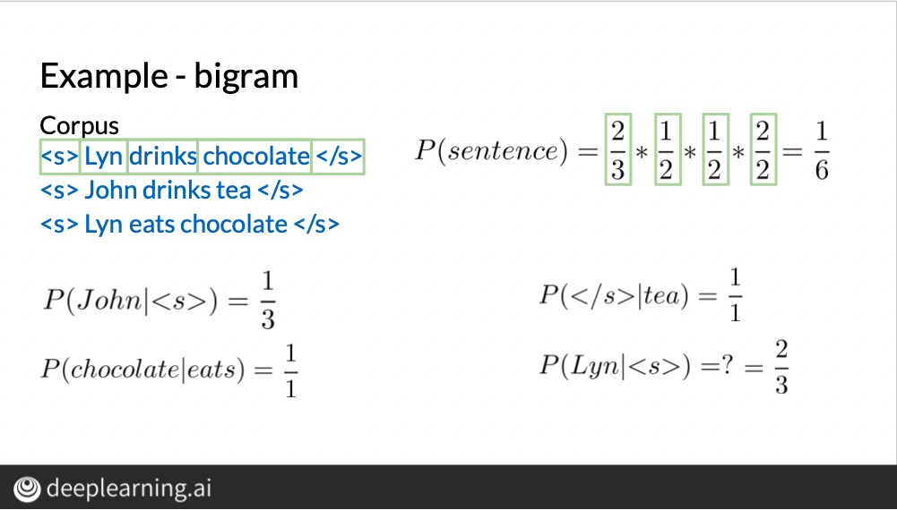
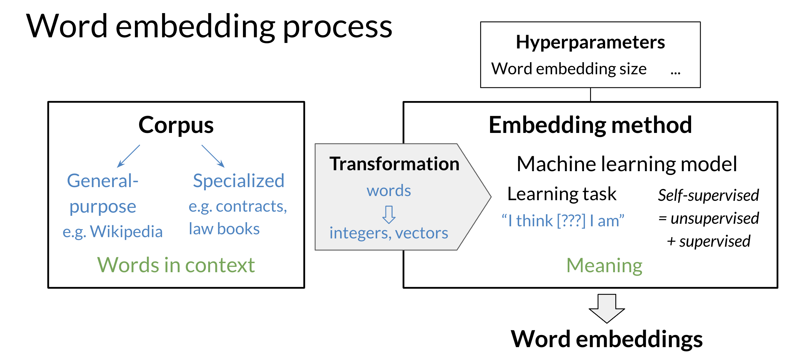
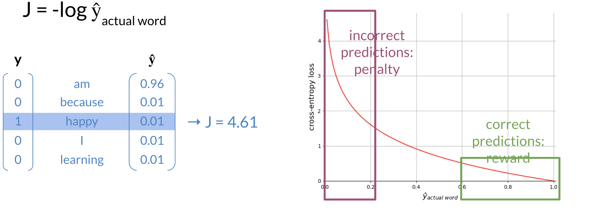
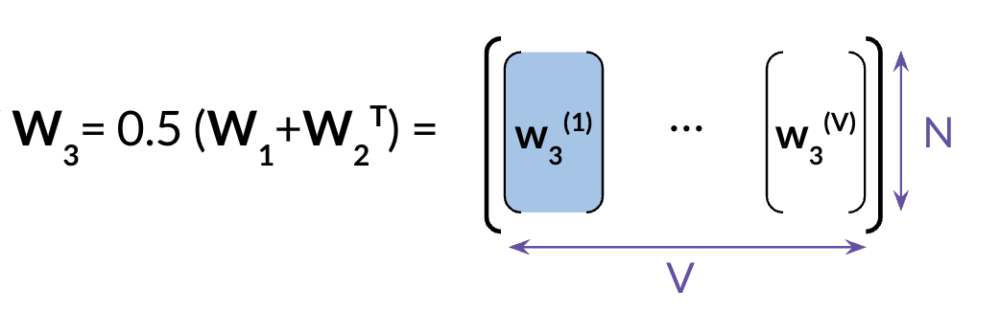

# NLP Specialization - Course 2

# Natural Language Processing With Probabilistic Models

Note 2024-01-02T11.32.18

========================

# Week 1 Autocorrect

Learn about autocorrect, minimum edit distance, and dynamic programming, then build your own spellchecker to correct misspelled words!

**Learning Objectives**

    Word probabilities
    Dynamic programming
    Minimum edit distance
    Autocorrect
 

## Overview

You use auto-correct everyday. When you send your friend a text message, or when you make a mistake in a query, there is an autocorrect behind the scenes that corrects the sentence for you. This week you are also going to learn about minimum edit distance, which tells you the minimum amount of edits to change one word into another. In doing that, you will learn about dynamic programming which is an important programming concept which frequently comes up in interviews and could be used to solve a lot of optimization problems.

## Autocorrect

Autocorrects are used everywhere. You use them in your phones, tablets, and computers. 

To implement autocorrect in this week's assignment, you have to follow these steps: 

    Identify a misspelled word

    Find strings n edit distance away: (these could be random strings)

    Filter candidates: (keep only the real words from the previous steps)

    Calculate word probabilities: (choose the word that is most likely to occur in that context)

## Building the model

1. Identify the misspelled word  
When identifying the misspelled word, you can check whether it is in the vocabulary. If you don't find it, then it is probably a typo.  
2. Find strings n edit distance away  

3. Filter candidates  In this step, you want to take all the words generated above and then only keep the actual words that make sense and that you can find in your vocabulary.  
 

## Building the model II
4.0 Calculating word probabilities

Note that you are storing the count of words and then you can use that to generate the probabilities. For this week, you will be counting the probabilities of words occurring.  If you want to build a slightly more sophisticated auto-correct you can keep track of two words occurring next to each other instead. You can then use the previous word to decide. For example which combo is more likely, there friend or their friend?  For this week however you will be implementing the probabilities by just using the word frequencies. Here is a summary of everything you have seen before in the previous two videos. 

## Minimum edit distance

Minimum edit distance allows you to:

    Evaluate similarity between two strings

    Find the minimum number of edits between two strings

    Implement spelling correction, document similarity, machine translation, DNA sequencing, and more

Remember that the edits include:

    Insert 	(add a letter)				‘to’:  ‘top’, ‘two’ …

    Delete	(remove a letter)			‘hat’: ‘ha’, ‘at’, ‘ht’

    Replace	(change 1 letter to another)	‘jaw’: ‘jar’, ‘paw’, …
    
 
Here is a concrete example where we calculate the cost (i.e. edit distance) between two strings. 

Note that as your strings get larger it gets much harder to calculate the minimum edit distance. Hence you will now learn about the minimum edit distance algorithm!

## Minimum edit distance algorithm

When computing the minimum edit distance, you would start with a source word and transform it into the target word. Let's look at the following example: 

To go from #→##→# you need a cost of 0. From  p→#p→# you get 1, because that is the cost of a delete.  p→sp→s is 2 because that is the minimum cost one could use to get from p to s. You can keep going this way by populating one element at a time, but it turns out there is a faster way to do this. You will learn about it next. 

## Minimum edit distance algorithm II

To populate the following table: 

There are three equations: 

    D[i,j] = D[i-1, j] + del_cost: this indicates you want to populate the current cell (i,j) by using the cost in the cell found directly above. 

    D[i,j] = D[i, j-1] + ins_cost: this indicates you want to populate the current cell (i,j) by using the cost in the cell found directly to its left. 

    D[i,j] = D[i-1, j-1] + rep_cost: the rep cost can be 2 or 0 depending if you are going to actually replace it or not. 

At every time step you check the three possible paths where you can come from and you select the least expensive one. Once you are done, you get the following: 

## Minimum edit distance algorithm III
To summarize, you have seen the levenshtein distance which specifies the cost per operation. If you need to reconstruct the path of how you got from one string to the other, you can use a backtrace. You should keep a simple pointer in each cell letting you know where you came from to get there. So you know the path taken across the table from the top left corner, to the bottom right corner. You can then reconstruct it. 

This method for computation instead of brute force is a technique known as dynamic programming. You first solve the smallest subproblem first and then reusing that result you solve the next biggest subproblem, saving that result, reusing it again, and so on. This is exactly what you did by populating each cell from the top right to the bottom left. It’s a well-known technique in computer science! 

# Week 2 Part of Speech Tagging And Hidden Markov Chain

Learn about Markov chains and Hidden Markov models, then use them to create part-of-speech tags for a Wall Street Journal text corpus!

**Learning Objectives**

    Markov chains
    Hidden Markov models
    Part-of-speech tagging
    Viterbi algorithm
    Transition probabilities
    Emission probabilities
    
## Part of Speech Tagging

Part of Speech Tagging (POS) is the process of assigning a part of speech to a word. By doing so, you will learn the following: 

    Markov Chains

    Hidden Markov Models

    Viterbi algorithm

Here is a concrete example:

You can use part of speech tagging for: 

    Identifying named entities

    Speech recognition

    Coreference Resolution

 You can use the probabilities of POS tags happening near one another to come up with the most reasonable output.

## Markov Chains

You can use Markov chains to identify the probability of the next word. For example below, you can see that the most likely word after a verb is a noun. 

To properly model the probabilities we need to identify the probabilities of the POS tags and for the words. 

The circles of the graph represent the states of your model. A state refers to a certain condition of the present moment.  You can think of these as the POS tags of the current word.

Q={q1,q2,q3}Q={q1​,q2​,q3​} is the set of all states in your model. 

## Markov Chains and POS Tags

To help identify the parts of speech for every word, you need to build a transition matrix that gives you the probabilities from one state to another.  

In the diagram above, the blue circles correspond to the part of speech tags, and the arrows correspond to the transition probabilities from one part of speech to another. You can populate the table on the right from the diagram on the left. The first row in your A matrix corresponds to the initial distribution among all the states. According to the table, the sentence has a 40% chance to start as a noun, 10% chance to start with a verb, and a 50% chance to start with another part of speech tag. 

In more general notation, you can write the transition matrix A, given some states Q, as follows: 

## Hidden Markov Models

In the previous video, I showed you an example with a simple markov model. The transition probabilities allowed you to identify the transition probability from one POS to another. We will now explore hidden markov models. In hidden markov models you make use of emission probabilities that give you the probability to go from one state (POS tag) to a specific word. 

For example, given that you are in a verb state, you can go to other words with certain probabilities. This emission matrix B, will be used with your transition matrix A, to help you identify the part of speech of a word in a sentence. To populate your matrix B, you can just have a labelled dataset and compute the probabilities of going from a POS to each word in your vocabulary. Here is a recap of what you have seen so far: 

Note that the sum of each row in your A and B matrix has to be 1. Next, I will show you how you can calculate the probabilities inside these matrices.

## Calculating Probabilities
Here is a visual representation on how to calculate the probabilities:

The number of times that blue is followed by purple is 2 out of 3. We will use the same logic to populate our transition and emission matrices. In the transition matrix we will count the number of times tag t(i−1),t(i)t(i−1)​,t(i)​ show up near each other and divide by the total number of times t(i−1)t(i−1)​ shows up (which is the same as the number of times it shows up followed by anything else).

C(t(i−1),t(i))C(t(i−1)​,t(i)​) is the count of times tag (i-1) shows up before tag i. From this you can compute the probability that a tag shows up after another tag. 

## Populating the Transition Matrix

To populate the transition matrix you have to keep track of the number of times each tag shows up before another tag. 

In the table above, you can see that green corresponds to nouns (NN), purple corresponds to verbs (VB), and blue corresponds to other (O). Orange (ππ)  corresponds to the initial state. The numbers inside the matrix correspond to the number of times a part of speech tag shows up right after another one. 

To go from O to NN or in other words to calculate P(O∣NN)P(O∣NN) you have to compute the following: 

To generalize:

P(ti∣ti−1)=C(ti−1,ti)∑j=1NC(ti−1,tj)P(ti​∣ti−1​)=∑j=1N​C(ti−1​,tj​)C(ti−1​,ti​)​

Unfortunately, sometimes you might not see two POS tags in front each other. This will give you a probability of 0. To solve this issue, you will "smooth" it as follows: 

The ϵϵ allows you to not have any two sequences showing up with 0 probability. Why is this important? 

## Populating the Emission Matrix

To populate the emission matrix, you have to keep track of the words associated with their parts of speech tags. 

To populate the matrix, we will also use smoothing as we have previously used: 
    

P(wi∣ti)=C(ti,wi)+ϵ∑j=1VC(ti,wj)+N∗ϵ=C(ti,wi)+ϵC(ti)+N∗ϵP(wi​∣ti​)​=∑j=1V​C(ti​,wj​)+N∗ϵC(ti​,wi​)+ϵ​=C(ti​)+N∗ϵC(ti​,wi​)+ϵ​​

Where C(ti,wi)C(ti​,wi​) is the count associated with how many times the tag titi​ is associated with the word wiwi​. The epsilon above is the smoothing parameter. In the next video, we will talk about the Viterbi algorithm and discuss how you can use the transition and emission matrix to come up with probabilities. 

## The Viterbi Algorithm

The Viterbi algorithm makes use of the transition probabilities and the emission probabilities as follows. 

To go from ππ to OO you need to multiply the corresponding transition probability (0.3) and the corresponding emission probability (0.5), which gives you 0.15. You keep doing that for all the words, until you get the probability of an entire sequence. 

You can then see how you will just pick the sequence with the highest probability. We will show you a systematic way to accomplish this (Viterbi!). 

## Viterbi Initialization

Now to populate the first column, you just multiply the initial ππ distribution, for each tag, times bi,cindex⁡(w1)bi,cindex(w1​)​. Where the i, corresponds to the tag of the initial distribution and the cindex(w1)cindex(w1​), is the index of word 1 in the emission matrix. And that's it, you are done with populating the first column of your new C matrix.  You will now need to keep track what part of speech you are coming from. Hence we introduce a matrix D, which allows you to store the labels that represent the different states you are going through when finding the most likely sequence of POS tags for the given sequence of words w1,…,wKw1​,…,wK​. At first you set the first column to 0, because you are not coming from any POS tag. 

You will now populate a matrix C of dimension (num_tags, num_words). This matrix will have the probabilities that will tell you what part of speech each word belongs to. 

These two matrices will make more sense in the next videos. 

## Viterbi: Forward Pass

This will be best illustrated with an example: 

So to populate a cell (i.e. 1,2) in the image above, you have to take the max of [kth cells in the previous column, times the corresponding transition probability of the kth POS to the first POS times the emission probability of the first POS and the current word you are looking at]. You do that for all the cells. Take a paper and a pencil, and make sure you understand how it is done. 

The general rule is ci,j=max⁡kck,j−1∗ak,i∗bi,cindex(wj)ci,j​=maxk​ck,j−1​∗ak,i​∗bi,cindex(wj​)​

Now to populate the D matrix, you will keep track of the argmax of where you came from as follows: 

Note that the only difference between cijcij​ and dijdij​, is that in the former you compute the probability and in the latter you keep track of the index of the row where that probability came from. So you keep track of which kk was used to get that max probability. 

## Viterbi: Backward Pass

Great, now that you know how to compute A, B, C, and D, we will put it all together and show you how to construct the path that will give you the part of speech tags for your sentence. 

The equation above just gives you the index of the highest row in the last column of C. Once you have that, you can go ahead and start using your D matrix as follows: 

Note that since we started at index one, hence the last word (w5w5​) is t1t1​. Then we go to the first row of D and what ever that number is, it indicated the row of the next part of speech tag. Then next part of speech tag indicates the row of the next and so forth. This allows you to reconstruct the POS tags for your sentence. You will be implementing this in this week's programming assignment. Good luck! 

# Week 3 Autocomplete And Language Model

Learn about how N-gram language models work by calculating sequence probabilities, then build your own autocomplete language model using a text corpus from Twitter!

**Learning Objectives**

    Conditional probabilities
    Text pre-processing
    Language modeling
    Perplexity
    K-smoothing
    N-grams
    Backoff
    Tokenization
    

## N-Grams Overview

N-grams are fundamental and give you a foundation that will allow you to understand more complicated models in the specialization. These models allow you to calculate probabilities of certain words happening in a specific sequence. Using that, you can build an auto-correct or even a search suggestion tool. 

Other applications of N-gram language modeling includes: 

This week you are going to learn to:

    Process a text corpus to N-gram language model

    Handle out of vocabulary words

    Implement smoothing for previously unseen N-grams

    Language model evaluation

## N-grams and Probabilities

Before we start computing probabilities of certain sequences, we need to first define what is an N-gram language model:

Now given the those definitions, we can label a sentence as follows: 

In other notation you can write: 

    w1m=w1w2w3....wm 

    w1^3=w1w2w3

    wm−2m=wm−2wm−1wmwm−2m​=wm−2​wm−1​wm​

Given the following corpus: I am happy because I am learning.

    Size of corpus m = 7. 

    P(I)=27P(I)=72​

    P(happy)=17P(happy)=71​

To generalize, the probability of a unigram is P(w)=C(w)mP(w)=mC(w)​
Bigram Probability:

Trigram Probability:

To compute the probability of a trigram:

    P(w3∣w12)=C(w12w3)C(w12)P(w3​∣w12​)=C(w12​)C(w12​w3​)​

    C(w12w3)=C(w1w2w3)=C(w13)C(w12​w3​)=C(w1​w2​w3​)=C(w13​)

N-gram Probability:

    P(wN∣w1N−1)=C(w1N−1wN)C(w1N−1)P(wN​∣w1N−1​)=C(w1N−1​)C(w1N−1​wN​)​

    C(w1N−1wN)=C(w1N)C(w1N−1​wN​)=C(w1N​)

## Sequence Probabilities

You just saw how to compute sequence probabilities, their short comings, and finally how to approximate N-gram probabilities. In doing so, you try to approximate the probability of a sentence. For example, what is the probability of the following sentence: The teacher drinks tea. To compute it, you will make use of the following: 

    P(B∣A)=P(A,B)P(A)⟹P(A,B)=P(A)P(B∣A)P(B∣A)=P(A)P(A,B)​⟹P(A,B)=P(A)P(B∣A)

    P(A,B,C,D)=P(A)P(B∣A)P(C∣A,B)P(D∣A,B,C)P(A,B,C,D)=P(A)P(B∣A)P(C∣A,B)P(D∣A,B,C)

To compute the probability of a sequence, you can compute the following:

P( the teacher drinks tea )=P(the)P( teacher the)P( drinks the teacher)P(tea∣the teacher drinks )P( the teacher drinks tea )=P(the)P( teacher the)P( drinks the teacher)P(tea∣the teacher drinks )​​

One of the main issues with computing the probabilities above is the corpus rarely contains the exact same phrases as the ones you computed your probabilities on. Hence, you can easily end up getting a probability of 0. The Markov assumption indicates that only the last word matters. Hence: 

     Bigram P(wn∣w1n−1)≈P(wn∣wn−1) Bigram P(wn​∣w1n−1​)≈P(wn​∣wn−1​)

     N-gram P(wn∣w1n−1)≈P(wn∣wn−N+1n−1) N-gram P(wn​∣w1n−1​)≈P(wn​∣wn−N+1n−1​)

You can model the entire sentence as follows: 

    P(w1n)≈∏i=1nP(wi∣wi−1)P(w1n​)≈∏i=1n​P(wi​∣wi−1​)

    P(w1n)≈P(w1)P(w2∣w1)…P(wn∣wn−1)P(w1n​)≈P(w1​)P(w2​∣w1​)…P(wn​∣wn−1​)

## Starting and Ending Sentences

We usually start and end a sentence with the following tokens respectively: <s> </s>. 

When computing probabilities using a unigram, you can append an <s> in the beginning of the sentence. To generalize to an N-gram language model, you can add N-1 start tokens <s>. 

For the end of sentence token </s>, you only need one even if it is an N-gram. Here is an example: 

Make sure you know how to compute the probabilities above! 

## The N-gram Language Model

We covered a lot of concepts in the previous video.  You have seen: 

    Count matrix

    Probability matrix

    Language model

    Log probability to avoid underflow

    Generative language model

In the count matrix:

    Rows correspond to the unique corpus N-1 grams. 

    Columns correspond to the unique corpus words. 

Here is an example of the count matrix of a bigram. 

To convert it into a probability matrix, you can use the following formula:

    P(wn∣wn−N+1n−1)=C(wn−N+1n−1,wn)C(wn−N+1n−1)P(wn​∣wn−N+1n−1​)=C(wn−N+1n−1​)C(wn−N+1n−1​,wn​)​

    sum⁡(row)=∑w∈VC(wn−N+1n−1,w)=C(wn−N+1n−1)sum(row)=∑w∈V​C(wn−N+1n−1​,w)=C(wn−N+1n−1​)

Now given the probability matrix, you can generate the language model. You can compute the sentence probability and the next word prediction. 

To compute the probability of a sequence, you needed to compute: 

P(w1n)≈∏i=1nP(wi∣wi−1)P(w1n​)≈∏i=1n​P(wi​∣wi−1​) 

To avoid underflow, you can multiply by the log. 

log⁡(P(w1n))≈∑i=1nlog⁡(P(wi∣wi−1))log(P(w1n​))≈∑i=1n​log(P(wi​∣wi−1​))

Finally here is a summary to create the generative model: 

## Language Model Evaluation
Splitting the Data

We will now discuss the train/val/test splits and perplexity.
Train/Val/Test splits

Smaller Corpora: 

    80% train

    10% val 

    10% test

Larger Corpora: 

    98% train

    1% val 

    1% test

There are two main methods for splitting the data: 

### Perplexity

Perplexity is used to tell us whether a set of sentences look like they were written by humans rather than by a simple program choosing words at random. A text that is written by humans is more likely to have lower perplexity, where a text generated by random word choice would have a higher perplexity.

Concretely, here are the formulas to calculate perplexity. 

PP(W)=P(s1,s2,…,sm)−1mPP(W)=P(s1​,s2​,…,sm​)−m1​

PP(W)=∏i=1m∏j=1∣si∣1P(wj(i)∣wj−1(i))mPP(W)=m∏i=1m​∏j=1∣si​∣​P(wj(i)​∣wj−1(i)​)1​

​

wj(i)→jwj(i)​→j corresponds to the jth word in the ith sentence. If you were to concatenate all the sentences then wiwi​ is the ith word in the test set. To compute the log perplexity, you go from 

PP(W)=∏i=1m1P(wi∣wi−1)mPP(W)=m∏i=1m​P(wi​∣wi−1​)1​

​To 

log⁡PP(W)=−1m∑i=1mlog⁡2(P(wi∣wi−1))logPP(W)=−m1​∑i=1m​log2​(P(wi​∣wi−1​))

## Out of Vocabulary Words

Many times, you will be dealing with unknown words in the corpus. So how do you choose your vocabulary? What is a vocabulary?

A vocabulary is a set of unique words supported by your language model. In some tasks like speech recognition or question answering, you will encounter and generate words only from a fixed set of words. Hence, a closed vocabulary.  

Open vocabulary means that you may encounter words from outside the vocabulary, like a name of a new city in the training set. Here is one recipe that would allow you to handle unknown words. 

    Create vocabulary V

    Replace any word in corpus and not in V by <UNK>

    Count the probabilities with <UNK> as with any other word

The example above shows how you can use min_frequency and replace all the words that show up fewer times than min_frequency by UNK. You can then treat UNK as a regular word. 
Criteria to create the vocabulary

    Min word frequency f

    Max |V|, include words by frequency

    Use <UNK> sparingly (Why?)

    Perplexity -  only compare LMs with the same V

    
## Smoothing

The three main concepts covered here are dealing with missing n-grams, smoothing, and Backoff and interpolation. 

P(wn∣wn−N+1n−1)=C(wn−N+1n−1,wn)C(wn−N+1n−1) can be 0P(wn​∣wn−N+1n−1​)=C(wn−N+1n−1​)C(wn−N+1n−1​,wn​)​ can be 0

Hence we can add-1 smoothing as follows to fix that problem: 

P(wn∣wn−1)=C(wn−1,wn)+1∑w∈V(C(wn−1,w)+1)=C(wn−1,wn)+1C(wn−1)+VP(wn​∣wn−1​)=∑w∈V​(C(wn−1​,w)+1)C(wn−1​,wn​)+1​=C(wn−1​)+VC(wn−1​,wn​)+1​

Add-k smoothing is very similar: 

P(wn∣wn−1)=C(wn−1,wn)+k∑w∈V(C(wn−1,w)+k)=C(wn−1,wn)+kC(wn−1)+k∗VP(wn​∣wn−1​)=∑w∈V​(C(wn−1​,w)+k)C(wn−1​,wn​)+k​=C(wn−1​)+k∗VC(wn−1​,wn​)+k​

When using back-off:

    If N-gram missing => use (N-1)-gram, …: Using the lower level N-grams (i.e. (N-1)-gram, (N-2)-gram, down to unigram) distorts the probability distribution. Especially for smaller corpora, some probability needs to be discounted from higher level N-grams to use it for lower level N-grams.

    Probability discounting e.g. Katz backoff: makes use of discounting. 

    “Stupid” backoff: If the higher order N-gram probability is missing, the lower order N-gram probability is used, just multiplied by a constant. A constant of about 0.4 was experimentally shown to work well.

Here is a visualization: 

You can also use interpolation when computing probabilities as follows: 

P^(wn∣wn−2wn−1)=λ1×P(wn∣wn−2wn−1)+λ2×P(wn∣wn−1)+λ3×P(wn)P^(wn​∣wn−2​wn−1​)=λ1​×P(wn​∣wn−2​wn−1​)+λ2​×P(wn​∣wn−1​)+λ3​×P(wn​)​

Where

∑iλi=1∑i​λi​=1

## Week Summary

This week you learned the following concepts

    N-Grams and probabilities

    Approximate sentence probability from N-Grams

    Build a language model from a corpus

    Fix missing information

    Out of vocabulary words with <UNK>

    Missing N-Gram in corpus with smoothing, backoff and interpolation

    Evaluate language model with perplexity

    Coding assignment! 

# Week 4 Word Embeddings with Neural Networks
Learn about how word embeddings carry the semantic meaning of words, which makes them much more powerful for NLP tasks, then build your own Continuous bag-of-words model to create word embeddings from Shakespeare text.
Learning Objectives

    Gradient descent
    One-hot vectors
    Neural networks
    Word embeddings
    Continuous bag-of-words model
    Text pre-processing
    Tokenization
    Data generators
    
## Overview

Word embeddings are used in most NLP applications. Whenever you are dealing with text, you first have to find a way to encode the words as numbers. Word embedding are a very common technique that allows you to do so. Here are a few applications of word embeddings that you should be able to implement by the time you complete the specialization.

By the end of this week you will be able to: 

    Identify the key concepts of word representations

    Generate word embeddings

    Prepare text for machine learning

    Implement the continuous bag-of-words modelOverview

## Basic Word Representations
Basic Word Representations

Basic word representations could be classified into the following:

    Integers

    One-hot vectors

    Word embeddings
    

To the left, you have an example where you use integers to represent a word. The issue there is that there is no reason why one word corresponds to a bigger number than another. To fix this problem we introduce one hot vectors (diagram on the right). To implement one hot vectors, you have to initialize a vector of zeros of dimension V  and then put a 1 in the index corresponding to the word you are representing.

The **pros** of one-hot vectors:  simple and require no implied ordering. 

The **cons** of one-hot vectors: huge and encode no meaning. 

## Word Embeddings

So why use word embeddings? Let's take a look.

From the plot above, you can see that when encoding a word in 2D, similar words tend to be found next to each other. Perhaps the first coordinate represents whether a word is positive or negative. The second coordinate tell you whether the word is abstract or concrete. This is just an example, in the real world you will find embeddings with hundreds of dimensions. You can think of each coordinate as a number telling you something about the word. 

The pros:

    Low dimensions (less than V)

    Allow you to encode meaning
    

## How to Create Word Embeddings?

To create word embeddings you always need a corpus of text, and an embedding method.

The context of a word tells you what type of words tend to occur near that specific word. The context is important as this is what will give meaning to each word embedding.

#### Embeddings

There are many types of possible methods that allow you to learn the word embeddings. The machine learning model performs a learning task, and the main by-products of this task are the word embeddings. The task could be to learn to predict a word based on the surrounding words in a sentence of the corpus, as in the case of the continuous bag-of-words.

The task is self-supervised: it is both unsupervised in the sense that the input data — the corpus — is unlabelled, and supervised in the sense that the data itself provides the necessary context which would ordinarily make up the labels. 

When training word vectors, there are some parameters you need to tune. (i.e. the dimension of the word vector)

## Word Embedding Methods

### Classical Methods

    **word2vec** (Google, 2013)

    **Continuous bag-of-words (CBOW):** the model learns to predict the center word given some context words.

    Continuous skip-gram / Skip-gram with negative sampling (SGNS): the model learns to predict the words surrounding a given input word.

    **Global Vectors (GloVe)** (Stanford, 2014): factorizes the logarithm of the corpus's word co-occurrence matrix,  similar to the count matrix you’ve used before.

    fastText (Facebook, 2016): based on the skip-gram model and takes into account the structure of words by representing words as an n-gram of characters. It supports out-of-vocabulary (OOV) words.

### Deep learning, contextual embeddings

 In these more advanced models, words have different embeddings depending on their context. You can download pre-trained embeddings for the following models. 

    **BERT** (Google, 2018):

    **ELMo** (Allen Institute for AI, 2018)

    **GPT-2** (OpenAI, 2018)

## Continuous Bag of Words Model

To create word embeddings, you need a corpus and a learning algorithm. The by-product of this task would be a set of word embeddings. In the case of the continuous bag-of-words model, the objective of the task is to predict a missing word based on the surrounding words.

Here is a visualization that shows you how the models works.

As you can see, the window size in the image above is 5. The context size, C, is 2. C usually tells you how many words before or after the center word the model will use to make the prediction. Here is another visualization that shows an overview of the model. 

## Cleaning and Tokenization

Before implementing any natural language processing algorithm, you might want to clean the data and tokenize it. Here are a few things to keep track of when handling your data.

You can clean data using python as follows: 

You can add as many conditions as you want in the lines corresponding to the green rectangle above. 

## Sliding Window of words in Python

The code above shows you a function which takes in two parameters. 

    Words: a list of words.

    C: the context size.

We first start by setting i to C. Then we single out the center_word, and the context_words. We then yield those and increment i. 

## Transforming Words into Vectors

To transform the context vectors into one single vector, you can use the following. 

As you can see, we started with one-hot vectors for the context words and and we transform them into a single vector by taking an average. As a result you end up having the following vectors that you can use for your training. 

## Architecture for the CBOW Model

The architecture for the CBOW model could be described as follows

You have an input, X, which is the average of all context vectors. You then multiply it by W1W1​ and add b1b1​. The result goes through a ReLU function to give you your hidden layer. That layer is then multiplied by W2W2​ and you add b2b2​. The result goes through a softmax which gives you a distribution over V, vocabulary words. You pick the vocabulary word that corresponds to the arg-max of the output. 

## Architecture of the CBOW Model: Dimensions

The equations for the previous model are: 

z1=W1x+b1

h=ReLU(z1)

z2=W2h+b2

y^=softmax(z2)

Here, you can see the dimensions: 

Make sure you go through the matrix multiplications and understand why the dimensions make sense. 

## Architecture of the CBOW Model: Dimensions

When dealing with batch input, you can stack the examples as columns. You can then proceed to multiply the matrices as follows: 

In the diagram above, you can see the dimensions of each matrix. Note that your Y^Y^ is of dimension V by m. Each column is the prediction of the column corresponding to the context words.  So the first column in Y^Y^ is the prediction corresponding to the first column of X. 

## Architecture of the CBOW Model: Activation Functions
### ReLU funciton

The rectified linear unit (ReLU), is one of the most popular activation functions. When you feed a vector, namely x, into a ReLU function. You end up taking x=max(0,x)x=max(0,x). This is a drawing that shows ReLU. 

### Softmax function

The softmax function takes a vector and transforms it into a probability distribution. For example, given the following vector z, you can transform it into a probability distribution as follows. 

As you can see, you can compute  $$y^=ezi/∑j=1Vezj$$

## Training a CBOW Model: Cost Function

The cost function for the CBOW model is a cross-entropy loss defined as: 

$$J=−∑k=1Vyklog⁡y^k$$

Here is an example where you use the equation above. 

Why is the cost 4.61 in the example above? 

## Training a CBOW Model: Forward Propagation

Forward propagation is defined as: 

Z1=W1X+B1

H=ReLU(Z1)

Z2=W2H+B2

Y^=softmax(Z2)

In the image below you start from the left and you forward propagate all the way to the right. 

To calculate the loss of a batch, you have to compute the following: 

$$Jbatch=−1m∑1m∑j=1Vyj(i)log⁡y^j(i)$$

Given, your predicted center word matrix, and actual center word matrix, you can compute the loss. 

## Training a CBOW Model: Backpropagation and Gradient Descent
- **Backpropagation**: calculate partial derivatives of cost with respect to weights and biases.

When computing the back-prop in this model, you need to compute the following:

∂Jbatch∂W1,∂Jbatch∂W2,∂Jbatch∂b1,∂Jbatch∂b2\frac{\partial J_{b a t c h}}{\partial \mathbf{W}_{1}}, \frac{\partial J_{b a t c h}}{\partial \mathbf{W}_{2}}, \frac{\partial J_{b a t c h}}{\partial \mathbf{b}_{1}}, \frac{\partial J_{b a t c h}}{\partial \mathbf{b}_{2}}∂W1​∂Jbatch​​,∂W2​∂Jbatch​​,∂b1​∂Jbatch​​,∂b2​∂Jbatch​​

*Gradient descent: **update weights and biases***

Now to update the weights you can iterate as follows:

$W1:=W1−α∂Jbatch ∂W1  
W2:=W2−α∂Jbatch ∂W2
b1:=b1−α∂Jbatch ∂b1    
b2:=b2−α∂Jbatch ∂b2\begin{array}{l}\mathbf{W}_{\mathbf{1}}:=\mathbf{W}_{\mathbf{1}}-\alpha \frac{\partial J_{\text {batch }}}{\partial \mathbf{W}_{\mathbf{1}}} \\ \mathbf{W}_{\mathbf{2}}:=\mathbf{W}_{2}-\alpha \frac{\partial J_{\text {batch }}}{\partial \mathbf{W}_{\mathbf{2}}} \\ \mathbf{b}_{1}:=\mathbf{b}_{1}-\alpha \frac{\partial J_{\text {batch }}}{\partial \mathbf{b}_{\mathbf{1}}} \\ \mathbf{b}_{\mathbf{2}}:=\mathbf{b}_{2}-\alpha \frac{\partial J_{\text {batch }}}{\partial \mathbf{b}_{2}}\end{array}W1​:=W1​−α∂W1​∂Jbatch ​​W2​:=W2​−α∂W2​∂Jbatch ​​b1​:=b1​−α∂b1​∂Jbatch ​​b2​:=b2​−α∂b2​∂Jbatch$

A smaller alpha allows for more gradual updates to the weights and biases, whereas a larger number allows for a faster update of the weights. If α \alphaα is too large, you might not learn anything, if it is too small, your model will take forever to train. 

## Extracting Word Embedding Vectors

There are two options to extract word embeddings after training the continuous bag of words model. You can use w1w1​ as follows: 

If you were to use w1w1​, each column will correspond to the embeddings of a specific word. You can also use w2w2​ as follows: 

The final option is to take an average of both matrices as follows: 

## Evaluating Word Embeddings: Intrinsic Evaluation

Intrinsic evaluation allows you to test relationships between words. It allows you to capture semantic analogies as, “France” is to “Paris” as “Italy” is to <?> and also syntactic analogies as “seen” is to “saw” as “been” is to <?>. 

Ambiguous cases could be much harder to track: 

Here are a few  ways that allow to use intrinsic evaluation.

## Evaluating Word Embeddings: Extrinsic Evaluation

Extrinsic evaluation tests word embeddings on external tasks like named entity recognition, parts-of-speech tagging, etc. 

    + Evaluates actual usefulness of embeddings

    - Time Consuming

    - More difficult to trouble shoot

So now you know both intrinsic and extrinsic evaluation. 

## Conclusion

This week you learned the following concepts.

    Data preparation

    Word representations

    Continuous bag-of-words model

    Evaluation

You have all the foundations now. From now on, you will start using some advanced AI libraries in the next courses. Congratulations and good luck with the assignment :) 

