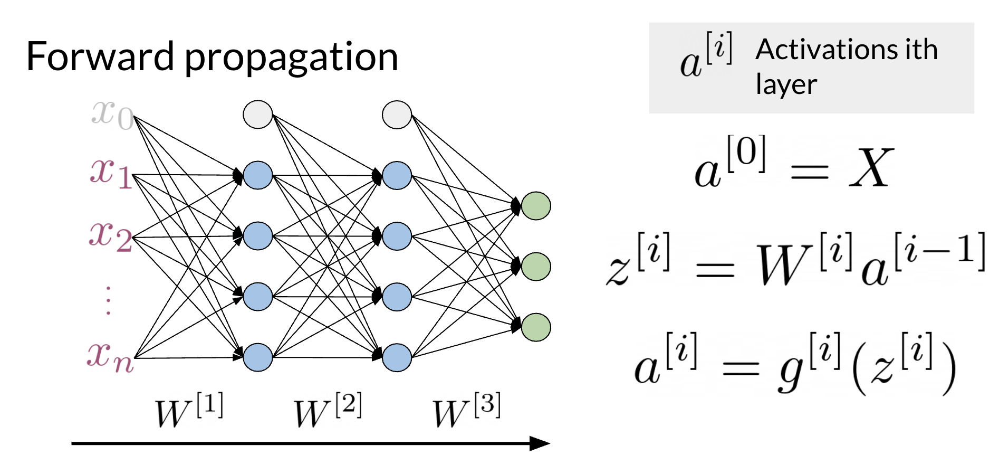
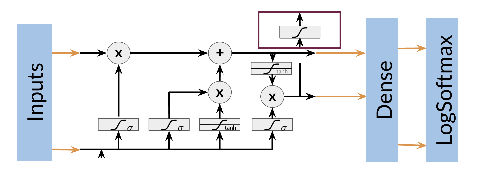
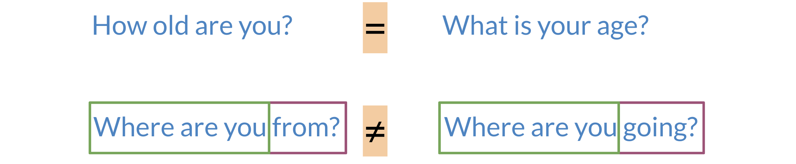
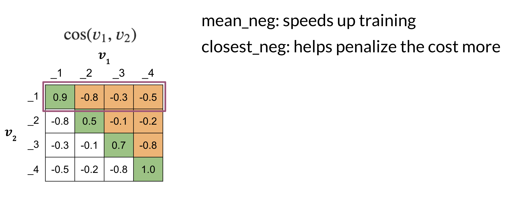

# NLP Specialization - Course 3

# Natural Language Processing With Sequence Models

Note 2024-01-24T11.53.54

========================
## Week 1 Recurrent Neural Networks for Language Modeling

Learn about the limitations of traditional language models and see how RNNs and GRUs use sequential data for text prediction. Then build your own next-word generator using a simple RNN on Shakespeare text data!  

**Learning Objectives**

    Supervised machine learning
    Binary classification
    Neural networks
    N-grams
    Gated recurrent units
    Recurrent neural networks

### Lesson Introduction Clarification

The first lesson of this week is here for you to remember how neural networks work and to revisit the problem of classification that you have already seen in previous courses. This lesson has no graded assignment and is here to give you a more gentle transition from traditional NLP techniques in the previous courses to the sequence-based models in this course. There is a practice assignment, which you can do for fun (it calculates the grade, but the grade doesn't count towards your final grade). This lesson also includes an "Introduction to TensorFlow" notebook, where you can refresh your TensorFlow skills, which you will need in the assignments in this course and course four of this specialization. The sequential models start in the second lesson of this week and also include a graded assignment. Have fun!

### Neural Networks for Sentiment Analysis

Previously in the course you did sentiment analysis with logistic regression and naive Bayes. Those models were in a sense more naive, and are not able to catch the sentiment off a tweet like: "I am not happy " or "If only it was a good day". When using a neural network to predict the sentiment of a sentence, you can use the following. Note that the image below has three outputs, in this case you might want to predict, "positive", "neutral ", or "negative". 

Note that the network above has three layers. To go from one layer to another you can use a WW matrix to propagate to the next layer. Hence, we call this concept of going from the input until the final layer, forward propagation. To represent a tweet, you can use the following: 

Note, that we add zeros for padding to match the size of the longest tweet. 

 A neural network in the setup you can see above can only process one such tweet at a time. In order to make training more efficient (faster) you want to process many tweets in parallel. You achieve this by putting many tweets together into a matrix and then passing this matrix (rather than individual tweets) through the neural network. Then the neural network can perform its computations on all tweets at the same time.
 
### Dense Layers and ReLU

The Dense layer is the computation of the inner product between a set of trainable weights (weight matrix) and an input vector.  The visualization of the dense layer can be seen in the image below. 

The orange box in the image above shows the dense layer. An activation layer is the set of blue nodes shown with the orange box in the image below. Concretely one of the most commonly used activation layers is the rectified linear unit (ReLU).

ReLU(x) is defined as max(0,x) for any input x. 

### Embedding and Mean Layers

Using an embedding layer you can learn word embeddings for each word in your vocabulary as follows: 

The mean layer allows you to take the average of the embeddings. You can visualize it as follows: 

This layer does not have any trainable parameters. 

### Traditional Language models

Traditional language models make use of probabilities to help identify which sentence is most likely to take place. 

In the example above, the second sentence is the one that is most likely to take place as it has the highest probability of happening. To compute the probabilities, you can do the following: 

Large N-grams capture dependencies between distant words and need a lot of space and RAM. Hence, we resort to using different types of alternatives. 

### Recurrent Neural Networks

Previously, we tried using traditional language models, but it turns out they took a lot of space and RAM.  For example, in the sentence below: 

An N-gram (trigram) would only look at "did not" and would try to complete the sentence from there. As a result, the model will not be able to see the beginning of the sentence "I called her but she". Probably the most likely word is have after "did not". RNNs help us solve this problem by being able to track dependencies that are much further apart from each other. As the RNN makes its way through a text corpus, it picks up some information as follows: 

Note that as you feed in more information into the model, the previous word's retention gets weaker, but it is still there. Look at the orange rectangle above and see how it becomes smaller as you make your way through the text. This shows that your model is capable of capturing dependencies and remembers a previous word although it is at the beginning of a sentence or paragraph. Another advantage of RNNs is that a lot of the computation shares parameters. 

### Application of RNNs

RNNs could be used in a variety of tasks ranging from machine translation to caption generation. There are many ways to implement an RNN model:

    One to One: given some scores of a championship, you can predict the winner. 

    One to Many: given an image, you can predict what the caption is going to be.

    Many to One: given a tweet, you can predict the sentiment of that tweet. 

    Many to Many: given an english sentence, you can translate it to its German equivalent. 

In the next video, you will see the math in simple RNNs. 

### Math in Simple RNNs

It is best to explain the math behind a simple RNN with a diagram: 

Note that:

h<t>=g(Wh[h<t−1>,x<t>]+bh)

h<t>=gs(Wh​[h<t−1>,x<t>]+bh​)

Is the same as multiplying Whh​ by h and Whx​ by x. In other words, you can concatenate it as follows: 

h<t>=g(Whh h<t−1>⊕Whx x<t>+bh)

h<t>=g(Whh ​h<t−1>⊕Whx ​x<t>+bh​)

For the prediction at each time step, you can use the following: 

y^<t>=g(Wyhh<t>+by)

Note that you end up training Whh,Whx,Wyh,bh,byWhh​,Whx​,Wyh​,bh​,by​. Here is a visualization of the model.

### Cost Function for RNNs

The cost function used in an RNN is the cross entropy loss. If you were to visualize it

you are basically summing over the all the classes and then multiplying yjyj​ times log⁡y^jlogy^​j​. If you were to compute the loss over several time steps, use the following formula: 

J=−1T∑t=1T∑j=1Kyj<t>log⁡y^j<t>J=−T1​∑t=1T​∑j=1K​yj<t>​logy^​j<t>​

Note that we are simply summing over all the time steps and dividing by T, to get the average cost in each time step. Hence, we are just taking an average through time.

### Implementation Note

The scan function is built as follows: 

Note, that is basically what an RNN is doing. It takes the initializer, and returns a list of outputs (ys), and uses the current value, to get the next y and the next current value. These type of abstractions allow for much faster computation. 

### Gated Recurrent Units

Gated recurrent units are very similar to vanilla RNNs, except that they have a "relevance" and "update" gate that allow the model to update and get relevant information. I personally find it easier to understand by looking at the formulas:

To the left, you have the diagram and equations for a simple RNN. To the right, we explain the GRU. Note that we add 3 layers before computing h and y.

Γu=σ(Wu[h<t0>,x<t1>]+bu)

Γr=σ(Wr[h<t0>,x<t1>]+br)

h′<t1>=tanh⁡(Wh[Γr∗h<t0>,x<t1>]+bh)

The first gate ΓuΓu​ allows you to decide how much you want to update the weights by. The second gate ΓrΓr​, helps you find a relevance score. You can compute the new hh by using the relevance gate. Finally you can compute h, using the update gate. GRUs “decide” how to update the hidden state. GRUs help preserve important information.

### Deep and Bi-directional RNNs

Bi-directional RNNs are important, because knowing what is next in the sentence could give you more context about the sentence itself. 

So you can see, in order to make a prediction y^y^​, you will use the hidden states from both directions and combine them to make one hidden state, you can then proceed as you would with a simple vanilla RNN. When implementing Deep RNNs, you would compute the following.  

Note that at layer l, you are using the input from the bottom a[l−1]a[l−1] and the hidden state hlhl.  That allows you to get your new h, and then to get your new a, you will train another weight matrix WaWa​, which you will multiply by the corresponding h add the bias and then run it through an activation layer. 

### Calculating Perplexity

You have learned about perplexity in the previous course of this specialization. If you want to refresh your memory on how perplexity works before starting with the next lab, you can watch the video below.

## Week 2 LSTMs  And Named Entity Recognition

Learn about how long short-term memory units (LSTMs) solve the vanishing gradient problem, and how Named Entity Recognition systems quickly extract important information from text. Then build your own Named Entity Recognition system using an LSTM and data from Kaggle!

**Learning Objectives**

    Vanishing gradients
    Named entity recognition
    LSTMs
    Feature extraction
    Part-of-speech tagging
    Data generator

### RNNs and Vanishing Gradients

#### Advantages of RNNs

RNNs allow us to capture dependencies within a short range and they take up less RAM than other n-gram models. 

#### Disadvantages of RNNs

RNNs struggle with longer term dependencies and are very prone to vanishing or exploding gradients.

Note that as you are back-propagating through time, you end up getting the following: 

Note that the sigmoid and tanh functions are bounded by 0 and 1 and -1 and 1 respectively. This eventually leads us to a problem. If you have many numbers that are less than |1|, then as you go through many layers, and you take the product of those numbers, you eventually end up getting a gradient that is very close to 0. This introduces the problem of vanishing gradients. 

#### Solutions to Vanishing Gradient Problems

### Introduction to LSTMs

The LSTM allows your model to remember and forget certain inputs. It consists of a cell state and a hidden state with three gates. The gates allow the gradients to flow unchanged. You can think of the three gates as follows: 

**Input gate:**  tells you how much information to input at any time point. 

**Forget gate:**  tells you how much information to forget at any time point. 

**Output gate:**  tells you how much information to pass over at any time point. 

There are many applications you can use LSTMs for, such as:

Here's a [classic post on LSTMs](https://colah.github.io/posts/2015-08-Understanding-LSTMs/)
 with intuitive explanations and diagrams, to complement this week's material.
 

###  LSTM Architecture

The LSTM architecture could get complicated and don't worry about it if you do not understand it. I personally prefer looking at the equation, but I will try to give you a visualization for now and later this week we will take a look at the equations.  

Note the forget gate (1), input gate (2) and output gate (3) marked in blue. In contrast with vanilla RNNs, there is the cell state in addition to the hidden state. The idea of the forget gate to drop the information that is no longer important. It makes use of the previous hidden state h<t0>h<t0​> and the input x<t1>x<t1​>. The input gate makes sure to keep the relevant information that needs to be stored. Finally the output gate creates an output that is used at the current step.

**LSTM equations (optional):**

For better understanding, take a look at the LSTM equations and relate them to the figure above.

The forget gate: f=σ(Wf[ht−1;xt]+bf) (marked with a blue 1)

The input gate: i=σ(Wi[ht−1;xt]+bi) (marked with a blue 2)

The gate gate (candidate memory cell): g=tanh⁡(Wg[ht−1;xt]+bg)

The cell state:  ct=f⊙ct−1+i⊙g

The output gate: o=σ(Wo[ht−1;xt]+bo)  (marked with a blue 3)

The output of LSTM unit:  ht=ot⊙tanh(ct)

### Introduction to Named Entity Recognition

Named Entity Recognition (NER) locates and extracts predefined entities from text. It allows you to find places, organizations, names, time and dates. Here is an example of the model you will be building: 

NER systems are being used in search efficiency, recommendation engines, customer service, automatic trading, and many more. 

### Training NERs: Data Processing

Processing data is one of the most important tasks when training AI algorithms. For NER, you have to:

    Convert words and entity classes into arrays: 

    Pad with tokens: Set sequence length to a certain number and use the <PAD> token to fill empty spaces

    Create a data generator:

Once you have that, you can assign each class a number, and each word a number.

Training an NER system: 

1. Create a tensor for each input and its corresponding number 

2.  Put them in a batch ==> 64, 128, 256, 512 ...

3. Feed it into an LSTM unit

4. Run the output through a dense layer

5. Predict using a log softmax over K classes

Here is an example of the architecture: 

Note that this is just one example of an NER system. You can have different architectures. 

### Computing Accuracy

To compare the accuracy, just follow the following steps:

    Pass test set through the model 

    Get arg max across the prediction array

    Mask padded tokens

    Compare with the true labels. 
    
    

## Week 3 Siamese Network

Learn about Siamese networks, a special type of neural network made of two identical networks that are eventually merged together, then build your own Siamese network that identifies question duplicates in a dataset from Quora.

**Learning Objectives**

    One shot learning
    Triplet loss
    Cosine similarity
    Siamese networks
    Data generators
### Siamese Network

It is best to describe what a Siamese network is through an example. 

Note that in the first example above, the two sentences mean the same thing but have completely different words. While in the second case, the two sentences mean completely different things but they have very similar words. 

**Classification:** learns what makes an input what it is.

**Siamese Networks:** learns what makes two inputs the same

Here are a few applications of siamese networks: 

### Architecture

Architecture

The model architecture of a typical siamese network could look as follows: 

These two sub-networks are sister-networks which come together to produce a similarity score. Not all Siamese networks will be designed to contain LSTMs. One thing to remember is that sub-networks share identical parameters. This means that you only need to train one set of weights and not two. 

The output of each sub-network is a vector. You can then run the output through a cosine similarity function to get the similarity score. In the next video, we will talk about the cost function for such a network.

### Cost Function

Take a close look at the following slide: 

Note that when trying to compute the cost for a siamese network you use the triplet loss. The triplet loss looks at an Anchor, a Positive and a Negative example   It's important to note that you aim to adjust the model's weights in a way that the anchor and the positive example have a cosine similarity score close to 1. Conversely, the anchor and the negative example should have a cosine similarity score close to -1. More concretely, you seek to minimize the following equation:  n: 

−cos⁡(A,P)+cos⁡(A,N)≤0    

Note that if cos⁡(A,P)=1cos(A,P)=1 and cos⁡(A,N)=−1cos(A,N)=−1, then the equation is definitely less than 0. However, as cos(A,P) deviates from 1 and cos(A,N) deviates from -1, then you can end up getting a cost that is > 0. Here is a visualization that would help you understand what is going on. Feel free to play with different numbers. 

### Triplets

To get the full cost function you will add a margin to the previous cost function. 

Note the α in the equation above, which represents the margin. This allows you to have some "safety", when comparing the sentences.  When computing the full cost, you take the max of the outcome of −cos⁡(A,P)+cos⁡(A,N)+α and 0. Note, we do not want to take a negative number as a cost. 

Here is a quick summary:

    𝜶: controls how far cos(A,P) is from cos(A,N)

    Easy negative triplet: cos(A,N) < cos(A,P)

    Semi-hard negative triplet:  cos(A,N) < cos(A,P) < cos(A,N) + 𝜶 

    Hard negative triplet: cos(A,P) < cos(A,N)

### Computing the Cost I

To compute the cost, you prepare the batches as follows: 

Note that each example on the left has a similar example to its right, but no other example above or below it means the same thing. 

Then you can calculate the similarity matrix between each possible pair from the left and right columns.

The diagonal line corresponds to scores of similar sentences, (normally they should be positive). The off-diagonals correspond to cosine scores between the anchor and the negative examples. 

### Computing the Cost II

Now that you have the matrix with cosine similarity scores, which is the product of two matrices, we go ahead and compute the cost. 

We now introduce two concepts, the mean_neg, which is the mean negative of all the other off diagonals in the row, and the closest_neg, which corresponds to the highest number in the off diagonals. 

Cost⁡=max⁡(−cos⁡(A,P)+cos⁡(A,N)+α,0)

So we will have two costs now: 

Cost1⁡=max⁡(−cos⁡(A,P)+mean_neg)+α,0)

Cost2⁡=max⁡(−cos⁡(A,P)+closest_neg+α,0)

The full cost is defined as: Cost 1 + Cost 2. 

### One Shot Learning

Imagine you are working in a bank and you need to verify the signature of a check. You can either build a classifier with K possible signatures as an output or you can build a classifier that tells you whether two signatures are the same. 

Hence, we resort to one shot learning. Instead of retraining your model for every signature, you can just learn a similarity score as follows: 

### Training / Testing

After preparing the batches of vectors, you can proceed to multiplying the two matrices. Here is a quick recap of the first step: 

The next step is to implement the siamese model as follows: 

Finally when testing: 

    Convert two inputs into an array of numbers

    Feed it into your model

    Compare 𝒗1,𝒗2 using cosine similarity

    Test against a threshold ττ
    
    

