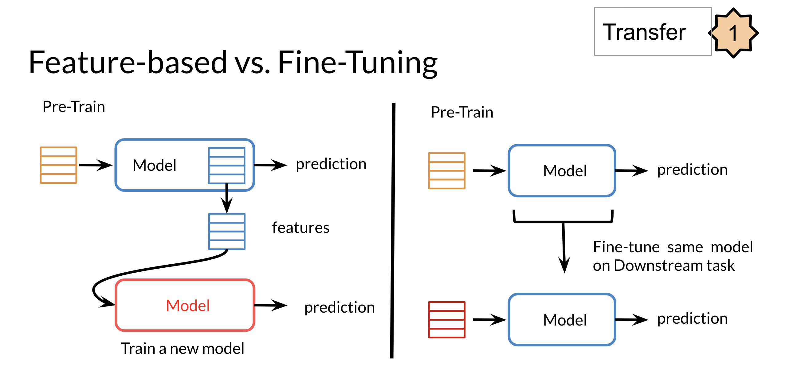
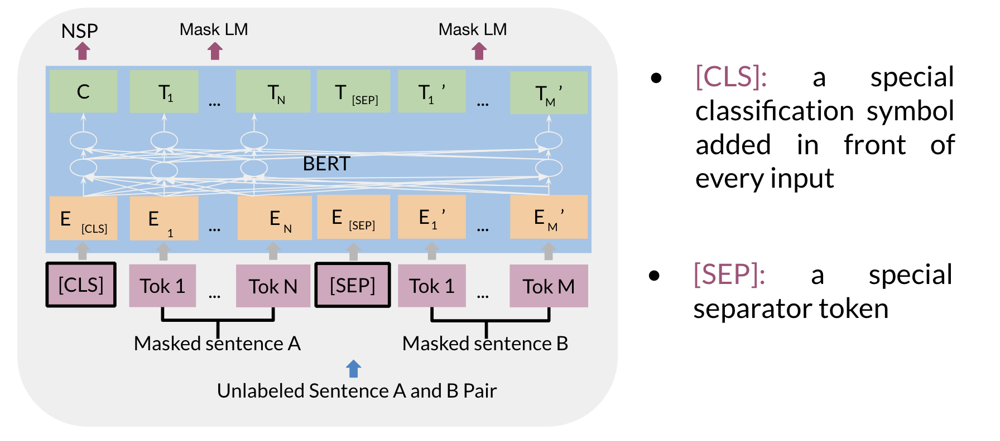
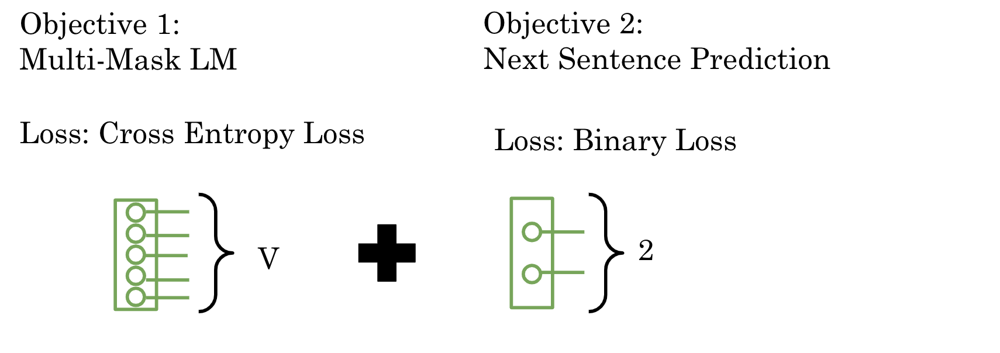
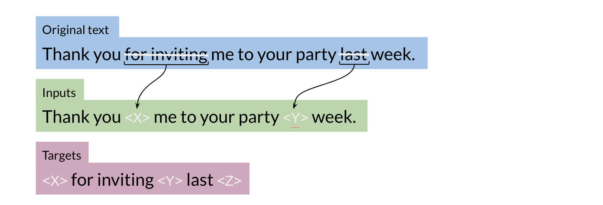

# NLP Specialization - Course 4

# Natural Language Processing With Attention Models

Note 2024-02-12T09.53.39

========================
## Week 1 Neural Machine Translation

Discover some of the shortcomings of a traditional seq2seq model and how to solve for them by adding an attention mechanism, then build a Neural Machine Translation model with Attention that translates English sentences into German.  

**Learning Objectives**

    Explain how an Encoder/Decoder model works
    Apply word alignment for machine translation
    Train a Neural Machine Translation model with Attention
    Develop intuition for how teacher forcing helps a translation model check its predictions
    Use BLEU score and ROUGE score to evaluate machine-generated text quality
    Describe several decoding methods including MBR and Beam search

### Week Introduction

### Week Introduction: Machine Translation with Attention

This week focuses on machine translation with attention, a technique enabling the translation of text from one language to another. While implementing machine translation using a recurrent neural network (RNN) with Long Short-Term Memory (LSTM) cells can suffice for short to medium-length sentences, it may encounter issues such as vanishing gradients for longer sequences. To address this limitation, an attention mechanism is introduced, allowing the decoder to access all relevant parts of the input sentence irrespective of its length.

##### Implementing Machine Translation with Attention

- Traditional approaches using LSTM for machine translation.
- Challenges with vanishing gradients for longer sequences.
- Introduction of attention mechanism to mitigate these challenges.
- Accessing relevant parts of the input sentence regardless of length.

##### Types of Attention

- Various types of attention mechanisms explored later in the course.
- Introduction to LSTM with a simple attention for this week's tasks.

##### Decoding Strategies

- Greedy decoding: Sequentially selecting the most likely word at each step.
- Random sampling: Randomly selecting words based on their probabilities.
- Beam search: Maintaining a fixed number of candidate translations.

##### Handling Bias and Risks in Translation

- Minimum bias risk when predicting the next word in a translated sentence.
- Techniques to ensure balanced translation outputs.

#### Learning Session Overview

- Exploring the implementation of machine translation with attention.
- Introduction to various decoding strategies: greedy, random sampling, and beam search.
- Understanding the concept of minimum bias risk in translation.

#### Practical Demonstration

Yonas will provide a practical demonstration showcasing the functionality and efficacy of machine translation with attention using LSTM and simple attention mechanism.

### Seq2seq
### Seq2Seq Model for Neural Machine Translation

In this section, we delve into the Seq2Seq model, which is fundamental for neural machine translation (NMT). The Seq2Seq architecture comprises an encoder and a decoder, facilitating the translation from one language to another. Let's explore the architecture, its shortcomings, and the solutions leading to improved models used in this week's assignments.

**Introduction to Seq2Seq Model**

- The Seq2Seq model, introduced by Google in 2014, revolutionized NMT.
- It utilizes LSTMs or GRUs to handle variable-length sequences effectively.
- This model maps variable-length sequences to fixed-length memory, encoding the overall meaning of sentences.
- Both encoder and decoder are crucial components of the Seq2Seq model.

**Encoder in Seq2Seq**

- The encoder takes word tokens as input and returns its final hidden states.
- It typically consists of an embedding layer followed by an LSTM module.
- The embedding layer transforms word tokens into vectors for input to the LSTM module.
- At each step in the input sequence, the LSTM module receives inputs from the embedding layer and previous hidden states.
- The final hidden state encodes the overall meaning of the input sentence.

**Decoder in Seq2Seq**

- Similar to the encoder, the decoder comprises an embedding layer and an LSTM layer.
- The output word of one step serves as the input word for the next step.
- The LSTM hidden state is passed to the next step.
- The input sequence starts with a "start of sequence" token (SOS), followed by the predicted words generated sequentially.

**Limitations of Traditional Seq2Seq Model**

- The traditional Seq2Seq model suffers from the "information bottleneck."
- Fixed-length memory for hidden states restricts handling of long sequences.
- Lower model performance observed as sequence size increases.
- One fixed-size encoder hidden state struggles to compress longer sequences effectively.

**Introducing Attention Mechanism**

- To address the limitations, attention mechanism is introduced.
- Attention allows the model to focus on important words at each time step.
- It provides specific information for each input word, enabling the model to focus its attention during the decoding process.

**Conceptual Understanding of Attention**

- Attention can be visualized as a new layer that helps the model focus on relevant information.
- By providing information specific to each input word, attention guides the model's attention during decoding.

#### Conclusion

In conclusion, the Seq2Seq model forms the backbone of neural machine translation, but its fixed-length memory poses challenges with handling long sequences. The introduction of attention mechanism overcomes these limitations by allowing the model to focus on important words dynamically. This conceptual understanding sets the stage for further exploration into advanced NMT techniques.

### Seq2seq Model with Attention
### Seq2Seq Model with Attention

In this section, we delve deeper into the Seq2Seq model enhanced with attention mechanism, a pivotal concept enabling the model to focus on pertinent information during prediction tasks. Let's explore the motivation behind attention, its implementation, and its profound impact on machine translation and other domains.

**Introduction to Attention Mechanism**

- Attention mechanism revolutionizes sequence-to-sequence tasks by endowing models with the capability to selectively attend to different parts of the input sequence during each decoding step.
- Initially introduced in a seminal paper by Bahdanau, Cho, and Bengio, attention addresses the limitations of traditional Seq2Seq models, particularly their struggle with handling longer sequences and retaining relevant information throughout the encoding-decoding process.
- Unlike traditional models, where the final hidden state of the encoder serves as the sole context for the decoder, attention allows the decoder to dynamically focus on specific aspects of the input sequence based on their relevance to the current decoding step.

**Performance Comparison with Attention**

- Bleu score comparison provides empirical evidence of the superiority of attention-equipped models over traditional Seq2Seq architectures.
- Traditional models exhibit performance degradation as input sequence length increases, primarily due to their inability to effectively encode and retain information from longer sequences.
- Models augmented with attention, such as the RNNsearch variants, demonstrate superior performance across all sentence lengths, showcasing their ability to maintain translation accuracy even for lengthy inputs.

**Motivation for Attention**

- In traditional Seq2Seq models, the encoder's final hidden state encapsulates the entire input sequence's information, leading to an "information bottleneck" and hindering the model's ability to handle longer sequences effectively.
- Passing all encoder hidden states to the decoder proves inefficient due to memory constraints, necessitating a more selective approach to information retrieval.
- Attention mechanism addresses these challenges by allowing the model to dynamically allocate its attention to relevant parts of the input sequence, alleviating the burden of encoding the entire sequence into a single context vector.

**Implementation of Attention**

- Attention computation involves calculating alignment scores between the decoder's current hidden state and each of the encoder's hidden states, representing their respective relevance to the current decoding step.
- These alignment scores \( A \) are typically computed using a feedforward neural network, with the encoder and decoder hidden states serving as inputs. The learned weights of this network determine the importance of each encoder hidden state for the current decoding step.
- The alignment scores are then transformed into attention weights \( \alpha \) using the softmax function:
\[ \alpha_i = \frac{e^{a_i}}{\sum_{j=1}^{n} e^{a_j}} \]
where \( a_i \) represents the alignment score for the \( i \)-th encoder hidden state.
- Finally, the context vector \( C \) is generated by taking a weighted sum of the encoder hidden states, with the attention weights serving as the weighting coefficients:
\[ C = \sum_{i=1}^{n} \alpha_i \cdot h_i \]
where \( h_i \) represents the \( i \)-th encoder hidden state and \( n \) is the number of encoder hidden states.

**Importance of Attention**

- Attention mechanism empowers the model to focus selectively on relevant input information, thereby enhancing translation accuracy and overall performance.
- By dynamically adjusting its attention based on the current decoding context, the model can effectively handle longer sequences without suffering from information loss or degradation in performance.
- Weighted alignment scores guide the model's attention, allowing it to intelligently select and attend to the most salient parts of the input sequence at each decoding step, resulting in more accurate and contextually appropriate translations.

#### Conclusion

Attention mechanism represents a paradigm shift in sequence-to-sequence modeling, offering a dynamic and adaptive approach to information processing during translation tasks. By enabling the model to focus selectively on relevant input information, attention mechanism mitigates the limitations of traditional Seq2Seq models and significantly improves translation accuracy, especially for longer sequences. Understanding the principles and implementation of attention is essential for advancing machine translation and other sequence-to-sequence tasks in both research and practical applications.

### Background on seq2seq

Recurrent models typically take in a sequence in the order it is written and use that to output a sequence. Each element in the sequence is associated with its step in computation time tt. (i.e. if a word is in the third element, it will be computed at t3t3​). These models generate a sequence of hidden states htht​, as a function of the previous hidden state ht−1ht−1​ and the input for position t. 

The sequential nature of models you learned in the previous course (RNNs, LSTMs, GRUs) does not allow for parallelization within training examples, which becomes critical at longer sequence lengths, as memory constraints limit batching across examples. In other words, if you rely on sequences and you need to know the beginning of a text before being able to compute something about the ending of it, then you can not use parallel computing. You would have to wait until the initial computations are complete. This is not good, because if your text is too long, then 1) it will take a long time for you to process it and 2) you will lose a good amount of information mentioned earlier in the text as you approach the end.  

Therefore, attention mechanisms have become critical  for sequence modeling in various tasks, allowing modeling of dependencies without caring too much about their distance in the input or output sequences. 

In this course, you will learn about these attention mechanisms and see how they are implemented. Welcome to Course 4!

### Queries, Keys, Values, and Attention
### Queries, Keys, Values, and Attention

In this section, we explore the fundamental concepts of attention mechanism, particularly focusing on queries, keys, and values, and their role in facilitating efficient information retrieval and alignment during translation tasks. Let's delve into the intricacies of these concepts and their application within the context of machine translation.

**Introduction to Attention Mechanism**

- Attention mechanism, introduced in the seminal paper of 2014, has since evolved with various models exploring non-recurrent neural network-based approaches.
- Notably, the Transformer model, introduced in the 2017 paper "Attention Is All You Need," revolutionized attention mechanisms by introducing efficient attention based on queries, keys, and values.
- This form of attention is employed extensively in this week's assignment, offering a powerful and efficient approach to information retrieval.

**Concept of Queries, Keys, and Values**

- Conceptually, queries, keys, and values can be likened to a lookup table, where a query is matched to a key, and the associated value is retrieved.
- In the context of machine translation, queries represent the current decoding context, while keys and values correspond to elements in the input sequence and their associated information.
- While queries, keys, and values are represented as vectors (typically embedding vectors) in practice, they allow the model to discern semantic similarities between source and target language words, facilitating alignment.

**Calculation of Alignment Scores and Attention Weights**

- Alignment scores quantify the similarity between queries and keys, determining their relevance.
- These scores are computed using a feedforward neural network, with the learned weights serving as indicators of alignment.
- Alignment scores are then transformed into attention weights using the softmax function, ensuring they form a probability distribution summing up to one.
- The attention vector is derived by taking a weighted sum of the value vectors, with the attention weights dictating the contribution of each value to the final attention vector.

**Implementation of Scale Dot-Product Attention**

- Scale dot-product attention, a variant of attention mechanism, involves efficient computation through matrix multiplications.
- Queries, keys, and values are packed into matrices, enabling simultaneous computation of attention for each query.
- Matrix multiplication operations are performed to obtain alignment scores, followed by scaling to improve model performance and softmax transformation to obtain attention weights.
- Finally, the attention vector is generated by multiplying the attention weights with the value matrices, providing contextually relevant information for each decoding step.

**Importance of Alignment in Translation**

- Alignment weights form a matrix representing the correspondence between source and target language words.
- Through training, the model learns semantic similarities and assigns appropriate weights to word pairs, irrespective of word order differences.
- This learned alignment is crucial for accurately translating between languages with diverse grammatical structures, ensuring that the decoder focuses on relevant input words during translation.

**Conclusion**

In conclusion, understanding the concepts of queries, keys, and values, and their role in attention mechanism is paramount for comprehending advanced neural machine translation models. By efficiently computing alignment scores and attention weights, these models can dynamically focus on pertinent information during translation tasks, resulting in improved accuracy and performance. Moreover, the learned alignments facilitate effective translation across languages with varying structures, demonstrating the versatility and efficacy of attention mechanisms in modern NLP tasks.

#### Mathematical Formulation of Attention Mechanism

The attention mechanism can be mathematically described as follows:

Given:
- Query matrix \( Q \) with dimensions \( (n_q \times d_q) \)
- Key matrix \( K \) with dimensions \( (n_k \times d_k) \)
- Value matrix \( V \) with dimensions \( (n_v \times d_v) \)

The alignment scores \( A \) are calculated as:
\[ A = QK^T \]

The scaled alignment scores \( S \) are obtained by dividing \( A \) by \( \sqrt{d_k} \):
\[ S = \frac{A}{\sqrt{d_k}} \]

Softmax operation is applied to obtain attention weights \( \alpha \):
\[ \alpha = \text{softmax}(S) \]

Finally, the attention vector \( \text{Att} \) is computed as the weighted sum of value vectors:
\[ \text{Att} = \alpha V \]

This process efficiently computes attention without relying on recurrent neural networks, making it highly optimized for modern deep learning frameworks.

### Setup for Machine Translation
### Setup for Machine Translation

In this section, we will delve into the setup for neural machine translation, focusing on how words are represented and organized within the dataset. We will also discuss the essential steps involved in preprocessing the data and initializing the model for training.

**Representation of Words**

- In the neural machine translation setting, words are typically represented as vectors. One common approach is to use pretrained word vectors, although one-hot vectors are also employed, especially in the absence of pretrained embeddings.
- The first step in preprocessing the data involves mapping each word to a unique index and vice versa. This mapping is maintained using dictionaries, such as word-to-index and index-to-word dictionaries.
- Given any input sentence, it is transformed into indices using the word-to-index dictionary, facilitating input processing during training. Conversely, predictions are converted back into words using the index-to-word dictionary.

**Handling Sequence End and Padding**

- To signify the end of a sequence, an end-of-sequence (EOS) token is appended to each sentence. This token is crucial for signaling the model when a sentence ends during decoding.
- Additionally, to ensure uniformity in input dimensions, token vectors are padded with zeros to match the length of the longest sequence in the dataset. Padding ensures that all sequences have the same length, facilitating batch processing during training.

**Example Data Representation**

- An example dataset comprises English sentences paired with their corresponding French translations. Each sentence is tokenized and represented as a sequence of indices, with an EOS token appended at the end.
- The tokenized sequences are then padded with zeros to match the length of the longest sequence in the dataset.

**Initialization and Training**

- With the dataset structured and tokenized, and the model initialized with appropriate word embeddings, training can commence. During training, the model learns to generate accurate translations by iteratively updating its parameters to minimize a predefined loss function.
- State-of-the-art models often leverage pretrained embeddings, fine-tuning them during training to adapt to the specific translation task at hand.

**Conclusion**

In conclusion, setting up a neural machine translation system involves preprocessing the dataset, representing words as vectors, handling sequence end and padding, and initializing the model for training. By following these steps meticulously, researchers and practitioners can train robust translation models capable of generating accurate and contextually appropriate translations.

#### Next Steps

With a clear understanding of data preprocessing and model initialization, you are now equipped to embark on training your translation model. In the next video, we will delve into the practical aspects of training a neural machine translation system, guiding you through the training process step by step.

### Teacher Forcing

### Teacher Forcing in Neural Machine Translation

In this section, we will explore the concept of teacher forcing and its role in training neural machine translation (NMT) systems. Teacher forcing is a crucial technique used during training to improve the accuracy and efficiency of NMT models. Let's delve into its definition, advantages, and variations.

**Introduction to Teacher Forcing**

- Teacher forcing is a training technique commonly used in sequence prediction tasks, such as machine translation, where the output of the decoder at each time step is fed back into the model as the next input.
- Traditionally, during training, the model's output sequence is compared with the target sequence to calculate the loss, typically using cross-entropy loss.

**Challenges with Traditional Training Approach**

- In practice, comparing the decoder's output directly with the target sequence can lead to suboptimal results, especially in the early stages of training when the model is naive and prone to making incorrect predictions.
- As training progresses, the errors made by the model accumulate, resulting in divergent translations that deviate significantly from the target sequence.

**Advantages of Teacher Forcing**

- Teacher forcing addresses the aforementioned challenges by using the ground truth words from the target sequence as inputs to the decoder during training, rather than relying solely on the model's own predictions.
- By providing the correct inputs to the decoder, even when the model makes incorrect predictions, teacher forcing accelerates training and stabilizes learning, leading to faster convergence and improved translation accuracy.

**Variations of Teacher Forcing**

- Curriculum Learning: A variation of teacher forcing involves gradually transitioning from using ground truth words to decoder outputs as inputs during training. This approach allows the model to learn progressively complex patterns and dependencies over time, leading to more robust performance.
- Scheduled Sampling: Another variation involves introducing randomness into the decision of whether to use ground truth words or decoder outputs as inputs during training. This stochastic approach prevents the model from overfitting to the training data and encourages generalization.

**Conclusion**

Teacher forcing is a valuable technique in the training arsenal of NMT practitioners, offering a pragmatic solution to the challenges associated with sequence prediction tasks. By leveraging ground truth words as inputs during training, teacher forcing accelerates learning, enhances model stability, and improves translation accuracy. Additionally, variations such as curriculum learning and scheduled sampling provide further flexibility and performance benefits.

#### Next Steps

With a solid understanding of teacher forcing and its variants, you are now equipped to integrate this technique into your NMT training pipeline. In the next section, we will explore practical implementation strategies for training NMT models using teacher forcing, guiding you through the process step by step.

### NMT Model with Attention
  
### Neural Machine Translation (NMT) Model with Attention

In this section, we will delve into the architecture of a neural machine translation system enhanced with attention mechanism. We'll provide a detailed overview of how the components fit together and the rationale behind each step of the model.

**Overview of Model Architecture**

- The NMT model comprises three main components: an encoder, a pre-attention decoder, and a post-attention decoder, with attention mechanism facilitating information flow between them.
- The encoder processes the input sequence, while the pre-attention decoder prepares the target sequence for translation. The attention mechanism dynamically focuses on relevant parts of the input sequence during translation.
- To simplify the implementation of information flow from the decoder to the attention mechanism, two decoders are employed: a pre-attention decoder for providing hidden states and a post-attention decoder for generating the translation.
- A high-level view of the model structure involves feeding the input and target sequences into the encoder and pre-attention decoder, respectively. Hidden states from both components are utilized by the attention mechanism to compute context vectors, which are then used by the post-attention decoder to generate the translated sequence.

**Model Components**

1. **Encoder and Pre-Attention Decoder**:
   - The encoder processes the input sequence and generates key and value vectors, while the pre-attention decoder prepares the target sequence for translation.
   - Input and target tokens are embedded before being passed through LSTM layers in both the encoder and pre-attention decoder.
   - The input tokens are used to derive key and value vectors, while the target tokens are shifted right and augmented with a start-of-sentence token.

2. **Attention Mechanism**:
   - The attention mechanism computes context vectors using query, key, and value vectors.
   - A padding mask is generated using a function to help the attention layer identify padding tokens, aiding in computation efficiency.
   - Queries are derived from decoder hidden states, while keys and values are obtained from encoder hidden states.
   - The attention layer outputs context vectors, which are subsequently passed to the post-attention decoder.

3. **Post-Attention Decoder**:
   - The post-attention decoder consists of an LSTM layer, a dense layer, and a LogSoftmax activation.
   - Context vectors serve as inputs to the post-attention decoder, which generates log probabilities for the translated sequence.

**Model Training and Evaluation**

- During training, teacher forcing is employed, where ground truth words from the target sequence are used as inputs to the decoder.
- Evaluation metrics, such as BLEU score, are commonly used to assess the performance of the trained model against reference translations.

**Conclusion**

The NMT model with attention represents a sophisticated yet intuitive approach to machine translation, leveraging attention mechanism to dynamically focus on relevant parts of the input sequence. By breaking down the translation process into encoder, decoder, and attention components, the model achieves improved accuracy and fluency in translations.

#### Next Steps

With a comprehensive understanding of the NMT model architecture, you are well-equipped to proceed with implementation and training. In the subsequent section, we will discuss evaluation strategies for assessing the performance of your NMT system. Stay tuned!

### BLEU Score

### BLEU Score: Evaluating Machine Translation

After training your machine translation model, it's crucial to assess its performance using appropriate metrics. One such metric is the Bilingual Evaluation Understudy (BLEU) score, specifically designed for evaluating machine translation outputs. Let's delve into what the BLEU score entails and discuss its importance, computation, and limitations.

**Understanding BLEU Score**

- **Definition**: BLEU score quantifies the quality of a machine-translated text by comparing it against one or more reference translations, typically created by humans.
  
- **Scoring Range**: The BLEU score ranges from 0 to 1, where a score closer to 1 indicates higher translation quality and fidelity to the references.

- **Calculation**: BLEU score is computed based on precision of n-grams (usually up to 4-grams) in the candidate translation compared to the reference translations.

**Computing BLEU Score**

- **Precision Calculation**: For each n-gram in the candidate translation, count how many times it appears in any of the reference translations. Divide this count by the total number of n-grams in the candidate translation.
  
- **Example**: Consider a candidate translation composed of "I, I, am, I" and two reference translations: "Eunice said, I'm hungry" and "He said, I'm hungry". Compute precision for each n-gram (e.g., unigrams), summing up the counts of matching words in the references.

- **Vanilla BLEU Score**: In the standard computation, each occurrence of a word in the candidate is counted, even if it appears multiple times in the references. This can lead to inflated scores for translations containing common words.

**Modified BLEU Score**

- **Refinements**: To address this issue, a modified version of BLEU score can be employed, where each word in the reference is considered only once, even if it matches multiple words in the candidate.
  
- **Example**: Continuing from the previous example, after matching a word from the candidate to a reference, that word is removed from consideration for subsequent words in the candidate.

**Limitations of BLEU Score**

- **Semantic Meaning**: BLEU score solely focuses on lexical overlap and does not consider semantic equivalence or sentence structure.
  
- **Sentence Structure**: Translations with correct words but incorrect order or structure may still receive high BLEU scores, leading to misleading evaluations.

**Conclusion**

While BLEU score serves as a widely used evaluation metric for machine translation, it's essential to recognize its limitations. Understanding these drawbacks helps researchers and practitioners interpret results more accurately and explore complementary metrics to provide a more comprehensive assessment of model performance.

In the next video, we'll explore another evaluation metric for machine translation, offering additional insights into model performance. Stay tuned for further exploration!

### ROUGE-N Score
### ROUGE-N Score: Evaluating Machine Translation

In addition to the BLEU score, another important metric for evaluating machine translation systems is the Recall-Oriented Understudy for Gisting Evaluation (ROUGE) score. Let's explore what the ROUGE score entails, how it differs from BLEU, and how it can be used to assess translation quality.

**Understanding ROUGE Score**

- **Definition**: ROUGE is a family of evaluation metrics primarily designed to assess the quality of machine-generated summaries by comparing them against reference summaries provided by humans. However, it is also widely used for evaluating machine translation outputs.

- **Recall-Oriented**: Unlike BLEU, which is precision-oriented and focuses on word overlap between candidate translations and references, ROUGE is more concerned with how much of the human references appear in the candidate translation. It emphasizes recall by default.

**ROUGE-N Score Calculation**

- **Basic Idea**: ROUGE-N compares n-gram overlaps between candidate translations and reference translations. It operates similarly to BLEU but emphasizes recall.

- **Example**: Let's consider the ROUGE-N score based on unigrams (ROUGE-1). For each word in the candidate translation, count how many times it appears in any of the reference translations. Divide this count by the total number of words in the reference. Repeat this process for each reference translation and take the maximum value.

**F1 Score Integration**

- **Combining Metrics**: While ROUGE focuses on recall and BLEU focuses on precision, combining both metrics can provide a more comprehensive evaluation. The F1 score, derived from precision and recall, offers a balanced view of translation quality.

- **F1 Score Calculation**: The F1 score is computed using the formula \( \frac{2 \times \text{Precision} \times \text{Recall}}{\text{Precision} + \text{Recall}} \). By replacing precision with the modified version of the BLEU score and recall with the ROUGE-N score, you can obtain an F1 score that considers both precision and recall.

**Limitations and Considerations**

- **Semantic Meaning and Sentence Structure**: Like BLEU, ROUGE-N does not consider semantic meaning or sentence structure. It focuses solely on matching n-grams between candidate and reference translations.

**Conclusion**

While BLEU and ROUGE-N scores provide valuable insights into machine translation performance, it's essential to recognize their limitations, particularly regarding semantics and sentence structure. Combining these metrics with the F1 score can offer a more holistic assessment of translation quality. When evaluating machine translation systems, it's crucial to consider multiple metrics and interpret results with a nuanced understanding of their strengths and weaknesses.

### Sampling and Decoding
### Sampling and Decoding Strategies in Seq2Seq Models

In the final part of this week's lectures, we'll delve into two key methods for constructing sentences using seq2seq models: greedy decoding and random sampling. Let's explore the characteristics, pros, and cons of each approach, along with the concept of temperature in sampling.

**1. Greedy Decoding**

- **Definition**: Greedy decoding selects the most probable word at each step, resulting in a sequence of tokens generated by choosing the word with the highest probability at each time step.

- **Pros**:
  - Simple and straightforward.
  - Fast computation.

- **Cons**:
  - May lead to suboptimal results, especially for longer sequences.
  - Prone to repeating tokens, resulting in less diverse output.
  - Lack of exploration in the output space, potentially missing better alternatives.

**2. Random Sampling**

- **Definition**: Random sampling provides probabilities for each word, and the next output is sampled according to these probabilities.

- **Pros**:
  - Allows for more diverse and creative outputs.
  - Can capture alternative interpretations or word choices.

- **Cons**:
  - May produce overly random or nonsensical sequences.
  - Lack of control over the quality and coherence of the generated text.

**Temperature in Sampling**

- **Definition**: Temperature is a parameter used in sampling to control the level of randomness in predictions. It adjusts the softmax function output to scale the probabilities before sampling.

- **Low Temperature**:
  - Corresponds to low randomness.
  - Results in conservative, confident predictions.
  - Less exploration but more predictable outputs.

- **High Temperature**:
  - Corresponds to high randomness.
  - Results in more adventurous, exploratory predictions.
  - Increased likelihood of mistakes or nonsensical outputs.

**Conclusion**

While both greedy decoding and random sampling have their merits and drawbacks, they may not always produce the most convincing outputs. Greedy decoding offers simplicity and speed but may lack diversity and exploration. Random sampling introduces diversity but may generate overly random or nonsensical sequences. Adjusting the temperature parameter in sampling allows for fine-tuning the balance between exploration and exploitation in generating text. In the next videos, we'll explore additional methods for sampling and decoding that aim to address these limitations and produce more coherent outputs.  
  
### Beam Search

### Beam Search for Sequence Generation

Beam search is a technique commonly used in sequence generation tasks, such as machine translation, to find the most probable output sequence given an input sequence. It operates over a fixed window size known as the beam width. Let's delve into the details of beam search and its implementation:

**1. Introduction to Beam Search:**
   - Beam search is employed to find the most likely output sentence by considering a limited number of best sequences based on conditional probabilities at each time step.
   - Instead of exhaustively computing the probability of every possible output sequence, beam search uses a beam width parameter to retain only the most probable sequences.

**2. Implementation of Beam Search:**
   - At each time step, the probabilities of potential sequences are calculated based on the outputs of the previous time step.
   - The beam width determines how many sequences are retained at each step, discarding all others.
   - This process continues until all retained sequences reach the end-of-sequence token.
   - The sequence with the highest overall probability is chosen as the final output.

**3. Example of Beam Search:**
   - Consider a small vocabulary consisting of "I", "am", "hungry", and an end-of-sentence token.
   - If the beam width is 2, the model calculates probabilities for the first word in the sequence and retains the two highest probabilities.
   - Conditional probabilities for subsequent words are calculated given the retained sequences, and the process continues iteratively.
   - Only the sequences with the highest probabilities are kept at each step until the end-of-sequence token is predicted.

**4. Considerations and Challenges:**
   - Beam search penalizes the choice of longer sequences because the probability of a sequence is the product of multiple conditional probabilities.
   - Normalizing the probability of each sequence by its length can mitigate this issue.
   - Beam search requires storing the most probable sequences and computing conditional probabilities, which can be computationally expensive and memory-intensive.

**5. Conclusion:**
   - Beam search is a powerful tool for sequence generation tasks and has been widely used in natural language processing.
   - While vanilla beam search has some drawbacks, such as penalizing longer sequences and high computational costs, it remains an essential technique in the toolkit of sequence generation models.

In the next video, we'll explore another technique that addresses some of the limitations of beam search.

### Minimum Bayes Risk
### Minimum Bayes Risk (MBR) for NMT Evaluation

Minimum Bayes Risk (MBR) decoding is a technique used for evaluating neural machine translation (NMT) systems. It involves generating multiple candidate translations and selecting the one that maximizes the average similarity or minimizes the loss among all candidates. Here's a detailed overview:

**1. Introduction to MBR:**
   - MBR decoding improves upon random sampling by generating multiple samples and comparing them against each other.
   - The goal is to find a consensus or the translation closest to all candidate translations.

**2. Implementation of MBR:**
   - Generate several random samples of translations.
   - Compare each sample against every other sample using a similarity metric or loss function, such as ROUGE score.
   - Calculate the average similarity or loss for each sample.
   - Select the sample with the highest average similarity or lowest loss as the final translation.

**3. Steps for Implementing MBR:**
   - Calculate the similarity score (e.g., ROUGE score) between each pair of candidate translations.
   - Compute the average similarity score for each candidate by averaging the scores obtained in the previous step.
   - Select the candidate with the highest average similarity score as the final translation.

**4. Advantages of MBR:**
   - MBR provides a more contextually accurate translation compared to random sampling and greedy decoding.
   - It leverages multiple candidate translations to find the most consensus-based output.

**5. Conclusion:**
   - MBR is a straightforward yet effective technique for evaluating NMT systems.
   - By comparing multiple translations and selecting the one with the highest average similarity, MBR provides a more robust evaluation metric.

In summary, MBR decoding is a valuable technique for evaluating NMT systems, especially when considering the consensus among multiple candidate translations. It provides a more nuanced assessment of translation quality compared to simpler decoding methods.

## Week 2 Text Summarization

Compare RNNs and other sequential models to the more modern Transformer architecture, then create a tool that generates text summaries.
**Learning Objectives**
*
    Describe the three basic types of attention
    Name the two types of layers in a Transformer
    Define three main matrices in attention
    Interpret the math behind scaled dot product attention, causal attention, and multi-head attention
    Use articles and their summaries to create input features for training a text summarizer
    Build a Transformer decoder model (GPT-2)
    *

### Week 2: Introduction to the Transformer Network

Welcome to Week 2 of the course! This week, we will delve into the famous Transformer network, which was introduced in the groundbreaking paper titled "Attention is All You Need". Originally, the Transformer also incorporated convolutional layers, but it was discovered that they were unnecessary, and the network performs even better when it relies solely on attention mechanisms.

**Main Focus:**
- **Transformer Network:** You will explore the architecture and workings of the Transformer network, which is renowned for its effectiveness in various NLP tasks.
  
**Application in Summarization:**
- **Summarization Task:** This week's focus will be on using the Transformer network for text summarization, a crucial task in natural language processing with applications in both consumer and enterprise domains.
- **Use Cases:** Text summarization can be employed by bots to scrape articles and generate concise summaries. These summaries can then be analyzed for sentiment, providing insights into public opinion on various topics discussed in the articles.

**Types of Attention:**
- **Dot-Product Attention:** You will learn about different types of attention mechanisms employed in the Transformer, starting with dot-product attention.
- **Causal Attention:** Another attention mechanism you'll explore is causal attention, which is particularly useful for tasks like language modeling.
- **Encoder-Decoder Attention:** This attention mechanism enables the model to focus on relevant parts of the input sequence when generating output sequences.
- **Self-Attention:** Self-attention allows each word in a sequence to attend to all other words, capturing dependencies and relationships within the sequence.

**Learning Objectives:**
- Understand the architecture and components of the Transformer network.
- Learn how to apply the Transformer for text summarization tasks.
- Gain insights into different types of attention mechanisms and their roles in the Transformer model.

This week promises to be an exciting journey into the intricacies of the Transformer network and its applications in NLP tasks, particularly text summarization. Let's dive in and explore the fascinating world of attention-based models!

### Transformers vs RNNs
### Transformers vs RNNs: Addressing Problems with Sequential Models

Welcome to this lesson! Today, we'll delve into the issues encountered with recurrent neural networks (RNNs) and how the transformer model offers a solution to these challenges.

**Challenges with RNNs:**
1. **Sequential Processing:** RNNs process inputs sequentially, which leads to inefficiency and limits parallel computation.
2. **Information Propagation:** To propagate information from the first word to the last output, RNNs require processing through a fixed number of sequential steps (denoted as `T`).
3. **Vanishing Gradients:** As the length of input sequences increases, RNNs suffer from vanishing gradients and information loss. This is especially problematic for very long sequences, causing difficulties in capturing dependencies across distant tokens.

**Example of Sequential Processing:**
- In neural machine translation (NMT), RNNs process input sentences one word at a time, encoding and decoding sequentially. This sequential processing becomes a bottleneck, especially with longer sentences.

**Transformers:**
- **Attention Mechanism:** Transformers rely solely on attention mechanisms, eliminating the need for recurrent connections. Attention allows the model to focus on relevant parts of the input sequence, alleviating the issues of sequential processing and vanishing gradients.
- **All-Attention Model:** Transformers are built on the principle that "attention is all you need," as they leverage attention mechanisms for both encoding and decoding without the use of recurrent connections.

**Advantages of Transformers:**
1. **Parallel Computation:** Transformers enable parallel computation, making them more efficient than RNNs, especially for processing long sequences.
2. **Information Preservation:** Attention mechanisms in transformers facilitate better preservation of information across input sequences, mitigating the vanishing gradients problem encountered in RNNs.
3. **Contextual Understanding:** Transformers excel at capturing long-range dependencies and contextual relationships within sequences, making them well-suited for tasks requiring understanding of complex contexts.

**Conclusion:**
Transformers offer a powerful alternative to RNNs by addressing the limitations associated with sequential processing and vanishing gradients. Their reliance on attention mechanisms allows for parallel computation, better information preservation, and improved contextual understanding, making them highly effective for a wide range of natural language processing tasks.

In the next lesson, we'll dive deeper into the architecture and workings of transformers. Stay tuned!

### Transformers vs RNNs

In the image above, you can see a typical RNN that is used to translate the English sentence "How are you?" to its French equivalent, "Comment allez-vous?". One of the biggest issues with these RNNs, is that they make use of sequential computation. That means, in order for your code to process the word "you", it has to first go through "How" and "are". Two other issues with RNNs are the: 

    Loss of information: For example, it is harder to keep track of whether the subject is singular or plural as you move further away from the subject.

    Vanishing Gradient: when you back-propagate, the gradients can become really small and as a result,  your model will not be learning much. 

In contrast, transformers are based on attention and don't require any sequential computation per layer, only a single step is needed. Additionally, the gradient steps that need to be taken from the last output to the first input in a transformer is just one. For RNNs, the number of steps increases with longer sequences. Finally, transformers don't suffer from vanishing gradients problems that are related to the length of the sequences. 

We are going to talk more about how the attention component works with transformers. So don't worry about it for now :) 

### Transformers overview
### Overview of Transformer Model

Welcome to this overview of the transformer model! Let's dive into the key components and workings of this revolutionary architecture.

**Introduction:**
- The transformer model was introduced in 2017 by researchers at Google, and it has since become the standard for large language models, including BERT, T5, and GPT-3.
- It revolutionized natural language processing (NLP) by offering an alternative to recurrent neural networks (RNNs) and addressing their limitations.

**Core Components:**
1. **Scaled Dot-Product Attention:** The transformer model relies on scaled dot-product attention, which you learned about in the first week of this course. This attention mechanism is efficient computationally and memory-wise, making it the core of the transformer architecture.
  
2. **Multi-Head Attention Layer:** The multi-head attention layer in the transformer model runs in parallel and consists of multiple scaled dot-product attention mechanisms. It performs linear transformations on input queries, keys, and values, allowing the model to capture complex relationships within the input sequence.

3. **Encoder and Decoder:** The transformer model comprises both an encoder and a decoder. The encoder employs multi-head attention to perform self-attention on the input sequence, followed by feedforward layers and residual connections. The decoder, similar to the encoder, utilizes multi-head attention but with additional masking to attend only to previous positions. It also incorporates an attention mechanism to allow the decoder to attend to encoder outputs.

4. **Positional Encoding:** Since transformers don't use recurrent connections, preserving the order of words in the input sequence is crucial. Positional encoding is applied to retain positional information, ensuring that the model understands the sequential nature of the input. These positional encodings are added to word embeddings to incorporate positional information.

**Model Architecture:**
- The full model architecture comprises an encoder and a decoder. The input sentence is first embedded, and positional encodings are applied. The encoder consists of multiple layers of multi-head attention modules, while the decoder takes the encoder outputs and performs masked attention to generate the output sequence. The architecture can be efficiently parallelized, making it suitable for training on multiple GPUs and scaling up to handle large datasets and multiple tasks.

**Advantages of Transformers:**
- Transformers offer several advantages over RNNs, including better parallelization, more efficient training, and improved handling of long-range dependencies. They have become indispensable in NLP and other fields processing sequential data.

**Conclusion:**
- The transformer model represents a significant advancement in NLP, offering a powerful alternative to RNNs. Its ability to capture complex relationships within input sequences and handle long-range dependencies makes it highly effective for a wide range of tasks.

In the next video, we'll explore some of the applications of transformers in more detail. Stay tuned!

### Transformer Applications
### Applications of Transformers in NLP

Transformers have become a cornerstone in natural language processing (NLP), offering versatile solutions to a wide range of tasks. Let's explore some of the key applications and notable transformer models in NLP:

1. **Popular Applications:**
   - **Automatic Text Summarization:** Summarizing large texts into concise summaries.
   - **Autocompletion:** Predicting and suggesting completions for partially typed text.
   - **Named Entity Recognition:** Identifying and classifying named entities (e.g., persons, organizations) in text.
   - **Question Answering:** Providing accurate answers to questions posed in natural language.
   - **Machine Translation:** Translating text from one language to another.

2. **Notable Transformer Models:**
   - **GPT (Generative Pre-training Transformer):** Developed by OpenAI, GPT-2 is a transformer model known for its text generation capabilities. It has been trained on vast amounts of text data and can generate human-like text.
   - **BERT (Bidirectional Encoder Representations from Transformers):** Developed by Google AI, BERT is a pre-trained transformer model capable of understanding context and bidirectional relationships in text. It has achieved state-of-the-art results in various NLP tasks.
   - **T5 (Text-to-Text Transfer Transformer):** Also developed by Google, T5 is a multitask transformer capable of performing multiple NLP tasks, including translation, classification, and question answering. It learns to perform these tasks from input-output pairs in a unified framework.

3. **T5 Model Overview:**
   - **Multitask Capability:** T5 can learn to perform multiple tasks within a single model. Instead of training separate models for each task, T5 can handle tasks such as translation, classification, and question answering simultaneously.
   - **Input Specification:** To instruct T5 on the desired task, the input includes both the task description and the input data. For example, to perform translation, the input specifies the source language, target language, and input text.
   - **Example Tasks:** T5 can perform tasks like translation, classification, question answering, regression, and summarization. Each task is specified in the input string, enabling T5 to adapt its behavior accordingly.

4. **Examples of T5 Tasks:**
   - **Translation:** Input string specifies the source and target languages, allowing T5 to translate the provided text.
   - **Classification:** Input string starts with a command (e.g., "classify") followed by the text to classify, enabling T5 to classify text into predefined categories.
   - **Question Answering:** Input string starts with a command (e.g., "question") followed by the question, prompting T5 to provide the answer based on the given context.
   - **Regression:** Input string starts with a command (e.g., "Stsb" for sentence similarity) followed by the text for comparison, leading T5 to output a continuous numerical value indicating similarity.
   - **Summarization:** Input string instructs T5 to summarize the provided text, generating a concise summary of the input.

5. **Demo Example:** A demonstration of T5's capabilities in answering trivia questions without access to external knowledge, showcasing its versatility and power.

Transformers like T5 have revolutionized NLP by offering a unified framework for handling diverse tasks with exceptional performance. Their multitask capability and adaptability make them indispensable tools in various NLP applications.

In the next video, we'll delve deeper into how transformers work, providing you with a comprehensive understanding of their architecture and mechanisms. Let's continue our exploration!

### Transformer Applications

Here is a brief summary of all the different applications you can build using transformers: 

It would be really cool if you can actually just go ahead and play trivia against a transformer: https://t5-trivia.glitch.me/

Another exciting area of research is the use of transfer learning with transformers. For example, to train a model that will translate English to German, you can just prepend the text "translate English to German" to the inputs that you are about to feed the model. You can then keep that same model to detect sentiment by prepending another tag. The following image summarizes the T5 model which uses this concept:

GPT, BERT, and T5 are some of the latest transformer models.

### Scaled and Dot-Product Attention

### Scaled Dot-Product Attention

The scaled dot-product attention is a fundamental operation in transformers, facilitating effective information exchange between tokens in a sequence. Let's review its key concepts:

1. **Overview:**
   - Scaled dot-product attention computes weighted sums of values based on the similarity between queries and keys.
   - The output context vectors represent each query's attention to relevant information in the input sequence.

2. **Formula:**
   - Given queries \( Q \), keys \( K \), and values \( V \), the attention weights are calculated as:
     \[ \text{Attention}(Q, K, V) = \text{softmax}\left(\frac{QK^T}{\sqrt{d_k}}\right)V \]
     where \( d_k \) is the dimensionality of the key vectors.
   - The division by \( \sqrt{d_k} \) scales the dot products to stabilize gradients during training.

3. **Efficiency and Implementation:**
   - Scale dot-product attention is computationally efficient, relying on matrix multiplication and softmax.
   - It's highly parallelizable, making it suitable for GPU and TPU acceleration.

4. **Matrix Dimensions:**
   - To compute attention, transform input tokens into embedding vectors.
   - The query matrix contains embedding vectors for queries, while the key matrix holds keys' embeddings.
   - The value matrix typically uses the same embeddings as keys, ensuring consistent dimensionality.
   - The resulting context matrix contains context vectors corresponding to each query, with dimensions determined by the number of queries and the size of value vectors.

5. **Usage in Transformers:**
   - Scale dot-product attention forms the core of transformers, enabling effective modeling of token interactions.
   - It facilitates information exchange across sequences, allowing transformers to capture long-range dependencies efficiently.

Understanding scaled dot-product attention is crucial for comprehending transformer architectures. Its efficiency and effectiveness contribute to the remarkable performance of transformer models in various NLP tasks.

In the next video, we'll delve into an extended version of attention used in transformer decoders: self-masked attention. Stay tuned for further insights!

### Masked Self Attention  
### Masked Self-Attention Overview

In this video, we'll explore the different types of attention mechanisms in the transformer model, with a focus on masked self-attention. Let's break it down:

1. **Types of Attention:**
   - **Encoder-Decoder Attention:** Used in translation tasks, where words in one sentence attend to all words in another sentence. Queries come from one sentence, while keys and values come from another.
   - **Self-Attention:** Queries, keys, and values all come from the same sentence. Each word attends to every other word in the sequence, providing contextual representations of words within the sentence.
   - **Masked Self-Attention:** Similar to self-attention, but with a restriction that each query cannot attend to keys on future positions. This mechanism is essential in decoder layers of transformers to ensure predictions depend only on known outputs.

2. **Calculation of Masked Self-Attention:**
   - Masked self-attention follows the same mathematical principles as scale dot-product attention used in other attention mechanisms.
   - However, a mask matrix is added within the softmax function. This mask matrix contains zeros except for elements above the diagonal, which are set to negative infinity or a very large negative number.
   - The addition of this mask matrix ensures that queries cannot attend to future positions, preventing information leakage during decoding.
   - After taking the softmax with the mask applied, the attention weights matrix is computed and multiplied by the value matrix to obtain the context vector for each query.

3. **Significance of Masked Self-Attention:**
   - Masked self-attention is crucial in transformer decoders to maintain causality and ensure that predictions are based only on previous tokens.
   - By restricting queries from attending to future positions, transformers can effectively generate sequences one token at a time while preserving sequential order.

Understanding masked self-attention is essential for grasping the inner workings of transformer decoders and their ability to generate coherent sequences. In the next video, we'll delve into multi-headed attention, a powerful form of attention that enables parallel computation. Stay tuned for further insights!

### Multi-head Attention

### Understanding Multi-Head Attention

In this video, we'll delve into multi-head attention, a crucial component of transformer models that enhances their performance and computational efficiency. Let's break down the key concepts:

1. **Intuition on Multi-Head Attention:**
   - In multi-head attention, the attention mechanism is applied in parallel to multiple sets of query, key, and value matrices.
   - Each set of matrices represents a different "head" in the model, allowing it to learn multiple relationships between words.

2. **Mathematical Overview:**
   - To begin, each input matrix (queries, keys, and values) is linearly transformed by separate sets of matrices for each head (denoted as W^Q, W^K, W^V).
   - These transformations result in different sets of representations for each head, which capture different aspects of the input sequence.
   - Next, the scaled dot-product attention mechanism is applied independently to each set of transformed matrices.
   - After computing attention scores, the results from each head are concatenated horizontally to form a single matrix.
   - Finally, this concatenated matrix is linearly transformed again to produce the output context vectors for each original query.

3. **Parameter Dimensions:**
   - The dimensions of the transformation matrices (W^Q, W^K, W^V) are crucial.
   - The number of rows in these matrices is equal to the embedding size (d_model), while the number of columns (d_K, d_V) is a hyperparameter.
   - A common choice for d_K and d_V is the embedding size divided by the number of heads, ensuring computational efficiency.

4. **Computational Efficiency:**
   - Multi-head attention enables parallel computation, enhancing the model's efficiency.
   - With appropriate sizes for the transformation matrices, the computational time remains comparable to single-head attention.

5. **Implementation Considerations:**
   - Implementing multi-head attention involves applying the attention mechanism to multiple sets of representations and concatenating the results.
   - Proper choice of matrix sizes is crucial for efficient computation without sacrificing performance.

Understanding multi-head attention is essential for building powerful transformer models capable of handling complex tasks efficiently. With this knowledge, you're now equipped to build your own transformer decoder. Stay tuned for the next video, where we'll dive into the implementation details!

### Multi-head Attention

In this reading, you will see a summary of the intuition behind multi-head attention and scaled dot product attention.

Given a word, you take its embedding then you multiply it by the WQ​, WK​, WV​ matrix to get the corresponding queries, keys and values. When you use multi-head attention, each head performs the same operation, but using its own matrices and can learn different relationships between words than another head. 

Here is step by step guide, first you get the Q, K, V matrices: 

For each word, you multiply it by the corresponding WQ,WK,WVWQ​,WK​,WV​ matrices to get the corresponding word embedding. Then you have to calculate scores with those embedding as follows: 

Note that the computation above was done for one head. If you have several heads, concretely nn, then you will have Z1,Z2,...,ZnZ1​,Z2​,...,Zn​. In which case, you can just concatenate themn and multiply by a WOWO​ matrix as follows:

In most cases, the dimensionality of Zs is configured to align with the dmodeldmodel​ (given that the head size is determined by dhead=dmodel/hd), ensuring consistency with the input dimensions. Consequently, the combined representations (embeddings) typically undergo a final projection by Wo​ into an attention embedding without changes in dimensions.

For instance, if dmodeldmodel​ is 16, with two heads, concatenating Z1​and Z2​ results in a dimension of 16 (8 + 8). Similarly, with four heads, the concatenation of Z1​, Z2​, Z3​, and Z4​ also results in a dimension of 16 (4 + 4 + 4 + 4). In this example, and in most common architectures, it's noteworthy that the number of heads does not alter the dimensionality of the concatenated output. This holds true even after the final projection with WoWo​, which, too, typically maintains consistent dimensions.

### Transformer Decoder
### Building a Transformer Decoder

In this video, we constructed our own transformer decoder model, commonly known as GPT-2. Let's summarize the key components and steps involved:

1. **Basic Structure:**
   - The transformer decoder takes a tokenized sentence as input, represented as a vector of integers.
   - The input sentence is first embedded using word embeddings, followed by the addition of positional encoding vectors to incorporate information about word positions.
   - The embedded and positional encoded inputs are then fed into the first multi-headed attention layer, which captures relationships between words in the sequence.
   - Subsequently, a feed-forward layer operates independently on each position in the sequence.
   - After each attention and feed-forward layer, a residual or skip connection is added by combining the input of that layer with its output and performing layer normalization.
   - These attention and feed-forward layers are repeated N times, where N is typically a hyperparameter set by the user.
   - Finally, the output from the last decoder block passes through a fully connected layer, followed by a softmax layer for predicting the next word in the sequence.

2. **Decoder Block:**
   - Each decoder block consists of several steps:
     - Input sequences are combined with positional encoding vectors to create positional input embeddings.
     - The input embeddings pass through a multi-headed attention model, where attention is applied to capture relationships within the sequence.
     - After attention, a residual connection and layer normalization are applied to speed up training and improve performance.
     - The output from the attention mechanism is passed through a feed-forward layer, introducing non-linear transformations.
     - Dropout is applied as a form of regularization, followed by another layer normalization step.
     - This process is repeated N times to create multiple decoder blocks.

3. **Model Output:**
   - The output from the decoder blocks is fed into a fully connected layer, which outputs tensors representing the probability distribution over the vocabulary for the next word.
   - The logits from the fully connected layer are passed through a softmax activation function to compute the probabilities.

4. **Implementation Overview:**
   - The decoder model consists of three main layers: embedding, positional encoding, and N decoder blocks.
   - The output of the decoder blocks is passed through a fully connected layer and a softmax layer for predicting the next word.

Congratulations! You've now built your own transformer decoder model. With this knowledge, you're ready to see it in action and witness its capabilities. Stay tuned for the next video, where we'll demonstrate the transformer model in action!

### Transformer Decoder

That was a lot of information! Don't worry if you did not understand everything, we will go over everything step by step. 

Once you get the embeddings, you add the positional encoding, which you can think of just a number that tells you information about the position of the word. Then, you do multi-head attention as explained in the previous video/reading. There is a feedforward layer (blue) with a ReLU (and optionally some linear layers) after this, then a residual connection with layer normalization (repeat the block shown above N times), finally a linear layer with a softmax. Zooming into the decoder block that gets repeated N times, you get the following: 

Now for the feedforward block, you can just implement the following: 

You get the input, (red vector) run it through self-attention and then a feedforward with ReLU. At the end of the decoder, you can just run a linear layer and a softmax.

### Transformer Summarizer
### Building a Transformer Summarizer

In this video, we learned how to implement a transformer model for summarization tasks. Let's recap the key points:

1. **Problem Overview:**
   - The task at hand is text summarization, where the model is required to generate a concise summary of input news articles.
   - The transformer model, previously introduced, is used for this purpose.

2. **Data Processing:**
   - The input features for training the transformer model are constructed by concatenating the news article with the summary.
   - Special tokens, such as the EOS (end-of-sequence) tag, are used to separate the article and summary.
   - Tokenization is performed to convert the text into a sequence of integers, with each word represented by a unique token.

3. **Weighted Loss Function:**
   - To train the summarization model effectively, a weighted loss function is used.
   - The loss is weighted such that the model focuses more on the words within the summary rather than the entire input text.
   - Words within the article are assigned zero weight, while words within the summary are assigned weight one.

4. **Inference Process:**
   - During inference, the article is input to the model along with the EOS token to prompt the model to generate the summary.
   - The model generates a probability distribution over all possible words for each step in the summary generation process.
   - Sampling is performed from this distribution to generate the next word in the summary, and the process continues until the EOS token is encountered.

5. **Model Training:**
   - The transformer summarizer is trained to optimize the weighted cross-entropy loss function, focusing on generating accurate summaries.

6. **Experimentation:**
   - Experimentation with the summarization model allows for exploration of different summarization outputs by sampling from the probability distribution generated by the model.

In summary, we've learned how to implement a transformer decoder for text summarization tasks. The transformer's ability to capture long-range dependencies and its flexibility in handling various sequence-to-sequence tasks make it a powerful tool for natural language processing. Additionally, we've gained insights into the importance of data processing, loss functions, and inference strategies in training and deploying transformer models.

With this knowledge, we're well-equipped to experiment with our own transformer models and explore their capabilities further. Stay tuned for the next week's lesson, where we'll delve into more advanced transformer models with pre-training, aiming to achieve even better results.

## Week 3 Question Answering

Explore transfer learning with state-of-the-art models like T5 and BERT, then build a model that can answer questions.
**Learning Objectives**  

    Gain intuition for how transfer learning works in the context of NLP
    Identify two approaches to transfer learning
    Discuss the evolution of language models from CBOW to T5 and Bert
    Fine-tune BERT on a dataset
    Implement context-based question answering with T5
    Interpret the GLUE benchmark

### Week Introduction
### Week 3: Question Answering with BERT

Welcome to Week 3! This week, we'll be diving into question answering, a fascinating task that enables systems to respond to questions posed by users. Whether it's generating text-based answers or extracting relevant information from existing paragraphs, question answering systems are essential in various applications.

#### Introduction to BERT
- We'll be focusing on using BERT (Bidirectional Encoder Representations from Transformers) for question answering tasks. BERT has gained significant popularity for its ability to capture bidirectional context and produce high-quality representations of text.
- BERT's architecture allows it to understand the context of words in a sentence by considering both left and right context simultaneously.

#### Leveraging the Hugging Face Platform
- Throughout this week, we'll explore how to leverage the Hugging Face platform, a valuable resource for accessing and using pre-trained transformer models like BERT.
- The Hugging Face platform provides a wide range of pre-trained models that can be easily incorporated into your projects, saving you time and effort.

#### Using Existing Models
- In real-world scenarios, building models from scratch is not always necessary or feasible. Instead, we often rely on existing pre-trained models that have been fine-tuned for specific tasks.
- We'll demonstrate how to use existing BERT models for question answering tasks, showcasing their effectiveness and efficiency.

#### Instructor Guidance
- Younes will guide you through the intricacies of question answering with BERT, providing detailed explanations and practical demonstrations.
- By the end of this week, you'll have a solid understanding of how to implement question answering systems using BERT and how to effectively utilize existing models for your projects.

Get ready to embark on an exciting journey into the world of question answering with BERT. Let's dive in and explore the capabilities of this powerful model!

### Week 3 Overview
### Week 3 Overview: Question Answering and Transfer Learning with BERT

Welcome to Week 3! This week, we'll delve into the exciting realms of question answering and transfer learning, equipping you with valuable skills and insights in the field of natural language processing (NLP).

#### Question Answering:
- **Context-Based Question Answering:** Given a question and some context, the task is to identify and extract the answer from the provided context.
- **Closed-Book Question Answering:** This task involves answering questions without access to any context, essentially generating answers based solely on the question itself.

#### Transfer Learning:
- **Introduction to Transfer Learning:** We'll explore the concept of transfer learning, which enables leveraging knowledge gained from one task to improve performance on another task. This approach accelerates training and enhances model performance.
- **Transfer Learning Workflow:** We'll discuss the transfer learning process, which involves initializing a model with pre-trained weights from a related task, fine-tuning the model on the target task, and making predictions.
- **Benefits of Transfer Learning:**
  - **Reduced Training Time:** Pre-trained models provide a head start, reducing the time required for training on new tasks.
  - **Improved Predictions:** Leveraging knowledge from pre-trained models enhances model performance on target tasks.
  - **Data Efficiency:** Transfer learning enables effective learning from smaller datasets by leveraging knowledge from larger, pre-existing datasets.

#### BERT and Bi-Directionality:
- **Bidirectional Encoder Representations from Transformers (BERT):** BERT is a powerful transformer-based model that captures bidirectional context, enabling it to understand the relationships between words in a sentence.
- **Bi-Directional Context:** BERT leverages bi-directional representations to predict the next word in a sentence by considering both preceding and succeeding context.

#### Single Task vs. Multi-Task Learning:
- **Single Task Models:** Traditional models are trained for specific tasks, such as predicting ratings for reviews or answering questions.
- **Multi-Task Models (T5):** T5 exemplifies multi-task learning by using a single model to perform diverse tasks, such as rating prediction and question answering, thereby maximizing efficiency and effectiveness.

#### Desirable Goals for Transfer Learning:
- **Reduced Training Time:** Transfer learning accelerates model training by leveraging pre-trained weights.
- **Improved Predictions:** Transfer learning enhances model performance by leveraging knowledge from related tasks.
- **Data Efficiency:** Transfer learning enables effective learning from smaller datasets by leveraging knowledge from larger, pre-existing datasets.

#### Conclusion:
- This week's exploration of question answering and transfer learning will equip you with valuable skills and insights into leveraging pre-trained models like BERT and T5 to tackle diverse NLP tasks.
- Stay tuned for the next video, where we'll delve deeper into transfer learning and its applications in natural language processing.

Get ready to embark on an exciting journey into the realms of question answering and transfer learning. Let's dive in and explore the transformative power of these advanced NLP techniques!

### Week 3 Overview

Welcome to Week 3! In this week you are going to learn about transfer learning and specifically you will understand how T5 and BERT actually work. 

In the image above, you can see how a model initially trained on some type of sentiment classification, could now be used for question answering. One other state of the art model makes use of multi tasking. For example, the same model could be used for sentiment analysis, question answering, and many other things. 

These new types of models make use of a lot of data. For example the C4 (colossal cleaned crawled corpus) is about 800 GB when all of the english wikipedia is just 13 GB! 

### Transfer Learning in NLP
### Transfer Learning in Natural Language Processing (NLP)

Welcome to a deep dive into transfer learning in NLP! This week, we'll explore the transformative power of leveraging pre-trained models to enhance performance on various NLP tasks. Let's delve into the key concepts and methodologies:

#### Understanding Transfer Learning:
- **Feature-Based Learning:** In feature-based transfer learning, models learn representations of data features (e.g., word embeddings) from one task and apply them to another task.
- **Fine-Tuning:** Fine-tuning involves taking an existing pre-trained model and adjusting its parameters to adapt to a specific task.

#### Pre-Training Tasks in NLP:
- **Pre-Trained Data:** Utilizing labeled and unlabeled data for pre-training models. For example, training sentiment analysis on product reviews and then transferring knowledge to course reviews.
- **Pre-Training Tasks:** Tasks such as language modeling, where models predict masked words or the next sentence in a sequence, serve as foundational pre-training tasks.

#### Feature-Based vs. Fine-Tuning:
- **Feature-Based Transfer Learning:** After obtaining word embeddings from a pre-trained model, they are fed into a separate model for prediction.
- **Fine-Tuning Approach:** Pre-trained embeddings are utilized in the initial model, followed by fine-tuning on the downstream task using updated weights.

#### Leveraging Data for Performance:
- **Data Quantity Impact:** Increasing data quantity positively impacts model performance. Larger datasets enable the training of more complex models, enhancing predictive capabilities.
- **Labeled vs. Unlabeled Data:** Unlabeled data, which is more abundant than labeled data, can be leveraged for self-supervised tasks, such as language modeling.

#### Training Paradigms:
- **Self-Supervised Learning:** Using unlabeled data to create input features and targets for training, such as predicting masked words in a sentence.
- **Fine-Tuning on Downstream Tasks:** Pre-trained models are fine-tuned on specific tasks like translation, summarization, or question answering to adapt to task-specific requirements.

#### Summary of Transfer Learning Benefits:
- Transfer learning enables the extraction of features or fine-tuning of models for diverse NLP tasks.
- Leveraging pre-trained embeddings and models enhances efficiency and performance across tasks.
- Both labeled and unlabeled data can be utilized to improve model training and predictive capabilities.

Transfer learning revolutionizes NLP by enabling models to leverage existing knowledge and adaptability, accelerating progress and enhancing performance across various tasks. Get ready to harness the power of transfer learning in your NLP endeavors!

### Transfer Learning in NLP

There are three main advantages to transfer learning:

    Reduce training time

    Improve predictions

    Allows you to use smaller datasets

Two methods that you can use for transfer learning are the following:

In feature based transfer learning, you learn word embeddings by training one model and then you use those word embeddings in a different model on a different task.

When fine tuning, you can use the exact same model and just run it on a different task. Sometimes when fine tuning, you can keep the model weights fixed and just add a new layer that you will train. Other times you can slowly unfreeze the layers one at a time. You can also use unlabelled data when pre-training, by masking words and trying to predict which word was masked.

For example, in the drawing above we try to predict the word "friend". This allows your model to get a grasp of the overall structure of the data and to help the model learn some relationships within the words of a sentence. 

### ELMo, GPT, BERT, T5

### Evolution of NLP Models: A Chronological Overview

Let's take a journey through the timeline of NLP models, exploring their advancements, advantages, and limitations:

#### 1. Continuous Bag of Words (CBOW) Model:
- **Context Window Approach:** Utilized a fixed context window to predict the central word.
- **Advantages:** Simple and effective for capturing local context.
- **Disadvantages:** Limited context window restricts understanding of broader context.

#### 2. ELMo (Embeddings from Language Models):
- **Bi-Directional LSTM:** Employed bi-directional LSTM networks to capture contextual information from both preceding and succeeding words.
- **Advantages:** Enhanced contextual understanding compared to fixed window approaches.
- **Disadvantages:** Limited scalability and potential for context fragmentation.

#### 3. GPT (Generative Pre-trained Transformer):
- **Decoder-Only Transformer:** Utilized transformer architecture with decoder-only stacks for autoregressive language modeling.
- **Advantages:** Efficient for generating coherent and contextually relevant text.
- **Disadvantages:** Uni-directional context understanding may limit performance on tasks requiring bi-directional context.

#### 4. BERT (Bidirectional Encoder Representations from Transformers):
- **Bi-Directional Transformer Encoder:** Introduced bi-directional context understanding by leveraging transformer encoders.
- **Pre-Training Tasks:** Utilized multi-mask language modeling and next sentence prediction.
- **Advantages:** Comprehensive understanding of context, leading to improved performance on various NLP tasks.
- **Disadvantages:** Computationally intensive during training and inference due to bidirectional attention.

#### 5. T5 (Text-to-Text Transfer Transformer):
- **Encoder-Decoder Transformer:** Integrated both encoder and decoder stacks for text-to-text tasks.
- **Multi-Task Training:** Enabled multi-task learning using a single model with task-specific prefixes.
- **Advantages:** Versatility in solving diverse NLP tasks with a unified architecture.
- **Disadvantages:** Increased complexity and resource requirements for training and deployment.

#### Multi-Task Training Strategy:
- **Task Identification:** Tasks are identified using task-specific prefixes appended to input text, enabling the model to infer the task and produce relevant outputs.
- **Advantages:** Facilitates seamless integration of multiple tasks within a single model architecture.
- **Disadvantages:** Potential for task confusion if prefixes are ambiguous or overlapping.

### Conclusion:
Each milestone in NLP model development has brought significant advancements, addressing previous limitations and paving the way for more sophisticated approaches. From fixed window models to bi-directional transformers, the evolution of NLP models continues to redefine the capabilities of natural language understanding and generation.

### ELMo, GPT, BERT, T5

The models mentioned in the previous video were discovered in the following order. 

In CBOW, you want to encode a word as a vector. To do this we used the context before the word and the context after the word and we use that model to learn and create features for the word. CBOW however uses a fixed window C (for the context).

 What ElMo does is, it uses a bi-directional LSTM, which is another version of an RNN and you have the inputs from the left and the right.

Then Open AI introduced GPT, which is a uni-directional model that uses transformers. Although ElMo was bi-directional, it suffered from some issues such as capturing longer-term dependencies, which transformers tackle much better. 

After that, the Bi-directional Encoder Representation from Transformers (BERT) was introduced which takes advantage of bi-directional transformers as the name suggests.

Last but not least, T5 was introduced which makes use of transfer learning and uses the same model to predict on many tasks. Here is an illustration of how it works.

### Bidirectional Encoder Representations from Transformers (BERT)
### Understanding BERT: Bidirectional Encoder Representations from Transformers

Let's delve into the architecture and pre-training process of BERT, a groundbreaking model in natural language processing.

#### 1. BERT Architecture:
- **Bidirectional Transformers:** BERT utilizes a bidirectional approach, allowing it to consider input sequences from both directions.
- **Transformer Blocks:** Input embeddings \( E_1, E_2, ..., E_n \) are passed through multiple transformer blocks (depicted as blue circles), resulting in representations \( T_1, T_2, ..., T_n \).

#### 2. BERT Training:
- **Pre-Training and Fine-Tuning:** BERT follows a two-step framework: pre-training and fine-tuning.
    - **Pre-Training:** The model is trained on unlabeled data using various pre-training tasks, such as masked language modeling and next sentence prediction.
    - **Fine-Tuning:** Pre-trained parameters are fine-tuned using labeled data from downstream tasks specific to the application domain.

#### 3. Notation and Model Configuration:
- **Multi-Layer Transformer:** BERT is composed of multiple layers of bidirectional transformers.
- **Positional Embeddings:** Positional information is encoded using positional embeddings.
- **BERT Base Model:** The base version of BERT consists of 12 layers, 12 attention heads, and approximately 110 million parameters. However, newer models like GPT-3 feature significantly more parameters and layers.

#### 4. Masked Language Modeling:
- **Pre-Training Task:** Before feeding word sequences to BERT, 15 percent of the words are masked.
- **Masking Strategy:** The masked tokens are replaced with:
    - The mask token (80 percent of the time).
    - A random token (10 percent of the time).
    - The original token (10 percent of the time).
- **Prediction Objective:** BERT predicts the original tokens from the masked positions using cross-entropy loss, forming a masked language model.

#### 5. Next Sentence Prediction:
- **Pre-Training Task:** BERT also incorporates next sentence prediction during pre-training.
- **Objective:** Given two sentences, BERT predicts whether they are consecutive in the text or not, enhancing its understanding of sentence relationships.

#### Summary:
BERT's pre-training involves masked language modeling and next sentence prediction, enabling it to capture bidirectional context and semantic relationships within text. The model's architecture, combined with its training strategies, empowers it to excel in various downstream NLP tasks.

In the next video, we'll delve deeper into the loss function for BERT, formalizing its training process. Stay tuned for further insights!

### Bidirectional Encoder Representations from Transformers (BERT)

You will now learn about the BERT architecture and understand how the pre-training works. 

There are two steps in the BERT framework: pre-training and fine-tuning. During pre-training, the model is trained on unlabeled data over different pre-training tasks.  For fine tuning, the BERT model is first initialized with the pre-trained parameters, and all of the parameters are fine-tuned using labeled data from the downstream tasks. For example, in the figure above, you get the corresponding embeddings for the input words, you run it through a few transformer blocks, and then you make the prediction at each time point TiTi​.

**During pretraining:**

    Choose 15% of the tokens at random: mask them 80% of the time, replace them with a random token 10% of the time, or keep as is 10% of the time.  

    There could be multiple masked spans in a sentence

    Next sentence prediction is also used when pre-training.

The next video will talk about the BERT objective.

### BERT Objective  
### Understanding the BERT Objective

Let's delve into the objective of BERT, shedding light on what it aims to minimize and how various embeddings are combined as inputs.

#### 1. Input Representation:
- **Position Embeddings:** Indicate the position of each word in the corresponding sentence.
- **Segment Embeddings:** Distinguish between different segments or sentences, crucial for next sentence prediction.
- **Token Embeddings:** Represent the input tokens or words.
- **Special Tokens:**
    - **CLS Token:** Indicates the beginning of the sentence.
    - **SEP Token:** Marks the end of a sentence.

#### 2. Input Composition:
- The sum of token, segment, and position embeddings yields the new input representation.

#### 3. BERT Model Architecture:
- **Transformer Blocks:** Process the input embeddings to generate contextual representations \( T_1, T_2, ..., T_N \).
- Each embedding \( T_I \) is used to predict the masked word(s) via a softmax operation.
- Additionally, a special embedding \( C \) can be employed for next sentence prediction.

#### 4. BERT Objective:
- **Multi-Mask Language Model:** Utilizes cross-entropy loss to predict masked words.
- **Next Sentence Prediction:** Binary loss is employed to determine whether two given sentences follow each other.

#### Summary:
BERT's objective involves minimizing the loss incurred in predicting masked words and determining sentence relationships. By combining position, segment, and token embeddings, BERT effectively captures contextual information within text data.

In the upcoming video, we'll explore how to fine-tune a pre-trained BERT model for specific tasks, enabling its adaptation to various projects and applications. Stay tuned for further insights!

### BERT Objective

We will first start by visualizing the input. 

The input embeddings are the sum of the token embeddings, the segmentation embeddings and the position embeddings.

**The input embeddings:** you have a CLS token to indicate the beginning of the sentence and a sep to indicate the end of the sentence

**The segment embeddings:** allows you to indicate whether it is sentence a or b.

**Positional embeddings:** allows you to indicate the word's position in the sentence.

The C token in the image above could be used for classification purposes. The unlabeled sentence A/B pair will depend on what you are trying to predict, it could range from question answering to sentiment. (in which case the second sentence could be just empty). The BERT objective is defined as follows: 

You just combine the losses! 

If you are interested in digging deeper into this topic, we recommend you to look at this article

### Fine tuning BERT
### Fine-Tuning BERT

In this video, we'll explore how to fine-tune BERT for various tasks using your own datasets. Let's delve into the process:

1. **Pre-training Recap:**
   - During pre-training, BERT utilizes sentence A and sentence B for next sentence prediction. Masked tokens are predicted from each sentence.

2. **Fine-Tuning Process:**
   - For different tasks:
     - **MNLI (MultiNLI):** Hypothesis and premise are fed as inputs instead of sentence A and B.
     - **NER (Named Entity Recognition):** Sentence A is input along with corresponding entity tags.
     - **Question Answering (SQuAD):** Question and answer pairs are used.
   
3. **Visual Representation:**
   - Referring to the image from the BERT paper:
     - Questions and paragraphs are fed into the model, producing answers.
     - For NER, sentences and their corresponding named entities are used.
     - MNLI tasks involve hypothesis and premise pairs.
   
4. **Summary of Inputs:**
   - Sentence A and sentence B placeholders can be replaced with various inputs:
     - Text for classification tasks (e.g., sentiment analysis).
     - Question and passage for question answering.
     - Hypothesis and premise for MNLI.
     - Sentence and named entities for NER.
     - Article and its summary, etc.

By adapting the input format according to the task, you can fine-tune BERT for classification, question answering, summarization, and more.

Now that you're familiar with fine-tuning BERT, let's explore another powerful model called T5 in the next video. Stay tuned for more insights!

### Fine tuning BERT

Once you have a pre-trained model, you can fine tune it on different tasks. 

For example, given a hypothesis, you can identify the premise. Given a question, you can find the answer. You can also use it for named entity recognition, paraphrasing sentences, sequence tagging, classification and many more tasks.

### Transformer: T5
### Transformer: T5 Overview

The T5 model, known as the text-to-text transformer, is a powerful tool for various NLP tasks, leveraging transfer learning and masked language modeling. Let's dive into its workings and applications:

1. **Model Usage:**
   - T5 can be applied to:
     - Classification tasks
     - Question answering
     - Machine translation
     - Summarization
     - Sentiment analysis
     - And more.

2. **Model Architecture:**
   - **Pre-training Approach:**
     - Original text is masked with tokens (e.g., brackets X, brackets Y).
     - Targets are determined based on these masked tokens.
     - Incremental ordering is maintained for each bracket, representing different targets.
   - **Attention Variants:**
     - **Basic Encoder-Decoder Representation:**
       - Encoder with fully visible attention, decoder with causal attention.
     - **Language Model:**
       - Consists of a single transformer layer stack.
       - Fed with the concatenation of input and target, using causal masking.
     - **Prefix Language Model:**
       - Allows fully visible masking over inputs, with causal masking elsewhere.

3. **Model Details:**
   - T5 employs a 12-layer encoder-decoder stack, with each layer comprising transformer blocks.
   - The model architecture incorporates 220 million parameters.

4. **Summary:**
   - T5 utilizes prefix language model attention and incorporates various architectural variants for different tasks.
   - Pre-training is akin to BERT, focusing on masked language modeling.

In essence, T5 offers a versatile framework for NLP tasks, with customizable attention mechanisms and a robust architecture. With an understanding of its capabilities and structure, you're equipped to leverage T5 for a wide range of applications.

In the next video, we'll delve into training strategies for T5. Stay tuned for more insights!

### Transformer T5

One of the major techniques that allowed the T5 model to reach state of the art is the concept of masking:

For example, you represent the “for inviting” with <X> and last with <Y> then the model predicts what the X should be and what the Y should be. This is exactly what we saw in the BERT loss. You can also mask out a few positions, not just one. The loss is only on the mask for BERT, for T5 it is on the target. 

 So we start with the basic encoder-decoder representation.  There you have a fully visible attention in the encoder and then causal attention in the decoder.  So light gray lines correspond to causal masking. And dark gray lines correspond to the fully visible masking. 

In the middle we have the language model which consists of a single transformer layer stack. And it's being fed the concatenation of the inputs and the target. So it uses causal masking throughout as you can see because they're all gray lines. And you have X1 going inside, you get X2, X2 goes into the model and you get X3 and so forth. 

To the right, we have prefix language model which corresponds to allowing fully visible masking over the inputs as you can see with the dark arrows. And then causal masking in the rest.

### Multi-Task Training Strategy
### Multi-Task Training Strategy

Multi-task training strategy enables training a single model to perform well across various NLP tasks. Here's how it works and its key components:

1. **Task Prefixes:**
   - To indicate the task to the model, prefixes are appended to the input text. Examples include:
     - "Translate English to German" for machine translation.
     - "stsp" for sentence pair similarity.
     - "Summarize" for text summarization.
     - "mnli premise" for predicting entailment, contradiction, or neutrality.

2. **Inputs and Outputs Format:**
   - For machine translation, use "translate [blank] to [blank]" with the corresponding sentences.
   - For entailment prediction, feed in the premise, hypothesis, and target (e.g., "mnli premise", "I hate pigeons", "My feelings towards pigeons are filled with animosity", "entailment").
   - The key difference between prefix LM and BERT architecture is that the classifier is integrated into the output layer of the transformer decoder in prefix LM.

3. **Training Strategies:**
   - **Examples Proportional Mixing:** Equal proportions of data from each task are used for training.
   - **Equal Mixing:** Regardless of data size, an equal sample is taken from each task.
   - **Temperature-Scaled Mixing:** Adjusting parameters to balance between proportional and equal mixing strategies.

4. **Gradual Unfreezing vs. Adapter Layers:**
   - **Gradual Unfreezing:** Unfreezing one layer at a time for fine-tuning.
   - **Adapter Layers:** Adding neural networks to each feed-forward in each transformer block. Only these new adapter layers and layer normalization parameters are updated during fine-tuning.

5. **Fine-Tuning Approach:**
   - The goal is to train a single model that can perform multiple tasks simultaneously.
   - Most parameters are shared across tasks.
   - Different checkpoints can be selected for each task during performance evaluation.

6. **Training Duration:**
   - Training typically involves 2 to the power of 18 steps across various tasks.

By employing multi-task training strategies, a transformer model can achieve strong performance across diverse NLP tasks. In the next session, we'll delve into evaluating the model's performance using the GLUE benchmark.

### Multi-Task Training Strategy

This is a reminder of how the T5 model works:

You can see that you only have to add a small prefix to the input and the model as a result will solve the task for you. There are many tasks that the t5 model can do for you.

It is possible to formulate most NLP tasks in a “text-to-text” format – that is, a task where the model is fed some text for context or conditioning and is then asked to produce some output text. This framework provides a consistent training objective both for pre-training and fine-tuning. Specifically, the model is trained with a maximum likelihood objective (using “teacher forcing” ) regardless of the task.

#### Training data strategies

**Examples-proportional mixing:** sample in proportion to the size of each task’s dataset

**Temperature scaled mixing:** adjust the “temperature” of the mixing rates. This temperature parameter allows you to weight certain examples more than others. To implement temperature scaling with temperature T, we raise each task’s mixing rate rm to the power of 1⁄T and renormalize the rates so that they sum to 1. When T = 1, this approach is equivalent to examples-proportional mixing and as T increases the proportions become closer to equal mixing

**Equal mixing:** In this case, you sample examples from each task with equal probability. Specifically, each example in each batch is sampled uniformly at random from one of the datasets you train on.

**Fine tuning example**

You can see above how fine tuning on a specific task could work even though you were pre-training on different tasks.

### GLUE Benchmark
### GLUE Benchmark Overview

The GLUE (General Language Understanding Evaluation) Benchmark is a widely used evaluation framework in natural language processing (NLP). Let's delve into its key aspects:

1. **Purpose:**
   - The GLUE Benchmark serves as a comprehensive collection for training, evaluating, and analyzing natural language understanding systems.

2. **Datasets and Genres:**
   - GLUE consists of multiple datasets, each comprising various genres with different sizes and levels of difficulty.
   - Datasets cover a range of tasks, including co-reference resolution, sentiment analysis, question answering, paraphrasing, similarity detection, and more.

3. **Leaderboard:**
   - GLUE features a leaderboard where participants can assess their models' performance against others on the datasets.

4. **Evaluated Tasks:**
   - Tasks in GLUE encompass a wide spectrum, such as sentence grammaticality, sentiment analysis, paraphrasing, question duplicates, answerability, contradiction detection, entailment identification, and Winograd schema.

5. **Research Driving:**
   - GLUE serves as a driving force for NLP research, providing researchers with standardized datasets for benchmarking their models.

6. **Model Agnostic:**
   - GLUE is model-agnostic, meaning it doesn't impose restrictions on the type of model used for evaluation. Researchers can evaluate any NLP model against GLUE's datasets.

7. **Transfer Learning:**
   - Access to diverse datasets within GLUE allows for effective transfer learning, enabling models trained on one dataset to generalize and perform well on others.

Understanding and performing well on the GLUE Benchmark is crucial for NLP practitioners and researchers, as it provides a standardized evaluation framework and facilitates progress in the field. With this knowledge, you're equipped not only to implement state-of-the-art models but also to evaluate and compare their performance effectively. In the next session, we'll delve into question answering and explore how these models can be leveraged to build sophisticated QA systems. Stay tuned!

### GLUE Benchmark

General Language Understanding Evaluation (GLUE) contains: 

    A collection used to train, evaluate, analyze natural language understanding systems

    Datasets with different genres, and of different sizes and difficulties

    Leaderboard

This GLUE bench mark is used for research purposes, it is model agnostic, and relies on models that make use of transfer learning.

### Welcome to Hugging Face 🤗

When it comes to building real-world applications with Transformer models, the vast majority of industry practitioners are working with pre-trained models, rather than building and training them from scratch. 

In order to provide you with an opportunity to work with some pre-trained Transformer models, we at DeepLearning.AI have partnered with Hugging Face

 to create the upcoming videos and labs, where you can get some hands-on practice doing things just like people are doing in industry every day.   

Move on to the next video to learn more about all the amazing open-source tools and resources that Hugging Face provides and after that, we'll get into the labs

### Introduction to Hugging Face
### Introduction to Hugging Face

Hello! I'm Lysander from the open source team at Hugging Face, and I'm excited to introduce you to what we do.

**Our Mission:**
At Hugging Face, our mission is to democratize machine learning. We aim to make machine learning as accessible as possible, and we firmly believe that open source and open science are the keys to achieving this goal.

**Our Tools:**
We develop and create various tools tailored for the machine learning community:

1. **Transformers Library:**
   - Our Transformers library supports dozens of transformer architectures, making them easily usable in natural language processing (NLP), computer vision, or speech projects.

2. **Datasets Library:**
   - The Datasets library allows users to easily download and preprocess more than a thousand different datasets, streamlining the data handling process.

3. **Accelerate, Tokenizer, and Others:**
   - We offer tools like Accelerate, Tokenizer, and others to simplify machine learning tasks, from data handling to modeling, training, and post-processing.

**Hugging Face Ecosystem:**
These tools form the Hugging Face ecosystem, connected by the Hugging Face Hub. The Hub is a platform designed for collaboration on machine learning models and datasets.

**Model Hub:**
The Model Hub hosts over 15,000 community-contributed models, providing a wide range of options for users. Models can be selected based on tasks, datasets, languages, and licenses, and they are not limited to the Hugging Face Transformers library. Additionally, models can be described using model cards, allowing users to understand their capabilities and limitations.

**Dataset Hub:**
Similarly, the Dataset Hub hosts thousands of datasets, mainly contributed by the community. These datasets can be selected based on tasks, languages, number of examples, and licenses. Each dataset comes with a comprehensive dataset card, detailing its design, sources, potential biases, social impact, and considerations when using the data. The Dataset Hub also provides quick links to models fine-tuned or trained on these datasets.

We're thrilled to partner with Deploying Data on Discourse focused on transformers. In the upcoming labs, you'll have the opportunity to practice using some of the Hugging Face tools, including Transformers, Datasets, and the Hugging Face Hub, to fine-tune pre-trained models. Have fun exploring, and we look forward to seeing your models in action!

### Hugging Face I
### Hugging Face Introduction:

In this video, we'll explore Hugging Face and see how it can benefit your projects. Hugging Face provides a comprehensive set of solutions for organizations, fosters community building, and offers tools for collaborative research. However, we'll focus primarily on their Transformers Python library, which is excellent for using transformer models in your projects.

You can seamlessly integrate the Hugging Face Transformers library with PyTorch, TensorFlow, or Flax, allowing you to leverage all the features Hugging Face offers without switching frameworks. There's also growing support for Flax, which is a neural network library and ecosystem based on Jax.

The Transformers library serves two main purposes:
1. Applying state-of-the-art transformer models for various NLP tasks.
2. Fine-tuning pretrained models using your datasets or those provided by Hugging Face.

The Transformers library includes a convenient `pipeline` object that encapsulates everything you need to run a model on your examples. Pipelines handle preprocessing your inputs, running the model, and post-processing the outputs for you. You only need to provide the appropriate input for your task, and pipelines take care of the rest, providing human-readable results.

Each pipeline has a default model, so if you're unsure which model to use for your task, you don't need to worry. For example, with a pipeline for question answering, you can use a transformer to answer different questions given a context. The pipeline handles everything else, providing you with human-readable answers.

You can use transformer models for virtually any NLP task with Hugging Face pipelines. For fine-tuning pretrained models, the Transformers library offers various tools without complications. There are over 15,000 pretrained model checkpoints available in the growing Hugging Face library. A checkpoint for any given model is simply the set of parameters learned for that specific model, trained on a particular dataset for a specific task, like question answering.

To fine-tune a model from a starting checkpoint, you can use one of the 1000 datasets available through Hugging Face or your own data. The Transformers library provides tokenizers associated with every checkpoint to preprocess the data, making inputs readable for the model you want to fine-tune. If you're using PyTorch, you can utilize the trainer included in the Transformers library or create a custom one to train the model. For TensorFlow, traditional training methods like `fit` are recommended.

Hugging Face also provides metrics like Google that seamlessly integrate into the training process to evaluate your model. Once you have a fine-tuned model, you can run it to get an output, which tokenizers can help you transform into human-readable text.

In summary, Hugging Face and the Transformers library offer everything you need to fine-tune a transformer model, and you can customize any of the steps as needed.

### Hugging Face II
Recap of Hugging Face II:

To summarize, the Transformers library provides a pipeline object that allows you to apply state-of-the-art transformer models for various NLP tasks. Pipelines handle preprocessing your inputs, running the model, and post-processing the outputs, making them human-readable.

You can use pipelines for different tasks by specifying the task you need the pipeline to work on. You can also indicate the model checkpoints you want to use, although it's not required. Hugging Face supports not only NLP tasks but also other tasks like image classification, object detection for computer vision, automatic speech recognition, and more.

For example, you can use the sentiment analysis task to classify whether a sequence is positive or negative. The input is a sentence, and the output is the category to which the sentence belongs. Similarly, you can create a pipeline for question answering, where the input is the context and a set of questions, and the model outputs corresponding answers.

Another useful task is fill-mask, where you provide a sentence and the exact position you want the model to fill, and the pipeline outputs a series of possible completions for the sentence. There are many more tasks available directly on the Hugging Face website.

When using pipelines, you can select specific model checkpoints that suit your needs. Hugging Face provides a vast number of checkpoints, some of which are fine-tuned using massive datasets to give exceptional results on specific tasks. However, it's essential to check the description of pretrained models to select the appropriate checkpoint or stick with the default used by the pipeline.

To find a suitable model for your task and use the checkpoints, Hugging Face offers a Model Hub available at huggingface.com. Here, you can find several pretrained models, filter them by your desired task or dataset, and explore the model cards interface. The model card provides information about the selected model, including a description and code snippets with examples on how to use it.

### Hugging Face III
Summary of Hugging Face III:

Hugging Face offers everything you need to fine-tune a transformer model, including datasets, tokenizers, model checkpoints, and a trainer object.

1. **Datasets:** Hugging Face provides over 1,000 datasets for specific tasks, which can be easily loaded using the datasets library. These datasets are optimized to work with massive amounts of data and can be filtered by task category, language, and size.

2. **Tokenizers:** The datasets library also includes tokenizer objects, which simplify the preprocessing of data by converting text into tokens that the model can understand. These tokenizers are tailored to specific model checkpoints and tasks.

3. **Model Checkpoints:** Hugging Face offers more than 15,000 model checkpoints, which serve as starting points for fine-tuning models. Each checkpoint represents a set of weights learned during training on a specific dataset for a particular task.

4. **Training:** Hugging Face provides the Trainer object, which simplifies the training procedure. With Trainer, you can specify the model to fine-tune and adjust various training parameters, such as the number of steps, epochs, or weight decay strength. Training the model is as simple as calling the training method on the Trainer object.

5. **Metrics:** Hugging Face offers predefined metrics, such as the BLEU score, for evaluating model performance. You can also define custom metrics if needed. Evaluating the model is straightforward, requiring only the evaluation method to be called on the training, validation, or test data.

Overall, Hugging Face streamlines the process of fine-tuning transformer models by providing comprehensive tools and resources for data preprocessing, model training, and evaluation.
